# Detecção de Objetos — YOLO do Zero

> Detecção é classificação mais regressão, executada em todas as posições de um mapa de características, depois limpa com supressão não máxima.

**Tipo:** Construção
**Linguagens:** Python
**Pré-requisitos:** Phase 4 Lesson 03 (CNNs), Phase 4 Lesson 04 (Classificação de Imagens), Phase 4 Lesson 05 (Transfer Learning)
**Tempo:** ~75 minutos

## Objetivos de Aprendizado

- Explicar o design de grade e âncoras que transforma a detecção em um problema de predição densa e declarar o que cada número no tensor de saída significa
- Calcular Intersection-over-Union entre caixas e implementar supressão não máxima do zero
- Construir uma cabeça YOLO mínima sobre um backbone pré-treinado, incluindo as losses de classificação, objetidade e regressão de caixa
- Ler uma linha de métrica de detecção (precision@0.5, recall, mAP@0.5, mAP@0.5:0.95) e escolher qual knob girar em seguida

## O Problema

Classificação diz "esta imagem é um cachorro." Detecção diz "há um cachorro nos pixels (112, 40, 280, 210), há um gato em (400, 180, 560, 310) e nada mais no quadro." Essa única mudança estrutural — prever um número variável de caixas rotuladas em vez de um rótulo por imagem — é aquilo de que todo sistema autônomo, todo produto de vigilância, todo analisador de layout de documentos e toda linha de visão industrial depende.

Detecção é também onde todo trade-off de engenharia em visão aparece de uma vez. Você quer caixas precisas (cabeça de regressão), quer a classe certa para cada caixa (cabeça de classificação), quer que o modelo saiba quando não há nada para detectar (pontuação de objetidade) e quer exatamente uma predição por objeto real (supressão não máxima). Falte qualquer um desses e o pipeline ou perde objetos, reporta caixas alucinadas ou prevê o mesmo objeto quinze vezes em posições ligeiramente diferentes.

YOLO (You Only Look Once, Redmon et al. 2016) foi o design que fez tudo isso rodar em tempo real fazendo uma única passagem forward de uma rede convolucional, e as mesmas decisões estruturais ainda são a espinha dorsal de detectores modernos (YOLOv8, YOLOv9, YOLO-NAS, RT-DETR). Aprenda o núcleo e toda variante se torna um rearranjo das mesmas partes.

## O Conceito

### Detecção como predição densa

Um classificador produz C números por imagem. Um detector estilo YOLO produz `(S x S x (5 + C))` números por imagem, onde S é o tamanho da grade espacial.

```mermaid
flowchart LR
    IMG["Entrada 416x416 RGB"] --> BB["Backbone<br/>(ResNet, DarkNet, ...)"]
    BB --> FM["Mapa de características<br/>(C_feat, 13, 13)"]
    FM --> HEAD["Cabeça de detecção<br/>(convs 1x1)"]
    HEAD --> OUT["Tensor de saída<br/>(13, 13, B * (5 + C))"]
    OUT --> DEC["Decodificar<br/>(grade + sigmoid + exp)"]
    DEC --> NMS["Supressão não máxima"]
    NMS --> RESULT["Caixas finais"]

    style IMG fill:#dbeafe,stroke:#2563eb
    style HEAD fill:#fef3c7,stroke:#d97706
    style NMS fill:#fecaca,stroke:#dc2626
    style RESULT fill:#dcfce7,stroke:#16a34a
```



Cada uma das `S * S` células da grade prevê `B` caixas. Para cada caixa:

- 4 números descrevem a geometria: `tx, ty, tw, th`.
- 1 número é a pontuação de objetidade: "há um objeto centralizado nesta célula?"
- C números são probabilidades de classe.

Total por célula: `B * (5 + C)`. Para VOC com `S=13, B=2, C=20`, são 50 números por célula.

### Por que grades e âncoras

Regressão pura preveria `(x, y, w, h)` para cada objeto como uma coordenada absoluta. Isso é difícil para uma rede convolucional porque transladar a imagem não deveria transladar todas as predições pelo mesmo valor — cada objeto está espacialmente ancorado. A grade responde a isso atribuindo cada caixa de verdade à célula da grade em que seu centro cai; apenas essa célula é responsável por aquele objeto.

Âncoras abordam um segundo problema. Uma conv 3x3 não pode facilmente regredir uma caixa de 500 pixels de largura a partir de uma célula de características com campo receptivo de 16 pixels. Em vez disso, pré-definimos `B` formas de caixa anteriores (âncoras) por célula e prevemos pequenos deltas de cada âncora. O modelo aprende a escolher a âncora certa e ajustá-la em vez de regredir do nada.

```
Âncoras de caixa prioritárias (exemplo para entrada 416x416):

  pequena:   (30,  60)
  média:     (75,  170)
  grande:    (200, 380)

Em cada célula da grade, cada âncora emite (tx, ty, tw, th, obj, c_1, ..., c_C).
```

Detectores modernos geralmente usam FPN com diferentes conjuntos de âncoras por resolução — âncoras pequenas em mapas rasos de alta resolução, âncoras grandes em mapas profundos de baixa resolução. Mesma ideia, mais escalas.

### Decodificando predições

Os `tx, ty, tw, th` brutos não são coordenadas de caixa; são alvos de regressão a serem transformados antes de plotar:

```
centro x  = (sigmoid(tx) + cell_x) * stride
centro y  = (sigmoid(ty) + cell_y) * stride
largura   = anchor_w * exp(tw)
altura    = anchor_h * exp(th)
```

`sigmoid` mantém os deslocamentos do centro dentro da célula. `exp` permite que a largura escale livremente a partir da âncora sem inversão de sinal. `stride` escala as coordenadas da grade de volta para pixels. Este passo de decodificação é o mesmo em toda versão YOLO desde v2.

### IoU

A métrica de similaridade universal da detecção entre duas caixas:

```
IoU(A, B) = área(A interseção B) / área(A união B)
```

IoU = 1 significa idêntico; IoU = 0 significa sem sobreposição. IoU entre a predição e a caixa de verdade é o que decide se uma predição conta como verdadeiro positivo (tipicamente IoU >= 0.5). IoU entre duas predições é o que a NMS usa para desduplicar.

### Supressão não máxima (NMS)

Uma rede convolucional treinada em âncoras adjacentes frequentemente prevê caixas sobrepostas para o mesmo objeto. NMS mantém a predição de maior confiança e deleta qualquer outra predição com IoU acima de um limiar.

```
NMS(caixas, pontuacoes, limiar_iou):
    ordenar caixas por pontuação decrescente
    manter = []
    enquanto caixas não vazio:
        pegar a caixa com maior pontuação, adicionar a manter
        remover toda caixa com IoU > limiar_iou em relação à caixa selecionada
    retornar manter
```

Limiar típico: 0.45 para detecção de objetos. Detectores recentes substituem NMS padrão por `soft-NMS`, `DIoU-NMS` ou aprendem a supressão diretamente (RT-DETR), mas o propósito estrutural é o mesmo.

### A loss

A loss do YOLO é três losses somadas com pesos:

```
L = lambda_coord * L_caixa(pred, alvo, onde obj=1)
  + lambda_obj   * L_obj(pred, 1,     onde obj=1)
  + lambda_noobj * L_obj(pred, 0,     onde obj=0)
  + lambda_cls   * L_cls(pred, alvo, onde obj=1)
```

Apenas células que contêm um objeto contribuem para as losses de regressão de caixa e classificação. Células sem objetos contribuem apenas para a loss de objetidade (ensinando o modelo a ficar em silêncio). `lambda_noobj` geralmente é pequeno (~0.5) porque a grande maioria das células está vazia e dominaria a loss total.

Variantes modernas trocam a loss de caixa MSE por CIoU / DIoU (que otimizam IoU diretamente), usam focal loss para desbalanceamento de classe e equilibram a objetidade com quality focal loss. A estrutura de três componentes permanece inalterada.

### Métricas de detecção

Acurácia não se transfere para detecção. Quatro números que sim:

- **Precision@IoU=0.5** — das predições contadas como positivas, quantas estão realmente corretas.
- **Recall@IoU=0.5** — dos objetos reais, quantos encontramos.
- **AP@0.5** — área da curva precisão-revocação no limiar IoU 0.5; um número por classe.
- **mAP@0.5:0.95** — média de AP sobre limiares IoU 0.5, 0.55, ..., 0.95. A métrica COCO; mais estrita e mais informativa.

Reporte todos os quatro. Um detector forte em mAP@0.5 mas fraco em mAP@0.5:0.95 está localizando aproximadamente, mas não precisamente; corrija com melhor loss de regressão de caixa. Um detector com alta precisão e baixa revocação é muito conservador; abaixe o limiar de confiança ou aumente o peso da objetidade.

## Construa

### Passo 1: IoU

O cavalo de batalha de toda a lição. Funciona em dois arrays de caixas no formato `(x1, y1, x2, y2)`.

```python
import numpy as np

def iou_caixas(caixas_a, caixas_b):
    ax1, ay1, ax2, ay2 = caixas_a[:, 0], caixas_a[:, 1], caixas_a[:, 2], caixas_a[:, 3]
    bx1, by1, bx2, by2 = caixas_b[:, 0], caixas_b[:, 1], caixas_b[:, 2], caixas_b[:, 3]

    inter_x1 = np.maximum(ax1[:, None], bx1[None, :])
    inter_y1 = np.maximum(ay1[:, None], by1[None, :])
    inter_x2 = np.minimum(ax2[:, None], bx2[None, :])
    inter_y2 = np.minimum(ay2[:, None], by2[None, :])

    inter_w = np.clip(inter_x2 - inter_x1, 0, None)
    inter_h = np.clip(inter_y2 - inter_y1, 0, None)
    inter = inter_w * inter_h

    area_a = (ax2 - ax1) * (ay2 - ay1)
    area_b = (bx2 - bx1) * (by2 - by1)
    uniao = area_a[:, None] + area_b[None, :] - inter
    return inter / np.clip(uniao, 1e-8, None)
```

Retorna uma matriz `(N_a, N_b)` de IoUs pareadas. Use contra uma única caixa de verdade fazendo um dos arrays ter shape `(1, 4)`.

### Passo 2: Supressão não máxima

```python
def nms(caixas, pontuacoes, limiar_iou=0.45):
    ordem = np.argsort(-pontuacoes)
    manter = []
    while len(ordem) > 0:
        i = ordem[0]
        manter.append(i)
        if len(ordem) == 1:
            break
        resto = ordem[1:]
        ious = iou_caixas(caixas[[i]], caixas[resto])[0]
        ordem = resto[ious <= limiar_iou]
    return np.array(manter, dtype=np.int64)
```

Determinístico, `O(N log N)` pela ordenação, e corresponde ao comportamento de `torchvision.ops.nms` em entradas idênticas.

### Passo 3: Codificação e decodificação de caixa

Converta entre coordenadas de pixel e os alvos `(tx, ty, tw, th)` que a rede realmente regride.

```python
def codificar(caixa_xyxy, cell_x, cell_y, stride, anchor_wh):
    x1, y1, x2, y2 = caixa_xyxy
    cx = 0.5 * (x1 + x2)
    cy = 0.5 * (y1 + y2)
    w = x2 - x1
    h = y2 - y1
    tx = cx / stride - cell_x
    ty = cy / stride - cell_y
    tw = np.log(w / anchor_wh[0] + 1e-8)
    th = np.log(h / anchor_wh[1] + 1e-8)
    return np.array([tx, ty, tw, th])


def decodificar(tx_ty_tw_th, cell_x, cell_y, stride, anchor_wh):
    tx, ty, tw, th = tx_ty_tw_th
    cx = (sigmoide(tx) + cell_x) * stride
    cy = (sigmoide(ty) + cell_y) * stride
    w = anchor_wh[0] * np.exp(tw)
    h = anchor_wh[1] * np.exp(th)
    return np.array([cx - w / 2, cy - h / 2, cx + w / 2, cy + h / 2])


def sigmoide(x):
    return 1.0 / (1.0 + np.exp(-x))
```

Teste: codifique uma caixa, depois decodifique — você deve obter algo muito próximo do original (até a inversa do sigmoid não ser perfeitamente invertível quando `tx` não está na faixa pós-sigmoid).

### Passo 4: Uma cabeça YOLO mínima

Uma conv 1x1 em um mapa de características, remodelando para `(B, S, S, num_anchors, 5 + C)`.

```python
import torch
import torch.nn as nn

class YOLOHead(nn.Module):
    def __init__(self, in_c, num_anchors, num_classes):
        super().__init__()
        self.num_anchors = num_anchors
        self.num_classes = num_classes
        self.conv = nn.Conv2d(in_c, num_anchors * (5 + num_classes), kernel_size=1)

    def forward(self, x):
        n, _, h, w = x.shape
        y = self.conv(x)
        y = y.view(n, self.num_anchors, 5 + self.num_classes, h, w)
        y = y.permute(0, 3, 4, 1, 2).contiguous()
        return y
```

Shape de saída: `(N, H, W, num_anchors, 5 + C)`. A última dimensão contém `[tx, ty, tw, th, obj, cls_0, ..., cls_{C-1}]`.

### Passo 5: Atribuição de verdade

Para cada caixa de verdade, decida qual `(célula, âncora)` é responsável.

```python
def atribuir_alvos(caixas_xyxy, classes, anchors, stride, tamanho_grade, num_classes):
    num_anchors = len(anchors)
    alvo = np.zeros((tamanho_grade, tamanho_grade, num_anchors, 5 + num_classes), dtype=np.float32)
    tem_obj = np.zeros((tamanho_grade, tamanho_grade, num_anchors), dtype=bool)

    for caixa, cls in zip(caixas_xyxy, classes):
        x1, y1, x2, y2 = caixa
        cx, cy = 0.5 * (x1 + x2), 0.5 * (y1 + y2)
        gx, gy = int(cx / stride), int(cy / stride)
        bw, bh = x2 - x1, y2 - y1

        ious = np.array([
            (min(bw, aw) * min(bh, ah)) / (bw * bh + aw * ah - min(bw, aw) * min(bh, ah))
            for aw, ah in anchors
        ])
        melhor = int(np.argmax(ious))
        aw, ah = anchors[melhor]

        alvo[gy, gx, melhor, 0] = cx / stride - gx
        alvo[gy, gx, melhor, 1] = cy / stride - gy
        alvo[gy, gx, melhor, 2] = np.log(bw / aw + 1e-8)
        alvo[gy, gx, melhor, 3] = np.log(bh / ah + 1e-8)
        alvo[gy, gx, melhor, 4] = 1.0
        alvo[gy, gx, melhor, 5 + cls] = 1.0
        tem_obj[gy, gx, melhor] = True
    return alvo, tem_obj
```

A seleção de âncora é "melhor forma IoU com a verdade" — um proxy barato que corresponde à atribuição do YOLOv2/v3. v5 e posteriores usam estratégias mais sofisticadas (task-aligned matching, k dinâmico) que refinam a mesma ideia.

### Passo 6: As três losses

```python
def loss_yolo(pred, alvo, tem_obj, lambda_coord=5.0, lambda_obj=1.0, lambda_noobj=0.5, lambda_cls=1.0):
    tem_obj_t = torch.from_numpy(tem_obj).bool()
    alvo_t = torch.from_numpy(alvo).float()

    # loss de regressão de caixa: apenas células com objetos
    caixa_pred = pred[..., :4][tem_obj_t]
    caixa_true = alvo_t[..., :4][tem_obj_t]
    loss_caixa = torch.nn.functional.mse_loss(caixa_pred, caixa_true, reduction="sum")

    # loss de objetidade
    obj_pred = pred[..., 4]
    obj_true = alvo_t[..., 4]
    loss_obj_pos = torch.nn.functional.binary_cross_entropy_with_logits(
        obj_pred[tem_obj_t], obj_true[tem_obj_t], reduction="sum")
    loss_obj_neg = torch.nn.functional.binary_cross_entropy_with_logits(
        obj_pred[~tem_obj_t], obj_true[~tem_obj_t], reduction="sum")

    # loss de classificação em células com objetos
    cls_pred = pred[..., 5:][tem_obj_t]
    cls_true = alvo_t[..., 5:][tem_obj_t]
    loss_cls = torch.nn.functional.binary_cross_entropy_with_logits(
        cls_pred, cls_true, reduction="sum")

    total = (lambda_coord * loss_caixa
             + lambda_obj * loss_obj_pos
             + lambda_noobj * loss_obj_neg
             + lambda_cls * loss_cls)
    return total, {"caixa": loss_caixa.item(), "obj_pos": loss_obj_pos.item(),
                   "obj_neg": loss_obj_neg.item(), "cls": loss_cls.item()}
```

Cinco hiperparâmetros que todo tutorial YOLO ou codifica fixo ou varre. As proporções importam: `lambda_coord=5, lambda_noobj=0.5` espelha o paper original YOLOv1 e ainda funciona como um padrão razoável.

### Passo 7: Pipeline de inferência

Decodifique a saída bruta da cabeça, aplique sigmoid/exp, limiarize na objetidade e NMS.

```python
def pos_processamento(tensor_pred, anchors, stride, tamanho_img, limiar_conf=0.25, limiar_iou=0.45):
    pred = tensor_pred.detach().cpu().numpy()
    grade_h, grade_w = pred.shape[1], pred.shape[2]
    num_anchors = len(anchors)

    caixas, pontuacoes, classes = [], [], []
    for gy in range(grade_h):
        for gx in range(grade_w):
            for a in range(num_anchors):
                tx, ty, tw, th, obj, *cls = pred[0, gy, gx, a]
                score = sigmoide(obj) * sigmoide(np.array(cls)).max()
                if score < limiar_conf:
                    continue
                cls_idx = int(np.argmax(cls))
                cx = (sigmoide(tx) + gx) * stride
                cy = (sigmoide(ty) + gy) * stride
                w = anchors[a][0] * np.exp(tw)
                h = anchors[a][1] * np.exp(th)
                caixas.append([cx - w / 2, cy - h / 2, cx + w / 2, cy + h / 2])
                pontuacoes.append(float(score))
                classes.append(cls_idx)

    if not caixas:
        return np.zeros((0, 4)), np.zeros((0,)), np.zeros((0,), dtype=int)
    caixas = np.array(caixas)
    pontuacoes = np.array(pontuacoes)
    classes = np.array(classes)
    manter = nms(caixas, pontuacoes, limiar_iou)
    return caixas[manter], pontuacoes[manter], classes[manter]
```

Esse é o caminho de avaliação completo: cabeça -> decodificar -> limiar -> NMS.

## Use

`torchvision.models.detection` oferece detectores de produção com a mesma estrutura conceitual. Carregar um modelo pré-treinado leva três linhas.

```python
import torch
from torchvision.models.detection import fasterrcnn_resnet50_fpn_v2

model = fasterrcnn_resnet50_fpn_v2(weights="DEFAULT")
model.eval()
with torch.no_grad():
    predictions = model([torch.randn(3, 400, 600)])
print(predictions[0].keys())
print(f"caixas:  {predictions[0]['boxes'].shape}")
print(f"pontuações: {predictions[0]['scores'].shape}")
print(f"rótulos: {predictions[0]['labels'].shape}")
```

Para pipelines de inferência em tempo real, `ultralytics` (YOLOv8/v9) é o padrão: `from ultralytics import YOLO; model = YOLO('yolov8n.pt'); model(img)`. O modelo lida com decodificação e NMS internamente e retorna o mesmo trio `caixas / pontuações / rótulos` que você construiu acima.

## Entregue

Esta lição produz:

- `outputs/prompt-detection-metric-reader.md` — um prompt que transforma uma linha de `precision, recall, AP, mAP@0.5:0.95` em um diagnóstico de uma linha e o experimento seguinte mais útil.
- `outputs/skill-anchor-designer.md` — uma skill que, dado um dataset de caixas de verdade, executa k-means em `(w, h)` e retorna conjuntos de âncoras por nível FPN mais as estatísticas de cobertura que você precisa para escolher o número certo de âncoras.

## Exercícios

1. **(Fácil)** Implemente `iou_caixas` e execute contra `torchvision.ops.box_iou` em 1.000 pares de caixas aleatórios. Verifique se a diferença absoluta máxima está abaixo de `1e-6`.
2. **(Médio)** Porto `loss_yolo` para uma versão que usa loss de caixa CIoU em vez de MSE. Mostre em um dataset sintético de 100 imagens que CIoU converge para um mAP@0.5:0.95 final melhor que MSE no mesmo número de épocas.
3. **(Difícil)** Implemente inferência multiescala: alimente a mesma imagem em três resoluções através do modelo, una as predições de caixa e execute uma única NMS no final. Meça o ganho de mAP vs inferência de escala única em um conjunto de validação.

## Termos-Chave

| Termo | O que as pessoas dizem | O que realmente significa |
|-------|------------------------|---------------------------|
| Âncora | "Caixa anterior" | Uma forma de caixa pré-definida em cada célula da grade a partir da qual a rede prevê deltas em vez de coordenadas absolutas |
| IoU | "Sobreposição" | Interseção-sobre-união de duas caixas; a medida universal de similaridade em detecção |
| NMS | "Desduplicar" | Algoritmo guloso que mantém predições de maior pontuação e remove as sobrepostas acima de um limiar |
| Objetidade | "Há algo aqui" | Escalar por âncora e por célula prevendo se um objeto está centralizado naquela célula |
| Stride da grade | "Fator de subamostragem" | Pixels por célula da grade; uma entrada de 416 px com uma cabeça de grade 13 tem stride 32 |
| mAP | "Mean average precision" | Média da área sob a curva precisão-revocação, média sobre classes e (para COCO) limiares IoU |
| AP@0.5 | "PASCAL VOC AP" | Average precision com limiar IoU 0.5; a versão leniente da métrica |
| mAP@0.5:0.95 | "COCO AP" | Média sobre limiares IoU 0.5..0.95 passo 0.05; a versão estrita e padrão atual da comunidade |

## Leitura Complementar

- [YOLOv1: You Only Look Once (Redmon et al., 2016)](https://arxiv.org/abs/1506.02640) — o paper fundador; todo YOLO desde então é um refinamento desta estrutura
- [YOLOv3 (Redmon & Farhadi, 2018)](https://arxiv.org/abs/1804.02767) — o paper que introduziu cabeças multiescala estilo FPN; ainda o diagrama mais claro
- [Ultralytics YOLOv8 docs](https://docs.ultralytics.com) — a referência de produção atual; cobre formatos de dataset, aumentos, receitas de treino
- [The Illustrated Guide to Object Detection (Jonathan Hui)](https://jonathan-hui.medium.com/object-detection-series-24d03a12f904) — o melhor tour em inglês simples de todo o zoológico de detectores; inestimável para entender como DETR, RetinaNet, FCOS e YOLO se relacionam
