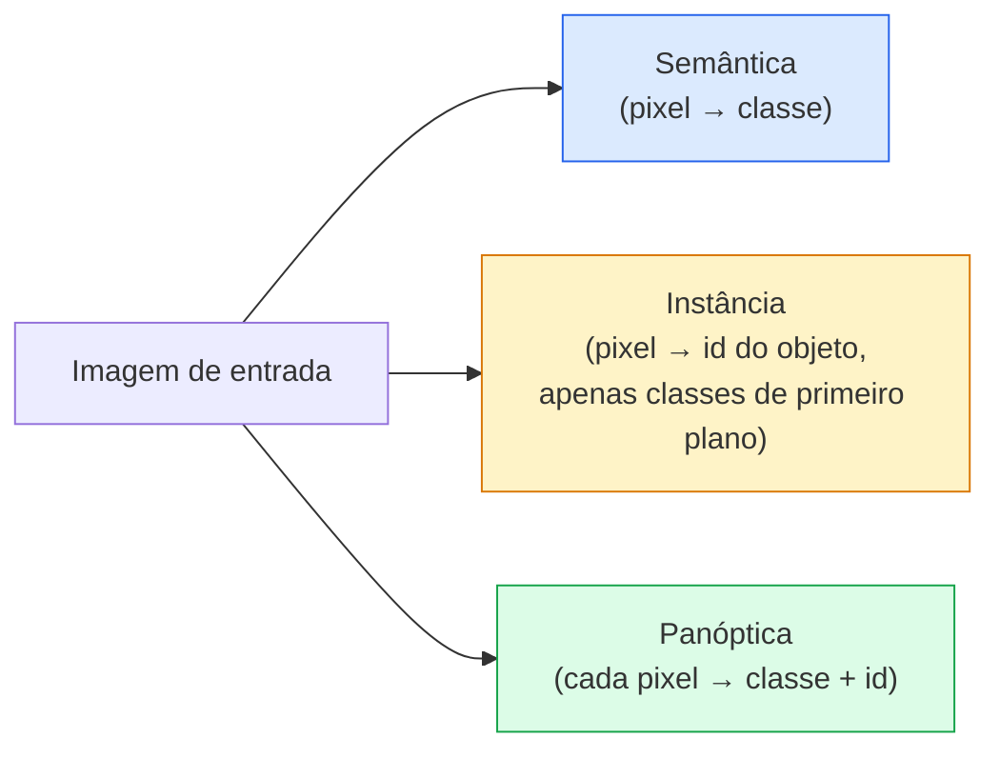
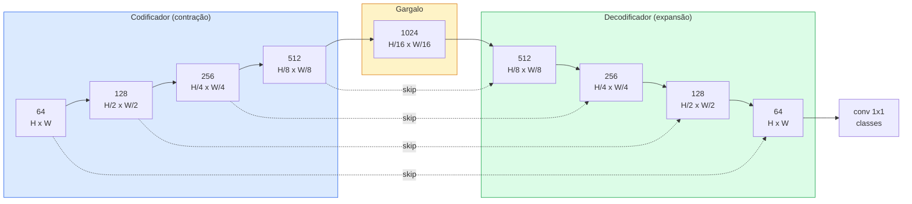

# Segmentação Semântica — U-Net

> Segmentação é classificação em cada pixel. U-Net faz funcionar emparelhando um codificador de subamostragem com um decodificador de superamostragem e conectando conexões skip entre eles.

**Tipo:** Construção
**Linguagens:** Python
**Pré-requisitos:** Phase 4 Lesson 03 (CNNs), Phase 4 Lesson 04 (Classificação de Imagens)
**Tempo:** ~75 minutos

## Objetivos de Aprendizado

- Distinguir segmentação semântica, de instância e panóptica e escolher a tarefa certa para um dado problema
- Construir um U-Net do zero em PyTorch com blocos codificadores, um gargalo, um decodificador com convoluções transpostas e conexões skip
- Implementar cross-entropy pixel a pixel, loss Dice e a loss combinada que é o padrão atual para segmentação médica e industrial
- Ler métricas IoU e Dice por classe e diagnosticar se uma pontuação baixa vem de revocação de objetos pequenos, acurácia de borda ou desbalanceamento de classe

## O Problema

Classificação produz um rótulo por imagem. Detecção produz um punhado de caixas por imagem. Segmentação produz um rótulo por pixel. Para uma entrada de tamanho `H x W`, a saída é um tensor de forma `H x W` (semântica) ou `H x W x N_instancias` (instância). Isso são milhões de predições por imagem, não uma.

A estrutura da segmentação é por que ela alimenta quase todo produto de visão de predição densa: imagens médicas (máscaras de tumor), direção autônoma (estrada, faixa, obstáculo), satélite (pegadas de edifícios, limites de plantações), análise de documentos (zonas de layout), robótica (regiões agaráveis). Nenhuma dessas tarefas pode ser resolvida colocando uma caixa ao redor do objeto; elas precisam da silhueta exata.

O problema arquitetural é simples de enunciar e não simples de resolver: você precisa que a rede veja o contexto global de uma imagem (que tipo de cena é esta) e o detalhe local do pixel (exatamente qual pixel é estrada vs pavimento) simultaneamente. Uma CNN padrão comprime espacialmente para ganhar contexto, o que joga fora o detalhe. U-Net foi o design que conseguiu ambos.

## O Conceito

### Segmentação semântica vs instância vs panóptica



- **Semântica** diz "este pixel é estrada, aquele pixel é carro." Dois carros lado a lado colapsam em uma única mancha.
- **Instância** diz "este pixel é carro #3, aquele pixel é carro #5." Ignora coisas de fundo ("stuff" = céu, estrada, grama).
- **Panóptica** unifica ambas: cada pixel recebe um rótulo de classe, cada instância recebe um id único, stuff e things ambos segmentados.

Esta lição cobre semântica. A próxima lição (Mask R-CNN) cobre instância.

### A forma do U-Net



O codificador reduz pela metade a resolução espacial quatro vezes e dobra os canais. O decodificador reverte: dobra a resolução espacial quatro vezes e reduz os canais pela metade. As conexões skip concatenam características do codificador correspondentes com características do decodificador em cada resolução. A conv final 1x1 mapeia `64 -> num_classes` em resolução total.

Por que conexões skip são necessárias: o decodificador viu apenas mapas de características pequenos quando tenta produzir predições em nível de pixel. Sem os skips, ele não consegue localizar bordas com precisão porque essa informação foi comprimida no codificador. As conexões skip entregam a ele os mapas de características de alta resolução que o codificador computou no caminho de descida.

### Superamostragem transposta vs bilinear

O decodificador precisa expandir dimensões espaciais. Duas opções:

- **Convolução transposta** (`nn.ConvTranspose2d`) — superamostragem aprendível. Padrão histórico do U-Net. Pode produzir artefatos de tabuleiro de xadrez se stride e tamanho do kernel não dividirem uniformemente.
- **Superamostragem bilinear + conv 3x3** — superamostragem suave seguida de uma conv. Menos artefatos, menos parâmetros, agora o padrão moderno.

Ambos aparecem na prática. Para um primeiro U-Net, bilinear é mais seguro.

### Cross-entropy em uma grade de pixels

Para segmentação semântica com C classes, a saída do modelo é `(N, C, H, W)`. O alvo é `(N, H, W)` com IDs de classe inteiros. Cross-entropy é idêntica ao caso de classificação, apenas aplicada em cada posição espacial:

```
Loss = média sobre (n, h, w) de -log( softmax(logits[n, :, h, w])[target[n, h, w]] )
```

`F.cross_entropy` no PyTorch lida com esta forma nativamente. Sem necessidade de reshape.

### Loss Dice e por que você precisa dela

Cross-entropy trata cada pixel igualmente. Isso é errado quando uma classe domina o quadro (imagens médicas: 99% fundo, 1% tumor). A rede pode pontuar 99% de acurácia prevendo fundo em todos os lugares e ainda ser inútil.

Loss Dice resolve isso otimizando diretamente a sobreposição entre a máscara prevista e a verdadeira:

```
Dice(p, y) = 2 * sum(p * y) / (sum(p) + sum(y) + epsilon)
Dice_loss = 1 - Dice
```

onde `p` é o mapa de probabilidade sigmoid/softmax para uma classe e `y` é a máscara binária de verdade. A loss é zero apenas quando a sobreposição é perfeita. Por ser baseada em razão, o desbalanceamento de classe é irrelevante.

Na prática, use a **loss combinada**:

```
L = L_cross_entropy + lambda * L_dice       (lambda ~ 1)
```

Cross-entropy dá gradientes estáveis no início do treino; Dice foca o final do treino em realmente corresponder à forma da máscara. Esta combinação é o padrão em imagens médicas e difícil de superar em qualquer dataset desbalanceado.

### Métricas de avaliação

- **Acurácia de pixel** — percentual de pixels previstos corretamente. Barato. Quebrado em dados desbalanceados pela mesma razão que a acurácia em classificação.
- **IoU por classe** — interseção sobre união para a máscara de cada classe; média entre classes = mIoU.
- **Dice (F1 em pixels)** — similar a IoU; `Dice = 2 * IoU / (1 + IoU)`. Imagens médicas preferem Dice, comunidade de direção prefere IoU; são monotonicamente relacionados.
- **Boundary F1** — mede quão próximas as bordas previstas estão das bordas reais, penalizando mesmo pequenos deslocamentos. Importante para tarefas de alta precisão como inspeção de semicondutores.

Reporte IoU por classe, não apenas mIoU. IoU média esconde uma classe em 15% quando outras nove estão em 85%.

### Trade-off de resolução de entrada

O codificador do U-Net reduz a resolução pela metade quatro vezes, então a entrada deve ser divisível por 16. Imagens médicas são frequentemente 512x512 ou 1024x1024. Cortes de direção autônoma são 2048x1024. O custo de memória do U-Net escala com `H * W * C_max`, e em 1024x1024 com 1024 canais no gargalo, a passagem forward já usa gigabytes de VRAM.

Duas soluções padrão:
1. Dividir a entrada em tiles — processar tiles de 256x256 com sobreposição e costurar.
2. Substituir o gargalo por convoluções dilatadas que mantêm a resolução espacial mais alta mas ampliam o campo receptivo (a família DeepLab).

Para um primeiro modelo, uma entrada 256x256 com um U-Net de base 64 canais treina confortavelmente em 8 GB de VRAM.

## Construa

### Passo 1: Bloco codificador

Duas convs 3x3 com batch norm e ReLU. A primeira conv muda a contagem de canais; a segunda mantém.

```python
import torch
import torch.nn as nn
import torch.nn.functional as F

class DoubleConv(nn.Module):
    def __init__(self, in_c, out_c):
        super().__init__()
        self.net = nn.Sequential(
            nn.Conv2d(in_c, out_c, kernel_size=3, padding=1, bias=False),
            nn.BatchNorm2d(out_c),
            nn.ReLU(inplace=True),
            nn.Conv2d(out_c, out_c, kernel_size=3, padding=1, bias=False),
            nn.BatchNorm2d(out_c),
            nn.ReLU(inplace=True),
        )

    def forward(self, x):
        return self.net(x)
```

Este bloco é reutilizado em toda parte. `bias=False` porque o beta da BN lida com o viés.

### Passo 2: Blocos Down e Up

```python
class Down(nn.Module):
    def __init__(self, in_c, out_c):
        super().__init__()
        self.net = nn.Sequential(
            nn.MaxPool2d(2),
            DoubleConv(in_c, out_c),
        )

    def forward(self, x):
        return self.net(x)


class Up(nn.Module):
    def __init__(self, in_c, out_c):
        super().__init__()
        self.up = nn.Upsample(scale_factor=2, mode="bilinear", align_corners=False)
        self.conv = DoubleConv(in_c, out_c)

    def forward(self, x, skip):
        x = self.up(x)
        if x.shape[-2:] != skip.shape[-2:]:
            x = F.interpolate(x, size=skip.shape[-2:], mode="bilinear", align_corners=False)
        x = torch.cat([skip, x], dim=1)
        return self.conv(x)
```

A verificação de forma apenas espacial (`shape[-2:]`) lida com entradas cujas dimensões não são divisíveis por 16; um `F.interpolate` seguro alinha o tensor antes da concatenação. Comparar a forma completa também dispararia em diferenças de contagem de canais, que devem ser um erro alto, não um interpolate silencioso.

### Passo 3: O U-Net

```python
class UNet(nn.Module):
    def __init__(self, in_channels=3, num_classes=2, base=64):
        super().__init__()
        self.inc = DoubleConv(in_channels, base)
        self.d1 = Down(base, base * 2)
        self.d2 = Down(base * 2, base * 4)
        self.d3 = Down(base * 4, base * 8)
        self.d4 = Down(base * 8, base * 16)
        self.u1 = Up(base * 16 + base * 8, base * 8)
        self.u2 = Up(base * 8 + base * 4, base * 4)
        self.u3 = Up(base * 4 + base * 2, base * 2)
        self.u4 = Up(base * 2 + base, base)
        self.outc = nn.Conv2d(base, num_classes, kernel_size=1)

    def forward(self, x):
        x1 = self.inc(x)
        x2 = self.d1(x1)
        x3 = self.d2(x2)
        x4 = self.d3(x3)
        x5 = self.d4(x4)
        x = self.u1(x5, x4)
        x = self.u2(x, x3)
        x = self.u3(x, x2)
        x = self.u4(x, x1)
        return self.outc(x)

net = UNet(in_channels=3, num_classes=2, base=32)
x = torch.randn(1, 3, 256, 256)
print(f"saída: {net(x).shape}")
print(f"params: {sum(p.numel() for p in net.parameters()):,}")
```

Shape de saída `(1, 2, 256, 256)` — mesmo tamanho espacial da entrada, `num_classes` canais. Cerca de 7.7M parâmetros em `base=32`.

### Passo 4: Losses

```python
def loss_dice(logits, targets, num_classes, eps=1e-6):
    probs = F.softmax(logits, dim=1)
    targets_one_hot = F.one_hot(targets, num_classes).permute(0, 3, 1, 2).float()
    dims = (0, 2, 3)
    interseccao = (probs * targets_one_hot).sum(dim=dims)
    denom = probs.sum(dim=dims) + targets_one_hot.sum(dim=dims)
    dice = (2 * interseccao + eps) / (denom + eps)
    return 1 - dice.mean()


def loss_combinada(logits, targets, num_classes, lam=1.0):
    ce = F.cross_entropy(logits, targets)
    dc = loss_dice(logits, targets, num_classes)
    return ce + lam * dc, {"ce": ce.item(), "dice": dc.item()}
```

Dice é computado por classe e depois calculada a média (macro Dice). O `eps` previne divisão por zero em classes ausentes do lote.

### Passo 5: Métrica IoU

```python
@torch.no_grad()
def iou_por_classe(logits, targets, num_classes):
    preds = logits.argmax(dim=1)
    ious = torch.zeros(num_classes)
    for c in range(num_classes):
        pred_c = (preds == c)
        true_c = (targets == c)
        inter = (pred_c & true_c).sum().float()
        uniao = (pred_c | true_c).sum().float()
        ious[c] = (inter / uniao) if uniao > 0 else torch.tensor(float("nan"))
    return ious
```

Retorna um vetor de comprimento C. `nan` marca classes ausentes do lote — não faça a média sobre elas ao computar mIoU.

### Passo 6: Dataset sintético para verificação ponta a ponta

Gere formas em fundos coloridos para que a rede tenha que aprender forma, não cor de pixel.

```python
import numpy as np
from torch.utils.data import Dataset, DataLoader

def segmentacao_sintetica(num_amostras=200, size=64, seed=0):
    rng = np.random.default_rng(seed)
    images = np.zeros((num_amostras, size, size, 3), dtype=np.float32)
    masks = np.zeros((num_amostras, size, size), dtype=np.int64)
    for i in range(num_amostras):
        bg = rng.uniform(0, 1, (3,))
        images[i] = bg
        masks[i] = 0
        num_formas = rng.integers(1, 4)
        for _ in range(num_formas):
            cls = int(rng.integers(1, 3))
            cor = rng.uniform(0, 1, (3,))
            cx, cy = rng.integers(10, size - 10, size=2)
            r = int(rng.integers(4, 12))
            yy, xx = np.meshgrid(np.arange(size), np.arange(size), indexing="ij")
            if cls == 1:
                mask = (xx - cx) ** 2 + (yy - cy) ** 2 < r ** 2
            else:
                mask = (np.abs(xx - cx) < r) & (np.abs(yy - cy) < r)
            images[i][mask] = cor
            masks[i][mask] = cls
        images[i] += rng.normal(0, 0.02, images[i].shape)
        images[i] = np.clip(images[i], 0, 1)
    return images, masks


class SegDataset(Dataset):
    def __init__(self, images, masks):
        self.images = images
        self.masks = masks

    def __len__(self):
        return len(self.images)

    def __getitem__(self, i):
        img = torch.from_numpy(self.images[i]).permute(2, 0, 1).float()
        mask = torch.from_numpy(self.masks[i]).long()
        return img, mask
```

Três classes: fundo (0), círculos (1), quadrados (2). A rede deve aprender a distinguir forma.

### Passo 7: Loop de treinamento

```python
def treinar_uma_epoca(model, loader, optimizer, device, num_classes):
    model.train()
    sum_loss, total = 0.0, 0
    sum_iou = torch.zeros(num_classes)
    for x, y in loader:
        x, y = x.to(device), y.to(device)
        logits = model(x)
        loss, _ = loss_combinada(logits, y, num_classes)
        optimizer.zero_grad()
        loss.backward()
        optimizer.step()
        sum_loss += loss.item() * x.size(0)
        total += x.size(0)
        sum_iou += iou_por_classe(logits, y, num_classes).nan_to_num(0)
    return sum_loss / total, sum_iou / len(loader)
```

Execute isso por 10-30 épocas no dataset sintético e veja o mIoU subir acima de 0.9 para as classes de forma. Note que `nan_to_num(0)` trata classes ausentes de um lote como zero; para IoU por classe preciso, mascare por presença e use `torch.nanmean` entre lotes no momento da avaliação em vez de fazer a média aqui.

## Use

Para produção, `segmentation_models_pytorch` ("smp") encapsula toda arquitetura de segmentação padrão com qualquer backbone torchvision ou timm. Três linhas:

```python
import segmentation_models_pytorch as smp

model = smp.Unet(
    encoder_name="resnet34",
    encoder_weights="imagenet",
    in_channels=3,
    classes=3,
)
```

Também vale a pena conhecer para trabalho real:
- **DeepLabV3+** substitui a subamostragem baseada em max-pool por convs dilatadas para que o gargalo mantenha resolução; bordas mais rápidas em dados de satélite e direção.
- **SegFormer** troca o codificador conv por um transformer hierárquico; SOTA atual em muitos benchmarks.
- **Mask2Former** / **OneFormer** unificam segmentação semântica, de instância e panóptica em uma única arquitetura.

Todos os três são substituições diretas em `smp` ou `transformers` com o mesmo data loader.

## Entregue

Esta lição produz:

- `outputs/prompt-segmentation-task-picker.md` — um prompt que escolhe entre segmentação semântica, de instância e panóptica e nomeia a arquitetura para uma dada tarefa.
- `outputs/skill-segmentation-mask-inspector.md` — uma skill que reporta distribuição de classe, estatísticas de máscara prevista e as classes que são subprevistas ou com borda borrada.

## Exercícios

1. **(Fácil)** Implemente `bce_dice_loss` para uma tarefa de segmentação binária (primeiro plano vs fundo). Verifique em um dataset sintético de duas classes que a loss combinada converge mais rápido que BCE sozinha quando o primeiro plano é 5% dos pixels.
2. **(Médio)** Substitua o bloco Up `nn.Upsample + conv` por um bloco Up `nn.ConvTranspose2d`. Treine ambos no dataset sintético e compare mIoU. Observe onde artefatos de tabuleiro de xadrez aparecem na versão com convolução transposta.
3. **(Difícil)** Pegue um dataset de segmentação real (Oxford-IIIT Pets, Cityscapes mini split ou um subconjunto médico) e treine o U-Net dentro de 2 pontos de IoU da referência `smp.Unet`. Reporte IoU por classe e identifique quais classes se beneficiam mais de adicionar Dice à loss.

## Termos-Chave

| Termo | O que as pessoas dizem | O que realmente significa |
|-------|------------------------|---------------------------|
| Segmentação semântica | "Rotular cada pixel" | Classificação por pixel em C classes; instâncias da mesma classe se fundem |
| Segmentação de instância | "Rotular cada objeto" | Separa instâncias distintas da mesma classe; apenas primeiro plano |
| Segmentação panóptica | "Semântica + instância" | Cada pixel recebe uma classe; cada instância thing também recebe um id único |
| Conexão skip | "Ponte U-Net" | Concatenação de características do codificador em características do decodificador de resolução correspondente; preserva detalhes de alta frequência |
| Conv transposta | "Deconvolução" | Superamostragem aprendível; pode produzir artefatos de tabuleiro de xadrez |
| Loss Dice | "Loss de sobreposição" | 1 - 2|A ∩ B| / (|A| + |B|); otimiza a sobreposição da máscara diretamente e é robusta ao desbalanceamento de classe |
| mIoU | "Mean intersection over union" | IoU média entre classes; a métrica padrão da comunidade para segmentação |
| Boundary F1 | "Acurácia de borda" | Pontuação F1 computada apenas em pixels de borda; importante para tarefas críticas de precisão |

## Leitura Complementar

- [U-Net: Convolutional Networks for Biomedical Image Segmentation (Ronneberger et al., 2015)](https://arxiv.org/abs/1505.04597) — o paper original; a figura que todos copiam está na página 2
- [Fully Convolutional Networks (Long et al., 2015)](https://arxiv.org/abs/1411.4038) — o paper que primeiro tornou a segmentação um problema de conv ponta a ponta
- [segmentation_models_pytorch](https://github.com/qubvel/segmentation_models.pytorch) — a referência para segmentação em produção; toda arquitetura padrão mais toda loss padrão
- [Lessons learned from training SOTA segmentation (kaggle.com competitions)](https://www.kaggle.com/code/iafoss/carvana-unet-pytorch) — um passo a passo de por que TTA, pseudo-labeling e pesos de classe importam em dados reais
