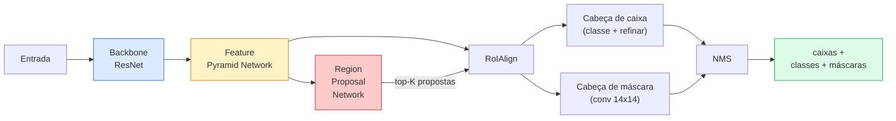

# Segmentação de Instância — Mask R-CNN

> Adicione um pequeno ramo de máscara a um detector Faster R-CNN e você tem segmentação de instância. A parte difícil é o RoIAlign, e é mais difícil do que parece.

**Tipo:** Construir + Aprender
**Linguagens:** Python
**Pré-requisitos:** Phase 4 Lesson 06 (YOLO), Phase 4 Lesson 07 (U-Net)
**Tempo:** ~75 minutos

## Objetivos de Aprendizado

- Traçar a arquitetura Mask R-CNN ponta a ponta: backbone, FPN, RPN, RoIAlign, cabeça de caixa, cabeça de máscara
- Implementar RoIAlign do zero e explicar por que RoIPool não é mais usado
- Usar o modelo pré-treinado `maskrcnn_resnet50_fpn_v2` do torchvision para máscaras de instância de qualidade de produção e ler seu formato de saída corretamente
- Ajustar fino Mask R-CNN em um pequeno dataset personalizado substituindo as cabeças de caixa e máscara e mantendo o backbone congelado

## O Problema

Segmentação semântica te dá uma máscara por classe. Segmentação de instância te dá uma máscara por objeto, mesmo quando dois objetos compartilham uma classe. Contar indivíduos, rastrear entre quadros e medir coisas (a caixa delimitadora de cada tijolo em uma parede, cada célula em uma imagem de microscópio) tudo exige segmentação de instância.

Mask R-CNN (He et al., 2017) resolveu isso reformulando a segmentação de instância como detecção-mais-uma-máscara. O design foi tão limpo que pelos próximos cinco anos quase todo paper de segmentação de instância foi uma variante do Mask R-CNN, e a implementação do torchvision ainda é o padrão de produção para datasets pequenos e médios.

O problema difícil de engenharia é a amostragem: como você recorta uma região de características de tamanho fixo de uma caixa de proposta cujos cantos não se alinham com as bordas dos pixels? Errar isso custa décimos de um ponto de mAP em todos os lugares. RoIAlign é a resposta.

## O Conceito

### A arquitetura



Cinco peças para entender:

1. **Backbone** — ResNet-50 ou ResNet-101 treinado na ImageNet. Produz uma hierarquia de mapas de características em strides 4, 8, 16, 32.
2. **FPN (Feature Pyramid Network)** — conexões top-down + laterais que dão a cada nível C canais de características ricas em semântica. A detecção consulta o nível FPN que corresponde ao tamanho do objeto.
3. **RPN (Region Proposal Network)** — uma pequena cabeça convolucional que, em cada posição de âncora, prevê "há um objeto aqui?" e "como refino a caixa?". Produz ~1000 propostas por imagem.
4. **RoIAlign** — amostra um patch de características de tamanho fixo (e.g. 7x7) de qualquer caixa em qualquer nível FPN. Amostragem bilinear, sem quantização.
5. **Cabeças** — cabeça de caixa de duas camadas que refina a caixa e escolhe uma classe, mais uma pequena cabeça convolucional que produz uma máscara binária `28x28` para cada proposta.

### Por que RoIAlign, não RoIPool

O Fast R-CNN original usava RoIPool, que divide uma caixa de proposta em uma grade, pega o máximo de características em cada célula e arredonda todas as coordenadas para inteiros. Esse arredondamento desalinha o mapa de características das coordenadas de pixel de entrada em até um pixel completo do mapa de características — pequeno em uma imagem 224x224, catastrófico quando o mapa de características tem stride 32.

```
RoIPool:
  caixa (34.7, 51.3, 98.2, 142.9)
  arredondar -> (34, 51, 98, 142)
  dividir grade -> arredondar cada limite de célula
  desalinhamento acumula a cada passo

RoIAlign:
  caixa (34.7, 51.3, 98.2, 142.9)
  amostrar nas coordenadas float exatas usando interpolação bilinear
  sem arredondamento em nenhum lugar
```

RoIAlign eleva o AP de máscara em 3-4 pontos no COCO de graça. Todo detector que se importa com localização agora o usa — YOLOv7 seg, RT-DETR, Mask2Former igualmente.

### O RPN em um parágrafo

Em cada posição de um mapa de características, coloque K caixas âncora de diferentes tamanhos e formas. Preveja uma pontuação de objetidade para cada âncora e um deslocamento de regressão para transformar a âncora em uma caixa melhor ajustada. Mantenha as ~1000 melhores caixas por pontuação, aplique NMS em IoU 0.7 e entregue as sobreviventes às cabeças. O RPN é treinado com sua própria mini-loss — a mesma estrutura da loss YOLO da Lição 6, apenas com duas classes (objeto / sem objeto).

### A cabeça de máscara

Para cada proposta (após RoIAlign), a cabeça de máscara é uma pequena FCN: quatro convs 3x3, uma deconv 2x, uma conv final 1x1 que produz `num_classes` canais de saída em resolução `28x28`. Apenas o canal correspondente à classe prevista é mantido; os outros são ignorados. Isso desacopla a predição de máscara da classificação.

Superamostre a máscara 28x28 para o tamanho de pixel original da proposta para produzir a máscara binária final.

### Losses

Mask R-CNN tem quatro losses somadas:

```
L = L_rpn_cls + L_rpn_box + L_box_cls + L_box_reg + L_mask
```

- `L_rpn_cls`, `L_rpn_box` — objetidade + regressão de caixa para as propostas do RPN.
- `L_box_cls` — cross-entropy sobre (C+1) classes (incluindo fundo) no classificador da cabeça.
- `L_box_reg` — smooth L1 no refinamento de caixa da cabeça.
- `L_mask` — binary cross-entropy por pixel na saída da máscara 28x28.

Cada loss tem seu próprio peso padrão; a implementação do torchvision os expõe como argumentos do construtor.

### Formato de saída

`torchvision.models.detection.maskrcnn_resnet50_fpn_v2` retorna uma lista de dicionários, um por imagem:

```
{
    "boxes":  (N, 4) em coordenadas de pixel (x1, y1, x2, y2),
    "labels": (N,) IDs de classe, 0 = fundo então índices são baseados em 1,
    "scores": (N,) pontuações de confiança,
    "masks":  (N, 1, H, W) máscaras float em [0, 1] — limiarize em 0.5 para binário,
}
```

A máscara já está em resolução de imagem completa. A saída da cabeça 28x28 foi superamostrada internamente.

## Construa

### Passo 1: RoIAlign do zero

Este é o único componente do Mask R-CNN que é mais simples de entender como código do que como prosa.

```python
import torch
import torch.nn.functional as F

def roi_align_unico(feature, caixa, output_size=7, spatial_scale=1 / 16.0):
    """
    feature: (C, H, W) mapa de características de imagem única
    caixa: (x1, y1, x2, y2) em coordenadas de pixel da imagem original
    output_size: lado da grade de saída (7 para cabeça de caixa, 14 para cabeça de máscara)
    spatial_scale: recíproco do stride do mapa de características
    """
    C, H, W = feature.shape
    x1, y1, x2, y2 = [c * spatial_scale - 0.5 for c in caixa]
    bin_w = (x2 - x1) / output_size
    bin_h = (y2 - y1) / output_size

    grid_y = torch.linspace(y1 + bin_h / 2, y2 - bin_h / 2, output_size)
    grid_x = torch.linspace(x1 + bin_w / 2, x2 - bin_w / 2, output_size)
    yy, xx = torch.meshgrid(grid_y, grid_x, indexing="ij")

    gx = 2 * (xx + 0.5) / W - 1
    gy = 2 * (yy + 0.5) / H - 1
    grid = torch.stack([gx, gy], dim=-1).unsqueeze(0)
    amostrado = F.grid_sample(feature.unsqueeze(0), grid, mode="bilinear",
                              align_corners=False)
    return amostrado.squeeze(0)
```

Cada número está em uma posição amostrada bilinearmente. Sem arredondamento, sem quantização, sem gradientes perdidos.

### Passo 2: Comparar com o RoIAlign do torchvision

```python
from torchvision.ops import roi_align

feature = torch.randn(1, 16, 50, 50)
caixas = torch.tensor([[0, 10, 20, 100, 90]], dtype=torch.float32)  # (batch_idx, x1, y1, x2, y2)

nosso = roi_align_unico(feature[0], caixas[0, 1:].tolist(), output_size=7, spatial_scale=1/4)
deles = roi_align(feature, caixas, output_size=(7, 7), spatial_scale=1/4, sampling_ratio=1, aligned=True)[0]

print(f"shape nosso:   {tuple(nosso.shape)}")
print(f"shape deles: {tuple(deles.shape)}")
print(f"max|diff|:    {(nosso - deles).abs().max().item():.3e}")
```

Com `sampling_ratio=1` e `aligned=True`, os dois correspondem dentro de `1e-5`.

### Passo 3: Carregar um Mask R-CNN pré-treinado

```python
import torch
from torchvision.models.detection import maskrcnn_resnet50_fpn_v2, MaskRCNN_ResNet50_FPN_V2_Weights

model = maskrcnn_resnet50_fpn_v2(weights=MaskRCNN_ResNet50_FPN_V2_Weights.DEFAULT)
model.eval()
print(f"params: {sum(p.numel() for p in model.parameters()):,}")
print(f"classes (incluindo fundo): {len(model.roi_heads.box_predictor.cls_score.out_features * [0])}")
```

46M parâmetros, 91 classes (COCO). A primeira classe (id 0) é fundo; tudo que o modelo realmente detecta começa no id 1.

### Passo 4: Executar inferência

```python
with torch.no_grad():
    x = torch.randn(3, 400, 600)
    predictions = model([x])
p = predictions[0]
print(f"caixas:  {tuple(p['boxes'].shape)}")
print(f"rótulos: {tuple(p['labels'].shape)}")
print(f"pontuações: {tuple(p['scores'].shape)}")
print(f"máscaras:  {tuple(p['masks'].shape)}")
```

O tensor de máscara tem shape `(N, 1, H, W)`. Limiarize em 0.5 para obter uma máscara binária por objeto:

```python
mascaras_binarias = (p['masks'] > 0.5).squeeze(1)  # (N, H, W) booleano
```

### Passo 5: Trocar as cabeças para uma contagem de classes personalizada

A receita comum de fine-tuning: reutilizar o backbone, FPN e RPN; substituir as duas cabeças classificadoras.

```python
from torchvision.models.detection.faster_rcnn import FastRCNNPredictor
from torchvision.models.detection.mask_rcnn import MaskRCNNPredictor

def construir_maskrcnn_personalizado(num_classes):
    model = maskrcnn_resnet50_fpn_v2(weights=MaskRCNN_ResNet50_FPN_V2_Weights.DEFAULT)
    in_features = model.roi_heads.box_predictor.cls_score.in_features
    model.roi_heads.box_predictor = FastRCNNPredictor(in_features, num_classes)
    in_features_mask = model.roi_heads.mask_predictor.conv5_mask.in_channels
    hidden_layer = 256
    model.roi_heads.mask_predictor = MaskRCNNPredictor(in_features_mask, hidden_layer, num_classes)
    return model

custom = construir_maskrcnn_personalizado(num_classes=5)
print(f"custom cls_score.out_features: {custom.roi_heads.box_predictor.cls_score.out_features}")
```

`num_classes` deve incluir a classe de fundo, então um dataset com 4 classes de objeto usa `num_classes=5`.

### Passo 6: Congelar o que não precisa de treinamento

Em datasets pequenos, congele o backbone e o FPN. Apenas a objetidade + regressão do RPN e as duas cabeças aprendem.

```python
def congelar_backbone_e_fpn(model):
    # O Mask R-CNN do torchvision empacota o FPN dentro de `model.backbone` (como
    # `model.backbone.fpn`), então iterar `model.backbone.parameters()` cobre
    # tanto as camadas de características ResNet quanto as convs laterais/de saída do FPN.
    for p in model.backbone.parameters():
        p.requires_grad = False
    return model

custom = congelar_backbone_e_fpn(custom)
treinavel = sum(p.numel() for p in custom.parameters() if p.requires_grad)
print(f"treinável após congelamento: {treinavel:,}")
```

Em datasets de 500 imagens, esta é a diferença entre convergência e overfitting.

## Use

O loop de treinamento completo para Mask R-CNN em torchvision tem 40 linhas e não muda significativamente entre tarefas — troque datasets e vá.

```python
def passo_treino(model, images, targets, optimizer):
    model.train()
    loss_dict = model(images, targets)
    losses = sum(loss for loss in loss_dict.values())
    optimizer.zero_grad()
    losses.backward()
    optimizer.step()
    return {k: v.item() for k, v in loss_dict.items()}
```

A lista `targets` deve ter dicionários por imagem com `boxes`, `labels` e `masks` (como tensores binários `(num_instances, H, W)`). O modelo retorna um dicionário de quatro losses durante o treino e uma lista de predições durante a avaliação, chaveado por `model.training`.

O avaliador `pycocotools` produz mAP@IoU=0.5:0.95 tanto para caixas quanto para máscaras; você precisa de ambos os números para saber se a cabeça de caixa ou a cabeça de máscara é o gargalo.

## Entregue

Esta lição produz:

- `outputs/prompt-instance-vs-semantic-router.md` — um prompt que faz três perguntas e escolhe instância vs semântica vs panóptica mais o modelo exato para começar.
- `outputs/skill-mask-rcnn-head-swapper.md` — uma skill que gera as 10 linhas de código para trocar cabeças em qualquer modelo de detecção do torchvision, dado o novo `num_classes`.

## Exercícios

1. **(Fácil)** Verifique seu RoIAlign contra `torchvision.ops.roi_align` em 100 caixas aleatórias. Reporte a diferença absoluta máxima. Execute também RoIPool (comportamento pré-2017) e mostre que ele diverge em ~1-2 pixels do mapa de características em caixas próximas à borda.
2. **(Médio)** Ajuste fino `maskrcnn_resnet50_fpn_v2` em um dataset personalizado de 50 imagens (quaisquer duas classes: balões, peixes, buracos, logotipos). Congele o backbone, treine por 20 épocas, reporte mask AP@0.5.
3. **(Difícil)** Substitua a cabeça de máscara do Mask R-CNN por uma que prevê em 56x56 em vez de 28x28. Meça mAP@IoU=0.75 antes e depois. Explique por que o ganho (ou a falta dele) corresponde ao trade-off esperado de precisão de borda / memória.

## Termos-Chave

| Termo | O que as pessoas dizem | O que realmente significa |
|-------|------------------------|---------------------------|
| Mask R-CNN | "Detecção mais máscaras" | Faster R-CNN + uma pequena cabeça FCN que prevê uma máscara 28x28 por proposta por classe |
| FPN | "Pirâmide de características" | Conexões top-down + laterais que dão a cada nível de stride C canais de características ricas em semântica |
| RPN | "Propositor de regiões" | Uma pequena cabeça convolucional que produz ~1000 propostas objeto/não-objeto por imagem |
| RoIAlign | "Recorte sem arredondamento" | Amostra bilinearmente uma grade de características de tamanho fixo de qualquer caixa com coordenadas float |
| RoIPool | "Recorte pré-2017" | Mesmo propósito que RoIAlign mas arredonda coordenadas de caixa; obsoleto |
| Mask AP | "mAP de instância" | Average precision computada com IoU de máscara em vez de IoU de caixa; a métrica COCO de segmentação de instância |
| Cabeça de máscara binária | "Máscara por classe" | Prevê uma máscara binária por classe para cada proposta; apenas o canal da classe prevista é mantido |
| Classe de fundo | "Classe 0" | A classe "sem objeto" geral; índices para classes reais começam em 1 |

## Leitura Complementar

- [Mask R-CNN (He et al., 2017)](https://arxiv.org/abs/1703.06870) — o paper; a seção 3 sobre RoIAlign é a leitura crítica
- [FPN: Feature Pyramid Networks (Lin et al., 2017)](https://arxiv.org/abs/1612.03144) — o paper do FPN; todo detector moderno o usa
- [torchvision Mask R-CNN tutorial](https://pytorch.org/tutorials/intermediate/torchvision_tutorial.html) — a referência para o loop de fine-tuning
- [Detectron2 model zoo](https://github.com/facebookresearch/detectron2/blob/main/MODEL_ZOO.md) — implementações de produção com pesos treinados para quase toda variante de detecção e segmentação
