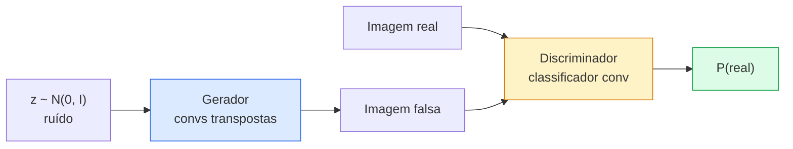
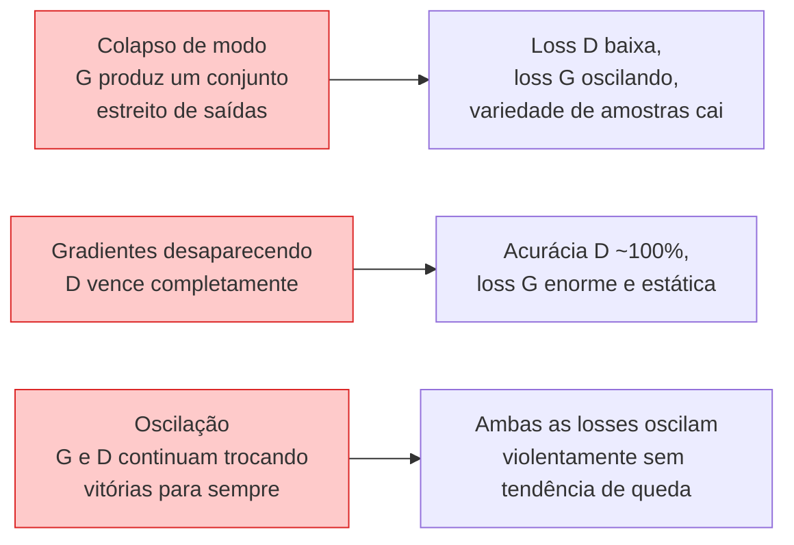

# Geração de Imagens — GANs

> Uma GAN são duas redes neurais em um jogo fixo. Uma desenha, uma critica. Elas melhoram juntas até que os desenhos enganem a crítica.

**Tipo:** Construção
**Linguagens:** Python
**Pré-requisitos:** Phase 4 Lesson 03 (CNNs), Phase 3 Lesson 06 (Otimizadores), Phase 3 Lesson 07 (Regularização)
**Tempo:** ~75 minutos

## Objetivos de Aprendizado

- Explicar o jogo minimax entre gerador e discriminador e por que o equilíbrio corresponde a p_modelo = p_dados
- Implementar uma DCGAN em PyTorch e fazê-la gerar imagens sintéticas 32x32 coerentes em menos de 60 linhas
- Estabilizar o treinamento de GANs com os três truques padrão: loss não saturante, norma espectral, TTUR (two-timescale update rule)
- Ler curvas de treino que distinguem convergência saudável de colapso de modo, oscilação e discriminador-vence-completamente

## O Problema

Classificação ensina uma rede a mapear imagens para rótulos. Geração inverte o problema: amostrar novas imagens que parecem vir da mesma distribuição. Não há saída "correta" contra a qual você possa comparar; há apenas uma distribuição que você quer imitar.

As funções de loss padrão (MSE, cross-entropy) não conseguem medir "esta amostra veio da distribuição real?" Minimizar o erro por pixel produz médias borradas, não amostras realistas. O avanço foi aprender a loss: treinar uma segunda rede cujo trabalho é dizer real de falso, e usar seu julgamento para empurrar o gerador.

GANs (Goodfellow et al., 2014) definiram esse framework. Em 2018, StyleGAN estava produzindo rostos 1024x1024 indistinguíveis de fotografias. Modelos de difusão desde então tomaram o trono em qualidade e controlabilidade, mas todo truque que torna a difusão prática — escolhas de normalização, espaços latentes, losses de características — foi primeiro compreendido em GANs.

## O Conceito

### As duas redes



O **gerador** G pega um vetor de ruído `z` e produz uma imagem. O **discriminador** D pega uma imagem e produz um único escalar: a probabilidade de a imagem ser real.

### O jogo

G quer que D esteja errado. D quer estar certo. Formalmente:

```
min_G max_D  E_x[log D(x)] + E_z[log(1 - D(G(z)))]
```

Leia da direita para a esquerda: D está maximizando a acurácia em imagens reais (`log D(real)`) e falsas (`log (1 - D(fake))`). G está minimizando a acurácia de D em falsas — ele quer que `D(G(z))` seja alto.

Goodfellow provou que este minimax tem um equilíbrio global onde `p_G = p_data`, D produz 0.5 em todos os lugares, e a divergência Jensen-Shannon entre as distribuições gerada e real é zero. A parte difícil é chegar lá.

### Loss não saturante

A forma acima é numericamente instável. No início do treino, `D(G(z))` está perto de zero para cada falsa, então `log(1 - D(G(z)))` tem gradientes que desaparecem com relação a G. A correção: inverter a loss de G.

```
L_D = -E_x[log D(x)] - E_z[log(1 - D(G(z)))]
L_G = -E_z[log D(G(z))]                          # não saturante
```

Agora quando `D(G(z))` está perto de zero, a loss de G é grande e seu gradiente é informativo. Toda GAN moderna treina com esta variante.

### Regras de arquitetura DCGAN

Radford, Metz, Chintala (2015) destilaram anos de experimentos fracassados em cinco regras que tornam o treinamento de GAN estável:

1. Substituir pooling por convs com stride (ambas as redes).
2. Usar batch norm tanto no gerador quanto no discriminador, exceto na saída de G e entrada de D.
3. Remover camadas totalmente conectadas em arquiteturas mais profundas.
4. G usa ReLU em todas as camadas exceto saída (tanh para saída em [-1, 1]).
5. D usa LeakyReLU (negative_slope=0.2) em todas as camadas.

Toda GAN convolucional moderna (StyleGAN, BigGAN, GigaGAN) ainda começa dessas regras e substitui peças uma de cada vez.

### Modos de falha e suas assinaturas



- **Colapso de modo**: G encontra uma imagem que engana D e produz apenas aquela. Correção: adicionar discriminação de minibatch, norma espectral ou condicionamento de rótulo.
- **Discriminador vence**: D se torna forte demais rápido demais, os gradientes de G desaparecem. Correção: D menor, LR menor de D, ou aplicar label smoothing nos rótulos reais.
- **Oscilação**: as duas redes trocam vitórias sem nunca se aproximar do equilíbrio. Correção: TTUR (D aprende mais rápido que G por um fator de 2-4), ou mudar para loss Wasserstein.

### Avaliação

GANs não têm verdade fundamental, então como você sabe se estão funcionando?

- **Inspeção de amostras** — basta olhar 64 amostras ao final de cada época. Inegociável.
- **FID (Fréchet Inception Distance)** — distância entre as distribuições de características do Inception-v3 dos conjuntos real e gerado. Menor é melhor. Padrão da comunidade.
- **Inception Score** — mais antigo, mais frágil; prefira FID.
- **Precision/Recall para modelos generativos** — mede qualidade (precisão) e cobertura (revocação) separadamente. Mais informativo que FID sozinho.

Para uma execução pequena em dados sintéticos, inspeção de amostras é suficiente.

## Construa

### Passo 1: Gerador

Um pequeno gerador DCGAN que pega ruído 64-dim e produz uma imagem 32x32.

```python
import torch
import torch.nn as nn

class Gerador(nn.Module):
    def __init__(self, z_dim=64, img_channels=3, feat=64):
        super().__init__()
        self.net = nn.Sequential(
            nn.ConvTranspose2d(z_dim, feat * 4, kernel_size=4, stride=1, padding=0, bias=False),
            nn.BatchNorm2d(feat * 4),
            nn.ReLU(inplace=True),
            nn.ConvTranspose2d(feat * 4, feat * 2, kernel_size=4, stride=2, padding=1, bias=False),
            nn.BatchNorm2d(feat * 2),
            nn.ReLU(inplace=True),
            nn.ConvTranspose2d(feat * 2, feat, kernel_size=4, stride=2, padding=1, bias=False),
            nn.BatchNorm2d(feat),
            nn.ReLU(inplace=True),
            nn.ConvTranspose2d(feat, img_channels, kernel_size=4, stride=2, padding=1, bias=False),
            nn.Tanh(),
        )

    def forward(self, z):
        return self.net(z.view(z.size(0), -1, 1, 1))
```

Quatro convs transpostas, cada uma com `kernel_size=4, stride=2, padding=1` para que dobrem limpidamente o tamanho espacial. Ativações de saída em [-1, 1] via tanh.

### Passo 2: Discriminador

Espelho do gerador. LeakyReLU, convs com stride, termina com um logit escalar.

```python
class Discriminador(nn.Module):
    def __init__(self, img_channels=3, feat=64):
        super().__init__()
        self.net = nn.Sequential(
            nn.Conv2d(img_channels, feat, kernel_size=4, stride=2, padding=1),
            nn.LeakyReLU(0.2, inplace=True),
            nn.Conv2d(feat, feat * 2, kernel_size=4, stride=2, padding=1, bias=False),
            nn.BatchNorm2d(feat * 2),
            nn.LeakyReLU(0.2, inplace=True),
            nn.Conv2d(feat * 2, feat * 4, kernel_size=4, stride=2, padding=1, bias=False),
            nn.BatchNorm2d(feat * 4),
            nn.LeakyReLU(0.2, inplace=True),
            nn.Conv2d(feat * 4, 1, kernel_size=4, stride=1, padding=0),
        )

    def forward(self, x):
        return self.net(x).view(-1)
```

A última conv reduz um mapa de características `4x4` para `1x1`. A saída é um único escalar por imagem; aplique sigmoid apenas durante o cálculo da loss.

### Passo 3: Passo de treinamento

Alternar: atualize D uma vez, depois G uma vez, a cada lote.

```python
import torch.nn.functional as F

def passo_treino(G, D, real, z, opt_g, opt_d, device):
    real = real.to(device)
    bs = real.size(0)

    # Passo D
    opt_d.zero_grad()
    d_real = D(real)
    d_fake = D(G(z).detach())
    loss_d = (F.binary_cross_entropy_with_logits(d_real, torch.ones_like(d_real))
              + F.binary_cross_entropy_with_logits(d_fake, torch.zeros_like(d_fake)))
    loss_d.backward()
    opt_d.step()

    # Passo G
    opt_g.zero_grad()
    d_fake = D(G(z))
    loss_g = F.binary_cross_entropy_with_logits(d_fake, torch.ones_like(d_fake))
    loss_g.backward()
    opt_g.step()

    return loss_d.item(), loss_g.item()
```

`G(z).detach()` no passo D é crítico: não queremos gradientes fluindo para G durante sua atualização. Esquecer disso é o bug clássico de iniciante.

### Passo 4: Loop de treinamento completo em formas sintéticas

```python
from torch.utils.data import DataLoader, TensorDataset
import numpy as np

def imagens_sinteticas(num=2000, size=32, seed=0):
    rng = np.random.default_rng(seed)
    imgs = np.zeros((num, 3, size, size), dtype=np.float32) - 1.0
    for i in range(num):
        r = rng.uniform(6, 12)
        cx, cy = rng.uniform(r, size - r, size=2)
        yy, xx = np.meshgrid(np.arange(size), np.arange(size), indexing="ij")
        mask = (xx - cx) ** 2 + (yy - cy) ** 2 < r ** 2
        cor = rng.uniform(-0.5, 1.0, size=3)
        for c in range(3):
            imgs[i, c][mask] = cor[c]
    return torch.from_numpy(imgs)

device = "cuda" if torch.cuda.is_available() else "cpu"
dados = imagens_sinteticas()
loader = DataLoader(TensorDataset(dados), batch_size=64, shuffle=True)

G = Gerador(z_dim=64, img_channels=3, feat=32).to(device)
D = Discriminador(img_channels=3, feat=32).to(device)
opt_g = torch.optim.Adam(G.parameters(), lr=2e-4, betas=(0.5, 0.999))
opt_d = torch.optim.Adam(D.parameters(), lr=2e-4, betas=(0.5, 0.999))

for epoch in range(10):
    for (batch,) in loader:
        z = torch.randn(batch.size(0), 64, device=device)
        ld, lg = passo_treino(G, D, batch, z, opt_g, opt_d, device)
    print(f"época {epoch}  D {ld:.3f}  G {lg:.3f}")
```

`Adam(lr=2e-4, betas=(0.5, 0.999))` é o padrão DCGAN — o beta1 baixo impede que o termo de momentum estabilize demais o jogo adversarial.

### Passo 5: Amostragem

```python
@torch.no_grad()
def amostrar(G, n=16, z_dim=64, device="cpu"):
    G.eval()
    z = torch.randn(n, z_dim, device=device)
    imgs = G(z)
    imgs = (imgs + 1) / 2
    return imgs.clamp(0, 1)
```

Sempre mude para modo eval antes de amostrar. Para DCGAN isso importa porque as estatísticas correntes de batch norm são usadas em vez das estatísticas do lote.

### Passo 6: Normalização espectral

Uma substituição direta para BN no discriminador que garante que a rede seja 1-Lipschitz. Corrige a maioria das falhas "D vence com força demais".

```python
from torch.nn.utils import spectral_norm

def construir_discriminador_sn(img_channels=3, feat=64):
    return nn.Sequential(
        spectral_norm(nn.Conv2d(img_channels, feat, 4, 2, 1)),
        nn.LeakyReLU(0.2, inplace=True),
        spectral_norm(nn.Conv2d(feat, feat * 2, 4, 2, 1)),
        nn.LeakyReLU(0.2, inplace=True),
        spectral_norm(nn.Conv2d(feat * 2, feat * 4, 4, 2, 1)),
        nn.LeakyReLU(0.2, inplace=True),
        spectral_norm(nn.Conv2d(feat * 4, 1, 4, 1, 0)),
    )
```

Troque `Discriminador` por `construir_discriminador_sn()` e você frequentemente não precisa do truque TTUR. A norma espectral é a atualização de robustez única mais fácil que você pode aplicar.

## Use

Para geração séria, use pesos pré-treinados ou mude para difusão. Duas bibliotecas padrão:

- `torch_fidelity` computa FID / IS no seu gerador sem escrever código de avaliação personalizado.
- `pytorch-gan-zoo` (legado) e `StudioGAN` oferecem implementações testadas de DCGAN, WGAN-GP, SN-GAN, StyleGAN e BigGAN.

Em 2026, GANs ainda são a melhor escolha para: geração de imagens em tempo real (latência <10 ms), transferência de estilo, tradução imagem-a-imagem com controle preciso (Pix2Pix, CycleGAN). Difusão vence em fotorrealismo e condicionamento de texto.

## Entregue

Esta lição produz:

- `outputs/prompt-gan-training-triage.md` — um prompt que lê uma descrição de curva de treino e escolhe o modo de falha (colapso de modo, D-vence, oscilação) mais a correção recomendada.
- `outputs/skill-dcgan-scaffold.md` — uma skill que escreve um esqueleto DCGAN a partir de `z_dim`, `image_size` alvo e `num_channels`, incluindo loop de treino e salvador de amostras.

## Exercícios

1. **(Fácil)** Treine a DCGAN acima no dataset sintético de círculos e salve uma grade de 16 amostras ao final de cada época. Em qual época os círculos gerados se tornam claramente circulares?
2. **(Médio)** Substitua o batch norm do discriminador por norma espectral. Treine ambas as versões lado a lado. Qual converge mais rápido? Qual tem menor variância entre três sementes?
3. **(Difícil)** Implemente uma DCGAN condicional: alimente o rótulo da classe em G e D (concatene one-hot ao ruído em G, concatene um canal de embedding de classe em D). Treine no dataset sintético "círculos vs quadrados" da lição 7 e mostre que o condicionamento de classe funciona amostrando com rótulos específicos.

## Termos-Chave

| Termo | O que as pessoas dizem | O que realmente significa |
|-------|------------------------|---------------------------|
| Gerador (G) | "A rede que desenha" | Mapeia ruído para imagens; treinado para enganar o discriminador |
| Discriminador (D) | "O crítico" | Classificador binário; treinado para distinguir imagens reais de geradas |
| Minimax | "O jogo" | min sobre G, max sobre D de uma loss adversarial; equilíbrio é p_G = p_dados |
| Loss não saturante | "A versão numericamente sã" | A loss de G é -log(D(G(z))) em vez de log(1 - D(G(z))) para evitar gradientes evanescentes no início do treino |
| Colapso de modo | "Gerador faz uma coisa" | G produz apenas um pequeno subconjunto da distribuição de dados; corrija com SN, discriminação de minibatch ou lote maior |
| TTUR | "Duas taxas de aprendizado" | D aprende mais rápido que G, tipicamente por um fator de 2-4; estabiliza o treinamento |
| Norma espectral | "Camada 1-Lipschitz" | Uma normalização de peso que limita a constante de Lipschitz de cada camada; impede D de se tornar arbitrariamente íngreme |
| FID | "Fréchet Inception Distance" | Distância entre distribuições de características do Inception-v3 de conjuntos real e gerado; a métrica de avaliação padrão |

## Leitura Complementar

- [Generative Adversarial Networks (Goodfellow et al., 2014)](https://arxiv.org/abs/1406.2661) — o paper que começou tudo
- [DCGAN (Radford, Metz, Chintala, 2015)](https://arxiv.org/abs/1511.06434) — as regras de arquitetura que tornaram GANs treináveis
- [Spectral Normalization for GANs (Miyato et al., 2018)](https://arxiv.org/abs/1802.05957) — o truque de estabilização mais útil
- [StyleGAN3 (Karras et al., 2021)](https://arxiv.org/abs/2106.12423) — a GAN SOTA; lê como um álbum de grandes sucessos de todo truque da última década
