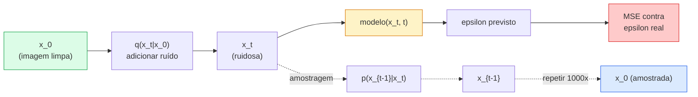

# Geração de Imagens — Modelos de Difusão

> Um modelo de difusão aprende a remover ruído. Treine-o para remover um pouquinho de ruído de uma imagem ruidosa, repita isso ao contrário mil vezes, e você tem um gerador de imagens.

**Tipo:** Construção
**Linguagens:** Python
**Pré-requisitos:** Phase 4 Lesson 07 (U-Net), Phase 1 Lesson 06 (Probabilidade), Phase 3 Lesson 06 (Otimizadores)
**Tempo:** ~75 minutos

## Objetivos de Aprendizado

- Derivar o processo forward de ruído `x_0 -> x_1 -> ... -> x_T` e explicar por que a forma fechada `q(x_t | x_0)` vale para qualquer t
- Implementar um objetivo de treinamento estilo DDPM que regride o ruído adicionado em cada passo, e um amostrador que caminha de volta do ruído puro para uma imagem
- Construir um U-Net condicionado a tempo (pequeno o suficiente para treinar em CPU) que prevê o ruído para qualquer timestep
- Explicar a diferença entre amostragem DDPM e DDIM, e quando cada uma é apropriada (a Lição 23 cobre flow matching e rectified flow em profundidade)

## O Problema

GANs geram em um disparo: ruído entra, imagem sai, uma passada forward. São rápidas e difíceis de treinar. Modelos de difusão geram iterativamente: começam do ruído puro, removem ruído em pequenos passos, a imagem emerge. São lentos e fáceis de treinar. Nos últimos cinco anos, esta última propriedade tem dominado: qualquer pequena equipe pode treinar um modelo de difusão e obter amostras razoáveis; treinamento de GAN é um ofício que você aprende ao longo de anos de execuções fracassadas.

Além da estabilidade de treinamento, a estrutura iterativa da difusão é o que desbloqueia tudo que a geração moderna de imagens faz: condicionamento de texto, inpainting, edição de imagens, super-resolução, estilo controlável. Cada passo do loop de amostragem é um lugar para injetar uma nova restrição. Esse gancho é por que Stable Diffusion, Imagen, DALL-E 3, Midjourney e todo modelo de imagem controlável que você vai usar são baseados em difusão.

Esta lição constrói o DDPM mínimo: ruído forward, remoção de ruído backward, loop de treinamento. A próxima lição (Stable Diffusion) o conecta a um sistema de produção com um VAE, um codificador de texto e orientação livre de classificador.

## O Conceito

### O processo forward

Pegue uma imagem `x_0`. Adicione uma quantidade minúscula de ruído Gaussiano para obter `x_1`. Adicione um pouco mais para obter `x_2`. Continue por T passos até que `x_T` seja quase indistinguível de ruído Gaussiano puro.

```
q(x_t | x_{t-1}) = N(x_t; sqrt(1 - beta_t) * x_{t-1},  beta_t * I)
```

`beta_t` é um pequeno agendamento de variância, tipicamente linear de 0.0001 a 0.02 ao longo de T=1000 passos. Cada passo encolhe ligeiramente o sinal e injeta ruído fresco.

### O salto de forma fechada

Adicionar ruído um passo de cada vez é uma cadeia de Markov, mas a matemática se dobra: você pode amostrar `x_t` diretamente de `x_0` em um passo.

```
Defina alpha_t = 1 - beta_t
Defina alpha_bar_t = prod_{s=1..t} alpha_s

Então:
  q(x_t | x_0) = N(x_t; sqrt(alpha_bar_t) * x_0,  (1 - alpha_bar_t) * I)

Equivalentemente:
  x_t = sqrt(alpha_bar_t) * x_0 + sqrt(1 - alpha_bar_t) * epsilon
  onde epsilon ~ N(0, I)
```

Esta única equação é a razão inteira pela qual a difusão é prática. Durante o treino, você escolhe um `t` aleatório, amostra `x_t` diretamente de `x_0` e treina em um passo — nenhuma simulação da cadeia de Markov completa é necessária.

### O processo reverso

O processo forward é fixo. O processo reverso `p(x_{t-1} | x_t)` é o que a rede neural aprende. Modelos de difusão não preveem `x_{t-1}` diretamente; eles preveem o ruído `epsilon` adicionado no passo t, e a matemática deriva `x_{t-1}` disso.



### A loss de treinamento

Para cada passo de treinamento:

1. Amostre uma imagem real `x_0`.
2. Amostre um timestep `t` uniformemente de [1, T].
3. Amostre ruído `epsilon ~ N(0, I)`.
4. Compute `x_t = sqrt(alpha_bar_t) * x_0 + sqrt(1 - alpha_bar_t) * epsilon`.
5. Preveja `epsilon_theta(x_t, t)` com a rede.
6. Minimize `|| epsilon - epsilon_theta(x_t, t) ||^2`.

É isso. A rede neural aprende a prever o ruído em qualquer timestep. A loss é MSE. Não há jogo adversarial, nenhum colapso, nenhuma oscilação.

### O amostrador (DDPM)

Para gerar: comece de `x_T ~ N(0, I)` e caminhe para trás um passo de cada vez.

```
para t = T, T-1, ..., 1:
    eps = model(x_t, t)
    x_{t-1} = (1 / sqrt(alpha_t)) * (x_t - (beta_t / sqrt(1 - alpha_bar_t)) * eps) + sqrt(beta_t) * z
    onde z ~ N(0, I) se t > 1, senão 0
retorne x_0
```

O ponto chave é que, embora o condicional reverso não seja conhecido em forma fechada em geral, para este processo forward Gaussiano específico ele é. Os coeficientes de aparência feia são o que a regra de Bayes te dá.

### Por que 1000 passos

O agendamento de ruído forward é escolhido para que cada passo adicione ruído suficiente para que o passo reverso seja aproximadamente Gaussiano. Poucos passos e o passo reverso está longe de ser Gaussiano, a rede não consegue modelá-lo bem. Muitos passos e a amostragem se torna cara com ganho decrescente. T=1000 com um agendamento linear é o padrão DDPM.

### DDIM: amostragem 20x mais rápida

O treinamento é o mesmo. A amostragem muda. DDIM (Song et al., 2020) define um processo reverso determinístico que pula timesteps sem retreinar. Amostrar em 50 passos com DDIM dá qualidade próxima de DDPM com 1000 passos. Todo sistema de produção usa DDIM ou uma variante ainda mais rápida (DPM-Solver, Euler ancestral).

### Condicionamento de tempo

A rede `epsilon_theta(x_t, t)` precisa saber qual timestep está removendo ruído. Modelos de difusão modernos injetam `t` via embeddings de tempo senoidais (mesma ideia da codificação posicional em transformers) que são adicionados aos mapas de características em cada nível do U-Net.

```
t_embedding = sinusoidal(t)
feature_map += MLP(t_embedding)
```

Sem condicionamento de tempo, a rede tem que adivinhar o nível de ruído a partir da própria imagem, o que funciona mas é muito menos eficiente em amostras.

## Construa

### Passo 1: Agendamento de ruído

```python
import torch

def agendamento_beta_linear(T=1000, beta_inicio=1e-4, beta_fim=2e-2):
    return torch.linspace(beta_inicio, beta_fim, T)


def precomputar_agendamento(betas):
    alphas = 1.0 - betas
    alphas_cumprod = torch.cumprod(alphas, dim=0)
    return {
        "betas": betas,
        "alphas": alphas,
        "alphas_cumprod": alphas_cumprod,
        "sqrt_alphas_cumprod": torch.sqrt(alphas_cumprod),
        "sqrt_one_minus_alphas_cumprod": torch.sqrt(1.0 - alphas_cumprod),
        "sqrt_recip_alphas": torch.sqrt(1.0 / alphas),
    }

agendamento = precomputar_agendamento(agendamento_beta_linear(T=1000))
```

Pré-calcule uma vez, colete por índice durante treinamento e amostragem.

### Passo 2: Difusão forward (q_sample)

```python
def q_sample(x0, t, ruido, agendamento):
    sqrt_a = agendamento["sqrt_alphas_cumprod"][t].view(-1, 1, 1, 1)
    sqrt_one_minus_a = agendamento["sqrt_one_minus_alphas_cumprod"][t].view(-1, 1, 1, 1)
    return sqrt_a * x0 + sqrt_one_minus_a * ruido
```

Forma fechada de uma linha. `t` é um lote de timesteps, um por imagem no lote.

### Passo 3: Um U-Net minúsculo condicionado a tempo

```python
import torch.nn as nn
import torch.nn.functional as F
import math

def embedding_timestep(t, dim=64):
    half = dim // 2
    freqs = torch.exp(-math.log(10000) * torch.arange(half, device=t.device) / half)
    args = t[:, None].float() * freqs[None]
    emb = torch.cat([args.sin(), args.cos()], dim=-1)
    return emb


class TinyUNet(nn.Module):
    def __init__(self, img_channels=3, base=32, t_dim=64):
        super().__init__()
        self.t_mlp = nn.Sequential(
            nn.Linear(t_dim, base * 4),
            nn.SiLU(),
            nn.Linear(base * 4, base * 4),
        )
        self.t_dim = t_dim
        self.enc1 = nn.Conv2d(img_channels, base, 3, padding=1)
        self.enc2 = nn.Conv2d(base, base * 2, 4, stride=2, padding=1)
        self.mid = nn.Conv2d(base * 2, base * 2, 3, padding=1)
        self.dec1 = nn.ConvTranspose2d(base * 2, base, 4, stride=2, padding=1)
        self.dec2 = nn.Conv2d(base * 2, img_channels, 3, padding=1)
        self.time_proj = nn.Linear(base * 4, base * 2)

    def forward(self, x, t):
        t_emb = embedding_timestep(t, self.t_dim)
        t_emb = self.t_mlp(t_emb)
        t_proj = self.time_proj(t_emb)[:, :, None, None]

        h1 = F.silu(self.enc1(x))
        h2 = F.silu(self.enc2(h1)) + t_proj
        h3 = F.silu(self.mid(h2))
        d1 = F.silu(self.dec1(h3))
        d2 = torch.cat([d1, h1], dim=1)
        return self.dec2(d2)
```

U-Net de dois níveis com condicionamento de tempo injetado no gargalo. Escale a profundidade e largura para imagens reais.

### Passo 4: Loop de treinamento

```python
def passo_treino(model, x0, agendamento, optimizer, device, T=1000):
    model.train()
    x0 = x0.to(device)
    bs = x0.size(0)
    t = torch.randint(0, T, (bs,), device=device)
    ruido = torch.randn_like(x0)
    x_t = q_sample(x0, t, ruido, agendamento)
    pred = model(x_t, t)
    loss = F.mse_loss(pred, ruido)
    optimizer.zero_grad()
    loss.backward()
    optimizer.step()
    return loss.item()
```

Esse é o loop de treinamento inteiro. Sem jogo de GAN, sem loss especializada, uma chamada MSE.

### Passo 5: Amostrador (DDPM)

```python
@torch.no_grad()
def amostrar(model, agendamento, shape, T=1000, device="cpu"):
    model.eval()
    x = torch.randn(shape, device=device)
    betas = agendamento["betas"].to(device)
    sqrt_one_minus_a = agendamento["sqrt_one_minus_alphas_cumprod"].to(device)
    sqrt_recip_alphas = agendamento["sqrt_recip_alphas"].to(device)

    for t in reversed(range(T)):
        t_lote = torch.full((shape[0],), t, dtype=torch.long, device=device)
        eps = model(x, t_lote)
        coef = betas[t] / sqrt_one_minus_a[t]
        media = sqrt_recip_alphas[t] * (x - coef * eps)
        if t > 0:
            x = media + torch.sqrt(betas[t]) * torch.randn_like(x)
        else:
            x = media
    return x
```

1000 passagens forward para produzir um lote de amostras. Em código real, você trocaria isso por um amostrador DDIM de 50 passos.

### Passo 6: Amostrador DDIM (determinístico, ~20x mais rápido)

```python
@torch.no_grad()
def amostrar_ddim(model, agendamento, shape, passos=50, T=1000, device="cpu", eta=0.0):
    model.eval()
    x = torch.randn(shape, device=device)
    alphas_cumprod = agendamento["alphas_cumprod"].to(device)

    ts = torch.linspace(T - 1, 0, passos + 1).long()
    for i in range(passos):
        t = ts[i]
        t_prev = ts[i + 1]
        t_lote = torch.full((shape[0],), t, dtype=torch.long, device=device)
        eps = model(x, t_lote)
        a_t = alphas_cumprod[t]
        a_prev = alphas_cumprod[t_prev] if t_prev >= 0 else torch.tensor(1.0, device=device)
        x0_pred = (x - torch.sqrt(1 - a_t) * eps) / torch.sqrt(a_t)
        sigma = eta * torch.sqrt((1 - a_prev) / (1 - a_t) * (1 - a_t / a_prev))
        dir_xt = torch.sqrt(1 - a_prev - sigma ** 2) * eps
        ruido = sigma * torch.randn_like(x) if eta > 0 else 0
        x = torch.sqrt(a_prev) * x0_pred + dir_xt + ruido
    return x
```

`eta=0` é totalmente determinístico (a mesma entrada de ruído sempre produz a mesma saída). `eta=1` recupera DDPM.

## Use

Para trabalho em produção, use `diffusers`:

```python
from diffusers import DDPMScheduler, UNet2DModel

unet = UNet2DModel(sample_size=32, in_channels=3, out_channels=3, layers_per_block=2)
scheduler = DDPMScheduler(num_train_timesteps=1000)
```

A biblioteca oferece schedulers prontos (DDPM, DDIM, DPM-Solver, Euler, Heun), U-Nets configuráveis, pipelines para texto-para-imagem e imagem-para-imagem, e helpers de fine-tuning LoRA.

Para pesquisa, `k-diffusion` (Katherine Crowson) tem as implementações de referência mais fiéis e as melhores variantes de amostragem.

## Entregue

Esta lição produz:

- `outputs/prompt-diffusion-sampler-picker.md` — um prompt que escolhe DDPM / DDIM / DPM-Solver / Euler com base no alvo de qualidade, orçamento de latência e tipo de condicionamento.
- `outputs/skill-noise-schedule-designer.md` — uma skill que produz um agendamento beta linear, cosseno ou sigmoide dado T e nível de corrupção alvo, mais gráficos de diagnóstico da razão sinal-ruído ao longo do tempo.

## Exercícios

1. **(Fácil)** Visualize o processo forward: pegue uma imagem e plote `x_t` em `t in [0, 100, 250, 500, 750, 1000]`. Verifique que `x_1000` parece ruído Gaussiano puro.
2. **(Médio)** Treine o TinyUNet no dataset sintético de círculos por 20 épocas e amostre 16 círculos. Compare amostragem DDPM (1000 passos) e DDIM (50 passos) — elas produzem imagens similares a partir da mesma semente de ruído?
3. **(Difícil)** Implemente um agendamento de ruído cosseno (Nichol & Dhariwal, 2021): `alpha_bar_t = cos^2((t/T + s) / (1 + s) * pi / 2)`. Treine o mesmo modelo com agendamentos linear e cosseno e mostre que cosseno dá melhores amostras em baixas contagens de passos.

## Termos-Chave

| Termo | O que as pessoas dizem | O que realmente significa |
|-------|------------------------|---------------------------|
| Processo forward | "Adicionar ruído ao longo do tempo" | Cadeia de Markov fixa que corrompe uma imagem em ruído Gaussiano ao longo de T passos |
| Processo reverso | "Remover ruído passo a passo" | Distribuição aprendida que caminha de volta do ruído para a imagem |
| Predição de epsilon | "Prever o ruído" | O alvo de treinamento: `epsilon_theta(x_t, t)` prevê o ruído adicionado no passo t |
| Agendamento beta | "Quantidades de ruído" | Sequência de T pequenas variâncias que definem quanto ruído entra por passo |
| alpha_bar_t | "Fator de retenção cumulativo" | Produto de (1 - beta_s) até o tempo t; t maior significa menos sinal restante |
| Amostrador DDPM | "Ancestral, estocástico" | Amostra cada x_{t-1} de sua Gaussiana condicional; 1000 passos |
| Amostrador DDIM | "Determinístico, rápido" | Reescreve a amostragem como uma EDO determinística; 20-100 passos com qualidade similar |
| Condicionamento de tempo | "Dizer ao modelo qual t" | Embedding senoidal de t injetado no U-Net para que ele saiba o nível de ruído |

## Leitura Complementar

- [Denoising Diffusion Probabilistic Models (Ho et al., 2020)](https://arxiv.org/abs/2006.11239) — o paper que tornou a difusão prática e superou GANs em FID
- [Improved DDPM (Nichol & Dhariwal, 2021)](https://arxiv.org/abs/2102.09672) — agendamento cosseno e v-parameterization
- [DDIM (Song, Meng, Ermon, 2020)](https://arxiv.org/abs/2010.02502) — o amostrador determinístico que tornou a inferência em tempo real possível
- [Elucidating the Design Space of Diffusion (Karras et al., 2022)](https://arxiv.org/abs/2206.00364) — uma visão unificada de toda escolha de design de difusão; melhor referência atual
