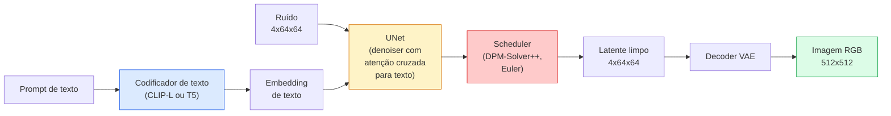

# Stable Diffusion — Arquitetura & Fine-Tuning

> Stable Diffusion é um DDPM que roda no espaço latente de um VAE pré-treinado, condicionado a texto via atenção cruzada, amostrado com um resolvedor de EDO determinístico rápido e guiado por orientação livre de classificador.

**Tipo:** Aprender + Usar
**Linguagens:** Python
**Pré-requisitos:** Phase 4 Lesson 10 (Difusão), Phase 7 Lesson 02 (Self-Attention)
**Tempo:** ~75 minutos

## Objetivos de Aprendizado

- Traçar as cinco peças de um pipeline Stable Diffusion: VAE, codificador de texto, U-Net, scheduler, verificador de segurança — e o que cada um realmente faz
- Explicar difusão latente e por que treinar em um espaço latente 4x64x64 (em vez de uma imagem 3x512x512) reduz a computação em 48x sem perda de qualidade
- Usar `diffusers` para gerar imagens, executar imagem-para-imagem, inpainting e geração guiada por ControlNet
- Ajustar fino Stable Diffusion com LoRA em um pequeno dataset personalizado e carregar o adaptador LoRA na inferência

## O Problema

Treinar um DDPM diretamente em imagens RGB 512x512 é caro. Cada passo de treino retropropaga através de um U-Net que vê 3x512x512 = 786.432 valores de entrada, e a amostragem leva 50+ passagens forward através do mesmo U-Net. No nível de qualidade do Stable Diffusion 1.5 (lançado em 2022), a difusão em espaço de pixel precisaria de aproximadamente 256 GPU-meses de treino e 10-30 segundos por imagem em uma GPU de consumo.

O truque que tornou a geração texto-para-imagem de peso aberto prática foi a **difusão latente** (Rombach et al., CVPR 2022). Treine um VAE que mapeia uma imagem 3x512x512 para um tensor latente 4x64x64 e vice-versa, então faça a difusão nesse espaço latente. A computação cai por `(3*512*512)/(4*64*64) = 48x`. A amostragem cai de dezenas de segundos para menos de dois segundos na mesma GPU.

Quase todo modelo moderno de geração de imagens — SDXL, SD3, FLUX, HunyuanDiT, Wan-Video — é um modelo de difusão latente com variações no autoencoder, no denoiser (U-Net ou DiT) e no condicionamento de texto. Aprenda Stable Diffusion e você aprendeu o template.

## O Conceito

### O pipeline



- **VAE** — autoencoder congelado. Codificador transforma imagem em latentes (usado para img2img e treinamento). Decodificador transforma latentes de volta em imagem.
- **Codificador de texto** — codificador de texto CLIP (SD 1.x/2.x), CLIP-L + CLIP-G (SDXL) ou T5-XXL (SD3/FLUX). Produz uma sequência de embeddings de tokens.
- **U-Net** — o denoiser. Tem camadas de atenção cruzada que atendem de latentes para o embedding de texto em cada nível de resolução.
- **Scheduler** — o algoritmo de amostragem (DDIM, Euler, DPM-Solver++). Escolhe sigmas, mescla o ruído previsto de volta ao latente.
- **Verificador de segurança** — filtro opcional de NSFW/conteúdo ilegal na imagem de saída.

### Orientação livre de classificador (CFG)

O condicionamento de texto simples aprende `epsilon_theta(x_t, t, c)` para cada prompt `c`. CFG treina a mesma rede com `c` descartado 10% do tempo (substituído por um embedding vazio), dando um único modelo que prevê tanto o ruído condicional quanto o incondicional. Na inferência:

```
eps = eps_incond + w * (eps_cond - eps_incond)
```

`w` é a escala de orientação. `w=0` é incondicional, `w=1` é condicional simples, `w>1` empurra a saída para ser "mais condicionada ao prompt" ao custo da diversidade. O padrão SD é `w=7.5`.

CFG é a razão pela qual texto-para-imagem funciona em qualidade de produção. Sem ele, prompts influenciam a saída fracamente; com ele, prompts dominam.

### Geometria do espaço latente

O latente de 4 canais do VAE não é apenas uma imagem comprimida. É uma variedade onde aritmética corresponde aproximadamente a edições semânticas (engenharia de prompt + interpolação vivem aqui), e onde o U-Net de difusão foi treinado para gastar todo seu orçamento de modelagem. Decodificar um latente 4x64x64 aleatório não produz uma imagem de aparência aleatória — produz lixo, porque apenas um subvariedade específica de latentes decodifica para imagens válidas.

Duas consequências:

1. **Img2img** = codificar imagem para latente, adicionar ruído parcial, executar o denoiser, decodificar. A estrutura da imagem sobrevive porque a codificação é quase inversível; o conteúdo muda com base no prompt.
2. **Inpainting** = igual a img2img mas o denoiser apenas atualiza regiões mascaradas; regiões não mascaradas são mantidas no latente codificado.

### A arquitetura U-Net

O U-Net SD é uma versão grande do TinyUNet da Lição 10 com três adições:

- **Blocos transformer** em cada resolução espacial, contendo self-attention + atenção cruzada para o embedding de texto.
- **Embedding de tempo** via MLP em codificação senoidal.
- **Conexões skip** entre codificador e decodificador em resoluções correspondentes.

Total de parâmetros no SD 1.5: ~860M. SDXL: ~2.6B. FLUX: ~12B. O salto em params está principalmente nas camadas de atenção.

### LoRA fine-tuning

Fine-tuning completo do Stable Diffusion precisa de 20+ GB de VRAM e atualiza 860M de parâmetros. LoRA (Low-Rank Adaptation) mantém o modelo base congelado e injeta pequenas matrizes de decomposição de rank nas camadas de atenção. Um adaptador LoRA para SD tem tipicamente 10-50 MB, treina em 10-60 minutos em uma única GPU de consumo e carrega na inferência como uma modificação plugável.

```
Original: W_q : (d_in, d_out)   congelado
LoRA:     W_q + alpha * (A @ B)   onde A : (d_in, r), B : (r, d_out)

r é tipicamente 4-32.
```

LoRA é como quase todo fine-tune da comunidade é distribuído. CivitAI e Hugging Face hospedam milhões deles.

### Schedulers que você verá

- **DDIM** — determinístico, ~50 passos, simples.
- **Euler ancestral** — estocástico, 30-50 passos, amostras ligeiramente mais criativas.
- **DPM-Solver++ 2M Karras** — determinístico, 20-30 passos, padrão de produção.
- **LCM / TCD / Turbo** — modelos de consistência e variantes destiladas; 1-4 passos ao custo de alguma qualidade.

Trocar schedulers é uma mudança de uma linha no `diffusers` e às vezes corrige problemas de amostra sem qualquer retreino.

## Construa

Esta lição usa `diffusers` ponta a ponta em vez de reconstruir Stable Diffusion do zero. As peças que você precisaria reconstruir (VAE, codificador de texto, U-Net, scheduler) são tópicos de suas próprias lições; aqui o objetivo é fluência com a API de produção.

### Passo 1: Texto-para-imagem

```python
import torch
from diffusers import StableDiffusionPipeline

pipe = StableDiffusionPipeline.from_pretrained(
    "runwayml/stable-diffusion-v1-5",
    torch_dtype=torch.float16,
).to("cuda")

image = pipe(
    prompt="um cachorro andando de skate em tokyo, estilo studio ghibli",
    guidance_scale=7.5,
    num_inference_steps=25,
    generator=torch.Generator("cuda").manual_seed(42),
).images[0]
image.save("cachorro.png")
```

`float16` reduz pela metade a VRAM sem perda visível de qualidade. `num_inference_steps=25` com o DPM-Solver++ padrão equivale a `num_inference_steps=50` com DDIM.

### Passo 2: Trocar o scheduler

```python
from diffusers import DPMSolverMultistepScheduler, EulerAncestralDiscreteScheduler

pipe.scheduler = DPMSolverMultistepScheduler.from_config(pipe.scheduler.config)
pipe.scheduler = EulerAncestralDiscreteScheduler.from_config(pipe.scheduler.config)
```

O estado do scheduler é desacoplado dos pesos do U-Net. Você pode treinar em DDPM e amostrar com qualquer scheduler.

### Passo 3: Imagem-para-imagem

```python
from diffusers import StableDiffusionImg2ImgPipeline
from PIL import Image

img2img = StableDiffusionImg2ImgPipeline.from_pretrained(
    "runwayml/stable-diffusion-v1-5",
    torch_dtype=torch.float16,
).to("cuda")

imagem_inicial = Image.open("cachorro.png").convert("RGB").resize((512, 512))
saida = img2img(
    prompt="um cachorro andando de skate, pintura a óleo",
    image=imagem_inicial,
    strength=0.6,
    guidance_scale=7.5,
).images[0]
```

`strength` é quanto ruído adicionar antes de denoising (0.0 = inalterado, 1.0 = regeneração completa). 0.5-0.7 é a faixa padrão para transferência de estilo.

### Passo 4: Inpainting

```python
from diffusers import StableDiffusionInpaintPipeline

inpaint = StableDiffusionInpaintPipeline.from_pretrained(
    "runwayml/stable-diffusion-inpainting",
    torch_dtype=torch.float16,
).to("cuda")

image = Image.open("cachorro.png").convert("RGB").resize((512, 512))
mask = Image.open("cachorro_mascara.png").convert("L").resize((512, 512))

saida = inpaint(
    prompt="um gato",
    image=image,
    mask_image=mask,
    guidance_scale=7.5,
).images[0]
```

Pixels brancos na máscara são a área a regenerar. Pixels pretos são preservados.

### Passo 5: Carregamento LoRA

```python
pipe.load_lora_weights("sayakpaul/sd-lora-ghibli")
pipe.fuse_lora(lora_scale=0.8)

image = pipe(prompt="uma praça de vila em estilo ghibli").images[0]
```

`lora_scale` controla a força; 0.0 = sem efeito, 1.0 = efeito total. `fuse_lora` incorpora o adaptador nos pesos no lugar por velocidade, mas impede a troca. Chame `pipe.unfuse_lora()` antes de carregar um adaptador diferente.

### Passo 6: Treinamento LoRA (esboço)

O treinamento LoRA real vive em `peft` ou `diffusers.training`. O esboço:

```python
# Pseudocódigo
for step, batch in enumerate(dataloader):
    images, prompts = batch
    latents = vae.encode(images).latent_dist.sample() * 0.18215

    t = torch.randint(0, num_train_timesteps, (batch_size,))
    ruido = torch.randn_like(latents)
    latents_ruidosos = scheduler.add_noise(latents, ruido, t)

    text_emb = text_encoder(tokenizer(prompts))

    pred_ruido = unet(latents_ruidosos, t, text_emb)  # Pesos LoRA injetados aqui

    loss = F.mse_loss(pred_ruido, ruido)
    loss.backward()
    optimizer.step()
```

Apenas as matrizes LoRA recebem gradiente; o U-Net base, VAE e codificador de texto estão congelados. Com tamanho de lote 1 e checkpointing de gradiente, isso cabe em 8 GB de VRAM.

## Use

Em produção, as decisões que você realmente toma:

- **Família de modelo**: SD 1.5 para fine-tunes de código aberto da comunidade, SDXL para maior fidelidade, SD3 / FLUX para estado da arte e requisitos de licenciamento estritos.
- **Scheduler**: DPM-Solver++ 2M Karras para 20-30 passos, LCM-LoRA quando a latência está abaixo de 1s.
- **Precisão**: `float16` em 4080/4090, `bfloat16` em A100 e mais novos, `int8` (via `bitsandbytes` ou `compel`) quando a VRAM é apertada.
- **Condicionamento**: texto simples funciona; para controle mais forte, adicione ControlNet (canny, depth, pose) sobre o pipeline base.

Para geração em lote, `AUTO1111` / `ComfyUI` são as ferramentas da comunidade; para APIs de produção, `diffusers` + `accelerate` ou `optimum-nvidia` com compilação TensorRT.

## Entregue

Esta lição produz:

- `outputs/prompt-sd-pipeline-planner.md` — um prompt que escolhe SD 1.5 / SDXL / SD3 / FLUX mais scheduler e precisão dado um orçamento de latência, alvo de fidelidade e restrição de licenciamento.
- `outputs/skill-lora-training-setup.md` — uma skill que escreve uma configuração completa de treinamento LoRA para um dataset personalizado incluindo legendas, rank, tamanho de lote e taxa de aprendizado.

## Exercícios

1. **(Fácil)** Gere o mesmo prompt com `guidance_scale` em `[1, 3, 5, 7.5, 10, 15]`. Descreva como a imagem muda. Em que valor de guidance os artefatos aparecem?
2. **(Médio)** Pegue qualquer fotografia real, execute-a através de `StableDiffusionImg2ImgPipeline` em `strength` em `[0.2, 0.4, 0.6, 0.8, 1.0]`. Qual strength preserva a composição enquanto muda o estilo? Por que 1.0 ignora a entrada completamente?
3. **(Difícil)** Treine um LoRA em 10-20 imagens de um único sujeito (um animal de estimação, um logotipo, um personagem) e gere cenas novas com esse sujeito. Reporte o rank LoRA e os passos de treino que produziram a melhor preservação de identidade sem overfitting nas imagens de entrada.

## Termos-Chave

| Termo | O que as pessoas dizem | O que realmente significa |
|-------|------------------------|---------------------------|
| Difusão latente | "Difundir em latentes" | Executar todo o DDPM no espaço latente do VAE (4x64x64) em vez do espaço de pixel (3x512x512); economia de 48x em computação |
| Fator de escala VAE | "0.18215" | Constante que reescala o latente bruto do VAE para aproximadamente variância unitária; hardcoded em todo pipeline SD |
| Orientação livre de classificador | "CFG" | Misturar predições de ruído condicional e incondicional; o knob de inferência mais impactante |
| Scheduler | "Amostrador" | O algoritmo que transforma ruído + predições do modelo em uma trajetória de latente denoised |
| LoRA | "Adaptador de baixo rank" | Pequenas matrizes de decomposição de rank que ajustam fino camadas de atenção sem tocar nos pesos base |
| Atenção cruzada | "Atenção texto-imagem" | Atenção de tokens latentes para tokens de texto; injeta informação do prompt em cada nível do U-Net |
| ControlNet | "Condicionamento de estrutura" | Um adaptador treinado separadamente que orienta SD com uma entrada extra (canny, depth, pose, segmentação) |
| DPM-Solver++ | "O scheduler padrão" | Resolvedor de EDO determinístico de segunda ordem; melhor qualidade em baixas contagens de passos (20-30) em 2026 |

## Leitura Complementar

- [High-Resolution Image Synthesis with Latent Diffusion (Rombach et al., 2022)](https://arxiv.org/abs/2112.10752) — o paper do Stable Diffusion; inclui toda ablação que justifica o design
- [Classifier-Free Diffusion Guidance (Ho & Salimans, 2022)](https://arxiv.org/abs/2207.12598) — o paper do CFG
- [LoRA: Low-Rank Adaptation of Large Language Models (Hu et al., 2021)](https://arxiv.org/abs/2106.09685) — LoRA veio primeiro de NLP; transferiu-se para SD com quase nenhuma mudança
- [diffusers documentation](https://huggingface.co/docs/diffusers) — a referência para todo pipeline SD / SDXL / SD3 / FLUX
