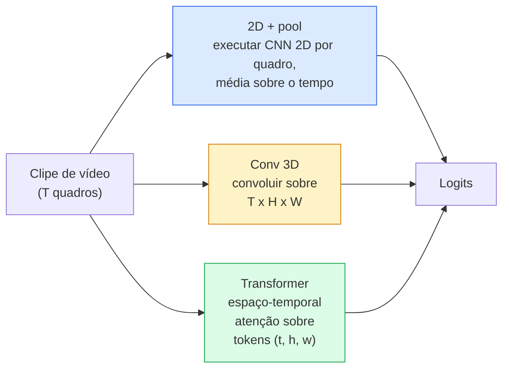

# Compreensão de Vídeo — Modelagem Temporal

> Um vídeo é uma sequência de imagens mais a física que as conecta. Todo modelo de vídeo ou trata o tempo como um eixo extra (conv 3D), uma sequência para atender (transformer) ou uma característica para extrair uma vez e agregar (2D+pool).

**Tipo:** Aprender + Construir
**Linguagens:** Python
**Pré-requisitos:** Phase 4 Lesson 03 (CNNs), Phase 4 Lesson 04 (Classificação de Imagens)
**Tempo:** ~45 minutos

## Objetivos de Aprendizado

- Distinguir as três principais abordagens de modelagem de vídeo (2D+pool, conv 3D, transformer espaço-temporal) e prever seus custos e trade-offs de acurácia
- Implementar amostragem de quadros, pooling temporal e um classificador baseline 2D+pool em PyTorch
- Explicar por que os kernels 3D "inflados" do I3D transferem bem de pesos ImageNet e o que uma convolução (2+1)D fatorada faz de diferente
- Ler os conjuntos de dados e métricas padrão de reconhecimento de ação: Kinetics-400/600, UCF101, Something-Something V2; acurácia top-1 nos níveis de clipe e vídeo

## O Problema

Um vídeo de 30 segundos a 30 fps tem 900 imagens. Ingênuamente, classificação de vídeo é classificação de imagem executada 900 vezes seguida por algum tipo de agregação. Isso funciona quando a ação é visível em quase todos os quadros (esportes, culinária, vídeos de exercício) e falha gravemente quando a ação é definida pelo próprio movimento: "empurrar algo da esquerda para a direita" parece dois objetos parados em cada quadro individual.

A questão central para toda arquitetura de vídeo é: quando a estrutura temporal é modelada, e como? A resposta dirige todo o resto — custo computacional, estratégia de pré-treinamento, se você pode reutilizar pesos ImageNet, em quais datasets o modelo treina.

Esta lição é deliberadamente mais curta que as lições de imagem estática. O maquinário central de imagem já está em vigor, e a compreensão de vídeo é principalmente sobre a história temporal: amostragem, modelagem e agregação.

## O Conceito

### As três famílias arquiteturais



### 2D + pool

Pegue uma CNN 2D (ResNet, EfficientNet, ViT). Execute-a independentemente em cada quadro amostrado. Faça a média (ou max-pool, ou attention-pool) dos embeddings por quadro. Alimente o vetor agregado a um classificador.

Prós:
- Pré-treinamento ImageNet transfere diretamente.
- Mais simples de implementar.
- Barato: T quadros * custo de inferência de imagem única.

Contras:
- Não consegue modelar movimento. Ação = agregado de aparências.
- Pooling temporal é invariante à ordem; "abrir porta" e "fechar porta" parecem iguais.

Quando usar: tarefas com peso em aparência, transfer learning em datasets de vídeo pequenos, baselines iniciais.

### Convoluções 3D

Substitua kernels 2D (H, W) por kernels 3D (T, H, W). A rede convolui sobre espaço e tempo. Família inicial: C3D, I3D, SlowFast.

Truque I3D: pegue um modelo 2D ImageNet pré-treinado, "infle" cada kernel 2D copiando-o ao longo de um novo eixo temporal. Uma conv 2D 3x3 se torna uma conv 3D 3x3x3. Isso dá ao modelo 3D pesos pré-treinados fortes em vez de treinar do zero.

Prós:
- Modela movimento diretamente.
- Inflação I3D dá transfer learning gratuito.

Contras:
- T/8 mais FLOPs que a contraparte 2D (para kernel temporal de 3 empilhado 3 vezes).
- Kernels temporais são pequenos; movimento de longo alcance precisa de uma abordagem de pirâmide ou fluxo duplo.

Quando usar: reconhecimento de ação onde movimento é o sinal (Something-Something V2, Kinetics com classes com peso em movimento).

### Transformers espaço-temporais

Tokenize o vídeo em uma grade de patches espaço-temporais e atenda todos eles. TimeSformer, ViViT, Video Swin, VideoMAE.

Padrões de atenção que importam:
- **Joint** — uma grande atenção sobre (t, h, w). Quadrático em `T*H*W`; caro.
- **Divided** — duas atenções por bloco: uma sobre tempo, uma sobre espaço. Escalonamento linear aproximado.
- **Factorised** — atenção temporal alterna com atenção espacial entre blocos.

Prós:
- Acurácia SOTA em todo benchmark importante.
- Transfere de transformers de imagem (ViT) via inflação de patch.
- Suporta vídeo de contexto longo via atenção esparsa.

Contras:
- Exige muita computação.
- Requer escolha cuidadosa do padrão de atenção ou o runtime explode.

Quando usar: grandes datasets, compreensão de vídeo de alta fidelidade, tarefas multimodais vídeo+texto.

### Amostragem de quadros

Um clipe de 10 segundos a 30 fps tem 300 quadros; alimentar todos os 300 para qualquer modelo é desperdício. Estratégias padrão:

- **Amostragem uniforme** — pegar T quadros uniformemente ao longo do clipe. Padrão para 2D+pool.
- **Amostragem densa** — janela contígua aleatória de T quadros. Comum para convs 3D porque o movimento requer quadros vizinhos.
- **Multi-clipe** — amostrar múltiplas janelas de T quadros do mesmo vídeo, classificar cada uma, fazer a média das predições no teste.

T geralmente é 8, 16, 32 ou 64. T maior = mais sinal temporal a mais computação.

### Avaliação

Dois níveis:
- **Acurácia em nível de clipe** — modelo vê um clipe de T quadros, reporta top-k.
- **Acurácia em nível de vídeo** — média das predições em nível de clipe através de múltiplos clipes por vídeo; mais alta e mais estável.

Sempre reporte ambos. Um modelo que pontua 78% clipe / 82% vídeo está confiando fortemente na média de teste; um que pontua 80% / 81% é mais robusto por clipe.

### Datasets que você encontrará

- **Kinetics-400 / 600 / 700** — o dataset de ação de propósito geral. 400k clipes; URLs do YouTube (muitos mortos agora).
- **Something-Something V2** — ações definidas por movimento ("movendo X da esquerda para a direita"). Não pode ser resolvido por 2D+pool.
- **UCF-101**, **HMDB-51** — mais antigos, menores, ainda reportados.
- **AVA** — *localização* de ação no espaço e tempo; mais difícil que classificação.

## Construa

### Passo 1: Amostrador de quadros

Amostradores uniforme e denso que funcionam em uma lista de quadros (ou um tensor de vídeo).

```python
import numpy as np

def amostrar_uniforme(num_quadros_total, T):
    if num_quadros_total <= T:
        return list(range(num_quadros_total)) + [num_quadros_total - 1] * (T - num_quadros_total)
    passo = num_quadros_total / T
    return [int(i * passo) for i in range(T)]


def amostrar_denso(num_quadros_total, T, rng=None):
    rng = rng or np.random.default_rng()
    if num_quadros_total <= T:
        return list(range(num_quadros_total)) + [num_quadros_total - 1] * (T - num_quadros_total)
    inicio = int(rng.integers(0, num_quadros_total - T + 1))
    return list(range(inicio, inicio + T))
```

Ambos retornam índices `T` que você usa para fatiar o tensor de vídeo.

### Passo 2: Um baseline 2D+pool

Execute um ResNet-18 2D sobre cada quadro, faça average-pool das características, classifique.

```python
import torch
import torch.nn as nn
from torchvision.models import resnet18, ResNet18_Weights

class FramePool(nn.Module):
    def __init__(self, num_classes=400, pretrained=True):
        super().__init__()
        weights = ResNet18_Weights.IMAGENET1K_V1 if pretrained else None
        backbone = resnet18(weights=weights)
        self.features = nn.Sequential(*(list(backbone.children())[:-1]))  # global avg pool mantido
        self.head = nn.Linear(512, num_classes)

    def forward(self, x):
        # x: (N, T, 3, H, W)
        N, T = x.shape[:2]
        x = x.view(N * T, *x.shape[2:])
        feats = self.features(x).view(N, T, -1)
        pooled = feats.mean(dim=1)
        return self.head(pooled)

model = FramePool(num_classes=10)
x = torch.randn(2, 8, 3, 224, 224)
print(f"saída: {model(x).shape}")
print(f"params: {sum(p.numel() for p in model.parameters()):,}")
```

Onze milhões de parâmetros, pré-treinado ImageNet, executa por quadro, faz média, classifica. Este baseline está frequentemente dentro de 5-10 pontos de modelos 3D adequados em tarefas com peso em aparência — às vezes melhor, porque reutiliza um backbone ImageNet mais forte.

### Passo 3: Uma conv 3D inflada estilo I3D

Transforme uma única conv 2D em uma conv 3D repetindo pesos ao longo de um novo eixo temporal.

```python
def inflar_2d_para_3d(conv2d, kernel_tempo=3):
    saida_c, entrada_c, kh, kw = conv2d.weight.shape
    peso_3d = conv2d.weight.data.unsqueeze(2)  # (saida, entrada, 1, kh, kw)
    peso_3d = peso_3d.repeat(1, 1, kernel_tempo, 1, 1) / kernel_tempo
    conv3d = nn.Conv3d(entrada_c, saida_c, kernel_size=(kernel_tempo, kh, kw),
                        padding=(kernel_tempo // 2, conv2d.padding[0], conv2d.padding[1]),
                        stride=(1, conv2d.stride[0], conv2d.stride[1]),
                        bias=False)
    conv3d.weight.data = peso_3d
    return conv3d

conv2d = nn.Conv2d(3, 64, kernel_size=3, padding=1, bias=False)
conv3d = inflar_2d_para_3d(conv2d, kernel_tempo=3)
print(f"shape peso 2D:  {tuple(conv2d.weight.shape)}")
print(f"shape peso 3D:  {tuple(conv3d.weight.shape)}")
x = torch.randn(1, 3, 8, 56, 56)
print(f"shape saída 3D:  {tuple(conv3d(x).shape)}")
```

A divisão por `kernel_tempo` mantém as magnitudes de ativação aproximadamente constantes — importante para não quebrar as estatísticas de batch norm na primeira passagem.

### Passo 4: Conv (2+1)D fatorada

Divida uma conv 3D em uma conv 2D (espacial) e uma conv 1D (temporal). Mesmo campo receptivo, menos parâmetros, melhor acurácia em alguns benchmarks.

```python
class Conv2Plus1D(nn.Module):
    def __init__(self, in_c, out_c, kernel_size=3):
        super().__init__()
        mid_c = (in_c * out_c * kernel_size * kernel_size * kernel_size) \
                // (in_c * kernel_size * kernel_size + out_c * kernel_size)
        self.spatial = nn.Conv3d(in_c, mid_c, kernel_size=(1, kernel_size, kernel_size),
                                 padding=(0, kernel_size // 2, kernel_size // 2), bias=False)
        self.bn = nn.BatchNorm3d(mid_c)
        self.act = nn.ReLU(inplace=True)
        self.temporal = nn.Conv3d(mid_c, out_c, kernel_size=(kernel_size, 1, 1),
                                  padding=(kernel_size // 2, 0, 0), bias=False)

    def forward(self, x):
        return self.temporal(self.act(self.bn(self.spatial(x))))

c = Conv2Plus1D(3, 64)
x = torch.randn(1, 3, 8, 56, 56)
print(f"saída (2+1)D: {tuple(c(x).shape)}")
```

Uma rede R(2+1)D completa é o mesmo que um ResNet-18 com cada conv 3x3 substituída por `Conv2Plus1D`.

## Use

Duas bibliotecas cobrem trabalho de vídeo em produção:

- `torchvision.models.video` — R(2+1)D, MViT, Swin3D com pesos pré-treinados Kinetics. Mesma API que modelos de imagem.
- `pytorchvideo` (Meta) — zoo de modelos, carregadores de dados para Kinetics / SSv2 / AVA, transformações padrão.

Para modelos de vídeo Visão-Linguagem (legenda de vídeo, QA de vídeo), use `transformers` (`VideoMAE`, `VideoLLaMA`, `InternVideo`).

## Entregue

Esta lição produz:

- `outputs/prompt-video-architecture-picker.md` — um prompt que escolhe 2D+pool / I3D / (2+1)D / transformer com base em aparência-vs-movimento, tamanho do dataset e orçamento de computação.
- `outputs/skill-frame-sampler-auditor.md` — uma skill que inspeciona o amostrador de um pipeline de vídeo e sinaliza bugs comuns: índice off-by-one, amostragem desigual quando `num_frames < T`, falta de corte com preservação de aspecto, etc.

## Exercícios

1. **(Fácil)** Calcule FLOPs (aproximados) para FramePool com T=8 vs um ResNet 3D estilo I3D com T=8. Justifique por que 2D+pool é 3-5x mais barato.
2. **(Médio)** Gere um dataset de vídeo sintético: bolas aleatórias movendo-se em direções aleatórias, rotuladas pela direção do movimento ("esquerda-para-direita", "direita-para-esquerda", "diagonal-cima"). Treine FramePool nele. Mostre que ele atinge acurácia próxima do acaso, provando que a aparência sozinha é insuficiente para tarefas de movimento.
3. **(Difícil)** Construa um R(2+1)D-18 substituindo todo Conv2d em um ResNet-18 por `Conv2Plus1D`. Infle os pesos da primeira conv de um ResNet-18 pré-treinado em ImageNet. Treine no dataset de movimento do exercício 2 e supere FramePool.

## Termos-Chave

| Termo | O que as pessoas dizem | O que realmente significa |
|-------|------------------------|---------------------------|
| 2D + pool | "Classificador por quadro" | Executar uma CNN 2D em cada quadro amostrado, fazer average-pool das características no tempo, classificar |
| Convolução 3D | "Kernel espaço-temporal" | Kernel que convolui sobre (T, H, W); pode modelar movimento nativamente |
| Inflação | "Elevar pesos 2D para 3D" | Inicializar pesos de conv 3D repetindo os pesos de uma conv 2D ao longo do novo eixo temporal, depois dividir por kernel_T para preservar a escala da ativação |
| (2+1)D | "Conv fatorada" | Dividir 3D em 2D espacial + 1D temporal; menos parâmetros, não-linearidade extra entre eles |
| Atenção dividida | "Tempo então espaço" | Bloco transformer com duas atenções por camada: uma sobre tokens no mesmo quadro, uma sobre tokens na mesma posição |
| Clipe | "Janela de T quadros" | Uma subsequência amostrada de T quadros; a unidade que um modelo de vídeo consome |
| Acurácia clipe vs vídeo | "Duas configurações de avaliação" | Clipe = uma amostra por vídeo, vídeo = média entre múltiplos clipes amostrados |
| Kinetics | "A ImageNet do vídeo" | 400-700 classes de ação, 300k+ clipes do YouTube, o corpus padrão de pré-treinamento de vídeo |

## Leitura Complementar

- [I3D: Quo Vadis, Action Recognition (Carreira & Zisserman, 2017)](https://arxiv.org/abs/1705.07750) — introduz inflação e o dataset Kinetics
- [R(2+1)D: A Closer Look at Spatiotemporal Convolutions (Tran et al., 2018)](https://arxiv.org/abs/1711.11248) — conv fatorada, ainda um baseline forte
- [TimeSformer: Is Space-Time Attention All You Need? (Bertasius et al., 2021)](https://arxiv.org/abs/2102.05095) — o primeiro transformer de vídeo forte
- [VideoMAE (Tong et al., 2022)](https://arxiv.org/abs/2203.12602) — pré-treinamento de autoencoder mascarado para vídeo; receita de pré-treinamento dominante atual
