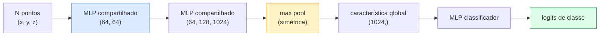

# Visão 3D — Nuvens de Pontos e NeRFs

> Visão 3D vem em dois sabores. Nuvens de pontos são a saída bruta do sensor. NeRFs são o campo volumétrico aprendido. Ambos respondem "o que está onde no espaço."

**Tipo:** Aprender + Construir
**Linguagens:** Python
**Pré-requisitos:** Phase 4 Lesson 03 (CNNs), Phase 1 Lesson 12 (Operações com Tensores)
**Tempo:** ~45 minutos

## Objetivos de Aprendizado

- Distinguir representações 3D explícitas (nuvem de pontos, malha, voxel) e implícitas (campo de distância sinalizada, NeRF) e quando cada uma é usada
- Entender o truque da função simétrica do PointNet que torna uma rede neural invariante à permutação sobre um conjunto não ordenado de pontos
- Traçar uma passagem forward do NeRF: lançamento de raios, renderização volumétrica, codificação posicional, MLP de densidade+cor
- Usar `nerfstudio` ou `instant-ngp` para reconstrução 3D pré-treinada a partir de um pequeno conjunto de imagens com pose

## O Problema

Uma câmera produz uma imagem 2D. Um LIDAR produz um conjunto de pontos 3D sem ordenação. Um pipeline de structure-from-motion produz uma nuvem esparsa de pontos-chave 3D. Um NeRF reconstrói uma cena 3D inteira a partir de um punhado de imagens com pose. Todos estes são "visão" mas nenhum deles se parece com o tensor denso que uma CNN quer.

Visão 3D importa porque quase toda tarefa robótica de alto valor roda em 3D: agarrar, desvio de obstáculos, navegação, oclusão em RA, captura de conteúdo 3D. Um engenheiro de visão que só entende imagens 2D está excluído da fatia de crescimento mais rápido do campo (conteúdo AR/VR, robótica, pilhas de direção autônoma, reconstrução 3D baseada em NeRF para imobiliário ou construção).

As duas representações dominam por razões diferentes. Nuvens de pontos são o que os sensores te dão de graça. NeRFs e seus sucessores (3D Gaussian splatting, SDFs neurais) são o que você obtém quando pede a uma rede neural para aprender uma cena.

## O Conceito

### Nuvens de pontos

Uma nuvem de pontos é um conjunto não ordenado de N pontos em R^3, opcionalmente cada um com características (cor, intensidade, normal).

```
nuvem = [
  (x1, y1, z1, r1, g1, b1),
  (x2, y2, z2, r2, g2, b2),
  ...
  (xN, yN, zN, rN, gN, bN),
]
```

Sem grade, sem conectividade. Duas propriedades tornam isso difícil para redes neurais:

- **Invariância à permutação** — a saída não deve depender da ordem dos pontos.
- **N variável** — um único modelo deve lidar com nuvens de diferentes tamanhos.

PointNet (Qi et al., 2017) resolveu ambos com uma ideia: aplicar um MLP compartilhado a cada ponto, depois agregar com uma função simétrica (max pool). O resultado é um vetor de tamanho fixo que não depende da ordem.

```
f(P) = max_{p in P} MLP(p)
```

Este é o núcleo inteiro do PointNet. Variantes mais profundas (PointNet++, Point Transformer) adicionam amostragem hierárquica e agregação local, mas o truque da função simétrica permanece inalterado.

### A arquitetura PointNet



"MLP compartilhado" significa que o mesmo MLP roda em cada ponto independentemente. Implementado como uma conv 1x1 sobre a dimensão de ponto por eficiência.

### Neural Radiance Fields (NeRFs)

NeRFs (Mildenhall et al., 2020) pegaram a pergunta "podemos reconstruir uma cena 3D a partir de N fotos?" e responderam com uma rede neural que é a cena. A rede mapeia `(x, y, z, direção_de_visão)` para `(densidade, cor)`. Renderizar uma nova vista é um loop de lançamento de raios sobre esta rede.

```
MLP NeRF:  (x, y, z, theta, phi) -> (sigma, r, g, b)

Para renderizar um pixel (u, v) de uma nova vista:
  1. Lance um raio da câmera através do pixel (u, v)
  2. Amostre pontos ao longo do raio em distâncias t_1, t_2, ..., t_N
  3. Consulte o MLP em cada ponto
  4. Componha as cores ponderadas por (1 - exp(-sigma * dt))
  5. A soma é a cor do pixel renderizado
```

Uma loss compara o pixel renderizado ao pixel real nas fotos de treino. A retropropagação através do passo de renderização atualiza o MLP. Sem verdade 3D, sem geometria explícita — a cena é armazenada nos pesos do MLP.

### Codificação posicional no NeRF

Um MLP vanilla em `(x, y, z)` não consegue representar detalhes de alta frequência porque MLPs são enviesados espectralmente para baixas frequências. NeRF corrige isso codificando cada coordenada em um vetor de características de Fourier antes do MLP:

```
gamma(p) = (sin(2^0 pi p), cos(2^0 pi p), sin(2^1 pi p), cos(2^1 pi p), ...)
```

Até L=10 níveis de frequência. Este é o mesmo truque que transformers usam para posições, e aparece novamente no condicionamento de tempo de difusão (Lição 10). Sem ele, NeRFs parecem borrados.

### Renderização volumétrica

```
C(r) = soma_i T_i * (1 - exp(-sigma_i * delta_i)) * c_i

T_i  = exp(- soma_{j<i} sigma_j * delta_j)
delta_i = t_{i+1} - t_i
```

`T_i` é a transmitância — quanta luz sobrevive até o ponto i. `(1 - exp(-sigma_i * delta_i))` é a opacidade no ponto i. `c_i` é a cor. O pixel final é uma soma ponderada ao longo do raio.

### O que substituiu NeRFs

NeRFs puros são lentos para treinar (horas) e lentos para renderizar (segundos por imagem). A linhagem desde então:

- **Instant-NGP** (2022) — codificação de grade hash substitui a entrada de posição do MLP; treina em segundos.
- **Mip-NeRF 360** — lida com cenas ilimitadas e anti-aliasing.
- **3D Gaussian Splatting** (2023) — substitui o campo volumétrico por milhões de Gaussianos 3D; treina em minutos, renderiza em tempo real. O padrão de produção atual.

Quase todo produto NeRF real em 2026 é na verdade 3D Gaussian splatting. O modelo mental ainda é NeRF.

### Datasets e benchmarks

- **ShapeNet** — classificação e segmentação de modelos CAD 3D como nuvens de pontos.
- **ScanNet** — scans internos reais para segmentação.
- **KITTI** — nuvens de pontos LIDAR externas para direção autônoma.
- **NeRF Synthetic** / **Blended MVS** — datasets de imagens com pose para síntese de vistas.
- **Mip-NeRF 360** dataset — cenas reais ilimitadas.

## Construa

### Passo 1: Classificador PointNet

```python
import torch
import torch.nn as nn

class PointNet(nn.Module):
    def __init__(self, num_classes=10):
        super().__init__()
        self.mlp1 = nn.Sequential(
            nn.Conv1d(3, 64, 1),    nn.BatchNorm1d(64),   nn.ReLU(inplace=True),
            nn.Conv1d(64, 64, 1),   nn.BatchNorm1d(64),   nn.ReLU(inplace=True),
        )
        self.mlp2 = nn.Sequential(
            nn.Conv1d(64, 128, 1),  nn.BatchNorm1d(128),  nn.ReLU(inplace=True),
            nn.Conv1d(128, 1024, 1), nn.BatchNorm1d(1024), nn.ReLU(inplace=True),
        )
        self.head = nn.Sequential(
            nn.Linear(1024, 512),   nn.BatchNorm1d(512),  nn.ReLU(inplace=True),
            nn.Dropout(0.3),
            nn.Linear(512, 256),    nn.BatchNorm1d(256),  nn.ReLU(inplace=True),
            nn.Dropout(0.3),
            nn.Linear(256, num_classes),
        )

    def forward(self, x):
        # x: (N, 3, num_points) — transposto para Conv1d
        x = self.mlp1(x)
        x = self.mlp2(x)
        x = torch.max(x, dim=-1)[0]       # (N, 1024)
        return self.head(x)

pts = torch.randn(4, 3, 1024)
net = PointNet(num_classes=10)
print(f"saída: {net(pts).shape}")
print(f"params: {sum(p.numel() for p in net.parameters()):,}")
```

Cerca de 1.6M parâmetros. Roda em 1.024 pontos por nuvem.

### Passo 2: Codificação posicional

```python
def codificacao_posicional(x, L=10):
    """
    x: (..., D) -> (..., D * 2 * L)
    """
    freqs = 2.0 ** torch.arange(L, dtype=x.dtype, device=x.device)
    args = x.unsqueeze(-1) * freqs * 3.141592653589793
    sinc = torch.cat([args.sin(), args.cos()], dim=-1)
    return sinc.reshape(*x.shape[:-1], -1)

x = torch.randn(5, 3)
y = codificacao_posicional(x, L=10)
print(f"entrada:  {x.shape}")
print(f"codificado: {y.shape}     # (5, 60)")
```

Multiplicar por `2^l * pi` dá frequências progressivamente mais altas.

### Passo 3: MLP TinyNeRF

```python
class TinyNeRF(nn.Module):
    def __init__(self, L_pos=10, L_dir=4, hidden=128):
        super().__init__()
        self.L_pos = L_pos
        self.L_dir = L_dir
        pos_dim = 3 * 2 * L_pos
        dir_dim = 3 * 2 * L_dir
        self.trunk = nn.Sequential(
            nn.Linear(pos_dim, hidden), nn.ReLU(inplace=True),
            nn.Linear(hidden, hidden),  nn.ReLU(inplace=True),
            nn.Linear(hidden, hidden),  nn.ReLU(inplace=True),
            nn.Linear(hidden, hidden),  nn.ReLU(inplace=True),
        )
        self.sigma = nn.Linear(hidden, 1)
        self.color = nn.Sequential(
            nn.Linear(hidden + dir_dim, hidden // 2), nn.ReLU(inplace=True),
            nn.Linear(hidden // 2, 3), nn.Sigmoid(),
        )

    def forward(self, x, d):
        x_enc = codificacao_posicional(x, self.L_pos)
        d_enc = codificacao_posicional(d, self.L_dir)
        h = self.trunk(x_enc)
        sigma = torch.relu(self.sigma(h)).squeeze(-1)
        rgb = self.color(torch.cat([h, d_enc], dim=-1))
        return sigma, rgb

nerf = TinyNeRF()
x = torch.randn(128, 3)
d = torch.randn(128, 3)
s, c = nerf(x, d)
print(f"sigma: {s.shape}   rgb: {c.shape}")
```

Tiny comparado ao NeRF original (que tem 2 trunks MLP de profundidade 8). Suficiente para demonstrar a arquitetura.

### Passo 4: Renderização volumétrica ao longo de um raio

```python
def renderizacao_volumetrica(sigma, rgb, t_vals):
    """
    sigma: (..., N_samples)
    rgb:   (..., N_samples, 3)
    t_vals: (N_samples,) distâncias ao longo do raio
    """
    delta = torch.cat([t_vals[1:] - t_vals[:-1], torch.full_like(t_vals[:1], 1e10)])
    alpha = 1.0 - torch.exp(-sigma * delta)
    trans = torch.cumprod(torch.cat([torch.ones_like(alpha[..., :1]), 1.0 - alpha + 1e-10], dim=-1), dim=-1)[..., :-1]
    pesos = alpha * trans
    renderizado = (pesos.unsqueeze(-1) * rgb).sum(dim=-2)
    profundidade = (pesos * t_vals).sum(dim=-1)
    return renderizado, profundidade, pesos

N = 64
t_vals = torch.linspace(2.0, 6.0, N)
sigma = torch.rand(N) * 0.5
rgb = torch.rand(N, 3)
renderizado, profundidade, pesos = renderizacao_volumetrica(sigma, rgb, t_vals)
print(f"cor renderizada: {renderizado.tolist()}")
print(f"profundidade:   {profundidade.item():.2f}")
```

Um raio, 64 amostras, compõem para um único pixel RGB e uma profundidade.

## Use

Para trabalho real:

- `nerfstudio` (Tancik et al.) — a biblioteca de referência atual para NeRF / Instant-NGP / Gaussian Splatting. Linha de comando mais um visualizador web.
- `pytorch3d` (Meta) — renderização diferenciável, utilitários de nuvem de pontos, operações de malha.
- `open3d` — processamento de nuvem de pontos, registro, visualização.

Para implantação, 3D Gaussian splatting substituiu largamente NeRFs puros porque renderiza 100x mais rápido. A qualidade de reconstrução é comparável.

## Entregue

Esta lição produz:

- `outputs/prompt-3d-task-router.md` — um prompt que encaminha para a representação 3D correta (nuvem de pontos, malha, voxel, NeRF, Gaussian splat) com base na tarefa e dados de entrada.
- `outputs/skill-point-cloud-loader.md` — uma skill que escreve um `Dataset` PyTorch para arquivos .ply / .pcd / .xyz com normalização, centralização e amostragem de pontos corretas.

## Exercícios

1. **(Fácil)** Mostre que PointNet é invariante à permutação: execute a mesma nuvem duas vezes, uma com pontos embaralhados. Verifique que as saídas são idênticas até ruído de ponto flutuante.
2. **(Médio)** Implemente uma função mínima de geração de raios que, dadas intrínsecas e pose da câmera, produz origens e direções de raios para cada pixel de uma imagem H x W.
3. **(Difícil)** Treine um TinyNeRF em um dataset sintético de vistas renderizadas de um cubo colorido (gerado via renderização diferenciável ou um ray tracer simples). Reporte a loss de renderização na época 1, 10 e 100. Em qual época o modelo produz vistas reconhecíveis?

## Termos-Chave

| Termo | O que as pessoas dizem | O que realmente significa |
|-------|------------------------|---------------------------|
| Nuvem de pontos | "Pontos 3D do LIDAR" | Conjunto não ordenado de (x, y, z) + características opcionais por ponto |
| PointNet | "Primeira rede neural em nuvens de pontos" | MLP compartilhado por ponto + pool simétrico (max); invariante à permutação por construção |
| NeRF | "MLP que é a cena" | Rede mapeando (x, y, z, dir) para (densidade, cor); renderizado por lançamento de raios |
| Codificação posicional | "Características de Fourier" | Codificar cada coordenada em sin/cos em múltiplas frequências para superar o viés de baixa frequência do MLP |
| Renderização volumétrica | "Integração de raios" | Compor amostras ao longo de um raio em um único pixel usando transmitância e alfa |
| Instant-NGP | "NeRF de grade hash" | Substitui o MLP de coordenadas do NeRF por uma grade hash multirresolução; 100-1000x mais rápido |
| 3D Gaussian splatting | "Milhões de Gaussianos" | Cena = coleção de Gaussianos 3D; renderiza em tempo real, treina em minutos |
| SDF | "Campo de distância sinalizada" | Função retornando distância sinalizada à superfície mais próxima; outra representação implícita |

## Leitura Complementar

- [PointNet (Qi et al., 2017)](https://arxiv.org/abs/1612.00593) — o classificador invariante à permutação
- [NeRF (Mildenhall et al., 2020)](https://arxiv.org/abs/2003.08934) — o paper que tornou a reconstrução 3D a partir de fotos um problema de rede neural
- [Instant-NGP (Müller et al., 2022)](https://arxiv.org/abs/2201.05989) — grades hash, 1000x aceleração
- [3D Gaussian Splatting (Kerbl et al., 2023)](https://arxiv.org/abs/2308.04079) — a arquitetura que substituiu NeRFs em produção
