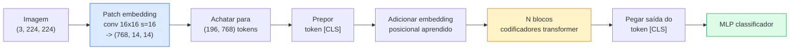

# Vision Transformers (ViT)

> Corte a imagem em patches, trate cada patch como uma palavra, execute um transformer padrão. Não olhe para trás.

**Tipo:** Construção
**Linguagens:** Python
**Pré-requisitos:** Phase 7 Lesson 02 (Self-Attention), Phase 4 Lesson 04 (Classificação de Imagens)
**Tempo:** ~45 minutos

## Objetivos de Aprendizado

- Implementar patch embedding, embedding posicional aprendido, token de classe e blocos codificadores transformer do zero para construir um ViT mínimo
- Explicar por que se pensava que ViT precisava de enormes dados de pré-treinamento até DeiT e MAE provarem o contrário
- Comparar ViT, Swin e ConvNeXt em seus priores arquiteturais (nenhum, atenção em janela local, backbone convolucional)
- Ajustar fino um ViT pré-treinado em um pequeno dataset usando `timm` e a receita padrão de sonda linear / fine-tune

## O Problema

Por uma década, convolução foi sinônimo de visão computacional. CNNs tinham fortes vieses indutivos — localidade, equivariância à translação — que ninguém achava que poderiam ser substituídos. Então Dosovitskiy et al. (2020) mostraram que um transformer simples aplicado a patches de imagem achatados, sem nenhum maquinário convolucional, podia igualar ou superar as melhores CNNs em escala.

A pegadinha era "em escala." ViT na ImageNet-1k perdia para ResNet. ViT pré-treinado na ImageNet-21k ou JFT-300M e então ajustado fino na ImageNet-1k a superava. A conclusão foi que transformers careciam de priores úteis mas podiam aprendê-los com dados suficientes. Trabalho subsequente (DeiT, MAE, DINO) mostrou que com as receitas de treino certas — aumento forte, pré-treinamento auto-supervisionado, destilação — ViTs treinam bem em dados pequenos também.

Em 2026, CNNs puras ainda são competitivas em dispositivos de borda (ConvNeXt é o mais forte), mas transformers dominam todo o resto: segmentação (Mask2Former, SegFormer), detecção (DETR, RT-DETR), multimodal (CLIP, SigLIP), vídeo (VideoMAE, VJEPA). A estrutura de bloco ViT é a que se deve conhecer.

## O Conceito

### O pipeline



Sete passos. Patches -> tokens -> atenção -> classificador. Toda variante (DeiT, Swin, ConvNeXt, MAE pretraining) muda um ou dois dos sete e deixa o resto em paz.

### Patch embedding

A primeira conv é o segredo. Kernel size 16, stride 16, então uma imagem 224x224 se torna uma grade 14x14 de patches 16x16, cada um projetado para um embedding de 768 dim. Essa única conv tanto patchifica quanto projeta linearmente.

```
Entrada:  (3, 224, 224)
Conv (3 -> 768, k=16, s=16, sem padding):
Saída:    (768, 14, 14)
Achatar espacial: (196, 768)
```

196 patches = 196 tokens. A dimensão de característica de cada token é 768 (ViT-B), 1024 (ViT-L) ou 1280 (ViT-H).

### Token de classe

Um único vetor aprendido pré-pendente à sequência:

```
tokens = [CLS; patch_1; patch_2; ...; patch_196]   shape (197, 768)
```

Após N blocos transformer, a saída `[CLS]` é a representação global da imagem. A cabeça de classificação lê apenas este vetor.

### Embedding posicional

Transformers não têm noção embutida de posição espacial. Adicione um vetor aprendido a cada token:

```
tokens = tokens + learned_pos_embedding   (também shape (197, 768))
```

O embedding é um parâmetro do modelo; o treinamento baseado em gradiente o adapta à estrutura da imagem 2D. Alternativas senoidais 2D existem mas raramente são usadas na prática.

### Bloco codificador transformer

Padrão. Multi-head self-attention, MLP, conexões residuais, pre-LayerNorm.

```
x = x + MSA(LN(x))
x = x + MLP(LN(x))

MLP é duas camadas com GELU: Linear(d -> 4d) -> GELU -> Linear(4d -> d)
```

ViT-B/16 empilha 12 destes blocos, cada um com 12 cabeças de atenção, totalizando 86M parâmetros.

### Por que pre-LN

Transformers antigos usavam post-LN (`x = LN(x + sublayer(x))`) e lutavam para treinar além de 6-8 camadas sem warmup. Pre-LN (`x = x + sublayer(LN(x))`) treina redes mais profundas estavelmente sem warmup. Todo ViT e todo LLM moderno usa pre-LN.

### Trade-off de tamanho de patch

- Patches 16x16 -> 196 tokens, padrão.
- Patches 32x32 -> 49 tokens, mais rápido mas resolução mais baixa.
- Patches 8x8 -> 784 tokens, mais fino mas custo de atenção O(n^2) escala mal.

Patches maiores = menos tokens = mais rápido mas menos detalhe espacial. SwinV2 usa patches 4x4 em janelas hierárquicas.

### Receita do DeiT para treinar ViT na ImageNet-1k

O ViT original precisava de JFT-300M para superar CNNs. DeiT (Touvron et al., 2020) treinou ViT-B para 81.8% top-1 na ImageNet-1k sozinha com quatro mudanças:

1. Aumento pesado: RandAugment, Mixup, CutMix, Random Erasing.
2. Stochastic depth (descarte blocos inteiros aleatoriamente durante o treino).
3. Aumento repetido (mesma imagem amostrada 3 vezes por lote).
4. Destilação de um professor CNN (opcional, eleva ainda mais a acurácia).

Toda receita moderna de treinamento ViT descende do DeiT.

### Swin vs ConvNeXt

- **Swin** (Liu et al., 2021) — atenção baseada em janela. Cada bloco atende dentro de uma janela local; blocos alternados deslocam a janela para misturar informações entre janelas. Traz de volta um prior de localidade tipo CNN mantendo o operador de atenção.
- **ConvNeXt** (Liu et al., 2022) — CNN reprojetada que corresponde às escolhas arquiteturais do Swin (convs depthwise, LayerNorm, GELU, gargalo invertido). Mostrou que a lacuna não é "atenção vs convolução" mas "receita de treino moderna + arquitetura."

Em 2026, ConvNeXt-V2 e Swin-V2 são ambos de nível de produção; a escolha certa depende do seu stack de inferência (ConvNeXt compila melhor para borda) e corpus de pré-treinamento.

### Pré-treinamento MAE

Masked Autoencoder (He et al., 2022): mascare 75% dos patches aleatoriamente, treine o codificador para processar apenas os 25% visíveis, treine um pequeno decodificador para reconstruir os patches mascarados a partir da saída do codificador. Após o pré-treinamento, descarte o decodificador e ajuste fino o codificador.

MAE torna o ViT treinável na ImageNet-1k sozinha, atinge SOTA e é a receita auto-supervisionada padrão atual.

## Construa

### Passo 1: Patch embedding

```python
import torch
import torch.nn as nn

class PatchEmbedding(nn.Module):
    def __init__(self, in_channels=3, patch_size=16, dim=192, image_size=64):
        super().__init__()
        assert image_size % patch_size == 0
        self.proj = nn.Conv2d(in_channels, dim, kernel_size=patch_size, stride=patch_size)
        num_patches = (image_size // patch_size) ** 2
        self.num_patches = num_patches

    def forward(self, x):
        x = self.proj(x)
        return x.flatten(2).transpose(1, 2)
```

Uma conv, um flatten, um transpose. Esse é o passo inteiro de imagem-para-tokens.

### Passo 2: Bloco transformer

Pre-LN, multi-head self-attention, MLP com GELU, conexões residuais.

```python
class Block(nn.Module):
    def __init__(self, dim, num_heads, mlp_ratio=4, dropout=0.0):
        super().__init__()
        self.ln1 = nn.LayerNorm(dim)
        self.attn = nn.MultiheadAttention(dim, num_heads, dropout=dropout, batch_first=True)
        self.ln2 = nn.LayerNorm(dim)
        self.mlp = nn.Sequential(
            nn.Linear(dim, dim * mlp_ratio),
            nn.GELU(),
            nn.Dropout(dropout),
            nn.Linear(dim * mlp_ratio, dim),
            nn.Dropout(dropout),
        )

    def forward(self, x):
        a, _ = self.attn(self.ln1(x), self.ln1(x), self.ln1(x), need_weights=False)
        x = x + a
        x = x + self.mlp(self.ln2(x))
        return x
```

`nn.MultiheadAttention` lida com a divisão em cabeças, o produto escalar escalado e a projeção de saída. `batch_first=True` para que as formas sejam `(N, seq, dim)`.

### Passo 3: O ViT

```python
class ViT(nn.Module):
    def __init__(self, image_size=64, patch_size=16, in_channels=3,
                 num_classes=10, dim=192, depth=6, num_heads=3, mlp_ratio=4):
        super().__init__()
        self.patch = PatchEmbedding(in_channels, patch_size, dim, image_size)
        num_patches = self.patch.num_patches
        self.cls_token = nn.Parameter(torch.zeros(1, 1, dim))
        self.pos_embed = nn.Parameter(torch.zeros(1, num_patches + 1, dim))
        self.blocks = nn.ModuleList([
            Block(dim, num_heads, mlp_ratio) for _ in range(depth)
        ])
        self.ln = nn.LayerNorm(dim)
        self.head = nn.Linear(dim, num_classes)
        nn.init.trunc_normal_(self.pos_embed, std=0.02)
        nn.init.trunc_normal_(self.cls_token, std=0.02)

    def forward(self, x):
        x = self.patch(x)
        cls = self.cls_token.expand(x.size(0), -1, -1)
        x = torch.cat([cls, x], dim=1)
        x = x + self.pos_embed
        for blk in self.blocks:
            x = blk(x)
        x = self.ln(x[:, 0])
        return self.head(x)

vit = ViT(image_size=64, patch_size=16, num_classes=10, dim=192, depth=6, num_heads=3)
x = torch.randn(2, 3, 64, 64)
print(f"saída: {vit(x).shape}")
print(f"params: {sum(p.numel() for p in vit.parameters()):,}")
```

Cerca de 2.8M parâmetros — um ViT minúsculo tratável em CPU. O ViT-B real tem 86M; mesma definição de classe com `dim=768, depth=12, num_heads=12`.

### Passo 4: Verificação de sanidade — inferência de imagem única

```python
logits = vit(torch.randn(1, 3, 64, 64))
print(f"logits: {logits}")
print(f"probs:  {logits.softmax(-1)}")
```

Deve rodar sem erro. Probabilidades somam 1.

## Use

`timm` oferece toda variante ViT com pesos pré-treinados ImageNet. Uma linha:

```python
import timm

model = timm.create_model("vit_base_patch16_224", pretrained=True, num_classes=10)
```

`timm` é o padrão de produção para vision transformers em 2026. Suporta ViT, DeiT, Swin, Swin-V2, ConvNeXt, ConvNeXt-V2, MaxViT, MViT, EfficientFormer e dezenas de outros sob a mesma API.

Para trabalho multimodal (imagem + texto), `transformers` oferece CLIP, SigLIP, BLIP-2, LLaVA. O codificador de imagem em todos eles é uma variante ViT.

## Entregue

Esta lição produz:

- `outputs/prompt-vit-vs-cnn-picker.md` — um prompt que escolhe entre um ViT, um ConvNeXt ou um Swin com base no tamanho do dataset, computação e stack de inferência.
- `outputs/skill-vit-patch-and-pos-embed-inspector.md` — uma skill que verifica se o patch embedding e o embedding posicional de um ViT correspondem ao comprimento de sequência esperado do modelo, capturando os bugs de portabilidade mais comuns.

## Exercícios

1. **(Fácil)** Imprima as formas de cada tensor intermediário para uma passagem forward através do tiny ViT acima. Confirme: entrada `(N, 3, 64, 64)` -> patches `(N, 16, 192)` -> com CLS `(N, 17, 192)` -> entrada do classificador `(N, 192)` -> saída `(N, num_classes)`.
2. **(Médio)** Ajuste fino um ViT-S/16 pré-treinado do `timm` no dataset CIFAR sintético da Lição 4. Compare com fine-tuning do ResNet-18 nos mesmos dados. Reporte tempo de treino e acurácia final.
3. **(Difícil)** Implemente pré-treinamento MAE para o tiny ViT: mascare 75% dos patches, treine o codificador + um pequeno decodificador para reconstruir os patches mascarados. Avalie a acurácia de sonda linear nos dados sintéticos antes e depois do pré-treinamento.

## Termos-Chave

| Termo | O que as pessoas dizem | O que realmente significa |
|-------|------------------------|---------------------------|
| Patch embedding | "A primeira conv" | Uma conv com kernel size = stride = tamanho do patch; transforma a imagem em uma grade de embeddings de token |
| Token de classe | "[CLS]" | Um vetor aprendido pré-pendente à sequência de tokens; sua saída final é a representação global da imagem |
| Embedding posicional | "Pos aprendido" | Um vetor aprendido adicionado a cada token para que o transformer saiba de onde cada patch veio |
| Pre-LN | "LayerNorm antes da subcamada" | A variante estável do transformer: `x + sublayer(LN(x))` em vez de `LN(x + sublayer(x))` |
| Multi-head attention | "Atenção paralela" | Atenção transformer padrão dividida em num_heads subespaços independentes, concatenados depois |
| ViT-B/16 | "Base, patch 16" | O tamanho canônico: dim=768, depth=12, heads=12, patch_size=16, image=224; ~86M params |
| DeiT | "ViT eficiente em dados" | ViT treinado na ImageNet-1k sozinha com aumento forte; provou que grandes datasets de pré-treinamento não são estritamente necessários |
| MAE | "Autoencoder mascarado" | Pré-treinamento auto-supervisionado: mascare 75% dos patches, reconstrua; a receita dominante de pré-treinamento ViT |

## Leitura Complementar

- [An Image is Worth 16x16 Words (Dosovitskiy et al., 2020)](https://arxiv.org/abs/2010.11929) — o paper do ViT
- [DeiT: Data-efficient Image Transformers (Touvron et al., 2020)](https://arxiv.org/abs/2012.12877) — como treinar ViT na ImageNet-1k sozinha
- [Masked Autoencoders are Scalable Vision Learners (He et al., 2022)](https://arxiv.org/abs/2111.06377) — pré-treinamento MAE
- [timm documentation](https://huggingface.co/docs/timm) — a referência para todo vision transformer que você usará em produção
