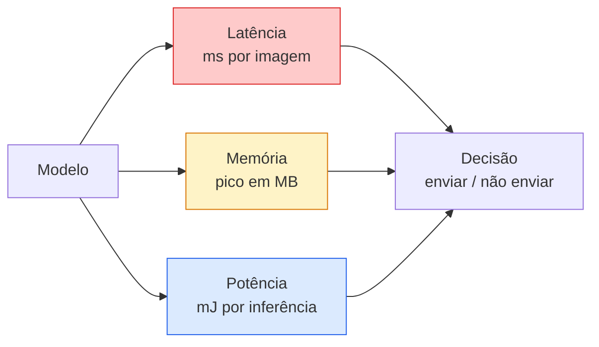

# Visão em Tempo Real — Implantação na Borda

> Inferência na borda é a disciplina de fazer um modelo com 90% de acurácia rodar a 30 fps em um dispositivo com 2 GB de RAM. Cada ponto percentual de acurácia é trocado por milissegundos de latência.

**Tipo:** Aprender + Construir
**Linguagens:** Python
**Pré-requisitos:** Phase 4 Lesson 04 (Classificação de Imagens), Phase 10 Lesson 11 (Quantização)
**Tempo:** ~75 minutos

## Objetivos de Aprendizado

- Medir latência de inferência, pico de memória e throughput para qualquer modelo PyTorch, e ler o trade-off FLOPs / params / latência
- Quantizar um modelo de visão para INT8 usando quantização pós-treinamento do PyTorch e verificar perda de acurácia < 1%
- Exportar para ONNX e compilar com ONNX Runtime ou TensorRT; nomear as três falhas de exportação mais comuns e suas correções
- Explicar quando escolher MobileNetV3, EfficientNet-Lite, ConvNeXt-Tiny ou MobileViT para uma restrição de borda

## O Problema

Um modelo de visão em tempo de treino é um monstro de ponto flutuante. 100M de parâmetros, 10 GFLOPs por passagem forward, 2 GB de VRAM. Nada disso cabe em um telefone, na unidade de infotainment de um carro, em uma câmera industrial ou em um drone. Entregar um sistema de visão significa encaixar as mesmas predições em um orçamento que é 100x menor.

Três knobs fazem a maior parte do trabalho: escolha do modelo (uma arquitetura menor com a mesma receita), quantização (INT8 em vez de FP32) e o runtime de inferência (ONNX Runtime, TensorRT, Core ML, TFLite). Acertá-los é a diferença entre uma demo que roda em uma workstation e um produto que é enviado em um módulo de câmera de $30.

Esta lição estabelece a disciplina de medição primeiro (você não pode otimizar o que não pode medir), depois percorre os três knobs. O objetivo não é aprender todo runtime de borda, mas saber quais alavancas existem e como verificar se cada uma faz o que você pensa.

## O Conceito

### Os três orçamentos



- **Latência**: p50, p95, p99. Tirar a média apenas do p50 esconde o comportamento de cauda que importa para sistemas em tempo real.
- **Pico de memória**: o máximo que o dispositivo jamais vê, não a média em estado estacionário. Importa porque OOMs são fatais em alvos embarcados.
- **Potência / energia**: milijoules por inferência em um dispositivo alimentado por bateria. Frequentemente aproximado por utilização de CPU/GPU * tempo.

Uma tabela de (modelo, latência, memória, acurácia) é a partir da qual uma decisão de borda é tomada. Cada célula é medida no dispositivo alvo, não na workstation.

### Disciplina de medição

Três regras que todo perfil de borda deve seguir:

1. **Aquecer** o modelo com 5-10 passagens forward dummy antes de medir. Caches frios e compilação JIT produzem primeiros números não representativos.
2. **Sincronizar** cargas de trabalho GPU com `torch.cuda.synchronize()` antes e depois do bloco cronometrado. Sem isso você mede despacho de kernel, não execução de kernel.
3. **Fixar tamanhos de entrada** para a resolução de produção. Latência em 224x224 não é latência em 512x512.

### FLOPs como proxy

FLOPs (operações de ponto flutuante por inferência) é um proxy barato e independente de dispositivo para latência. Útil para comparação de arquitetura, enganoso como tempo real de parede. Um modelo com 10% mais FLOPs pode ser 2x mais rápido na prática porque usa operações amigáveis ao hardware (convs depthwise compilam bem, convs 7x7 grandes não).

Regra: use FLOPs para busca de arquitetura, use latência no dispositivo para decisões de implantação.

### Quantização em um parágrafo

Substitua pesos e ativações FP32 por INT8. O tamanho do modelo cai 4x, a largura de banda de memória cai 4x, a computação cai 2-4x em hardware que tem kernels INT8 (todo SoC móvel moderno, toda NVIDIA GPU com Tensor Cores). A perda de acurácia em tarefas de visão é tipicamente 0.1-1 ponto percentual com quantização estática pós-treinamento.

Tipos:

- **Dinâmica** — quantiza pesos para INT8, ativações computadas em FP. Fácil, pequena aceleração.
- **Estática (pós-treinamento)** — quantiza pesos + calibra faixas de ativação em um pequeno conjunto de calibração. Muito mais rápida que dinâmica.
- **Treinamento ciente de quantização (QAT)** — simula quantização durante o treino para que o modelo aprenda ao redor dela. Melhor acurácia, precisa de dados rotulados.

Para visão, quantização estática pós-treinamento dá 95% do benefício com 5% do esforço. Use QAT apenas quando a perda de acurácia da PTQ for inaceitável.

### Poda e destilação

- **Poda** — remove pesos não importantes (baseado em magnitude) ou canais (estruturada). Funciona bem em modelos superparametrizados; menos útil em arquiteturas já compactas.
- **Destilação** — treina um estudante pequeno para imitar os logits de um professor grande. Frequentemente recupera a maior parte da acurácia perdida ao encolher o modelo. Padrão para modelos de borda em produção.

### Os runtimes de inferência

- **PyTorch eager** — lento, não para implantação. Use apenas para desenvolvimento.
- **TorchScript** — legado. Substituído por `torch.compile` e exportação ONNX.
- **ONNX Runtime** — o runtime neutro. CPU, CUDA, CoreML, TensorRT, OpenVINO todos têm provedores ONNX. Comece aqui.
- **TensorRT** — compilador da NVIDIA. Melhor latência em GPUs NVIDIA (workstation e Jetson). Integra com ONNX Runtime ou autônomo.
- **Core ML** — runtime da Apple para iOS/macOS. Precisa de `.mlmodel` ou `.mlpackage`.
- **TFLite** — runtime do Google para Android/ARM. Precisa de `.tflite`.
- **OpenVINO** — runtime da Intel para CPU/VPU. Precisa de `.xml` + `.bin`.

Na prática: exporte PyTorch -> ONNX -> escolha o runtime para o alvo. ONNX é a língua franca.

### Seletor de arquitetura de borda

| Orçamento | Modelo | Por que |
|-----------|--------|---------|
| < 3M params | MobileNetV3-Small | Compila em todo lugar, bom baseline |
| 3-10M | EfficientNet-Lite-B0 | Melhor acurácia por param no TFLite |
| 10-20M | ConvNeXt-Tiny | Melhor acurácia-por-param, amigável a CPU |
| 20-30M | MobileViT-S ou EfficientViT | Transformer com acurácia ImageNet |
| 30-80M | Swin-V2-Tiny | Se o stack suportar atenção em janela |

Quantize todos estes para INT8 a menos que você tenha uma razão específica para não o fazer.

## Construa

### Passo 1: Medir latência corretamente

```python
import time
import torch

def medir_latencia(model, input_shape, device="cpu", warmup=10, iters=50):
    model = model.to(device).eval()
    x = torch.randn(input_shape, device=device)
    with torch.no_grad():
        for _ in range(warmup):
            model(x)
        if device == "cuda":
            torch.cuda.synchronize()
        times = []
        for _ in range(iters):
            if device == "cuda":
                torch.cuda.synchronize()
            t0 = time.perf_counter()
            model(x)
            if device == "cuda":
                torch.cuda.synchronize()
            times.append((time.perf_counter() - t0) * 1000)
    times.sort()
    return {
        "p50_ms": times[len(times) // 2],
        "p95_ms": times[int(len(times) * 0.95)],
        "p99_ms": times[int(len(times) * 0.99)],
        "mean_ms": sum(times) / len(times),
    }
```

Aqueça, sincronize, use `time.perf_counter()`. Reporte percentis, não apenas a média.

### Passo 2: Contagens de parâmetros e FLOPs

```python
def contagem_parametros(model):
    return sum(p.numel() for p in model.parameters())

def estimativa_flops(model, input_shape):
    """
    Contagem aproximada de FLOPs para um modelo apenas conv/linear. Para produção use `fvcore` ou `ptflops`.
    """
    total = 0
    def hook_conv(m, inp, out):
        nonlocal total
        c_out, c_in, kh, kw = m.weight.shape
        h, w = out.shape[-2:]
        total += 2 * c_in * c_out * kh * kw * h * w
    def hook_linear(m, inp, out):
        nonlocal total
        total += 2 * m.in_features * m.out_features
    hooks = []
    for m in model.modules():
        if isinstance(m, torch.nn.Conv2d):
            hooks.append(m.register_forward_hook(hook_conv))
        elif isinstance(m, torch.nn.Linear):
            hooks.append(m.register_forward_hook(hook_linear))
    model.eval()
    with torch.no_grad():
        model(torch.randn(input_shape))
    for h in hooks:
        h.remove()
    return total
```

Para projetos reais, use `fvcore.nn.FlopCountAnalysis` ou `ptflops`; eles lidam com todo tipo de módulo corretamente.

### Passo 3: Quantização estática pós-treinamento

```python
def quantizar_ptq(model, calibration_loader, backend="x86"):
    import torch.ao.quantization as tq
    model = model.eval().cpu()
    model.qconfig = tq.get_default_qconfig(backend)
    tq.prepare(model, inplace=True)
    with torch.no_grad():
        for x, _ in calibration_loader:
            model(x)
    tq.convert(model, inplace=True)
    return model
```

Três passos: configurar, preparar (inserir observadores), calibrar com dados reais, converter (fundir + quantizar). Requer que o modelo seja fundido (`Conv -> BN -> ReLU` -> `ConvBnReLU`), o que `torch.ao.quantization.fuse_modules` lida.

### Passo 4: Exportar para ONNX

```python
def exportar_onnx(model, sample_input, path="model.onnx"):
    model = model.eval()
    torch.onnx.export(
        model,
        sample_input,
        path,
        input_names=["input"],
        output_names=["output"],
        dynamic_axes={"input": {0: "batch"}, "output": {0: "batch"}},
        opset_version=17,
    )
    return path
```

`opset_version=17` é o padrão seguro em 2026. `dynamic_axes` permite que você execute o modelo ONNX com tamanho de lote arbitrário.

### Passo 5: Benchmark e comparar regimes

```python
import torch.nn as nn
from torchvision.models import mobilenet_v3_small

def comparar_regimes():
    model = mobilenet_v3_small(weights=None, num_classes=10)
    params = contagem_parametros(model)
    flops = estimativa_flops(model, (1, 3, 224, 224))
    lat_fp32 = medir_latencia(model, (1, 3, 224, 224), device="cpu")
    print(f"FP32 MobileNetV3-Small: {params:,} params  {flops/1e9:.2f} GFLOPs  "
          f"p50={lat_fp32['p50_ms']:.2f}ms  p95={lat_fp32['p95_ms']:.2f}ms")
```

Execute a mesma função para `resnet50`, `efficientnet_v2_s` e `convnext_tiny` e você tem a tabela de comparação necessária para uma decisão de implantação.

## Use

Stacks de produção convergem para um de três caminhos:

- **Web / serverless**: PyTorch -> ONNX -> ONNX Runtime (CPU ou CUDA provider). Mais fácil, bom o suficiente para a maioria.
- **NVIDIA edge (Jetson, GPU server)**: PyTorch -> ONNX -> TensorRT. Melhor latência, maior esforço de engenharia.
- **Mobile**: PyTorch -> ONNX -> Core ML (iOS) ou TFLite (Android). Quantize antes de exportar.

Para medição, `torch-tb-profiler`, `nvprof` / `nsys`, e Instruments no macOS dão detalhamentos camada por camada. `benchmark_app` (OpenVINO) e `trtexec` (TensorRT) fornecem números CLI autônomos.

## Entregue

Esta lição produz:

- `outputs/prompt-edge-deployment-planner.md` — um prompt que escolhe backbone, estratégia de quantização e runtime dado o dispositivo alvo e SLA de latência.
- `outputs/skill-latency-profiler.md` — uma skill que escreve um script completo de benchmark de latência com aquecimento, sincronização, percentis e rastreamento de memória.

## Exercícios

1. **(Fácil)** Meça latência p50 para `resnet18`, `mobilenet_v3_small`, `efficientnet_v2_s` e `convnext_tiny` em 224x224 na CPU. Reporte a tabela e identifique qual arquitetura tem a melhor acurácia-por-ms.
2. **(Médio)** Aplique quantização estática pós-treinamento ao `mobilenet_v3_small`. Reporte latência FP32 vs INT8 e perda de acurácia em um subconjunto de validação do CIFAR-10 ou similar.
3. **(Difícil)** Exporte `convnext_tiny` para ONNX, execute-o através de `onnxruntime` com o `CPUExecutionProvider`, e compare a latência ao baseline PyTorch eager. Identifique a primeira camada onde ONNX Runtime é mais rápido e explique por que.

## Termos-Chave

| Termo | O que as pessoas dizem | O que realmente significa |
|-------|------------------------|---------------------------|
| Latência | "Quão rápido" | Tempo da entrada à saída; percentis p50/p95/p99, não média |
| FLOPs | "Tamanho do modelo" | Operações de ponto flutuante por passagem forward; proxy aproximado para custo computacional |
| Quantização INT8 | "8-bit" | Substituir pesos/ativações FP32 por inteiros de 8 bits; ~4x menor, 2-4x mais rápido |
| PTQ | "Quantização pós-treinamento" | Quantizar um modelo treinado sem retreinar; fácil, geralmente suficiente |
| QAT | "Treinamento ciente de quantização" | Simular quantização durante o treino; melhor acurácia, requer dados rotulados |
| ONNX | "O formato neutro" | Formato de troca de modelos suportado por todo runtime de inferência mainstream |
| TensorRT | "Compilador NVIDIA" | Compila ONNX em um motor otimizado para GPUs NVIDIA |
| Destilação | "Professor -> estudante" | Treinar um modelo pequeno para imitar os logits de um modelo grande; recupera a maior parte da acurácia perdida |

## Leitura Complementar

- [EfficientNet (Tan & Le, 2019)](https://arxiv.org/abs/1905.11946) — escalonamento composto para arquiteturas eficientes
- [MobileNetV3 (Howard et al., 2019)](https://arxiv.org/abs/1905.02244) — arquitetura mobile-first com h-swish e squeeze-excite
- [A Practical Guide to TensorRT Optimization (NVIDIA)](https://developer.nvidia.com/blog/accelerating-model-inference-with-tensorrt-tips-and-best-practices-for-pytorch-users/) — como realmente obter os números de throughput do paper
- [ONNX Runtime docs](https://onnxruntime.ai/docs/) — quantização, otimização de grafo, seleção de provedor
