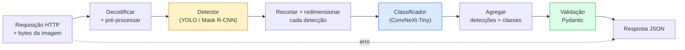

# Construa um Pipeline de Visão Completo — Capstone

> Um sistema de visão de produção é uma cadeia de modelos e regras costurados com contratos de dados. As peças já estão nesta fase; o capstone as conecta ponta a ponta.

**Tipo:** Construção
**Linguagens:** Python
**Pré-requisitos:** Phase 4 Lições 01-15
**Tempo:** ~120 minutos

## Objetivos de Aprendizado

- Projetar um pipeline de visão de produção que detecta objetos, os classifica e emite JSON estruturado — com cada caminho de falha tratado
- Conectar um detector (Mask R-CNN ou YOLO), um classificador (ConvNeXt-Tiny) e um contrato de dados (Pydantic) em um serviço
- Avaliar o pipeline ponta a ponta e identificar o primeiro gargalo (geralmente pré-processamento, depois o detector)
- Entregar um serviço FastAPI mínimo que aceita upload de imagem, executa o pipeline e retorna detecções com classificações

## O Problema

Modelos de visão individuais são úteis; produtos de visão são cadeias deles. Uma auditoria de prateleira de varejo é um detector mais um classificador de produto mais um pipeline de OCR de preço. Direção autônoma é um detector 2D mais um detector 3D mais um segmentador mais um rastreador mais um planejador. Uma triagem médica é um segmentador mais um classificador de região mais uma interface de usuário clínica.

Conectar essas cadeias é a parte que separa um protótipo de ML de um produto. Toda interface entre modelos é um novo lugar para bugs. Toda transformação de coordenadas, toda normalização, todo redimensionamento de máscara é um candidato a falha silenciosa. Um pipeline é tão forte quanto sua interface mais fraca.

Este capstone monta o pipeline mínimo viável: detecção + classificação + saída estruturada + uma camada de serviço. Todo o resto na Fase 4 se encaixa neste esqueleto: troque Mask R-CNN por YOLOv8, adicione uma cabeça de OCR, adicione um ramo de segmentação, adicione um rastreador. A arquitetura é estável; as peças são plugáveis.

## O Conceito

### O pipeline



Sete estágios. Os dois estágios de modelo são caros; os cinco outros estágios são onde os bugs vivem.

### Contratos de dados com Pydantic

Cada fronteira de modelo se torna um objeto tipado. Isso transforma falhas silenciosas em falhas ruidosas.

```
Detecao(
    box: tuple[float, float, float, float],   # (x1, y1, x2, y2), pixels absolutos
    score: float,                              # [0, 1]
    class_id: int,                             # do mapa de rótulos do detector
    mask: Optional[list[list[int]]],           # codificado em RLE se presente
)

ResultadoPipeline(
    image_id: str,
    deteccoes: list[Detecao],
    classificacoes: list[Classificacao],
    inferencia_ms: float,
)
```

Quando um detector retorna caixas em `(cx, cy, w, h)` em vez de `(x1, y1, x2, y2)`, a validação do Pydantic falha na fronteira e você descobre imediatamente em vez de depurar um recorte downstream que silenciosamente retorna regiões vazias.

### Para onde vai a latência

Três verdades valem em quase todo pipeline de visão:

1. **Pré-processamento é frequentemente o maior bloco único.** Decodificar JPEGs, converter espaços de cor, redimensionar — estes são vinculados à CPU e fáceis de esquecer.
2. **O detector domina o tempo de GPU.** 70-90% do tempo de GPU está na passagem forward da detecção.
3. **Pós-processamento (NMS, codificação/decodificação RLE) é barato na GPU, caro na CPU.** Sempre perfile com o alvo real.

Saber a distribuição é o que transforma otimização em uma lista priorizada.

### Modos de falha

- **Detecções vazias** — retorne lista vazia, não quebre. Registre.
- **Caixas fora dos limites** — prenda ao tamanho da imagem antes de recortar.
- **Recortes minúsculos** — pule a classificação para caixas menores que a entrada mínima do classificador.
- **Upload corrompido** — resposta 400 com um código de erro específico, não 500.
- **Falha ao carregar modelo** — falhe na inicialização do serviço, não na primeira requisição.

Um pipeline de produção lida com cada um destes sem escrever `try/except` genérico que esconde a falha. Toda falha recebe um código nomeado e uma resposta.

### Agrupamento em lote

Um serviço de produção atende múltiplos clientes. Agrupar detecções e classificações entre requisições multiplica o throughput. O trade-off: latência extra de esperar um lote encher. Configuração típica: coletar requisições por até 20ms, agrupar, processar, distribuir respostas. `torchserve` e `triton` fazem isso nativamente; serviços pequenos com carga previsível criam seu próprio micro-batcher.

## Construa

### Passo 1: Contratos de dados

```python
from pydantic import BaseModel, Field
from typing import List, Optional, Tuple

class Detecao(BaseModel):
    box: Tuple[float, float, float, float]
    score: float = Field(ge=0, le=1)
    class_id: int = Field(ge=0)
    mask_rle: Optional[str] = None


class Classificacao(BaseModel):
    detection_index: int
    class_id: int
    class_name: str
    score: float = Field(ge=0, le=1)


class ResultadoPipeline(BaseModel):
    image_id: str
    deteccoes: List[Detecao]
    classificacoes: List[Classificacao]
    inferencia_ms: float
```

Cinco segundos de código economizam uma hora de depuração em qualquer pipeline sério.

### Passo 2: Uma classe Pipeline mínima

```python
import time
import numpy as np
import torch
from PIL import Image

class PipelineVisao:
    def __init__(self, detector, classifier, nomes_classes,
                 device="cpu", min_crop=32):
        self.detector = detector.to(device).eval()
        self.classifier = classifier.to(device).eval()
        self.nomes_classes = nomes_classes
        self.device = device
        self.min_crop = min_crop

    def preprocessar(self, image):
        """
        image: PIL.Image ou np.ndarray (H, W, 3) uint8
        retorna: tensor float CHW no device
        """
        if isinstance(image, Image.Image):
            image = np.asarray(image.convert("RGB"))
        tensor = torch.from_numpy(image).permute(2, 0, 1).float() / 255.0
        return tensor.to(self.device)

    @torch.no_grad()
    def detectar(self, tensor_imagem):
        return self.detector([tensor_imagem])[0]

    @torch.no_grad()
    def classificar(self, recortes):
        if len(recortes) == 0:
            return []
        batch = torch.stack(recortes).to(self.device)
        logits = self.classifier(batch)
        probs = logits.softmax(-1)
        scores, cls = probs.max(-1)
        return list(zip(cls.tolist(), scores.tolist()))

    def executar(self, image, image_id="anonimo"):
        t0 = time.perf_counter()
        tensor = self.preprocessar(image)
        det = self.detectar(tensor)

        recortes = []
        deteccoes = []
        indices_validos = []
        for i, (box, score, cls) in enumerate(zip(det["boxes"], det["scores"], det["labels"])):
            x1, y1, x2, y2 = [max(0, int(b)) for b in box.tolist()]
            x2 = min(x2, tensor.shape[-1])
            y2 = min(y2, tensor.shape[-2])
            deteccoes.append(Detecao(
                box=(x1, y1, x2, y2),
                score=float(score),
                class_id=int(cls),
            ))
            if (x2 - x1) < self.min_crop or (y2 - y1) < self.min_crop:
                continue
            recorte = tensor[:, y1:y2, x1:x2]
            recorte = torch.nn.functional.interpolate(
                recorte.unsqueeze(0),
                size=(224, 224),
                mode="bilinear",
                align_corners=False,
            )[0]
            recortes.append(recorte)
            indices_validos.append(i)

        preds_classe = self.classificar(recortes)

        classificacoes = []
        for idx_valido, (cls_id, cls_score) in zip(indices_validos, preds_classe):
            classificacoes.append(Classificacao(
                detection_index=idx_valido,
                class_id=int(cls_id),
                class_name=self.nomes_classes[cls_id],
                score=float(cls_score),
            ))

        return ResultadoPipeline(
            image_id=image_id,
            deteccoes=deteccoes,
            classificacoes=classificacoes,
            inferencia_ms=(time.perf_counter() - t0) * 1000,
        )
```

Toda interface é tipada. Todo caminho de falha tem uma decisão de tratamento específica.

### Passo 3: Conectar um detector e um classificador

```python
from torchvision.models.detection import maskrcnn_resnet50_fpn_v2
from torchvision.models import convnext_tiny

# Use pesos pré-treinados ImageNet para um pipeline realista sem treino
detector = maskrcnn_resnet50_fpn_v2(weights="DEFAULT")
classifier = convnext_tiny(weights="DEFAULT")
nomes_classes = [f"imagenet_class_{i}" for i in range(1000)]

pipe = PipelineVisao(detector, classifier, nomes_classes)

# Teste de fumaça com uma imagem sintética
test_image = (np.random.rand(400, 600, 3) * 255).astype(np.uint8)
result = pipe.executar(test_image, image_id="demo")
print(result.model_dump_json(indent=2)[:500])
```

### Passo 4: Serviço FastAPI

```python
from fastapi import FastAPI, UploadFile, HTTPException
from io import BytesIO

app = FastAPI()
pipe = None  # inicializado na inicialização

@app.on_event("startup")
def load():
    global pipe
    detector = maskrcnn_resnet50_fpn_v2(weights="DEFAULT").eval()
    classifier = convnext_tiny(weights="DEFAULT").eval()
    pipe = PipelineVisao(detector, classifier, nomes_classes=[f"c{i}" for i in range(1000)])

@app.post("/detect")
async def detect_endpoint(file: UploadFile):
    if file.content_type not in {"image/jpeg", "image/png", "image/webp"}:
        raise HTTPException(status_code=400, detail="tipo de imagem não suportado")
    data = await file.read()
    try:
        img = Image.open(BytesIO(data)).convert("RGB")
    except Exception:
        raise HTTPException(status_code=400, detail="não é possível decodificar imagem")
    result = pipe.executar(img, image_id=file.filename or "upload")
    return result.model_dump()
```

Execute com `uvicorn main:app --host 0.0.0.0 --port 8000`. Teste com `curl -F 'file=@dog.jpg' http://localhost:8000/detect`.

### Passo 5: Benchmark do pipeline

```python
import time

def benchmark(pipe, num_execucoes=20, image_size=(400, 600)):
    img = (np.random.rand(*image_size, 3) * 255).astype(np.uint8)
    pipe.executar(img)  # aquecer

    stages = {"preprocess": [], "detect": [], "classify": [], "total": []}
    for _ in range(num_execucoes):
        t0 = time.perf_counter()
        tensor = pipe.preprocessar(img)
        t1 = time.perf_counter()
        det = pipe.detectar(tensor)
        t2 = time.perf_counter()
        recortes = []
        for box in det["boxes"]:
            x1, y1, x2, y2 = [max(0, int(b)) for b in box.tolist()]
            x2 = min(x2, tensor.shape[-1])
            y2 = min(y2, tensor.shape[-2])
            if (x2 - x1) >= pipe.min_crop and (y2 - y1) >= pipe.min_crop:
                recorte = tensor[:, y1:y2, x1:x2]
                recorte = torch.nn.functional.interpolate(
                    recorte.unsqueeze(0), size=(224, 224), mode="bilinear", align_corners=False
                )[0]
                recortes.append(recorte)
        pipe.classificar(recortes)
        t3 = time.perf_counter()
        stages["preprocess"].append((t1 - t0) * 1000)
        stages["detect"].append((t2 - t1) * 1000)
        stages["classify"].append((t3 - t2) * 1000)
        stages["total"].append((t3 - t0) * 1000)

    for stage, times in stages.items():
        times.sort()
        print(f"{stage:12s}  p50={times[len(times)//2]:7.1f} ms  p95={times[int(len(times)*0.95)]:7.1f} ms")
```

Saída típica em CPU: preprocess ~3 ms, detect 300-500 ms, classify 20-40 ms, total 350-550 ms. Em GPU, detect é 20-40 ms e preprocess + classify começam a importar mais em termos relativos.

## Use

Templates de produção convergem para a mesma estrutura, mais:

- **Versionamento de modelo** — sempre registre o nome do modelo e hash dos pesos na resposta.
- **IDs de rastreamento por requisição** — registre o timing de cada estágio para toda requisição para que você possa correlacionar respostas lentas com estágios.
- **Caminho de fallback** — se o classificador exceder o tempo limite, retorne detecções sem classificações em vez de falhar a requisição inteira.
- **Filtros de segurança** — filtros NSFW / PII rodam após a classificação, antes que a resposta saia do serviço.
- **Endpoint de lote** — um `/detect_batch` aceitando uma lista de URLs de imagem para processamento em massa.

Para servir em produção, `torchserve`, `Triton Inference Server` e `BentoML` lidam com agrupamento em lote, versionamento, métricas e verificações de saúde prontos para uso. Rodar `FastAPI` diretamente é bom para protótipos e produtos de pequena escala.

## Entregue

Esta lição produz:

- `outputs/prompt-vision-service-shape-reviewer.md` — um prompt que revisa o código de um serviço de visão para violações de contrato/forma de resposta e nomeia o primeiro bug de quebra.
- `outputs/skill-pipeline-budget-planner.md` — uma skill que, dada latência alvo e throughput, atribui um orçamento de tempo para cada estágio do pipeline e sinaliza qual estágio perderá seu orçamento primeiro.

## Exercícios

1. **(Fácil)** Execute o pipeline em 10 imagens de qualquer dataset aberto. Reporte o tempo médio por estágio e a distribuição de contagens de detecção por imagem.
2. **(Médio)** Adicione um campo de saída de máscara a `Detecao` e codifique-o como RLE. Verifique que o JSON permanece abaixo de 1MB mesmo para uma imagem de 10 objetos.
3. **(Difícil)** Adicione um micro-batcher na frente do classificador: colete recortes por até 10 ms, classifique todos em uma única chamada GPU, retorne resultados por requisição. Meça o ganho de throughput em 5 requisições concorrentes por segundo e a latência adicionada.

## Termos-Chave

| Termo | O que as pessoas dizem | O que realmente significa |
|-------|------------------------|---------------------------|
| Pipeline | "O sistema" | Uma cadeia ordenada de etapas de pré-processamento, inferência e pós-processamento com uma interface tipada entre cada par |
| Contrato de dados | "O esquema" | Definições Pydantic / dataclass que toda entrada e saída de estágio segue; pega bugs de integração na fronteira |
| Pré-processamento | "Antes do modelo" | Decodificação, conversão de cor, redimensionamento, normalização; geralmente o maior consumidor de tempo de CPU |
| Pós-processamento | "Depois do modelo" | NMS, redimensionamento de máscara, limiarização, codificação RLE; barato na GPU, caro na CPU |
| Micro-batcher | "Coletar então encaminhar" | Agregador que espera uma janela fixa por múltiplas requisições, executa uma única passagem forward em lote |
| ID de rastreamento | "ID de requisição" | Identificador por requisição registrado em cada estágio para que requisições lentas possam ser rastreadas ponta a ponta |
| Código de falha | "Erro nomeado" | Código de erro específico por classe de falha em vez de 500 genérico; permite lógica de retry do cliente |
| Verificação de saúde | "Sonda de prontidão" | Endpoint barato que reporta se o serviço pode responder; balanceadores de carga dependem disso |

## Leitura Complementar

- [Full Stack Deep Learning — Deploying Models](https://fullstackdeeplearning.com/course/2022/lecture-5-deployment/) — a visão geral canônica de implantação de ML em produção
- [BentoML docs](https://docs.bentoml.com) — framework de serviço com agrupamento em lote, versionamento e métricas
- [torchserve docs](https://pytorch.org/serve/) — biblioteca oficial de serviço do PyTorch
- [NVIDIA Triton Inference Server](https://developer.nvidia.com/triton-inference-server) — serviço de alto throughput com agrupamento em lote e suporte a múltiplos modelos
