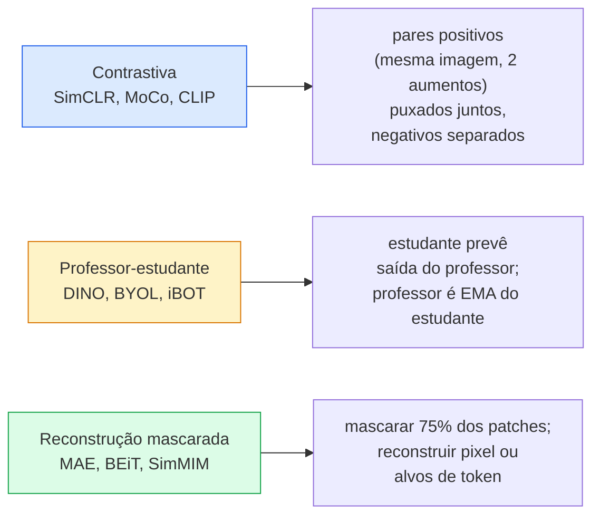

# Visão Auto-Supervisionada — SimCLR, DINO, MAE

> Rótulos são o gargalo da visão supervisionada. O pré-treinamento auto-supervisionado os remove: aprenda características visuais de 100M de imagens não rotuladas, ajuste fino em 10k rotuladas.

**Tipo:** Aprender + Construir
**Linguagens:** Python
**Pré-requisitos:** Phase 4 Lesson 04 (Classificação de Imagens), Phase 4 Lesson 14 (ViT)
**Tempo:** ~75 minutos

## Objetivos de Aprendizado

- Traçar as três principais famílias auto-supervisionadas — contrastiva (SimCLR), professor-estudante (DINO), reconstrução mascarada (MAE) — e declarar o que cada uma otimiza
- Implementar uma loss InfoNCE do zero e explicar por que um lote de 512 funciona mas um lote de 32 falha
- Explicar por que a taxa de mascaramento de 75% do MAE não é arbitrária e como difere dos 15% do BERT para texto
- Usar checkpoints DINOv2 ou MAE ImageNet para sonda linear e recuperação zero-shot

## O Problema

ImageNet supervisionada tem 1.3M de imagens rotuladas, que custam cerca de $10M para anotar. Datasets médicos e industriais são menores e ainda mais caros de rotular. Toda equipe de visão pergunta: podemos pré-treinar em dados baratos não rotulados — quadros do YouTube, crawls da web, filmagens de webcam, varreduras de satélite — e então ajustar fino em um pequeno conjunto rotulado?

Aprendizado auto-supervisionado é a resposta. Um ViT auto-supervisionado moderno treinado em LAION ou JFT atinge ou supera a acurácia supervisionada da ImageNet quando ajustado fino. Ele também transfere melhor para tarefas downstream (detecção, segmentação, profundidade) do que o pré-treinamento supervisionado. DINOv2 (Meta, 2023) e MAE (Meta, 2022) são os padrões de produção atuais para características de visão transferíveis.

A mudança conceitual é que a tarefa pretexto — a coisa que o modelo é treinado para fazer — não precisa ser a tarefa downstream. O que importa é que ela force o modelo a aprender características úteis. Prever a cor de imagens em escala de cinza, rotacionar imagens e pedir ao modelo para classificar a rotação, mascarar patches e reconstruí-los — tudo já funcionou. As três abordagens que escalam são aprendizado contrastivo, destilação professor-estudante e reconstrução mascarada.

## O Conceito

### Três famílias



### Aprendizado contrastivo (SimCLR)

Pegue uma imagem, aplique duas aumentações aleatórias, obtenha duas vistas. Alimente ambas através do mesmo codificador mais uma cabeça de projeção. Minimize uma loss que diz "esses dois embeddings devem estar próximos" e "este embedding deve estar longe dos embeddings de todas as outras imagens no lote."

```
Loss para o par positivo (z_i, z_j) entre 2N vistas por lote:

   L_ij = -log( exp(sim(z_i, z_j) / tau) / soma_k em lote \ {i} exp(sim(z_i, z_k) / tau) )

sim = similaridade cosseno
tau = temperatura (0.1 padrão)
```

Esta é a loss InfoNCE. Ela requer muitos negativos por positivo, então o tamanho do lote importa — SimCLR precisa de 512-8192. MoCo introduziu uma fila de momentum de lotes passados para desacoplar a contagem de negativos do tamanho do lote.

### Professor-estudante (DINO)

Duas redes com a mesma arquitetura: estudante e professor. O professor é uma média móvel exponencial (EMA) dos pesos do estudante. Ambos veem vistas aumentadas da imagem. A saída do estudante é treinada para corresponder à do professor — sem negativos explícitos.

```
loss = CE( saida_estudante(vista_1),  saida_professor(vista_2) )
     + CE( saida_estudante(vista_2),  saida_professor(vista_1) )

pesos_professor = m * pesos_professor + (1 - m) * pesos_estudante   (m ≈ 0.996)
```

Por que não colapsa para "prever uma constante": a saída do professor é centrada (subtrair média por dimensão) e afiada (dividir por temperatura pequena). O centramento impede que uma dimensão domine; o afiamento impede o colapso da saída para uniforme.

DINO é o que DINOv2 escala, em 142M imagens curadas. As características resultantes são a SOTA atual para recuperação visual zero-shot e predição densa.

### Reconstrução mascarada (MAE)

Masque 75% dos patches de uma entrada ViT. Passe apenas os 25% visíveis através do codificador. Um pequeno decodificador recebe a saída do codificador mais tokens de máscara nas posições mascaradas, e é treinado para reconstruir os pixels dos patches mascarados.

```
Codificador:  25% visíveis dos patches -> características
Decodificador:  características + tokens de máscara em posições mascaradas -> pixels reconstruídos
Loss:          MSE entre pixels reconstruídos e originais apenas nos patches mascarados
```

Escolhas de design que fazem o MAE funcionar:

- **75% de taxa de máscara** — alta. Força o codificador a aprender características semânticas; reconstruir 25% seria quase trivial (pixels vizinhos são tão correlacionados que uma CNN acertaria).
- **Codificador/decodificador assimétrico** — o grande codificador ViT vê apenas patches visíveis; um pequeno decodificador (8 camadas, 512-dim) lida com a reconstrução. 3x mais rápido que o BEiT ingênuo.
- **Alvo de reconstrução em espaço de pixel** — mais simples que o alvo tokenizado do BEiT e funciona melhor em ViT.

Após o pré-treinamento, descarte o decodificador. O codificador é o extrator de características.

### Por que 75% e não 15%

BERT mascara 15% dos tokens. MAE mascara 75%. A diferença é densidade de informação.

- Linguagem natural tem alta entropia por token. Prever 15% dos tokens ainda é difícil porque cada posição mascarada tem muitas continuações plausíveis.
- Patches de imagem têm baixa entropia — uma vizinhança não mascarada frequentemente determina os pixels do patch mascarado quase exatamente. Para fazer a predição exigir compreensão semântica, você tem que mascarar agressivamente.

75% é alto o suficiente para que a extrapolação espacial simples não possa resolver a tarefa; o codificador deve representar o conteúdo da imagem.

### Avaliação de sonda linear

Após o pré-treinamento auto-supervisionado, a avaliação padrão é uma **sonda linear**: congele o codificador, treine um único classificador linear no topo com rótulos ImageNet. Reporta acurácia top-1.

- SimCLR ResNet-50: ~71% (2020)
- DINO ViT-S/16: ~77% (2021)
- MAE ViT-L/16: ~76% (2022)
- DINOv2 ViT-g/14: ~86% (2023)

A sonda linear é uma medida pura da qualidade das características; o fine-tuning tipicamente adiciona 2-5 pontos mas também mistura o efeito do retreinamento da cabeça.

## Construa

### Passo 1: Pipeline de aumento de duas vistas

```python
import torch
import torchvision.transforms as T

dois_aumentos_treino = lambda: T.Compose([
    T.RandomResizedCrop(96, scale=(0.2, 1.0)),
    T.RandomHorizontalFlip(),
    T.ColorJitter(0.4, 0.4, 0.4, 0.1),
    T.RandomGrayscale(p=0.2),
    T.ToTensor(),
])


class DatasetDuasVistas(torch.utils.data.Dataset):
    def __init__(self, base):
        self.base = base
        self.aug = dois_aumentos_treino()

    def __len__(self):
        return len(self.base)

    def __getitem__(self, i):
        img, _ = self.base[i]
        v1 = self.aug(img)
        v2 = self.aug(img)
        return v1, v2
```

Cada `__getitem__` retorna duas vistas aumentadas da mesma imagem; rótulos não são necessários.

### Passo 2: Loss InfoNCE

```python
import torch.nn.functional as F

def info_nce(z1, z2, tau=0.1):
    """
    z1, z2: (N, D) embeddings normalizados L2 de vistas emparelhadas
    """
    N, D = z1.shape
    z = torch.cat([z1, z2], dim=0)  # (2N, D)
    sim = z @ z.T / tau              # (2N, 2N)

    mask = torch.eye(2 * N, dtype=torch.bool, device=z.device)
    sim = sim.masked_fill(mask, float("-inf"))

    targets = torch.cat([torch.arange(N, 2 * N), torch.arange(0, N)]).to(z.device)
    return F.cross_entropy(sim, targets)
```

Normalize L2 embeddings antes de chamar. `tau=0.1` é o padrão SimCLR; menor torna a loss mais acentuada e requer mais negativos.

### Passo 3: Verificação de sanidade da InfoNCE

```python
z1 = F.normalize(torch.randn(16, 32), dim=-1)
z2 = z1.clone()
loss_iguais = info_nce(z1, z2, tau=0.1).item()
z2_aleatorio = F.normalize(torch.randn(16, 32), dim=-1)
loss_aleatorio = info_nce(z1, z2_aleatorio, tau=0.1).item()
print(f"InfoNCE com pares idênticos:  {loss_iguais:.3f}")
print(f"InfoNCE com pares aleatórios: {loss_aleatorio:.3f}")
```

Pares idênticos devem dar uma loss baixa (próximo de 0 para um lote grande e temperatura fria). Pares aleatórios devem dar log(2N-1) = ~log(31) = ~3.4 com um lote de 16 pares.

### Passo 4: Mascaramento estilo MAE

```python
def indices_mascarar_aleatorio(num_patches, razao_mascara=0.75, seed=0):
    g = torch.Generator().manual_seed(seed)
    n_manter = int(num_patches * (1 - razao_mascara))
    perm = torch.randperm(num_patches, generator=g)
    visiveis = perm[:n_manter]
    mascarados = perm[n_manter:]
    return visiveis.sort().values, mascarados.sort().values


num_patches = 196
visiveis, mascarados = indices_mascarar_aleatorio(num_patches, razao_mascara=0.75)
print(f"visíveis: {len(visiveis)} / {num_patches}")
print(f"mascarados:  {len(mascarados)} / {num_patches}")
```

Simples, rápido e determinístico para uma dada semente. Implementações MAE reais processam isso em lote e mantêm máscaras por amostra.

## Use

DINOv2 é o padrão de produção em 2026:

```python
import torch
from transformers import AutoImageProcessor, AutoModel

processor = AutoImageProcessor.from_pretrained("facebook/dinov2-base")
model = AutoModel.from_pretrained("facebook/dinov2-base")
model.eval()

# Embeddings por imagem para recuperação zero-shot
with torch.no_grad():
    inputs = processor(images=[pil_image], return_tensors="pt")
    outputs = model(**inputs)
    embedding = outputs.last_hidden_state[:, 0]  # Token CLS
```

O embedding 768-dim resultante é a espinha dorsal da recuperação moderna de imagens, correspondência densa e pipelines de transferência zero-shot. O fine-tuning em uma tarefa downstream raramente precisa de mais que uma cabeça linear.

Para embeddings imagem-texto, SigLIP ou OpenCLIP é o equivalente; para fine-tuning estilo MAE, o repositório `timm` oferece todo checkpoint MAE.

## Entregue

Esta lição produz:

- `outputs/prompt-ssl-pretraining-picker.md` — um prompt que escolhe SimCLR / MAE / DINOv2 dado o tamanho do dataset, computação e tarefa downstream.
- `outputs/skill-linear-probe-runner.md` — uma skill que escreve a avaliação de sonda linear para qualquer codificador congelado + dataset rotulado.

## Exercícios

1. **(Fácil)** Verifique que a loss InfoNCE cai quando você diminui a temperatura para embeddings bem alinhados e sobe quando diminui a temperatura para embeddings aleatórios. Produza um gráfico `tau in [0.05, 0.1, 0.2, 0.5]` vs loss.
2. **(Médio)** Implemente um buffer de centro estilo DINO. Mostre que sem o centramento, o estudante colapsa para um vetor constante dentro de algumas épocas.
3. **(Difícil)** Treine MAE no CIFAR-100 usando o TinyUNet da Lição 10 como backbone. Reporte acurácia de sonda linear em 10, 50 e 200 épocas. Mostre que uma sonda linear pré-treinada com MAE supera uma sonda linear supervisionada do zero no mesmo subconjunto de 1.000 imagens.

## Termos-Chave

| Termo | O que as pessoas dizem | O que realmente significa |
|-------|------------------------|---------------------------|
| Auto-supervisionado | "Sem rótulos" | Uma tarefa pretexto que produz representações úteis a partir de dados não rotulados |
| Tarefa pretexto | "A tarefa falsa" | O objetivo usado durante SSL (reconstruir patches, combinar vistas); descartado após o pré-treinamento |
| Sonda linear | "Codificador congelado + cabeça linear" | Avaliação SSL padrão: treinar apenas um classificador linear no topo de características congeladas |
| InfoNCE | "Loss contrastiva" | softmax sobre similaridades cosseno; par positivo é a classe alvo, todos os outros são negativos |
| Professor EMA | "Professor de média móvel" | Professor cujos pesos são uma média móvel exponencial dos pesos do estudante; usado por BYOL, MoCo, DINO |
| Taxa de máscara | "% de patches escondidos" | Fração de patches mascarados durante MAE; 75% para visão, 15% para texto |
| Colapso de representação | "Saída constante" | Falha SSL onde o codificador produz um vetor constante para todas as entradas; prevenido por centramento, afiamento ou negativos |
| DINOv2 | "Backbone SSL de produção" | ViT auto-supervisionado da Meta 2023; características de imagem de propósito geral mais fortes em 2026 |

## Leitura Complementar

- [SimCLR (Chen et al., 2020)](https://arxiv.org/abs/2002.05709) — referência de aprendizado contrastivo
- [DINO (Caron et al., 2021)](https://arxiv.org/abs/2104.14294) — professor-estudante com momentum, centramento, afiamento
- [MAE (He et al., 2022)](https://arxiv.org/abs/2111.06377) — pré-treinamento de autoencoder mascarado para ViT
- [DINOv2 (Oquab et al., 2023)](https://arxiv.org/abs/2304.07193) — escalando ViT auto-supervisionado para características de produção
