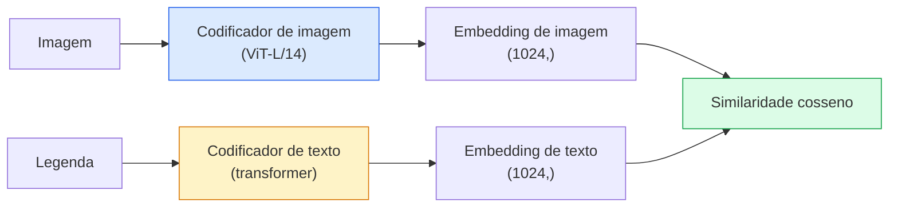

# Visão de Vocabulário Aberto — CLIP

> Treine um codificador de imagem e um codificador de texto juntos para que pares correspondentes (imagem, legenda) caiam no mesmo ponto em um espaço compartilhado. Esse é o truque inteiro.

**Tipo:** Construir + Usar
**Linguagens:** Python
**Pré-requisitos:** Phase 4 Lesson 14 (ViT), Phase 4 Lesson 17 (Auto-Supervisionado)
**Tempo:** ~45 minutos

## Objetivos de Aprendizado

- Explicar a arquitetura de duas torres do CLIP e o objetivo de treinamento contrastivo
- Usar um CLIP (ou SigLIP) pré-treinado para classificação zero-shot sem qualquer treinamento específico de tarefa
- Implementar classificação zero-shot do zero: codificar prompts de classe, computar similaridade cosseno, tomar argmax
- Distinguir CLIP, SigLIP, OpenCLIP e modelos LLaVA/LLaMA-visão — para que cada um serve em 2026

## O Problema

Classificadores tradicionais são de vocabulário fechado: um modelo ImageNet de 1000 classes só pode prever 1000 rótulos. Toda nova categoria requer dados rotulados e uma cabeça retreinada.

CLIP (Radford et al., OpenAI 2021) mostrou que treinar em 400M pares (imagem, legenda) raspados da web produz um modelo que pode classificar em qualquer conjunto de categorias na inferência, descritas puramente em linguagem natural. Você dá a ele uma nova classe escrevendo uma frase.

Essa capacidade — transferência zero-shot — é por que todo sistema de visão moderno começa com um checkpoint da família CLIP. Detecção (Grounding DINO, OWL-ViT), segmentação (CLIPSeg, SAM), recuperação, moderação de conteúdo, VLMs e geração texto-para-imagem todos se baseiam em embeddings conjuntos estilo CLIP.

## O Conceito

### Duas torres



Ambos os codificadores terminam com uma projeção linear para a mesma dimensão de embedding (512 para CLIP-B/32, 1024 para CLIP-L/14). Normalize L2 e compute similaridade cosseno.

### O objetivo

Dado um lote de N pares (imagem, legenda), construa uma matriz de similaridade NxN. Treine ambos os codificadores para que a diagonal (pares correspondentes) tenha alta similaridade e as fora da diagonal (não correspondentes) tenham baixa similaridade.

```
matriz_sim = embeddings_imagem @ embeddings_texto.T / tau

loss_i2t = cross_entropy(matriz_sim,       targets=arange(N))
loss_t2i = cross_entropy(matriz_sim.T,     targets=arange(N))
loss = (loss_i2t + loss_t2i) / 2
```

Simétrica porque tanto a recuperação imagem-para-texto quanto texto-para-imagem devem funcionar. `tau` (temperatura) é tipicamente aprendido como um parâmetro escalar, inicializado em 0.07.

### SigLIP: uma loss melhor

SigLIP (Zhai et al., 2023) substituiu o softmax por sigmoid por par:

```
loss = média sobre pares de log(1 + exp(-y_ij * sim_ij))
y_ij = +1 se correspondente, -1 caso contrário
```

A loss por par remove a normalização em nível de lote que o CLIP requer. SigLIP treina melhor em tamanhos de lote pequenos e iguala ou excede o CLIP em dados iguais.

### Classificação zero-shot

Dado um CLIP treinado:

1. Para cada classe, componha um prompt: "uma foto de {classe}".
2. Codifique todos os prompts de classe com o codificador de texto -> `T` shape (C, d).
3. Codifique a imagem de teste -> `I` shape (1, d).
4. Similaridade = `I @ T.T` shape (1, C).
5. Argmax -> classe prevista.

Engenharia de prompt importa. OpenAI publicou 80 templates de prompt para ImageNet ("uma foto de {}", "uma foto borrada de {}", "um esboço de {}", ...). Faça a média dos embeddings de todos os templates por classe para 1-3% extra de acurácia top-1.

### Onde modelos estilo CLIP são usados em 2026

- **Classificação zero-shot** — uso direto.
- **Recuperação de imagens** — codifique todas as imagens uma vez, incorpore consulta na inferência.
- **Detecção condicionada a texto** — Grounding DINO, OWL-ViT envolvem uma torre de texto CLIP em torno de um detector.
- **Segmentação condicionada a texto** — CLIPSeg; SAM usa entradas de prompt de texto via CLIP.
- **VLMs** — LLaVA, Qwen-VL, InternVL conectam um codificador de visão da família CLIP a um LLM.
- **Geração texto-para-imagem** — Stable Diffusion, DALL-E 3 condicionam em embeddings de texto CLIP.

Uma vez que você tem um espaço de embedding compartilhado, toda tarefa visão+linguagem se torna um cálculo de distância.

## Construa

### Passo 1: Um modelo minúsculo de duas torres

CLIP real é ViT + transformer. Para esta lição, as torres são pequenos MLPs sobre características pré-extraídas para que o sinal de treinamento seja visível em CPU.

```python
import torch
import torch.nn as nn
import torch.nn.functional as F


class DuasTorres(nn.Module):
    def __init__(self, img_in=128, txt_in=64, emb=64):
        super().__init__()
        self.image_proj = nn.Sequential(nn.Linear(img_in, 128), nn.ReLU(), nn.Linear(128, emb))
        self.text_proj = nn.Sequential(nn.Linear(txt_in, 128), nn.ReLU(), nn.Linear(128, emb))
        self.logit_scale = nn.Parameter(torch.ones([]) * 2.6592)  # ln(1/0.07)

    def forward(self, img_feats, txt_feats):
        i = F.normalize(self.image_proj(img_feats), dim=-1)
        t = F.normalize(self.text_proj(txt_feats), dim=-1)
        return i, t, self.logit_scale.exp()
```

Duas projeções, saída de dimensão compartilhada, temperatura aprendida. Mesma forma que a API CLIP real.

### Passo 2: Loss contrastiva

```python
def loss_clip(image_emb, text_emb, logit_scale):
    N = image_emb.size(0)
    sim = logit_scale * image_emb @ text_emb.T
    targets = torch.arange(N, device=sim.device)
    l_i = F.cross_entropy(sim, targets)
    l_t = F.cross_entropy(sim.T, targets)
    return (l_i + l_t) / 2
```

Simétrica. logit_scale mais alto = softmax mais acentuado = mais confiante mas risco de instabilidade.

### Passo 3: Classificador zero-shot

```python
@torch.no_grad()
def classificar_zero_shot(model, image_feats, class_text_feats, nomes_classes):
    """
    image_feats:      (N, img_in)
    class_text_feats: (C, txt_in)   um embedding médio por classe
    """
    i = F.normalize(model.image_proj(image_feats), dim=-1)
    t = F.normalize(model.text_proj(class_text_feats), dim=-1)
    sim = i @ t.T
    pred = sim.argmax(dim=-1)
    return [nomes_classes[p] for p in pred.tolist()]
```

Uma linha por passo. Este é o procedimento exato de zero-shot usado com um checkpoint CLIP de produção.

### Passo 4: Verificação de sanidade

```python
torch.manual_seed(0)
model = DuasTorres()

img = torch.randn(8, 128)
txt = torch.randn(8, 64)
i, t, scale = model(img, txt)
loss = loss_clip(i, t, scale)
print(f"tamanho do lote: {i.size(0)}   loss: {loss.item():.3f}")
```

A loss deve estar próxima de `log(N) = log(8) = 2.08` para um modelo inicializado aleatoriamente — o alvo de cross-entropy simétrica quando nenhuma estrutura é aprendida ainda.

## Use

OpenCLIP é o padrão da comunidade em 2026:

```python
import open_clip
import torch
from PIL import Image

model, _, preprocess = open_clip.create_model_and_transforms("ViT-B-32", pretrained="laion2b_s34b_b79k")
tokenizer = open_clip.get_tokenizer("ViT-B-32")

image = preprocess(Image.open("dog.jpg")).unsqueeze(0)
text = tokenizer(["a photo of a dog", "a photo of a cat", "a photo of a car"])

with torch.no_grad():
    image_features = model.encode_image(image)
    text_features = model.encode_text(text)
    image_features = image_features / image_features.norm(dim=-1, keepdim=True)
    text_features = text_features / text_features.norm(dim=-1, keepdim=True)
    probs = (100.0 * image_features @ text_features.T).softmax(dim=-1)

print(probs)
```

SigLIP é mais novo, treina melhor em pequenas escalas e é preferido para novos trabalhos: `google/siglip-base-patch16-224`. Hugging Face oferece ambos.

## Entregue

Esta lição produz:

- `outputs/prompt-zero-shot-class-picker.md` — um prompt que projeta templates de classe para CLIP zero-shot dada uma lista de classes e um domínio.
- `outputs/skill-image-text-retriever.md` — uma skill que constrói um índice de embedding de imagem com qualquer checkpoint CLIP, suporta consulta-por-texto e consulta-por-imagem.

## Exercícios

1. **(Fácil)** Use um OpenCLIP ViT-B/32 pré-treinado e faça classificação zero-shot no CIFAR-10 com o conjunto de 80 templates de prompt. Reporte acurácia top-1; deve ser cerca de 85-90%.
2. **(Médio)** Compare template único ("a photo of a {}") vs embeddings médios de 80 templates na mesma tarefa CIFAR-10. Quantifique a lacuna e explique por que templates ajudam.
3. **(Difícil)** Construa um índice de recuperação de imagem zero-shot: incorpore 1.000 imagens com CLIP, construa um índice FAISS, consulte com uma descrição em linguagem natural. Reporte recall@5 de recuperação para 20 consultas de validação que você escreve manualmente.

## Termos-Chave

| Termo | O que as pessoas dizem | O que realmente significa |
|-------|------------------------|---------------------------|
| Duas torres | "Codificador duplo" | Codificadores separados de imagem e texto terminando em uma cabeça de projeção de dimensão compartilhada |
| Zero-shot | "Sem treinamento específico de tarefa" | Classificar em classes descritas apenas por texto na inferência; sem rótulos tocados |
| Temperatura / logit_scale | "tau" | Escalar aprendido que escala a matriz de similaridade antes do softmax |
| Template de prompt | "Uma foto de {}" | Invólucro de linguagem natural em torno de nomes de classe; fazer a média de muitos templates aumenta a acurácia zero-shot |
| CLIP | "Modelo imagem+texto" | O modelo OpenAI de 2021; vocabulário do campo em 2026 |
| SigLIP | "Sigmoid CLIP" | Troca softmax por sigmoid por par; treina melhor em lotes pequenos |
| OpenCLIP | "Reprodução aberta" | Variantes CLIP treinadas pela comunidade em LAION; padrão de produção para pipelines de código aberto |
| VLM | "Modelo visão-linguagem" | Um codificador da família CLIP mais um LLM, treinado para responder perguntas sobre imagens |

## Leitura Complementar

- [CLIP: Learning Transferable Visual Models from Natural Language Supervision (Radford et al., 2021)](https://arxiv.org/abs/2103.00020)
- [SigLIP: Sigmoid Loss for Language-Image Pre-Training (Zhai et al., 2023)](https://arxiv.org/abs/2303.15343)
- [OpenCLIP](https://github.com/mlfoundations/open_clip) — o código base da comunidade
- [DINOv2 vs CLIP vs MAE: a features comparison](https://huggingface.co/blog/dinov2) — Guia HF com casos de uso lado a lado
