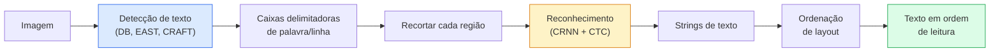

# OCR & Compreensão de Documentos

> OCR é um pipeline de três estágios — detectar caixas de texto, reconhecer os caracteres, então organizá-los. Todo sistema OCR moderno reordena esses estágios ou os funde.

**Tipo:** Aprender + Usar
**Linguagens:** Python
**Pré-requisitos:** Phase 4 Lesson 06 (Detecção), Phase 7 Lesson 02 (Self-Attention)
**Tempo:** ~45 minutos

## Objetivos de Aprendizado

- Traçar o pipeline OCR clássico (detectar -> reconhecer -> layout) e as alternativas modernas ponta a ponta (Donut, Qwen-VL-OCR)
- Implementar loss CTC (Connectionist Temporal Classification) para treinamento OCR sequência-a-sequência
- Usar PaddleOCR ou EasyOCR para análise de documentos em produção sem treinamento
- Distinguir OCR, análise de layout e compreensão de documentos — e escolher a ferramenta certa por tarefa

## O Problema

Imagens cheias de texto estão em toda parte: recibos, faturas, IDs, livros digitalizados, formulários, quadros brancos, placas, capturas de tela. Extrair dados estruturados delas — não apenas os caracteres, mas "este é o valor total" — é um dos problemas de visão aplicada de maior valor.

O campo se divide em três camadas de habilidade:

1. **OCR propriamente**: transformar pixels em texto.
2. **Análise de layout**: agrupar a saída OCR em regiões (título, corpo, tabela, cabeçalho).
3. **Compreensão de documentos**: extrair campos estruturados ("total_fatura = R$42,50") do layout.

Cada camada tem abordagens clássicas e modernas, e a lacuna entre "quero texto de uma imagem" e "preciso do valor total deste recibo" é maior do que a maioria das equipes percebe.

## O Conceito

### O pipeline clássico



- **Detecção de texto** produz quadriláteros por linha ou por palavra.
- **Reconhecimento** recorta cada região para uma altura fixa, executa uma CNN + BiLSTM + CTC para produzir uma sequência de caracteres.
- **Layout** reconstrói a ordem de leitura (cima-para-baixo, esquerda-para-direita para latim; diferente para árabe, japonês).

### CTC em um parágrafo

O reconhecimento OCR produz uma sequência de comprimento variável a partir de um mapa de características de comprimento fixo. CTC (Graves et al., 2006) permite treinar isso sem alinhamento em nível de caractere. O modelo produz uma distribuição sobre (vocabulário + blank) em cada passo de tempo; a loss CTC marginaliza sobre todos os alinhamentos que se reduzem ao texto alvo após mesclar repetições e remover blanks.

```
saída bruta: "h h h _ _ e e l l _ l l o _ _"
após mesclar repetições e remover blanks: "hello"
```

CTC é a razão pela qual CRNN funcionou em 2015 e ainda treina a maioria dos modelos OCR de produção em 2026.

### Modelos modernos ponta a ponta

- **Donut** (Kim et al., 2022) — um codificador ViT + um decodificador de texto; lê uma imagem e emite JSON diretamente. Sem detector de texto, sem módulo de layout.
- **TrOCR** — ViT + decodificador transformer para OCR em nível de linha.
- **Qwen-VL-OCR / InternVL** — modelos completos de visão-linguagem ajustados finos para tarefas OCR; melhor acurácia em 2026 em documentos complexos.
- **PaddleOCR** — pipeline clássico DB + CRNN em um pacote de produção maduro; ainda o cavalo de batalha de código aberto.

Modelos ponta a ponta precisam de mais dados e computação mas evitam a acumulação de erro de pipelines multi-estágio.

### Análise de layout

Para documentos estruturados, execute um detector de layout (LayoutLMv3, DocLayNet) que rotula cada região: Título, Parágrafo, Figura, Tabela, Nota de Rodapé. A ordem de leitura então se torna "iterar através das regiões em ordem de layout, concatenar."

Para formulários, use modelos de **extração Chave-Valor** (Donut para documentos visualmente ricos, LayoutLMv3 para scans simples). Eles recebem imagem + texto detectado + posições e preveem pares chave-valor estruturados.

### Métricas de avaliação

- **Character Error Rate (CER)** — distância Levenshtein / comprimento da referência. Menor é melhor. Alvo de produção: < 2% em scans limpos.
- **Word Error Rate (WER)** — mesmo em nível de palavra.
- **F1 em campos estruturados** — para tarefas chave-valor; mede se `{total_fatura: 42,50}` aparece corretamente.
- **Distância de edição em JSON** — para análise de documentos ponta a ponta; o paper Donut introduziu distância de edição de árvore normalizada.

## Construa

### Passo 1: Loss CTC + decodificador guloso

```python
import torch
import torch.nn as nn
import torch.nn.functional as F


def loss_ctc(log_probs, targets, input_lengths, target_lengths, blank=0):
    """
    log_probs:      (T, N, C) log-softmax sobre vocabulário incluindo blank no índice 0
    targets:        (N, S) alvos int (sem blanks)
    input_lengths:  (N,) passos de tempo por amostra usados
    target_lengths: (N,) comprimento alvo por amostra
    """
    return F.ctc_loss(log_probs, targets, input_lengths, target_lengths,
                      blank=blank, reduction="mean", zero_infinity=True)


def decodificador_ctc_guloso(log_probs, blank=0):
    """
    log_probs: (T, N, C) log-softmax
    retorna: lista de sequências de índices (blanks removidos, repetições mescladas)
    """
    preds = log_probs.argmax(dim=-1).transpose(0, 1).cpu().tolist()
    out = []
    for seq in preds:
        decodificado = []
        prev = None
        for idx in seq:
            if idx != prev and idx != blank:
                decodificado.append(idx)
            prev = idx
        out.append(decodificado)
    return out
```

`F.ctc_loss` usa a implementação CuDNN eficiente quando disponível. O decodificador guloso é mais simples que uma busca em feixe e geralmente está dentro de 1% de CER dela.

### Passo 2: Reconhecedor TinyCRNN

CNN + BiLSTM mínima para OCR de linha.

```python
class TinyCRNN(nn.Module):
    def __init__(self, vocab_size=40, hidden=128, feat=32):
        super().__init__()
        self.cnn = nn.Sequential(
            nn.Conv2d(1, feat, 3, 1, 1), nn.BatchNorm2d(feat), nn.ReLU(inplace=True),
            nn.MaxPool2d(2),
            nn.Conv2d(feat, feat * 2, 3, 1, 1), nn.BatchNorm2d(feat * 2), nn.ReLU(inplace=True),
            nn.MaxPool2d(2),
            nn.Conv2d(feat * 2, feat * 4, 3, 1, 1), nn.BatchNorm2d(feat * 4), nn.ReLU(inplace=True),
            nn.MaxPool2d((2, 1)),
            nn.Conv2d(feat * 4, feat * 4, 3, 1, 1), nn.BatchNorm2d(feat * 4), nn.ReLU(inplace=True),
            nn.MaxPool2d((2, 1)),
        )
        self.rnn = nn.LSTM(feat * 4, hidden, bidirectional=True, batch_first=True)
        self.head = nn.Linear(hidden * 2, vocab_size)

    def forward(self, x):
        # x: (N, 1, H, W)
        f = self.cnn(x)                # (N, C, H', W')
        f = f.mean(dim=2).transpose(1, 2)  # (N, W', C)
        h, _ = self.rnn(f)
        return F.log_softmax(self.head(h).transpose(0, 1), dim=-1)  # (W', N, vocab)
```

Entrada de altura fixa (a CNN faz max-pool da altura para 1). A largura é a dimensão de tempo para CTC.

### Passo 3: OCR sintético

Gere strings de dígitos preto-no-branco para um teste de fumaça ponta a ponta.

```python
import numpy as np

def linha_sintetica(text, height=32, char_width=16):
    W = char_width * len(text)
    img = np.ones((height, W), dtype=np.float32)
    for i, c in enumerate(text):
        x = i * char_width
        shade = 0.0 if c.isalnum() else 0.5
        img[6:height - 6, x + 2:x + char_width - 2] = shade
    return img


def construir_lote(strings, vocab):
    H = 32
    W = 16 * max(len(s) for s in strings)
    imgs = np.ones((len(strings), 1, H, W), dtype=np.float32)
    target_lengths = []
    targets = []
    for i, s in enumerate(strings):
        imgs[i, 0, :, :16 * len(s)] = linha_sintetica(s)
        ids = [vocab.index(c) for c in s]
        targets.extend(ids)
        target_lengths.append(len(ids))
    return torch.from_numpy(imgs), torch.tensor(targets), torch.tensor(target_lengths)


vocab = ["_"] + list("0123456789abcdefghijklmnopqrstuvwxyz")
imgs, targets, lengths = construir_lote(["hello", "world"], vocab)
print(f"imagens: {imgs.shape}   targets: {targets.shape}   lengths: {lengths.tolist()}")
```

Um dataset OCR real adiciona fontes, ruído, rotação, desfoque e cor. O pipeline acima é idêntico.

### Passo 4: Esboço de treinamento

```python
model = TinyCRNN(vocab_size=len(vocab))
opt = torch.optim.Adam(model.parameters(), lr=1e-3)

for step in range(200):
    strings = ["abc" + str(step % 10)] * 4 + ["xyz" + str((step + 1) % 10)] * 4
    imgs, targets, target_lens = construir_lote(strings, vocab)
    log_probs = model(imgs)  # (W', 8, vocab)
    input_lens = torch.full((8,), log_probs.size(0), dtype=torch.long)
    loss = loss_ctc(log_probs, targets, input_lens, target_lens, blank=0)
    opt.zero_grad(); loss.backward(); opt.step()
```

A loss deve cair de ~3 para ~0.2 ao longo de 200 passos nestes dados sintéticos triviais.

## Use

Três caminhos de produção:

- **PaddleOCR** — maduro, rápido, multilíngue. Uso de uma linha: `paddleocr.PaddleOCR(lang="en").ocr(caminho_imagem)`.
- **EasyOCR** — nativo Python, multilíngue, backbone PyTorch.
- **Tesseract** — clássico; ainda útil para documentos antigos digitalizados quando modelos têm dificuldade.

Para análise de documentos ponta a ponta, use Donut ou um VLM:

```python
from transformers import DonutProcessor, VisionEncoderDecoderModel

processor = DonutProcessor.from_pretrained("naver-clova-ix/donut-base-finetuned-cord-v2")
model = VisionEncoderDecoderModel.from_pretrained("naver-clova-ix/donut-base-finetuned-cord-v2")
```

Para recibos, faturas e formulários com estrutura repetível, ajuste fino Donut. Para documentos arbitrários ou OCR com raciocínio, um VLM como Qwen-VL-OCR é o padrão atual.

## Entregue

Esta lição produz:

- `outputs/prompt-ocr-stack-picker.md` — um prompt que escolhe Tesseract / PaddleOCR / Donut / VLM-OCR dado tipo de documento, idioma e estrutura.
- `outputs/skill-ctc-decoder.md` — uma skill que escreve decodificadores CTC gulosos e busca em feixe do zero, incluindo normalização de comprimento.

## Exercícios

1. **(Fácil)** Treine o TinyCRNN em strings numéricas aleatórias de 5 dígitos por 500 passos. Reporte CER em um conjunto de validação.
2. **(Médio)** Substitua a decodificação gulosa por busca em feixe (beam_width=5). Reporte delta de CER. Em quais entradas a busca em feixe vence?
3. **(Difícil)** Use PaddleOCR em um conjunto de 20 recibos, extraia itens de linha e compute F1 contra verdade anotada manualmente para pares {nome_item, preco}.

## Termos-Chave

| Termo | O que as pessoas dizem | O que realmente significa |
|-------|------------------------|---------------------------|
| OCR | "Texto de pixels" | Transformar regiões de imagem em sequências de caracteres |
| CTC | "Loss livre de alinhamento" | Loss que treina um modelo sequencial sem rótulos por timestep; marginaliza sobre alinhamentos |
| CRNN | "Modelo OCR clássico" | Extrator de características conv + BiLSTM + CTC; o baseline de 2015 ainda usado em produção |
| Donut | "OCR ponta a ponta" | Codificador ViT + decodificador de texto; emite JSON diretamente da imagem |
| Análise de layout | "Encontrar regiões" | Detectar e rotular regiões de Título/Tabela/Figura/Parágrafo em um documento |
| Ordem de leitura | "Sequência de texto" | Ordenação de regiões reconhecidas em uma frase; trivial para latim, não trivial para layouts mistos |
| CER / WER | "Taxas de erro" | Distância Levenshtein / comprimento da referência em granularidade de caractere ou palavra |
| VLM-OCR | "LLM que lê" | Um modelo visão-linguagem treinado ou estimulado para tarefas OCR; SOTA atual em documentos complexos |

## Leitura Complementar

- [CRNN (Shi et al., 2015)](https://arxiv.org/abs/1507.05717) — a arquitetura CNN+RNN+CTC original
- [CTC (Graves et al., 2006)](https://www.cs.toronto.edu/~graves/icml_2006.pdf) — o paper original do CTC; densamente preenchido com as ideias algorítmicas
- [Donut (Kim et al., 2022)](https://arxiv.org/abs/2111.15664) — transformer de compreensão de documentos sem OCR
- [PaddleOCR](https://github.com/PaddlePaddle/PaddleOCR) — o stack OCR de produção de código aberto
