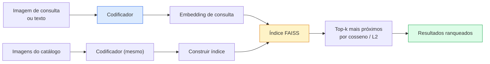

# Recuperação de Imagens & Aprendizado de Métricas

> Um sistema de recuperação ranqueia candidatos por uma distância no espaço de embedding. Aprendizado de métricas é a disciplina de moldar esse espaço para que as distâncias signifiquem o que você quer.

**Tipo:** Construção
**Linguagens:** Python
**Pré-requisitos:** Phase 4 Lesson 14 (ViT), Phase 4 Lesson 18 (CLIP)
**Tempo:** ~45 minutos

## Objetivos de Aprendizado

- Explicar losses de aprendizado de métricas baseadas em tripleto, contrastivas e baseadas em proxy e escolher a certa para um dado dataset
- Implementar normalização L2 e similaridade cosseno corretamente e auditar a diferença entre recuperação de "mesmo item" e "mesma classe"
- Construir um índice FAISS, consultá-lo por texto e por imagem, e reportar recall@K para um conjunto de consultas de validação
- Usar DINOv2, CLIP e SigLIP como backbones de embedding prontos para uso e saber quando cada um vence

## O Problema

Recuperação está em toda parte na visão de produção: detecção de duplicatas, busca reversa de imagens, busca visual ("encontrar produtos similares"), re-identificação facial, re-ID de pessoas para vigilância, correspondência em nível de instância para e-commerce. A pergunta do produto é sempre a mesma: "dada esta imagem de consulta, ranqueie meu catálogo."

Duas decisões de design moldam todo o sistema. O embedding — qual modelo produz os vetores. O índice — como encontrar vizinhos mais próximos em escala. Ambos são commodity em 2026 (DINOv2 para o embedding, FAISS para o índice), o que eleva a barra: a parte difícil é definir *o que conta como similar* para sua aplicação, então moldar o espaço de embedding para que as distâncias correspondam.

Essa moldagem é o aprendizado de métricas. É uma disciplina pequena mas de alta alavancagem.

## O Conceito

### Recuperação de relance



### As quatro famílias de loss

| Loss | Requer | Prós | Contras |
|------|--------|------|---------|
| **Contrastiva** | (âncora, positivo) + negativos | Simples, funciona com qualquer rótulo de par | Lenta para convergir sem muitos negativos |
| **Tripleto** | (âncora, positivo, negativo) | Intuitiva; controle direto de margem | Mineração de tripletos difíceis é cara |
| **NT-Xent / InfoNCE** | Pares + negativos minerados no lote | Escala para grandes lotes | Precisa de lote grande ou fila de momentum |
| **Baseada em proxy (ProxyNCA)** | Apenas rótulos de classe | Rápida, estável, sem mineração | Pode sobreajustar a proxies em datasets pequenos |

Para a maioria dos casos de uso de produção, comece com um backbone pré-treinado e só adicione um fine-tuning de aprendizado de métricas se os embeddings prontos para uso tiverem desempenho inferior no seu conjunto de teste.

### Loss tripleto formalmente

```
L = max(0, ||f(a) - f(p)||^2 - ||f(a) - f(n)||^2 + margin)
```

Puxe a âncora `a` para perto do positivo `p`, empurre-a para longe do negativo `n`, com uma `margin` que garante uma lacuna. A estrutura de três imagens generaliza para qualquer ordenação de similaridade.

A mineração importa: tripletos fáceis (`n` já longe de `a`) contribuem zero loss; apenas tripletos difíceis ensinam a rede. Mineração semi-difícil (`n` mais longe que `p` mas dentro da margem) é a receita do FaceNet 2016 e ainda domina.

### Similaridade cosseno vs L2

Duas métricas, duas convenções:

- **Cosseno**: ângulo entre vetores. Requer embeddings normalizados L2.
- **L2**: distância Euclidiana. Funciona em embeddings crus ou normalizados, mas geralmente é emparelhada com L2 normalizado + L2 ao quadrado.

Para a maioria das redes modernas, as duas são equivalentes: `||a - b||^2 = 2 - 2 cos(a, b)` quando `||a|| = ||b|| = 1`. Escolha a convenção que corresponda ao seu treinamento de embedding; misturá-las muda silenciosamente o que "mais próximo" significa.

### Recall@K

A métrica de recuperação padrão:

```
recall@K = fração de consultas onde pelo menos uma correspondência correta está nos primeiros K resultados
```

Reporte recall@1, @5, @10 lado a lado. Um recall@10 acima de 0.95 com recall@1 abaixo de 0.5 significa que o espaço de embedding tem a estrutura certa mas o ranqueamento é ruidoso — tente fine-tunes mais longos ou um passo de re-ranqueamento.

Para detecção de duplicatas, precision@K importa mais porque cada falso positivo é um erro visível ao usuário. Para busca visual, recall@K é o sinal do produto.

### FAISS em um parágrafo

Facebook AI Similarity Search. A biblioteca de facto para busca de vizinho mais próximo. Três escolhas de índice:

- `IndexFlatIP` / `IndexFlatL2` — força bruta, exato, sem treinamento. Use até ~1M vetores.
- `IndexIVFFlat` — particione em K células, busque apenas as poucas células mais próximas. Aproximado, rápido, precisa de dados de treino.
- `IndexHNSW` — baseado em grafo, mais rápido para muitas consultas, tamanho de índice grande.

Para 100k vetores, você provavelmente quer `IndexFlatIP` em similaridade cosseno. Para 10M, quer `IndexIVFFlat`. Para 100M+ combinado com quantização de produto (`IndexIVFPQ`).

### Recuperação em nível de instância vs categoria

Dois problemas muito diferentes com o mesmo nome:

- **Nível de categoria** — "encontre gatos no meu catálogo." Similaridade condicional à classe; embeddings CLIP / DINOv2 prontos para uso funcionam bem.
- **Nível de instância** — "encontre *este produto exato* no meu catálogo." Precisa de discriminação fina entre objetos visualmente similares da mesma classe; embeddings prontos para uso têm desempenho inferior; fine-tuning com aprendizado de métricas importa.

Sempre pergunte qual você está resolvendo antes de escolher um modelo.

## Construa

### Passo 1: Loss tripleto

```python
import torch
import torch.nn.functional as F

def loss_tripleto(anchor, positive, negative, margin=0.2):
    d_ap = F.pairwise_distance(anchor, positive, p=2)
    d_an = F.pairwise_distance(anchor, negative, p=2)
    return F.relu(d_ap - d_an + margin).mean()
```

Uma linha. Funciona em embeddings normalizados L2 ou crus.

### Passo 2: Mineração semi-difícil

Dado um lote de embeddings e rótulos, encontre o negativo semi-difícil mais difícil para cada âncora.

```python
def negativos_semi_dificeis(emb, labels, margin=0.2):
    dist = torch.cdist(emb, emb)
    mesma_classe = labels[:, None] == labels[None, :]
    classe_diferente = ~mesma_classe
    N = emb.size(0)

    positivos = dist.clone()
    positivos[~mesma_classe] = float("-inf")
    positivos.fill_diagonal_(float("-inf"))
    idx_pos = positivos.argmax(dim=1)

    semi_dificeis = dist.clone()
    semi_dificeis[mesma_classe] = float("inf")
    d_ap = dist[torch.arange(N), idx_pos].unsqueeze(1)
    semi_dificeis[dist <= d_ap] = float("inf")
    idx_neg = semi_dificeis.argmin(dim=1)

    fallback_mask = semi_dificeis[torch.arange(N), idx_neg] == float("inf")
    if fallback_mask.any():
        mais_dificeis = dist.clone()
        mais_dificeis[mesma_classe] = float("inf")
        idx_neg = torch.where(fallback_mask, mais_dificeis.argmin(dim=1), idx_neg)
    return idx_pos, idx_neg
```

Cada âncora recebe o positivo mais difícil dentro da classe e um negativo semi-difícil que está mais longe que o positivo mas dentro da margem.

### Passo 3: Recall@K

```python
def recall_at_k(query_emb, gallery_emb, query_labels, gallery_labels, k=1):
    sim = query_emb @ gallery_emb.T
    _, top_k = sim.topk(k, dim=-1)
    matches = (gallery_labels[top_k] == query_labels[:, None]).any(dim=-1)
    return matches.float().mean().item()
```

Top-k por produto interno em embeddings normalizados L2 equivale a top-k por cosseno. Reporte a proporção média de consultas com pelo menos um vizinho correto.

### Passo 4: Juntar tudo

```python
import torch
import torch.nn as nn
from torch.optim import Adam

class Codificador(nn.Module):
    def __init__(self, in_dim=128, emb_dim=64):
        super().__init__()
        self.net = nn.Sequential(
            nn.Linear(in_dim, 128), nn.ReLU(),
            nn.Linear(128, emb_dim),
        )

    def forward(self, x):
        return F.normalize(self.net(x), dim=-1)

torch.manual_seed(0)
num_classes = 6
protos = F.normalize(torch.randn(num_classes, 128), dim=-1)

def amostrar_lote(bs=32):
    labels = torch.randint(0, num_classes, (bs,))
    x = protos[labels] + 0.15 * torch.randn(bs, 128)
    return x, labels

enc = Codificador()
opt = Adam(enc.parameters(), lr=3e-3)

for step in range(200):
    x, y = amostrar_lote(32)
    emb = enc(x)
    idx_pos, idx_neg = negativos_semi_dificeis(emb, y)
    loss = loss_tripleto(emb, emb[idx_pos], emb[idx_neg])
    opt.zero_grad(); loss.backward(); opt.step()
```

Após algumas centenas de passos, os clusters de embedding formam um cluster por classe.

## Use

Stacks de produção em 2026:

- **DINOv2 + FAISS** — recuperação visual de propósito geral. Funciona pronto para uso.
- **CLIP + FAISS** — quando as consultas são texto.
- **DINOv2 fine-tuned + FAISS** — recuperação em nível de instância, re-ID facial, moda, e-commerce.
- **Milvus / Weaviate / Qdrant** — wrappers de vetores gerenciados em torno de FAISS ou HNSW.

Para SOTA em recuperação de instância, a receita é: backbone DINOv2, adicione uma cabeça de embedding, fine-tune com uma loss tripleto ou InfoNCE em pares rotulados por instância, indexe em FAISS.

## Entregue

Esta lição produz:

- `outputs/prompt-retrieval-loss-picker.md` — um prompt que escolhe tripleto / InfoNCE / ProxyNCA para um dado problema de recuperação.
- `outputs/skill-recall-at-k-runner.md` — uma skill que escreve uma estrutura de avaliação limpa para recall@K com divisões treino/val/galeria e contrato de dados adequado.

## Exercícios

1. **(Fácil)** Execute o exemplo de brinquedo acima. Plote os embeddings com PCA antes e depois do treino para ver os seis clusters se formarem.
2. **(Médio)** Adicione uma implementação de loss ProxyNCA: um "proxy" aprendido por classe, cross-entropy padrão em similaridade cosseno. Compare velocidade de convergência vs loss tripleto nos dados de brinquedo.
3. **(Difícil)** Pegue 1.000 imagens de validação da ImageNet, incorpore com DINOv2 via HuggingFace, construa um índice FAISS flat, e reporte recall@{1, 5, 10} contra as mesmas imagens como consultas (deve ser 1.0) e contra uma divisão de validação com rótulos ImageNet como verdade.

## Termos-Chave

| Termo | O que as pessoas dizem | O que realmente significa |
|-------|------------------------|---------------------------|
| Aprendizado de métricas | "Moldar o espaço" | Treinar um codificador para que distâncias em seu espaço de saída reflitam uma similaridade alvo |
| Loss tripleto | "Puxar e empurrar" | L = max(0, d(a, p) - d(a, n) + margin); a loss canônica de aprendizado de métricas |
| Mineração semi-difícil | "Negativos úteis" | Negativos mais longe da âncora que o positivo mas dentro da margem; empiricamente os mais informativos |
| Loss baseada em proxy | "Protótipos de classe" | Um proxy aprendido por classe; cross-entropy sobre similaridade com proxies; sem mineração de pares |
| Recall@K | "Taxa de acerto no top-K" | Fração de consultas com pelo menos um resultado correto no top K |
| Recuperação de instância | "Encontrar esta coisa exata" | Correspondência de granularidade fina; características prontas para uso geralmente têm desempenho inferior |
| FAISS | "A biblioteca NN" | Biblioteca de vizinho mais próximo do Facebook; suporta índices exatos e aproximados |
| HNSW | "Índice de grafo" | Hierarchical navigable small world; NN aproximado rápido com pequena sobrecarga de memória |

## Leitura Complementar

- [FaceNet: A Unified Embedding for Face Recognition (Schroff et al., 2015)](https://arxiv.org/abs/1503.03832) — o paper de loss tripleto / mineração semi-difícil
- [In Defense of the Triplet Loss for Person Re-Identification (Hermans et al., 2017)](https://arxiv.org/abs/1703.07737) — guia prático para fine-tuning com tripleto
- [FAISS documentation](https://github.com/facebookresearch/faiss/wiki) — todo índice, todo trade-off
- [SMoT: Metric Learning Taxonomy (Kim et al., 2021)](https://arxiv.org/abs/2010.06927) — pesquisa de losses modernas e suas conexões
