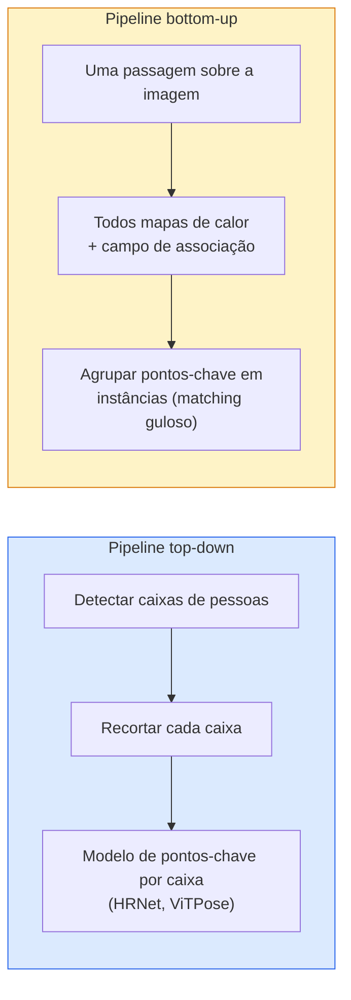

# Detecção de Pontos-Chave e Estimação de Pose

> Uma pose é um conjunto ordenado de pontos-chave. Um detector de pontos-chave é um regressor de mapas de calor. Todo o resto é contabilidade.

**Tipo:** Construção
**Linguagens:** Python
**Pré-requisitos:** Phase 4 Lesson 06 (Detecção), Phase 4 Lesson 07 (U-Net)
**Tempo:** ~45 minutos

## Objetivos de Aprendizado

- Distinguir estimação de pose top-down e bottom-up e declarar quando cada uma é usada
- Regredir mapas de calor para K pontos-chave com um alvo Gaussiano por ponto-chave e extrair coordenadas de pontos-chave na inferência
- Explicar Part Affinity Fields (PAFs) e como pipelines bottom-up associam pontos-chave em instâncias
- Usar MediaPipe Pose ou MMPose para estimação de pontos-chave de produção e entender seu formato de saída

## O Problema

Tarefas de pontos-chave se escondem sob muitos nomes: pose humana (17 articulações do corpo), landmarks faciais (68 ou 478 pontos), mão (21 pontos), pose animal, pose de objeto robótico, landmarks de anatomia médica. Cada uma delas compartilha a mesma estrutura: detectar K pontos discretos em um objeto e gerar suas coordenadas (x, y).

A estimação de pose é a base da captura de movimento, aplicativos de fitness, análise esportiva, controle de gestos, animação, AR try-on e agarramento robótico. O caso 2D está maduro; a pose 3D (estimar posições de articulações em coordenadas mundiais a partir de uma única câmera) é a fronteira atual de pesquisa.

A questão de engenharia é escala. Uma pose de uma única imagem e pessoa é um problema de 20ms. Pose de múltiplas pessoas em uma multidão a 30 fps é um problema diferente com arquiteturas diferentes.

## O Conceito

### Top-down vs bottom-up



- **Top-down** — detecte pessoas primeiro, depois execute um modelo de pontos-chave por pessoa em cada recorte. Maior acurácia; escala linearmente com o número de pessoas.
- **Bottom-up** — uma passagem forward prevê todos os pontos-chave mais um campo de associação; agrupe-os. Tempo constante independentemente do tamanho da multidão.

Top-down (HRNet, ViTPose) é o líder em acurácia; bottom-up (OpenPose, HigherHRNet) é o líder em throughput para cenas lotadas.

### Regressão de mapa de calor

Em vez de regredir `(x, y)` diretamente, prediga um mapa de calor `H x W` por ponto-chave com uma mancha Gaussiana centrada na localização verdadeira.

```
alvo[k, y, x] = exp(-((x - cx_k)^2 + (y - cy_k)^2) / (2 sigma^2))
```

Na inferência, o argmax de cada mapa de calor é a localização prevista do ponto-chave.

Por que mapas de calor funcionam melhor que regressão direta: a estrutura espacial da rede (mapa de características conv) se alinha naturalmente com a saída espacial. Alvos Gaussianos também regularizam — um pequeno erro de localização produz uma pequena perda, não zero.

### Localização sub-pixel

Argmax dá coordenadas inteiras. Para precisão sub-pixel, refine ajustando uma parábola ao argmax e seus vizinhos, ou use a conhecida direção de deslocamento `(dx, dy) = 0.25 * (heatmap[y, x+1] - heatmap[y, x-1], ...)`.

### Part Affinity Fields (PAFs)

O truque do OpenPose para associação bottom-up. Para cada par de pontos-chave conectados (e.g. ombro esquerdo a cotovelo esquerdo), prediga um campo de 2 canais que codifica o vetor unitário apontando de um para o outro. Para associar um ombro com seu cotovelo, integre o PAF ao longo da linha conectando pares candidatos; o par com a integral mais alta é combinado.

```
Para cada conexão (membro):
  Canais PAF: 2 (vetor unitário x, y)
  Integral de linha: soma sobre pontos amostrados de (PAF . direção_da_linha)
  Integral mais alta = correspondência mais forte
```

Elegante e escala para tamanhos de multidão arbitrários sem recortes por pessoa.

### Pontos-chave COCO

O dataset padrão de pose corporal: 17 pontos-chave por pessoa, PCK (Percentage of Correct Keypoints) e OKS (Object Keypoint Similarity) como métricas. OKS é o análogo de pontos-chave do IoU e é o que o COCO mAP@OKS reporta.

### 2D vs 3D

- **Pose 2D** — coordenadas de imagem; resolvida em qualidade de produção (MediaPipe, HRNet, ViTPose).
- **Pose 3D** — coordenadas mundiais / de câmera; ainda pesquisa ativa. Abordagens comuns:
  - Elevar predições 2D para 3D com um pequeno MLP (VideoPose3D).
  - Regressão 3D direta a partir da imagem (PyMAF, MHFormer).
  - Configurações multi-visão (CMU Panoptic) para verdade.

## Construa

### Passo 1: Alvo de mapa de calor Gaussiano

```python
import numpy as np
import torch

def mapa_calor_gaussiano(size, cx, cy, sigma=2.0):
    yy, xx = np.meshgrid(np.arange(size), np.arange(size), indexing="ij")
    return np.exp(-((xx - cx) ** 2 + (yy - cy) ** 2) / (2 * sigma ** 2)).astype(np.float32)

hm = mapa_calor_gaussiano(64, 32, 32, sigma=2.0)
print(f"pico: {hm.max():.3f} em ({hm.argmax() % 64}, {hm.argmax() // 64})")
```

Mapas de calor por ponto-chave empilhados ao longo de um eixo de canal dão o tensor alvo completo.

### Passo 2: Cabeça de pontos-chave minúscula

Um modelo estilo U-Net que produz K canais de mapa de calor.

```python
import torch.nn as nn
import torch.nn.functional as F

class TinyKeypointNet(nn.Module):
    def __init__(self, num_keypoints=4, base=16):
        super().__init__()
        self.down1 = nn.Sequential(nn.Conv2d(3, base, 3, 2, 1), nn.ReLU(inplace=True))
        self.down2 = nn.Sequential(nn.Conv2d(base, base * 2, 3, 2, 1), nn.ReLU(inplace=True))
        self.mid = nn.Sequential(nn.Conv2d(base * 2, base * 2, 3, 1, 1), nn.ReLU(inplace=True))
        self.up1 = nn.ConvTranspose2d(base * 2, base, 2, 2)
        self.up2 = nn.ConvTranspose2d(base, num_keypoints, 2, 2)

    def forward(self, x):
        h1 = self.down1(x)
        h2 = self.down2(h1)
        h3 = self.mid(h2)
        u1 = self.up1(h3)
        return self.up2(u1)
```

Entrada `(N, 3, H, W)`, saída `(N, K, H, W)`. A loss é MSE por pixel contra alvos Gaussianos.

### Passo 3: Inferência — extrair coordenadas de pontos-chave

```python
def mapa_calor_para_coords(heatmaps):
    """
    heatmaps: (N, K, H, W)
    retorna:  (N, K, 2) coordenadas float em pixels da imagem
    """
    N, K, H, W = heatmaps.shape
    hm = heatmaps.reshape(N, K, -1)
    idx = hm.argmax(dim=-1)
    ys = (idx // W).float()
    xs = (idx % W).float()
    return torch.stack([xs, ys], dim=-1)

coords = mapa_calor_para_coords(torch.randn(2, 4, 32, 32))
print(f"coords: {coords.shape}")  # (2, 4, 2)
```

Uma linha na inferência. Para refinamento sub-pixel, interpole ao redor do argmax.

### Passo 4: Dataset sintético de pontos-chave

Simples: desenhe quatro pontos em uma tela branca e aprenda a prevê-los.

```python
def fazer_amostra_sintetica(size=64):
    img = np.ones((3, size, size), dtype=np.float32)
    rng = np.random.default_rng()
    kps = rng.integers(8, size - 8, size=(4, 2))
    for cx, cy in kps:
        img[:, cy - 2:cy + 2, cx - 2:cx + 2] = 0.0
    hms = np.stack([mapa_calor_gaussiano(size, cx, cy) for cx, cy in kps])
    return img, hms, kps
```

Fácil o suficiente para um modelo minúsculo aprender em um minuto.

### Passo 5: Treinamento

```python
model = TinyKeypointNet(num_keypoints=4)
opt = torch.optim.Adam(model.parameters(), lr=3e-3)

for step in range(200):
    batch = [fazer_amostra_sintetica() for _ in range(16)]
    imgs = torch.from_numpy(np.stack([b[0] for b in batch]))
    hms = torch.from_numpy(np.stack([b[1] for b in batch]))
    pred = model(imgs)
    # Superamostrar pred para resolução total
    pred = F.interpolate(pred, size=hms.shape[-2:], mode="bilinear", align_corners=False)
    loss = F.mse_loss(pred, hms)
    opt.zero_grad(); loss.backward(); opt.step()
```

## Use

- **MediaPipe Pose** — estimador de pose de produção do Google; oferece runtimes WebGL + mobile com latência abaixo de 10ms.
- **MMPose** (OpenMMLab) — base de código de pesquisa abrangente; toda arquitetura SOTA com pesos pré-treinados.
- **YOLOv8-pose** — pose multi-pessoa em tempo real mais rápida com uma única passagem forward.
- **transformers HumanDPT / PoseAnything** — abordagens mais novas de visão-linguagem para pose de vocabulário aberto (qualquer objeto, qualquer conjunto de pontos-chave).

## Entregue

Esta lição produz:

- `outputs/prompt-pose-stack-picker.md` — um prompt que escolhe MediaPipe / YOLOv8-pose / HRNet / ViTPose dada latência, tamanho da multidão e necessidade 2D vs 3D.
- `outputs/skill-heatmap-to-coords.md` — uma skill que escreve a rotina sub-pixel de mapa-de-calor-para-coordenadas usada por todo modelo de pose de produção.

## Exercícios

1. **(Fácil)** Treine o modelo minúsculo de pontos-chave no dataset sintético de 4 pontos. Reporte erro L2 médio entre pontos-chave previstos e verdadeiros após 200 passos.
2. **(Médio)** Adicione refinamento sub-pixel: dada a posição do argmax, ajuste uma parábola 1D ao longo de x e y a partir dos pixels vizinhos. Reporte o ganho de acurácia vs argmax inteiro.
3. **(Difícil)** Construa um dataset sintético de 2 pessoas onde cada imagem mostra duas instâncias do padrão de 4 pontos-chave. Treine um pipeline bottom-up com PAFs que prevê qual ponto-chave pertence a qual instância, e avalie OKS.

## Termos-Chave

| Termo | O que as pessoas dizem | O que realmente significa |
|-------|------------------------|---------------------------|
| Ponto-chave | "Um landmark" | Um ponto ordenado específico em um objeto (articulação, canto, característica) |
| Pose | "O esqueleto" | Um conjunto ordenado de pontos-chave pertencentes a uma instância |
| Top-down | "Detectar então posar" | Pipeline de dois estágios: detector de pessoa + modelo de pontos-chave por recorte; maior acurácia |
| Bottom-up | "Pose primeiro, agrupar depois" | Predição de todos os pontos-chave em uma passagem + agrupamento; tempo constante no tamanho da multidão |
| Mapa de calor | "Alvo Gaussiano" | Tensor H x W por ponto-chave com pico na localização verdadeira; o alvo de regressão preferido |
| PAF | "Part Affinity Field" | Campo de vetor unitário de 2 canais codificando direções de membros; usado para agrupar pontos-chave em instâncias |
| OKS | "IoU de pontos-chave" | Object Keypoint Similarity; a métrica COCO para pose |
| HRNet | "High-Resolution Net" | A arquitetura top-down dominante de pontos-chave; preserva características de alta resolução em toda parte |

## Leitura Complementar

- [OpenPose (Cao et al., 2017)](https://arxiv.org/abs/1812.08008) — bottom-up com PAFs; ainda a melhor descrição da abordagem
- [HRNet (Sun et al., 2019)](https://arxiv.org/abs/1902.09212) — a arquitetura top-down de referência
- [ViTPose (Xu et al., 2022)](https://arxiv.org/abs/2204.12484) — ViT simples como backbone de pose; SOTA atual em muitos benchmarks
- [MediaPipe Pose](https://developers.google.com/mediapipe/solutions/vision/pose_landmarker) — pose de produção em tempo real; o stack implantado mais rápido em 2026
