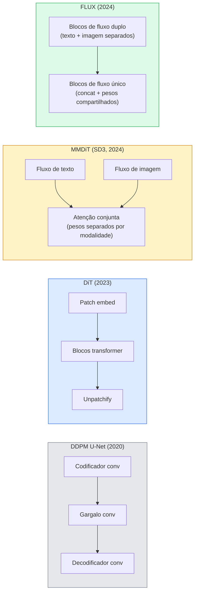

# Diffusion Transformers & Rectified Flow

> O U-Net não é o segredo da difusão. Substitua-o por um transformer, troque o agendamento de ruído por um fluxo de linha reta, e de repente você tem SD3, FLUX e todo modelo texto-para-imagem de 2026.

**Tipo:** Aprender + Construir
**Linguagens:** Python
**Pré-requisitos:** Phase 4 Lesson 10 (Difusão DDPM), Phase 4 Lesson 14 (ViT), Phase 7 Lesson 02 (Self-Attention)
**Tempo:** ~75 minutos

## Objetivos de Aprendizado

- Traçar a evolução de U-Net DDPM (Lição 10) para Diffusion Transformer (DiT), MMDiT (SD3) e DiT de fluxo único+duplo (FLUX)
- Explicar rectified flow: por que uma trajetória de linha reta entre ruído e dados permite que modelos amostrem em 20 passos em vez de 1000
- Implementar um bloco DiT minúsculo e um loop de treinamento de rectified flow, ambos em menos de 100 linhas
- Distinguir variantes de modelo (SD3, FLUX.1-dev, FLUX.1-schnell, Z-Image, Qwen-Image) por arquitetura, contagem de parâmetros e licenciamento

## O Problema

A Lição 10 construiu um DDPM com um denoiser U-Net. Essa receita dominou 2020-2023: U-Net + agendamento beta + loss de predição de ruído. Produziu Stable Diffusion 1.5 e 2.1 e DALL-E 2.

Todo modelo texto-para-imagem de estado da arte de 2026 avançou além disso. Stable Diffusion 3, FLUX, SD4, Z-Image, Qwen-Image, Hunyuan-Image — nenhum usa U-Net. Eles usam Diffusion Transformers (DiT). SD3 e FLUX também trocam o agendamento de ruído DDPM por rectified flow, que endireita o caminho do ruído para os dados e permite inferência de 1-4 passos com consistência ou variantes destiladas.

A mudança importa porque é a razão pela qual a geração de imagens baseada em difusão se tornou controlável, precisa em prompts (SD3/SD4 resolveram renderização de texto) e rápida em produção. Entender DiT + rectified flow é entender o stack de imagem generativa de 2026.

## O Conceito

### De U-Net para transformer



- **DiT** (Peebles & Xie, 2023) — substitua o U-Net por um transformer estilo ViT em patches latentes. Condicionamento via adaptive layer norm (AdaLN).
- **MMDiT** (SD3, Esser et al., 2024) — dois fluxos com pesos separados para tokens de texto e imagem que compartilham uma atenção conjunta.
- **FLUX** (Black Forest Labs, 2024) — primeiros N blocos de fluxo duplo como SD3, blocos posteriores concatenam e compartilham pesos (fluxo único) para eficiência em maior profundidade.
- **Z-Image** (2025) — um DiT de fluxo único eficiente com 6B parâmetros que desafia "escala a todo custo".

### Rectified flow em um parágrafo

DDPM define o processo forward como uma SDE ruidosa onde `x_t` é cada vez mais corrompido. O reverso aprendido é uma segunda SDE, resolvida por 1000 pequenos passos.

Rectified flow define uma interpolação **em linha reta** entre dados limpos e ruído puro:

```
x_t = (1 - t) * x_0 + t * epsilon,     t in [0, 1]
```

Treine uma rede para prever a velocidade `v_theta(x_t, t) = epsilon - x_0` — a direção forward ao longo do caminho de linha reta dos dados limpos para o ruído (`dx_t/dt`). Durante a amostragem, você integra esta velocidade para trás para passar do ruído em direção aos dados. A EDO resultante é muito mais próxima de uma linha reta, então muito menos passos de integração são necessários para amostrar.

SD3 chama isso de **Rectified Flow Matching**. FLUX, Z-Image e a maioria dos modelos de 2026 usam o mesmo objetivo. Inferência típica: 20-30 passos Euler (determinísticos) vs 50+ passos DDIM no regime DDPM antigo. Variantes destiladas / turbo / schnell / LCM reduzem para 1-4 passos.

### Condicionamento AdaLN

DiTs condicionam em timestep e classe/texto via **adaptive layer norm**: predizem `scale` e `shift` a partir do vetor de condicionamento e os aplicam após LayerNorm. Muito mais limpo que modulação estilo FiLM em U-Nets e o padrão em todo DiT moderno.

```
cond -> MLP -> (scale, shift, gate)
norm(x) * (1 + scale) + shift, então residual add * gate
```

### Codificadores de texto no SD3 e FLUX

- **SD3** usa três codificadores de texto: dois modelos CLIP + T5-XXL. Embeddings concatenados e alimentados ao fluxo de imagem como condicionamento de texto.
- **FLUX** usa um CLIP-L + T5-XXL.
- **Qwen-Image / Z-Image** variantes usam seus próprios codificadores de texto internos alinhados com seus LLMs base.

O codificador de texto é uma grande parte de por que SD3/FLUX raciocinam sobre prompts tão melhor que SD1.5. T5-XXL sozinho tem 4.7B params.

### Orientação livre de classificador ainda vale

Rectified flow muda o amostrador, não o condicionamento. A orientação livre de classificador (descartar texto com 10% de probabilidade durante o treino, misturar predições condicionais e incondicionais na inferência) funciona identicamente com rectified flow. A maioria dos modelos de 2026 usa escala de orientação 3.5-5 — menor que os 7.5 do SD1.5 porque modelos de rectified flow seguem prompts mais estritamente por padrão.

### Consistency, Turbo, Schnell, LCM

Quatro nomes para a mesma ideia: destilar um modelo lento de muitos passos em um modelo rápido de poucos passos.

- **LCM (Latent Consistency Model)** — treina um estudante que prevê o `x_0` final a partir de qualquer `x_t` intermediário em um passo.
- **SDXL Turbo / FLUX schnell** — modelos de 1-4 passos treinados com destilação adversarial de difusão.
- **SD Turbo** — Consistency Models estilo OpenAI adaptados para difusão latente.

A implantação em produção de qualquer novo modelo oferece tanto um checkpoint de "qualidade total" quanto uma variante "turbo / schnell". Schnell ("rápido" em alemão, convenção da Black Forest Labs) roda em 1-4 passos e cabe em pipelines de tempo real.

### Panorama de modelos em 2026

| Modelo | Tamanho | Arquitetura | Licença |
|--------|---------|-------------|---------|
| Stable Diffusion 3 Medium | 2B | MMDiT | SAI Community |
| Stable Diffusion 3.5 Large | 8B | MMDiT | SAI Community |
| FLUX.1-dev | 12B | DiT Fluxo Duplo + Único | não-comercial |
| FLUX.1-schnell | 12B | mesmo, destilado | Apache 2.0 |
| FLUX.2 | — | FLUX.1 iterado | mista |
| Z-Image | 6B | S3-DiT (Scalable Single-Stream) | permissiva |
| Qwen-Image | ~20B | DiT + torre de texto Qwen | Apache 2.0 |
| Hunyuan-Image-3.0 | ~80B | DiT | pesquisa |
| SD4 Turbo | 3B | DiT + destilação | SAI Commercial |

FLUX.1-schnell é o padrão de código aberto de 2026. Z-Image é o líder em eficiência. FLUX.2 e SD4 são as pontas de qualidade atuais.

### Por que essa mudança de fase importa

DDPM + U-Net funcionava. DiT + rectified flow funciona **melhor, mais rápido e escala mais limpiamente**. A transição é paralela à de RNNs para transformers em PNL: ambas as arquiteturas resolviam o mesmo problema, mas transformers escalaram e agora dominam. Todo paper de 2026 sobre geração de imagem, vídeo ou 3D usa um denoiser em forma de DiT e geralmente um objetivo de rectified flow. U-Net DDPM agora é principalmente pedagógico (Lição 10).

## Construa

### Passo 1: Um bloco DiT com AdaLN

```python
import torch
import torch.nn as nn


class AdaLNZero(nn.Module):
    """
    Adaptive LayerNorm com um gate. Prediz (scale, shift, gate) a partir do condicionamento.
    Inicializado para que o bloco inteiro comece como identidade ("zero init").
    """

    def __init__(self, dim, cond_dim):
        super().__init__()
        self.norm = nn.LayerNorm(dim, elementwise_affine=False)
        self.mlp = nn.Linear(cond_dim, dim * 3)
        nn.init.zeros_(self.mlp.weight)
        nn.init.zeros_(self.mlp.bias)

    def forward(self, x, cond):
        scale, shift, gate = self.mlp(cond).chunk(3, dim=-1)
        h = self.norm(x) * (1 + scale.unsqueeze(1)) + shift.unsqueeze(1)
        return h, gate.unsqueeze(1)


class DiTBlock(nn.Module):
    def __init__(self, dim=192, heads=3, mlp_ratio=4, cond_dim=192):
        super().__init__()
        self.adaln1 = AdaLNZero(dim, cond_dim)
        self.attn = nn.MultiheadAttention(dim, heads, batch_first=True)
        self.adaln2 = AdaLNZero(dim, cond_dim)
        self.mlp = nn.Sequential(
            nn.Linear(dim, dim * mlp_ratio),
            nn.GELU(),
            nn.Linear(dim * mlp_ratio, dim),
        )

    def forward(self, x, cond):
        h, gate1 = self.adaln1(x, cond)
        a, _ = self.attn(h, h, h, need_weights=False)
        x = x + gate1 * a
        h, gate2 = self.adaln2(x, cond)
        x = x + gate2 * self.mlp(h)
        return x
```

`AdaLNZero` começa como um mapeamento de identidade porque seus pesos MLP são inicializados como zero. O treino empurra o bloco para longe da identidade; isso estabiliza modelos de difusão transformer profundos dramaticamente.

### Passo 2: Um DiT minúsculo

```python
def embedding_timestep(t, dim):
    import math
    half = dim // 2
    freqs = torch.exp(-math.log(10000) * torch.arange(half, device=t.device) / half)
    args = t[:, None].float() * freqs[None]
    return torch.cat([args.sin(), args.cos()], dim=-1)


class TinyDiT(nn.Module):
    def __init__(self, image_size=16, patch_size=2, in_channels=3, dim=96, depth=4, heads=3):
        super().__init__()
        self.patch_size = patch_size
        self.num_patches = (image_size // patch_size) ** 2
        self.patch = nn.Conv2d(in_channels, dim, kernel_size=patch_size, stride=patch_size)
        self.pos = nn.Parameter(torch.zeros(1, self.num_patches, dim))
        self.time_mlp = nn.Sequential(
            nn.Linear(dim, dim * 2),
            nn.SiLU(),
            nn.Linear(dim * 2, dim),
        )
        self.blocks = nn.ModuleList([DiTBlock(dim, heads, cond_dim=dim) for _ in range(depth)])
        self.norm_out = nn.LayerNorm(dim, elementwise_affine=False)
        self.head = nn.Linear(dim, patch_size * patch_size * in_channels)

    def forward(self, x, t):
        n = x.size(0)
        x = self.patch(x)
        x = x.flatten(2).transpose(1, 2) + self.pos
        t_emb = self.time_mlp(embedding_timestep(t, self.pos.size(-1)))
        for blk in self.blocks:
            x = blk(x, t_emb)
        x = self.norm_out(x)
        x = self.head(x)
        return self._unpatchify(x, n)

    def _unpatchify(self, x, n):
        p = self.patch_size
        h = w = int(self.num_patches ** 0.5)
        x = x.view(n, h, w, p, p, -1).permute(0, 5, 1, 3, 2, 4).reshape(n, -1, h * p, w * p)
        return x
```

### Passo 3: Treinamento de rectified flow

```python
import torch.nn.functional as F

def passo_treino_rectified_flow(model, x0, optimizer, device):
    model.train()
    x0 = x0.to(device)
    n = x0.size(0)
    t = torch.rand(n, device=device)
    epsilon = torch.randn_like(x0)
    x_t = (1 - t[:, None, None, None]) * x0 + t[:, None, None, None] * epsilon

    velocidade_alvo = epsilon - x0
    velocidade_pred = model(x_t, t)

    loss = F.mse_loss(velocidade_pred, velocidade_alvo)
    optimizer.zero_grad()
    loss.backward()
    optimizer.step()
    return loss.item()
```

Compare com a loss de predição de ruído do DDPM (Lição 10): mesma estrutura, alvo diferente. Em vez de prever o ruído `epsilon`, prevemos a **velocidade** `epsilon - x_0`, que aponta dos dados para o ruído ao longo da interpolação de linha reta.

### Passo 4: Amostrador Euler

Rectified flow é uma EDO. O método de Euler é o mais simples e, para um modelo de rectified flow bem treinado, quase tão preciso quanto resolvedores de ordem superior em 20+ passos.

```python
@torch.no_grad()
def amostrar_rectified_flow(model, shape, passos=20, device="cpu"):
    model.eval()
    x = torch.randn(shape, device=device)
    dt = 1.0 / passos
    t = torch.ones(shape[0], device=device)
    for _ in range(passos):
        v = model(x, t)
        x = x - dt * v
        t = t - dt
    return x
```

20 passos. Em um modelo treinado, isso produz amostras comparáveis a DDPM de 1000 passos.

### Passo 5: Teste de fumaça ponta a ponta

```python
import numpy as np

def bolhas_sinteticas(num=200, size=16, seed=0):
    rng = np.random.default_rng(seed)
    out = np.zeros((num, 3, size, size), dtype=np.float32)
    yy, xx = np.meshgrid(np.arange(size), np.arange(size), indexing="ij")
    for i in range(num):
        cx, cy = rng.uniform(4, size - 4, size=2)
        r = rng.uniform(2, 4)
        mask = (xx - cx) ** 2 + (yy - cy) ** 2 < r ** 2
        cor = rng.uniform(-1, 1, size=3)
        for c in range(3):
            out[i, c][mask] = cor[c]
    return torch.from_numpy(out)
```

Treine um `TinyDiT` nisto com rectified flow. Após 500 passos, as saídas amostradas devem se parecer com bolhas fracas de cor.

## Use

Para geração de imagem real com FLUX / SD3 / Z-Image, `diffusers` oferece todos com uma API unificada:

```python
from diffusers import FluxPipeline, StableDiffusion3Pipeline
import torch

pipe = FluxPipeline.from_pretrained(
    "black-forest-labs/FLUX.1-schnell",
    torch_dtype=torch.bfloat16,
).to("cuda")

out = pipe(
    prompt="um golden retriever surfando um tsunami, hiperrealista, iluminação de estúdio",
    guidance_scale=0.0,           # schnell foi treinado sem CFG
    num_inference_steps=4,
    max_sequence_length=256,
).images[0]
out.save("surf.png")
```

Três linhas. `FLUX.1-schnell` em quatro passos. Troque o id do modelo por `black-forest-labs/FLUX.1-dev` para maior qualidade em 20-30 passos com CFG.

Para SD3:

```python
pipe = StableDiffusion3Pipeline.from_pretrained(
    "stabilityai/stable-diffusion-3.5-large",
    torch_dtype=torch.bfloat16,
).to("cuda")
out = pipe(prompt, guidance_scale=3.5, num_inference_steps=28).images[0]
```

## Entregue

Esta lição produz:

- `outputs/prompt-dit-model-picker.md` — escolhe entre SD3, FLUX.1-dev, FLUX.1-schnell, Z-Image, SD4 Turbo dados qualidade, latência e restrições de licença.
- `outputs/skill-rectified-flow-trainer.md` — escreve um loop de treinamento completo para rectified flow com DiT AdaLN e amostragem Euler.

## Exercícios

1. **(Fácil)** Treine o TinyDiT acima no dataset sintético de bolhas por 500 passos. Compare amostras produzidas com 10, 20 e 50 passos Euler.
2. **(Médio)** Adicione condicionamento de texto concatenando um embedding de classe aprendido ao embedding de tempo (10 "classes" de bolha por cor). Amostre com classe 0, 5 e 9 e verifique se as cores correspondem.
3. **(Difícil)** Compute a distância de Fréchet (proxy FID) entre amostras geradas das versões de rectified flow e DDPM da rede do mesmo tamanho treinadas nos mesmos dados pelo mesmo número de passos. Reporte qual converge mais rápido.

## Termos-Chave

| Termo | O que as pessoas dizem | O que realmente significa |
|-------|------------------------|---------------------------|
| DiT | "Diffusion transformer" | Transformer que substitui o U-Net como denoiser de difusão; opera em latentes patchificados |
| AdaLN | "Adaptive layer norm" | Condicionamento de timestep/texto via scale, shift, gate aprendidos aplicados após LayerNorm; padrão em todo DiT moderno |
| MMDiT | "DiT multimodal (SD3)" | Fluxos de peso separados para tokens de texto e imagem que compartilham uma self-attention conjunta |
| Fluxo único / fluxo duplo | "Truque FLUX" | Primeiros N blocos de fluxo duplo (pesos separados por modalidade), blocos posteriores de fluxo único (concat + pesos compartilhados) para eficiência |
| Rectified flow | "Linha reta ruído-para-dados" | Interpolação linear entre dados e ruído; rede prevê velocidade; menos passos de EDO necessários na inferência |
| Alvo de velocidade | "epsilon - x_0" | O alvo de regressão em rectified flow; aponta dos dados limpos para o ruído |
| Orientação CFG | "orientação livre de classificador" | Misturar predições condicionais e incondicionais; ainda usado em modelos de rectified flow |
| Schnell / turbo / LCM | "Destilação de 1-4 passos" | Variantes de poucos passos destiladas de modelos de qualidade total; tempo real de produção |

## Leitura Complementar

- [Scalable Diffusion Models with Transformers (Peebles & Xie, 2023)](https://arxiv.org/abs/2212.09748) — o paper DiT
- [Scaling Rectified Flow Transformers (Esser et al., SD3 paper)](https://arxiv.org/abs/2403.03206) — MMDiT e rectified flow em escala
- [FLUX.1 model card and technical report (Black Forest Labs)](https://huggingface.co/black-forest-labs/FLUX.1-dev) — detalhes de fluxo duplo + único
- [Z-Image: Efficient Image Generation Foundation Model (2025)](https://arxiv.org/html/2511.22699v1) — DiT de fluxo único a 6B
- [Elucidating the Design Space of Diffusion (Karras et al., 2022)](https://arxiv.org/abs/2206.00364) — a referência para todo trade-off de design de difusão
- [Latent Consistency Models (Luo et al., 2023)](https://arxiv.org/abs/2310.04378) — como LCM-LoRA te dá inferência de 4 passos
