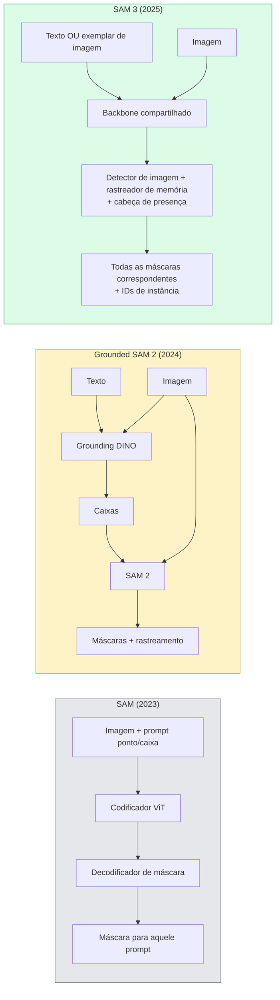

# SAM 3 & Segmentação de Vocabulário Aberto

> Dê a um modelo um prompt de texto e uma imagem e obtenha máscaras para cada objeto correspondente. SAM 3 tornou isso uma única passagem forward.

**Tipo:** Usar + Construir
**Linguagens:** Python
**Pré-requisitos:** Phase 4 Lesson 07 (U-Net), Phase 4 Lesson 08 (Mask R-CNN), Phase 4 Lesson 18 (CLIP)
**Tempo:** ~60 minutos

## Objetivos de Aprendizado

- Distinguir SAM (apenas prompts visuais), Grounded SAM / SAM 2 (detector + SAM) e SAM 3 (prompts de texto nativos via Promptable Concept Segmentation)
- Explicar a arquitetura do SAM 3: backbone compartilhado + detector de imagem + rastreador de vídeo baseado em memória + cabeça de presença + design de detector-rastreador desacoplado
- Usar a integração Hugging Face `transformers` do SAM 3 para detecção, segmentação e rastreamento de vídeo com prompt de texto
- Escolher entre SAM 3, Grounded SAM 2, YOLO-World e SAM-MI com base em latência, complexidade do conceito e alvo de implantação

## O Problema

O SAM de 2023 era um modelo apenas de prompt visual: você clica em um ponto ou desenha uma caixa e ele retorna uma máscara. Para "me dê todas as laranjas nesta foto" você precisava de um detector (Grounding DINO) para produzir caixas, então SAM para segmentar cada uma. Grounded SAM transformou isso em um pipeline, mas era uma cascata de dois modelos congelados com acumulação inevitável de erro.

SAM 3 (Meta, Nov 2025, ICLR 2026) colapsou a cascata. Ele aceita uma frase nominal curta ou um exemplar de imagem como prompt e retorna todas as máscaras correspondentes e IDs de instância em uma única passagem forward. Isso é **Promptable Concept Segmentation (PCS)**. Combinado com a atualização Object Multiplex de Março de 2026 (SAM 3.1), ele rastreia múltiplas instâncias do mesmo conceito através de vídeo eficientemente.

Esta lição é sobre a mudança estrutural que isso representa. Seg 2D, detecção e grounding texto-imagem se fundiram em um modelo. A pergunta de produção não é mais "qual pipeline eu encadeio" mas "qual modelo promptável lida com meu caso de uso ponta a ponta."

## O Conceito

### As três gerações



### Promptable Concept Segmentation

Um "prompt de conceito" é uma frase nominal curta (`"ônibus escolar amarelo"`, `"guarda-chuva vermelho listrado"`, `"mão segurando uma caneca"`) ou um exemplar de imagem. O modelo retorna máscaras de segmentação para cada instância na imagem que corresponde ao conceito, mais um ID de instância único por correspondência.

Isso difere do SAM visual clássico em três aspectos:

1. Sem necessidade de prompt por instância — um prompt de texto retorna todas as correspondências.
2. Vocabulário aberto — o conceito pode ser qualquer coisa descritível em linguagem natural.
3. Retorna múltiplas instâncias de uma vez em vez de uma máscara por prompt.

### Peças arquiteturais chave

- **Backbone compartilhado** — um único ViT processa a imagem. Tanto a cabeça de detector quanto o rastreador baseado em memória leem dele.
- **Cabeça de presença** — prevê se o conceito está presente na imagem. Desacopla "isto está aqui?" de "onde está?". Reduz falsos positivos em conceitos ausentes.
- **Detector-rastreador desacoplado** — detecção em nível de imagem e rastreamento em nível de vídeo têm cabeças separadas para que não interfiram.
- **Banco de memória** — armazena características por instância entre quadros para rastreamento de vídeo (mesmo mecanismo que o SAM 2 usava).

### Treinamento em escala

SAM 3 foi treinado em **4 milhões de conceitos únicos** gerados por um motor de dados que anota e corrige iterativamente usando IA + revisão humana. O novo **benchmark SA-CO** contém 270K conceitos únicos, 50x maior que benchmarks anteriores. SAM 3 atinge 75-80% do desempenho humano no SA-CO e dobra os sistemas existentes em PCS de imagem + vídeo.

### SAM 3.1 Object Multiplex

Atualização de Março de 2026: **Object Multiplex** introduz um mecanismo de memória compartilhada para rastreamento conjunto de muitas instâncias do mesmo conceito de uma vez. Anteriormente, rastrear N instâncias significava N bancos de memória separados. Multiplex colapsa isso em uma memória compartilhada com consultas por instância. Resultado: rastreamento multi-objeto substancialmente mais rápido sem sacrificar acurácia.

### Onde Grounded SAM ainda importa em 2026

- Quando você precisa de um detector de vocabulário aberto específico (DINO-X, Florence-2).
- Quando a licença do SAM 3 (bloqueada no HF) é um impedimento.
- Quando você precisa de mais controle sobre o limiar do detector do que o SAM 3 expõe.
- Para pesquisa / ablação no componente detector.

Pipelines modulares ainda têm seu lugar. Para a maioria dos trabalhos de produção, SAM 3 é a resposta mais simples.

### YOLO-World vs SAM 3

- **YOLO-World** — detector de vocabulário aberto apenas (sem máscaras). Tempo real. Melhor quando você precisa de caixas em alta fps.
- **SAM 3** — segmentação completa + rastreamento. Mais lento mas saída mais rica.

Divisão de produção: YOLO-World para pipelines rápidos apenas de detecção (navegação robótica, painéis rápidos), SAM 3 para qualquer coisa que precise de máscaras ou rastreamento.

### Eficiência SAM-MI

SAM-MI (2025-2026) aborda o gargalo do decodificador do SAM. Ideias chave:

- **Prompt de ponto esparso** — usa alguns pontos bem escolhidos em vez de prompts densos; reduz chamadas do decodificador em 96%.
- **Agregação de máscara rasa** — mescla predições de máscara aproximadas em uma máscara mais nítida.
- **Injeção de máscara desacoplada** — decodificador recebe características de máscara pré-computadas em vez de reexecutar.

Resultado: ~1.6× de aceleração sobre Grounded-SAM em benchmarks de vocabulário aberto.

### Formato de saída para os três modelos

Todos retornam a mesma estrutura geral (caixas + rótulos + pontuações + máscaras + IDs), o que é útil — seu pipeline downstream não precisa ramificar com base em qual modelo executou.

## Construa

### Passo 1: Construção de prompt

Construa um auxiliar que transforma uma frase do usuário em uma lista de prompts de conceito SAM 3. Esta é a fronteira onde "o que o usuário digitou" encontra "o que o modelo consome".

```python
def dividir_conceitos(frase):
    """
    Divisor heurístico para prompts de múltiplos conceitos.
    Retorna lista de frases nominais curtas.
    """
    for sep in [",", ";", "e", "ou", "&"]:
        if sep in frase:
            partes = [p.strip() for p in frase.replace("e ", ",").split(",")]
            return [p for p in partes if p]
    return [frase.strip()]

print(dividir_conceitos("gatos, cachorros e balões"))
```

SAM 3 aceita um conceito por passagem forward; para consultas de múltiplos conceitos, faça loop ou lote.

### Passo 2: Auxiliares de pós-processamento

Transforme as saídas brutas do SAM 3 em uma lista limpa de detecções que correspondam ao contrato do pipeline da Lição 16 da Fase 4.

```python
from dataclasses import dataclass
from typing import List

@dataclass
class DeteccaoConceito:
    conceito: str
    instance_id: int
    box: tuple          # (x1, y1, x2, y2)
    score: float
    mask_rle: str       # codificado em run-length


def codificar_rle(mascara_binaria):
    flat = mascara_binaria.flatten().astype("uint8")
    runs = []
    prev, count = flat[0], 0
    for v in flat:
        if v == prev:
            count += 1
        else:
            runs.append((int(prev), count))
            prev, count = v, 1
    runs.append((int(prev), count))
    return ";".join(f"{v}x{c}" for v, c in runs)
```

RLE mantém os payloads de resposta pequenos mesmo para muitas máscaras de alta resolução. O mesmo formato funciona no SAM 2, SAM 3, Grounded SAM 2.

### Passo 3: Uma interface unificada de segmentação de vocabulário aberto

Encapsule qualquer backend que você tenha (SAM 3, Grounded SAM 2, YOLO-World + SAM 2) atrás de um único método. Seu código downstream não muda quando o backend muda.

```python
from abc import ABC, abstractmethod
import numpy as np

class SegVocabAberto(ABC):
    @abstractmethod
    def detectar(self, image: np.ndarray, concept: str) -> List[DeteccaoConceito]:
        ...


class StubSegVocabAberto(SegVocabAberto):
    """
    Stub determinístico usado para teste de pipeline quando modelos reais não estão carregados.
    """
    def detectar(self, image, concept):
        h, w = image.shape[:2]
        return [
            DeteccaoConceito(
                conceito=concept,
                instance_id=0,
                box=(w * 0.2, h * 0.3, w * 0.5, h * 0.8),
                score=0.89,
                mask_rle="0x100;1x50;0x200",
            ),
            DeteccaoConceito(
                conceito=concept,
                instance_id=1,
                box=(w * 0.55, h * 0.25, w * 0.85, h * 0.75),
                score=0.74,
                mask_rle="0x80;1x40;0x220",
            ),
        ]
```

A subclasse real `SAM3SegVocabAberto` encapsularia `transformers.Sam3Model` e `Sam3Processor`.

### Passo 4: Uso do Hugging Face SAM 3 (referência)

Para o modelo real, a integração `transformers`:

```python
from transformers import Sam3Processor, Sam3Model
import torch

processor = Sam3Processor.from_pretrained("facebook/sam3")
model = Sam3Model.from_pretrained("facebook/sam3").eval()

inputs = processor(images=pil_image, return_tensors="pt")
inputs = processor.set_text_prompt(inputs, "yellow school bus")

with torch.no_grad():
    outputs = model(**inputs)

masks = processor.post_process_masks(
    outputs.masks, inputs.original_sizes, inputs.reshaped_input_sizes
)
boxes = outputs.boxes
scores = outputs.scores
```

Um prompt, todas as correspondências retornadas em uma única chamada.

### Passo 5: Medir o que Grounded SAM 2 te deu de graça

Um benchmark honesto: o que acontece quando você substitui Grounded SAM 2 por SAM 3 em um pipeline real?

- Latência: SAM 3 economiza uma passagem forward (sem detector separado) mas o modelo em si é mais pesado; geralmente neutro ou ligeiramente mais rápido.
- Acurácia: SAM 3 substancialmente melhor em conceitos raros ou composicionais ("guarda-chuva vermelho listrado"). Similar em conceitos comuns de uma palavra.
- Flexibilidade: Grounded SAM 2 permite trocar detectores (DINO-X, Florence-2, Grounding DINO 1.5); SAM 3 é monolítico.

Conclusão: SAM 3 é o padrão para seg de vocabulário aberto em 2026. Grounded SAM 2 ainda é a resposta certa quando você precisa de flexibilidade de detector ou termos de licença diferentes.

## Use

Padrões de implantação de produção:

- **Anotação em tempo real** — SAM 3 + recurso label-as-text-prompt do CVAT. Anotadores selecionam um nome de rótulo; SAM 3 pré-rotula cada instância correspondente. Revise e corrija.
- **Analítica de vídeo** — SAM 3.1 Object Multiplex para rastreamento multi-objeto; alimente quadros ao rastreador baseado em memória.
- **Robótica** — SAM 3 para manipulação de vocabulário aberto ("pegue o copo vermelho"); roda como primitiva de planejamento.
- **Imagens médicas** — SAM 3 ajustado fino em conceitos médicos; requer solicitação de acesso no HF.

Ultralytics encapsula SAM 3 em seu pacote Python:

```python
from ultralytics import SAM

model = SAM("sam3.pt")
results = model(image_path, prompts="yellow school bus")
```

Mesma interface que YOLO e SAM 2.

## Entregue

Esta lição produz:

- `outputs/prompt-open-vocab-stack-picker.md` — um prompt que escolhe SAM 3 / Grounded SAM 2 / YOLO-World / SAM-MI com base em latência, complexidade do conceito e licenciamento.
- `outputs/skill-concept-prompt-designer.md` — uma skill que transforma enunciados de usuário em prompts de conceito SAM 3 bem formados (divisão, desambiguação, fallbacks).

## Exercícios

1. **(Fácil)** Execute SAM 3 em 10 imagens com prompts de conceito de sua escolha. Compare contra SAM 2 + Grounding DINO 1.5 nas mesmas imagens. Reporte quais conceitos cada modelo perdeu.
2. **(Médio)** Construa uma UI "clique-para-incluir / clique-para-excluir" sobre o SAM 3: um prompt de texto retorna instâncias candidatas; o usuário clica para manter quais contam como positivas. Produza o conjunto de conceitos final como JSON.
3. **(Difícil)** Ajuste fino SAM 3 em um conjunto de conceitos personalizado (e.g. 5 tipos de componentes eletrônicos) com 20 imagens rotuladas cada. Compare com SAM 3 zero-shot no mesmo conjunto de teste; meça a melhoria do IoU da máscara.

## Termos-Chave

| Termo | O que as pessoas dizem | O que realmente significa |
|-------|------------------------|---------------------------|
| Segmentação de vocabulário aberto | "Segmentar por texto" | Produzir máscaras para objetos descritos em linguagem natural, não um conjunto fixo de rótulos |
| PCS | "Promptable Concept Segmentation" | Tarefa central do SAM 3 — dada uma frase nominal ou exemplar de imagem, segmentar todas as instâncias correspondentes |
| Prompt de conceito | "A entrada de texto" | Frase nominal curta ou exemplar de imagem; não uma frase completa |
| Cabeça de presença | "Está aqui?" | Módulo do SAM 3 que decide se o conceito existe na imagem antes da localização |
| SA-CO | "Benchmark SAM 3" | Benchmark de segmentação de vocabulário aberto com 270K conceitos; 50x maior que benchmarks anteriores de vocabulário aberto |
| Object Multiplex | "Atualização SAM 3.1" | Rastreamento multi-objeto de memória compartilhada; rastreamento conjunto rápido de muitas instâncias |
| Grounded SAM 2 | "Pipeline modular" | Cascata detector + SAM 2; ainda relevante quando a troca de detector importa |
| SAM-MI | "Variante SAM eficiente" | Mask Injection para 1.6× de aceleração sobre Grounded-SAM |

## Leitura Complementar

- [SAM 3: Segment Anything with Concepts (arXiv 2511.16719)](https://arxiv.org/abs/2511.16719)
- [SAM 3.1 Object Multiplex (Meta AI, Março 2026)](https://ai.meta.com/blog/segment-anything-model-3/)
- [Página do modelo SAM 3 no Hugging Face](https://huggingface.co/facebook/sam3)
- [Tutorial Grounded SAM 2 (PyImageSearch)](https://pyimagesearch.com/2026/01/19/grounded-sam-2-from-open-set-detection-to-segmentation-and-tracking/)
- [Ultralytics SAM 3 docs](https://docs.ultralytics.com/models/sam-3/)
- [SAM3-I: Instruction-aware SAM (arXiv 2512.04585)](https://arxiv.org/abs/2512.04585)
