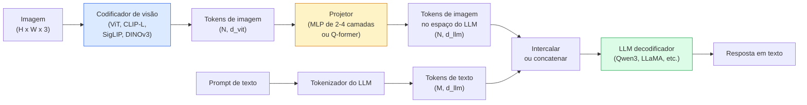

# Modelos Visão-Linguagem — O Padrão ViT-MLP-LLM

> Um codificador de visão converte uma imagem em tokens. Um projetor MLP mapeia esses tokens para o espaço de embedding do LLM. Um modelo de linguagem faz o resto. Esse padrão — ViT-MLP-LLM — é todo VLM de produção em 2026.

**Tipo:** Aprender + Usar
**Linguagens:** Python
**Pré-requisitos:** Phase 4 Lesson 14 (ViT), Phase 4 Lesson 18 (CLIP), Phase 7 Lesson 02 (Self-Attention)
**Tempo:** ~75 minutos

## Objetivos de Aprendizado

- Declarar a arquitetura ViT-MLP-LLM e explicar o que cada um dos três componentes contribui
- Comparar Qwen3-VL, InternVL3.5, LLaVA-Next e GLM-4.6V em contagem de parâmetros, comprimento de contexto e desempenho em benchmarks
- Explicar DeepStack: por que características ViT de múltiplos níveis apertam o alinhamento visão-linguagem melhor que uma única característica da última camada
- Medir alucinação de VLM em produção com Cross-Modal Error Rate (CMER) e agir sobre o sinal

## O Problema

CLIP (Fase 4 Lição 18) te dá um espaço de embedding compartilhado para imagens e texto, o que é suficiente para classificação zero-shot e recuperação. Ele não consegue responder "quantos carros vermelhos estão nesta imagem?" porque CLIP não gera texto — ele apenas pontua similaridades.

Modelos Visão-Linguagem (VLMs) — Qwen3-VL, InternVL3.5, LLaVA-Next, GLM-4.6V — parafusam um codificador de imagem da família CLIP a um modelo de linguagem completo. O modelo vê uma imagem mais uma pergunta e gera uma resposta. Em 2026, VLMs de código aberto rivalizam ou superam GPT-5 e Gemini-2.5-Pro em benchmarks multimodais (MMMU, MMBench, DocVQA, ChartQA, MathVista, OSWorld).

O trio de peças (ViT, projetor, LLM) é o padrão. As diferenças entre modelos estão em qual ViT, qual projetor, qual LLM, os dados de treino e a receita de alinhamento. Uma vez que você entende o padrão, trocar qualquer componente é mecânico.

## O Conceito

### A arquitetura ViT-MLP-LLM



1. **Codificador de visão** — um ViT pré-treinado (CLIP-L/14, SigLIP, DINOv3 ou uma variante ajustada fina). Produz tokens de patch.
2. **Projetor** — um pequeno módulo (MLP de 2-4 camadas, ou um Q-former) que mapeia tokens de visão para a dimensão de embedding do LLM. É aqui que a maior parte do fine-tuning acontece.
3. **LLM** — um modelo de linguagem apenas decodificador (Qwen3, Llama, Mistral, GLM, InternLM). Lê os tokens de visão + texto em sequência, gera texto.

Todas as três peças são treináveis em princípio. Na prática, o codificador de visão e o LLM permanecem principalmente congelados enquanto o projetor treina — alguns bilhões de parâmetros de sinal por barato.

### DeepStack

A projeção vanilla usa apenas a última camada do ViT. DeepStack (Qwen3-VL) amostra características de múltiplas profundidades do ViT e as empilha. Camadas mais profundas carregam semântica de alto nível; camadas mais rasas carregam informação espacial e textural de granularidade fina. Alimentar ambas no LLM fecha a lacuna entre "o que a imagem contém" (semântica) e "onde exatamente" (grounding espacial).

### Três estágios de treinamento

VLMs modernos treinam em estágios:

1. **Alinhamento** — congele ViT e LLM. Treine apenas o projetor em pares imagem-legenda. Ensina o projetor a mapear espaço de visão para espaço de linguagem.
2. **Pré-treinamento** — descongele tudo. Treine em dados intercalados imagem-texto em grande escala (500M+ pares). Constrói o conhecimento visual do modelo.
3. **Instruction tuning** — ajuste fino em triplas curadas (imagem, pergunta, resposta). Ensina comportamento conversacional e formatos de tarefa. Isso é o que transforma um "LM ciente de visão" em um assistente utilizável.

A maioria dos fine-tunes LoRA visa o estágio 3 com um pequeno dataset rotulado.

### Comparação de famílias de modelos (início de 2026)

| Modelo | Params | Codificador de visão | LLM | Contexto | Pontos fortes |
|--------|--------|----------------------|-----|----------|--------------|
| Qwen3-VL-235B-A22B (MoE) | 235B (22B ativos) | ViT personalizado + DeepStack | Qwen3 | 256K | SOTA geral, agente GUI |
| Qwen3-VL-30B-A3B (MoE) | 30B (3B ativos) | ViT personalizado + DeepStack | Qwen3 | 256K | Alternativa MoE menor |
| Qwen3-VL-8B (denso) | 8B | ViT personalizado | Qwen3 | 128K | Padrão denso de produção |
| InternVL3.5-38B | 38B | InternViT-6B | Qwen3 + GPT-OSS | 128K | Forte MMBench / MMVet |
| InternVL3.5-241B-A28B | 241B (28B ativos) | InternViT-6B | Qwen3 | 128K | Competitivo com GPT-4o |
| LLaVA-Next 72B | 72B | SigLIP | Llama-3 | 32K | Aberto, fácil de ajustar fino |
| GLM-4.6V | ~70B | personalizado | GLM | 64K | Código aberto, OCR forte |
| MiniCPM-V-2.6 | 8B | SigLIP | MiniCPM | 32K | Amigável à borda |

### Agentes visuais

Qwen3-VL-235B atinge desempenho global máximo no OSWorld — um benchmark para **agentes visuais** que operam GUIs (desktop, mobile, web). O modelo vê uma captura de tela, entende a UI e emite ações (clicar, digitar, rolar). Combinado com ferramentas, ele fecha o loop em tarefas comuns de desktop. Isso é o que a maioria das demos de "AI PC" de 2026 roda nos bastidores.

### Capacidades agentivas + variantes RoPE

VLMs precisam saber **quando** um quadro está em um vídeo. O Qwen3-VL evoluiu de T-RoPE (temporal rotary position embeddings) para **alinhamento de tempo baseado em texto** — tokens de timestamp explícitos intercalados com quadros de vídeo. O modelo vê "`<timestamp 00:32>` quadro, prompt" e pode raciocinar sobre relações temporais.

### O problema de alinhamento

12% dos pares imagem-texto em um dataset rastreado contêm descrições não totalmente fundamentadas na imagem. Um VLM treinado nisso silenciosamente aprende a alucinar — fabricar objetos, ler números errados, inventar relações. Em produção, este é o modo de falha dominante.

Skywork.ai introduziu o **Cross-Modal Error Rate (CMER)** para rastreá-lo:

```
CMER = fração de saídas onde a confiança de texto é alta mas a similaridade imagem-texto (via um verificador da família CLIP) é baixa
```

CMER alto significa que o modelo está dizendo coisas confiantemente não fundamentadas na imagem. Monitorar CMER e tratá-lo como um KPI de produção reduziu a taxa de alucinação em ~35% em sua implantação. O truque não é "consertar o modelo" mas "encaminhar saídas de alto CMER para revisão humana."

### Fine-tuning com LoRA / QLoRA

Fine-tuning completo de um VLM de 70B está fora do alcance da maioria das equipes. LoRA (rank 16-64) em camadas de atenção + projetor, ou QLoRA com pesos base de 4 bits, cabe em um único A100 / H100. Custo: 5.000-50.000 exemplos, $100-$5.000 em computação, 2-10 horas de treino.

### Raciocínio espacial ainda é fraco

VLMs atuais pontuam 50-60% em benchmarks de raciocínio espacial (acima-abaixo, esquerda-direita, contagem, distância). Se seu caso de uso depende de "qual objeto está em cima de qual," valide fortemente — o desempenho VLM genérico está abaixo do humano. Alternativas melhores que VLM para tarefas puramente espaciais: um estimador de pontos-chave / pose especializado, um modelo de profundidade ou um modelo de detecção com geometria de caixa pós-processada.

## Construa

### Passo 1: O projetor

A parte que você treinará mais frequentemente. MLP de 2-4 camadas com GELU.

```python
import torch
import torch.nn as nn


class Projetor(nn.Module):
    def __init__(self, vit_dim=768, llm_dim=4096, hidden=4096):
        super().__init__()
        self.net = nn.Sequential(
            nn.Linear(vit_dim, hidden),
            nn.GELU(),
            nn.Linear(hidden, llm_dim),
        )

    def forward(self, x):
        return self.net(x)
```

A entrada é um tensor de token `(N_patches, d_vit)`. A saída é `(N_patches, d_llm)`. O LLM trata cada linha de saída como apenas mais um token.

### Passo 2: Montar ViT-MLP-LLM ponta a ponta

Esqueleto da passagem forward para um VLM mínimo. Código real usa `transformers`; este é o layout conceitual.

```python
class VLMminimo(nn.Module):
    def __init__(self, vit, projector, llm, id_token_imagem):
        super().__init__()
        self.vit = vit
        self.projector = projector
        self.llm = llm
        self.id_token_imagem = id_token_imagem  # token placeholder no prompt de texto

    def forward(self, image, input_ids, attention_mask):
        # 1. características de visão
        tokens_visao = self.vit(image)                     # (B, N_patches, d_vit)
        embeds_visao = self.projector(tokens_visao)       # (B, N_patches, d_llm)

        # 2. embeddings de texto
        embeds_texto = self.llm.get_input_embeddings()(input_ids)  # (B, M, d_llm)

        # 3. substituir tokens placeholder de imagem por embeds de visão
        mesclado = self._mesclar(embeds_texto, embeds_visao, input_ids)

        # 4. executar LLM
        return self.llm(inputs_embeds=mesclado, attention_mask=attention_mask)

    def _mesclar(self, embeds_texto, embeds_visao, input_ids):
        out = embeds_texto.clone()
        esperado = embeds_visao.size(1)
        for b in range(input_ids.size(0)):
            posicoes = (input_ids[b] == self.id_token_imagem).nonzero(as_tuple=True)[0]
            if len(posicoes) != esperado:
                raise ValueError(
                    f"item de lote {b} tem {len(posicoes)} tokens de imagem mas embeds_visao tem {esperado} patches."
                    " Cada amostra no lote deve ser pré-preenchida com o mesmo número de tokens placeholder de imagem.")
            out[b, posicoes] = embeds_visao[b]
        return out
```

O token placeholder `<image>` no texto é substituído por embeddings de imagem reais — mesmo padrão que LLaVA, Qwen-VL e InternVL usam.

### Passo 3: Computação de CMER

Uma verificação de runtime leve.

```python
import torch.nn.functional as F


def taxa_erro_cross_modal(emb_imagem, emb_texto, confianca_texto, limiar_sim=0.25, limiar_conf=0.8):
    """
    emb_imagem, emb_texto: embeddings da imagem e do texto gerado (normalizados internamente)
    confianca_texto:        probabilidade média por token em [0, 1]
    Retorna:                fração de saídas de alta confiança com baixo alinhamento imagem-texto
    """
    emb_imagem = F.normalize(emb_imagem, dim=-1)
    emb_texto = F.normalize(emb_texto, dim=-1)
    sim = (emb_imagem * emb_texto).sum(dim=-1)        # similaridade cosseno
    alta_conf_baixa_sim = (confianca_texto > limiar_conf) & (sim < limiar_sim)
    return alta_conf_baixa_sim.float().mean().item()
```

Trate CMER como um KPI de produção. Monitore-o por endpoint, por tipo de prompt, por cliente. CMER crescente indica que o modelo está começando a alucinar em alguma distribuição de entrada.

### Passo 4: Classificador VLM de brinquedo (executável)

Demonstre que o projetor treina. "Características ViT" falsas entram; um token estilo LLM minúsculo prevê uma classe.

```python
class VLMbrinquedo(nn.Module):
    def __init__(self, vit_dim=32, llm_dim=64, num_classes=5):
        super().__init__()
        self.projector = Projetor(vit_dim, llm_dim, hidden=64)
        self.head = nn.Linear(llm_dim, num_classes)

    def forward(self, tokens_visao):
        projetado = self.projector(tokens_visao)
        pooled = projetado.mean(dim=1)
        return self.head(pooled)
```

Pode-se ajustar isso em pares sintéticos (característica, classe) em menos de 200 passos — suficiente para mostrar que o padrão do projetor funciona.

## Use

Três formas como equipes de produção usam VLMs em 2026:

- **API hospedada** — OpenAI Vision, Anthropic Claude Vision, Google Gemini Vision. Zero infraestrutura, risco de fornecedor.
- **Autohospedado de código aberto** — Qwen3-VL ou InternVL3.5 via `transformers` e `vllm`. Controle total, maior esforço inicial.
- **Fine-tune em domínio** — carregue Qwen2.5-VL-7B ou LLaVA-1.6-7B, LoRA em 5k-50k exemplos personalizados, sirva com `vllm` ou `TGI`.

```python
from transformers import AutoProcessor, AutoModelForVision2Seq
import torch
from PIL import Image

model_id = "Qwen/Qwen3-VL-8B-Instruct"
processor = AutoProcessor.from_pretrained(model_id)
model = AutoModelForVision2Seq.from_pretrained(model_id, torch_dtype=torch.bfloat16, device_map="auto")

messages = [{
    "role": "user",
    "content": [
        {"type": "image", "image": Image.open("plot.png")},
        {"type": "text", "text": "O que este gráfico mostra?"},
    ],
}]
inputs = processor.apply_chat_template(messages, add_generation_prompt=True, tokenize=True, return_dict=True, return_tensors="pt").to("cuda")
generated = model.generate(**inputs, max_new_tokens=256)
answer = processor.decode(generated[0][inputs["input_ids"].shape[1]:], skip_special_tokens=True)
```

`apply_chat_template` esconde a tokenização do placeholder `<image>`; o modelo lida com a mesclagem internamente.

## Entregue

Esta lição produz:

- `outputs/prompt-vlm-selector.md` — escolhe Qwen3-VL / InternVL3.5 / LLaVA-Next / API dados acurácia, latência, comprimento de contexto e orçamento.
- `outputs/skill-cmer-monitor.md` — emite o código para instrumentar um endpoint VLM de produção com taxa de erro cross-modal, dashboards por endpoint e limiares de alerta.

## Exercícios

1. **(Fácil)** Execute três prompts ("o que é isso?", "conte os objetos", "descreva a cena") através de qualquer VLM aberto em cinco imagens. Pontue cada resposta como correta / parcialmente correta / alucinada manualmente. Compute uma taxa tipo CMER de primeira passagem.
2. **(Médio)** Ajuste fino Qwen2.5-VL-3B ou LLaVA-1.6-7B com LoRA (rank 16) em 500 imagens de um domínio alvo com legendas. Compare acurácia estilo MMBench zero-shot vs ajustada fina.
3. **(Difícil)** Substitua o codificador de imagem do VLM por DINOv3 em vez de seu SigLIP/CLIP padrão. Retreine apenas o projetor (LLM congelado + DINOv3 congelado). Meça se tarefas de predição densa (contagem, raciocínio espacial) melhoram.

## Termos-Chave

| Termo | O que as pessoas dizem | O que realmente significa |
|-------|------------------------|---------------------------|
| ViT-MLP-LLM | "O padrão VLM" | Codificador de visão + projetor + modelo de linguagem; todo VLM de 2026 |
| Projetor | "A ponte" | MLP de 2-4 camadas (ou Q-former) que mapeia tokens de visão para o espaço de embedding do LLM |
| DeepStack | "Truque de característica Qwen3-VL" | Características ViT de múltiplos níveis empilhadas em vez de apenas última camada |
| Token de imagem | "placeholder <image>" | Token especial no fluxo de texto substituído por embeddings de visão projetados |
| CMER | "KPI de alucinação" | Cross-Modal Error Rate; alto quando a confiança de texto é alta mas a similaridade imagem-texto é baixa |
| Agente visual | "VLM que clica" | VLM operando GUIs (OSWorld, mobile, web) com chamadas de ferramenta |
| Q-former | "Ponte de token de contagem fixa" | Projetor estilo BLIP-2 produzindo um número fixo de tokens de consulta visual |
| Alinhamento / pré-treinamento / instruction tuning | "Três estágios" | Pipeline padrão de treinamento VLM |

## Leitura Complementar

- [Qwen3-VL Technical Report (arXiv 2511.21631)](https://arxiv.org/abs/2511.21631)
- [InternVL3.5 Advancing Open-Source Multimodal Models (arXiv 2508.18265)](https://arxiv.org/html/2508.18265v1)
- [LLaVA-Next series](https://llava-vl.github.io/blog/2024-05-10-llava-next-stronger-llms/)
- [BentoML: Best Open-Source VLMs 2026](https://www.bentoml.com/blog/multimodal-ai-a-guide-to-open-source-vision-language-models)
- [MMMU: Multi-discipline Multimodal Understanding benchmark](https://mmmu-benchmark.github.io/)
- [VLMs in manufacturing (Robotics Tomorrow, Março 2026)](https://www.roboticstomorrow.com/story/2026/03/when-machines-learn-to-see-like-experts-the-rise-of-vision-language-models-in-manufacturing/26335/)
