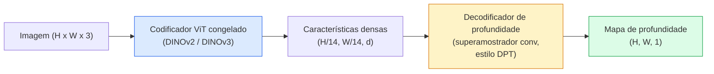

# Profundidade Monocular & Estimação de Geometria

> Um mapa de profundidade é uma imagem de canal único onde cada pixel é uma distância da câmera. Prevê-lo a partir de um quadro RGB costumava ser impossível sem estéreo ou LiDAR. Em 2026, um codificador ViT congelado mais uma cabeça leve chega a poucos por cento da verdade.

**Tipo:** Construir + Usar
**Linguagens:** Python
**Pré-requisitos:** Phase 4 Lesson 14 (ViT), Phase 4 Lesson 17 (Visão Auto-Supervisionada), Phase 4 Lesson 07 (U-Net)
**Tempo:** ~60 minutos

## Objetivos de Aprendizado

- Distinguir profundidade relativa e métrica e declarar qual cada modelo de produção (MiDaS, Marigold, Depth Anything V3, ZoeDepth) resolve
- Usar Depth Anything V3 (backbone DINOv2) para prever profundidade para imagens únicas arbitrárias sem calibração
- Explicar por que a profundidade monocular funciona a partir de uma única imagem (dicas de perspectiva, gradientes de textura, priores aprendidos) e o que ela não pode recuperar (escala absoluta, geometria ocluída)
- Elevar detecções 2D para pontos 3D usando um mapa de profundidade e intrínsecas de câmera pinhole

## O Problema

Profundidade é o eixo ausente na visão computacional 2D. Dado RGB, você sabe onde as coisas aparecem no plano da imagem; você não sabe quão distantes estão. Sensores de profundidade (rígidos estéreo, LiDAR, time-of-flight) resolvem isso diretamente mas são caros, frágeis e limitados em alcance.

A estimação de profundidade monocular — prever profundidade a partir de um único quadro RGB — costumava produzir saída borrada e não confiável. Em 2026, grandes codificadores pré-treinados mudaram isso: Depth Anything V3 usa um backbone DINOv2 congelado e produz mapas de profundidade que generalizam entre domínios interno, externo, médico e satélite. Marigold reformula profundidade como um problema de difusão condicional. ZoeDepth regride distâncias métricas verdadeiras.

Profundidade é também a ponte entre detecção 2D e compreensão 3D: multiplique os pixels de uma caixa detectada pela profundidade e você eleva o objeto 2D para uma nuvem de pontos 3D. Esse é o núcleo de todo sistema de oclusão de RA, todo pipeline de desvio de obstáculos e todo robô "pegue o copo."

## O Conceito

### Profundidade relativa vs métrica

- **Profundidade relativa** — valores `z` ordenados sem unidade do mundo real. "O pixel A está mais perto que o pixel B, mas a razão das distâncias não está ancorada em metros."
- **Profundidade métrica** — distância absoluta em metros da câmera. Requer que o modelo tenha aprendido a relação estatística entre dicas de imagem e distância real.

MiDaS e Depth Anything V3 produzem profundidade relativa. Marigold produz profundidade relativa. ZoeDepth, UniDepth e Metric3D produzem profundidade métrica. Modelos métricos são sensíveis a intrínsecas de câmera; modelos relativos não são.

### O padrão codificador-decodificador



Depth Anything V3 congela o codificador e treina apenas o decodificador estilo DPT. O codificador fornece características ricas; o decodificador as interpola de volta para a resolução da imagem e regride a profundidade.

### Por que uma única imagem produz profundidade

Uma imagem 2D contém muitas dicas monoculares que correlacionam com profundidade:

- **Perspectiva** — linhas paralelas em 3D convergem em 2D.
- **Gradiente de textura** — superfícies distantes têm textura menor e mais densa.
- **Ordem de oclusão** — objetos mais próximos ocluem os mais distantes.
- **Constância de tamanho** — objetos conhecidos (carros, humanos) dão escala aproximada.
- **Perspectiva atmosférica** — objetos distantes parecem mais nebulosos e azuis em cenas externas.

Um ViT treinado em bilhões de imagens internaliza essas dicas. Com dados suficientes e um backbone forte, a profundidade monocular atinge acurácia razoável sem qualquer supervisão 3D explícita.

### O que a profundidade monocular não pode fazer

- **Escala métrica absoluta** sem intrínsecas ou um objeto conhecido na cena. A rede pode prever "o copo está duas vezes mais longe que a colher" sem saber se o copo está a 1 m ou 10 m de distância.
- **Geometria ocluída** — o verso de uma cadeira não é visto e não pode ser inferido de forma confiável.
- **Superfícies verdadeiramente sem textura / refletivas** — espelhos, vidro, paredes uniformes. A rede reporta profundidade plausível mas errada.

### Depth Anything V3 em 2026

- DINOv2 ViT-L/14 vanilla como codificador (congelado).
- Decodificador DPT.
- Treinado em pares de imagens com pose de fontes diversas (nenhuma supervisão explícita de profundidade necessária além da consistência fotométrica).
- Prevê geometria espacialmente consistente a partir de **um número arbitrário de entradas visuais, com ou sem poses de câmera conhecidas**.
- SOTA em profundidade monocular, geometria de qualquer vista, renderização visual, estimação de pose de câmera.

Este é o modelo plugável para chamar quando você precisa de profundidade em 2026.

### Marigold — difusão para profundidade

Marigold (Ke et al., CVPR 2024) reformula a estimação de profundidade como difusão condicional imagem-para-imagem. Condicionamento: RGB. Alvo: mapa de profundidade. Usa um U-Net do Stable Diffusion 2 pré-treinado como backbone. Os mapas de profundidade de saída são excepcionalmente nítidos nos limites de objetos. Trade-off: inferência mais lenta que modelos feed-forward (10-50 passos de denoising).

### Intrínsecas e a câmera pinhole

Para elevar um pixel `(u, v)` com profundidade `d` para um ponto 3D `(X, Y, Z)` em coordenadas de câmera:

```
fx, fy, cx, cy = intrínsecas da câmera
X = (u - cx) * d / fx
Y = (v - cy) * d / fy
Z = d
```

Intrínsecas vêm de metadados EXIF, um padrão de calibração ou um estimador de intrínsecas monocular (Perspective Fields, UniDepth). Sem intrínsecas, você ainda pode renderizar uma nuvem de pontos assumindo um FOV de 60-70° e principais de resolução moderada — utilizável para visualização, não para medição.

### Avaliação

Duas métricas padrão:

- **AbsRel** (erro relativo absoluto): `média(|d_pred - d_gt| / d_gt)`. Menor é melhor. 0.05-0.1 para modelos de produção.
- **delta < 1.25** (acurácia de limiar): fração de pixels onde `max(d_pred/d_gt, d_gt/d_pred) < 1.25`. Maior é melhor. 0.9+ para SOTA.

Para profundidade relativa (Depth Anything V3, MiDaS), a avaliação usa versões invariantes a escala-e-deslocamento de ambas as métricas.

## Construa

### Passo 1: Métricas de profundidade

```python
import torch

def erro_abs_rel(pred, target, mask=None):
    if mask is not None:
        pred = pred[mask]
        target = target[mask]
    return (torch.abs(pred - target) / target.clamp(min=1e-6)).mean().item()


def acuracia_delta(pred, target, threshold=1.25, mask=None):
    if mask is not None:
        pred = pred[mask]
        target = target[mask]
    ratio = torch.maximum(pred / target.clamp(min=1e-6), target / pred.clamp(min=1e-6))
    return (ratio < threshold).float().mean().item()
```

Sempre mascare pixels de profundidade inválidos (zero, NaN, saturados) antes da avaliação.

### Passo 2: Alinhamento de escala-e-deslocamento

Para modelos de profundidade relativa, alinhe a predição à verdade antes de computar métricas. Ajuste de mínimos quadrados de `a * pred + b = target`:

```python
def alinhar_escala_deslocamento(pred, target, mask=None):
    if mask is not None:
        p = pred[mask]
        t = target[mask]
    else:
        p = pred.flatten()
        t = target.flatten()
    A = torch.stack([p, torch.ones_like(p)], dim=1)
    coeffs, *_ = torch.linalg.lstsq(A, t.unsqueeze(-1))
    a, b = coeffs[:2, 0]
    return a * pred + b
```

Execute `alinhar_escala_deslocamento` antes de `erro_abs_rel` ao avaliar MiDaS / Depth Anything.

### Passo 3: Elevar profundidade para nuvem de pontos

```python
import numpy as np

def profundidade_para_nuvem_pontos(profundidade, intrinsicas):
    H, W = profundidade.shape
    fx, fy, cx, cy = intrinsicas
    v, u = np.meshgrid(np.arange(H), np.arange(W), indexing="ij")
    z = profundidade
    x = (u - cx) * z / fx
    y = (v - cy) * z / fy
    return np.stack([x, y, z], axis=-1)


profundidade = np.random.uniform(0.5, 4.0, (240, 320))
intr = (320.0, 320.0, 160.0, 120.0)
pc = profundidade_para_nuvem_pontos(profundidade, intr)
print(f"forma da nuvem de pontos: {pc.shape}  (H, W, 3)")
```

Uma função, toda aplicação 3D elevada. Exporte a nuvem de pontos para `.ply` e abra no MeshLab ou CloudCompare.

### Passo 4: Teste de fumaça com uma cena de profundidade sintética

```python
def profundidade_sintetica(size=96):
    yy, xx = np.meshgrid(np.arange(size), np.arange(size), indexing="ij")
    # Chão: gradiente linear de perto (topo) para longe (fundo)
    profundidade = 1.0 + (yy / size) * 4.0
    # Caixa no meio: mais perto
    mask = (np.abs(xx - size / 2) < size / 6) & (np.abs(yy - size * 0.6) < size / 6)
    profundidade[mask] = 2.0
    return profundidade.astype(np.float32)


gt = torch.from_numpy(profundidade_sintetica(96))
pred = gt + 0.3 * torch.randn_like(gt)  # predição simulada
alinhado = alinhar_escala_deslocamento(pred, gt)
print(f"antes de alinhar  absRel = {erro_abs_rel(pred, gt):.3f}")
print(f"após alinhar   absRel = {erro_abs_rel(alinhado, gt):.3f}")
```

### Passo 5: Uso do Depth Anything V3 (referência)

```python
import torch
from transformers import pipeline
from PIL import Image

pipe = pipeline(task="depth-estimation", model="LiheYoung/depth-anything-v2-large")

image = Image.open("rua.jpg").convert("RGB")
out = pipe(image)
depth_np = np.array(out["depth"])
```

Três linhas. `out["depth"]` é uma escala de cinza PIL; converta para numpy para matemática. Para Depth Anything V3 especificamente, troque o id do modelo quando lançado; a API permanece inalterada.

## Use

- **Depth Anything V3** (Meta AI / ByteDance, 2024-2026) — o padrão para profundidade relativa. Modelo de backbone ViT-large mais rápido em produção.
- **Marigold** (ETH, 2024) — maior qualidade visual, inferência lenta.
- **UniDepth** (ETH, 2024) — profundidade métrica com estimação de intrínsecas de câmera.
- **ZoeDepth** (Intel, 2023) — profundidade métrica; mais antigo, ainda confiável.
- **MiDaS v3.1** — legado mas estável; bom baseline para comparação.

Padrão típico de integração:

1. Quadro RGB chega.
2. Modelo de profundidade produz mapa de profundidade.
3. Detector produz caixas.
4. Eleve centróides de caixa através da profundidade para 3D; mescle com nuvem de pontos se disponível.
5. Downstream: oclusão RA, planejamento de caminho, estimação de tamanho de objeto, substituição estéreo.

Para uso em tempo real, Depth Anything V2 Small (INT8 quantizado) atinge ~30 fps em uma GPU de consumo a 518x518.

## Entregue

Esta lição produz:

- `outputs/prompt-depth-model-picker.md` — escolhe entre Depth Anything V3, Marigold, UniDepth, MiDaS dada latência, necessidade métrica-vs-relativa e tipo de cena.
- `outputs/skill-depth-to-pointcloud.md` — uma skill que constroi nuvens de pontos a partir de mapas de profundidade com tratamento correto de intrínsecas e exportação para `.ply`.

## Exercícios

1. **(Fácil)** Execute Depth Anything V2 em 10 imagens quaisquer da sua mesa. Salve profundidade como PNGs em escala de cinza e inspecione. Identifique um objeto cuja profundidade prevista parece errada e explique por que as dicas monoculares falharam.
2. **(Médio)** Dado RGB + profundidade do Depth Anything V2, eleve para uma nuvem de pontos e renderize com `open3d`. Compare duas cenas (interno / externo) e note qual parece mais crível.
3. **(Difícil)** Pegue cinco pares de imagens que diferem apenas pela posição de um objeto conhecido (e.g. garrafa movida 30 cm mais perto). Use UniDepth para prever profundidade métrica em ambas. Reporte o delta de distância previsto vs o verdadeiro 30 cm.

## Termos-Chave

| Termo | O que as pessoas dizem | O que realmente significa |
|-------|------------------------|---------------------------|
| Profundidade monocular | "Profundidade de imagem única" | Estimação de profundidade a partir de um quadro RGB, sem estéreo ou LiDAR |
| Profundidade relativa | "Profundidade ordenada" | Valores z ordenados sem unidades do mundo real |
| Profundidade métrica | "Distância absoluta" | Profundidade em metros; requer calibração ou um modelo treinado com supervisão métrica |
| AbsRel | "Erro relativo absoluto" | Média de |d_pred - d_gt| / d_gt; métrica de profundidade padrão |
| Acurácia delta | "delta < 1.25" | Fração de pixels com predição dentro de 25% da verdade |
| Câmera pinhole | "fx, fy, cx, cy" | O modelo de câmera usado para elevar (u, v, d) para (X, Y, Z) |
| DPT | "Dense Prediction Transformer" | O decodificador baseado em conv usado sobre codificadores ViT congelados para profundidade |
| Backbone DINOv2 | "A razão pela qual funciona" | Características auto-supervisionadas que generalizam entre domínios sem rótulos de profundidade |

## Leitura Complementar

- [Depth Anything V3 paper page](https://depth-anything.github.io/) — SOTA em profundidade monocular com codificador DINOv2
- [Marigold (Ke et al., CVPR 2024)](https://marigoldmonodepth.github.io/) — estimação de profundidade baseada em difusão
- [UniDepth (Piccinelli et al., 2024)](https://arxiv.org/abs/2403.18913) — profundidade métrica com intrínsecas
- [MiDaS v3.1 (Intel ISL)](https://github.com/isl-org/MiDaS) — o baseline canônico de profundidade relativa
- [DINOv3 blog post (Meta)](https://ai.meta.com/blog/dinov3-self-supervised-vision-model/) — a família de codificadores que eleva a acurácia de profundidade
