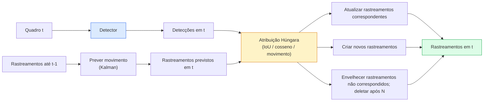

# Rastreamento Multi-Objeto & Memória de Vídeo

> Rastreamento é detecção mais associação. Detecte cada quadro. Corresponda as detecções deste quadro aos rastreamentos do quadro anterior por ID.

**Tipo:** Construção
**Linguagens:** Python
**Pré-requisitos:** Phase 4 Lesson 06 (Detecção YOLO), Phase 4 Lesson 08 (Mask R-CNN), Phase 4 Lesson 24 (SAM 3)
**Tempo:** ~60 minutos

## Objetivos de Aprendizado

- Distinguir rastreamento-por-detecção de rastreamento baseado em consulta e nomear as famílias de algoritmos (SORT, DeepSORT, ByteTrack, BoT-SORT, rastreador de memória SAM 2, SAM 3.1 Object Multiplex)
- Implementar atribuição IoU + Húngara do zero para rastreamento-por-detecção clássico
- Explicar o banco de memória do SAM 2 e por que ele lida com oclusão melhor que a associação baseada em IoU
- Ler as três métricas de rastreamento (MOTA, IDF1, HOTA) e escolher qual importa para um dado caso de uso

## O Problema

Um detector te diz onde os objetos estão em um único quadro. Um rastreador te diz qual detecção no quadro `t` é o mesmo objeto que uma detecção no quadro `t-1`. Sem isso, você não pode contar objetos cruzando uma linha, seguir uma bola através de uma oclusão ou saber "o carro #4 está na faixa há 8 segundos."

Rastreamento é essencial para todo produto voltado a vídeo: análise esportiva, vigilância, direção autônoma, análise de vídeo médico, monitoramento de vida selvagem, contagem de logotipos. Os blocos de construção centrais são compartilhados: um detector por quadro, um modelo de movimento (filtro Kalman ou algo mais rico), um passo de associação (algoritmo Húngaro em IoU / cosseno / características aprendidas) e um ciclo de vida de rastreamento (nascimento, atualização, morte).

2026 trouxe dois novos padrões: **rastreamento baseado em memória SAM 2** (memória de características em vez de associação de modelo de movimento) e **SAM 3.1 Object Multiplex** (memória compartilhada para muitas instâncias do mesmo conceito). Esta lição percorre o stack clássico primeiro, depois a abordagem baseada em memória.

## O Conceito

### Rastreamento-por-detecção



Todo rastreador que você encontrará em 2026 é uma variação deste loop. As diferenças:

- **SORT** (2016): Filtro Kalman + IoU Húngaro. Simples, rápido, sem modelo de aparência.
- **DeepSORT** (2017): SORT + uma característica de aparência baseada em CNN por rastreamento (embedding ReID). Lida melhor com cruzamentos.
- **ByteTrack** (2021): associa detecções de baixa confiança como um segundo estágio; sem necessidade de características de aparência, mas melhor desempenho no MOT17.
- **BoT-SORT** (2022): Byte + compensação de movimento de câmera + ReID.
- **StrongSORT / OC-SORT** — descendentes de ByteTrack com melhor movimento e aparência.

### Filtro Kalman em um parágrafo

Um filtro Kalman mantém um estado por rastreamento `(x, y, w, h, dx, dy, dw, dh)` com uma covariância. Em cada quadro, **prevê** o estado usando um modelo de velocidade constante, então **atualiza** com a detecção correspondente. A atualização confia mais na detecção quando a incerteza da previsão é alta. Isso dá trajetórias suaves e a capacidade de continuar um rastreamento através de uma oclusão curta (1-5 quadros).

Todo rastreador clássico usa um filtro Kalman no passo de previsão de movimento.

### O algoritmo Húngaro

Dada uma matriz de custo `M x N` (rastreamentos x detecções), encontre a atribuição um-para-um que minimiza o custo total. O custo é geralmente `1 - IoU(bbox_rastreamento, bbox_deteccao)` ou similaridade cosseno negativa de características de aparência. O runtime é O((M+N)^3); para M, N até ~1000 é rápido o suficiente em Python via `scipy.optimize.linear_sum_assignment`.

### Ideia chave do ByteTrack

Rastreadores padrão descartam detecções de baixa confiança (< 0.5). ByteTrack as mantém como **candidatos de segundo estágio**: após corresponder rastreamentos a detecções de alta confiança, rastreamentos não correspondidos tentam corresponder detecções de baixa confiança com um limiar de IoU ligeiramente mais folgado. Recupera oclusões curtas, trocas de ID perto de multidões.

### Rastreamento baseado em memória SAM 2

SAM 2 lida com vídeo mantendo um **banco de memória** de características espaço-temporais por instância. Dado um prompt (clique, caixa, texto) em um quadro, ele codifica a instância na memória. Em quadros subsequentes, a memória recebe atenção cruzada contra as características do novo quadro, e o decodificador produz uma máscara para a mesma instância no novo quadro.

Sem filtro Kalman, sem atribuição Húngara. A associação é implícita na operação de atenção à memória.

Prós:
- Robusto a grandes oclusões (a memória carrega a identidade da instância através de muitos quadros).
- Vocabulário aberto quando combinado com prompts de texto do SAM 3.
- Funciona sem um modelo de movimento separado.

Contras:
- Mais lento que ByteTrack para rastreamento de muitos objetos.
- O banco de memória cresce; limita a janela de contexto.

### SAM 3.1 Object Multiplex

O rastreamento SAM 2 / SAM 3 anterior mantém um banco de memória separado por instância. Para 50 objetos, 50 bancos de memória. Object Multiplex (Março 2026) os colapsa em uma memória compartilhada com **tokens de consulta por instância**. O custo escala sub-linearmente no número de instâncias.

Multiplex é o novo padrão para rastreamento de multidões em 2026: multidões de concertos, trabalhadores de armazéns, interseções de tráfego.

### Três métricas para conhecer

- **MOTA (Multi-Object Tracking Accuracy)** — 1 - (FN + FP + trocas de ID) / GT. Ponderada por tipo de erro; uma métrica única que combina falhas de detecção e associação.
- **IDF1 (ID F1)** — média harmônica de precisão e revocação de ID. Foca especificamente em quão bem cada rastreamento de verdade mantém seu ID ao longo do tempo. Melhor que MOTA para tarefas sensíveis a troca de ID.
- **HOTA (Higher Order Tracking Accuracy)** — decompõe em acurácia de detecção (DetA) e acurácia de associação (AssA). O padrão da comunidade desde 2020; mais abrangente.

Para vigilância (quem é quem): IDF1 é o que você reporta. Para análise esportiva (contar passes): HOTA. Para comparação acadêmica geral: HOTA.

## Construa

### Passo 1: Matriz de custo baseada em IoU

```python
import numpy as np


def iou_bbox(a, b):
    """
    a, b: arrays (N, 4) de [x1, y1, x2, y2].
    Retorna matriz IoU (N_a, N_b).
    """
    ax1, ay1, ax2, ay2 = a[:, 0], a[:, 1], a[:, 2], a[:, 3]
    bx1, by1, bx2, by2 = b[:, 0], b[:, 1], b[:, 2], b[:, 3]
    inter_x1 = np.maximum(ax1[:, None], bx1[None, :])
    inter_y1 = np.maximum(ay1[:, None], by1[None, :])
    inter_x2 = np.minimum(ax2[:, None], bx2[None, :])
    inter_y2 = np.minimum(ay2[:, None], by2[None, :])
    inter = np.clip(inter_x2 - inter_x1, 0, None) * np.clip(inter_y2 - inter_y1, 0, None)
    area_a = (ax2 - ax1) * (ay2 - ay1)
    area_b = (bx2 - bx1) * (by2 - by1)
    uniao = area_a[:, None] + area_b[None, :] - inter
    return inter / np.clip(uniao, 1e-8, None)
```

### Passo 2: Rastreador mínimo estilo SORT

Kalman de velocidade constante fixo omitido por brevidade — usamos uma associação IoU simples aqui; em produção a previsão Kalman é essencial. O pacote Python `sort` fornece a versão completa.

```python
from scipy.optimize import linear_sum_assignment


class Rastreamento:
    def __init__(self, tid, bbox, frame):
        self.id = tid
        self.bbox = bbox
        self.ultimo_frame = frame
        self.acertos = 1

    def atualizar(self, bbox, frame):
        self.bbox = bbox
        self.ultimo_frame = frame
        self.acertos += 1


class RastreadorSimples:
    def __init__(self, limiar_iou=0.3, idade_maxima=5):
        self.rastreamentos = []
        self.proximo_id = 1
        self.limiar_iou = limiar_iou
        self.idade_maxima = idade_maxima

    def passo(self, deteccoes, frame):
        if not self.rastreamentos:
            for d in deteccoes:
                self.rastreamentos.append(Rastreamento(self.proximo_id, d, frame))
                self.proximo_id += 1
            return [(t.id, t.bbox) for t in self.rastreamentos]

        caixas_rastreamento = np.array([t.bbox for t in self.rastreamentos])
        caixas_deteccao = np.array(deteccoes) if len(deteccoes) else np.empty((0, 4))

        iou = iou_bbox(caixas_rastreamento, caixas_deteccao) if len(caixas_deteccao) else np.zeros((len(caixas_rastreamento), 0))
        custo = 1 - iou
        custo[iou < self.limiar_iou] = 1e6

        rast_correspondido = set()
        det_correspondido = set()
        if custo.size > 0:
            linha, coluna = linear_sum_assignment(custo)
            for r, c in zip(linha, coluna):
                if custo[r, c] < 1.0:
                    self.rastreamentos[r].atualizar(caixas_deteccao[c], frame)
                    rast_correspondido.add(r); det_correspondido.add(c)

        for i, d in enumerate(caixas_deteccao):
            if i not in det_correspondido:
                self.rastreamentos.append(Rastreamento(self.proximo_id, d, frame))
                self.proximo_id += 1

        self.rastreamentos = [t for t in self.rastreamentos if frame - t.ultimo_frame <= self.idade_maxima]
        return [(t.id, t.bbox) for t in self.rastreamentos]
```

60 linhas. Recebe detecções por quadro, retorna IDs de rastreamento por quadro. Sistemas reais adicionam a previsão Kalman, o re-matching de segundo estágio do ByteTrack e características de aparência.

### Passo 3: Teste de trajetória sintética

```python
def quadros_sinteticos(num_quadros=20, num_objetos=3, H=240, W=320, seed=0):
    rng = np.random.default_rng(seed)
    inicios = rng.uniform(20, 200, size=(num_objetos, 2))
    velocidades = rng.uniform(-5, 5, size=(num_objetos, 2))
    quadros = []
    for f in range(num_quadros):
        dets = []
        for i in range(num_objetos):
            cx, cy = inicios[i] + f * velocidades[i]
            dets.append([cx - 10, cy - 10, cx + 10, cy + 10])
        quadros.append(dets)
    return quadros


rastreador = RastreadorSimples()
for f, dets in enumerate(quadros_sinteticos()):
    rastreamentos = rastreador.passo(dets, f)
```

Três objetos movendo-se em linhas retas devem manter seus IDs através de todos os 20 quadros.

### Passo 4: Métrica de troca de ID

```python
def contar_trocas_id(rastreamentos_por_quadro, gt_por_quadro):
    """
    rastreamentos_por_quadro: lista de listas de (track_id, bbox)
    gt_por_quadro:            lista de listas de (gt_id, bbox)
    Retorna número de trocas de ID.
    """
    atribuicao_anterior = {}
    trocas = 0
    for rastreamentos, gts in zip(rastreamentos_por_quadro, gt_por_quadro):
        if not rastreamentos or not gts:
            continue
        t_caixas = np.array([b for _, b in rastreamentos])
        g_caixas = np.array([b for _, b in gts])
        iou = iou_bbox(g_caixas, t_caixas)
        for g_idx, (gt_id, _) in enumerate(gts):
            j = iou[g_idx].argmax()
            if iou[g_idx, j] > 0.5:
                t_id = rastreamentos[j][0]
                if gt_id in atribuicao_anterior and atribuicao_anterior[gt_id] != t_id:
                    trocas += 1
                atribuicao_anterior[gt_id] = t_id
    return trocas
```

Esta é uma métrica simplificada adjacente a IDF1: conta quantas vezes um objeto de verdade muda seu ID de rastreamento previsto atribuído. Ferramentas reais de MOTA / IDF1 / HOTA vivem em `py-motmetrics` e `TrackEval`.

## Use

Rastreadores de produção em 2026:

- `ultralytics` — YOLOv8 + ByteTrack / BoT-SORT embutidos. `results = model.track(source, tracker="bytetrack.yaml")`. O padrão.
- `supervision` (Roboflow) — wrappers ByteTrack mais utilitários de anotação.
- SAM 2 / SAM 3.1 — rastreamento baseado em memória via `processor.track()`.
- Stack personalizado: detector (YOLOv8 / RT-DETR) + `sort-tracker` / `OC-SORT` / `StrongSORT`.

Escolhendo:

- Pedestres / carros / caixas a 30+ fps: **ByteTrack com ultralytics**.
- Muitas instâncias de uma classe em uma multidão: **SAM 3.1 Object Multiplex**.
- Oclusões pesadas com aparência identificável: **DeepSORT / StrongSORT** (características ReID).
- Esportes / interações complexas: **BoT-SORT** ou rastreadores aprendidos (MOTRv3).

## Entregue

Esta lição produz:

- `outputs/prompt-tracker-picker.md` — escolhe SORT / ByteTrack / BoT-SORT / SAM 2 / SAM 3.1 dado tipo de cena, padrões de oclusão e orçamento de latência.
- `outputs/skill-mot-evaluator.md` — escreve uma estrutura de avaliação completa para MOTA / IDF1 / HOTA contra rastreamentos de verdade.

## Exercícios

1. **(Fácil)** Execute o rastreador sintético acima com 3, 10 e 30 objetos. Reporte a contagem de trocas de ID em cada caso. Identifique onde a associação simples baseada apenas em IoU começa a falhar.
2. **(Médio)** Adicione um passo de previsão Kalman de velocidade constante antes da associação. Mostre que oclusões curtas (2-3 quadros) não causam mais trocas de ID.
3. **(Difícil)** Integre o rastreador baseado em memória do SAM 2 (via `transformers`) como um backend de rastreador alternativo. Execute tanto o SimpleTracker quanto o SAM 2 em um clipe de 30 segundos de uma multidão e compare contagens de trocas de ID, rotulando manualmente IDs de verdade para 5 pessoas salientes.

## Termos-Chave

| Termo | O que as pessoas dizem | O que realmente significa |
|-------|------------------------|---------------------------|
| Rastreamento-por-detecção | "Detectar então associar" | Detector por quadro + atribuição Húngara em IoU / aparência |
| Filtro Kalman | "Prever movimento" | Dinâmica linear + covariância para previsões suaves de rastreamento e tratamento de oclusão |
| Algoritmo Húngaro | "Atribuição ótima" | Resolve o problema de correspondência bipartida de custo mínimo; `scipy.optimize.linear_sum_assignment` |
| ByteTrack | "Segunda passagem de baixa confiança" | Re-corresponder rastreamentos não correspondidos a detecções de baixa confiança para recuperar oclusões curtas |
| DeepSORT | "SORT + aparência" | Adiciona uma característica ReID para correspondência entre quadros; melhor para preservação de ID |
| Banco de memória | "Truque SAM 2" | Características espaço-temporais por instância armazenadas entre quadros; atenção cruzada substitui associação explícita |
| Object Multiplex | "Memória compartilhada SAM 3.1" | Memória compartilhada única com consultas por instância para rastreamento rápido de muitos objetos |
| HOTA | "Métrica moderna de rastreamento" | Decompõe em acurácia de detecção e associação; padrão da comunidade |

## Leitura Complementar

- [SORT (Bewley et al., 2016)](https://arxiv.org/abs/1602.00763) — o paper mínimo de rastreamento-por-detecção
- [DeepSORT (Wojke et al., 2017)](https://arxiv.org/abs/1703.07402) — adiciona característica de aparência
- [ByteTrack (Zhang et al., 2022)](https://arxiv.org/abs/2110.06864) — segunda passagem de baixa confiança
- [BoT-SORT (Aharon et al., 2022)](https://arxiv.org/abs/2206.14651) — compensação de movimento de câmera
- [HOTA (Luiten et al., 2020)](https://arxiv.org/abs/2009.07736) — métrica de rastreamento decomposta
- [SAM 2 video segmentation (Meta, 2024)](https://ai.meta.com/sam2/) — rastreador baseado em memória
- [SAM 3.1 Object Multiplex (Meta, Março 2026)](https://ai.meta.com/blog/segment-anything-model-3/)
