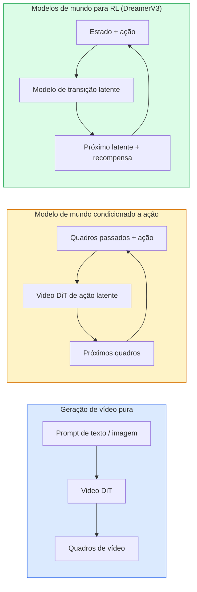

# World Models & Difusão de Vídeo

> Um modelo de vídeo que prevê os próximos segundos de uma cena é um simulador de mundo. Condicione essa predição a ações e você tem um motor de jogo aprendido.

**Tipo:** Aprender + Construir
**Linguagens:** Python
**Pré-requisitos:** Phase 4 Lesson 10 (Difusão), Phase 4 Lesson 12 (Compreensão de Vídeo), Phase 4 Lesson 23 (DiT + Rectified Flow)
**Tempo:** ~75 minutos

## Objetivos de Aprendizado

- Explicar a diferença entre um modelo de geração de vídeo puro (Sora 2) e um modelo de mundo condicionado a ação (Genie 3, DreamerV3)
- Descrever um video DiT: patches espaço-temporais, codificação de posição 3D, atenção conjunta sobre tokens (T, H, W)
- Traçar como um modelo de mundo se conecta à robótica: VLM planeja → modelo de vídeo simula → dinâmica inversa emite ações
- Escolher entre Sora 2, Genie 3, Runway GWM-1 Worlds, Wan-Video e HunyuanVideo para um dado caso de uso (vídeo criativo, simulador interativo, síntese de direção autônoma)

## O Problema

Geração de vídeo e modelagem de mundo convergiram em 2026. Um modelo que pode gerar um minuto coerente de vídeo aprendeu, em algum sentido, como o mundo se move: permanência de objeto, gravidade, causalidade, estilo. Se você condicionar essa predição a ações (andar para a esquerda, abrir a porta), o modelo de vídeo se torna um simulador aprendível que pode substituir um motor de jogo, um simulador de direção ou um ambiente de robótica.

Os riscos são concretos. Genie 3 gera ambientes jogáveis a partir de uma única imagem. Runway GWM-1 Worlds sintetiza cenas exploráveis infinitas. Sora 2 produz vídeos de um minuto com áudio sincronizado e física modelada. NVIDIA Cosmos-Drive, Wayve Gaia-2 e Tesla DrivingWorld geram vídeo de direção realista para dados de treinamento de veículos autônomos. O paradigma de modelo de mundo está silenciosamente assumindo o sim-to-real para robótica.

Esta lição é a lição de "visão geral" para a Fase 4. Ela conecta geração de imagens, compreensão de vídeo e raciocínio agentivo no padrão de arquitetura para o qual a pesquisa dominante está se movendo.

## O Conceito

### Três famílias de modelagem de mundo



- **Sora 2** é geração de vídeo pura condicionada a prompts. Sem interface de ação. Você não pode "dirigi-lo" no meio da geração.
- **Genie 3**, **GWM-1 Worlds**, **Mirage / Magica** são modelos de mundo condicionados a ação. Inferem ações latentes a partir de vídeo observado, então condicionam predições de quadros futuros em ações. Interativos — você pressiona teclas ou move uma câmera e a cena responde.
- **DreamerV3** e a família clássica de modelos de mundo RL predizem em um espaço latente com condicionamento explícito de ação, treinados em um sinal de recompensa. Menos visual; mais útil para RL eficiente em amostras.

### Arquitetura Video DiT

```
Latente de vídeo:          (C, T, H, W)
Patchify (espacial):       grade de patches P_h x P_w por quadro
Patchify (temporal):       agrupar P_t quadros em um patch temporal
Tokens resultantes:        (T / P_t) * (H / P_h) * (W / P_w) tokens
```

A codificação posicional é 3D: um embedding rotativo ou aprendido por coordenada (t, h, w). A atenção pode ser:

- **Joint total** — todos os tokens atendem todos os tokens. O(N^2) com N tokens. Proibitivo para vídeos longos.
- **Dividida** — alterna atenção temporal (mesma posição espacial, através do tempo: `(H*W) * T^2`) e atenção espacial (mesmo timestep, através do espaço: `T * (H*W)^2`). Usada pelo TimeSformer e pela maioria dos video DiTs.
- **Janela** — janelas locais em (t, h, w). Usada pelo Video Swin.

Todo modelo de difusão de vídeo de 2026 usa um destes três padrões mais condicionamento AdaLN (Lição 23) e rectified flow.

### Condicionamento em ações: modelos de ação latente

Genie aprende uma **ação latente** por quadro prevendo discriminativamente a ação entre um par de quadros consecutivos. O decodificador do modelo então condiciona na ação latente inferida — não em teclas explícitas. Na inferência, um usuário pode especificar uma ação latente (ou amostrar uma de um prior fresco) e o modelo gera o próximo quadro consistente com essa ação.

Sora pula a interface de ação completamente. Seu decodificador prevê próximos tokens espaço-temporais a partir de tokens espaço-temporais passados. O prompt condiciona o início; nada o dirige no meio da geração.

### Plausibilidade física

O lançamento de 2026 do Sora 2 anunciou explicitamente **plausibilidade física**: peso, equilíbrio, permanência de objeto, causa-e-efeito. Medido pela equipe via pontuações de plausibilidade avaliadas manualmente; o modelo melhora visivelmente em objetos derrubados, personagens colidindo e falhas propositais (um pulo perdido) versus Sora 1.

A plausibilidade continua sendo o modo de falha dominante. Vídeos de 2024-2025 de pessoas comendo espaguete ou bebendo de copos revelaram a falta de representação persistente de objeto do modelo. Modelos de 2026 (Sora 2, Runway Gen-5, HunyuanVideo) reduzem mas não eliminam estes.

### Modelos de mundo para direção autônoma

Modelos de mundo de direção geram cenas de estrada realistas condicionadas a trajetórias, caixas delimitadoras ou mapas de navegação. Uso:

- **Cosmos-Drive-Dreams** (NVIDIA) — gera minutos de vídeo de direção para treinamento RL.
- **Gaia-2** (Wayve) — síntese de cena condicionada a trajetória para avaliação de política.
- **DrivingWorld** (Tesla) — simula clima variado, hora do dia, condições de tráfego.
- **Vista** (ByteDance) — síntese de cena de direção reativa.

Eles substituem a coleta cara de dados do mundo real para casos extremos — pedestre atravessando fora da faixa à noite, interseções congeladas, tipos de veículos incomuns — que de outra forma exigiriam milhões de milhas de direção.

### Stack de robótica: VLM + modelo de vídeo + dinâmica inversa

O loop de robótica emergente de três componentes:

1. **VLM** analisa o objetivo ("pegue o copo vermelho"), planeja uma sequência de ações de alto nível.
2. **Modelo de geração de vídeo** simula como seria executar cada ação — prevê observações N quadros à frente.
3. **Modelo de dinâmica inversa** extrai os comandos motores concretos que produziriam essas observações.

Isso substitui a modelagem de recompensa e a RL pesada em amostras. O modelo de mundo faz a imaginação; a dinâmica inversa fecha o loop na atuação. Genie Envisioner é uma instanciação; muitos grupos de pesquisa estão convergindo para esta estrutura.

### Avaliação

- **Qualidade visual** — FVD (Fréchet Video Distance), estudos de usuário.
- **Alinhamento com prompt** — CLIPScore por quadro, avaliação estilo VQA.
- **Plausibilidade física** — avaliada manualmente em um conjunto de benchmarks (benchmark interno do Sora 2, VBench).
- **Controlabilidade** (para modelos de mundo interativos) — consistência ação → observação; você pode voltar a um estado anterior?

### Panorama de modelos em 2026

| Modelo | Uso | Parâmetros | Saída | Licença |
|--------|-----|------------|-------|---------|
| Sora 2 | texto-para-vídeo, áudio | — | 1-min 1080p + áudio | API apenas |
| Runway Gen-5 | texto/imagem-para-vídeo | — | clipes de 10s | API |
| Runway GWM-1 Worlds | mundo interativo | — | rollout 3D infinito | API |
| Genie 3 | mundo interativo a partir de imagem | 11B+ | quadros jogáveis | preview de pesquisa |
| Wan-Video 2.1 | texto-para-vídeo aberto | 14B | clipes de alta qualidade | não-comercial |
| HunyuanVideo | texto-para-vídeo aberto | 13B | clipes de 10s | permissiva |
| Cosmos / Cosmos-Drive | simulação de direção autônoma | 7-14B | cenas de direção | NVIDIA open |
| Magica / Mirage 2 | motor de jogo nativo AI | — | mundos modificáveis | produto |

## Construa

### Passo 1: Patchify 3D para vídeo

```python
import torch
import torch.nn as nn


class VideoPatch3D(nn.Module):
    def __init__(self, in_channels=4, dim=64, patch_t=2, patch_h=2, patch_w=2):
        super().__init__()
        self.proj = nn.Conv3d(
            in_channels, dim,
            kernel_size=(patch_t, patch_h, patch_w),
            stride=(patch_t, patch_h, patch_w),
        )
        self.patch_t = patch_t
        self.patch_h = patch_h
        self.patch_w = patch_w

    def forward(self, x):
        # x: (N, C, T, H, W)
        x = self.proj(x)
        n, c, t, h, w = x.shape
        tokens = x.reshape(n, c, t * h * w).transpose(1, 2)
        return tokens, (t, h, w)
```

Uma conv 3D com stride igual ao kernel atua como o patchificador espaço-temporal. Grade `(T, H, W) -> (T/2, H/2, W/2)` de tokens.

### Passo 2: Codificação posicional rotativa 3D

Rotary Position Embeddings (RoPE) aplicados separadamente ao longo dos eixos `t`, `h`, `w`:

```python
def rope_3d(tokens, t_dim, h_dim, w_dim, grid):
    """
    tokens: (N, T*H*W, D)
    grid: (T, H, W) tamanhos
    t_dim + h_dim + w_dim == D
    """
    T, H, W = grid
    n, seq, d = tokens.shape
    if t_dim + h_dim + w_dim != d:
        raise ValueError(f"t_dim+h_dim+w_dim ({t_dim}+{h_dim}+{w_dim}) must equal D={d}")
    assert seq == T * H * W
    t_idx = torch.arange(T, device=tokens.device).repeat_interleave(H * W)
    h_idx = torch.arange(H, device=tokens.device).repeat_interleave(W).repeat(T)
    w_idx = torch.arange(W, device=tokens.device).repeat(T * H)
    # Simplificado: apenas escala canais por frequências. RoPE real rotaciona pares.
    freqs_t = torch.exp(-torch.log(torch.tensor(10000.0)) * torch.arange(t_dim // 2, device=tokens.device) / (t_dim // 2))
    freqs_h = torch.exp(-torch.log(torch.tensor(10000.0)) * torch.arange(h_dim // 2, device=tokens.device) / (h_dim // 2))
    freqs_w = torch.exp(-torch.log(torch.tensor(10000.0)) * torch.arange(w_dim // 2, device=tokens.device) / (w_dim // 2))
    emb_t = torch.cat([torch.sin(t_idx[:, None] * freqs_t), torch.cos(t_idx[:, None] * freqs_t)], dim=-1)
    emb_h = torch.cat([torch.sin(h_idx[:, None] * freqs_h), torch.cos(h_idx[:, None] * freqs_h)], dim=-1)
    emb_w = torch.cat([torch.sin(w_idx[:, None] * freqs_w), torch.cos(w_idx[:, None] * freqs_w)], dim=-1)
    return tokens + torch.cat([emb_t, emb_h, emb_w], dim=-1)
```

Forma aditiva simplificada. RoPE real rotaciona canais pareados em frequências; a informação posicional é a mesma.

### Passo 3: Bloco de atenção dividida

```python
class BlocoAtencaoDividida(nn.Module):
    def __init__(self, dim=64, heads=2):
        super().__init__()
        self.time_attn = nn.MultiheadAttention(dim, heads, batch_first=True)
        self.space_attn = nn.MultiheadAttention(dim, heads, batch_first=True)
        self.ln1 = nn.LayerNorm(dim)
        self.ln2 = nn.LayerNorm(dim)
        self.ln3 = nn.LayerNorm(dim)
        self.mlp = nn.Sequential(nn.Linear(dim, 4 * dim), nn.GELU(), nn.Linear(4 * dim, dim))

    def forward(self, x, grid):
        T, H, W = grid
        n, seq, d = x.shape
        # atenção temporal: mesma (h, w), através de t
        xt = x.view(n, T, H * W, d).permute(0, 2, 1, 3).reshape(n * H * W, T, d)
        a, _ = self.time_attn(self.ln1(xt), self.ln1(xt), self.ln1(xt), need_weights=False)
        xt = (xt + a).reshape(n, H * W, T, d).permute(0, 2, 1, 3).reshape(n, seq, d)
        # atenção espacial: mesmo t, através de (h, w)
        xs = xt.view(n, T, H * W, d).reshape(n * T, H * W, d)
        a, _ = self.space_attn(self.ln2(xs), self.ln2(xs), self.ln2(xs), need_weights=False)
        xs = (xs + a).reshape(n, T, H * W, d).reshape(n, seq, d)
        xs = xs + self.mlp(self.ln3(xs))
        return xs
```

A atenção temporal atende dentro de cada posição espacial através do tempo; a atenção espacial atende dentro de cada quadro através das posições. Duas operações O(T^2 + (HW)^2) em vez de uma O((THW)^2). Este é o núcleo do TimeSformer e de todo video DiT moderno.

### Passo 4: Compor um video DiT minúsculo

```python
class TinyVideoDiT(nn.Module):
    def __init__(self, in_channels=4, dim=64, depth=2, heads=2):
        super().__init__()
        self.patch = VideoPatch3D(in_channels=in_channels, dim=dim, patch_t=2, patch_h=2, patch_w=2)
        self.blocks = nn.ModuleList([BlocoAtencaoDividida(dim, heads) for _ in range(depth)])
        self.out = nn.Linear(dim, in_channels * 2 * 2 * 2)

    def forward(self, x):
        tokens, grid = self.patch(x)
        for blk in self.blocks:
            tokens = blk(tokens, grid)
        return self.out(tokens), grid
```

Não é um gerador de vídeo funcional; uma demonstração estrutural de que cada peça se molda corretamente.

### Passo 5: Verificar formas

```python
vid = torch.randn(1, 4, 8, 16, 16)  # (N, C, T, H, W)
model = TinyVideoDiT()
out, grid = model(vid)
print(f"entrada  {tuple(vid.shape)}")
print(f"grade de tokens {grid}")
print(f"saída {tuple(out.shape)}")
```

Espere `grid = (4, 8, 8)` e `out = (1, 256, 32)` após o patchify; a cabeça então projeta para patches espaço-temporais por token, prontos para ser despatchificados de volta para um vídeo.

## Use

Padrões de acesso de produção para 2026:

- **API Sora 2** (OpenAI) — texto-para-vídeo, áudio sincronizado. Preço premium.
- **Runway Gen-5 / GWM-1** (Runway) — imagem-para-vídeo, mundos interativos.
- **Wan-Video 2.1 / HunyuanVideo** — autohospedado de código aberto.
- **Cosmos / Cosmos-Drive** (NVIDIA) — pesos abertos de simulação de direção.
- **Genie 3** — preview de pesquisa, solicite acesso.

Para construir uma demo de modelo de mundo interativo: comece com Wan-Video para qualidade, coloque uma camada de adaptador de ação latente para interatividade. Para simulação de direção autônoma: Cosmos-Drive é a referência aberta de 2026.

Para robótica, o stack na prática:

1. Objetivo em linguagem -> VLM (Qwen3-VL) -> plano de alto nível.
2. Plano -> modelo de vídeo de ação latente -> rollout imaginado.
3. Rollout -> modelo de dinâmica inversa -> ações de baixo nível.
4. Ações executadas -> observação realimentada ao passo 1.

## Entregue

Esta lição produz:

- `outputs/prompt-video-model-picker.md` — escolhe entre Sora 2 / Runway / Wan / HunyuanVideo / Cosmos dada tarefa, licença e latência.
- `outputs/skill-physical-plausibility-checks.md` — uma skill que define verificações automatizadas (permanência de objeto, gravidade, continuidade) para executar em qualquer vídeo gerado antes de enviar.

## Exercícios

1. **(Fácil)** Compute a contagem de tokens para um vídeo de 5 segundos a 360p com patch-t=2, patch-h=8, patch-w=8. Raciocine sobre a memória para atenção neste tamanho.
2. **(Médio)** Troque o bloco de atenção dividida acima por um bloco de atenção joint total e meça a forma e a contagem de parâmetros. Explique por que a atenção dividida é necessária para modelos de vídeo reais.
3. **(Difícil)** Construa um modelo de vídeo de ação latente mínimo: pegue um dataset de triplas (quadro_t, ação_t, quadro_{t+1}) (qualquer jogo 2D simples), treine um video DiT minúsculo condicionado a embeddings de ação, e mostre que diferentes ações produzem diferentes próximos quadros.

## Termos-Chave

| Termo | O que as pessoas dizem | O que realmente significa |
|-------|------------------------|---------------------------|
| Modelo de mundo | "Simulador aprendido" | Um modelo que prevê observações futuras dado estado e ação |
| Video DiT | "Transformer espaço-tempo" | Diffusion transformer com patchificação 3D e atenção dividida |
| Ação latente | "Controle inferido" | Latente de ação discreto ou contínuo inferido de pares de quadros; usado para condicionar geração do próximo quadro |
| Atenção dividida | "Tempo então espaço" | Duas operações de atenção por bloco — através do tempo, depois através do espaço — para manter O(N^2) gerenciável |
| Permanência de objeto | "Coisas permanecem reais" | Propriedade de cena que modelos de vídeo devem aprender; modo de falha clássico em comida, vidraria |
| FVD | "Fréchet Video Distance" | Equivalente de vídeo do FID; métrica primária de qualidade visual |
| Modelo de dinâmica inversa | "Observações para ações" | Dado (estado, próximo estado), produza a ação que os conecta; fecha o loop de robótica |
| Cosmos-Drive | "Simulador de direção NVIDIA" | Modelo de mundo de direção autônoma de pesos abertos para RL e avaliação |

## Leitura Complementar

- [Sora technical report (OpenAI)](https://openai.com/index/video-generation-models-as-world-simulators/)
- [Genie: Generative Interactive Environments (Bruce et al., 2024)](https://arxiv.org/abs/2402.15391) — modelos de mundo de ação latente
- [TimeSformer (Bertasius et al., 2021)](https://arxiv.org/abs/2102.05095) — atenção dividida para transformers de vídeo
- [DreamerV3 (Hafner et al., 2023)](https://arxiv.org/abs/2301.04104) — modelos de mundo para RL
- [Cosmos-Drive-Dreams (NVIDIA, 2025)](https://research.nvidia.com/labs/toronto-ai/cosmos-drive-dreams/) — modelo de mundo de direção
- [Top 10 Video Generation Models 2026 (DataCamp)](https://www.datacamp.com/blog/top-video-generation-models)
- [From Video Generation to World Model — survey repo](https://github.com/ziqihuangg/Awesome-From-Video-Generation-to-World-Model/)
