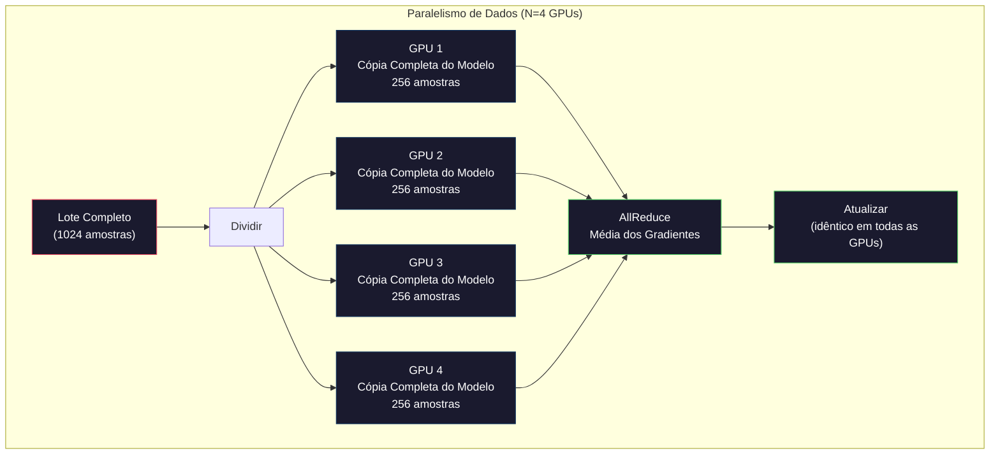
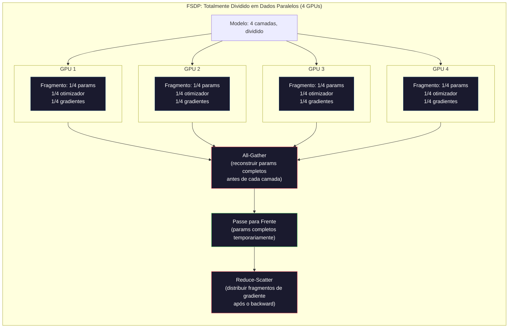
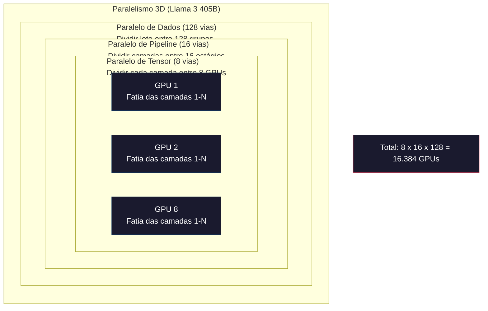

# Escalando: Treinamento Distribuído, FSDP, DeepSpeed

> Seu modelo de 124M treinou em uma GPU. Agora tente 7 bilhões de parâmetros. O modelo não cabe na memória. Os dados levam semanas em uma única máquina. Treinamento distribuído não é opcional em escala. É o único caminho.

**Tipo:** Construção
**Linguagens:** Python
**Pré-requisitos:** Fase 10, Lição 04 (Pré-Treinamento de um Mini GPT)
**Tempo:** ~120 minutos

## Objetivos de Aprendizado

- Explicar os três tipos de paralelismo (dados, tensor, pipeline) e quando cada um é necessário com base no tamanho do modelo e do cluster
- Implementar treinamento com paralelismo de dados usando PyTorch DDP com sincronização de gradientes entre múltiplas GPUs
- Calcular o orçamento de memória para um dado tamanho de modelo (pesos + estados do otimizador + gradientes + ativações) para determinar o hardware mínimo
- Configurar FSDP ou estágios ZeRO do DeepSpeed para dividir estados do modelo entre GPUs e ajustar modelos que excedem a memória de uma única GPU

## O Problema

Um modelo de 7B parâmetros em FP16 precisa de 14GB só para os pesos. O otimizador Adam armazena duas cópias adicionais de cada parâmetro (estimativas de primeiro e segundo momento). Isso são mais 28GB. Os gradientes durante a retropropagação adicionam mais 14GB. Você está em 56GB antes de armazenar uma única ativação.

Uma NVIDIA A100 tem 80GB de memória.

56GB de 80GB consumidos. Sobram 24GB para ativações — os valores intermediários calculados durante o passe para frente que precisam ser mantidos para a retropropagação. Para uma sequência de 2048 tokens com um modelo de dimensão 4096, as ativações de uma única camada usam cerca de 64MB. Com 32 camadas, você precisa de 2GB por amostra. Um tamanho de lote de 8 requer 16GB. Você tem 24GB. Um tamanho de lote de 12 explode.

Agora tente 70B parâmetros. Só os pesos: 140GB em FP16. Não cabe em uma GPU. Você precisa de pelo menos 2 A100s (2 x 80GB = 160GB) só para segurar os pesos. Adicione estados do otimizador e gradientes e você precisa de muito mais: 3+ GPUs no mínimo, e realisticamente 8-16 dependendo da estratégia de divisão.

O Llama 3 405B foi treinado em 16.384 NVIDIA H100 GPUs. A execução do treinamento custou estimadamente US$ 100 milhões em computação. O DeepSeek V3 treinou um modelo comparável por cerca de US$ 5,6 milhões sendo esperto na arquitetura (Mixture of Experts significa que apenas uma fração dos parâmetros ativa por token) e eficiência de treinamento.

Esta lição cobre as quatro estratégias que tornam o treinamento em larga escala possível: paralelismo de dados, paralelismo de tensor, paralelismo de pipeline e paralelismo de dados totalmente dividido. Você vai simular cada uma em Python puro para entender a mecânica antes de tocar em um framework de treinamento distribuído.

## O Conceito

### Por que a Distribuição é Necessária

Aqui está a matemática de memória para modelos reais. Cada número é calculado, não estimado.

| Modelo | Params | Pesos (FP16) | Estados Adam | Gradientes (FP16) | Total (sem ativações) |
|--------|--------|--------------|--------------|-------------------|----------------------|
| GPT-2 Small | 124M | 248 MB | 992 MB | 248 MB | 1,5 GB |
| Llama 3 8B | 8B | 16 GB | 64 GB | 16 GB | 96 GB |
| Llama 3 70B | 70B | 140 GB | 560 GB | 140 GB | 840 GB |
| Llama 3 405B | 405B | 810 GB | 3.240 GB | 810 GB | 4.860 GB |

A coluna "Estados Adam" é a assassina. Adam armazena uma média móvel (m) e uma variância móvel (v) para cada parâmetro, ambos em FP32. Para um modelo de 70B, isso é 70B x 4 bytes x 2 = 560GB. Só o otimizador precisa de sete A100s.

Um único H100 tem 80GB. O Llama 3 405B precisa de pelo menos 61 H100s para segurar os pesos, otimizador e gradientes. Adicione ativações e o número cresce mais ainda. A Meta usou 16.384 GPUs não porque queria — porque precisava.

### Paralelismo de Dados

A estratégia distribuída mais simples. Copie o modelo inteiro para N GPUs. Divida cada lote de treinamento em N partes iguais. Cada GPU executa um passe para frente e para trás em sua parte dos dados. Após o passe para trás, faça a média dos gradientes entre todas as GPUs. Cada GPU atualiza sua cópia dos pesos com os mesmos gradientes médios, mantendo todas as cópias sincronizadas.

**O bom:** Escalabilidade linear de throughput. N GPUs processam N vezes mais dados por passo. A comunicação é limitada à média dos gradientes, que se sobrepõe ao cálculo.

**O ruim:** Cada GPU mantém uma cópia completa do modelo, estados do otimizador e gradientes. Para um modelo de 70B, cada GPU precisa de 840GB. O paralelismo de dados não faz nada para reduzir a memória por GPU. Ele só reduz o tempo de treinamento.

**A matemática:** Tamanho efetivo do lote = tamanho_do_lote_por_gpu x N. Para N=64 GPUs com lote por GPU de 16, o lote efetivo é 1.024. O Llama 3 usou um tamanho de lote efetivo de 16 milhões de tokens por passo.



### Paralelismo de Tensor

Divida camadas individuais entre GPUs. Uma única multiplicação de matrizes é dividida entre GPUs, cada uma calculando parte do resultado.

Considere uma matriz de pesos de formato (8192, 8192) em uma camada feedforward. Com paralelismo de tensor de 4 vias, cada GPU segura um fragmento de (8192, 2048). Cada GPU multiplica a entrada pelo seu fragmento, produzindo um resultado parcial. Os resultados parciais são combinados (via all-reduce ou all-gather) para produzir a saída completa.

**O bom:** Reduz a memória por GPU para os pesos do modelo. Um modelo de 70B dividido entre 8 GPUs significa que cada GPU segura ~8,75B parâmetros em pesos.

**O ruim:** Requer comunicação rápida entre GPUs após cada camada. O all-reduce após cada matmul adiciona latência. Isso funciona bem com NVLink (900 GB/s entre GPUs no mesmo nó) mas mal entre nós conectados por InfiniBand (400 Gb/s, cerca de 50 GB/s). O paralelismo de tensor é quase sempre limitado a um único nó (8 GPUs).

**Uso real:** Megatron-LM foi pioneiro no paralelismo de tensor. Llama 3 405B usa paralelismo de tensor de 8 vias dentro de cada nó.

### Paralelismo de Pipeline

Divida o modelo por camadas. GPU 1 executa camadas 1-8. GPU 2 executa camadas 9-16. GPU 3 executa camadas 17-24. GPU 4 executa camadas 25-32. Os dados fluem pelo pipeline: GPU 1 calcula suas camadas e envia ativações para GPU 2, que calcula suas camadas e envia para GPU 3, e assim por diante.

**O bom:** Comunicação mínima entre GPUs — apenas as ativações nos limites das camadas, que são pequenas comparadas a gradientes ou pesos. Funciona entre nós porque os requisitos de largura de banda são baixos.

**O ruim:** Bolhas no pipeline. Quando a GPU 4 está calculando o passe para frente no micro-lote 1, as GPUs 1, 2 e 3 estão ociosas (já enviaram suas porções). Durante o passe para trás, o padrão se inverte. Com pipeline ingênuo, a utilização da GPU é de apenas 1/N para N estágios de pipeline.

**GPipe e PipeDream** resolvem o problema das bolhas dividindo o lote em micro-lotes. A GPU 1 começa no micro-lote 2 assim que termina de enviar o micro-lote 1. Isso sobrepõe o cálculo entre os estágios do pipeline. Com M micro-lotes e N estágios, a fração de bolha cai para (N-1)/M. Use M=16 micro-lotes com N=4 estágios e a bolha é 3/16 = 18,75% de tempo ocioso.

### FSDP: Totalmente Dividido em Dados Paralelos

FSDP combina a escalabilidade do paralelismo de dados com a eficiência de memória da divisão. Em vez de cada GPU ter uma cópia completa do modelo, cada GPU segura apenas 1/N dos parâmetros, gradientes e estados do otimizador.

Antes do passe para frente de uma camada, o FSDP executa um **all-gather** para coletar os parâmetros completos de todas as GPUs na memória de cada GPU. Após o passe para frente, cada GPU descarta os parâmetros não locais. Durante o passe para trás, o all-gather roda novamente para reconstruir os parâmetros para o cálculo do gradiente. Após o passe para trás, um **reduce-scatter** distribui fragmentos de gradiente para que cada GPU armazene apenas 1/N dos gradientes.

**A matemática para um modelo de 70B em 8 GPUs:**

| Componente | Sem FSDP | Com FSDP |
|-----------|----------|----------|
| Pesos (FP16) | 140 GB por GPU | 17,5 GB por GPU |
| Estados Adam (FP32) | 560 GB por GPU | 70 GB por GPU |
| Gradientes (FP16) | 140 GB por GPU | 17,5 GB por GPU |
| **Total** | **840 GB por GPU** | **105 GB por GPU** |

Sem FSDP, você não consegue encaixar um modelo de 70B em uma única GPU de 80GB. Com FSDP em 8 GPUs, cada GPU usa 105GB — espera, ainda não cabe. Você precisa de pelo menos 16 GPUs para ficar abaixo de 80GB por GPU, ou combinar FSDP com checkpoint de ativação (recalcular ativações durante o passe para trás em vez de armazená-las).

O custo de comunicação é maior que o paralelismo de dados comum por causa do all-gather antes de cada camada. Mas a economia de memória torna possíveis execuções de treinamento antes impossíveis.



### DeepSpeed ZeRO

O ZeRO (Zero Redundancy Optimizer) do DeepSpeed é conceitualmente idêntico ao FSDP, mas foi desenvolvido independentemente pela Microsoft. Ele define três estágios, cada um dividindo mais agressivamente:

| Estágio | Divide | Economia de Memória | Comunicação |
|---------|--------|-------------------|-------------|
| ZeRO-1 | Estados do otimizador apenas | ~4x de redução | Igual ao paralelo de dados |
| ZeRO-2 | + Gradientes | ~8x de redução | Um pouco mais |
| ZeRO-3 | + Parâmetros | ~Nx de redução (N GPUs) | All-gather por camada |

ZeRO-3 é equivalente ao FSDP. O nome é diferente, o mecanismo é o mesmo. O PyTorch adicionou o FSDP como uma implementação nativa depois que o DeepSpeed provou o conceito.

O DeepSpeed também introduziu ZeRO-Offload (descarregar estados do otimizador para a RAM da CPU, que é mais barata e maior) e ZeRO-Infinity (descarregar para SSDs NVMe). Eles trocam velocidade de computação por capacidade de memória — as operações descarregadas são mais lentas mas liberam memória da GPU.

### Treinamento de Precisão Mista

O treinamento moderno usa múltiplos formatos de ponto flutuante simultaneamente:

- **Passe para frente**: FP16 ou BF16 (16 bits). Metade da memória do FP32. Matmuls rodam 2x mais rápido nos tensor cores.
- **Pesos mestre**: FP32 (32 bits). Mantidos pelo otimizador para precisão numérica durante as atualizações de peso.
- **Escalonamento de perda**: Multiplique a perda por uma grande constante antes do passe para trás para evitar que gradientes FP16 underflowem a zero. Divida pela mesma constante antes do passo do otimizador.

BF16 (Brain Float 16) tem a mesma faixa de expoente que FP32 (8 bits de expoente) mas precisão reduzida (7 bits de mantissa vs 23 do FP32). Raramente precisa de escalonamento de perda porque consegue representar a mesma faixa de valores. FP16 tem 5 bits de expoente e 10 bits de mantissa — consegue representar valores de granularidade fina mas overflow/underflow em magnitudes extremas.

Os TPUs do Google usam BF16 nativamente. As NVIDIA A100 e H100 suportam tanto FP16 quanto BF16. A indústria mudou em grande parte para BF16 porque elimina as dores de cabeça com escalonamento de perda.

**Comparação de memória para um modelo de 7B:**

| Precisão | Pesos | Otimizador | Gradientes | Total |
|----------|-------|------------|------------|-------|
| FP32 em tudo | 28 GB | 56 GB | 28 GB | 112 GB |
| Mista (BF16 + FP32 mestre) | 14 GB | 56 GB | 14 GB | 84 GB |

Precisão mista economiza 28GB neste modelo. Os estados do otimizador permanecem em FP32 independentemente — é para lá que vai a maior parte da memória.

### Megatron-LM e Paralelismo 3D

O treinamento real em larga escala combina todos os três paralelismos:

- **Paralelismo de dados** entre grupos de nós (escalar tamanho do lote)
- **Paralelismo de tensor** dentro de um nó (dividir camadas entre 8 GPUs)
- **Paralelismo de pipeline** entre nós (dividir grupos de camadas entre máquinas)

Llama 3 405B em 16.384 H100s:
- Paralelismo de tensor de 8 vias dentro de cada nó (8 GPUs por nó)
- Paralelismo de pipeline de 16 vias entre nós (16 estágios de pipeline)
- Paralelismo de dados de 128 vias na dimensão restante (16.384 / 8 / 16 = 128)

Esta decomposição 3D (8 x 16 x 128 = 16.384) é como você escala para milhares de GPUs. Cada GPU vê um fragmento de dados diferente (paralelo de dados), segura uma fatia de cada camada (paralelo de tensor) e calcula um conjunto diferente de camadas (paralelo de pipeline).

O DeepSeek V3 seguiu uma abordagem diferente. Sua arquitetura Mixture of Experts ativa apenas 37B de 671B parâmetros por token. Isso significa que cada GPU só precisa calcular (e armazenar ativações para) os parâmetros ativos. Eles treinaram em 2.048 H800 GPUs — menos de 1/8 da contagem de GPUs da Meta — por US$ 5,6M vs os estimados US$ 100M da Meta.



## Construa

### Passo 1: Simular Paralelismo de Dados

Divida um lote entre GPUs simuladas. Cada GPU calcula um passe para frente em seu fragmento, então tiramos a média dos gradientes (simulando o all-reduce).

```python
import numpy as np

def simulate_data_parallelism(data, num_gpus, model_fn):
    total_samples = len(data)
    shard_size = total_samples // num_gpus
    remainder = total_samples % num_gpus

    gpu_losses = []
    gpu_gradients = []

    offset = 0
    for gpu_id in range(num_gpus):
        extra = 1 if gpu_id < remainder else 0
        shard = data[offset:offset + shard_size + extra]
        offset += shard_size + extra

        loss, grad = model_fn(shard)
        gpu_losses.append(loss)
        gpu_gradients.append(grad)

    avg_loss = np.mean(gpu_losses)
    avg_gradient = np.mean(gpu_gradients, axis=0)

    return avg_loss, avg_gradient
```

A operação all-reduce (média dos gradientes) é a única comunicação no paralelismo de dados. Na prática, isso usa a biblioteca NCCL em GPUs NVIDIA, que implementa ring all-reduce: cada GPU envia 1/N de seus gradientes para sua vizinha, recebe 1/N da outra vizinha, e após N-1 passos cada GPU tem a média completa. Volume total de comunicação: 2 x tamanho_do_gradiente x (N-1)/N, aproximando-se de 2x o tamanho do gradiente para N grande.

### Passo 2: Simular Paralelismo de Tensor

Divida uma matriz de pesos entre GPUs. Cada GPU calcula uma multiplicação de matrizes parcial. Combine os resultados.

```python
def simulate_tensor_parallelism(input_data, weight_matrix, num_gpus):
    d_in, d_out = weight_matrix.shape
    assert d_out % num_gpus == 0, f"d_out {d_out} não divisível por num_gpus {num_gpus}"
    shard_size = d_out // num_gpus

    partial_results = []
    for gpu_id in range(num_gpus):
        start = gpu_id * shard_size
        end = start + shard_size
        weight_shard = weight_matrix[:, start:end]

        partial = input_data @ weight_shard
        partial_results.append(partial)

    full_output = np.concatenate(partial_results, axis=-1)

    direct_output = input_data @ weight_matrix
    error = np.abs(full_output - direct_output).max()

    return full_output, error
```

O erro deve ser exatamente zero (ou epsilon de máquina). O paralelismo de tensor é matematicamente exato — produz o mesmo resultado que calcular o matmul completo em uma GPU. A divisão é ao longo da dimensão de saída, então cada GPU produz um pedaço diferente de colunas, e a concatenação reconstrói o resultado completo.

Para camadas lineares paralelas por coluna (dividindo a dimensão de saída), você concatena. Para paralelas por linha (dividindo a dimensão de entrada), você soma. Em uma FFN de transformer, a primeira linear (expandir) usa paralelo por coluna e a segunda linear (contrair) usa paralelo por linha. Isso evita um all-reduce entre as duas camadas.

### Passo 3: Simular Paralelismo de Pipeline

Divida as camadas de um modelo entre GPUs virtuais. Mostre o problema da bolha onde estágios iniciais ficam ociosos enquanto estágios posteriores calculam.

```python
def simulate_pipeline_parallelism(num_layers, num_stages, num_microbatches):
    layers_per_stage = num_layers // num_stages

    timeline = {}
    clock = 0

    for mb in range(num_microbatches):
        for stage in range(num_stages):
            start_time = max(
                timeline.get((stage, mb - 1, "fwd"), (0, 0))[1] if mb > 0 else 0,
                timeline.get((stage - 1, mb, "fwd"), (0, 0))[1] if stage > 0 else 0,
            )
            end_time = start_time + layers_per_stage
            timeline[(stage, mb, "fwd")] = (start_time, end_time)

    last_fwd_end = max(v[1] for v in timeline.values())

    for mb in range(num_microbatches - 1, -1, -1):
        for stage in range(num_stages - 1, -1, -1):
            deps = [last_fwd_end]
            if mb < num_microbatches - 1 and (stage, mb + 1, "bwd") in timeline:
                deps.append(timeline[(stage, mb + 1, "bwd")][1])
            if stage < num_stages - 1 and (stage + 1, mb, "bwd") in timeline:
                deps.append(timeline[(stage + 1, mb, "bwd")][1])
            start_time = max(deps)
            end_time = start_time + layers_per_stage
            timeline[(stage, mb, "bwd")] = (start_time, end_time)

    total_time = max(v[1] for v in timeline.values())
    compute_time = num_microbatches * num_stages * layers_per_stage * 2
    bubble_fraction = 1.0 - compute_time / (total_time * num_stages)

    return timeline, total_time, bubble_fraction
```

Com 4 estágios e 1 micro-lote, a fração de bolha é 75% — três em cada quatro GPUs ociosas a qualquer momento. Com 16 micro-lotes, cai para cerca de 19%. O custo de eliminar bolhas é memória: você precisa armazenar ativações para todos os micro-lotes em voo simultaneamente.

### Passo 4: Calculadora de Memória

Calcule os requisitos exatos de memória para treinar qualquer tamanho de modelo.

```python
def memory_calculator(
    params_billions,
    precision_bytes=2,
    optimizer="adam",
    num_gpus=1,
    sharding="none",
    sequence_length=2048,
    batch_size_per_gpu=1,
    hidden_dim=None,
    num_layers=None,
):
    params = params_billions * 1e9

    weight_memory = params * precision_bytes

    if optimizer == "adam":
        optimizer_memory = params * 4 * 2
    elif optimizer == "sgd":
        optimizer_memory = params * 4
    else:
        optimizer_memory = 0

    gradient_memory = params * precision_bytes

    total_no_activation = weight_memory + optimizer_memory + gradient_memory

    if hidden_dim and num_layers:
        activation_per_layer = (
            sequence_length * batch_size_per_gpu * hidden_dim * precision_bytes * 4
        )
        activation_memory = activation_per_layer * num_layers
    else:
        activation_memory = params * precision_bytes * 0.5

    if sharding == "fsdp" or sharding == "zero3":
        weight_memory /= num_gpus
        optimizer_memory /= num_gpus
        gradient_memory /= num_gpus
    elif sharding == "zero2":
        optimizer_memory /= num_gpus
        gradient_memory /= num_gpus
    elif sharding == "zero1":
        optimizer_memory /= num_gpus

    per_gpu_total = weight_memory + optimizer_memory + gradient_memory + activation_memory

    return {
        "params_billions": params_billions,
        "weights_gb": weight_memory / 1e9,
        "optimizer_gb": optimizer_memory / 1e9,
        "gradients_gb": gradient_memory / 1e9,
        "activations_gb": activation_memory / 1e9,
        "per_gpu_total_gb": per_gpu_total / 1e9,
        "total_across_gpus_gb": per_gpu_total * num_gpus / 1e9,
        "fits_on_80gb": per_gpu_total / 1e9 <= 80,
        "num_gpus": num_gpus,
        "sharding": sharding,
    }
```

Esta calculadora responde à pergunta que todo engenheiro de ML faz: "De quantas GPUs eu preciso?" Alimente com o tamanho do modelo e veja se cabe. Ajuste a estratégia de divisão até o total por GPU cair abaixo de 80GB.

### Passo 5: Simulação de Precisão Mista

Compare o uso de memória entre treinamento FP32, FP16 e precisão mista.

```python
def mixed_precision_comparison(params_billions):
    params = params_billions * 1e9

    fp32_weights = params * 4
    fp32_optimizer = params * 4 * 2
    fp32_gradients = params * 4
    fp32_total = fp32_weights + fp32_optimizer + fp32_gradients

    fp16_weights = params * 2
    fp16_master = params * 4
    fp16_optimizer = params * 4 * 2
    fp16_gradients = params * 2
    fp16_total = fp16_weights + fp16_master + fp16_optimizer + fp16_gradients

    mixed_weights = params * 2
    mixed_optimizer = params * 4 * 2
    mixed_gradients = params * 2
    mixed_total = mixed_weights + mixed_optimizer + mixed_gradients

    return {
        "fp32_total_gb": fp32_total / 1e9,
        "fp16_with_master_gb": fp16_total / 1e9,
        "mixed_bf16_gb": mixed_total / 1e9,
        "savings_vs_fp32": 1 - mixed_total / fp32_total,
    }
```

A maior surpresa para a maioria das pessoas: precisão mista não reduz a memória pela metade. Os estados do otimizador (m e v do Adam) permanecem em FP32 independentemente da precisão. Para um modelo de 7B, treinamento FP32 usa 112GB. Precisão mista usa 84GB. Isso é uma redução de 25%, não 50%. O otimizador domina.

## Use

### Execute Todas as Simulações

```python
def run_all_demos():
    print("=" * 70)
    print("SIMULAÇÃO DE PARALELISMO DE DADOS")
    print("=" * 70)

    np.random.seed(42)
    data = np.random.randn(64, 32)
    weight = np.random.randn(32, 16)

    def model_fn(batch):
        output = batch @ weight
        loss = np.mean(output ** 2)
        grad = 2 * batch.T @ (batch @ weight) / len(batch)
        return loss, grad

    for n_gpus in [1, 2, 4, 8]:
        loss, grad = simulate_data_parallelism(data, n_gpus, model_fn)
        print(f"  {n_gpus} GPUs: loss={loss:.4f}, grad_norm={np.linalg.norm(grad):.4f}")

    print()
    print("=" * 70)
    print("SIMULAÇÃO DE PARALELISMO DE TENSOR")
    print("=" * 70)

    x = np.random.randn(4, 8192)
    W = np.random.randn(8192, 8192)

    for n_gpus in [1, 2, 4, 8]:
        output, error = simulate_tensor_parallelism(x, W, n_gpus)
        print(f"  {n_gpus} GPUs: output_shape={output.shape}, max_error={error:.2e}")

    print()
    print("=" * 70)
    print("SIMULAÇÃO DE PARALELISMO DE PIPELINE")
    print("=" * 70)

    for n_mb in [1, 4, 8, 16, 32]:
        _, total_t, bubble = simulate_pipeline_parallelism(32, 4, n_mb)
        print(f"  {n_mb:2d} micro-lotes: total_time={total_t:4d}, bubble={bubble:.1%}")

    print()
    print("=" * 70)
    print("CALCULADORA DE MEMÓRIA")
    print("=" * 70)

    configs = [
        (7, "none", 1),
        (7, "fsdp", 8),
        (70, "none", 1),
        (70, "fsdp", 8),
        (70, "fsdp", 16),
        (405, "fsdp", 64),
        (405, "fsdp", 128),
    ]

    print(f"  {'Modelo':>8} {'Divisão':>8} {'GPUs':>5} {'Por-GPU':>10} {'Cabe 80GB':>10}")
    print("  " + "-" * 50)
    for params, shard, gpus in configs:
        result = memory_calculator(params, num_gpus=gpus, sharding=shard)
        fits = "Sim" if result["fits_on_80gb"] else "Não"
        print(f"  {params:>6}B {shard:>8} {gpus:>5} {result['per_gpu_total_gb']:>8.1f}GB {fits:>10}")

    print()
    print("=" * 70)
    print("COMPARAÇÃO DE PRECISÃO MISTA")
    print("=" * 70)

    for params_b in [7, 13, 70, 405]:
        result = mixed_precision_comparison(params_b)
        print(f"  {params_b}B: FP32={result['fp32_total_gb']:.0f}GB, "
              f"Misto BF16={result['mixed_bf16_gb']:.0f}GB, "
              f"Economia={result['savings_vs_fp32']:.0%}")
```

## Entregue

Esta lição produz `outputs/prompt-distributed-training-planner.md` — um prompt que recebe um tamanho de modelo e hardware disponível, e produz um plano completo de treinamento distribuído: estratégia de paralelismo, orçamento de memória, sobrecarga de comunicação e throughput esperado.

## Exercícios

1. Modifique a calculadora de memória para incluir checkpoint de ativação. Com checkpointing, armazene apenas ativações a cada K-ésima camada (K=1 típico, significando recalcular tudo). Mostre a compensação memória-computação: quanta memória o checkpointing economiza, e quanto ele desacelera o treinamento (cerca de 33% mais computação para checkpointing completo)?

2. Estenda a simulação de paralelismo de pipeline para implementar o escalonamento 1F1B (um forward, um backward) usado pelo PipeDream. Compare a fração de bolha contra o escalonamento ingênuo para 4 estágios e 8 micro-lotes. O escalonamento 1F1B deve ter pico de memória menor porque começa os passes para trás mais cedo.

3. Implemente um simulador de acumulação de gradientes. Em vez de all-reduce após cada micro-lote, acumule gradientes localmente por K passos, depois faça all-reduce. Mostre como isso reduz a comunicação em K vezes mas produz gradientes finais idênticos (e portanto treinamento idêntico).

4. Construa um estimador de custos. Dado um tamanho de modelo, contagem alvo de tokens, tipo de GPU (A100 a $2/h, H100 a $3,50/h) e estratégia de paralelismo, estime o custo total de treinamento em dólares. Valide contra custos conhecidos: Llama 3 405B supostamente custou ~$100M, DeepSeek V3 custou ~$5,6M.

5. Adicione ZeRO-Offload à calculadora de memória. Assuma que a RAM da CPU é 512GB por nó e NVMe é 2TB. Mostre como descarregar estados do otimizador para a CPU permite que um modelo de 70B treine em 4 GPUs em vez de 16, ao custo de passos do otimizador 30-50% mais lentos.

## Termos-Chave

| Termo | O que dizem | O que realmente significa |
|-------|-------------|--------------------------|
| Paralelismo de dados | "Copiar o modelo para cada GPU" | Cada GPU processa um fragmento de dados diferente; gradientes são calculados em média via all-reduce após cada passo |
| Paralelismo de tensor | "Dividir uma camada entre GPUs" | Particionar matrizes de peso para que cada GPU calcule parte do matmul; requer interconexão NVLink rápida |
| Paralelismo de pipeline | "Dividir camadas entre GPUs" | Cada GPU executa um grupo diferente de camadas; dados fluem pelo pipeline com micro-lotes para reduzir bolhas |
| FSDP | "Dividir tudo" | Fully Sharded Data Parallel — cada GPU tem 1/N dos pesos, gradientes e estados do otimizador; all-gather antes de computar |
| ZeRO | "Versão do DeepSpeed do FSDP" | Zero Redundancy Optimizer com 3 estágios: dividir otimizador (Estágio 1), + gradientes (Estágio 2), + parâmetros (Estágio 3) |
| All-reduce | "Média entre GPUs" | Operação coletiva onde cada GPU termina com a soma (ou média) das entradas de todas as GPUs — tipicamente implementada como ring all-reduce |
| All-gather | "Coletar de todas as GPUs" | Operação coletiva onde cada GPU termina com a concatenação dos dados de todas as GPUs — usado no FSDP para reconstruir parâmetros completos |
| Reduce-scatter | "Somar e distribuir" | Operação coletiva que reduz (soma) dados e espalha diferentes pedaços para diferentes GPUs — usado no FSDP para divisão de gradientes |
| Precisão mista | "Treinar em meia precisão" | Usar FP16/BF16 para forward/backward e FP32 para estados do otimizador — economiza ~25% de memória, não 50%, porque o otimizador domina |
| Bolha de pipeline | "Tempo ocioso no pipeline" | Fração de tempo que as GPUs ficam ociosas esperando dados do estágio anterior — reduzida usando mais micro-lotes |

## Leitura Adicional

- [Rajbhandari et al., 2020 — "ZeRO: Memory Optimizations Toward Training Trillion Parameter Models"](https://arxiv.org/abs/1910.02054) — o paper do DeepSpeed ZeRO que definiu os três estágios de divisão
- [Shoeybi et al., 2020 — "Megatron-LM: Training Multi-Billion Parameter Language Models Using Model Parallelism"](https://arxiv.org/abs/1909.08053) — paralelismo de tensor da NVIDIA para transformers
- [Narayanan et al., 2021 — "Efficient Large-Scale Language Model Training on GPU Clusters Using Megatron-LM"](https://arxiv.org/abs/2104.04473) — paralelismo 3D combinando dados, tensor e pipeline
- [Zhao et al., 2023 — "PyTorch FSDP: Experiences on Scaling Fully Sharded Data Parallel"](https://arxiv.org/abs/2304.11277) — implementação FSDP nativa do PyTorch
- [Relatório Técnico do Llama 3](https://arxiv.org/abs/2407.21783) — treinamento com 16.384 GPUs com detalhes de paralelismo 3D
- [Relatório Técnico do DeepSeek-V3](https://arxiv.org/abs/2412.19437) — como a arquitetura MoE reduz o custo de treinamento por uma ordem de magnitude
