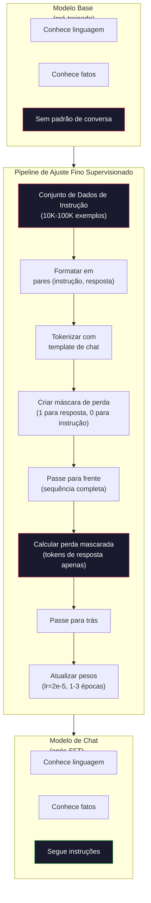

# Ajuste por Instrução (SFT)

> Um modelo base prevê o próximo token. Só isso. Ele não segue instruções, responde perguntas ou recusa pedidos prejudiciais. SFT é a ponte entre um preditor de tokens e um assistente útil. Todo modelo com o qual você já conversou — Claude, GPT, Llama Chat — passou por essa etapa.

**Tipo:** Construção
**Linguagens:** Python (com numpy)
**Pré-requisitos:** Fase 10, Lição 04 (Pré-Treinamento de um Mini GPT)
**Tempo:** ~90 minutos

## Objetivos de Aprendizado

- Implementar ajuste fino supervisionado (SFT) que converte um modelo de linguagem base em um assistente que segue instruções
- Formatar dados de treinamento usando templates de chat com papéis de sistema, usuário e assistente, e mascarar a perda em tokens que não são do assistente
- Explicar por que o SFT é necessário: modelos base continuam texto em vez de responder perguntas
- Avaliar a qualidade do SFT comparando respostas do modelo base vs modelo ajustado em um conjunto de instruções reservado

## O Problema

Você treinou um modelo na Lição 04. Ele consegue prever o próximo token dada uma sequência. Alimente com "A arquitetura transformer" e ele pode continuar com "revolucionou o processamento de linguagem natural." Isso é impressionante para um preditor de próximo token.

Agora tente isso: alimente com "Qual é a capital da França?" Um modelo base não responde "Paris." Ele continua o padrão. Pode produzir "Qual é a capital da Alemanha? Qual é a capital da Espanha?" porque aprendeu de documentos que contêm listas de perguntas. Ou pode produzir "é uma pergunta que muitas pessoas fazem" porque é uma continuação plausível para o próximo token. O modelo não tem conceito de *responder*. Ele só sabe *continuar*.

Essa é a diferença entre GPT-3 (modelo base, lançado em junho de 2020) e ChatGPT (ajustado por instrução, lançado em novembro de 2022). Mesma arquitetura. Mesmo pré-treinamento. A diferença são 20.000 a 100.000 pares (instrução, resposta) cuidadosamente elaborados que ensinaram o modelo a seguir o padrão de conversa.

O Stanford Alpaca provou que você não precisa de milhões de exemplos. Em março de 2023, eles ajustaram o Llama 7B em apenas 52.000 pares instrução-resposta gerados pelo GPT-3.5. Custo total: $600. O resultado foi um chatbot que conseguia seguir instruções, responder perguntas e manter conversas. Não tão bom quanto o ChatGPT, mas impressionantemente próximo por $600 e algumas horas de treinamento.

O Llama 2 Chat da Meta usou apenas ~27.000 exemplos de alta qualidade para seu estágio inicial de SFT. A ideia chave: qualidade importa mais que quantidade. 27.000 exemplos escritos por anotadores habilidosos vencem 1 milhão de exemplos ruidosos raspados da internet.

## O Conceito

### O Que o SFT Realmente Faz

O Ajuste Fino Supervisionado continua o mesmo loop de treinamento do pré-treinamento — passe para frente, calcular perda, passe para trás, atualizar pesos — mas em um tipo diferente de dado. Em vez de texto bruto, você treina em conversas estruturadas:

```json
{
  "system": "Você é um assistente útil.",
  "user": "Qual é a capital da França?",
  "assistant": "A capital da França é Paris."
}
```

O modelo já sabe que Paris é a capital da França. Ele aprendeu isso durante o pré-treinamento na Wikipedia, livros didáticos e páginas web. O SFT não ensina fatos novos ao modelo. Ele ensina um novo *comportamento*: quando você vê uma pergunta, produza uma resposta. Quando você vê uma instrução, produza uma conclusão. Quando você vê um pedido prejudicial, produza uma recusa.

Pense assim: o pré-treinamento dá conhecimento ao modelo. O SFT dá maneiras ao modelo.

### Formatos de Dados

Três formatos dominam a indústria. Cada um codifica a mesma informação — quem disse o quê — com delimitadores diferentes.

**Formato Alpaca** (Stanford, março de 2023):

```json
{
  "instruction": "Resuma o seguinte artigo em 3 frases.",
  "input": "O Banco Central Europeu aumentou as taxas de juros...",
  "output": "O BCE aumentou as taxas em 25 pontos base..."
}
```

Simples e amplamente usado. O campo `input` é opcional — muitas instruções não precisam de contexto adicional. Stanford lançou 52.000 exemplos neste formato, gerados pelo GPT-3.5 por $600. Isso deu início ao movimento de ajuste por instrução open-source.

**Formato ShareGPT** (comunidade, 2023):

```json
{
  "conversations": [
    {"from": "system", "value": "Você é um assistente útil."},
    {"from": "human", "value": "O que causa as marés?"},
    {"from": "gpt", "value": "As marés são causadas pela atração gravitacional da Lua..."},
    {"from": "human", "value": "Com que frequência elas ocorrem?"},
    {"from": "gpt", "value": "A maioria das áreas costeiras experimenta duas marés altas e duas baixas por dia..."}
  ]
}
```

Suporta conversas de múltiplos turnos. O campo "from" usa "human" e "gpt" por convenção, independentemente do modelo real. O Vicuna foi treinado em 70.000 conversas ShareGPT raspadas de transcrições de ChatGPT compartilhadas por usuários.

**Formato ChatML** (OpenAI, usado por muitos modelos open-source):

```
<|im_start|>system
Você é um assistente útil.<|im_end|>
<|im_start|>user
Qual é a capital da França?<|im_end|>
<|im_start|>assistant
A capital da França é Paris.<|im_end|>
```

Usa tokens especiais (`<|im_start|>`, `<|im_end|>`) para delimitar papéis. Esses tokens são adicionados ao vocabulário do tokenizer durante o ajuste fino. Qwen, Yi e muitos outros modelos usam ChatML.

Todos os três formatos alcançam a mesma coisa: dizem ao modelo "esta é a instrução, esta é a resposta, aprenda este padrão."

### Por Que Funciona

O modelo já conhece linguagem do pré-treinamento. Ele viu bilhões de exemplos de perguntas seguidas de respostas, instruções seguidas de conclusões e conversas entre pessoas. Os padrões já estão codificados nos pesos.

O SFT concentra essa habilidade latente. Em vez do modelo precisar descobrir pelo contexto se deve responder a uma pergunta ou continuar um documento, o SFT treina explicitamente no padrão de conversa. Após alguns milhares de exemplos, o modelo aprende: quando você vê o marcador de papel de assistente, produza uma resposta útil.

É por isso que 27.000 exemplos são suficientes. Você não está ensinando inglês ao modelo. Não está ensinando fatos sobre o mundo. Você está ensinando um comportamento simples: responder a instruções. O conhecimento já estava lá.

### A Perda Mascarada

Este é o detalhe técnico mais importante no SFT, e a maioria dos tutoriais pula ele.

Durante o pré-treinamento, você calcula a perda em cada token. O modelo aprende a prever cada próximo token na sequência. Durante o SFT, você só calcula a perda nos tokens de *resposta*. Os tokens de instrução estão lá para contexto, mas o modelo não é penalizado por "prevê-los" incorretamente.

Por quê? Porque você não quer que o modelo aprenda a *gerar* instruções. Você quer que ele aprenda a *responder a* instruções. Se você calcular a perda nos tokens de instrução, está treinando o modelo a prever "Qual é a capital da França?" como se fosse ele quem está perguntando. Isso desperdiça sinal de gradiente e pode confundir o modelo sobre seu papel.

Na prática, você cria uma máscara de perda: 1 para tokens de resposta, 0 para tokens de instrução. Multiplique a perda por token por esta máscara antes de calcular a média.

```
Tokens:    [SYS] Você é útil [USER] Qual é a capital? [ASST] Paris é a capital [EOS]
Máscara:   0    0    0     0      0     0   0  0     0       1     1    1   1     1      1
```

Apenas os tokens após `[ASST]` contribuem para a perda. O modelo vê a conversa completa durante o passe para frente (ele precisa da instrução para produzir a resposta correta) mas só atualiza seus pesos com base em quão bem previu a resposta.

### Hiperparâmetros de Treinamento

O SFT usa hiperparâmetros dramaticamente diferentes do pré-treinamento. Você não está treinando do zero. Está ajustando um modelo que já funciona.

| Parâmetro | Pré-Treinamento (Llama 2 7B) | SFT (Llama 2 Chat) |
|-----------|------------------------------|---------------------|
| Taxa de aprendizado | 3e-4 (pico) | 2e-5 |
| Épocas | 1 (passagem única) | 2 |
| Tamanho do lote | 4M tokens | 64 exemplos |
| Passos de aquecimento | 2.000 | 0-100 |
| Decaimento de peso | 0,1 | 0,0-0,1 |
| Tamanho dos dados | 2T tokens | 27.000 exemplos |

A taxa de aprendizado é 15x menor para SFT. Isso é crítico. Uma taxa de aprendizado alta durante o ajuste fino destrói o conhecimento pré-treinado. O modelo "esquece" o que aprendeu e superajusta ao pequeno conjunto de dados de ajuste fino. Isso é esquecimento catastrófico.

Duas épocas significa que o modelo vê cada exemplo de treinamento duas vezes. Mais de 3 épocas em um conjunto de dados pequeno leva à memorização — o modelo começa a reproduzir exemplos de treinamento literalmente em vez de generalizar.

### Esquecimento Catastrófico

O ajuste fino pode destruir capacidades gerais. Treine por muito tempo em dados de seguimento de instruções e o modelo perde sua capacidade de escrever código, fazer matemática ou produzir texto criativo. Ele fica muito bom no formato específico de seus dados de treinamento e péssimo em todo o resto.

Três mitigações:

1. **Taxa de aprendizado baixa.** 1e-5 a 5e-5. Atualizações menores significam menos destruição das características pré-treinadas.

2. **Treinamento curto.** 1-3 épocas. Pare antes que o modelo superajuste.

3. **Misture dados de pré-treinamento.** O Llama 2 Chat misturou uma pequena porcentagem (2-5%) de dados brutos de pré-treinamento no conjunto de dados SFT. Isso "lembra" o modelo de suas capacidades gerais enquanto aprende o novo comportamento de seguir instruções.

### Números Reais

Ajustar fino um modelo de 7B em 10.000 pares de instrução de alta qualidade leva aproximadamente 1 hora em uma única NVIDIA A100 80GB. Aqui está a matemática:

- 10.000 exemplos x 512 tokens em média = 5,12M tokens
- 2 épocas = 10,24M tokens no total
- Throughput da A100 para ajuste fino de modelo 7B: ~3.000 tokens/segundo
- 10,24M / 3.000 = ~3.400 segundos = ~57 minutos

Para nosso mini GPT (4 camadas, 128 dims), o treinamento é quase instantâneo. O objetivo é entender a mecânica, não a escala.



## Construa

### Passo 1: Conjunto de Dados de Instrução

Crie um conjunto de dados de instrução sintético. Em produção, empresas como Scale AI e Anthropic empregam anotadores humanos para escrever estes dados. Nós vamos criá-los programaticamente para demonstrar o formato.

```python
import numpy as np

INSTRUCTION_DATA = [
    {
        "instruction": "Qual é a capital da França?",
        "response": "A capital da França é Paris."
    },
    {
        "instruction": "Explique a gravidade em uma frase.",
        "response": "Gravidade é a força que atrai objetos com massa uns em direção aos outros."
    },
    {
        "instruction": "Escreva um haikai sobre o oceano.",
        "response": "Ondas quebram na areia, sal e espuma sob o sol, vasto azul sem fim."
    },
    {
        "instruction": "Quanto é 15 multiplicado por 7?",
        "response": "15 multiplicado por 7 é 105."
    },
    {
        "instruction": "Diga três linguagens de programação.",
        "response": "Três linguagens de programação são Python, Rust e TypeScript."
    },
    {
        "instruction": "Resuma a fotossíntese.",
        "response": "A fotossíntese converte luz solar, água e dióxido de carbono em glicose e oxigênio."
    },
    {
        "instruction": "Em que ano a Segunda Guerra Mundial terminou?",
        "response": "A Segunda Guerra Mundial terminou em 1945."
    },
    {
        "instruction": "Defina aprendizado de máquina.",
        "response": "Aprendizado de máquina é uma área onde algoritmos aprendem padrões a partir de dados para fazer previsões."
    },
]
```

Oito exemplos é minúsculo. Stanford Alpaca usou 52.000. Mas a mecânica é idêntica tenha você 8 ou 52.000: tokenizar, mascarar, calcular perda só nas respostas.

### Passo 2: Tokenizar com Template de Chat

Converta pares instrução-resposta em sequências de tokens com marcadores especiais de papel. Os marcadores dizem ao modelo onde a instrução termina e onde a resposta começa.

```python
SPECIAL_TOKENS = {
    "INST_START": 253,
    "INST_END": 254,
    "RESP_START": 255,
}


def tokenize_instruction_pair(instruction, response, vocab_size=256):
    inst_tokens = list(instruction.encode("utf-8"))
    resp_tokens = list(response.encode("utf-8"))

    inst_tokens = [min(t, vocab_size - 4) for t in inst_tokens]
    resp_tokens = [min(t, vocab_size - 4) for t in resp_tokens]

    tokens = (
        [SPECIAL_TOKENS["INST_START"]]
        + inst_tokens
        + [SPECIAL_TOKENS["INST_END"]]
        + [SPECIAL_TOKENS["RESP_START"]]
        + resp_tokens
    )

    return tokens


def create_loss_mask(tokens):
    mask = np.zeros(len(tokens), dtype=np.float32)
    in_response = False

    for i, token in enumerate(tokens):
        if token == SPECIAL_TOKENS["RESP_START"]:
            in_response = True
            continue
        if in_response:
            mask[i] = 1.0

    return mask
```

A máscara de perda é toda zeros para tokens de instrução e toda uns para tokens de resposta. O próprio token `RESP_START` recebe máscara 0 porque é um delimitador, não parte do conteúdo da resposta.

### Passo 3: Perda de Entropia Cruzada Mascarada

Entropia cruzada padrão, mas multiplicada pela máscara de perda. Apenas tokens de resposta contribuem para o gradiente.

```python
def masked_cross_entropy_loss(logits, targets, loss_mask):
    batch, seq_len, vocab_size = logits.shape
    logits_flat = logits.reshape(-1, vocab_size)
    targets_flat = targets.reshape(-1)
    mask_flat = loss_mask.reshape(-1)

    max_logits = logits_flat.max(axis=-1, keepdims=True)
    log_softmax = logits_flat - max_logits - np.log(
        np.exp(logits_flat - max_logits).sum(axis=-1, keepdims=True)
    )

    per_token_loss = -log_softmax[np.arange(len(targets_flat)), targets_flat]

    masked_loss = per_token_loss * mask_flat
    num_response_tokens = mask_flat.sum()
    if num_response_tokens == 0:
        return 0.0
    loss = masked_loss.sum() / num_response_tokens

    return loss
```

O denominador é `num_response_tokens`, não `seq_len`. Se você dividir pelo comprimento total da sequência, instruções mais longas diluem o sinal do gradiente. Dividir pela contagem de tokens de resposta garante peso igual por token de resposta independentemente do comprimento da instrução.

### Passo 4: Loop de Treinamento SFT

Reutilize o MiniGPT da Lição 04. O loop de treinamento parece quase idêntico ao do pré-treinamento, mas com formatação de instrução e perda mascarada.

```python
import sys
import os
sys.path.insert(0, os.path.join(os.path.dirname(__file__), "..", "..", "04-pre-training-mini-gpt", "code"))
from main import MiniGPT, LayerNorm, FeedForward, MultiHeadAttention, TransformerBlock, Embedding


def sft_train(model, dataset, num_epochs=2, lr=2e-5, seq_len=64):
    formatted_data = []
    for example in dataset:
        tokens = tokenize_instruction_pair(example["instruction"], example["response"])
        mask = create_loss_mask(tokens)
        formatted_data.append((tokens, mask))

    print(f"Treinamento SFT: {len(formatted_data)} exemplos, {num_epochs} épocas, lr={lr}")
    print(f"Total de tokens: {sum(len(t) for t, _ in formatted_data):,}")
    print()

    losses = []

    for epoch in range(num_epochs):
        epoch_loss = 0.0
        num_batches = 0

        indices = np.random.permutation(len(formatted_data))

        for idx in indices:
            tokens, mask = formatted_data[idx]

            if len(tokens) < 3:
                continue
            if len(tokens) > seq_len:
                tokens = tokens[:seq_len]
                mask = mask[:seq_len]

            input_ids = np.array(tokens[:-1]).reshape(1, -1)
            target_ids = np.array(tokens[1:]).reshape(1, -1)
            loss_mask = np.array(mask[1:]).reshape(1, -1)

            logits = model.forward(input_ids)
            loss = masked_cross_entropy_loss(logits, target_ids, loss_mask)

            batch_size, s_len, v_size = logits.shape
            probs = np.exp(logits - logits.max(axis=-1, keepdims=True))
            probs = probs / probs.sum(axis=-1, keepdims=True)
            dlogits = probs.copy()
            dlogits[np.arange(batch_size)[:, None], np.arange(s_len), target_ids] -= 1.0

            mask_expanded = loss_mask[:, :, np.newaxis]
            num_resp = loss_mask.sum()
            if num_resp > 0:
                dlogits = dlogits * mask_expanded / num_resp

            for block in model.blocks:
                block.ffn.W1 -= lr * np.random.randn(*block.ffn.W1.shape) * 0.01
                block.ffn.W2 -= lr * np.random.randn(*block.ffn.W2.shape) * 0.01
                block.ffn.b1 -= lr * np.random.randn(*block.ffn.b1.shape) * 0.01
                block.ffn.b2 -= lr * np.random.randn(*block.ffn.b2.shape) * 0.01

            epoch_loss += loss
            num_batches += 1
            losses.append(loss)

        avg_loss = epoch_loss / max(num_batches, 1)
        print(f"Época {epoch + 1}/{num_epochs} | Perda Média: {avg_loss:.4f}")

    return model, losses
```

A taxa de aprendizado é 2e-5, igual ao Llama 2 Chat. Compare isso com o 3e-4 usado no pré-treinamento — 15x menor. O gradiente é mascarado: tokens de instrução produzem gradiente zero. Apenas tokens de resposta empurram os pesos.

### Passo 5: Compare Modelo Base vs SFT

O objetivo do SFT é mudança de comportamento. Vamos medir isso verificando como o modelo responde a entradas formatadas como instrução versus continuações de texto bruto.

```python
def generate_response(model, prompt_tokens, max_new_tokens=50, temperature=0.8):
    tokens = list(prompt_tokens)
    seq_len = model.embedding.pos_embed.shape[0]

    for _ in range(max_new_tokens):
        context = np.array(tokens[-seq_len:]).reshape(1, -1)
        logits = model.forward(context)
        next_logits = logits[0, -1, :]

        next_logits = next_logits / max(temperature, 1e-8)
        probs = np.exp(next_logits - next_logits.max())
        probs = probs / probs.sum()
        probs = np.clip(probs, 1e-10, 1.0)
        probs = probs / probs.sum()

        next_token = np.random.choice(len(probs), p=probs)
        tokens.append(int(next_token))

    return tokens


def evaluate_instruction_following(model, instructions):
    print("Avaliando seguimento de instruções:")
    print("-" * 50)

    for instruction in instructions:
        tokens = (
            [SPECIAL_TOKENS["INST_START"]]
            + [min(t, 252) for t in list(instruction.encode("utf-8"))]
            + [SPECIAL_TOKENS["INST_END"]]
            + [SPECIAL_TOKENS["RESP_START"]]
        )

        output = generate_response(model, tokens, max_new_tokens=30, temperature=0.6)
        response_start = len(tokens)
        response_tokens = output[response_start:]
        response_bytes = bytes([t for t in response_tokens if t < 128])
        response_text = response_bytes.decode("utf-8", errors="replace")

        print(f"  P: {instruction}")
        print(f"  R: {response_text[:80]}")
        print()
```

Em um modelo minúsculo com 8 exemplos, as respostas não serão significativas. Isso é esperado. O importante é a *estrutura*: o modelo aprende a produzir saída após o marcador de resposta em vez de continuar gerando mais instruções.

### Passo 6: Meça o Esquecimento Catastrófico

Compare a habilidade de predição do próximo token do modelo antes e depois do SFT. Se o SFT danifica capacidades gerais, a perda em texto bruto vai aumentar.

```python
def measure_forgetting(model, test_text, seq_len=64):
    tokens = np.array(list(test_text.encode("utf-8")[:512]))

    total_loss = 0.0
    num_windows = 0

    for start in range(0, len(tokens) - seq_len - 1, seq_len):
        input_ids = tokens[start:start + seq_len].reshape(1, -1)
        target_ids = tokens[start + 1:start + seq_len + 1].reshape(1, -1)

        logits = model.forward(input_ids)

        batch, s_len, vocab_size = logits.shape
        logits_flat = logits.reshape(-1, vocab_size)
        targets_flat = target_ids.reshape(-1)

        max_logits = logits_flat.max(axis=-1, keepdims=True)
        log_softmax = logits_flat - max_logits - np.log(
            np.exp(logits_flat - max_logits).sum(axis=-1, keepdims=True)
        )

        loss = -log_softmax[np.arange(len(targets_flat)), targets_flat].mean()
        total_loss += loss
        num_windows += 1

    return total_loss / max(num_windows, 1)
```

Em ajuste fino real, você acompanharia essa métrica durante todo o treinamento. Se a perda em texto bruto aumentar mais de 10-15%, seu SFT está agressivo demais. Reduza a taxa de aprendizado ou diminua o número de épocas.

## Use

### Demonstração Completa do Pipeline SFT

```python
if __name__ == "__main__":
    np.random.seed(42)

    test_text = """A arquitetura transformer processa sequências através de autoatenção.
Cada camada aplica atenção de múltiplas cabeças seguida por uma rede feedforward.
Conexões residuais e normalização de camada estabilizam redes profundas.
O modelo aprende a prever o próximo token dados todos os tokens anteriores."""

    print("=" * 70)
    print("DEMONSTRAÇÃO DE AJUSTE POR INSTRUÇÃO (SFT)")
    print("=" * 70)
    print()

    model = MiniGPT(
        vocab_size=256, embed_dim=128, num_heads=4,
        num_layers=4, max_seq_len=128, ff_dim=512
    )
    print(f"Modelo: {model.count_parameters():,} parâmetros")
    print(f"Config: 4 camadas, 4 cabeças, 128 dims (mini GPT da Lição 04)")
    print()

    print("PRÉ-SFT: Medindo perda do modelo base em texto bruto")
    base_loss = measure_forgetting(model, test_text)
    print(f"  Perda do modelo base: {base_loss:.4f}")
    print()

    print("=" * 70)
    print("TREINAMENTO SFT")
    print("=" * 70)

    model, losses = sft_train(
        model, INSTRUCTION_DATA, num_epochs=3, lr=2e-5, seq_len=128
    )

    print()
    print("PÓS-SFT: Medindo perda do modelo ajustado em texto bruto")
    sft_loss = measure_forgetting(model, test_text)
    print(f"  Perda do modelo SFT: {sft_loss:.4f}")
    print(f"  Mudança: {((sft_loss - base_loss) / base_loss * 100):+.1f}%")
    if abs(sft_loss - base_loss) / base_loss < 0.15:
        print("  Esquecimento mínimo (< 15% de mudança)")
    else:
        print("  Esquecimento significativo detectado")
    print()

    print("=" * 70)
    print("AVALIAÇÃO DE SEGUIMENTO DE INSTRUÇÕES")
    print("=" * 70)
    print()

    test_instructions = [
        "Qual é a capital da França?",
        "Diga uma linguagem de programação.",
        "Defina gravidade.",
    ]
    evaluate_instruction_following(model, test_instructions)

    print("=" * 70)
    print("EXEMPLOS DE FORMATO DE DADOS")
    print("=" * 70)
    print()

    for i, example in enumerate(INSTRUCTION_DATA[:3]):
        tokens = tokenize_instruction_pair(example["instruction"], example["response"])
        mask = create_loss_mask(tokens)
        resp_count = int(mask.sum())
        total_count = len(tokens)
        print(f"  Exemplo {i + 1}: {total_count} tokens, {resp_count} tokens de resposta ({resp_count/total_count:.0%} da sequência)")
        print(f"    Instrução: {example['instruction']}")
        print(f"    Resposta: {example['response']}")
        print()

    print("=" * 70)
    print("CURVA DE PERDA DE TREINAMENTO")
    print("=" * 70)
    print()

    if losses:
        window = max(1, len(losses) // 5)
        for i in range(0, len(losses), window):
            chunk = losses[i:i + window]
            avg = sum(chunk) / len(chunk)
            print(f"  Passos {i:3d}-{i + len(chunk) - 1:3d}: perda média = {avg:.4f}")
```

## Entregue

Esta lição produz `outputs/prompt-sft-data-curator.md` — um prompt que ajuda você a projetar e curar conjuntos de dados de instrução para SFT. Dada uma capacidade alvo (geração de código, matemática, conversa), ele produz um plano de coleta de dados com especificações de formato, critérios de qualidade e requisitos de diversidade.

## Exercícios

1. Adicione suporte a prompt de sistema. Modifique `tokenize_instruction_pair` para aceitar uma mensagem de sistema e precedê-la antes da instrução. Crie 5 exemplos com diferentes prompts de sistema ("Você é um poeta", "Você é um tutor de matemática") e verifique se o modelo vê diferentes prompts de sistema durante o treinamento.

2. Implemente mistura de dados. Crie uma função que recebe um conjunto de dados SFT e um corpus de texto bruto, e produz lotes de treinamento onde 5% dos exemplos são texto bruto (sem máscara) e 95% são pares de instrução (mascarados). Execute 3 épocas e compare métricas de esquecimento contra treinamento SFT puro.

3. Construa um avaliador de qualidade de dados. Para cada par instrução-resposta, calcule: (a) comprimento da resposta em tokens, (b) razão instrução/resposta, (c) diversidade de vocabulário (tokens únicos / total de tokens). Filtre exemplos com comprimento de resposta < 10 tokens ou diversidade < 0,3. Mostre como a filtragem afeta a perda final.

4. Implemente treinamento de conversa de múltiplos turnos. Estenda a tokenização para lidar com conversas de 3 turnos (usuário-assistente-usuário-assistente-usuário-assistente). A máscara de perda deve cobrir todos os três turnos do assistente. Verifique se a máscara está correta imprimindo o alinhamento token-máscara para um exemplo.

5. Compare taxas de aprendizado. Treine o mesmo modelo três vezes com lr=1e-4, lr=2e-5 e lr=1e-6. Plote as curvas de perda. A execução com 1e-4 deve mostrar descida inicial rápida mas perda final maior (superajuste). A execução com 1e-6 deve mal se mover. A execução com 2e-5 deve ser o ponto ideal.

## Termos-Chave

| Termo | O que dizem | O que realmente significa |
|-------|-------------|--------------------------|
| SFT | "Ajuste fino em conversas" | Ajuste Fino Supervisionado: continuar o treinamento em pares (instrução, resposta) com perda calculada apenas nos tokens de resposta |
| Ajuste por instrução | "Ensinar o modelo a seguir instruções" | Treinar em pares explícitos de instrução-resposta para que o modelo base aprenda o padrão de conversa, não novo conhecimento |
| Máscara de perda | "Ignorar o prompt" | Definir perda como zero para tokens de instrução para que gradientes fluam apenas das previsões de tokens de resposta |
| ChatML | "Chat Markup Language" | Um formato de token usando delimitadores `<\|im_start\|>` e `<\|im_end\|>` para marcar papéis do falante em dados de conversa |
| Formato Alpaca | "Formato de Stanford" | Um formato JSON com campos instruction/input/output, usado para 52K exemplos gerados por GPT-3.5 que custaram $600 |
| Esquecimento catastrófico | "O modelo fica mais burro" | O ajuste fino destrói capacidades pré-treinadas porque atualizações de gradiente sobrescrevem conhecimento geral com padrões específicos da tarefa |
| Amarração de pesos | "Embeddings compartilhados" | Usar a mesma matriz para embeddings de tokens de entrada e cabeça de predição de saída, economizando parâmetros e melhorando coerência |
| Template de chat | "Como você formata o prompt" | A sequência específica de tokens (marcadores de papel, delimitadores) que estrutura uma conversa para o modelo |

## Leitura Adicional

- [Ouyang et al., 2022 — "Training language models to follow instructions with human feedback" (InstructGPT)](https://arxiv.org/abs/2203.02155) — o paper que introduziu ajuste por instrução + RLHF na OpenAI
- [Taori et al., 2023 — "Stanford Alpaca: An Instruction-following LLaMA Model"](https://github.com/tatsu-lab/stanford_alpaca) — 52K exemplos de instrução por $600, provando que SFT funciona em conjuntos pequenos
- [Touvron et al., 2023 — "Llama 2: Open Foundation and Fine-Tuned Chat Models"](https://arxiv.org/abs/2307.09288) — pipeline de SFT + RLHF da Meta com 27K exemplos de alta qualidade
- [Chiang et al., 2023 — "Vicuna: An Open-Source Chatbot Impressing GPT-4"](https://lmsys.org/blog/2023-03-30-vicuna/) — treinamento em 70K conversas ShareGPT
- [Zhou et al., 2023 — "LIMA: Less Is More for Alignment"](https://arxiv.org/abs/2305.11206) — provando que 1.000 exemplos cuidadosamente curados podem igualar SFT em conjuntos muito maiores
