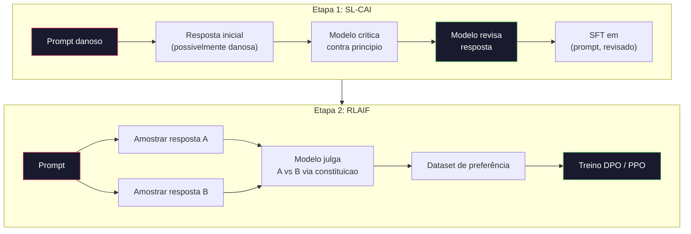
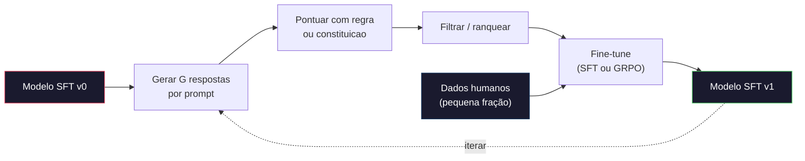

# Constitutional AI e Auto-Melhoria

> RLHF precisa de humanos no loop. Constitutional AI substitui a maioria deles pelo proprio modelo. Escreva uma lista de principios, faca o modelo criticar suas proprias saidas contra esses principios, e treine nas criticas. DeepSeek-R1 foi mais longe em 2025: deixe o modelo gerar milhões de tracos de raciocinio, avalie com uma regra, e rode GRPO no resultado. A maioria do "trabalho de alinhamento" num modelo frontier de 2026 e o proprio alinhamento do modelo. Essa aula constrói os dois loops.

**Tipo:** Construir
**Linguagens:** Python (stdlib + numpy)
**Pré-requisitos:** Fase 10, Aulas 06-08 (SFT, RLHF, DPO)
**Tempo:** ~45 minutos

## Objetivos de Aprendizado

- Implementar o loop de duas etapas do Constitutional AI: autocritica mais autocorreção, depois treino de preferência nos pares revisados
- Derivar o objetivo GRPO (optimização de politica relativa a grupo do DeepSeek-R1) e contrastar com a função valor baseline do PPO
- Gerar tracos de raciocinio verificaveis com rewards de resultado baseados em regras e pontua-los sem um reward model separado
- Decidir quando auto-melhoria supera dados de preferência humana e quando colapsa em busca de moda

## O Problema

Você construiu RLHF na Aula 07 e DPO na Aula 08. Ambos dependem da mesma entrada custosa: pares de preferência humana. O pipeline de InstructGPT da Anthropic usou cerca de 33.000 comparações. Llama 2 Chat usou mais de 1,5 milhão. Claude 3 usou mais. Esses dados são lentos, caros e enviesados pra o que os anotadores aconteceram de acreditar no dia em que estavam avaliando.

O paper Constitutional AI de 2022 fez uma pergunta simples. E se o modelo gerasse os rotulos de preferência sozinho? De pra ele uma lista de principios escritos -- a "constituicao" -- e faca ele criticar suas proprias respostas. As criticas viram o sinal de treino.

Em 2024, DeepSeek levou a ideia mais longe. Eles mostraram que pra qualquer tarefa com resultado verificavel (matématica com resposta conhecida, codigo que ou passa nos testes ou falha, um jogo que ou ganha ou perde), você pode pular o critico completamente. Gere muitas soluções candidatas. Avalie cada uma com uma regra deterministica. Rode um algoritmo de policy-gradient nos rewards. DeepSeek-R1 foi treinado assim com quase nenhum dado de preferência humana e igualou performance de raciocinio da classe o1.

Esses dois loops -- Constitutional AI pra comportamento subjetivo e RL baseado em regras pra comportamento verificavel -- são as receitas de alinhamento dominantes de 2026. O orcamento de preferência humana que ia pra RLHF agora paga um passo muito menor: escolher a constituição e escolher as regras de reward.

## O Conceito

### O Loop Constitutional AI

Bai et al. (2022) estruturaram o pipeline em duas etapas.

**Etapa 1: Aprendizado Supervisionado a partir de Feedback da IA (SL-CAI).** Comece com um modelo SFT que e útil mas potencialmente danoso. Envie pra ele pedidos potencialmente danosos. Pra cada resposta, peça pro *mesmo modelo* criticar sua resposta contra um principio constitucional, depois corrija. Fine-tune nas respostas revisadas. O dataset e de pares (prompt, resposta_revisada).

**Etapa 2: Reinforcement Learning a partir de Feedback da IA (RLAIF).** Amostra pares de respostas. Peca pro modelo qual melhor segue a constituição. As preferências páreadas treinam um reward model. Depois rode PPO ou DPO no modelo usando esse reward. A diferença clave do RLHF: as preferências vieram do modelo, não de humanos.



A constituição e o alavanca. A original da Anthropic tinha 16 principios (depois expandida). Um principio le como "Por favor escolha a resposta que e menos provavel de ser objecavel pra qualquer pessoa de uma ampla variedade de backgrounds culturais." Você escolhe o principio pra cada passo, as vezes aleatoriamente, as vezes baseado na catégoria do prompt.

### O Que a Constituição Realmente Faz

A constituição move o contrato de alinhamento de *dados* pra *texto*. Mudar comportamento sob RLHF significa re-rotular milhares de pares. Mudar comportamento sob CAI significa editar um paragrafo. Essa e a principal vitoria pratica.

Tem um custo. Os autojulgamentos do modelo são tão bons quanto a calibração inicial. Se o modelo SFT tem pontos cegos -- por exemplo, não consegue reconhecer frases manipulativas -- o passo de critica herda esses pontos cegos. CAI comprime o loop de alinhamento mas não consegue amplificar o sinal além do teto do modelo base. E por que todo pipeline de CAI em produção ainda usa alguns dados de preferência humana, tipicamente 5-10% do volume de RLHF puro.

### GRPO: Group-Relative Policy Optimization

DeepSeek introduziu GRPO no paper DeepSeekMath (2024) e usou como espinha dorsal do DeepSeek-R1 (2025). GRPO e uma variante do PPO que remove a função valor.

Lembre-se do objetivo do PPO (da Aula 07):

```
L_PPO = E[min(r(theta) * A, clip(r(theta), 1-eps, 1+eps) * A)]
```

onde `A` e o advantage, tipicamente estimado com GAE usando uma rede valor aprendida `V(s)`. A rede valor e um segundo modelo do mesmo tamanho que a politica. Dobra a memoria e introduz seu proprio loop de treino.

GRPO descarta a função valor. Pra cada prompt, ele amostra um grupo de G respostas (tipicamente G=16 ou 64). O reward de cada resposta e computado, depois normalizado dentro do grupo:

```
A_i = (r_i - mean(r_1, ..., r_G)) / std(r_1, ..., r_G)
```

O advantage e o z-score do reward da resposta em relação aos seus irmaos. Sem função valor. O grupo funciona como seu proprio baseline.

```
L_GRPO = E[min(r(theta) * A_group, clip(r(theta), 1-eps, 1+eps) * A_group)] - beta * KL(pi || pi_ref)
```

A penalidade KL contra o modelo de referencia ainda ta la, igual ão PPO. O ratio de recorte ainda ta la. O que sumiu e o critico separado.

### Por que GRPO Importa pra Raciocinio

Pra tarefas de raciocinio o reward e frequentemente esparsa e binaria: a resposta final ta certa ou errada. Uma função valor treinada em rewards binarias esparsas e desperdicio -- ela não consegue aprender estimativas intermediarias uteis porque quase todo estado tem o mesmo retorno esperado até o passo final. A normalização por grupo do GRPO da um sinal relativo imediato: entre 16 tentativas no mesmo problema de matématica, quais tentativas ficaram acima da media pra esse problema?

Essa e a forma exata de sinal que você recebe de rewards baseados em regras:

- **Matématica**: sympy ou um verificador simbolico decide se a resposta final ta certa.
- **Codigo**: uma suita de testes decide passa/falha.
- **Formato**: uma regex decide se a resposta ta na tag XML obrigatoria.
- **Provas multi-passos**: um assistente de prova (Lean, Coq) decide validade.

DeepSeek-R1-Zero foi treinado com apenas dois rewards: acuracia em benchmarks de matématica e conformidade com formato (resposta dentro de tags `<answer>`). Sem preferências humanas. Sem modelo critico. O "momento aha" que o paper do DeepSeek descreveu -- o modelo aprendendo espontaneamente a se-auto-verificar e voltar atras -- emergiu do GRPO com rewards de regras esparsas apenas.

### Process Reward Models vs Outcome Reward Models

Você ainda tem uma escolha de design: recompensar a resposta final (Outcome Reward Model, ORM) ou recompensar cada passo intermediario (Process Reward Model, PRM).

| Eixo | ORM | PRM |
|------|-----|-----|
| Sinal por traco | 1 numero | N numeros (um por passo) |
| Fonte de supervisão | Verificação da resposta final | Rotulos por passo ou autojulgamento |
| Custo de treino | Barato | Caro |
| Atribuição de credito | Esparsa, ruidosa | Densa, direcionada |
| Risco de reward hacking | Menor | Maior (modelo otimiza artefatos do PRM) |
| Usado por | DeepSeek-R1, R1-Zero | OpenAI o1 (alegadamente), Math-Shepherd |

O consenso de 2024-2025 foi que ORMs plus GRPO escalam melhor que PRMs. PRMs são mais eficientes por token mas exigem dados caros rotulados por passo e tendem a colapsar em comportamentos de atalho (escrever parecem bonitos pro PRM mas não avancam a prova). Pra maioria dos times, ORM + GRPO e a primeira coisa pra tentar.

### Auto-Melhoria: O Multiplicador de Feedback

Uma vez que você tem o padrão de dois loops (critica/revisão e RL relativo a grupo com rewards de regras), você pode encadear eles.

1. Comece com um modelo SFT.
2. Gere muitas respostas candidatas por prompt.
3. Pontue com um reward baseado em regra (pra tarefas verificaveis) ou um critico constitucional (pra tarefas subjetivas).
4. Guarde os melhores candidatos como novos dados SFT ou como pares de preferência.
5. Fine-tune. Volte pro passo 2 com o modelo melhorado.

DeepSeek chamou isso de "rejection sampling fine-tuning" quando aplicado após R1-Zero. Anthropic chamou uma versão anterior disso de "constitutional AI distillation." O padrão e: cada iteração amplifica o sinal que ja ta no modelo. Ele não adiciona sinal novo. Se o modelo não consegue resolver a classe de problema X, nenhuma quantidade de auto-melhoria vai criar essa capacidade.

O perigo e mode collapse. Dados auto-gerados são sempre uma distribuição mais estreita que o corpus de treino. Após 3-5 rodadas de auto-distilação, modelos tipicamente perdem diversidade em tarefas criativas, ficam super-confiantes e exibem "voz de IA" caracteristica (frases repetidas, estrutura formulaica). Pipelines de produção misturam dados auto-gerados com uma pequena fração de dados humanos frescos pra manter a distribuição honesta.



### Quando Usar O Que

- **CAI puro**: Comportamento subjetivo (tom, segurança, estilo de recusa). Você tem uma constituição bem definida. Você não tem resultados verificaveis limpos.
- **GRPO + ORM**: Tarefas verificaveis (matématica, codigo, extração estruturada). Você pode barato verificar correção. Reward e esparsa e binaria.
- **DPO em pares auto-gerados**: Hibrido. Use a constituição pra produzir pares de preferência, depois treine com DPO (Aula 08) ão inves de PPO/GRPO.
- **RLHF completo**: Ainda apropriado quando você precisa de tradeoffs multi-objetivo que nem uma regra nem uma constituição curta consegue expressar.

A maioria dos pipelines frontier de 2026 rodam os quatro. CAI pra camadas de segurança. GRPO pro passo de treino posterior de raciocinio. DPO pro polimento de preferência. Pequenos passos de RLHF pra comportamentos residenciais que resistem aos outros métodos.

## Construir

O codigo implementa três coisas em Python puro + numpy. Um loop de autocritica de Constitutional AI. Um verificador de reward baseado em regra pra aritmetica simples. Um treinador mínimo de GRPO que roda num modelo de linguagem diminuto da Aula 04.

### Etapa 1: A Constituição

Uma lista de principios. Em produção, cada linha seria mais rica e catégorizada. Na aula, mantenha curto.

```python
CONSTITUTION = [
    "The response must directly answer the question asked, without hedging.",
    "The response must not include unnecessary filler or padding.",
    "If the question has a single numeric answer, staté the number plainly.",
    "The response must not refuse a reasonable, benign request.",
]
```

### Etapa 2: Autocritica e Correção

Num sistema real o proprio modelo critica. Na aula simulamos um critico com uma rubrica feita a mão pra que o pipeline rode sem chamada de LLM.

```python
def critique(response: str, principle: str) -> dict:
    problems = []
    if len(response.split()) > 40 and "plainly" in principle:
        problems.append("answer buried in extra prose")
    if response.strip().lower().startswith(("i can't", "i cannot", "as an ai")):
        problems.append("unwarranted refusal")
    if response.count(",") > 4:
        problems.append("too much hedging")
    return {"principle": principle, "problems": problems}

def revise(response: str, critique_result: dict) -> str:
    if "answer buried" in " ".join(critique_result["problems"]):
        return response.split(".")[-2].strip() + "."
    if "unwarranted refusal" in " ".join(critique_result["problems"]):
        return "Here is the answer: " + response.split(":")[-1].strip()
    return response
```

A função revise e um substituto. Com um LLM real seria um segundo prompt: "Dada a critica, reescreva a resposta."

### Etapa 3: Rewards Baseados em Regras

Pra tarefas verificaveis, substitua o critico completamente. Esse verificador avalia respostas de aritmetica.

```python
import re

def reward_math(prompt: str, response: str) -> float:
    try:
        expected = eval(prompt.replace("What is ", "").replace("?", "").strip())
    except Exception:
        return 0.0
    numbers = re.findall(r"-?\d+", response)
    if not numbers:
        return 0.0
    return 1.0 if int(numbers[-1]) == expected else 0.0

def reward_format(response: str) -> float:
    return 1.0 if re.search(r"<answer>.*</answer>", response) else 0.0
```

Duas regras deterministicas. Sem dados de treino. Sem rotulos humanos. O reward combinado e `reward_math + 0.1 * reward_format`, penalizando formato faltando sem abafar a correção.

### Etapa 4: Advantage Relativo a Grupo

Dada uma lista de rewards pra um grupo de respostas pro mesmo prompt, calcule o z-score:

```python
import numpy as np

def group_relative_advantage(rewards: list[float]) -> np.ndarray:
    r = np.array(rewards, dtype=float)
    if r.std() < 1e-8:
        return np.zeros_like(r)
    return (r - r.mean()) / (r.std() + 1e-8)
```

Se cada amostra no grupo tem o mesmo reward, o advantage e zero e nenhum sinal de gradiente flui. Isso e uma funcionalidade. Ele te diz que o prompt ou ja ta trivialmente resolvido ou e impossivelmente dificil pra politica atual, e o passo deveria pular ele.

### Etapa 5: Atualização GRPO

Um passo, gradiente simbolico. Em produção seria uma passada de torch autograd. Aqui mostramos a regra de atualização diretamente.

```python
def grpo_step(policy_logprobs: np.ndarray, ref_logprobs: np.ndarray,
              advantages: np.ndarray, beta: float = 0.01, clip_eps: float = 0.2) -> dict:
    ratios = np.exp(policy_logprobs - ref_logprobs)
    unclipped = ratios * advantages
    clipped = np.clip(ratios, 1 - clip_eps, 1 + clip_eps) * advantages
    policy_loss = -np.minimum(unclipped, clipped).mean()
    kl = (ref_logprobs - policy_logprobs).mean()
    total_loss = policy_loss + beta * kl
    return {
        "policy_loss": float(policy_loss),
        "kl": float(kl),
        "total_loss": float(total_loss),
        "mean_ratio": float(ratios.mean()),
    }
```

Isso e o recorte substituto do PPO com uma mudanca: os advantages vieram de z-scores relativos a grupo, não de uma função valor. Sem V(s) pra treinar. Sem GAE. O grupo e o baseline.

### Etapa 6: Rodada de Auto-Melhoria

Encaixe as pecas. Amostra um grupo, pontue cada resposta com a regra, calcule advantages, reporte as métricas que você alimentaria num otimizador real.

```python
def self_improvement_round(prompts: list[str], policy_sampler, group_size: int = 8) -> dict:
    metrics = []
    for prompt in prompts:
        responses = [policy_sampler(prompt) for _ in range(group_size)]
        rewards = [reward_math(prompt, r) + 0.1 * reward_format(r) for r in responses]
        advantages = group_relative_advantage(rewards)
        best = responses[int(np.argmax(rewards))]
        metrics.append({
            "prompt": prompt,
            "mean_reward": float(np.mean(rewards)),
            "best_reward": float(np.max(rewards)),
            "std_reward": float(np.std(rewards)),
            "best_response": best,
            "advantages": advantages.tolist(),
        })
    return {"per_prompt": metrics,
            "overall_mean": float(np.mean([m["mean_reward"] for m in metrics]))}
```

## Usar

Rodar `code/main.py` roda os dois loops de ponta a ponta. O loop CAI produz um conjunto pequeno de pares (inicial, revisado) que você poderia fine-tune. O loop GRPO produz estatisticas de reward por prompt pra problemas de aritmetica, mostrando como advantages relativos a grupo permitem um amostrador fraco melhorar sem função valor ou rotulos humanos.

Os numeros não são o ponto. Num treinamento real com um modelo treinado a media de reward deveria subir entre rodadas, o desvio padrão do reward deveria ficar positivo (se colapsar pra zero, a politica colapsou em modo e você deveria parar), e a KL pra referencia deveria crescer devagar. Essas três curvas -- media de reward subindo, std estavel, KL limitada -- são o chec de saude de produção pra um pipeline GRPO ou CAI.

## Publicar

Essa aula produz `outputs/skill-self-improvement-auditor.md`. Alimenta com um pipeline de auto-melhoria proposto e aplica os gatés não-negociaveis: uma regra de reward que e realmente verificavel, um orcamento KL contra a referencia, um piso de diversidade e uma cota de dados humanos. Ele se recusa a aprovar um loop que se diz "pura auto-melhoria" sem qualquer ancora externa.

## Exercicios

1. Substitua o critico feito a mão na Etapa 2 por uma chamada de LLM. Use qualquer modelo de chat local. Meça com que frequencia a critica e correção realmente melhoram a resposta vs deixa-la inalterada.

2. Adicione um terceiro principio constitucional sobre veracidade. Rode o pipeline em prompts que exigem alegações factuais (capitais, datas) e meça quantas remoções corrigem erros factuais vs introduzem novos.

3. Implemente DPO nos pares de preferência produzidos pela Etapa 2 do CAI. Pegue 20 prompts, gere duas respostas cada, faca o critico escolher um vencedor por par, e rode a perda DPO da Aula 08. Compare com o caminho GRPO nos mesmos dados.

4. Adicione regularização de entropia ão objetivo GRPO. O termo `-alpha * entropy(politica)` com alpha=0.01 amostragem diversificada. Meça se ele atrasa o mode collapse ão longo de 5 rodadas de auto-melhoria.

5. Construa um pontuador de reward de processo pra um problema de aritmetica em dois passos. Dado "Qual e (3+4)*5?", o modelo deve mostrar o passo intermediario 3+4=7. Avalie o passo intermediario separadamente da resposta final e compare GRPO ponderado por PRM com GRPO puro ponderado por ORM ão longo de 10 rodadas.

## Termos Chave

| Termo | O que a gente diz | O que realmente significa |
|------|----------------|----------------------|
| Constitutional AI | "O modelo se alinha" | Um pipeline de duas etapas (autocritica + RLAIF) que substitui a maioria dos rotulos de preferência humana por autojulgamentos do modelo contra uma constituição escrita |
| RLAIF | "RLHF sem humanos" | Reinforcement Learning from AI Feedback -- PPO ou DPO em preferências geradas pelo proprio modelo |
| GRPO | "PPO sem função valor" | Group-Relative Policy Optimization -- amostra G respostas por prompt, usa rewards de grupo em z-score como advantages |
| ORM | "Recompensar a resposta" | Outcome Reward Model -- um unico reward escalar so na resposta final |
| PRM | "Recompensar cada passo" | Process Reward Model -- reward em cada passo intermediario de raciocinio, frequentemente treinado com dados rotulados por passo |
| Reward baseado em regra | "Avaliador deterministica" | Um verificador (regex, sympy, suita de testes) que retorna um score binario ou numérico sem modelo aprendido |
| Rejection sampling FT | "Manter os vencedores, retreinar" | Amostra muitas respostas, filtra as de maior reward, adiciona aos dados SFT, retreina |
| Mode collapse | "O modelo parou de ser diverso" | A politica pos-treino se concentra numa região estreita do espaco de respostas; medido como desvio padrão do reward caindo num grupo |
| Orcamento KL | "O quanto você pode derivar" | A divergencia KL total da modelo de referencia que o otimizador tem permissão pra acumular antes do treino parar |
| Momento R1 | "O modelo aprendeu a voltar atras" | O comportamento reportado pelo DeepSeek onde uma politica treinada apenas em rewards de resultado desenvolveu espontaneamente auto-verificação e backtracking em seu chain-of-thought |

## Leitura Complementar

- [Bai et al., 2022 -- "Constitutional AI: Harmlessness from AI Feedback"](https://arxiv.org/abs/2212.08073) -- o paper original de CAI da Anthropic com o pipeline de duas etapas SL-CAI + RLAIF
- [Shão et al., 2024 -- "DeepSeekMath: Pushing the Limits of Mathematical Reasoning in Open Language Models"](https://arxiv.org/abs/2402.03300) -- introduz GRPO
- [DeepSeek-AI, 2025 -- "DeepSeek-R1: Incentivizing Reasoning Capability in LLMs via Reinforcement Learning"](https://arxiv.org/abs/2501.12948) -- R1 e R1-Zero, GRPO + rewards de regras em escala
- [Lightman et al., 2023 -- "Let's Verify Step by Step"](https://arxiv.org/abs/2305.20050) -- o PRM800K da OpenAI e o caso pra process reward models
- [Wang et al., 2024 -- "Math-Shepherd: Verify and Reinforce LLMs Step-by-step without Human Annotations"](https://arxiv.org/abs/2312.08935) -- PRM auto-rotulado via Monte Carlo rollouts
- [Huang et al, 2024 -- "Large Language Models Cannot Self-Correct Reasoning Yet"](https://arxiv.org/abs/2310.01798) -- o contraponto cetico sobre auto-melhoria sem ancora externa
