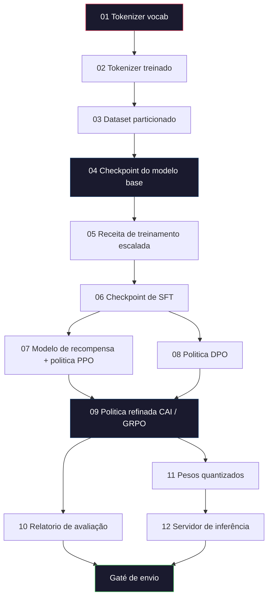
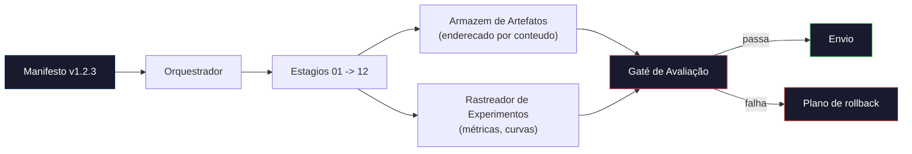

# Construindo um Pipeline Completo de LLM

> Tudo das Aulas 01 a 12 e um estagio de um unico pipeline. Esta aula e o esqueleto que transforma esses estagios em uma execução de ponta a ponta: tokenizar, pre-treinar, escalar, SFT, alinhar, avaliar, quantizar, servir. Você não vai treinar um modelo 70B num notebook. Você vai produzir a camada de orquestração, o manifesto, o gaté de avaliação e o plano de rollback que uma equipe de fronteira em 2026 usa pra decidir o que vai pro ar. Esta e a aula final.

**Tipo:** Construir
**Linguagens:** Python (stdlib)
**Pré-requisitos:** Todas as aulas da Fase 10 (01-12)
**Tempo:** ~120 minutos

## Objetivos de Aprendizado

- Compor as onze aulas anteriores (tokenizer, dados, pre-treinamento, escalabilidade, SFT, RLHF, DPO, CAI, avaliação, quantização, inferência) em uma eespecificaçãoificação de pipeline reproduzivel
- Definir o contrato de artefatos entre estagios: o que cada estagio consome, o que produz, e como o próximo estagio verifica a entrada
- Construir um orquestrador que rastreia experimentos, faz hash dos artefatos e condiciona decisões de envio a thresholds de avaliação
- Projetar o plano de rollback: quais artefatos são baratos de re-executar, quais são caros, e quanto custa um checkpoint corrompido

## O Problema

As aulas anteriores cada uma funciona. Tokenizer treinado. Tiny GPT pre-treinado. Dataset de SFT montado. Modelo de recompensa treinado. DPO rodado. Avaliações medidas. Pesos quantizados exportados. Servidor de inferência levantado. Cada um e um notebook. Cada um com suas convenções, seus caminhos de saida, sua seed.

Um run de treinamento de fronteira não e um notebook. Llama 3 405B levou 30 milhões de horas H100 ão longo de aproximadamente 54 dias. DeepSeek-V3 usou cerca de 2.8 milhões de horas H800. Durante esse tempo, um checkpoint corrompido, uma contaminação de dados, uma regressão na avaliação pode custar uma semana de tempo real e um mes de orcamento de GPU. A forma como as equipes sobrevivem e pela higiene do pipeline: cada estagio tem entrada deterministica, saida deterministica, manifesto, hash e gaté.

Esta e a aula final. Você não vai rodar o pipeline de ponta a ponta num notebook. Você vai escrever o orquestrador que coordena os estagios, o manifesto que descreve o run, o verificador que condiciona decisões de envio e o plano de replay que permite a terceiros re-executar seu trabalho a partir de um unico arquivo. O codigo e pequeno; a disciplina e grande.

O padrão escala de 100M para 1T de parâmetros sem mudanca. Os mesmos quatro componentes -- manifesto, orquestrador, gaté de avaliação, armazem de artefatos -- rodam Llama 3 e também rodam seu GPT de hobby. A diferença e o tamanho dos numeros dentro da config de cada estagio, não a forma do pipeline.

## O Conceito

### Os Doze Estagios

Cada aula da Fase 10 e um estagio. Aqui esta o grafo completo de dependencias.



Os estagios 07 e 08 podem rodar em paralelo. Todo o resto e dependencia rigida. Uma mudanca no estagio 02 (tokenizer) invalida todos os artefatos downstream. Uma mudanca no estagio 10 (avaliação) invalida apenas a decisão de envio.

### O Manifesto

Um manifesto e um arquivo unico que descreve um run completamente o suficiente pra reproduzi-lo. Nada que o pipeline produz deve depender de estado que não esta no manifesto. Os campos são chatos e obrigatorios.

```
pipeline_version: 1.2.3
seed: 42
git_commit: a1b2c3d4
stages:
  01_tokenizer:
    recipe: bpe_32k
    input_hash: sha256:...
    output_hash: sha256:...
    wall_clock_sec: 3600
    cost_usd: 12
```

O hash de saida do estagio N e o hash de entrada do estagio N+1. Qualquer desvio e o pipeline para. E assim você pega corrompimento de dados cedo. E também e assim que um colega em outro continente verifica que a reprodução deles produziu o mesmo artefato que o seu.

Na pratica equipes usam um pequeno schema YAML mais um verificador de manifesto que difa contra o run anterior bem-sucedido. Qualquer delta fora dos campos esperados (custo, tempo real) e uma bandeira vermelha.

### Tipagem de Artefatos

A saida de cada estagio e um artefato tipado. Não um blob de diretorio, não um pickle, mas um tipo nomeado com um schema conhecido.

| Estagio | Tipo de Artefato | Campos Chave |
|---------|-----------------|--------------|
| 01-02 | Tokenizer | vocab.json, merges.txt, config.json, hash |
| 03 | Dataset | shards[], contagem de linhas, contagem de tokens, estatisticas de dedup |
| 04-05 | Checkpoint | weights.safetensors, config.json, estado do otimizador, contagem de steps |
| 06 | Modelo SFT | checkpoint + receita SFT + mix de dados |
| 07 | Modelo de Recompensa | checkpoint RM + hash dos dados de preferência |
| 08-09 | Politica | checkpoint + hash de referencia + beta + orcamento KL consumido |
| 10 | Relatorio de Avaliação | scores de benchmark + diffs de regressão + hash dos dados de avaliação |
| 11 | Modelo Quantizado | pesos quantizados + dados de calibração + delta de acuracia vs FP16 |
| 12 | Eespecificaçãoificação do Servidor | endpoint + hash do modelo + config + hooks de observabilidade |

A tipagem evita o modo de falha mais comum: usar a saida do estagio 08 como entrada do estagio 06, enviando um modelo treinado com DPO pelo caminho de SFT. Artefatos tipados e assinaturas de estagios tipados transformam esses erros em falhas de compilação, não falhas no quinto dia.

### O Gaté de Avaliação

Envio não e "treinamento terminou." Envio e "treinamento terminou e o gaté de avaliação passou." O gaté e definido antes do run comecar.

```
gatés:
  mmlu:      >= baseline + 0.5   # sem regressão
  humaneval: >= baseline + 1.0
  truthfulqa: >= baseline         # sem queda
  safety_refusal_raté: <= 0.05
  kl_from_reference: <= 25.0
  cost_total_usd: <= 50000
```

Todo gaté e um threshold numérico. Não tem gatés de "parece bom". Não tem aprovações subjetivas. Se todos os gatés passam, o artefato e marcado como enviovel. Se qualquer gaté falha, o run fica pendente até override explicito por um revisor nomeado, que também fica logado no manifesto.

Dois gatés pegam a maioria dos desastrês. Um gaté de *regressao* (o novo modelo precisa ser pelo menos tão bom quanto o anterior em benchmarks core) pega bugs de treinamento. Um gaté de *orcamento KL* (a politica alinhada não pode ter desviado mais que X da sua referencia) pega alinhamento exagerado. Todo pipeline de produção tem ambos.

### O Orquestrador

Um pedaco pequeno de codigo que le o manifesto, despacha estagios, rastreia artefatos e para em qualquer violação de contrato. Isto não e Airflow. Isto não e Kubeflow. Pra higiene do pipeline você quer algo chato que você mesmo escreveu.

O trabalho do orquestrador e estreito:

1. Resolver o DAG a partir do manifesto.
2. Para cada estagio, verificar se a saida esperada ja existe no hash correto (pular se existir).
3. Rodar o estagio, capturar stdout/stderr, medir tempo real e custo.
4. Verificar o hash de saida contra o hash de entrada esperado do estagio downstream.
5. Na falha, escrever um manifesto parcial com o estagio exato que falhou e sair com codigo não-zero.

Isso são 200 linhas de Python. Vai parecer o arquivo `code/main.py` desta aula. Por baixo dos panos, o pipeline real usa `torchrun` ou `ray` pra executar estagios individuais em clusters, mas o proprio orquestrador roda em uma unica maquina.

### Rastreamento de Experimentos e Armazenamento de Artefatos

Dois sistemas externos ancoram o pipeline.

**Rastreador de experimentos (wandb, neptune, mlflow).** Registra curvas de loss, métricas de avaliação, telemetria do sistema por estagio. O rastreador e onde você vai quando precisa comparar o run A com o run B três semanas depois. Equipes quase sempre usam um rastreador hospedado pra isso -- escrever o seu proprio perde tempo que deveria ir pro treinamento.

**Armazem de artefatos (S3, R2, GCS).** Armazenamento de objetos imutavel para checkpoints, datasets, tokenizers, relatorios de avaliação. Artefatos são enderecados por hash, não por nome de arquivo. Um nome de arquivo como `latést.pt` e uma bomba; `ckpt-7b-step-20000-sha256:abc123.safetensors` e um contrato.

O orquestrador escreve nos dois. O rastreador e pra humanos olhando graficos. O armazem de artefatos e pro próximo estagio buscando entradas.

### Custo

Um run de fronteira tem um numero em dolares atrelado. Disciplina de orcamento acontece em dois lugares.

**Estimativa pre-run.** A partir do manifesto, calcular FLOPs esperados (pre-treinamento: 6 x params x tokens), horas GPU esperadas (FLOPs / throughput pico / útilização) e custo em dolares na taxa de aluguel atual. Se a estimativa exceder o gaté de orcamento, o pipeline se recusa a comecar.

**Rastreamento durante o run.** Tempo real e custo por estagio são registrados no manifesto. Depois de cada estagio, o orcamento restante e verificado. Se um estagio extrapolou, o gaté do próximo estagio e avaliado com o novo orcamento restante. Você não fica sabendo que ficou sem dinheiro quando o VC liga.

O custo reportado do Llama 3 foi de $61M. DeepSeek-V3 reportou $5.6M para o run principal de pre-treinamento. A razão e majoritariamente eficiencia de hardware mais mixture-of-experts -- mas o custo eespecificaçãoifico e visivel porque ambas as equipes rastrearam por estagio, não por run.

### Reprodutibilidade vs Determinismo

São coisas diferentes. *Reprodutivel* significa que o mesmo manifesto mais o mesmo codigo mais a mesma infraestrutura produz um checkpoint com métricas downstream equivalentes. *Deterministico* saida bit-identica.

Treinamento moderno de LLM e reprodutivel mas não deterministico. O reduce-order do treinamento distribuido, não-determinismo de kernels GPU (cuBLAS, flash-attn) e arredondamento de precisão mista combinam pra produzir floats que diferem no nivel 1e-5 entre runs. Isso e ok pra métricas finais, que não mexem. E fatal se você esta tentando debugar com diffs bit-a-bit. A cura e logar o hash de entrada, hash de saida e métricas principais de cada estagio -- se essas batém, o run e "reproduzido" mesmo que os pesos não sejam bit-identicos.



### Plano de Rollback

Antes do run comecar, escreva o que acontece na falha de cada estagio. Três catégorias.

- **Barato pra re-executar** (horas): tokenizer, avaliação, quantização, servidor de inferência. So re-executar.
- **Medio** (dias): SFT, DPO, CAI. Manter o modelo base; re-executar apenas os estagios de alinhamento.
- **Caro** (semanas e milhões de dolares): pre-treinamento. O plano de rollback aqui não e "re-executar." E "usar o último checkpoint bom e re-executar os estagios downstream mais baratos com dados revisados."

Como as dependencias de estagios são tipadas e com hash, o orquestrador pode calcular o conjunto de rollback automáticamente: invalidar o estagio que falhou mais todos os descendentes. Uma falha no estagio 06 (SFT) invalida 06, 07, 08, 09, 10, 11, 12. Uma falha no estagio 11 (quantização) invalida apenas 11 e 12. Definir isso antes evita improviso enquanto a equipe esta exausta as 4am.

### Receitas de Produção Observadas em 2026

A maioria das equipes de fronteira convergiu no mesmo esqueleto.

- Tokenizer: 128k BPE com reserva de byte. Treinado em um corte multilingue pequeno e balanceado.
- Pré-treinamento: 10-20T tokens, majoritariamente web mais codigo mais sintetico. Otimizador Muon ou AdamW. FSDP2 ou DeepSpeed ZeRO-3. Gradient checkpointing. Pesos BF16, master FP32.
- SFT: 500k-2M pares de instruções, mix humano e sintetico, com dedup rigoroso contra o dataset de avaliação.
- Alinhamento: DPO ou CAI + GRPO. RLHF apenas onde o sinal de preferência e multidimensional demais pra DPO.
- Avaliação: MMLU-Pro, MATH, HumanEval+, GPQA, SWE-Bench Verified, LiveBench, mais um conjunto privado de retenção que o publico nunca ve.
- Quantização: GPTQ ou AWQ 4-bit pra servir, 8-bit pra avaliações de segurança onde deltas de acuracia importam.
- Servindo: vLLM, TensorRT-LLM ou proprio. Batching continuo. Decodificação eespecificaçãoulativa. Evição de KV cache.

Os numeros mudam a cada seis meses. O esqueleto não.

## Construir

O codigo da aula e um orquestrador e um verificador de manifesto, não doze scripts de treinamento. Cada estagio e simulado com um placeholder que produz um artefato de saida com o formato e hash corretos. Rodar o orquestrador de ponta a ponta prova que a tubulação do pipeline funciona antes de você queimar dinheiro de GPU nos estagios reais.

Veja `code/main.py` pra implementação completa. Os pedacos principais:

- Dataclass `Manifest`: versão do pipeline, seed, commit git, estagios, gatés.
- Dataclass `Stage`: nome, tipo, entradas (hashes), saida (hash), tempo real, custo.
- `Orchestrator.run()`: resolve o DAG, despacha estagios, verifica hashes, atualiza manifesto.
- `EvalGaté.check()`: le thresholds, compara contra o último relatorio de avaliação, retorna passa/falha.
- `ArtifactStore` (stub em memoria): put/get por hash, simula S3.
- `CostTracker`: por estagio e cumulativo, para quando exceder o limite.

O pipeline em `main.py` roda doze estagios placeholder, produz um manifesto e exercita um gaté de avaliação falho pra mostrar como fica um run retido. Troque cada placeholder pelo script de treinamento real da aula correspondente e você tem o esqueleto que um pipeline de fronteira real usa.

## Usar

O fluxo de trabalho canonico tem três comandos.

```
python code/main.py plan    # validar manifesto, calcular estimativa de custo, imprimir DAG
python code/main.py run     # executar estagios, escrevendo em manifest.out.yaml
python code/main.py gaté    # ler manifest.out.yaml, aplicar gatés de avaliação, enviar ou reter
```

Rode `plan` primeiro sempre. A maioria dos bugs de pipeline aparece no plan -- thresholds de gaté faltando, hashes desatualizados, orcamento estourado. Rodar `plan` e gratis. Rodar `run` e caro. Economize pegando bugs do lado barato.

A saida de `gaté` e `SHIP` ou `HOLD: <motivo>`. Um run retido não e falha; e um ponto de decisão. Um revisor nomeado faz override (e o override e logado) ou aprova o rollback.

## Entregar

Esta aula produz `outputs/skill-llm-pipeline-reviewer.md`. Alimente-o com um manifesto de pipeline proposto e ele verifica todos os contratos: tipagem de estagios, cadeia de hashes, gatés, plano de rollback, estimativa de custo. Ele se recusa a aprovar um manifesto com gaté de avaliação faltando, orcamento KL ilimitado ou um run que mistura dados de avaliação e treinamento.

## Exercicios

1. Estender o orquestrador pra suportar execução paralela dos estagios 07 e 08. Use o modulo stdlib `concurrent.futures`. Confirme que o manifesto final registra as saidas de ambos os estagios e que o hash de entrada do estagio 09 e uma combinação deterministica dos dois.

2. Adicionar um gaté de "verificação de contaminação". Dado o hash do dataset de avaliação e os shards do dataset de treinamento, calcular a sobreposição (match de string exato ou match 13-gram). O gaté falha se a sobreposição exceder 0.1%. Alimente com um dataset de treinamento contaminado e confirme que o gaté retém o run.

3. Implementar um estimador de custo desde os principios. Para o estagio 04 (pre-treinamento), estimar FLOPs como 6 x params x tokens, assumindo 40% MFU (útilização de FLOPs do modelo) em H100 a 889 TFLOPs BF16, a $2.50/GPU-hora. Reportar a estimativa pra um modelo 7B treinado em 2T tokens. Comparar com numeros publicados do Llama 2.

4. Construir um rollback parcial. Simular uma falha no estagio 09 (CAI), depois re-executar os estagios 09 até 12 deixando 01-08 em cache. O orquestrador deve detectar os artefatos em cache pelo hash e pula-los. Medir tempo real economizado versus re-execução total.

5. Adicionar observabilidade. Emitir spans OpenTelemetry para cada estagio, com atributos para params, tokens vistos, loss e custo. Mandar os spans para um coletor local. O ponto não e dashboards; o ponto e que a saude de cada estagio e rastreavel a partir de um unico trace ID.

## Termos Principais

| Termo | O que a gente diz | O que realmente significa |
|-------|-------------------|--------------------------|
| Manifesto | "O arquivo de receita" | YAML ou JSON descrevendo versão do pipeline, seed, config por estagio e thresholds de gaté -- suficiente pra reproduzir um run |
| Enderecado por conteudo | "Por hash não por nome" | Artefatos armazenados pelo SHA-256 do conteudo, então você nunca confunde a versão A com a versão B |
| Gaté de avaliação | "Os criterios de envio" | Thresholds numéricos em métricas de benchmark e escores de segurança que precisam passar antes de um artefato ser marcado como enviovel |
| Orcamento KL | "Quanto o alinhamento desviou" | Um limite no KL acumulado (politica \|\| referencia) ão longo dos estagios de alinhamento, aplicado como gaté |
| MFU | "Quanto da GPU você usou" | Útilização de FLOPs do Modelo -- FLOPs realizados divididos pelo pico teorico. 40% e tipico em escala 70B, 55% em 7B |
| Plano de rollback | "O que faz quando quebra" | Conjunto de ações pre-escritas por estagio em caso de falha: re-executar, voltar, retreinar com entradas revisadas |
| Orquestrador | "O maestro" | O processo que le o manifesto, despacha estagios, verifica hashes, para em qualquer violação de contrato |
| Armazem de artefatos | "S3 versionado pra pesos" | Armazenamento de objetos imutavel enderecado por conteudo -- unica fonte de verdade pra checkpoints, datasets, relatorios de avaliação |
| Reprodutivel | "Mesmos métricas na reprodução" | Pesos em nivel de bits diferentes mas métricas downstream equivalentes -- o alvo realista pra treinamento distribuido de LLM |
| Gaté de custo | "Não pode exceder X" | Estimativa de custo pre-run mais rastreador durante o run -- o pipeline se recusa a comecar se a estimativa exceder o orcamento |

## Leitura Complementar

- [Dubey et al., 2024 -- "The Llama 3 Herd of Models"](https://arxiv.org/abs/2407.21783) -- a descrição publica mais detalhada de um pipeline de fronteira incluindo dados, treinamento, alinhamento, avaliação
- [DeepSeek-AI, 2024 -- "DeepSeek-V3 Technical Report"](https://arxiv.org/abs/2412.19437) -- pipeline com foco em eficiencia a cerca de 1/10 do custo do Llama 3
- [Kaplan et al., 2020 -- "Scaling Laws for Neural Language Models"](https://arxiv.org/abs/2001.08361) -- a relação original de escalabilidade entre compute-dados-params
- [Hoffmann et al., 2022 -- "Training Compute-Optimal Large Language Models (Chinchilla)"](https://arxiv.org/abs/2203.15556) -- a correção do Kaplan que recalibrou orcamentos modernos de dados
- [Documentação do PyTorch FSDP2](https://pytorch.org/docs/stable/fsdp.html) -- a primitiva de treinamento distribuido que substitui FSDP1 no PyTorch 2.4+
- [Weights & Biases LLM Reports](https://wandb.ai/site/llms) -- manifests reais e saida de rastreador de experimentos pra runs de LLM open-source, uteis como templatés plagiaveis
