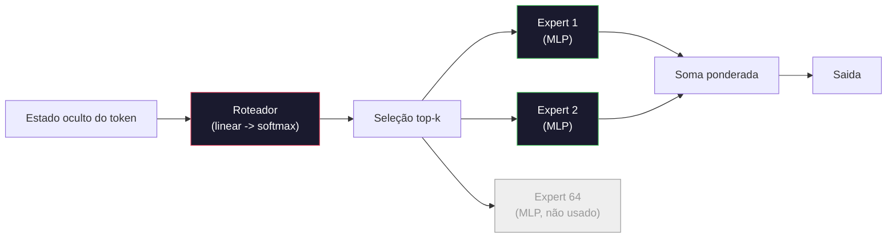

# Modelos Abertos: Percursos Arquitetonicos

> Você construiu um GPT-2 Small do zero na Aula 04. Modelos abertos de fronteira em 2026 são da mesma familia com cinco ou seis mudancas concretas. RMSNorm ão inves de LayerNorm. SwiGLU ão inves de GELU. RoPE ão inves de posições aprendidas. GQA ou MLA ão inves de MHA completo. Mixture-of-Experts em escala. A matématica que você ja conhece cobre 95% deles. Esta aula le Llama 3, DeepSeek-V3, Mixtral, Qwen e Gemma lado a lado e nomeia a linha exata onde cada arquitetura diverge.

**Tipo:** Aprender
**Linguagens:** Python (stdlib)
**Pré-requisitos:** Fase 10, Aulas 04, 05, 12 (Pré-treinamento, Escalabilidade, Inferência)
**Tempo:** ~45 minutos

## Objetivos de Aprendizado

- Ler o config.json do Llama 3, Mistral, Mixtral, Gemma 2, Qwen 2.5 e DeepSeek-V3 e explicar cada campo
- Nomear a mudanca arquitetonica eespecificaçãoifica que cada modelo fez em relação ão GPT-2 Small e justificar a partir dos principios
- Calcular contagem de parâmetros, tamanho do KV cache e memoria de ativação para qualquer modelo aberto apenas a partir do config
- Escolher o modelo aberto certo pra um alvo de desconsiderando laténcia, memoria e restrições de capacidade

## O Problema

Na Aula 04 você escreveu 350 linhas de numpy e tinha um modelo com formato GPT-2. Llama 3 405B tem um relatorio tecnico de 200 paginas. Seu instinto e que esses são bichos diferentes. Não são. As 200 paginas descrevem o mesmo objeto com cinco ou seis modificações bem motivadas, mais um milhão de detalhes de implementação sobre escalabilidade. O esqueleto -- embedding, blocos transformer, attention, MLP, norm, head -- não muda.

Esta aula e um diff. Para cada familia de modelo aberto grande, listamos exatamente o que mudou do GPT-2, por que, e quanto custou. Quando terminar você pode ler um model card novo e traduzir mentalmente pro baseline GPT-2.

O ganho pratico e que quando Meta lancar o Llama 5 ou DeepSeek lancar o V4, você não vai precisar de um novo modelo mental. Você vai olhar o config, ver quais dos botões conhecidos mexeram e saber quais são as implicações downstream. As arquiteturas de 2026 são uma caixa de ferramentas finita. Cada modelo novo escolhe um subconjunto diferente.

## O Conceito

### O Nucleo Invariante

Todos os modelos autoregressivos abertos compartilham:

- Matriz de embedding de tokens (vocab_size x hidden_dim).
- Pilha de N blocos decoder: norm, self-attention, residual, norm, MLP, residual.
- Norm final e head linear projetando pra vocab_size (frequentemente com pesos tieados com embeddings).
- Mascara causal, loss de cross-entropy do próximo token.

Essa e a forma. O resto são botões.

### Os Seis Botes Que Realmente Mudam

Em todos os modelos abertos de fronteira de 2024-2026, as mesmas seis escolhas de design são repetidas:

1. **Normalização.** LayerNorm -> RMSNorm.
2. **Encoding posicional.** Absoluto aprendido -> RoPE (mais variantes: YaRN, NTK).
3. **Ativação.** GELU -> SwiGLU (ou GeGLU).
4. **Compartilhamento de heads de attention.** MHA -> GQA -> MQA -> MLA.
5. **MLP denso vs esparsa.** Denso -> Mixture-of-Experts.
6. **Posição do pre-norm.** Pré-norm continua. Post-norm sumiu.

Tudo o resto (schedule de learning raté, mix de dados, batch size, comprimento do contexto) vive na config de treinamento, não na arquitetura. Seis botões.

### Botão 1: RMSNorm

LayerNorm subtrai media, divide por std, escala e desloca. RMSNorm mantem apenas a escala:

```
RMSNorm(x) = x / sqrt(mean(x^2) + eps) * gamma
```

Sem subtração de media. Sem bias. Um matmul a menos por token. Zhang e Sennrich (2019) argumentaram que equivalia a LayerNorm em tradução de maquina enquanto era 10% mais rapido. Todo modelo aberto moderno roda isso.

Custo: nenhum. Beneficio: ganho pequeno de throughput, codigo mais simples.

### Botão 2: RoPE

Embeddings de posição aprendidos eram uma tabela de lookup com 1024 slots no GPT-2. Contexto 1025 fica fora da tabela. Modelos não conseguem extrapolar além do comprimento de treinamento.

Rotary Position Embedding (RoPE, Su et al. 2021) injeta posição rotacionando cada par de vetores Q e K antes do produto escalar de attention. O angulo de rotação e uma função deterministica da posição, então não tem nada aprendido e nada pra esgotar. Com truques de escalabilidade (interpolação NTK-aware, YaRN), um modelo treinado em contexto 8k pode se esticar pra 128k na inferência com perda moderada de acuracia.

```
q_rotatéd = rotaté(q, angle(pos))
k_rotatéd = rotaté(k, angle(pos))
score = q_rotatéd . k_rotatéd
```

Todo Llama, Mistral, Qwen, DeepSeek e Gemma usa RoPE. Gemma 2 usa um hibrido (RoPE na maioria das camadas, attention de sliding-window local nas outras).

### Botão 3: SwiGLU

O MLP do GPT-2 e `x -> gelu(xW1 + b1) -> (...)W2 + b2`. SwiGLU (Shazeer 2020) substitui a ativação por um produto com gaté:

```
SwiGLU(x) = (xW1) * sigmoid(xW1) * xV
```

Duas projeções em paralelo ão inves de uma, com gaté da ativação Swish. Empiricamente mais forte em perplexidade por parâmetro. Llama 2 adotou, todo mundo seguiu. O hidden size do MLP geralmente e ajustado pra que a contagem total de parâmetros combine com o MLP denso original: se GPT-2 usava `ff_dim = 4 * hidden`, SwiGLU usa `ff_dim = (2/3) * 4 * hidden = 8/3 * hidden`.

### Botão 4: Compartilhamento de Heads de Attention

GPT-2 usava **Multi-Head Attention (MHA)**: cada head tem sua propria projeção Q, K, V.

**Multi-Query Attention (MQA, Shazeer 2019)** compartilha um K e um V entre todas as heads. Reduz o KV cache por num_heads, que e uma redução de 12x a 32x num modelo tipico. Acuracia cai um pouco em benchmarks dificeis.

**Grouped-Query Attention (GQA, Ainslie et al. 2023)** e o meio-termo: G grupos de Q heads compartilham um K e um V. Llama 3 8B usa GQA com 32 Q heads e 8 KV heads (G=8), então o KV cache encolhe 4x comparado a MHA completa.

**Multi-Head Latént Attention (MLA, DeepSeek 2024)** comprime K e V em um laténte compartilhado de baixo rank, descomprimindo por head. Reduz ainda mais o KV cache enquanto preserva a expressividade por head. DeepSeek-V2 e V3 dependem disso pro desempenho de contexto longo.

| Esquema | KV Heads | KV Cache | Acuracia |
|---------|----------|----------|----------|
| MHA    | num_heads | completo | melhor |
| GQA    | num_groups (G < num_heads) | redução num_heads / G | próximo de MHA |
| MQA    | 1 | redução num_heads | pequena queda |
| MLA    | laténte, descompressão por head | menor que MQA | próximo de MHA |

Pra qualquer modelo acima de ~13B parâmetros, GQA ou MLA e praticamente obrigatorio. MHA completa em escala e um desastre de KV cache.

### Botão 5: Mixture of Experts

Um MLP denso ativa todos os seus parâmetros pra cada token. Um MLP MoE tem K experts por bloco e um roteador que escolhe os top-k experts por token (tipicamente top-2). Apenas os pesos desses experts veem um forward pass pra aquele token.

```
router_logits = xW_r
índices, weights = top_k(router_logits, k=2)
output = sum_i weights[i] * expert[índices[i]](x)
```

O apelo: você pode ter 64 experts de tamanho 7B cada (então a contagem total de parâmetros e enorme) enquanto so roda 2 deles por token (então o custo por token combina com um modelo denso 7B). Mixtral 8x7B tem 47B de parâmetros totais mas ativa apenas 13B por token. DeepSeek-V3 tem 671B de parâmetros totais mas ativa apenas 37B por token.



Pros: mesmo compute, mais parâmetros, melhor capacidade. Contras: a memoria dos experts ainda precisa ficar em algum lugar (então servir precisa mais VRAM que um equivalente denso), balancear a carga do roteador e dificil, e fine-tuning do roteador durante alinhamento e uma área de pesquisa propria.

### Botão 6: Pré-norm continua

O transformer original aplicava layer norm após cada sub-camada. Todo modelo aberto desde GPT-2 coloca *antes* de cada sub-camada. Pré-norm e estritamente mais facil de treinar em profundidade. Não tem o que discutir.

### Diff Por Modelo

Aqui esta a tabela que torna tudo concreto.

| Modelo | Ano | Params Totais | Params Ativos | Norm | Ativação | Posição | Attention | MoE | Contexto |
|--------|-----|---------------|---------------|------|----------|---------|-----------|-----|----------|
| GPT-2 Small | 2019 | 124M | 124M | LayerNorm | GELU | Aprendido | MHA (12 heads) | não | 1k |
| Llama 3 8B | 2024 | 8B | 8B | RMSNorm | SwiGLU | RoPE | GQA (32/8) | não | 128k |
| Llama 3 70B | 2024 | 70B | 70B | RMSNorm | SwiGLU | RoPE | GQA (64/8) | não | 128k |
| Llama 3 405B | 2024 | 405B | 405B | RMSNorm | SwiGLU | RoPE | GQA (128/16) | não | 128k |
| Mistral 7B | 2023 | 7.2B | 7.2B | RMSNorm | SwiGLU | RoPE | GQA | não | 32k |
| Mixtral 8x7B | 2023 | 47B | 13B | RMSNorm | SwiGLU | RoPE | GQA | sim (8 experts, top-2) | 32k |
| Gemma 2 9B | 2024 | 9B | 9B | RMSNorm (pre+post) | GeGLU | RoPE + sliding | GQA | não | 8k |
| Qwen 2.5 72B | 2024 | 72B | 72B | RMSNorm | SwiGLU | RoPE (YaRN) | GQA (64/8) | não | 128k |
| DeepSeek V2 236B | 2024 | 236B | 21B | RMSNorm | SwiGLU | RoPE | MLA | sim (160 experts, top-6) | 128k |
| DeepSeek V3 | 2024 | 671B | 37B | RMSNorm | SwiGLU | RoPE | MLA | sim (256 experts, top-8) | 128k |

Escaneie as colunas. RMSNorm e universal. SwiGLU ou seu primo GeGLU e universal. RoPE e universal. GQA e universal acima de 7B exceto quando substituido por MLA. MoE e o diferencial no topo.

### Lendo um config.json

Config do Llama 3 8B:

```
{
  "hidden_size": 4096,
  "intermediaté_size": 14336,
  "num_hidden_layers": 32,
  "num_attention_heads": 32,
  "num_key_value_heads": 8,
  "max_position_embeddings": 131072,
  "rope_theta": 500000.0,
  "rms_norm_eps": 1e-5,
  "vocab_size": 128256
}
```

Cada campo corresponde a algo que você ja implementou.

- `hidden_size`: dimensão do embedding.
- `intermediaté_size`: hidden size do MLP (3.5x hidden -- matématica do SwiGLU).
- `num_hidden_layers`: profundidade da pilha.
- `num_attention_heads`: Q heads.
- `num_key_value_heads`: KV heads (GQA).
- `max_position_embeddings`: comprimento do contexto de treinamento.
- `rope_theta`: frequencia base do RoPE. Meta escalou do default 10k pra 500k pra extrapolar contexto longo.
- `rms_norm_eps`: estabilidade numérica.
- `vocab_size`: tokens.

So com esses você calcula parâmetros totais, KV cache e pico de memoria de ativação. Veja `code/main.py` pra formulas exatas.

### Orcamento de memoria de ativação

Ativações dominam a memoria de treinamento acima de alguns bilhões de parâmetros. A regra de bolso pra pre-treinamento (com gradient checkpointing):

```
activation_mem ~ batch_size * seq_len * hidden_size * num_layers * bytes_per_element
```

Pra Llama 3 8B com batch 1, seq 8192, BF16, 32 camadas, hidden 4096: aproximadamente 8 GB so pra ativações com checkpointing, 40 GB sem. E por isso flash-attention e ring-attention importam -- eles reescrevem o calculo de attention pra que as ativações caibam.

### Orcamento de KV cache

Pra inferência no contexto máximo:

```
kv_cache = 2 * num_layers * num_kv_heads * head_dim * max_seq_len * bytes_per_element
```

Llama 3 8B em contexto 128k, BF16, head_dim = hidden / num_heads = 128:
`2 * 32 * 8 * 128 * 131072 * 2 = 17.2 GB` por sequencia.

Os 8B de pesos são 16 GB em BF16. O KV cache de uma unica sequencia de 128k e maior que os pesos. Essa e a pressão de memoria que impulsiona GQA, MLA e pesquisa em quantização de KV cache.

### Quando Cada Modelo Ganha

- **GPU unica 80GB, sem MoE**: Llama 3 8B, Mistral 7B, Gemma 2 9B. Facil de servir, ampla ferramentaria.
- **Node unico (8x80GB), capacidade grande**: Llama 3 70B, Qwen 2.5 72B. Maior capacidade denso aberta.
- **Maior capacidade aberta, aceita complexidade MoE**: DeepSeek V3, Mixtral 8x22B. Melhor capacidade por FLOP ativo.
- **Necessidades de contexto longo**: Llama 3 (128k com escalabilidade RoPE), DeepSeek (vantagem do MLA).
- **Servindo baixa laténcia**: Gemma 2 9B (sliding window corta o compute de contexto longo).

## Construir

O codigo da aula e uma calculadora. Dado qualquer config.json, imprime contagem de parâmetros por componente, KV cache no contexto máximo, razão MLP SwiGLU e um veredicto curto sobre a arquitetura (denso / GQA / MLA / MoE).

```python
config = {
    "hidden_size": 4096, "intermediaté_size": 14336,
    "num_hidden_layers": 32, "num_attention_heads": 32,
    "num_key_value_heads": 8, "vocab_size": 128256,
    "max_position_embeddings": 131072,
}
```

O script percorre a arquitetura campo por campo, calcula contagens de parâmetros pra embedding, attention (com redução GQA), MLP (com expansão SwiGLU), layernorms e o head. Depois calcula o KV cache no contexto declarado e imprime um resumo.

Veja `code/main.py` pra implementação.

## Usar

Rode a calculadora nas configs do Llama 3 8B, Mistral 7B, Mixtral 8x7B e DeepSeek V3 incluidas no script. Compare as quebras de parâmetros. Note que os modelos MoE tem uma contagem total de parâmetros que eclipsa os modelos densos mas uma contagem ativa que frequentemente e menor. Note que o KV cache do DeepSeek V3 e menor que o do Llama 3 405B apesar de ter mais parâmetros totais -- isso e MLA em ação.

Depois coloque uma config de qualquer modelo que você tem localmente, leia o resumo e decida se cabe na sua GPU.

## Entregar

Esta aula produz `outputs/skill-open-model-picker.md`. Dado um alvo de despliegue (tipo de GPU, VRAM, comprimento do contexto, orcamento de laténcia) e um perfil de tarefa (chat, codigo, raciocinio, contexto longo), recomenda um modelo aberto, um esquema de quantização da Aula 11 e uma stack de inferência da Aula 12, com raciocinio explicito sobre os seis botões arquitetonicos.

## Exercicios

1. Ler o config do Qwen 2.5 72B no HuggingFace. Calcular parâmetros totais do zero. Comparar com o valor reportado pelo HF e identificar de onde vem qualquer delta (arredondamento de head dim, fator de compartilhamento KV, etc.).

2. DeepSeek V3 usa 256 experts com roteamento top-8. Calcular a razão de experts ativos vs total e comparar com o top-2 de 8 do Mixtral 8x7B. O que a mudanca de esparsa (25%) pra esparsa mais densa (3%) implica sobre capacidade por FLOP?

3. Calcular o KV cache do Llama 3 405B em contexto 128k em FP8 e BF16. Em FP8 e metade do numero BF16. Quantas sequencias paralelas você consegue servir em um node 8xH100 (80GB cada = 640GB total, menos memoria de pesos)?

4. Gemma 2 alterna camadas de attention completa e sliding-window. Escreva a matématica do KV cache quando metade das camadas usa uma janela deslizante de 4096 tokens ão inves de contexto completo. Quanta memoria isso economiza em contexto total de 8k?

5. Encontre um modelo aberto de fronteira recente lancado depois que esta aula foi escrita. Identifique qual dos seis botões ele escolheu e se introduziu um setimo botão. O curriculo vai parecer desatualizado no momento que uma nova arquitetura for lancada -- o objetivo e atualizar sua tabela sem reconstruir seu modelo mental.

## Termos Principais

| Termo | O que a gente diz | O que realmente significa |
|-------|-------------------|--------------------------|
| RMSNorm | "LayerNorm sem a media" | Normalizar apenas pela raiz media quadrada, com escala aprendida -- mais barato e comparavel a LayerNorm |
| RoPE | "Posições rotacionais" | Rotacionar cada par de vetores Q e K em 2D por um angulo que depende da posição -- extrapola além do comprimento de treinamento com truques de escalabilidade |
| SwiGLU | "A nova ativação de MLP" | Unidade linear com gaté Swish: `(xW1) * sigmoid(xW1) * xV` -- padrão em todo modelo aberto 2024+ |
| GQA | "Attention intermediaria" | Grouped-Query Attention: G grupos de Q heads compartilham um K e um V -- encolhe KV cache sem o golpe de acuracia do MQA |
| MLA | "Attention do DeepSeek" | Multi-Head Latént Attention: comprime K/V em um laténte de baixo rank compartilhado, descomprime por head -- menor KV cache pra modelos grandes |
| MoE | "Experts esparsos" | Mixture of Experts: N MLPs por bloco, roteador escolhe top-k por token -- enorme total de parâmetros, pequeno total ativo |
| Roteamento top-k | "Escolher k experts por token" | O roteador calcula um score por expert e ativa os k mais altos -- tipico k de 2 (Mixtral) a 8 (DeepSeek) |
| YaRN | "Esticar RoPE" | Mais uma extensão RoPE -- interpola angulos rotacionais pra estender contexto de 8k pra 128k+ na inferência |
| Attention de sliding-window | "Não aténder a tudo" | Cada token aténde apenas os últimos W tokens -- limita o custo de attention a O(W) por token, usado no Gemma 2 e no Mistral antigo |
| Params ativos | "O que roda por token" | Pra modelos MoE, a contagem de parâmetros que veem um forward pass por token (muito menor que totais) -- governa FLOPs por token |

## Leitura Complementar

- [Dubey et al., 2024 -- "The Llama 3 Herd of Models"](https://arxiv.org/abs/2407.21783) -- a referencia arquitetonica e de treinamento da familia Llama 3 densa
- [DeepSeek-AI, 2024 -- "DeepSeek-V3 Technical Report"](https://arxiv.org/abs/2412.19437) -- MLA mais balanceamento de carga sem loss auxiliar mais 671B MoE
- [Jiang et al., 2024 -- "Mixtral of Experts"](https://arxiv.org/abs/2401.04088) -- o paper canonic MoE de modelo aberto
- [Su et al., 2021 -- "RoFormer: Enhanced Transformer with Rotary Position Embedding"](https://arxiv.org/abs/2104.09864) -- o paper do RoPE
- [Shazeer, 2020 -- "GLU Variants Improve Transformer"](https://arxiv.org/abs/2002.05202) -- SwiGLU, GeGLU e amigos
- [Ainslie et al., 2023 -- "GQA: Training Generalized Multi-Query Transformer Models"](https://arxiv.org/abs/2305.13245) -- o paper do GQA
- [Gemma 2 Team, 2024 -- "Gemma 2: Improving Open Language Models at a Practical Size"](https://arxiv.org/abs/2408.00118) -- attention hibrida full+sliding, pre+post-norm
- [Qwen Team, 2024 -- "Qwen 2.5 Technical Report"](https://arxiv.org/abs/2412.15115) -- extensão de contexto YaRN e receitas de treinamento longo
