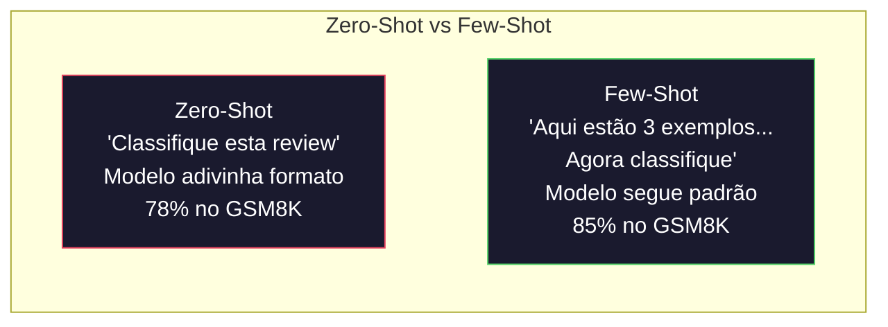
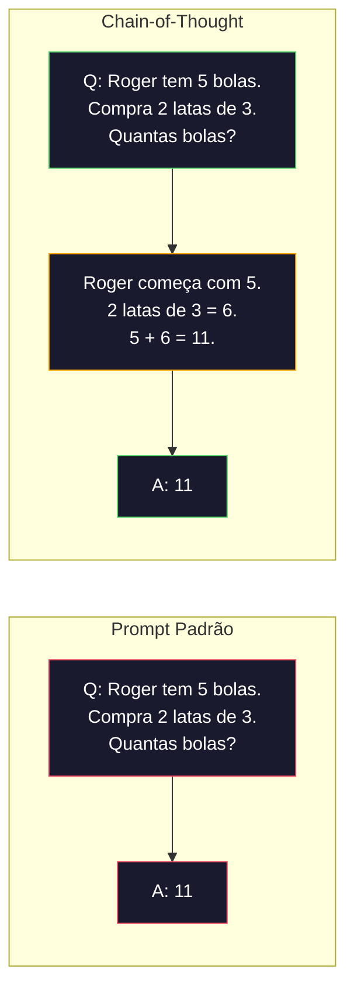
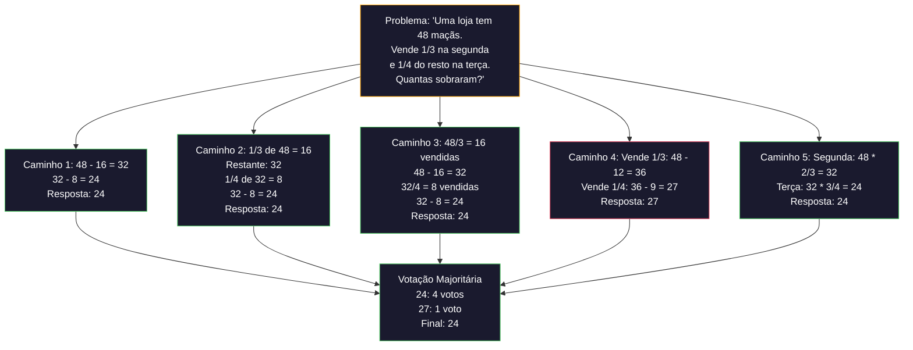

# Few-Shot, Chain-of-Thought, Tree-of-Thought

> Dizer ao modelo o que fazer é prompting. Mostrar como pensar é engenharia. A diferença entre 78% e 91% de acurácia no mesmo modelo, mesma tarefa, mesmo dados não é um modelo melhor. É uma estratégia de raciocínio melhor.

**Tipo:** Construção
**Linguagens:** Python
**Pré-requisitos:** Aula 11.01 (Prompt Engineering)
**Tempo:** ~45 minutos

## Objetivos de Aprendizado

- Implementar few-shot prompting selecionando e formatando demonstrações que maximizam a acurácia da tarefa
- Aplicar raciocínio chain-of-thought (CoT) para melhorar acurácia em problemas de múltiplos passos como problemas de matemática
- Construir um prompt tree-of-thought que explora múltiplos caminhos de raciocínio e seleciona o melhor
- Medir a melhoria de acurácia entre zero-shot vs few-shot vs CoT em um benchmark padrão

## O Problema

Você constrói um app de tutoria de matemática. Seu prompt diz: "Resolva este problema." GPT-5 acerta 94% das vezes no GSM8K, o benchmark padrão de matemática do ensino fundamental. Você pensa que já chegou ao teto. Não chegou — chain-of-thought ainda adiciona 3-4 pontos.

Adicione cinco palavras — "Vamos pensar passo a passo" — e a acurácia pula para 91%. Adicione alguns exemplos resolvidos e chega a 95%. Mesmo modelo. Mesma temperatura. Mesmo custo de API. A única diferença é que você deu ao modelo uma folha de rascunho.

Isso não é um hack. É como o raciocínio funciona. Humanos não resolvem problemas de múltiplos passos num único salto mental. Nem transformers. Quando você força o modelo a gerar tokens intermediários, esses tokens se tornam parte do contexto para o próximo token. Cada passo de raciocínio alimenta o próximo. O modelo literalmente computa seu caminho até a resposta.

Mas "pense passo a passo" é o começo, não o fim. E se você amostrasse cinco caminhos de raciocínio e fizesse uma votação majoritária? E se deixasse o modelo explorar uma árvore de possibilidades, avaliando e podando ramos? E se intercalasse raciocínio com uso de ferramentas? Estas não são hipotéticas. São técnicas publicadas com melhorias medidas, e você vai construir todas elas nesta aula.

## O Conceito

### Zero-Shot vs Few-Shot: Quando Exemplos Vencem Instruções

Zero-shot prompting dá ao modelo uma tarefa e nada mais. Few-shot prompting dá exemplos primeiro.

Wei et al. (2022) mediram isso em 8 benchmarks. Para tarefas simples como classificação de sentimento, zero-shot e few-shot performaram dentro de 2% um do outro. Para tarefas complexas como aritmética de múltiplos passos e raciocínio simbólico, few-shot melhorou a acurácia em 10-25%.

A intuição: exemplos são instruções comprimidas. Em vez de descrever o formato de saída, você mostra. Em vez de explicar o processo de raciocínio, você demonstra. O modelo faz pattern-matching nos exemplos de forma mais confiável do que interpreta instruções abstratas.



**Quando few-shot vence:** tarefas sensíveis a formato, classificação, extração estruturada, jargão de domínio específico, qualquer tarefa onde o modelo precisa corresponder a um padrão específico.

**Quando zero-shot vence:** perguntas factuais simples, tarefas criativas onde exemplos restringem criatividade, tarefas onde encontrar bons exemplos é mais difícil que escrever boas instruções.

### Seleção de Exemplos: Similar Vence Aleatório

Nem todos exemplos são iguais. Escolher exemplos similares ao alvo supera seleção aleatória por 5-15% em tarefas de classificação (Liu et al., 2022). Três princípios:

1. **Similaridade semântica**: escolha exemplos mais próximos da entrada no espaço de embedding
2. **Diversidade de rótulos**: cubra todas as categorias de saída nos seus exemplos
3. **Correspondência de dificuldade**: iguale o nível de complexidade do problema alvo

O número ótimo de exemplos para a maioria das tarefas é 3-5. Abaixo de 3, o modelo não tem sinal suficiente para extrair o padrão. Acima de 5, você atinge retornos decrescentes e desperdiça tokens da janela de contexto.

### Chain-of-Thought: Dando Rascunho aos Modelos

Chain-of-Thought (CoT) foi introduzido por Wei et al. (2022) no Google Brain. A ideia é simples: em vez de pedir apenas a resposta, peça ao modelo que mostre seus passos de raciocínio primeiro.



Por que isso funciona mecanicamente? Cada token que um transformer gera se torna contexto para o próximo token. Sem CoT, o modelo precisa comprimir todo raciocínio no estado oculto de um único passo direto. Com CoT, o modelo externaliza computações intermediárias como tokens. Cada token de raciocínio estende a profundidade efetiva da computação.

**Benchmarks GSM8K (matemática escolar, 8.5K problemas):**

| Modelo | Zero-Shot | Zero-Shot CoT | Few-Shot CoT |
|-------|-----------|---------------|--------------|
| GPT-4o | 78% | 91% | 95% |
| GPT-5 | 94% | 97% | 98% |
| o4-mini (raciocínio) | 97% | — | — |
| Claude Opus 4.7 | 93% | 97% | 98% |
| Gemini 3 Pro | 92% | 96% | 98% |
| Llama 4 70B | 80% | 89% | 94% |
| DeepSeek-V3.1 | 89% | 94% | 96% |

**Nota sobre modelos de raciocínio.** Modelos como a série o da OpenAI (o3, o4-mini) e DeepSeek-R1 executam chain-of-thought internamente antes de emitir sua resposta. Adicionar "Vamos pensar passo a passo" a um modelo de raciocínio é redundante e às vezes contraproducente.

Duas variações de CoT:

**Zero-shot CoT**: acrescente "Vamos pensar passo a passo" ao prompt. Sem exemplos necessários. Kojima et al. (2022) mostraram que essa única frase melhora acurácia em aritmética, senso comum e raciocínio simbólico.

**Few-shot CoT**: forneça exemplos que incluem passos de raciocínio. Mais eficaz que zero-shot CoT porque o modelo vê o formato exato de raciocínio esperado.

**Quando CoT atrapalha**: recordação factual simples ("Qual a capital da França?"), classificação de passo único, tarefas onde velocidade importa mais que acurácia. CoT adiciona 50-200 tokens de overhead de raciocínio por consulta.

### Self-Consistency: Amostre Muitos, Vote Uma Vez

Wang et al. (2023) introduziram self-consistency. O insight: um único caminho CoT pode conter erros de raciocínio. Mas se você amostrar N caminhos de raciocínio independentes (usando temperature > 0) e fizer uma votação majoritária na resposta final, os erros se cancelam.



Self-consistency melhorou a acurácia GSM8K de 56.5% (CoT único) para 74.4% com N=40 nos experimentos originais do PaLM 540B. No GPT-5 a melhoria é pequena (97% para 98%) porque a acurácia base já está saturada. A técnica brilha mais em modelos com 60-85% de acurácia CoT base — o ponto ideal onde erros de caminho único são frequentes mas não sistemáticos.

O tradeoff: N amostras significa Nx o custo de API e latência. Na prática, N=5 captura a maioria do benefício. N=3 é o mínimo para uma votação significativa.

### Tree-of-Thought: Exploração Ramificada

Yao et al. (2023) introduziram Tree-of-Thought (ToT). Onde CoT segue um caminho linear de raciocínio, ToT explora múltiplos ramos e avalia quais são mais promissores antes de continuar.

ToT tem três componentes:

1. **Geração de pensamentos**: produza múltiplos candidatos de próximos passos
2. **Avaliação de estado**: pontue cada candidato (pode usar o próprio LLM como avaliador)
3. **Algoritmo de busca**: BFS ou DFS através da árvore, podando ramos de baixa pontuação

No jogo Game of 24 (combine 4 números usando aritmética para fazer 24), GPT-4 com prompting padrão resolve 7.3% dos problemas. Com CoT, 4.0% (CoT realmente atrapalha aqui porque o espaço de busca é amplo). Com ToT, 74%.

ToT é caro. Cada nó na árvore requer uma chamada LLM. Uma árvore com fator de ramificação 3 e profundidade 3 requer até 39 chamadas LLM. Use apenas para problemas onde o espaço de busca é grande mas avaliável — planejamento, resolução de quebra-cabeças, resolução criativa de problemas com restrições.

### ReAct: Pensar + Fazer

Yao et al. (2022) combinaram traços de raciocínio com ações. O modelo alterna entre pensar (gerando raciocínio) e agir (chamando ferramentas, buscando, computando).

ReAct supera CoT puro em tarefas com uso intensivo de conhecimento porque pode fundamentar seu raciocínio em dados reais. No HotpotQA (perguntas e respostas de múltiplos saltos), ReAct com GPT-4 alcança 35.1% de match exato vs 29.4% para CoT sozinho. O poder real é que erros de raciocínio são corrigidos por observações — o modelo pode atualizar seu plano no meio da execução.

ReAct é a fundação dos agentes de IA modernos. Todo framework de agentes (LangChain, CrewAI, AutoGen) implementa alguma variante do loop Pensamento-Ação-Observação.

### Prompting Estruturado: Tags XML, Delimitadores, Cabeçalhos

Conforme os prompts ficam complexos, a estrutura impede que o modelo confunda seções. Três abordagens:

**Tags XML** (funciona melhor com Claude, sólido em todo lugar):
```
<contexto>
Você está revisando um pull request.
O código usa TypeScript e React.
</contexto>

<tarefa>
Revise o diff abaixo para bugs, problemas de segurança e violações de estilo.
</tarefa>

<diff>
{conteúdo_do_diff}
</diff>
```

**Cabeçalhos Markdown** (universal):
```
## Papel
Engenheiro de segurança sênior em uma fintech.

## Tarefa
Analise este endpoint de API para vulnerabilidades.
```

**Delimitadores** (mínimo mas eficaz):
```
---ENTRADA---
{texto_do_usuario}
---FIM ENTRADA---
```

### Prompt Chaining: Decomposição Sequencial

Algumas tarefas são complexas demais para um único prompt. Prompt chaining as divide em etapas, onde a saída de um prompt vira a entrada do próximo.

Chaining vence prompt único por três razões:
1. **Cada etapa é mais simples**: o modelo lida com uma tarefa focada
2. **Saídas intermediárias são inspecionáveis**: você pode validar e corrigir entre etapas
3. **Etapas diferentes podem usar modelos diferentes**: use um modelo barato para extração, um caro para raciocínio

### Comparação de Performance

| Técnica | Melhor para | Acurácia GSM8K (GPT-5) | Chamadas API | Overhead de Tokens | Complexidade |
|---------|-------------|------------------------|-------------|-------------------|-------------|
| Zero-Shot | Tarefas simples | 94% | 1 | Nenhum | Trivial |
| Few-Shot | Correspondência de formato | 96% | 1 | 200-500 tokens | Baixa |
| Zero-Shot CoT | Aumento rápido de raciocínio | 97% | 1 | 50-200 tokens | Trivial |
| Few-Shot CoT | Máxima acurácia em chamada única | 98% | 1 | 300-600 tokens | Baixa |
| Self-Consistency (N=5) | Raciocínio de alto risco | 98.5% | 5 | 5x custo de tokens | Média |
| Modelo de raciocínio (o4-mini) | Substituição CoT drop-in | 97% | 1 | oculto (2-10x interno) | Trivial |
| Tree-of-Thought | Problemas de busca/planejamento | N/A (74% no Game of 24) | 10-40+ | 10-40x custo de tokens | Alta |
| ReAct | Raciocínio fundamentado | N/A (35.1% no HotpotQA) | 3-10+ | Variável | Alta |
| Prompt Chaining | Tarefas complexas de múltiplos passos | 96% (pipeline) | 2-5 | 2-5x custo de tokens | Média |

A técnica certa depende de três fatores: requisito de acurácia, orçamento de latência e tolerância de custo. Para a maioria dos sistemas de produção, few-shot CoT com um fallback de self-consistency de 3 amostras cobre 90% dos casos de uso.

## Construa

### Passo 1: Repositório de Exemplos Few-Shot

```python
GSM8K_EXAMPLES = [
    {
        "question": "Os patos da Janet põem 16 ovos por dia. Ela come 3 no café da manhã e usa 4 para fazer muffins. Vende o resto no mercado por R$2 cada. Quanto ela ganha por dia?",
        "reasoning": "Janet tem 16 ovos. Ela usa 3 + 4 = 7 ovos. Sobram 16 - 7 = 9 ovos. Ela vende cada um por R$2, então ganha 9 * 2 = R$18 por dia.",
        "answer": "18"
    },
]
```

### Passo 2: Construtor de Prompt CoT

```python
def build_cot_prompt(question, examples, num_examples=3):
    system = (
        "Você é um resolvedor de problemas de matemática. "
        "Para cada problema, mostre seu raciocínio passo a passo, "
        "depois dê a resposta numérica final na última linha "
        "no formato: 'A resposta é [número]'."
    )

    example_text = ""
    for ex in examples[:num_examples]:
        example_text += f"Q: {ex['question']}\n"
        example_text += f"A: {ex['reasoning']} A resposta é {ex['answer']}.\n\n"

    user = f"{example_text}Q: {question}\nA:"
    return system, user
```

### Passo 3: Self-Consistency

```python
from collections import Counter
import re

def extract_answer(text):
    match = re.search(r'A resposta é\s*([\d.,]+)', text)
    if match:
        return match.group(1).replace(",", "")
    return None

def self_consistency_solve(question, examples, client, model, n_samples=5):
    system, user = build_cot_prompt(question, examples)

    answers = []
    for _ in range(n_samples):
        response = client.chat.completions.create(
            model=model,
            messages=[
                {"role": "system", "content": system},
                {"role": "user", "content": user}
            ],
            temperature=0.7
        )
        text = response.choices[0].message.content
        answer = extract_answer(text)
        if answer is not None:
            answers.append(answer)

    vote_counts = Counter(answers)
    best_answer = vote_counts.most_common(1)[0][0] if vote_counts else None
    confidence = vote_counts[best_answer] / len(answers) if best_answer else 0

    return {
        "answer": best_answer,
        "confidence": confidence,
        "vote_distribution": dict(vote_counts),
        "sample_count": len(answers),
    }
```

### Passo 4: Tree-of-Thought

```python
def tree_of_thought_solve(problem, client, model, n_branches=3, depth=3):
    def evaluate_state(state):
        response = client.chat.completions.create(
            model=model,
            messages=[{"role": "user", "content": f"Avalie esta solução parcial (0-10) para: {problem}\n\nSolução:\n{state}\n\nNota:"}],
            temperature=0.3
        )
        import re
        match = re.search(r'(\d+(?:\.\d+)?)', response.choices[0].message.content)
        return float(match.group(1)) if match else 0

    def generate_next_steps(state):
        response = client.chat.completions.create(
            model=model,
            messages=[{"role": "user", "content": f"Dada esta solução parcial: {state}\nGere {n_branches} próximos passos diferentes."}],
            temperature=0.7
        )
        text = response.choices[0].message.content
        return [s.strip() for s in text.split('\n') if s.strip()]

    best_state = ""
    best_score = -1

    initial = client.chat.completions.create(
        model=model,
        messages=[{"role": "user", "content": f"Comece a resolver: {problem}"}],
        temperature=0.5
    ).choices[0].message.content

    queue = [(initial, 0)]
    while queue:
        state, d = queue.pop(0)
        score = evaluate_state(state)

        if score > best_score:
            best_score = score
            best_state = state

        if d < depth and score >= 5:
            next_steps = generate_next_steps(state)
            for step in next_steps:
                queue.append((f"{state}\n{step}", d + 1))

    return {"solution": best_state, "score": best_score}
```

## Use

### LangChain: Few-Shot com Seleção de Exemplos

```python
# from langchain_core.prompts import FewShotChatMessagePromptTemplate, ChatPromptTemplate
#
# examples = [
#     {"input": "Ótimo produto!", "output": "Positivo"},
#     {"input": "Péssimo atendimento", "output": "Negativo"},
#     {"input": "Produto ok, mas caro", "output": "Neutro"},
# ]
#
# example_prompt = ChatPromptTemplate.from_messages([
#     ("user", "{input}"),
#     ("assistant", "{output}"),
# ])
#
# few_shot_prompt = FewShotChatMessagePromptTemplate(
#     example_prompt=example_prompt,
#     examples=examples,
# )
#
# final_prompt = ChatPromptTemplate.from_messages([
#     ("system", "Classifique o sentimento."),
#     few_shot_prompt,
#     ("user", "{input}"),
# ])
```

### DSPy: Compilação Automática de Prompts

```python
# import dspy
#
# dspy.configure(lm=dspy.LM("openai/gpt-4o", temperature=0.7))
#
# class MathSolver(dspy.Module):
#     def __init__(self):
#         self.solve = dspy.ChainOfThought("question -> answer")
#
#     def forward(self, question):
#         return self.solve(question=question)
#
# solver = MathSolver()
# result = solver(question="Os patos da Janet põem 16 ovos por dia...")
```

`dspy.majority` implementa self-consistency:

```python
# result = dspy.majority(
#     [solver(question=q) for _ in range(5)],
#     field="answer"
# )
```

## Entregue

**1. Reasoning Chain Prompt** (`outputs/prompt-reasoning-chain.md`): um template de prompt pronto para produção com few-shot CoT e self-consistency.

**2. CoT Pattern Selection Skill** (`outputs/skill-cot-patterns.md`): um framework de decisão para escolher a técnica de raciocínio correta baseado no tipo de tarefa, requisitos de acurácia e restrições de custo.

## Exercícios

1. **Meça a diferença**: Pegue 10 problemas GSM8K. Resolva cada um com zero-shot, few-shot, zero-shot CoT e few-shot CoT. Registre a acurácia de cada. Qual técnica dá o maior ganho no seu modelo?

2. **Experimento de seleção de exemplos**: Para os mesmos 10 problemas, compare seleção aleatória de exemplos vs seleção manual de exemplos similares. Meça a diferença de acurácia.

3. **Curva de custo do self-consistency**: Execute self-consistency com N=1, 3, 5, 7, 10 em 20 problemas GSM8K. Plote acurácia vs custo (tokens totais). Onde está o joelho da curva?

4. **Construa um loop ReAct**: Estenda o pipeline com uma ferramenta de calculadora. Quando o modelo gerar uma expressão matemática, execute com `eval()` do Python (em sandbox) e devolva o resultado.

5. **ToT para tarefas criativas**: Adapte o solver Tree-of-Thought para uma tarefa de escrita criativa. Use o LLM como avaliador. A exploração ramificada produz saídas criativas melhores?

## Termos-chave

| Termo | O que o pessoal diz | O que realmente significa |
|-------|---------------------|--------------------------|
| Few-shot prompting | "Dar alguns exemplos" | Incluir demonstrações de entrada/saída no prompt para ancorar o formato de saída e comportamento |
| Chain-of-Thought | "Fazer pensar passo a passo" | Elicitar tokens intermediários de raciocínio que estendem o cálculo efetivo do modelo antes de produzir uma resposta final |
| Self-Consistency | "Rodar várias vezes" | Amostrar N caminhos de raciocínio diversos com temperature > 0 e selecionar a resposta final mais comum por votação majoritária |
| Tree-of-Thought | "Deixar explorar opções" | Busca estruturada sobre ramificações de raciocínio onde cada solução parcial é avaliada e apenas caminhos promissores são expandidos |
| ReAct | "Pensar + uso de ferramentas" | Intercalar traços de raciocínio com ações externas (busca, cálculo, chamadas de API) em um loop Thought-Action-Observation |
| Prompt chaining | "Dividir em passos" | Decompor uma tarefa complexa em prompts sequenciais onde cada saída alimenta a próxima entrada |
| Zero-shot CoT | "Só adicionar 'pense passo a passo'" | Anexar uma frase de gatilho de raciocínio a um prompt sem exemplos |

## Leitura Adicional

- [Chain-of-Thought Prompting Elicits Reasoning in Large Language Models](https://arxiv.org/abs/2201.11903) — Wei et al. 2022. O paper original do CoT
- [Self-Consistency Improves Chain of Thought Reasoning](https://arxiv.org/abs/2203.11171) — Wang et al. 2023
- [Tree of Thoughts: Deliberate Problem Solving](https://arxiv.org/abs/2305.10601) — Yao et al. 2023
- [ReAct: Synergizing Reasoning and Acting](https://arxiv.org/abs/2210.03629) — Yao et al. 2022
- [Large Language Models are Zero-Shot Reasoners](https://arxiv.org/abs/2205.11916) — Kojima et al. 2022
- [DSPy: Compiling Declarative Language Model Calls](https://arxiv.org/abs/2310.03714) — Khattab et al. 2023
