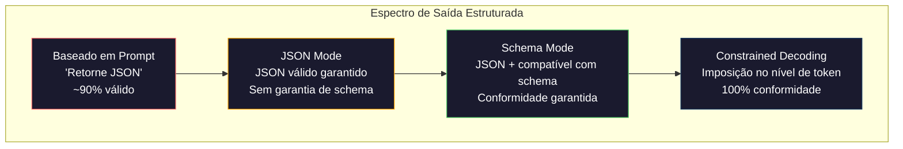
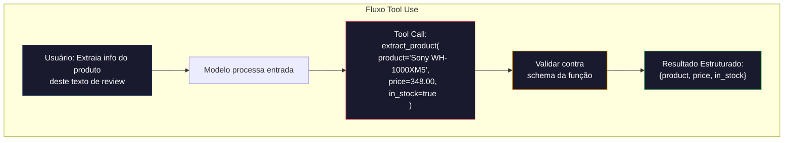

# Structured Outputs: JSON, Schema Validation, Constrained Decoding

> Seu LLM retorna uma string. Sua aplicação precisa de JSON. Essa lacuna derrubou mais sistemas em produção do que qualquer alucinação de modelo. Saída estruturada é a ponte entre linguagem natural e dados tipados. Acerte e seu LLM vira uma API confiável. Erre e você estará fazendo parse de texto livre com regex às 3 da manhã.

**Tipo:** Construção
**Linguagens:** Python
**Pré-requisitos:** Fase 10, Aulas 01-05 (LLMs do Zero)
**Tempo:** ~90 minutos
**Relacionado:** Fase 5 · 20 (Structured Outputs & Constrained Decoding) cobre a teoria no nível do decoder (processadores de logit FSM/CFG, Outlines, XGrammar). Esta aula foca na superfície de SDKs de produção (OpenAI `response_format`, Anthropic tool use, Instructor) — leia Fase 5 · 20 primeiro se quiser entender o que acontece abaixo da API.

## Objetivos de Aprendizado

- Implementar JSON-mode e saídas com schema usando parâmetros das APIs OpenAI e Anthropic
- Construir uma camada de validação Pydantic que rejeita saídas malformadas do LLM e tenta novamente com feedback de erro
- Explicar como constrained decoding força JSON válido no nível de token sem pós-processamento
- Projetar prompts de extração robustos que convertem texto não estruturado em estruturas de dados tipadas de forma confiável

## O Problema

Você pede a um LLM: "Extraia o nome do produto, preço e disponibilidade deste texto." Ele responde:

```
O produto é os fones Sony WH-1000XM5, que custam $348.00 e estão atualmente em estoque.
```

Isso é uma resposta perfeitamente correta. E completamente inútil para sua aplicação. Seu sistema de inventário precisa de `{"product": "Sony WH-1000XM5", "price": 348.00, "in_stock": true}`. Você precisa de um objeto JSON com chaves específicas, tipos específicos e restrições de valor específicas. Você não precisa de uma frase.

A solução ingênua: adicionar "Responda em JSON" ao prompt. Funciona 90% do tempo. Nos outros 10%, o modelo envolve o JSON em fences de markdown, ou adiciona um texto introdutório como "Aqui está o JSON:", ou produz JSON sintaticamente inválido porque fechou um colchete cedo demais. Seu parser de JSON quebra. Seu pipeline quebra. Você adiciona try/except e um loop de retry. Às vezes o retry produz dados diferentes. Agora você tem um problema de consistência em cima de um problema de parse.

Isso não é um problema de prompt engineering. É um problema de decoding. O modelo gera tokens da esquerda para a direita. Em cada posição, escolhe o token mais provável entre um vocabulário de 100K+ opções. A maioria dessas opções produziria JSON inválido em qualquer posição. Se o modelo acabou de emitir `{"price":`, o próximo token deve ser um dígito, uma aspa (para string), `null`, `true`, `false` ou um sinal de menos. Qualquer outra coisa produz JSON inválido. Sem restrições, o modelo pode escolher uma palavra perfeitamente razoável em inglês que é sintaticamente catastrófica.

## O Conceito

### O Espectro de Saída Estruturada

Existem quatro níveis de controle de saída estruturada, cada um mais confiável que o anterior.



**Baseado em Prompt** ("Responda em JSON válido"): sem imposição. O modelo geralmente obedece, mas às vezes não. Confiabilidade: ~90%. Modo de falha: fences de markdown, texto introdutório, saída truncada, estrutura errada.

**JSON mode**: a API garante que a saída é JSON válido. O `response_format: { type: "json_object" }` da OpenAI habilita isso. A saída vai parsear sem erros. Mas pode não corresponder ao schema esperado — chaves extras, tipos errados, campos faltando.

**Schema mode**: a API recebe um JSON Schema e garante que a saída corresponde a ele. Em 2026 todo provedor principal suporta isso nativamente: `response_format: { type: "json_schema", json_schema: {...} }` da OpenAI (também como `tool_choice="required"`), tool use da Anthropic com `input_schema`, e `response_schema` + `response_mime_type: "application/json"` do Gemini. A saída tem as chaves, tipos e restrições exatas que você especificou.

**Constrained decoding**: em cada posição de token durante a geração, o decoder mascara todos os tokens que produziriam saída inválida. Se o schema requer um número e o modelo está prestes a emitir uma letra, aquele token recebe probabilidade zero. O modelo só pode produzir tokens que levam a saída válida. Isto é o que o modo structured output da OpenAI e bibliotecas como Outlines e Guidance implementam nos bastidores.

### JSON Schema: A Linguagem de Contrato

JSON Schema é como você diz ao modelo (ou camada de validação) qual forma a saída deve ter. Todo sistema de saída estruturada importante o usa.

```json
{
  "type": "object",
  "properties": {
    "product": { "type": "string" },
    "price": { "type": "number", "minimum": 0 },
    "in_stock": { "type": "boolean" },
    "categories": {
      "type": "array",
      "items": { "type": "string" }
    }
  },
  "required": ["product", "price", "in_stock"]
}
```

Este schema diz: a saída deve ser um objeto com um `product` string, um `price` número não-negativo, um `in_stock` booleano e um array opcional de `categories` strings. Qualquer saída que não corresponda é rejeitada.

Schemas lidam com os casos difíceis: objetos aninhados, arrays com itens tipados, enums (restringir uma string a valores específicos), correspondência de padrões (regex em strings) e combinadores (oneOf, anyOf, allOf para saídas polimórficas).

### O Padrão Pydantic

Em Python, você não escreve JSON Schema na mão. Você define um modelo Pydantic e ele gera o schema para você.

```python
from pydantic import BaseModel

class Product(BaseModel):
    product: str
    price: float
    in_stock: bool
    categories: list[str] = []
```

Isso produz o mesmo JSON Schema acima. A biblioteca Instructor (e o SDK da OpenAI) aceitam modelos Pydantic diretamente: passe a classe do modelo, receba de volta uma instância validada. Se a saída do LLM não corresponder, o Instructor tenta novamente automaticamente.

### Function Calling / Tool Use

Uma interface alternativa para o mesmo problema. Em vez de pedir ao modelo para produzir JSON diretamente, você define "tools" (funções) com parâmetros tipados. O modelo produz uma chamada de função com argumentos estruturados. A OpenAI chama isso de "function calling." A Anthropic chama de "tool use." O resultado é o mesmo: dados estruturados.



Tool use é preferido quando o modelo precisa escolher qual função chamar, não apenas preencher parâmetros. Se você tem 10 schemas de extração diferentes e o modelo deve escolher o certo baseado na entrada, tool use te dá tanto a seleção do schema quanto a saída estruturada.

### Modos de Falha Comuns

Mesmo com imposição de schema, saídas estruturadas podem falhar de maneiras sutis.

**Valores alucinados**: a saída corresponde ao schema mas contém dados inventados. O modelo produz `{"price": 299.99}` quando o texto diz $348. A validação do schema não pode pegar isso — o tipo está correto, o valor está errado.

**Confusão de enum**: você restringe um campo a `["in_stock", "out_of_stock", "preorder"]`. O modelo produz `"available"` — semanticamente correto, mas não no conjunto permitido. Um bom constrained decoding previne isso. Abordagens baseadas em prompt não.

**Profundidade de objetos aninhados**: schemas profundamente aninhados (4+ níveis) produzem mais erros. Cada nível de aninhamento é outro lugar onde o modelo pode perder o controle da estrutura.

**Tamanho de array**: o modelo pode produzir muitos ou poucos itens em um array. Schemas suportam `minItems` e `maxItems` mas nem todos os provedores os impõem no nível de decoding.

**Omissão de campo opcional**: o modelo omite campos que são tecnicamente opcionais mas semanticamente importantes para seu caso de uso. Defina-os como obrigatórios no schema mesmo que os dados às vezes estejam faltando — force o modelo a produzir `null` explicitamente.

## Construa

### Passo 1: Validador de JSON Schema

Construa um validador do zero que verifica se um objeto Python corresponde a um JSON Schema. Isso é o que roda no lado da saída para verificar conformidade.

```python
import json

def validate_schema(data, schema):
    errors = []
    _validate(data, schema, "", errors)
    return errors

def _validate(data, schema, path, errors):
    schema_type = schema.get("type")

    if schema_type == "object":
        if not isinstance(data, dict):
            errors.append(f"{path}: esperado object, obtido {type(data).__name__}")
            return
        for key in schema.get("required", []):
            if key not in data:
                errors.append(f"{path}.{key}: campo obrigatório ausente")
        properties = schema.get("properties", {})
        for key, value in data.items():
            if key in properties:
                _validate(value, properties[key], f"{path}.{key}", errors)

    elif schema_type == "array":
        if not isinstance(data, list):
            errors.append(f"{path}: esperado array, obtido {type(data).__name__}")
            return
        min_items = schema.get("minItems", 0)
        max_items = schema.get("maxItems", float("inf"))
        if len(data) < min_items:
            errors.append(f"{path}: array tem {len(data)} itens, mínimo é {min_items}")
        if len(data) > max_items:
            errors.append(f"{path}: array tem {len(data)} itens, máximo é {max_items}")
        items_schema = schema.get("items", {})
        for i, item in enumerate(data):
            _validate(item, items_schema, f"{path}[{i}]", errors)

    elif schema_type == "string":
        if not isinstance(data, str):
            errors.append(f"{path}: esperado string, obtido {type(data).__name__}")
            return
        enum_values = schema.get("enum")
        if enum_values and data not in enum_values:
            errors.append(f"{path}: '{data}' não está nos valores permitidos {enum_values}")

    elif schema_type == "number":
        if not isinstance(data, (int, float)):
            errors.append(f"{path}: esperado number, obtido {type(data).__name__}")
            return
        minimum = schema.get("minimum")
        maximum = schema.get("maximum")
        if minimum is not None and data < minimum:
            errors.append(f"{path}: {data} é menor que o mínimo {minimum}")
        if maximum is not None and data > maximum:
            errors.append(f"{path}: {data} é maior que o máximo {maximum}")

    elif schema_type == "boolean":
        if not isinstance(data, bool):
            errors.append(f"{path}: esperado boolean, obtido {type(data).__name__}")

    elif schema_type == "integer":
        if not isinstance(data, int) or isinstance(data, bool):
            errors.append(f"{path}: esperado integer, obtido {type(data).__name__}")
```

### Passo 2: Conversor de Modelo para Schema (estilo Pydantic)

Construa um conversor mínimo de classe para schema. Defina uma classe Python e gere seu JSON Schema automaticamente.

```python
class SchemaField:
    def __init__(self, field_type, required=True, default=None, enum=None, minimum=None, maximum=None):
        self.field_type = field_type
        self.required = required
        self.default = default
        self.enum = enum
        self.minimum = minimum
        self.maximum = maximum

def python_type_to_schema(field):
    type_map = {
        str: "string",
        int: "integer",
        float: "number",
        bool: "boolean",
    }

    schema = {}

    if field.field_type in type_map:
        schema["type"] = type_map[field.field_type]
    elif field.field_type == list:
        schema["type"] = "array"
        schema["items"] = {"type": "string"}
    elif isinstance(field.field_type, dict):
        schema = field.field_type

    if field.enum:
        schema["enum"] = field.enum
    if field.minimum is not None:
        schema["minimum"] = field.minimum
    if field.maximum is not None:
        schema["maximum"] = field.maximum

    return schema

def model_to_schema(name, fields):
    properties = {}
    required = []

    for field_name, field in fields.items():
        properties[field_name] = python_type_to_schema(field)
        if field.required:
            required.append(field_name)

    return {
        "type": "object",
        "properties": properties,
        "required": required,
    }
```

### Passo 3: Filtro de Tokens com Restrições

Simule constrained decoding. Dado um JSON parcial e um schema, determine quais categorias de token são válidas na posição atual.

```python
def next_valid_tokens(partial_json, schema):
    stripped = partial_json.strip()

    if not stripped:
        return ["{"]

    try:
        json.loads(stripped)
        return ["<EOS>"]
    except json.JSONDecodeError:
        pass

    last_char = stripped[-1] if stripped else ""

    if last_char == "{":
        return ['"', "}"]
    elif last_char == '"':
        if stripped.endswith('":'):
            return ['"', "0-9", "true", "false", "null", "[", "{"]
        return ["a-z", '"']
    elif last_char == ":":
        return [" ", '"', "0-9", "true", "false", "null", "[", "{"]
    elif last_char == ",":
        return [" ", '"', "{", "["]
    elif last_char in "0123456789":
        return ["0-9", ".", ",", "}", "]"]
    elif last_char == "}":
        return [",", "}", "]", "<EOS>"]
    elif last_char == "]":
        return [",", "}", "<EOS>"]
    elif last_char == "[":
        return ['"', "0-9", "true", "false", "null", "{", "[", "]"]
    else:
        return ["any"]

def demonstrate_constrained_decoding():
    partial_states = [
        '',
        '{',
        '{"product"',
        '{"product":',
        '{"product": "Sony"',
        '{"product": "Sony",',
        '{"product": "Sony", "price":',
        '{"product": "Sony", "price": 348',
        '{"product": "Sony", "price": 348}',
    ]

    print(f"{'JSON Parcial':<45} {'Próximos Tokens Válidos'}")
    print("-" * 80)
    for state in partial_states:
        valid = next_valid_tokens(state, {})
        display = state if state else "(vazio)"
        print(f"{display:<45} {valid}")
```

### Passo 4: Pipeline de Extração

Combine tudo em uma pipeline de extração: defina um schema, simule um LLM produzindo saída estruturada, valide a saída e lide com retentativas.

```python
def simulate_llm_extraction(text, schema, attempt=0):
    if "headphones" in text.lower() or "sony" in text.lower():
        if attempt == 0:
            return '{"product": "Sony WH-1000XM5", "price": 348.00, "in_stock": true, "categories": ["audio", "headphones"]}'
        return '{"product": "Sony WH-1000XM5", "price": 348.00, "in_stock": true}'

    if "laptop" in text.lower():
        return '{"product": "MacBook Pro 16", "price": 2499.00, "in_stock": false, "categories": ["computers"]}'

    return '{"product": "Desconhecido", "price": 0, "in_stock": false}'

def extract_with_retry(text, schema, max_retries=3):
    for attempt in range(max_retries):
        raw = simulate_llm_extraction(text, schema, attempt)

        try:
            data = json.loads(raw)
        except json.JSONDecodeError as e:
            print(f"  Tentativa {attempt + 1}: Erro de parse JSON -- {e}")
            continue

        errors = validate_schema(data, schema)
        if not errors:
            return data

        print(f"  Tentativa {attempt + 1}: Erros de validação de schema -- {errors}")

    return None

product_schema = {
    "type": "object",
    "properties": {
        "product": {"type": "string"},
        "price": {"type": "number", "minimum": 0},
        "in_stock": {"type": "boolean"},
        "categories": {"type": "array", "items": {"type": "string"}},
    },
    "required": ["product", "price", "in_stock"],
}
```

### Passo 5: Execute a Pipeline Completa

```python
def run_demo():
    print("=" * 60)
    print("  Demonstração da Pipeline de Saída Estruturada")
    print("=" * 60)

    print("\n--- Definição do Schema ---")
    product_fields = {
        "product": SchemaField(str),
        "price": SchemaField(float, minimum=0),
        "in_stock": SchemaField(bool),
        "categories": SchemaField(list, required=False),
    }
    generated_schema = model_to_schema("Product", product_fields)
    print(json.dumps(generated_schema, indent=2))

    print("\n--- Validação de Schema ---")
    test_cases = [
        ({"product": "Teste", "price": 10.0, "in_stock": True}, "Objeto válido"),
        ({"product": "Teste", "price": -5.0, "in_stock": True}, "Preço negativo"),
        ({"product": "Teste", "in_stock": True}, "Faltando price"),
        ({"product": "Teste", "price": "dez", "in_stock": True}, "String como price"),
        ("não é um objeto", "String em vez de objeto"),
    ]

    for data, label in test_cases:
        errors = validate_schema(data, product_schema)
        status = "PASSOU" if not errors else f"FALHOU: {errors}"
        print(f"  {label}: {status}")

    print("\n--- Simulação de Constrained Decoding ---")
    demonstrate_constrained_decoding()

    print("\n--- Pipeline de Extração ---")
    texts = [
        "Os fones Sony WH-1000XM5 custam $348 e estão disponíveis.",
        "O novo laptop MacBook Pro 16 custa $2499 mas está esgotado.",
        "Esta é uma frase aleatória sem informação de produto.",
    ]

    for text in texts:
        print(f"\n  Entrada: {text[:60]}...")
        result = extract_with_retry(text, product_schema)
        if result:
            print(f"  Saída: {json.dumps(result)}")
        else:
            print(f"  Saída: FALHOU após retentativas")
```

## Use

### OpenAI Structured Outputs

```python
# from openai import OpenAI
# from pydantic import BaseModel
#
# client = OpenAI()
#
# class Product(BaseModel):
#     product: str
#     price: float
#     in_stock: bool
#
# response = client.beta.chat.completions.parse(
#     model="gpt-5-mini",
#     messages=[
#         {"role": "system", "content": "Extraia informações do produto."},
#         {"role": "user", "content": "Sony WH-1000XM5, $348, em estoque"},
#     ],
#     response_format=Product,
# )
#
# product = response.choices[0].message.parsed
# print(product.product, product.price, product.in_stock)
```

O modo structured output da OpenAI usa constrained decoding internamente. Cada token que o modelo gera é garantido para produzir saída compatível com o schema Pydantic. Sem retries. Sem validação. A restrição está embutida no processo de decoding.

### Anthropic Tool Use

```python
# import anthropic
#
# client = anthropic.Anthropic()
#
# response = client.messages.create(
#     model="claude-opus-4-7",
#     max_tokens=1024,
#     tools=[{
#         "name": "extract_product",
#         "description": "Extraia informações do produto do texto",
#         "input_schema": {
#             "type": "object",
#             "properties": {
#                 "product": {"type": "string"},
#                 "price": {"type": "number"},
#                 "in_stock": {"type": "boolean"},
#             },
#             "required": ["product", "price", "in_stock"],
#         },
#     }],
#     messages=[{"role": "user", "content": "Extraia: Sony WH-1000XM5, $348, em estoque"}],
# )
```

A Anthropic alcança saída estruturada através de tool use. O modelo emite uma chamada de ferramenta com argumentos estruturados que correspondem ao input_schema. Mesmo resultado, superfície de API diferente.

### Biblioteca Instructor

```python
# pip install instructor
# import instructor
# from openai import OpenAI
# from pydantic import BaseModel
#
# client = instructor.from_openai(OpenAI())
#
# class Product(BaseModel):
#     product: str
#     price: float
#     in_stock: bool
#
# product = client.chat.completions.create(
#     model="gpt-5-mini",
#     response_model=Product,
#     messages=[{"role": "user", "content": "Sony WH-1000XM5, $348, em estoque"}],
# )
```

Instructor envolve qualquer cliente LLM e adiciona retries automáticos com validação. Se a primeira tentativa falhar na validação, ele envia os erros de volta ao modelo como contexto e pede para corrigir a saída. Isso funciona com qualquer provedor, não apenas OpenAI.

## Entregue

Esta lição produz `outputs/prompt-structured-extractor.md` — um template de prompt reutilizável que extrai dados estruturados de qualquer texto dada uma definição de schema. Alimente com um JSON Schema e texto não estruturado, e ele retorna JSON validado.

Também produz `outputs/skill-structured-outputs.md` — um framework de decisão para escolher a estratégia de saída estruturada certa baseada em seu provedor, requisitos de confiabilidade e complexidade do schema.

## Exercícios

1. Estenda o validador de schema para suportar `oneOf` (os dados devem corresponder exatamente a um de vários schemas). Isso lida com saídas polimórficas — por exemplo, um campo que pode ser um objeto `Product` ou `Service` com formas diferentes.

2. Construa uma ferramenta de "diff de schema" que compara dois schemas e identifica mudanças que quebram (campos obrigatórios removidos, tipos alterados) versus mudanças que não quebram (campos opcionais adicionados, restrições relaxadas). Isso é essencial para versionar seus schemas de extração em produção.

3. Implemente um simulador de constrained decoding mais realista. Dado um JSON Schema e um vocabulário de 100 tokens (letras, dígitos, pontuação, palavras-chave), percorra a geração passo a passo, mascarando tokens inválidos em cada posição. Meça qual porcentagem do vocabulário é válida em cada passo.

4. Construa um conjunto de avaliação de extração. Crie 50 descrições de produtos com saídas JSON rotuladas manualmente. Execute sua pipeline de extração em todos os 50 e meça correspondência exata, acurácia no nível de campo e conformidade de tipo. Identifique quais campos são mais difíceis de extrair corretamente.

5. Adicione "scores de confiança" à sua pipeline de extração. Para cada campo extraído, estime quão confiante o modelo está (baseado em probabilidades de token, ou executando a extração 3 vezes e medindo consistência). Marque campos de baixa confiança para revisão humana.

## Termos-Chave

| Termo | O que o pessoal diz | O que realmente significa |
|-------|--------------------|-----------------------|
| JSON mode | "Retorna JSON" | Flag da API que garante saída JSON sintaticamente válida, mas não impõe nenhum schema particular |
| Structured output | "JSON tipado" | Saída que corresponde a um JSON Schema específico com chaves, tipos e restrições corretos |
| Constrained decoding | "Geração guiada" | Em cada posição de token, mascarar tokens que produziriam saída inválida — garante 100% de conformidade com o schema |
| JSON Schema | "Um template JSON" | Uma linguagem declarativa para descrever a estrutura, tipos e restrições de dados JSON (usada por OpenAPI, JSON Forms, etc.) |
| Pydantic | "Python dataclasses+" | Biblioteca Python que define modelos de dados com validação de tipo, usada por FastAPI e Instructor para gerar JSON Schemas |
| Function calling | "Tool use" | LLM produz uma invocação de função estruturada (nome + argumentos tipados) em vez de texto livre — OpenAI e Anthropic suportam isso |
| Instructor | "Pydantic para LLMs" | Biblioteca Python que envolve clientes LLM para retornar instâncias Pydantic validadas, com retry automático em caso de falha de validação |
| Token masking | "Filtrando o vocabulário" | Definir probabilidades de tokens específicos para zero durante a geração para que o modelo não possa produzi-los |
| Schema compliance | "Corresponde à forma" | A saída tem todo campo obrigatório, tipos corretos, valores dentro das restrições e nenhum campo extra não permitido |
| Retry loop | "Tentar novamente até funcionar" | Enviar erros de validação de volta ao modelo e pedir para corrigir a saída — Instructor faz isso automaticamente, até um máximo configurável |

## Leitura Adicional

- [OpenAI Structured Outputs Guide](https://platform.openai.com/docs/guides/structured-outputs) — documentação oficial para constrained decoding baseado em JSON Schema na API OpenAI
- [Willard & Louf, 2023 -- "Efficient Guided Generation for Large Language Models"](https://arxiv.org/abs/2307.09702) — o paper do Outlines, descrevendo como compilar JSON Schemas em máquinas de estados finitos para restrições no nível de token
- [Instructor documentation](https://python.useinstructor.com/) — a biblioteca padrão para obter saídas estruturadas de qualquer LLM com validação Pydantic e retries
- [Anthropic Tool Use Guide](https://docs.anthropic.com/en/docs/tool-use) — como Claude implementa saída estruturada via tool use com JSON Schema input_schema
- [JSON Schema specification](https://json-schema.org/) — a especificação completa da linguagem de schema usada por todo sistema de saída estruturada importante
- [Outlines library](https://github.com/outlines-dev/outlines) — geração restrita open-source usando regex e JSON Schema compilados para máquinas de estados finitos
- [Dong et al., "XGrammar: Flexible and Efficient Structured Generation Engine for Large Language Models" (MLSys 2025)](https://arxiv.org/abs/2411.15100) — o motor de gramática state-of-the-art; compilação de autômato de pilha que mascara tokens a ~100 ns / token
- [Beurer-Kellner et al., "Prompting Is Programming: A Query Language for Large Language Models" (LMQL)](https://arxiv.org/abs/2212.06094) — o paper do LMQL enquadrando constrained decoding como uma linguagem de consulta com restrições de tipo e valor
- [Microsoft Guidance (framework docs)](https://github.com/guidance-ai/guidance) — geração restrita orientada por template; complemento agnóstico a vendor para Outlines e XGrammar
