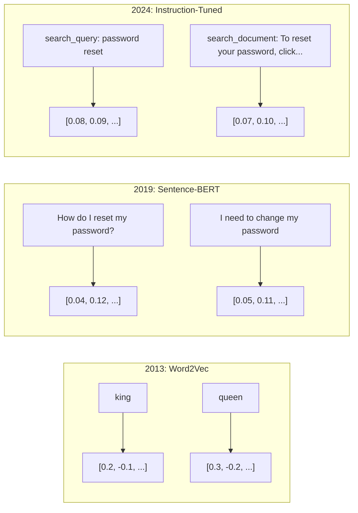
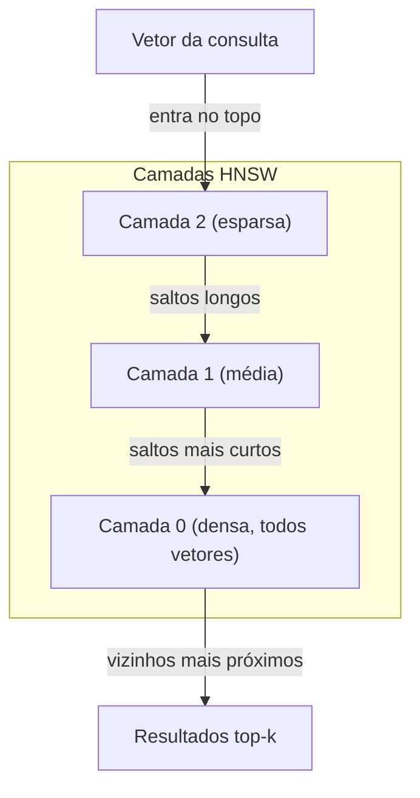

# Embeddings & Representações Vetoriais

> Texto é discreto. Matemática é contínua. Cada vez que você pede a um LLM para encontrar documentos "similares", comparar significados ou buscar além de palavras-chave, você depende de uma ponte entre esses dois mundos. Essa ponte é um embedding. Se você não entende embeddings, não entende IA moderna. Você só usa.

**Tipo:** Construção
**Linguagens:** Python
**Pré-requisitos:** Fase 11, Aula 01 (Prompt Engineering)
**Tempo:** ~75 minutos
**Relacionado:** Fase 5 · 22 (Embedding Models Deep Dive) cobre denso vs sparse vs multi-vector, truncamento Matryoshka e seleção de modelo por eixo. Esta aula foca na pipeline de produção (vector DBs, HNSW, matemática de similaridade). Leia a Fase 5 · 22 antes de escolher um modelo.

## Objetivos de Aprendizado

- Gerar embeddings de texto usando provedores de API e modelos open-source, e calcular similaridade cosseno entre eles
- Explicar por que embeddings resolvem o problema de mismatch de vocabulário que a busca por palavras-chave não consegue resolver
- Construir um índice de busca semântica que recupera documentos por significado em vez de correspondência exata de palavras-chave
- Avaliar qualidade de embeddings usando benchmarks de retrieval (precision@k, recall) e escolher o modelo de embedding certo para sua tarefa

## O Problema

Você tem 10.000 tickets de suporte. Um cliente escreve "meu pagamento não passou." Você precisa encontrar tickets similares do passado. Busca por palavras-chave encontra tickets contendo "pagamento" e "não passou." Mas perde "transação falhou," "cobrança foi recusada," e "erro de faturamento." Esses tickets descrevem o exato mesmo problema com palavras completamente diferentes.

Esse é o problema de **mismatch de vocabulário**. A linguagem humana tem dezenas de maneiras de dizer a mesma coisa. Busca por palavras-chave trata cada palavra como um símbolo independente sem significado. Ela não sabe que "recusada" e "não passou" se referem ao mesmo conceito.

Você precisa de uma representação do texto onde o significado, não a grafia, determina similaridade. Você precisa colocar "meu pagamento não passou" e "transação foi recusada" próximos em algum espaço matemático, enquanto empurra "meu pagamento chegou na hora" para longe, apesar de compartilhar a palavra "pagamento."

Essa representação é um **embedding**.

## O Conceito

### O que é um Embedding?

Um embedding é um vetor denso de números de ponto flutuante que representa o significado do texto. A palavra "denso" importa — toda dimensão carrega informação, ao contrário de representações esparsas (bag-of-words, TF-IDF) onde a maioria das dimensões é zero.

"O gato sentou no tapete" se torna algo como `[0.023, -0.041, 0.087, ..., 0.012]` — uma lista de 768 a 3072 números dependendo do modelo. Esses números codificam significado. Você nunca os inspeciona diretamente. Você os compara.

### O Breakthrough do Word2Vec

Em 2013, Tomas Mikolov e colegas do Google publicaram o Word2Vec. A ideia central: treinar uma rede neural para prever uma palavra a partir de suas vizinhas (ou vizinhas a partir de uma palavra), e os pesos da camada oculta se tornam representações vetoriais significativas.

O resultado famoso:

```
king - man + woman = queen
```

A aritmética vetorial em embeddings de palavras captura relações semânticas. A direção de "man" para "woman" é aproximadamente a mesma que de "king" para "queen." Esse foi o momento em que o campo percebeu que geometria podia codificar significado.

Word2Vec produzia vetores de 300 dimensões. Cada palavra recebia um vetor independente de contexto. "Banco" em "banco do rio" e "banco financeiro" tinham o mesmo embedding. Essa limitação impulsionou a próxima década de pesquisa.

### De Palavras para Frases

Embeddings de palavras representam tokens individuais. Sistemas de produção precisam embedar frases inteiras, parágrafos ou documentos. Quatro abordagens surgiram:

**Média (Averaging)**: tirar a média de todos os vetores de palavras na frase. Barato, perde informação, surpreendentemente decente para textos curtos. Perde a ordem das palavras completamente — "cachorro morde homem" e "homem morde cachorro" recebem embeddings idênticos.

**Token CLS**: modelos transformer (BERT, 2018) produzem um embedding especial do token [CLS] que representa a entrada inteira. Melhor que a média, mas o token [CLS] foi treinado para predição de próxima frase, não para similaridade.

**Aprendizado contrastivo**: treinar o modelo explicitamente para aproximar pares similares e afastar pares dissimilares. Sentence-BERT (Reimers & Gurevych, 2019) usou essa abordagem e se tornou a fundação dos modelos modernos de embedding. Dado "Como redefinir minha senha?" e "Preciso trocar minha senha," o modelo aprende que estes devem ter vetores quase idênticos.

**Embeddings com instrução (instruction-tuned)**: a abordagem mais recente. Modelos como E5 e GTE aceitam um prefixo de tarefa ("search_query:", "search_document:") que diz ao modelo que tipo de embedding produzir. Isso permite que um único modelo atenda múltiplas tarefas.



### Modelos Modernos de Embedding

O mercado se consolidou em algumas opções prontas para produção (pontuações MTEB do início de 2026, MTEB v2):

| Modelo | Provedor | Dimensões | MTEB | Contexto | Custo / 1M tokens |
|--------|----------|-----------|------|----------|-------------------|
| Gemini Embedding 2 | Google | 3072 (Matryoshka) | 67.7 (retrieval) | 8192 | $0.15 |
| embed-v4 | Cohere | 1024 (Matryoshka) | 65.2 | 128K | $0.12 |
| voyage-4 | Voyage AI | 1024/2048 (Matryoshka) | 66.8 | 32K | $0.12 |
| text-embedding-3-large | OpenAI | 3072 (Matryoshka) | 64.6 | 8192 | $0.13 |
| text-embedding-3-small | OpenAI | 1536 (Matryoshka) | 62.3 | 8192 | $0.02 |
| BGE-M3 | BAAI | 1024 (denso+sparse+ColBERT) | 63.0 multilíngue | 8192 | Open-weight |
| Qwen3-Embedding | Alibaba | 4096 (Matryoshka) | 66.9 | 32K | Open-weight |
| Nomic-embed-v2 | Nomic | 768 (Matryoshka) | 63.1 | 8192 | Open-weight |

MTEB (Massive Text Embedding Benchmark) v2 cobre 100+ tarefas entre retrieval, classificação, clustering, reranking e sumarização. Quanto maior, melhor. Em 2026, modelos open-weight (Qwen3-Embedding, BGE-M3) igualam ou superam modelos hospedados fechados na maioria dos eixos. Gemini Embedding 2 lidera em retrieval puro; Voyage/Cohere lideram em domínios específicos (finanças, direito, código). Sempre faça benchmark nas suas próprias consultas antes de se comprometer.

### Métricas de Similaridade

Dados dois vetores de embedding, três maneiras de medir quão similares eles são:

**Similaridade Cosseno**: o cosseno do ângulo entre dois vetores. Varia de -1 (opostos) a 1 (direção idêntica). Ignora magnitude — uma frase de 10 palavras e um documento de 500 palavras podem ter pontuação 1.0 se apontarem na mesma direção. É o padrão para 90% dos casos de uso.

```
cosine_sim(a, b) = dot(a, b) / (||a|| * ||b||)
```

**Produto Escalar (Dot Product)**: o produto interno bruto de dois vetores. Idêntico à similaridade cosseno quando os vetores são normalizados (comprimento unitário). Mais rápido de computar. Os embeddings da OpenAI são normalizados, então produto escalar e cosseno dão a mesma ordenação.

```
dot(a, b) = sum(a_i * b_i)
```

**Distância Euclidiana (L2)**: distância em linha reta no espaço vetorial. Menor = mais similar. Sensível a diferenças de magnitude. Use quando a posição absoluta no espaço importa, não apenas a direção.

```
L2(a, b) = sqrt(sum((a_i - b_i)^2))
```

Quando usar cada uma:

| Métrica | Use quando | Evite quando |
|---------|------------|--------------|
| Similaridade Cosseno | Comparando textos de comprimentos diferentes; maioria das tarefas de retrieval | Magnitude carrega informação |
| Produto Escalar | Embeddings já estão normalizados; máxima velocidade | Vetores têm magnitudes variadas |
| Distância Euclidiana | Clustering; problemas espaciais de vizinho mais próximo | Comparando documentos de comprimentos muito diferentes |

### Bancos de Dados Vetoriais e HNSW

Uma busca por similaridade por força bruta compara a consulta contra cada vetor armazenado. Com 1 milhão de vetores de 1536 dimensões, são 1.5 bilhões de operações de multiplicação-soma por consulta. Muito lento.

Bancos de dados vetoriais resolvem isso com algoritmos de **Approximate Nearest Neighbor (ANN)**. O algoritmo dominante é o **HNSW (Hierarchical Navigable Small World)**:

1. Construir um grafo multicamadas de vetores
2. Camadas superiores são esparsas — conexões de longo alcance entre clusters distantes
3. Camadas inferiores são densas — conexões finas entre vetores próximos
4. A busca começa na camada superior, descendo greedy para refinar
5. Retorna resultados aproximados top-k em tempo O(log n) em vez de O(n)

HNSW troca uma pequena perda de acurácia (tipicamente 95-99% de recall) por ganhos massivos de velocidade. Com 10 milhões de vetores, força bruta leva segundos. HNSW leva milissegundos.



Opções de produção:

| Banco | Tipo | Melhor para | Escala máxima |
|-------|------|-------------|---------------|
| Pinecone | SaaS gerenciado | Produção zero-ops | Bilhões |
| Weaviate | Open source | Auto-hospedado, busca híbrida | 100M+ |
| Qdrant | Open source | Alta performance, filtragem | 100M+ |
| ChromaDB | Embutido | Prototipagem, dev local | 1M |
| pgvector | Extensão Postgres | Já usa Postgres | 10M |
| FAISS | Biblioteca | Em processo, pesquisa | 1B+ |

### Estratégias de Chunking

Documentos são longos demais para serem embedados como um único vetor. Um PDF de 50 páginas cobre dezenas de tópicos — seu embedding vira uma média de tudo, similar a nada específico. Você divide documentos em chunks e embeda cada um.

**Chunking de tamanho fixo**: dividir a cada N tokens com sobreposição de M tokens. Simples e previsível. Funciona bem quando documentos não têm estrutura clara. Um chunk de 512 tokens com sobreposição de 50 tokens: chunk 1 é tokens 0-511, chunk 2 é tokens 462-973.

**Chunking por frase**: dividir nos limites das frases, agrupando frases até atingir o limite de tokens. Cada chunk é pelo menos uma frase completa. Melhor que tamanho fixo porque você nunca corta um pensamento no meio.

**Chunking recursivo**: tentar dividir no maior limite primeiro (cabeçalhos de seção). Se ainda muito grande, tentar limites de parágrafo. Depois limites de frase. Depois limites de caractere. É o `RecursiveCharacterTextSplitter` do LangChain e funciona bem para corpora de formato misto.

**Chunking semântico**: embedar cada frase, depois agrupar frases consecutivas cujos embeddings são similares. Quando a similaridade cai abaixo de um limiar, iniciar um novo chunk. Caro (requer embedar cada frase individualmente) mas produz os chunks mais coerentes.

| Estratégia | Complexidade | Qualidade | Melhor para |
|-----------|-------------|-----------|-------------|
| Tamanho fixo | Baixa | Decente | Texto não estruturado, logs |
| Por frase | Baixa | Boa | Artigos, emails |
| Recursivo | Média | Boa | Markdown, HTML, docs mistos |
| Semântico | Alta | Melhor | Qualidade crítica de retrieval |

O ponto ideal para a maioria dos sistemas: chunks de 256-512 tokens com sobreposição de 50 tokens.

### Bi-Encoders vs Cross-Encoders

Um **bi-encoder** embeda a consulta e os documentos independentemente, depois compara os vetores. Rápido — você embeda a consulta uma vez e compara contra embeddings de documentos pré-computados. É o que você usa para retrieval.

Um **cross-encoder** recebe a consulta e um documento como uma única entrada e produz uma pontuação de relevância. Lento — processa cada par consulta-documento através do modelo completo. Mas muito mais preciso porque pode atentar através dos tokens da consulta e do documento simultaneamente.

O padrão de produção: bi-encoder recupera top-100 candidatos, cross-encoder os reordena para top-10. Esta é a pipeline **retrieve-then-rerank**.


Modelos de reranking: Cohere Rerank 3.5 ($2 por 1000 consultas), BGE-reranker-v2 (grátis, open source), Jina Reranker v2 (grátis, open source).

### Embeddings Matryoshka

Embeddings tradicionais são tudo-ou-nada. Um vetor de 1536 dimensões usa 1536 floats. Você não pode truncar para 256 dimensões sem retreinar.

**Matryoshka Representation Learning** (Kusupati et al., 2022) resolve isso. O modelo é treinado para que as primeiras N dimensões capturem a informação mais importante, como uma boneca russa. Truncar um embedding Matryoshka de 1536-d para 256 dimensões perde alguma acurácia mas permanece funcional.

O text-embedding-3-small e text-embedding-3-large da OpenAI suportam truncamento Matryoshka via parâmetro `dimensions`. Solicitar 256 dimensões em vez de 1536 reduz o armazenamento em 6x com aproximadamente 3-5% de perda de acurácia nos benchmarks MTEB.

### Quantização Binária

Um embedding de 1536 dimensões armazenado como float32 usa 6.144 bytes. Multiplique por 10 milhões de documentos: 61 GB só para vetores.

**Quantização binária** converte cada float para um único bit: valores positivos viram 1, negativos viram 0. O armazenamento cai de 6.144 bytes para 192 bytes — uma redução de 32x. A similaridade é computada usando distância de Hamming (contar bits diferentes), que CPUs podem fazer em uma única instrução.

A perda de acurácia é de cerca de 5-10% no recall de retrieval. O padrão comum: quantização binária para a primeira passagem de busca sobre milhões de vetores, depois re-pontuar os top-1000 com vetores de precisão total. Isso dá 95%+ da acurácia de precisão total com 32x menos memória.

## Construa

Construímos um mecanismo de busca semântica do zero. Sem banco vetorial. Sem API de embedding externa. Python puro com numpy para a matemática.

### Passo 1: Chunking de Texto

```python
def chunk_text(text, chunk_size=200, overlap=50):
    words = text.split()
    chunks = []
    start = 0
    while start < len(words):
        end = start + chunk_size
        chunk = " ".join(words[start:end])
        chunks.append(chunk)
        start += chunk_size - overlap
    return chunks


def chunk_by_sentences(text, max_chunk_tokens=200):
    sentences = text.replace("\n", " ").split(".")
    sentences = [s.strip() + "." for s in sentences if s.strip()]
    chunks = []
    current_chunk = []
    current_length = 0
    for sentence in sentences:
        sentence_length = len(sentence.split())
        if current_length + sentence_length > max_chunk_tokens and current_chunk:
            chunks.append(" ".join(current_chunk))
            current_chunk = []
            current_length = 0
        current_chunk.append(sentence)
        current_length += sentence_length
    if current_chunk:
        chunks.append(" ".join(current_chunk))
    return chunks
```

### Passo 2: Construindo Embeddings do Zero

Implementamos um embedding denso simples usando TF-IDF com normalização L2. Não é um embedding neural, mas segue o mesmo contrato: texto entra, vetor de tamanho fixo sai, textos similares produzem vetores similares.

```python
import math
import numpy as np
from collections import Counter

class SimpleEmbedder:
    def __init__(self):
        self.vocab = []
        self.idf = []
        self.word_to_idx = {}

    def fit(self, documents):
        vocab_set = set()
        for doc in documents:
            vocab_set.update(doc.lower().split())
        self.vocab = sorted(vocab_set)
        self.word_to_idx = {w: i for i, w in enumerate(self.vocab)}
        n = len(documents)
        self.idf = np.zeros(len(self.vocab))
        for i, word in enumerate(self.vocab):
            doc_count = sum(1 for doc in documents if word in doc.lower().split())
            self.idf[i] = math.log((n + 1) / (doc_count + 1)) + 1

    def embed(self, text):
        words = text.lower().split()
        count = Counter(words)
        total = len(words) if words else 1
        vec = np.zeros(len(self.vocab))
        for word, freq in count.items():
            if word in self.word_to_idx:
                tf = freq / total
                vec[self.word_to_idx[word]] = tf * self.idf[self.word_to_idx[word]]
        norm = np.linalg.norm(vec)
        if norm > 0:
            vec = vec / norm
        return vec
```

### Passo 3: Funções de Similaridade

```python
def cosine_similarity(a, b):
    dot = np.dot(a, b)
    norm_a = np.linalg.norm(a)
    norm_b = np.linalg.norm(b)
    if norm_a == 0 or norm_b == 0:
        return 0.0
    return float(dot / (norm_a * norm_b))


def dot_product(a, b):
    return float(np.dot(a, b))


def euclidean_distance(a, b):
    return float(np.linalg.norm(a - b))
```

### Passo 4: Índice Vetorial com Busca por Força Bruta

```python
class VectorIndex:
    def __init__(self):
        self.vectors = []
        self.texts = []
        self.metadata = []

    def add(self, vector, text, meta=None):
        self.vectors.append(vector)
        self.texts.append(text)
        self.metadata.append(meta or {})

    def search(self, query_vector, top_k=5, metric="cosine"):
        scores = []
        for i, vec in enumerate(self.vectors):
            if metric == "cosine":
                score = cosine_similarity(query_vector, vec)
            elif metric == "dot":
                score = dot_product(query_vector, vec)
            elif metric == "euclidean":
                score = -euclidean_distance(query_vector, vec)
            else:
                raise ValueError(f"Métrica desconhecida: {metric}")
            scores.append((i, score))
        scores.sort(key=lambda x: x[1], reverse=True)
        results = []
        for idx, score in scores[:top_k]:
            results.append({
                "text": self.texts[idx],
                "score": score,
                "metadata": self.metadata[idx],
                "index": idx
            })
        return results

    def size(self):
        return len(self.vectors)
```

### Passo 5: O Mecanismo de Busca Semântica

```python
class SemanticSearchEngine:
    def __init__(self, chunk_size=200, overlap=50):
        self.embedder = SimpleEmbedder()
        self.index = VectorIndex()
        self.chunk_size = chunk_size
        self.overlap = overlap

    def index_documents(self, documents, source_names=None):
        all_chunks = []
        all_sources = []
        for i, doc in enumerate(documents):
            chunks = chunk_text(doc, self.chunk_size, self.overlap)
            all_chunks.extend(chunks)
            name = source_names[i] if source_names else f"doc_{i}"
            all_sources.extend([name] * len(chunks))
        self.embedder.fit(all_chunks)
        for chunk, source in zip(all_chunks, all_sources):
            vec = self.embedder.embed(chunk)
            self.index.add(vec, chunk, {"source": source})
        return len(all_chunks)

    def search(self, query, top_k=5, metric="cosine"):
        query_vec = self.embedder.embed(query)
        return self.index.search(query_vec, top_k, metric)

    def search_with_scores(self, query, top_k=5):
        results = self.search(query, top_k)
        return [
            {
                "text": r["text"][:200],
                "source": r["metadata"].get("source", "unknown"),
                "score": round(r["score"], 4)
            }
            for r in results
        ]
```

### Passo 6: Comparando Métricas de Similaridade

```python
def compare_metrics(engine, query, top_k=3):
    results = {}
    for metric in ["cosine", "dot", "euclidean"]:
        hits = engine.search(query, top_k=top_k, metric=metric)
        results[metric] = [
            {"score": round(h["score"], 4), "preview": h["text"][:80]}
            for h in hits
        ]
    return results
```

## Use

Com uma API de embedding de produção, a arquitetura permanece idêntica. Apenas o embedder muda:

```python
from openai import OpenAI

client = OpenAI()

def openai_embed(texts, model="text-embedding-3-small", dimensions=None):
    kwargs = {"model": model, "input": texts}
    if dimensions:
        kwargs["dimensions"] = dimensions
    response = client.embeddings.create(**kwargs)
    return [item.embedding for item in response.data]
```

Truncamento Matryoshka com OpenAI — mesmo modelo, menos dimensões, menos armazenamento:

```python
full = openai_embed(["consulta de busca semântica"], dimensions=1536)
compact = openai_embed(["consulta de busca semântica"], dimensions=256)
```

O vetor de 256-d usa 6x menos armazenamento. Para 10 milhões de documentos, isso é 10 GB vs 61 GB. A perda de acurácia é de aproximadamente 3-5% nos benchmarks padrão.

Para reranking com Cohere:

```python
import cohere

co = cohere.ClientV2()

results = co.rerank(
    model="rerank-v3.5",
    query="Qual é a política de reembolso?",
    documents=["Reembolso total em até 30 dias...", "Sem reembolsos após 90 dias..."],
    top_n=3
)
```

Para embeddings locais sem dependência de API:

```python
from sentence_transformers import SentenceTransformer

model = SentenceTransformer("BAAI/bge-small-en-v1.5")
embeddings = model.encode(["consulta de busca semântica", "outro documento"])
```

A classe VectorIndex da nossa construção funciona com qualquer um desses. Troque a função de embedding, mantenha a lógica de busca.

## Entregue

Esta aula produz:
- `outputs/prompt-embedding-advisor.md` — um prompt para escolher modelos e estratégias de embedding para casos de uso específicos
- `outputs/skill-embedding-patterns.md` — uma skill que ensina agentes a usar embeddings efetivamente em produção

## Exercícios

1. **Comparação de métricas**: execute as mesmas 5 consultas contra os documentos de exemplo usando similaridade cosseno, produto escalar e distância euclidiana. Registre os top-3 resultados para cada. Para quais consultas as métricas discordam? Por quê?

2. **Experimento de tamanho de chunk**: indexe os documentos de exemplo com tamanhos de chunk de 50, 100, 200 e 500 palavras. Para cada, execute 5 consultas e registre a pontuação de similaridade do top-1. Plote a relação entre tamanho do chunk e qualidade de retrieval. Encontre o ponto onde chunks maiores começam a prejudicar.

3. **Simulação Matryoshka**: construa um SimpleEmbedder que produz vetores de 500-d. Trunque para 50, 100, 200 e 500 dimensões. Meça como o recall de retrieval degrada em cada truncamento. Isso simula o comportamento Matryoshka sem precisar do truque de treinamento real.

4. **Quantização binária**: pegue os embeddings do motor de busca, converta-os para binário (1 se positivo, 0 se negativo) e implemente busca por distância de Hamming. Compare os resultados top-10 contra similaridade cosseno de precisão total. Meça a porcentagem de sobreposição.

5. **Chunking por frase**: substitua o chunking de tamanho fixo por `chunk_by_sentences`. Execute as mesmas consultas e compare as pontuações de retrieval. Respeitar limites de frase melhora os resultados?

## Termos-Chave

| Termo | O que o pessoal diz | O que realmente significa |
|-------|--------------------|--------------------------|
| Embedding | "Texto para números" | Um vetor denso onde proximidade geométrica codifica similaridade semântica |
| Word2Vec | "O embedding OG" | Modelo de 2013 que aprendia vetores de palavras prevendo palavras de contexto; provou que aritmética vetorial codifica significado |
| Similaridade Cosseno | "Quão similares são dois vetores" | Cosseno do ângulo entre vetores; 1 = direção idêntica, 0 = ortogonal, -1 = oposto |
| HNSW | "Busca vetorial rápida" | Grafo Hierárquico Navegável Small World — estrutura multicamadas que permite busca aproximada O(log n) do vizinho mais próximo |
| Bi-encoder | "Embedar separado, comparar rápido" | Codifica consulta e documento independentemente em vetores; permite pré-computação e retrieval rápido |
| Cross-encoder | "Reranker lento mas preciso" | Processa par consulta-documento conjuntamente através do modelo completo; maior acurácia, sem pré-computação |
| Embeddings Matryoshka | "Vetores truncáveis" | Embeddings treinados para que as primeiras N dimensões capturem a informação mais importante, permitindo armazenamento de tamanho variável |
| Quantização binária | "Embeddings de 1 bit" | Converter vetores float para binário (apenas bit de sinal) para redução de 32x no armazenamento com busca por distância de Hamming |
| Chunking | "Dividir docs para embedding" | Quebrar documentos em segmentos de 256-512 tokens para que cada um possa ser embedado e recuperado independentemente |
| Banco de dados vetorial | "Mecanismo de busca para embeddings" | Armazenamento otimizado para guardar vetores e realizar busca aproximada do vizinho mais próximo em escala |
| Aprendizado contrastivo | "Treinar por comparação" | Abordagem de treino que aproxima embeddings de pares similares e afasta embeddings de pares dissimilares |
| MTEB | "O benchmark de embeddings" | Massive Text Embedding Benchmark — 56 datasets em 8 tarefas; padrão para comparar modelos de embedding |

## Leitura Adicional

- [Mikolov et al., "Efficient Estimation of Word Representations in Vector Space" (2013)](https://arxiv.org/abs/1301.3781) — o paper Word2Vec que começou a revolução dos embeddings com a analogia king-queen
- [Reimers & Gurevych, "Sentence-BERT: Sentence Embeddings using Siamese BERT-Networks" (2019)](https://arxiv.org/abs/1908.10084) — como treinar bi-encoders para similaridade em nível de frase, fundação dos modelos modernos de embedding
- [Kusupati et al., "Matryoshka Representation Learning" (2022)](https://arxiv.org/abs/2205.13147) — a técnica por trás dos embeddings de dimensão variável que a OpenAI adotou para text-embedding-3
- [Malkov & Yashunin, "Efficient and Robust Approximate Nearest Neighbor using Hierarchical Navigable Small World Graphs" (2018)](https://arxiv.org/abs/1603.09320) — o paper HNSW, algoritmo por trás da maioria das buscas vetoriais em produção
- [OpenAI Embeddings Guide](https://platform.openai.com/docs/guides/embeddings) — referência prática para modelos text-embedding-3 incluindo redução de dimensão Matryoshka
- [MTEB Leaderboard](https://huggingface.co/spaces/mteb/leaderboard) — benchmark ao vivo comparando todos os modelos de embedding entre tarefas e idiomas
- [Muennighoff et al., "MTEB: Massive Text Embedding Benchmark" (EACL 2023)](https://arxiv.org/abs/2210.07316) — o benchmark que define 8 categorias de tarefas; leia antes de confiar em qualquer pontuação MTEB isolada
- [Sentence Transformers documentation](https://www.sbert.net/) — referência canônica para bi-encoder vs cross-encoder, estratégias de pooling e a pipeline ingest-split-embed-store RAG que esta aula implementa
