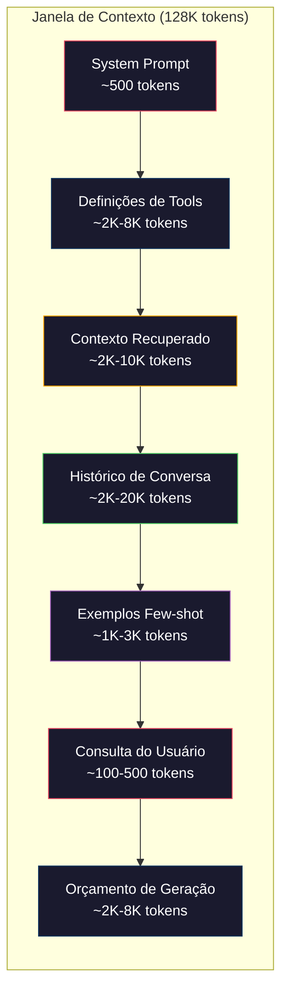
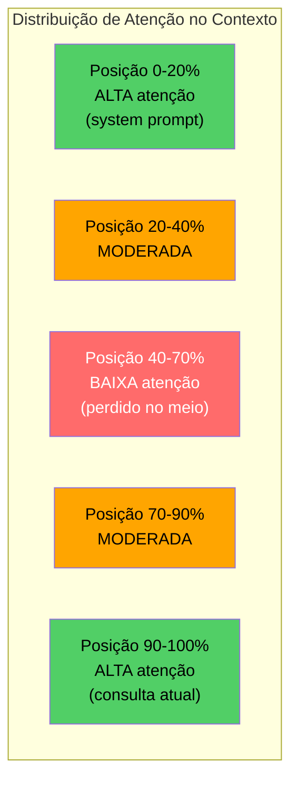
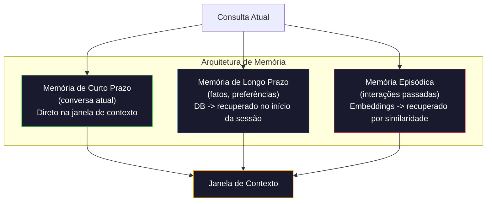

# Context Engineering: Janelas, Orçamentos, Memória e Retrieval

> Prompt engineering é um subconjunto. Context engineering é o jogo inteiro. Um prompt é uma string que você digita. Contexto é tudo que entra na janela do modelo: instruções do sistema, documentos recuperados, definições de tools, histórico de conversa, exemplos few-shot e o próprio prompt. Os melhores engenheiros de IA em 2026 são engenheiros de contexto. Eles decidem o que entra, o que fica de fora e em que ordem.

**Tipo:** Construção
**Linguagens:** Python
**Pré-requisitos:** Fase 10 (LLMs do Zero), Fase 11 Aulas 01-02
**Tempo:** ~90 minutos
**Relacionado:** Fase 11 · 15 (Prompt Caching) — o layout amigável a cache é uma extensão do context engineering. Fase 5 · 28 (Long-Context Evaluation) para como medir lost-in-the-middle com NIAH/RULER.

## Objetivos de Aprendizado

- Calcular orçamentos de token em todos os componentes da janela de contexto (system prompt, tools, history, docs recuperados, espaço para geração)
- Implementar estratégias de gerenciamento da janela de contexto: truncamento, sumarização e sliding window para histórico de conversa
- Priorizar e ordenar componentes de contexto para maximizar a atenção do modelo nas informações mais relevantes
- Construir um montador de contexto que aloca tokens dinamicamente baseado no tipo de consulta e espaço disponível na janela

## O Problema

Claude Opus 4.7 tem uma janela de 200K tokens (1M em beta). GPT-5 tem 400K. Gemini 3 Pro tem 2M. Llama 4 alega 10M. Esses números parecem enormes até você preenchê-los.

Aqui está uma decomposição real para um assistente de código. System prompt: 500 tokens. Definições de ferramentas para 50 ferramentas: 8.000 tokens. Documentação recuperada: 4.000 tokens. Histórico de conversa (10 turnos): 6.000 tokens. Consulta atual do usuário: 200 tokens. Orçamento de geração (max output): 4.000 tokens. Total: 22.700 tokens. Isso é apenas 18% de uma janela de 128K.

Mas a atenção não escala linearmente com o comprimento do contexto. Um modelo com 128K tokens de contexto paga custo de atenção quadrático (O(n²) em transformers vanilla, embora a maioria dos modelos de produção use variantes de atenção eficientes). Mais importante, a acurácia do retrieval degrada. O teste "Needle in a Haystack" mostra que modelos têm dificuldade em encontrar informações colocadas no meio de contextos longos. Pesquisa de Liu et al. (2023) mostrou que LLMs recuperam informações no início e no fim de contextos longos com acurácia quase perfeita, mas a acurácia cai 10-20% para informações colocadas no meio (posições 40-70% do contexto). Esse efeito "lost-in-the-middle" varia por modelo mas afeta todas as arquiteturas atuais.

A lição prática: ter 200K tokens disponíveis não significa que usar 200K tokens é eficaz. Um contexto cuidadosamente curado de 10K tokens frequentemente supera um contexto despejado de 100K tokens. Context engineering é a disciplina de maximizar a relação sinal-ruído dentro da janela de contexto.

Cada token que você coloca na janela desloca um token que poderia carregar informação mais relevante. Cada definição de tool irrelevante, cada turno de conversa obsoleto, cada chunk de texto recuperado que não responde à pergunta — cada um torna o modelo ligeiramente pior na tarefa.

## O Conceito

### A Janela de Contexto é um Recurso Escasso

Pense na janela de contexto como RAM, não disco. É rápida e diretamente acessível, mas limitada. Você não pode colocar tudo. Você deve escolher.



Cada componente compete por espaço. Adicionar mais definições de tools significa menos espaço para histórico de conversa. Adicionar mais contexto recuperado significa menos espaço para exemplos few-shot. Context engineering é a arte de alocar esse orçamento para maximizar o desempenho da tarefa.

### Lost-in-the-Middle

A descoberta empírica mais importante em context engineering. Modelos prestam mais atenção a informações no início e no fim do contexto. Informações no meio recebem pontuações de atenção mais baixas e têm mais chance de serem ignoradas.

Liu et al. (2023) testaram isso sistematicamente. Colocaram um documento relevante entre 20 documentos irrelevantes em várias posições e mediram a acurácia da resposta. Quando o documento relevante era o primeiro ou o último, a acurácia era de 85-90%. Quando estava no meio (posição 10 de 20), a acurácia caía para 60-70%.

Isso tem implicações diretas de engenharia:

- Coloque a informação mais importante primeiro (system prompt, instruções críticas)
- Coloque a consulta atual e o contexto mais relevante por último (viés de recência ajuda)
- Trate o meio do contexto como a zona de menor prioridade
- Se precisar incluir informação no meio, duplique o ponto-chave no final



### Componentes do Contexto

**System prompt**: define a persona, restrições e regras comportamentais. Vai primeiro e permanece constante entre turnos. Claude Code usa cerca de 6.000 tokens para seu system prompt incluindo definições de ferramentas e instruções comportamentais. Mantenha enxuto. Cada palavra no system prompt é repetida em toda chamada de API.

**Definições de ferramentas**: cada ferramenta adiciona 50-200 tokens (nome, descrição, schema de parâmetros). 50 ferramentas a 150 tokens cada são 7.500 tokens antes de qualquer conversa acontecer. Seleção dinâmica de ferramentas — incluindo apenas ferramentas relevantes para a consulta atual — pode reduzir isso em 60-80%.

**Contexto recuperado**: documentos de um banco vetorial, resultados de busca, conteúdos de arquivos. A qualidade do retrieval determina diretamente a qualidade da resposta. Retrieval ruim é pior que nenhum retrieval — enche a janela com ruído e engana ativamente o modelo.

**Histórico de conversa**: toda mensagem anterior do usuário e resposta do assistente. Cresce linearmente com o comprimento da conversa. Uma conversa de 50 turnos a 200 tokens por turno são 10.000 tokens de histórico. A maior parte é irrelevante para a consulta atual.

**Exemplos few-shot**: pares entrada/saída que demonstram o comportamento desejado. Dois a três exemplos bem escolhidos frequentemente melhoram a qualidade do output mais que milhares de tokens de instruções. Mas custam espaço.

**Orçamento de geração**: os tokens reservados para a resposta do modelo. Se você encher a janela até a capacidade, o modelo não tem espaço para responder. Reserve pelo menos 2.000-4.000 tokens para geração.

### Estratégias de Compressão de Contexto

**Sumarização de histórico**: em vez de manter todos os turnos anteriores verbatim, sumarize periodicamente a conversa. "Discutimos X, decidimos Y, e o usuário quer Z" em 100 tokens substitui 10 turnos que ocupavam 2.000 tokens. Execute a sumarização quando o histórico exceder um limite (ex.: 5.000 tokens).

**Filtragem por relevância**: pontue cada documento recuperado contra a consulta atual e descarte documentos abaixo de um limiar. Se você recuperou 10 chunks mas apenas 3 são relevantes, descarte os outros 7. Melhor ter 3 chunks altamente relevantes do que 10 medíocres.

**Poda de ferramentas**: classifique a intenção da consulta do usuário e inclua apenas ferramentas relevantes para essa intenção. Uma pergunta de código não precisa de ferramentas de calendário. Uma pergunta de agendamento não precisa de ferramentas de sistema de arquivos. Isso pode reduzir definições de ferramentas de 8.000 tokens para 1.000.

**Sumarização recursiva**: para documentos muito longos, sumarize em estágios. Primeiro sumarize cada seção, depois sumarize as sumarizações. Um documento de 50 páginas se torna um resumo de 500 tokens que captura os pontos-chave.

### Sistemas de Memória

Context engineering abrange três horizontes de tempo.

**Memória de curto prazo**: a conversa atual. Armazenada diretamente na janela de contexto. Cresce a cada turno. Gerenciada por sumarização e truncamento.

**Memória de longo prazo**: fatos e preferências que persistem entre conversas. "O usuário prefere TypeScript." "O projeto usa PostgreSQL." Armazenada em um banco de dados, recuperada no início da sessão. Claude Code armazena isso em arquivos CLAUDE.md. ChatGPT armazena no recurso de memória.

**Memória episódica**: interações passadas específicas que podem ser relevantes. "Terça-feira passada, debugamos um problema similar no módulo de autenticação." Armazenada como embeddings, recuperada quando a conversa atual corresponde a um episódio passado.



### Montagem Dinâmica de Contexto

A percepção chave: consultas diferentes precisam de contextos diferentes. Um system prompt estático + ferramentas estáticas + histórico estático é desperdício. Os melhores sistemas montam contexto dinamicamente por consulta.

1. Classifique a intenção da consulta
2. Selecione ferramentas relevantes (não todas)
3. Recupere documentos relevantes (não um conjunto fixo)
4. Inclua turnos de histórico relevantes (não todo o histórico)
5. Adicione exemplos few-shot que correspondam ao tipo de tarefa
6. Ordene tudo por importância: crítico primeiro, importante por último, opcional no meio

Isso é o que separa uma boa aplicação de IA de uma excelente. O modelo é o mesmo. O contexto é o diferencial.

## Construa

### Passo 1: Contador de Tokens

Você não pode orçar o que não pode medir. Construa um contador de tokens simples (aproximação usando divisão por espaços em branco, já que a contagem exata depende do tokenizer).

```python
import json
import numpy as np
from collections import OrderedDict

def count_tokens(text):
    if not text:
        return 0
    return int(len(text.split()) * 1.3)

def count_tokens_json(obj):
    return count_tokens(json.dumps(obj))
```

### Passo 2: Gerenciador de Orçamento de Contexto

A abstração central. Um gerenciador de orçamento rastreia quantos tokens cada componente usa e impõe limites.

```python
class ContextBudget:
    def __init__(self, max_tokens=128000, generation_reserve=4000):
        self.max_tokens = max_tokens
        self.generation_reserve = generation_reserve
        self.available = max_tokens - generation_reserve
        self.allocations = OrderedDict()

    def allocate(self, component, content, max_tokens=None):
        tokens = count_tokens(content)
        if max_tokens and tokens > max_tokens:
            words = content.split()
            target_words = int(max_tokens / 1.3)
            content = " ".join(words[:target_words])
            tokens = count_tokens(content)

        used = sum(self.allocations.values())
        if used + tokens > self.available:
            allowed = self.available - used
            if allowed <= 0:
                return None, 0
            words = content.split()
            target_words = int(allowed / 1.3)
            content = " ".join(words[:target_words])
            tokens = count_tokens(content)

        self.allocations[component] = tokens
        return content, tokens

    def remaining(self):
        used = sum(self.allocations.values())
        return self.available - used

    def utilization(self):
        used = sum(self.allocations.values())
        return used / self.max_tokens

    def report(self):
        total_used = sum(self.allocations.values())
        lines = []
        lines.append(f"Relatório de Orçamento de Contexto (janela de {self.max_tokens:,} tokens)")
        lines.append("-" * 50)
        for component, tokens in self.allocations.items():
            pct = tokens / self.max_tokens * 100
            bar = "#" * int(pct / 2)
            lines.append(f"  {component:<25} {tokens:>6} tokens ({pct:>5.1f}%) {bar}")
        lines.append("-" * 50)
        lines.append(f"  {'Usado':<25} {total_used:>6} tokens ({total_used/self.max_tokens*100:.1f}%)")
        lines.append(f"  {'Reserva de geração':<25} {self.generation_reserve:>6} tokens")
        lines.append(f"  {'Restante':<25} {self.remaining():>6} tokens")
        return "\n".join(lines)
```

### Passo 3: Reordenação Lost-in-the-Middle

Implemente a estratégia de reordenação: itens mais importantes vão primeiro e por último, menos importantes no meio.

```python
def reorder_lost_in_middle(items, scores):
    paired = sorted(zip(scores, items), reverse=True)
    sorted_items = [item for _, item in paired]

    if len(sorted_items) <= 2:
        return sorted_items

    first_half = sorted_items[::2]
    second_half = sorted_items[1::2]
    second_half.reverse()

    return first_half + second_half

def score_relevance(query, documents):
    query_words = set(query.lower().split())
    scores = []
    for doc in documents:
        doc_words = set(doc.lower().split())
        if not query_words:
            scores.append(0.0)
            continue
        overlap = len(query_words & doc_words) / len(query_words)
        scores.append(round(overlap, 3))
    return scores
```

### Passo 4: Compressor de Histórico de Conversa

Sumarize turnos de conversa antigos para recuperar orçamento de tokens.

```python
class ConversationManager:
    def __init__(self, max_history_tokens=5000):
        self.turns = []
        self.summaries = []
        self.max_history_tokens = max_history_tokens

    def add_turn(self, role, content):
        self.turns.append({"role": role, "content": content})
        self._compress_if_needed()

    def _compress_if_needed(self):
        total = sum(count_tokens(t["content"]) for t in self.turns)
        if total <= self.max_history_tokens:
            return

        while total > self.max_history_tokens and len(self.turns) > 2:
            oldest = self.turns.pop(0)
            summary_text = f"[Turno resumido: {oldest['content'][:50]}...]"
            self.summaries.append(summary_text)
            total = sum(count_tokens(t["content"]) for t in self.turns)

    def get_context(self):
        parts = []
        if self.summaries:
            summary = " ".join(self.summaries)
            parts.append(f"[Resumo da conversa anterior]: {summary}")
        for turn in self.turns:
            parts.append(f"{turn['role']}: {turn['content']}")
        return "\n".join(parts)

    def stats(self):
        total = sum(count_tokens(t["content"]) for t in self.turns)
        return {
            "turns": len(self.turns),
            "summaries": len(self.summaries),
            "total_tokens": total,
        }
```

### Passo 5: Seleção Inteligente de Ferramentas

Classifique a intenção da consulta e inclua apenas ferramentas relevantes.

```python
TOOL_REGISTRY = {
    "read_file": {
        "description": "Read a file from the filesystem",
        "tokens": 150,
        "categories": ["code", "files"],
    },
    "write_file": {
        "description": "Write content to a file",
        "tokens": 150,
        "categories": ["code", "files"],
    },
    "search_code": {
        "description": "Search for patterns in codebase",
        "tokens": 130,
        "categories": ["code"],
    },
    "run_command": {
        "description": "Execute a shell command",
        "tokens": 140,
        "categories": ["code", "system"],
    },
    "create_calendar_event": {
        "description": "Create a new calendar event",
        "tokens": 180,
        "categories": ["calendar"],
    },
    "list_emails": {
        "description": "List recent emails",
        "tokens": 160,
        "categories": ["email"],
    },
    "send_email": {
        "description": "Send an email message",
        "tokens": 200,
        "categories": ["email"],
    },
    "web_search": {
        "description": "Search the web for information",
        "tokens": 140,
        "categories": ["research"],
    },
    "query_database": {
        "description": "Run a SQL query on the database",
        "tokens": 170,
        "categories": ["code", "data"],
    },
    "generate_chart": {
        "description": "Generate a chart from data",
        "tokens": 190,
        "categories": ["data", "visualization"],
    },
}

def classify_intent(query):
    query_lower = query.lower()

    intent_keywords = {
        "code": ["code", "function", "bug", "error", "file", "implement", "refactor", "debug", "test"],
        "calendar": ["meeting", "schedule", "calendar", "appointment", "event"],
        "email": ["email", "mail", "send", "inbox", "message"],
        "research": ["search", "find", "what is", "how does", "explain", "look up"],
        "data": ["data", "query", "database", "chart", "graph", "analytics", "sql"],
    }

    scores = {}
    for intent, keywords in intent_keywords.items():
        score = sum(1 for kw in keywords if kw in query_lower)
        if score > 0:
            scores[intent] = score

    if not scores:
        return ["code"]

    max_score = max(scores.values())
    return [intent for intent, score in scores.items() if score >= max_score * 0.5]

def select_tools(query, token_budget=2000):
    intents = classify_intent(query)
    relevant = {}
    total_tokens = 0

    for name, tool in TOOL_REGISTRY.items():
        if any(cat in intents for cat in tool["categories"]):
            if total_tokens + tool["tokens"] <= token_budget:
                relevant[name] = tool
                total_tokens += tool["tokens"]

    return relevant, total_tokens
```

### Passo 6: Pipeline Completa de Montagem de Contexto

Conecte tudo. Dada uma consulta, monte dinamicamente o contexto ótimo.

```python
class ContextEngine:
    def __init__(self, max_tokens=128000, generation_reserve=4000):
        self.budget = ContextBudget(max_tokens, generation_reserve)
        self.conversation = ConversationManager(max_history_tokens=5000)
        self.system_prompt = (
            "Você é um assistente de IA útil. Você tem acesso a ferramentas para "
            "edição de código, gerenciamento de arquivos, busca na web e análise de dados. "
            "Use as ferramentas apropriadas para cada tarefa. Seja conciso e preciso."
        )
        self.knowledge_base = [
            "Python 3.12 introduziu sintaxe de parâmetros de tipo para classes genéricas usando notação de colchetes.",
            "O projeto usa PostgreSQL 16 com pgvector para armazenamento de embeddings.",
            "A autenticação é gerenciada pelo Supabase Auth com tokens JWT.",
            "O frontend é construído com Next.js 15 usando App Router.",
            "Limites de taxa da API são 100 requisições por minuto por usuário.",
            "A pipeline de deploy usa GitHub Actions com builds multi-estágio Docker.",
            "Cobertura de teste deve estar acima de 80% para todos os novos módulos.",
            "A base de código segue o padrão repository para acesso a dados.",
        ]

    def assemble(self, query):
        self.budget = ContextBudget(self.budget.max_tokens, self.budget.generation_reserve)

        system_content, _ = self.budget.allocate("system_prompt", self.system_prompt, max_tokens=1000)

        tools, tool_tokens = select_tools(query, token_budget=2000)
        tool_text = json.dumps(list(tools.keys()))
        tool_content, _ = self.budget.allocate("tools", tool_text, max_tokens=2000)

        relevance = score_relevance(query, self.knowledge_base)
        threshold = 0.1
        relevant_docs = [
            doc for doc, score in zip(self.knowledge_base, relevance)
            if score >= threshold
        ]

        if relevant_docs:
            doc_scores = [s for s in relevance if s >= threshold]
            reordered = reorder_lost_in_middle(relevant_docs, doc_scores)
            doc_text = "\n".join(reordered)
            doc_content, _ = self.budget.allocate("retrieved_context", doc_text, max_tokens=3000)

        history_text = self.conversation.get_context()
        if history_text.strip():
            history_content, _ = self.budget.allocate("conversation_history", history_text, max_tokens=5000)

        query_content, _ = self.budget.allocate("user_query", query, max_tokens=500)

        return self.budget

    def chat(self, query):
        self.conversation.add_turn("user", query)
        budget = self.assemble(query)
        response = f"[Resposta para: {query[:50]}...]"
        self.conversation.add_turn("assistant", response)
        return budget


def run_demo():
    print("=" * 60)
    print("  Demonstração da Pipeline de Context Engineering")
    print("=" * 60)

    engine = ContextEngine(max_tokens=128000, generation_reserve=4000)

    print("\n--- Consulta 1: Tarefa de código ---")
    budget = engine.chat("Corrigir o bug no módulo de autenticação onde tokens JWT expiram muito cedo")
    print(budget.report())

    print("\n--- Consulta 2: Tarefa de pesquisa ---")
    budget = engine.chat("Qual a melhor abordagem para implementar busca vetorial no PostgreSQL?")
    print(budget.report())

    print("\n--- Consulta 3: Após histórico de conversa acumular ---")
    for i in range(8):
        engine.conversation.add_turn("user", f"Pergunta de acompanhamento número {i+1} sobre detalhes de implementação do sistema")
        engine.conversation.add_turn("assistant", f"Aqui está a resposta para acompanhamento {i+1} com detalhes técnicos sobre a arquitetura")

    budget = engine.chat("Agora implemente as mudanças que discutimos")
    print(budget.report())

    print("\n--- Exemplos de Seleção de Ferramentas ---")
    test_queries = [
        "Corrigir o bug em auth.py",
        "Agendar uma reunião com o time para terça",
        "Mostrar as estatísticas de performance da query no banco",
        "Buscar melhores práticas sobre tratamento de erros",
    ]

    for q in test_queries:
        tools, tokens = select_tools(q)
        intents = classify_intent(q)
        print(f"\n  Consulta: {q}")
        print(f"  Intenções: {intents}")
        print(f"  Ferramentas: {list(tools.keys())} ({tokens} tokens)")

    print("\n--- Reordenação Lost-in-the-Middle ---")
    docs = ["Doc A (mais relevante)", "Doc B (um pouco relevante)", "Doc C (menos relevante)",
            "Doc D (relevante)", "Doc E (moderadamente relevante)"]
    scores = [0.95, 0.60, 0.20, 0.80, 0.50]
    reordered = reorder_lost_in_middle(docs, scores)
    print(f"  Ordem original: {docs}")
    print(f"  Pontuações:     {scores}")
    print(f"  Reordenado:     {reordered}")
    print(f"  (Mais relevantes no início e fim, menos relevantes no meio)")
```

## Use

### Estratégia de Contexto do Claude Code

Claude Code gerencia contexto com uma abordagem em camadas. O system prompt inclui regras comportamentais e definições de ferramentas (~6K tokens). Quando você abre um arquivo, seu conteúdo é injetado como contexto. Quando você busca, resultados são adicionados. Turnos de conversa antigos são sumarizados. CLAUDE.md fornece memória de longo prazo que persiste entre sessões.

A decisão chave de engenharia: Claude Code não despeja sua base de código inteira no contexto. Ele recupera arquivos relevantes sob demanda. Isso é context engineering na prática.

### Carregamento Dinâmico de Contexto do Cursor

Cursor indexa sua base de código inteira em embeddings. Quando você digita uma consulta, ele recupera os arquivos e blocos de código mais relevantes usando similaridade vetorial. Apenas essas peças vão para a janela de contexto. Uma base de código de 500K linhas é comprimida nos 5-10 blocos de código mais relevantes.

Esse é o padrão: embedar tudo, recuperar sob demanda, incluir apenas o que importa.

### Memória do ChatGPT

ChatGPT armazena preferências e fatos do usuário como memória de longo prazo. No início de cada conversa, memórias relevantes são recuperadas e incluídas no system prompt. "O usuário prefere Python" custa 5 tokens mas economiza centenas de tokens de instruções repetidas entre conversas.

### RAG como Context Engineering

Retrieval-Augmented Generation é context engineering formalizado. Em vez de enfiar conhecimento nos pesos do modelo (treinamento) ou no system prompt (contexto estático), você recupera documentos relevantes no momento da consulta e os injeta na janela de contexto. Toda a pipeline de RAG — chunking, embedding, retrieval, reranking — existe para resolver um problema: colocar a informação certa na janela de contexto.

## Entregue

Esta aula produz `outputs/prompt-context-optimizer.md` — um prompt reutilizável que audita uma estratégia de montagem de contexto e recomenda otimizações. Alimente-o com seu system prompt, contagem de ferramentas, tamanho médio de histórico e estratégia de retrieval, e ele identifica desperdício de tokens e sugere melhorias.

Também produz `outputs/skill-context-engineering.md` — um framework de decisão para projetar pipelines de montagem de contexto baseado no tipo de tarefa, tamanho da janela e orçamento de latência.

## Exercícios

1. Adicione um "detector de desperdício de token" à classe ContextBudget. Ele deve sinalizar componentes usando mais de 30% do orçamento e sugerir estratégias de compressão específicas para cada tipo de componente (sumarizar histórico, podar ferramentas, re-ranquear documentos).

2. Implemente deduplicação semântica para contexto recuperado. Se dois documentos recuperados são mais de 80% similares (por sobreposição de palavras ou similaridade cosseno de seus embeddings), mantenha apenas o de maior pontuação. Meça quanto orçamento de token isso recupera.

3. Construa uma ferramenta de "replay de contexto". Dada uma transcrição de conversa, reabra-a pela ContextEngine e visualize como a alocação de orçamento muda a cada turno. Plote o uso de tokens por componente ao longo do tempo. Identifique o turno onde o contexto começa a ser comprimido.

4. Implemente um seletor de ferramentas baseado em prioridade. Em vez de incluir/excluir binariamente, atribua a cada ferramenta uma pontuação de relevância para a consulta atual. Inclua ferramentas em ordem decrescente de relevância até o orçamento de ferramentas ser exaurido. Compare o desempenho da tarefa com 5, 10, 20 e 50 ferramentas incluídas.

5. Construa um compressor de contexto multi-estratégia. Implemente três estratégias de compressão (truncamento, sumarização, extração de frases-chave) e faça benchmark em um conjunto de 20 documentos. Meça o trade-off entre taxa de compressão e retenção de informação (a versão comprimida ainda contém a resposta para a consulta?).

## Termos-Chave

| Termo | O que o pessoal diz | O que realmente significa |
|-------|--------------------|--------------------------|
| Janela de contexto | "Quanto o modelo lê" | O número máximo de tokens (entrada + saída) que o modelo processa em uma única passagem — 400K para GPT-5, 200K (1M beta) para Claude Opus 4.7, 2M para Gemini 3 Pro |
| Context engineering | "Prompt engineering avançado" | A disciplina de decidir o que entra na janela de contexto, em que ordem e com que prioridade — abrange retrieval, compressão, seleção de ferramentas e gerenciamento de memória |
| Lost-in-the-middle | "Modelos esquecem do meio" | Descoberta empírica de que LLMs prestam mais atenção ao início e fim do contexto, com queda de 10-20% na acurácia para informações colocadas no meio |
| Orçamento de token | "Quantos tokens sobram" | Uma alocação explícita da capacidade da janela de contexto entre componentes (system prompt, ferramentas, histórico, retrieval, geração) com limites por componente |
| Contexto dinâmico | "Carregar coisas em tempo real" | Montar a janela de contexto diferente para cada consulta baseado em classificação de intenção, seleção de ferramentas relevantes e resultados de retrieval |
| Sumarização de histórico | "Comprimir a conversa" | Substituir turnos de conversa antigos por um resumo conciso, reduzindo custo de token enquanto preserva informações-chave |
| Poda de ferramentas | "Incluir apenas ferramentas relevantes" | Classificar a intenção da consulta e incluir apenas definições de ferramentas que correspondem, reduzindo o custo de token das ferramentas em 60-80% |
| Memória de longo prazo | "Lembrar entre sessões" | Fatos e preferências armazenados em banco de dados e recuperados no início da sessão — CLAUDE.md, ChatGPT Memory e sistemas similares |
| Memória episódica | "Lembrar eventos passados específicos" | Interações passadas armazenadas como embeddings e recuperadas quando a consulta atual é similar a uma conversa passada |
| Orçamento de geração | "Espaço para a resposta" | Tokens reservados para a saída do modelo — se o contexto encher a janela completamente, o modelo não tem espaço para responder |

## Leitura Adicional

- [Liu et al., 2023 — "Lost in the Middle: How Language Models Use Long Contexts"](https://arxiv.org/abs/2307.03172) — o estudo definitivo sobre atenção dependente de posição, mostrando que modelos têm dificuldade com informações no meio de contextos longos
- [Anthropic's Contextual Retrieval blog post](https://www.anthropic.com/news/contextual-retrieval) — como a Anthropic aborda chunk retrieval consciente de contexto, reduzindo falha de retrieval em 49%
- [Simon Willison's "Context Engineering"](https://simonwillison.net/2025/Jun/27/context-engineering/) — o post que nomeou a disciplina e a distinguiu de prompt engineering
- [LangChain documentation on RAG](https://python.langchain.com/docs/tutorials/rag/) — implementação prática de retrieval-augmented generation como padrão de context engineering
- [Greg Kamradt's Needle in a Haystack test](https://github.com/gkamradt/LLMTest_NeedleInAHaystack) — o benchmark que revelou falhas de retrieval dependentes de posição em todos os principais modelos
- [Pope et al., "Efficiently Scaling Transformer Inference" (2022)](https://arxiv.org/abs/2211.05102) — por que o comprimento do contexto gera memória e latência, e como KV cache, MQA e GQA mudam o cálculo do orçamento
- [Agrawal et al., "SARATHI: Efficient LLM Inference by Piggybacking Decodes with Chunked Prefills" (2023)](https://arxiv.org/abs/2308.16369) — as duas fases de inferência que tornam prompts longos caros em TTFT mas baratos em TPOT; a verdade por trás dos trade-offs de context-packing
- [Ainslie et al., "GQA: Training Generalized Multi-Query Transformer Models from Multi-Head Checkpoints" (EMNLP 2023)](https://arxiv.org/abs/2305.13245) — o paper de grouped-query attention que reduziu a memória KV em 8x em decodificadores de produção sem perda de qualidade
