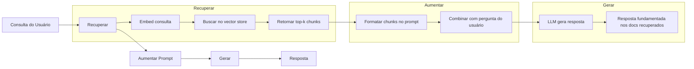
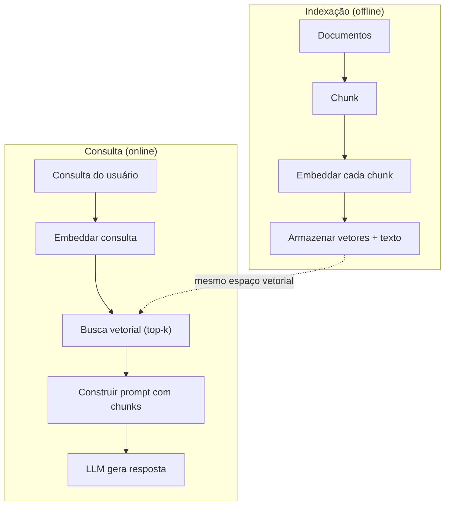

# RAG (Retrieval-Augmented Generation)

> Seu LLM sabe tudo até sua data de corte de treinamento. Não sabe nada sobre os docs da sua empresa, seu codebase ou as notas da reunião da semana passada. RAG resolve isso recuperando documentos relevantes e injetando-os no prompt. É o padrão mais implantado em IA de produção. Se você vai construir uma coisa deste curso, construa uma pipeline de RAG.

**Tipo:** Construção
**Linguagens:** Python
**Pré-requisitos:** Fase 10 (LLMs do Zero), Fase 11 Aulas 01-05
**Tempo:** ~90 minutos
**Relacionado:** Fase 5 · 23 (Chunking Strategies for RAG) para os seis algoritmos de chunking e quando cada um vence. Fase 5 · 22 (Embedding Models Deep Dive) para escolher o embedder. Fase 11 · 07 (Advanced RAG) para busca híbrida, reranking e transformação de consulta.

## Objetivos de Aprendizado

- Construir uma pipeline de RAG completa: carregamento de documentos, chunking, embedding, armazenamento vetorial, recuperação e geração
- Implementar busca semântica usando um banco de dados vetorial (ChromaDB, FAISS ou Pinecone) com indexação adequada
- Explicar por que RAG é preferido a fine-tuning para aplicações baseadas em conhecimento (custo, frescor, auditabilidade)
- Avaliar qualidade de RAG usando métricas de recuperação (precisão, recall) e métricas de geração (fidelidade, relevância)

## O Problema

Você constrói um chatbot para sua empresa. Um cliente pergunta "Qual a política de reembolso para planos enterprise?" O LLM responde com uma resposta genérica sobre políticas típicas de SaaS. A política real, enterrada em um wiki interno de 200 páginas, diz que clientes enterprise têm 60 dias com reembolso proporcional. O LLM nunca viu esse documento. Não pode saber o que não foi treinado.

Fine-tuning é uma solução. Pegue o LLM, treine nos seus docs internos e implante o modelo atualizado. Isso funciona mas tem sérios problemas. Fine-tuning custa milhares de dólares em computação. O modelo fica obsoleto no momento em que um documento muda. Você não tem como saber de qual fonte o modelo tirou a informação. E se a empresa adquirir outra linha de produto no mês que vem, você fine-tuna novamente.

RAG é a outra solução. Deixe o modelo intocado. Quando uma pergunta chega, busque no seu repositório de documentos os trechos relevantes, cole-os no prompt antes da pergunta e deixe o modelo responder usando aqueles trechos como contexto. O repositório de documentos pode ser atualizado em minutos. Você pode ver exatamente quais documentos foram recuperados. O modelo em si nunca muda. É por isso que RAG é o padrão dominante em produção: é mais barato, mais fresco, mais auditável e funciona com qualquer LLM.

## O Conceito

### O Padrão RAG

O padrão inteiro cabe em quatro passos:



Consulta -> Recuperar -> Aumentar prompt -> Gerar. Todo sistema RAG segue este padrão. As diferenças entre sistemas RAG de produção estão nos detalhes de cada passo: como você faz chunking, como embedde, como busca e como constrói o prompt.

### Por que RAG Supera Fine-Tuning

| Preocupação | Fine-tuning | RAG |
|------------|------------|-----|
| Custo | $1.000-$100.000+ por execução de treino | $0.01-$0.10 por consulta (embedding + LLM) |
| Frescor | Obsoleto até re-treinar | Atualizado em minutos re-indexando docs |
| Auditabilidade | Não consegue rastrear resposta até a fonte | Pode mostrar os trechos exatos recuperados |
| Alucinação | Ainda alucina livremente | Fundamentado em documentos recuperados |
| Privacidade de dados | Dados de treino incorporados nos pesos | Documentos ficam no seu vector store |

Fine-tuning muda os pesos do modelo permanentemente. RAG muda o contexto do modelo temporariamente. Para a maioria das aplicações, contexto temporário é o que você quer.

O único caso onde fine-tuning vence: quando você precisa que o modelo adote um estilo, tom ou padrão de raciocínio específico que não pode ser alcançado apenas com prompting. Para recuperação de conhecimento factual, RAG vence todas as vezes.

### Modelos de Embedding

Um modelo de embedding converte texto em um vetor denso. Textos similares produzem vetores próximos neste espaço de alta dimensão. "Como faço para redefinir minha senha?" e "Preciso mudar minha senha" produzem vetores quase idênticos apesar de compartilharem poucas palavras. "O gato sentou no tapete" produz um vetor muito diferente.

Modelos de embedding comuns (linhagem 2026 — veja Fase 5 · 22 para análise completa):

| Modelo | Dimensões | Provedor | Notas |
|-------|-----------|----------|-------|
| text-embedding-3-small | 1536 (Matryoshka) | OpenAI | Melhor custo/performance para maioria dos casos |
| text-embedding-3-large | 3072 (Matryoshka) | OpenAI | Maior acurácia, truncável para 256/512/1024 |
| Gemini Embedding 2 | 3072 (Matryoshka) | Google | Top MTEB retrieval; 8K contexto |
| voyage-4 | 1024/2048 (Matryoshka) | Voyage AI | Variantes de domínio (código, finanças, direito) |
| Cohere embed-v4 | 1024 (Matryoshka) | Cohere | Multilíngue forte, 128K contexto |
| BGE-M3 | 1024 (dense + sparse + ColBERT) | BAAI (pesos abertos) | Três visões de um modelo |
| Qwen3-Embedding | 4096 (Matryoshka) | Alibaba (pesos abertos) | Melhor score de retrieval de pesos abertos |
| all-MiniLM-L6-v2 | 384 | Pesos abertos (Sentence Transformers) | Baseline para prototipagem |

Para esta lição, construímos nosso próprio embedding simples usando TF-IDF. Não porque TF-IDF é o que sistemas de produção usam, mas porque torna o conceito concreto: texto entra, um vetor sai, textos similares produzem vetores similares.

### Similaridade de Vetores

Dados dois vetores, como você mede similaridade? Três opções:

**Similaridade cosseno**: o cosseno do ângulo entre dois vetores. Varia de -1 (oposto) a 1 (idêntico). Ignora magnitude, só se importa com direção. Este é o padrão para RAG.

```
cosseno_sim(a, b) = dot(a, b) / (||a|| * ||b||)
```

**Produto escalar**: o produto interno bruto. Vetores maiores recebem scores mais altos. Útil quando a magnitude carrega informação (documentos mais longos podem ser mais relevantes).

```
dot(a, b) = sum(a_i * b_i)
```

**Distância L2 (Euclidiana)**: distância em linha reta no espaço vetorial. Menor distância = mais similar. Sensível a diferenças de magnitude.

```
L2(a, b) = sqrt(sum((a_i - b_i)^2))
```

Similaridade cosseno é o padrão. Ela lida com documentos de diferentes comprimentos graciosamente porque normaliza pela magnitude. Quando alguém diz "busca vetorial", quase sempre significa similaridade cosseno.

### Estratégias de Chunking

Documentos são longos demais para serem embeddados como vetores únicos. Um PDF de 50 páginas pode produzir um embedding terrível porque contém dezenas de tópicos. Em vez disso, você divide documentos em chunks e embedda cada chunk separadamente.

**Chunking de tamanho fixo**: divida a cada N tokens. Simples e previsível. Um chunk de 512 tokens com sobreposição de 50 tokens significa que o chunk 1 são tokens 0-511, o chunk 2 são tokens 462-973, e assim por diante. A sobreposição garante que você não divida uma frase em um limite infeliz.

**Chunking semântico**: divida em limites naturais. Parágrafos, seções ou cabeçalhos de markdown. Cada chunk é uma unidade coerente de significado. Mais complexo de implementar mas produz melhor recuperação.

**Chunking recursivo**: tente dividir no maior limite primeiro (cabeçalhos de seção). Se uma seção ainda é muito grande, divida em limites de parágrafo. Se um parágrafo ainda é muito grande, divida em limites de frase. Esta é a abordagem do LangChain RecursiveCharacterTextSplitter e funciona bem na prática.

O tamanho do chunk importa mais do que as pessoas pensam:

- Muito pequeno (64-128 tokens): cada chunk falta contexto. "Aumentou 15% no último trimestre" não significa nada sem saber a que "aumentou" se refere.
- Muito grande (2048+ tokens): cada chunk cobre múltiplos tópicos, diluindo a relevância. Quando você busca por dados de receita, você obtém um chunk que é 10% sobre receita e 90% sobre headcount.
- Ponto ideal (256-512 tokens): contexto suficiente para ser autocontido, focado o suficiente para ser relevante.

A maioria dos sistemas RAG de produção usa chunks de 256-512 tokens com sobreposição de 50 tokens. As diretrizes de RAG da Anthropic recomendam esta faixa.

### Bancos de Dados Vetoriais

Depois de ter embeddings, você precisa de um lugar para armazená-los e buscá-los. Opções:

| Banco | Tipo | Melhor para |
|-------|------|-------------|
| FAISS | Biblioteca (in-process) | Prototipagem, datasets pequenos a médios |
| Chroma | Banco leve | Desenvolvimento local, implantações pequenas |
| Pinecone | Serviço gerenciado | Produção sem overhead de operações |
| Weaviate | Banco open source | Produção auto-hospedada |
| pgvector | Extensão Postgres | Já usando Postgres |
| Qdrant | Banco open source | Auto-hospedagem de alta performance |

Para esta lição, construímos um vector store simples em memória. Ele armazena vetores em uma lista e faz busca por similaridade cosseno de força bruta. Isso é equivalente ao FAISS com índice flat. Escala para talvez 100.000 vetores antes de ficar lento. Sistemas de produção usam algoritmos de approximate nearest neighbor (ANN) como HNSW para buscar milhões de vetores em milissegundos.

### A Pipeline Completa



A fase de indexação executa uma vez por documento (ou quando documentos são atualizados). A fase de consulta executa em toda requisição do usuário. Em produção, a indexação pode processar milhões de documentos ao longo de horas. A consulta deve responder em menos de um segundo.

### Números Reais

A maioria dos sistemas RAG de produção usa estes parâmetros:

- **k = 5 a 10** chunks recuperados por consulta
- **Tamanho do chunk = 256 a 512 tokens** com sobreposição de 50 tokens
- **Orçamento de contexto**: 2.500-5.000 tokens de conteúdo recuperado por consulta
- **Prompt total**: ~8.000-16.000 tokens (system prompt + chunks recuperados + histórico da conversa + consulta do usuário)
- **Dimensão do embedding**: 384-3072 dependendo do modelo
- **Taxa de indexação**: 100-1.000 documentos por segundo com embeddings de API
- **Latência de consulta**: 50-200ms para recuperação, 500-3000ms para geração

## Construa

### Passo 1: Chunking de Documentos

```python
def chunk_text(text, chunk_size=200, overlap=50):
    words = text.split()
    chunks = []
    start = 0
    while start < len(words):
        end = start + chunk_size
        chunk = " ".join(words[start:end])
        chunks.append(chunk)
        start += chunk_size - overlap
    return chunks
```

### Passo 2: Embeddings TF-IDF

Construímos uma função de embedding simples. TF-IDF (Term Frequency-Inverse Document Frequency) não é um embedding neural, mas converte texto em vetores de uma forma que captura importância de palavras. Palavras frequentes em um documento recebem TF mais alto. Palavras raras no corpus recebem IDF mais alto. O produto dá um vetor onde palavras importantes e distintivas têm valores altos.

```python
import math
from collections import Counter

def build_vocabulary(documents):
    vocab = set()
    for doc in documents:
        vocab.update(doc.lower().split())
    return sorted(vocab)

def compute_tf(text, vocab):
    words = text.lower().split()
    count = Counter(words)
    total = len(words)
    return [count.get(word, 0) / total for word in vocab]

def compute_idf(documents, vocab):
    n = len(documents)
    idf = []
    for word in vocab:
        doc_count = sum(1 for doc in documents if word in doc.lower().split())
        idf.append(math.log((n + 1) / (doc_count + 1)) + 1)
    return idf

def tfidf_embed(text, vocab, idf):
    tf = compute_tf(text, vocab)
    return [t * i for t, i in zip(tf, idf)]
```

### Passo 3: Busca por Similaridade Cosseno

```python
def cosine_similarity(a, b):
    dot = sum(x * y for x, y in zip(a, b))
    norm_a = math.sqrt(sum(x * x for x in a))
    norm_b = math.sqrt(sum(x * x for x in b))
    if norm_a == 0 or norm_b == 0:
        return 0.0
    return dot / (norm_a * norm_b)

def search(query_embedding, stored_embeddings, top_k=5):
    scores = []
    for i, emb in enumerate(stored_embeddings):
        sim = cosine_similarity(query_embedding, emb)
        scores.append((i, sim))
    scores.sort(key=lambda x: x[1], reverse=True)
    return scores[:top_k]
```

### Passo 4: Construção do Prompt

É aqui que o "aumentado" do RAG acontece. Pegue os chunks recuperados, formate-os em um prompt e peça ao LLM para responder baseado no contexto fornecido.

```python
def build_rag_prompt(query, retrieved_chunks):
    context = "\n\n---\n\n".join(
        f"[Fonte {i+1}]\n{chunk}"
        for i, chunk in enumerate(retrieved_chunks)
    )
    return f"""Responda à pergunta baseado APENAS no contexto abaixo.
Se o contexto não contiver informação suficiente, diga "Não tenho informação suficiente para responder."

Contexto:
{context}

Pergunta: {query}

Resposta:"""
```

### Passo 5: A Pipeline RAG Completa

```python
class RAGPipeline:
    def __init__(self):
        self.chunks = []
        self.embeddings = []
        self.vocab = []
        self.idf = []

    def index(self, documents):
        all_chunks = []
        for doc in documents:
            all_chunks.extend(chunk_text(doc))
        self.chunks = all_chunks
        self.vocab = build_vocabulary(all_chunks)
        self.idf = compute_idf(all_chunks, self.vocab)
        self.embeddings = [
            tfidf_embed(chunk, self.vocab, self.idf)
            for chunk in all_chunks
        ]

    def query(self, question, top_k=5):
        query_emb = tfidf_embed(question, self.vocab, self.idf)
        results = search(query_emb, self.embeddings, top_k)
        retrieved = [(self.chunks[i], score) for i, score in results]
        prompt = build_rag_prompt(
            question, [chunk for chunk, _ in retrieved]
        )
        return prompt, retrieved
```

### Passo 6: Geração (simulada)

Em produção, é aqui que você chama a API do LLM. Para esta lição, simulamos a geração extraindo a frase mais relevante do contexto recuperado.

```python
def simple_generate(prompt, retrieved_chunks):
    query_words = set(prompt.lower().split("pergunta:")[-1].split())
    best_sentence = ""
    best_score = 0
    for chunk in retrieved_chunks:
        for sentence in chunk.split("."):
            sentence = sentence.strip()
            if not sentence:
                continue
            words = set(sentence.lower().split())
            overlap = len(query_words & words)
            if overlap > best_score:
                best_score = overlap
                best_sentence = sentence
    return best_sentence if best_sentence else "Não tenho informação suficiente."
```

## Use

Com um modelo de embedding real e LLM, o código mal muda:

```python
from openai import OpenAI

client = OpenAI()

def embed(text):
    response = client.embeddings.create(
        model="text-embedding-3-small",
        input=text
    )
    return response.data[0].embedding

def generate(prompt):
    response = client.chat.completions.create(
        model="gpt-4o-mini",
        messages=[{"role": "user", "content": prompt}],
        temperature=0
    )
    return response.choices[0].message.content
```

Ou com Anthropic:

```python
import anthropic

client = anthropic.Anthropic()

def generate(prompt):
    response = client.messages.create(
        model="claude-sonnet-4-20250514",
        max_tokens=1024,
        messages=[{"role": "user", "content": prompt}]
    )
    return response.content[0].text
```

A pipeline é a mesma. Troque a função de embedding. Troque a função de geração. A lógica de recuperação, chunking, construção do prompt — tudo idêntico independentemente de quais modelos você usa.

Para armazenamento vetorial em escala, substitua a busca de força bruta por um banco de dados vetorial adequado:

```python
import chromadb

client = chromadb.Client()
collection = client.create_collection("meus_docs")

collection.add(
    documents=chunks,
    ids=[f"chunk_{i}" for i in range(len(chunks))]
)

results = collection.query(
    query_texts=["Qual a política de reembolso?"],
    n_results=5
)
```

Chroma lida com o embedding internamente (usa all-MiniLM-L6-v2 por padrão) e armazena os vetores em um banco de dados local. Mesmo padrão, encanamento diferente.

## Entregue

Esta lição produz:
- `outputs/prompt-rag-architect.md` — um prompt para projetar sistemas RAG para casos de uso específicos
- `outputs/skill-rag-pipeline.md` — uma skill que ensina agentes a construir e depurar pipelines RAG

## Exercícios

1. Substitua os embeddings TF-IDF por uma abordagem bag-of-words simples (binário: 1 se palavra presente, 0 se não). Compare a qualidade da recuperação nos documentos de exemplo. TF-IDF deve superar porque pondera palavras raras mais alto.

2. Experimente com tamanhos de chunk: tente 50, 100, 200 e 500 palavras no mesmo conjunto de documentos. Para cada tamanho, execute as mesmas 5 consultas e conte quantas retornam um chunk relevante no top-3. Encontre o ponto ideal onde a qualidade da recuperação atinge o pico.

3. Adicione metadados a cada chunk (nome do documento fonte, posição do chunk). Modifique o template do prompt para incluir atribuição de fonte para que o LLM cite suas fontes.

4. Implemente uma avaliação simples: dados 10 pares de pergunta-resposta, execute cada pergunta através da pipeline RAG e meça qual porcentagem dos chunks recuperados contém a resposta. Isto é recall de recuperação em k.

5. Construa uma pipeline RAG consciente de conversa: mantenha um histórico das últimas 3 trocas e inclua-as no prompt junto com os chunks recuperados. Teste com perguntas de acompanhamento como "E sobre enterprise?" após perguntar sobre preços.

## Termos-Chave

| Termo | O que o pessoal diz | O que realmente significa |
|-------|--------------------|-----------------------|
| RAG | "IA que lê seus docs" | Recuperar documentos relevantes, colá-los no prompt e gerar uma resposta fundamentada nesses documentos |
| Embedding | "Converter texto em números" | Uma representação vetorial densa de texto onde significados similares produzem vetores similares |
| Vector database | "Mecanismo de busca para IA" | Um armazenamento de dados otimizado para guardar vetores e encontrar os vizinhos mais próximos por similaridade |
| Chunking | "Dividir docs em pedaços" | Quebrar documentos em segmentos menores (tipicamente 256-512 tokens) para que cada um possa ser embeddado e recuperado independentemente |
| Similaridade cosseno | "Quão similares são dois vetores" | O cosseno do ângulo entre dois vetores; 1 = direção idêntica, 0 = ortogonal, -1 = oposta |
| Top-k retrieval | "Pegar os k melhores matches" | Retornar os k chunks mais similares à consulta do vector store |
| Janela de contexto | "Quanto texto o LLM pode ver" | O número máximo de tokens que o LLM pode processar em uma única requisição; chunks recuperados devem caber dentro disto |
| Geração aumentada | "Responder usando contexto dado" | Gerar uma resposta usando documentos recuperados como contexto em vez de confiar apenas no conhecimento treinado |
| TF-IDF | "Pontuação de importância de palavras" | Term Frequency vezes Inverse Document Frequency; pondera palavras por quão distintivas elas são dentro de um corpus |
| Indexação | "Preparar docs para busca" | O processo offline de chunking, embedding e armazenamento de documentos para que possam ser buscados no momento da consulta |

## Leitura Adicional

- [Lewis et al., "Retrieval-Augmented Generation for Knowledge-Intensive NLP Tasks" (2020)](https://arxiv.org/abs/2005.11906) — o paper original do RAG do Facebook AI Research que formalizou o padrão retrieve-then-generate
- [Anthropic's RAG documentation](https://docs.anthropic.com) — diretrizes práticas para tamanhos de chunk, construção de prompt e avaliação
- [Pinecone Learning Center, "What is RAG?"](https://www.pinecone.io/learn/rag/) — explicações visuais claras da pipeline RAG com considerações de produção
- [Sentence-BERT: Reimers & Gurevych (2019)](https://arxiv.org/abs/1908.10084) — o paper por trás dos modelos all-MiniLM, mostrando como treinar bi-encoders para similaridade semântica
- [Karpukhin et al., "Dense Passage Retrieval for Open-Domain Question Answering" (EMNLP 2020)](https://arxiv.org/abs/2004.04906) — o paper DPR que provou que retrieval bi-encoder denso supera BM25 em QA de domínio aberto e estabeleceu o padrão para retrievers RAG modernos
- [LlamaIndex High-Level Concepts](https://docs.llamaindex.ai/en/stable/getting_started/concepts.html) — os principais conceitos para construir pipelines RAG: data loaders, node parsers, indices, retrievers, response synthesizers
- [LangChain RAG tutorial](https://python.langchain.com/docs/tutorials/rag/) — o orquestrador de sabor oposto; visão de chain-of-runnables do mesmo padrão retrieve-then-generate
