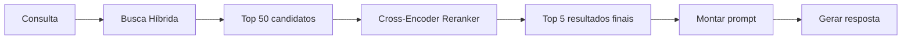
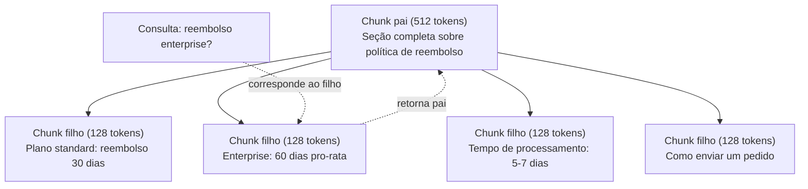
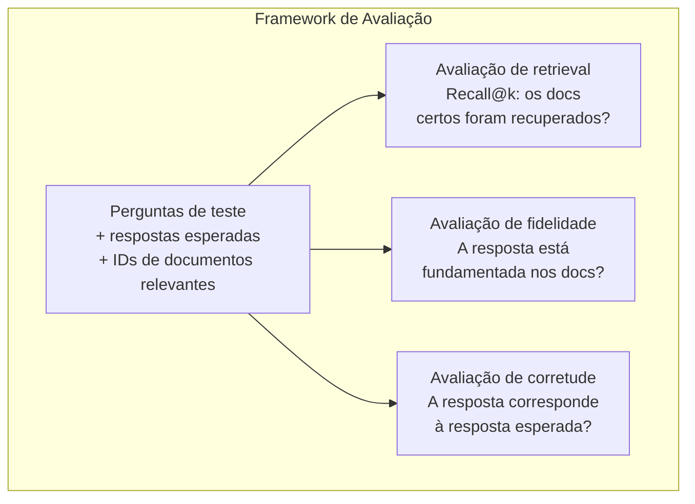

# Advanced RAG (Chunking, Reranking, Busca Híbrida)

> RAG básico recupera os top-k chunks mais similares. Funciona para perguntas simples. Desmorona em raciocínio multi-hop, queries ambíguas e corpora grandes. Advanced RAG é a diferença entre um demo que funciona em 10 documentos e um sistema que funciona em 10 milhões.

**Tipo:** Construção
**Linguagens:** Python
**Pré-requisitos:** Fase 11, Aula 06 (RAG)
**Tempo:** ~90 minutos
**Relacionado:** Fase 5 · 23 (Chunking Strategies for RAG) cobre todos os seis algoritmos de chunking — recursivo, semântico, por frase, parent-document, late chunking, contextual retrieval — com benchmarks Vectara/Anthropic. Esta aula constrói em cima: busca híbrida, reranking, transformação de consulta.

## Objetivos de Aprendizado

- Implementar estratégias avançadas de chunking (semântico, recursivo, pai-filho) que preservam estrutura e contexto dos documentos
- Construir pipeline de busca híbrida combinando BM25 com busca vetorial semântica e reranker cross-encoder
- Aplicar técnicas de transformação de consulta (HyDE, multi-consulta, step-back) para melhorar retrieval em perguntas ambíguas ou complexas
- Diagnosticar e corrigir falhas comuns de RAG: chunk errado recuperado, resposta não está no contexto, falha de raciocínio multi-hop

## O Problema

Você construiu um RAG básico na Aula 06. Funciona para perguntas diretas em um corpus pequeno. Agora tente estas:

**Consulta ambígua**: "Qual foi a receita no último trimestre?" Busca semântica retorna chunks sobre estratégia de receita, projeções de receita e pensamentos do CFO sobre crescimento de receita. Todos semanticamente similares à palavra "receita." Nenhum contendo o número real. O chunk correto diz "$47.2M no Q3 2025" mas usa a palavra "ganhos" em vez de "receita." O modelo de embedding acha que "estratégia de receita" está mais próximo da consulta do que "ganhos do Q3 foram $47.2M."

**Pergunta multi-hop**: "Qual time teve a maior melhoria na pontuação de satisfação do cliente?" Isso requer encontrar as pontuações de satisfação para cada time, compará-las e identificar o máximo. Nenhum chunk contém a resposta. A informação está espalhada por relatórios de times.

**Problema de corpus grande**: Você tem 2 milhões de chunks. A resposta correta está no chunk #1.847.293. Seu retrieval top-5 puxa chunks #14, #89.201, #1.200.000, #44 e #901.333. Próximos no espaço de embedding, mas nenhum contendo a resposta. Nessa escala, a busca aproximada do vizinho mais próximo introduz erro suficiente para que resultados relevantes sejam empurrados para fora do top-k.

RAG básico falha porque similaridade vetorial não é o mesmo que relevância. Um chunk pode ser semanticamente similar a uma consulta sem ser útil para respondê-la. Advanced RAG aborda isso com quatro técnicas: busca híbrida (adicionar correspondência de palavras-chave), reranking (pontuar candidatos mais cuidadosamente), transformação de consulta (corrigir a consulta antes de buscar) e chunking melhor (recuperar na granularidade certa).

## O Conceito

### Busca Híbrida: Semântica + Palavras-chave

Busca semântica (similaridade vetorial) é boa para entender significado. "Como cancelar minha assinatura?" corresponde a "Passos para encerrar seu plano" mesmo sem compartilhar palavras. Mas perde correspondências exatas. "Código de erro E-4021" pode não corresponder a um chunk contendo "E-4021" se o modelo de embedding tratar como ruído.

Busca por palavras-chave (BM25) é o oposto. Excelente para correspondências exatas. "E-4021" corresponde perfeitamente. Mas "cancelar minha assinatura" retorna zero resultados se o documento diz "encerrar seu plano."

A busca híbrida executa ambas, depois mescla os resultados.

**BM25** (Best Matching 25) é o algoritmo padrão de busca por palavras-chave. É a espinha dorsal de mecanismos de busca desde os anos 1990. A fórmula:

```
BM25(c, d) = soma sobre termos t em c:
    IDF(t) * (tf(t,d) * (k1 + 1)) / (tf(t,d) + k1 * (1 - b + b * |d| / avgdl))
```

Onde tf(t,d) é a frequência do termo t no documento d, IDF(t) é a frequência inversa do documento, |d| é o comprimento do documento, avgdl é o comprimento médio dos documentos, k1 controla a saturação da frequência do termo (padrão 1.2), e b controla a normalização de comprimento (padrão 0.75).

Em termos simples: BM25 pontua documentos mais alto quando contêm termos da consulta (especialmente os raros), mas com retornos decrescentes para termos repetidos. Um documento com a palavra "receita" 50 vezes não é 50x mais relevante que um com ela uma vez.

### Reciprocal Rank Fusion (RRF)

Você tem duas listas ranqueadas: uma da busca vetorial, uma do BM25. Como combiná-las? Reciprocal Rank Fusion é a abordagem padrão.

```
RRF_score(d) = soma sobre rankings R:
    1 / (k + rank_R(d))
```

Onde k é uma constante (tipicamente 60) que impede o resultado top-1 de dominar.

Um documento ranqueado #1 na busca vetorial e #5 no BM25 recebe: 1/(60+1) + 1/(60+5) = 0.0164 + 0.0154 = 0.0318

Um documento ranqueado #3 na busca vetorial e #2 no BM25 recebe: 1/(60+3) + 1/(60+2) = 0.0159 + 0.0161 = 0.0320

RRF naturalmente equilibra os dois sinais. Um documento que ranqueia alto em ambas as listas recebe a melhor pontuação. Um documento ranqueado #1 em uma lista mas ausente da outra recebe uma pontuação moderada. Isso é robusto porque usa ranks, não pontuações brutas, então diferenças nas distribuições de pontuação entre os dois sistemas não importam.

### Reranking

Retrieval (seja vetorial, por palavras-chave ou híbrido) é rápido mas impreciso. Usa bi-encoders: a consulta e cada documento são embedados independentemente, depois comparados. Os embeddings são computados uma vez e armazenados em cache. Isso escala para milhões de documentos.

Reranking usa cross-encoders: a consulta e um documento candidato são alimentados juntos em um modelo que produz uma pontuação de relevância. O modelo vê ambos os textos simultaneamente e pode capturar interações finas entre eles. Um cross-encoder pode entender que "Quais foram os ganhos do Q3?" é altamente relevante para um chunk contendo "$47.2M no Q3" mesmo se um bi-encoder perdeu a conexão.

O trade-off: cross-encoders são 100-1000x mais lentos que bi-encoders porque processam o par consulta-documento conjuntamente. Você não pode pré-computar pontuações de cross-encoder para um milhão de documentos. A solução: recuperar um conjunto maior de candidatos (top-50 da busca híbrida), depois rerankar com um cross-encoder para obter o top-5 final.



Modelos comuns de reranking (lineup 2026):
- Cohere Rerank 3.5: API gerenciada, multilíngue, melhor ganho de recall em corpora mistos
- Voyage rerank-2.5: API gerenciada, menor latência das opções hospedadas
- Jina-Reranker-v2 Multilingual: open-weight, 100+ idiomas
- bge-reranker-v2-m3: open-weight, baseline forte
- cross-encoder/ms-marco-MiniLM-L-6-v2: open-weight, roda em CPU para prototipagem
- ColBERTv2 / Jina-ColBERT-v2: rerankers multi-vetor de late-interaction — O(tokens) não O(docs) no tempo de pontuação

### Transformação de Consulta

Às vezes o problema não é o retrieval mas a própria consulta. "Qual era aquela coisa sobre a mudança de política?" é uma consulta de busca terrível. Não contém termos específicos. O embedding é vago. Nenhum sistema de retrieval consegue encontrar os documentos certos a partir disso.

**Reescrita de consulta**: reformular a consulta do usuário em uma consulta de busca melhor. Um LLM pode fazer isso:

```
Usuário: "Qual era aquela coisa sobre a mudança de política?"
Reescrita: "Mudanças de política recentes e atualizações"
```

**HyDE (Hypothetical Document Embeddings)**: em vez de buscar com a consulta, gere uma resposta hipotética, embedê-la e busque documentos reais similares.

```
Consulta: "Qual a política de reembolso para enterprise?"
Resposta hipotética: "Clientes Enterprise são elegíveis para reembolso total
dentro de 60 dias da compra. Reembolsos são proporcionais ao período restante
da assinatura e processados em 5-7 dias úteis."
```

Embarque a resposta hipotética e busque documentos reais similares a ela. A intuição: a resposta hipotética vive mais próximo no espaço de embedding da resposta real do que a pergunta original. Perguntas e respostas têm estruturas linguísticas diferentes. Ao gerar uma resposta hipotética, você preenche a lacuna entre o "espaço de perguntas" e o "espaço de respostas" no embedding.

HyDE adiciona uma chamada de LLM antes do retrieval. Isso aumenta a latência em 500-2000ms. Vale a pena quando a qualidade do retrieval é ruim em consultas brutas.

### Chunking Pai-Filho

Chunking padrão força um trade-off: chunks pequenos para retrieval preciso, chunks grandes para contexto suficiente. O chunking pai-filho elimina esse trade-off.

Indexe chunks pequenos (128 tokens) para retrieval. Quando um chunk pequeno é recuperado, retorne seu chunk pai (512 tokens) para o prompt. O chunk pequeno corresponde precisamente à consulta. O chunk pai fornece contexto suficiente para o LLM gerar uma boa resposta.



A consulta "reembolso enterprise?" corresponde precisamente ao chunk filho C2. Mas o prompt recebe o chunk pai completo P, que inclui o contexto ao redor sobre tempo de processamento e processo de envio.

### Filtragem por Metadados

Antes de executar a busca vetorial, filtre o corpus por metadados: data, fonte, categoria, autor, idioma. Isso reduz o espaço de busca e previne resultados irrelevantes.

"O que mudou na política de segurança no mês passado?" deve buscar apenas documentos dos últimos 30 dias na categoria segurança. Sem filtragem por metadados, você busca o corpus inteiro e pode recuperar um documento de segurança de 2 anos atrás que é semanticamente similar.

Sistemas RAG de produção armazenam metadados junto com cada chunk: documento fonte, data de criação, categoria, autor, versão. Bancos vetoriais suportam pré-filtragem por metadados antes da busca por similaridade, o que é crítico para performance em escala.

### Avaliação

Você construiu um sistema RAG. Como saber se funciona? Três métricas:

**Relevância do retrieval (Recall@k)**: para um conjunto de perguntas de teste com documentos relevantes conhecidos, qual porcentagem dos documentos relevantes aparece nos resultados top-k? Se a resposta para uma pergunta está no chunk #47, o chunk #47 aparece no top-5?

**Fidelidade (Faithfulness)**: a resposta gerada está fundamentada nos documentos recuperados? Se os chunks recuperados dizem "janela de reembolso de 60 dias" e o modelo diz "janela de reembolso de 90 dias," isso é uma falha de fidelidade. O modelo alucinou apesar de ter o contexto correto.

**Corretude da resposta**: a resposta gerada corresponde à resposta esperada? Esta é a métrica ponta a ponta. Combina qualidade de retrieval e qualidade de geração.

Uma verificação simples de fidelidade: pegue cada afirmação na resposta gerada e verifique se aparece (em substância) nos chunks recuperados. Se a resposta contém um fato não presente em nenhum chunk recuperado, provavelmente é alucinação.



## Construa

### Passo 1: Implementação BM25

```python
import math
from collections import Counter

class BM25:
    def __init__(self, k1=1.2, b=0.75):
        self.k1 = k1
        self.b = b
        self.docs = []
        self.doc_lengths = []
        self.avg_dl = 0
        self.doc_freqs = {}
        self.n_docs = 0

    def index(self, documents):
        self.docs = documents
        self.n_docs = len(documents)
        self.doc_lengths = []
        self.doc_freqs = {}

        for doc in documents:
            words = doc.lower().split()
            self.doc_lengths.append(len(words))
            unique_words = set(words)
            for word in unique_words:
                self.doc_freqs[word] = self.doc_freqs.get(word, 0) + 1

        self.avg_dl = sum(self.doc_lengths) / self.n_docs if self.n_docs else 1

    def score(self, query, doc_idx):
        query_words = query.lower().split()
        doc_words = self.docs[doc_idx].lower().split()
        doc_len = self.doc_lengths[doc_idx]
        word_counts = Counter(doc_words)
        score = 0.0

        for term in query_words:
            if term not in word_counts:
                continue
            tf = word_counts[term]
            df = self.doc_freqs.get(term, 0)
            idf = math.log((self.n_docs - df + 0.5) / (df + 0.5) + 1)
            numerator = tf * (self.k1 + 1)
            denominator = tf + self.k1 * (1 - self.b + self.b * doc_len / self.avg_dl)
            score += idf * numerator / denominator

        return score

    def search(self, query, top_k=10):
        scores = [(i, self.score(query, i)) for i in range(self.n_docs)]
        scores.sort(key=lambda x: x[1], reverse=True)
        return scores[:top_k]
```

### Passo 2: Reciprocal Rank Fusion

```python
def reciprocal_rank_fusion(ranked_lists, k=60):
    scores = {}
    for ranked_list in ranked_lists:
        for rank, (doc_id, _) in enumerate(ranked_list):
            if doc_id not in scores:
                scores[doc_id] = 0.0
            scores[doc_id] += 1.0 / (k + rank + 1)
    fused = sorted(scores.items(), key=lambda x: x[1], reverse=True)
    return fused
```

### Passo 3: Pipeline de Busca Híbrida

```python
def hybrid_search(query, chunks, vector_embeddings, vocab, idf, bm25_index, top_k=5, fusion_k=60):
    query_emb = tfidf_embed(query, vocab, idf)
    vector_results = search(query_emb, vector_embeddings, top_k=top_k * 3)
    bm25_results = bm25_index.search(query, top_k=top_k * 3)
    fused = reciprocal_rank_fusion([vector_results, bm25_results], k=fusion_k)
    return fused[:top_k]
```

### Passo 4: Reranker Simples

Em produção, você usaria um modelo cross-encoder. Aqui construímos um reranker que pontua relevância consulta-documento usando sobreposição de palavras, importância de termos e correspondência de frases.

```python
def rerank(query, candidates, chunks):
    query_words = set(query.lower().split())
    stop_words = {"the", "a", "an", "is", "are", "was", "were", "what", "how",
                  "why", "when", "where", "do", "does", "for", "of", "in", "to",
                  "and", "or", "on", "at", "by", "it", "its", "this", "that",
                  "with", "from", "be", "has", "have", "had", "not", "but"}
    query_terms = query_words - stop_words

    scored = []
    for doc_id, initial_score in candidates:
        chunk = chunks[doc_id].lower()
        chunk_words = set(chunk.split())

        term_overlap = len(query_terms & chunk_words)

        query_bigrams = set()
        q_list = [w for w in query.lower().split() if w not in stop_words]
        for i in range(len(q_list) - 1):
            query_bigrams.add(q_list[i] + " " + q_list[i + 1])
        bigram_matches = sum(1 for bg in query_bigrams if bg in chunk)

        position_boost = 0
        for term in query_terms:
            pos = chunk.find(term)
            if pos != -1 and pos < len(chunk) // 3:
                position_boost += 0.5

        rerank_score = (
            term_overlap * 1.0
            + bigram_matches * 2.0
            + position_boost
            + initial_score * 5.0
        )
        scored.append((doc_id, rerank_score))

    scored.sort(key=lambda x: x[1], reverse=True)
    return scored
```

### Passo 5: HyDE (Hypothetical Document Embeddings)

```python
def hyde_generate_hypothesis(query):
    templates = {
        "what": "A resposta para '{query}' é a seguinte: Com base em nossa documentação, {topic} envolve políticas e procedimentos específicos que definem como o processo funciona.",
        "how": "Para abordar '{query}': O processo envolve vários passos. Primeiro, você precisa iniciar a solicitação. Depois, o sistema processa de acordo com as regras definidas.",
        "default": "Sobre '{query}': Nossos registros indicam detalhes e políticas específicos relacionados a este tópico que fornecem uma resposta abrangente."
    }
    query_lower = query.lower()
    if query_lower.startswith("what"):
        template = templates["what"]
    elif query_lower.startswith("how"):
        template = templates["how"]
    else:
        template = templates["default"]

    topic_words = [w for w in query.lower().split()
                   if w not in {"what", "is", "the", "how", "do", "does", "a", "an",
                                "for", "of", "to", "in", "on", "at", "by", "and", "or"}]
    topic = " ".join(topic_words) if topic_words else "este tópico"

    return template.format(query=query, topic=topic)


def hyde_search(query, chunks, vector_embeddings, vocab, idf, top_k=5):
    hypothesis = hyde_generate_hypothesis(query)
    hypothesis_emb = tfidf_embed(hypothesis, vocab, idf)
    results = search(hypothesis_emb, vector_embeddings, top_k)
    return results, hypothesis
```

### Passo 6: Chunking Pai-Filho

```python
def create_parent_child_chunks(text, parent_size=200, child_size=50):
    words = text.split()
    parents = []
    children = []
    child_to_parent = {}

    parent_idx = 0
    start = 0
    while start < len(words):
        parent_end = min(start + parent_size, len(words))
        parent_text = " ".join(words[start:parent_end])
        parents.append(parent_text)

        child_start = start
        while child_start < parent_end:
            child_end = min(child_start + child_size, parent_end)
            child_text = " ".join(words[child_start:child_end])
            child_idx = len(children)
            children.append(child_text)
            child_to_parent[child_idx] = parent_idx
            child_start += child_size

        parent_idx += 1
        start += parent_size

    return parents, children, child_to_parent
```

### Passo 7: Avaliação de Fidelidade

```python
def evaluate_faithfulness(answer, retrieved_chunks):
    answer_sentences = [s.strip() for s in answer.split(".") if len(s.strip()) > 10]
    if not answer_sentences:
        return 1.0, []

    grounded = 0
    ungrounded = []
    context = " ".join(retrieved_chunks).lower()

    for sentence in answer_sentences:
        words = set(sentence.lower().split())
        stop_words = {"the", "a", "an", "is", "are", "was", "were", "and", "or",
                      "to", "of", "in", "for", "on", "at", "by", "it", "this", "that"}
        content_words = words - stop_words
        if not content_words:
            grounded += 1
            continue

        matched = sum(1 for w in content_words if w in context)
        ratio = matched / len(content_words) if content_words else 0

        if ratio >= 0.5:
            grounded += 1
        else:
            ungrounded.append(sentence)

    score = grounded / len(answer_sentences) if answer_sentences else 1.0
    return score, ungrounded


def evaluate_retrieval_recall(queries_with_relevant, retrieval_fn, k=5):
    total_recall = 0.0
    results = []

    for query, relevant_indices in queries_with_relevant:
        retrieved = retrieval_fn(query, k)
        retrieved_indices = set(idx for idx, _ in retrieved)
        relevant_set = set(relevant_indices)
        hits = len(retrieved_indices & relevant_set)
        recall = hits / len(relevant_set) if relevant_set else 1.0
        total_recall += recall
        results.append({
            "query": query,
            "recall": recall,
            "hits": hits,
            "total_relevant": len(relevant_set)
        })

    avg_recall = total_recall / len(queries_with_relevant) if queries_with_relevant else 0
    return avg_recall, results
```

## Use

Com um cross-encoder real para reranking:

```python
from sentence_transformers import CrossEncoder

reranker = CrossEncoder("cross-encoder/ms-marco-MiniLM-L-6-v2")

def rerank_with_cross_encoder(query, candidates, chunks, top_k=5):
    pairs = [(query, chunks[doc_id]) for doc_id, _ in candidates]
    scores = reranker.predict(pairs)
    scored = list(zip([doc_id for doc_id, _ in candidates], scores))
    scored.sort(key=lambda x: x[1], reverse=True)
    return scored[:top_k]
```

Com o reranker gerenciado da Cohere:

```python
import cohere

co = cohere.Client()

def rerank_with_cohere(query, candidates, chunks, top_k=5):
    docs = [chunks[doc_id] for doc_id, _ in candidates]
    response = co.rerank(
        model="rerank-english-v3.0",
        query=query,
        documents=docs,
        top_n=top_k
    )
    return [(candidates[r.index][0], r.relevance_score) for r in response.results]
```

Para HyDE com um LLM real:

```python
import anthropic

client = anthropic.Anthropic()

def hyde_with_llm(query):
    response = client.messages.create(
        model="claude-sonnet-4-20250514",
        max_tokens=256,
        messages=[{
            "role": "user",
            "content": f"Escreva um pequeno parágrafo que seria uma boa resposta para esta pergunta. Não diga que não sabe. Apenas escreva como a resposta se pareceria.\n\nPergunta: {query}"
        }]
    )
    return response.content[0].text
```

Para busca híbrida em produção com Weaviate:

```python
import weaviate

client = weaviate.connect_to_local()

collection = client.collections.get("Documents")
response = collection.query.hybrid(
    query="política de reembolso enterprise",
    alpha=0.5,
    limit=10
)
```

O parâmetro alpha controla o equilíbrio: 0.0 = puro keyword (BM25), 1.0 = puro vetor, 0.5 = peso igual. A maioria dos sistemas de produção usa alpha entre 0.3 e 0.7.

## Entregue

Esta aula produz:
- `outputs/prompt-advanced-rag-debugger.md` — um prompt para diagnosticar e corrigir problemas de qualidade de RAG
- `outputs/skill-advanced-rag.md` — uma skill para construir RAG de nível de produção com busca híbrida e reranking

## Exercícios

1. Compare BM25 vs busca vetorial vs busca híbrida nos documentos de exemplo. Para cada uma das 5 consultas de teste, registre qual abordagem retorna o chunk mais relevante na posição #1. Busca híbrida deve vencer em pelo menos 3 de 5.

2. Implemente um filtro de metadados. Adicione um campo "categoria" a cada documento (segurança, faturamento, api, produto). Antes de executar a busca vetorial, filtre chunks para apenas a categoria relevante. Teste com "Qual criptografia é usada?" e verifique que busca apenas chunks da categoria segurança.

3. Construa uma pipeline HyDE completa usando a função simples de gerar da Aula 06. Compare a qualidade de retrieval (relevância top-3) entre busca direta e busca HyDE em todas as 5 consultas de teste. HyDE deve melhorar resultados para consultas vagas.

4. Implemente a estratégia de chunking pai-filho nos documentos de exemplo. Use child_size=30 e parent_size=100. Busque com chunks filhos mas retorne chunks pais no prompt. Compare as respostas geradas com chunking padrão de chunk_size=50.

5. Crie um dataset de avaliação: 10 perguntas com chunks de resposta conhecidos. Meça Recall@3, Recall@5 e Recall@10 para (a) busca vetorial apenas, (b) BM25 apenas, (c) busca híbrida, (d) híbrida + reranking. Plote os resultados e identifique onde reranking ajuda mais.

## Termos-Chave

| Termo | O que o pessoal diz | O que realmente significa |
|-------|--------------------|---------------------------|
| BM25 | "Busca por palavras-chave" | Algoritmo probabilístico de ranking que pontua documentos por frequência do termo, frequência inversa do documento e normalização de comprimento |
| Busca híbrida | "O melhor dos dois mundos" | Rodar busca semântica (vetorial) e por palavras-chave (BM25) em paralelo, depois mesclar resultados com rank fusion |
| Reciprocal Rank Fusion | "Mesclar listas ranqueadas" | Combinar múltiplas listas ranqueadas somando 1/(k + rank) para cada documento em todas as listas |
| Reranking | "Segunda passada de pontuação" | Usar um modelo cross-encoder mais caro para re-pontuar um conjunto de candidatos do retrieval inicial |
| Cross-encoder | "Modelo consulta-documento conjunta" | Modelo que recebe consulta e documento como entrada única, produzindo pontuação de relevância; mais preciso que bi-encoders mas lento para busca em corpus completo |
| Bi-encoder | "Modelo de embedding independente" | Modelo que embeda consultas e documentos independentemente; rápido porque embeddings são pré-computados, mas menos preciso que cross-encoders |
| HyDE | "Buscar com resposta falsa" | Gerar uma resposta hipotética para a consulta, embedá-la e buscar documentos reais similares a ela |
| Chunking pai-filho | "Busca pequena, contexto grande" | Indexar chunks pequenos para retrieval preciso mas retornar o chunk pai maior para fornecer contexto suficiente |
| Filtragem por metadados | "Estreitar antes de buscar" | Filtrar documentos por atributos (data, fonte, categoria) antes de executar busca vetorial para reduzir o espaço de busca |
| Fidelidade | "Manteve-se fundamentado?" | Se a resposta gerada é suportada pelos documentos recuperados, em oposição a alucinação dos dados de treino do modelo |

## Leitura Adicional

- [Robertson & Zaragoza, "The Probabilistic Relevance Framework: BM25 and Beyond" (2009)](https://arxiv.org/abs/0911.0898) — referência definitiva para BM25, explicando os fundamentos probabilísticos por trás da fórmula
- [Cormack et al., "Reciprocal Rank Fusion Outperforms Condorcet and Individual Rank Learning Methods" (2009)](https://doi.org/10.1145/1571941.1572114) — paper original do RRF mostrando que supera métodos de fusão mais complexos
- [Gao et al., "Precise Zero-Shot Dense Retrieval without Relevance Labels" (2022)](https://arxiv.org/abs/2112.01488) — paper HyDE demonstrando que embeddings de documentos hipotéticos melhoram retrieval sem dados de treino
- [Nogueira & Cho, "Passage Re-ranking with BERT" (2019)](https://arxiv.org/abs/1904.08375) — mostrou que reranking com cross-encoder sobre BM25 melhora significativamente a qualidade do retrieval
- [Khattab et al., "DSPy: Compiling Declarative Language Model Calls into Self-Improving Pipelines" (2023)](https://arxiv.org/abs/2310.03714) — trata construção de prompts e seleção de pesos como problema de otimização sobre pipelines de retrieval
- [Edge et al., "From Local to Global: A Graph RAG Approach to Query-Focused Summarization" (Microsoft Research 2024)](https://arxiv.org/abs/2404.16130) — paper GraphRAG: extração de entidade-relação + detecção de comunidades Leiden para sumarização focada em consulta
- [Asai et al., "Self-RAG: Learning to Retrieve, Generate, and Critique through Self-Reflection" (ICLR 2024)](https://arxiv.org/abs/2310.11511) — RAG auto-avaliativo com tokens de reflexão; a fronteira agentic além do retrieve-then-generate estático
- [LangChain Query Construction blog](https://blog.langchain.dev/query-construction/) — como traduzir consultas em linguagem natural para consultas de banco de dados estruturadas (Text-to-SQL, Cypher) como passo pré-retrieval
