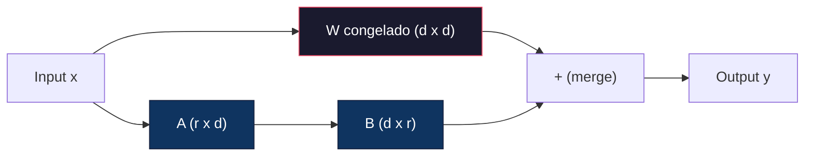
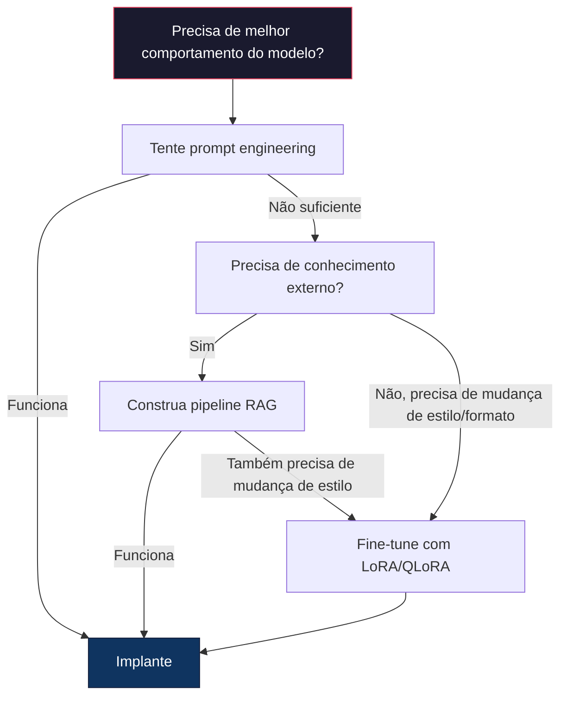

# Fine-Tuning com LoRA & QLoRA

> Fine-tuning completo de um modelo 7B requer 56GB de VRAM. Você não tem isso. A maioria das empresas também não tem. LoRA permite fazer fine-tuning do mesmo modelo com 6GB treinando menos de 1% dos parâmetros. Não é um compromisso — corresponde à qualidade de fine-tuning completo na maioria das tarefas. O ecossistema inteiro de fine-tuning open-source roda nesse truque.

**Tipo:** Construção
**Linguagens:** Python
**Pré-requisitos:** Fase 10, Aula 06 (Instruction Tuning / SFT)
**Tempo:** ~75 minutos
**Relacionado:** Fase 10 cobre os loops de SFT/DPO do zero. Esta aula os conecta aos toolkits PEFT de 2026 (PEFT, TRL, Unsloth, Axolotl, LLaMA-Factory).

## Objetivos de Aprendizado

- Implementar LoRA injetando matrizes de adaptador de baixo rank (A e B) nas camadas de attention de um modelo pré-treinado
- Calcular a economia de parâmetros de LoRA vs fine-tuning completo: rank r com dimensões d_model treina 2*r*d parâmetros em vez de d²
- Fazer fine-tuning com QLoRA (base quantizada em 4-bit + adaptadores LoRA) para caber na memória de GPUs de consumo
- Mesclar pesos LoRA de volta no modelo base para implantação e comparar velocidade de inferência com e sem adaptadores

## O Problema

Você tem um modelo base. Llama 3 8B. Quer que ele responda tickets de suporte com a voz da sua empresa. SFT é a resposta. Mas SFT tem problema de custo.

Fine-tuning completo atualiza cada parâmetro do modelo. Llama 3 8B tem 8 bilhões de parâmetros. Em fp16, cada parâmetro ocupa 2 bytes. São 16GB só para carregar os pesos. Durante o treino, você também precisa de gradientes (16GB), estados do otimizador Adam (32GB para momentum + variância) e ativações. Total: aproximadamente 56GB de VRAM para um único modelo 8B.

Um A100 80GB mal cabe isso. Dois A100s custam $3-4/hora em provedores de nuvem. Treinar 3 épocas em 50.000 exemplos leva 6-10 horas. São $30-40 por experimento. Rode 10 experimentos para ajustar hiperparâmetros e gastou $400 antes de implantar qualquer coisa.

Escalone para Llama 3 70B e os números ficam absurdos. 140GB só para os pesos. Você precisa de um cluster. $100+ por experimento.

Há um problema mais profundo também. Fine-tuning completo modifica cada peso no modelo. Se você faz fine-tuning em dados de suporte ao cliente, pode degradar as capacidades gerais do modelo. Isso se chama **esquecimento catastrófico**. O modelo melhora na sua tarefa e piora em todo o resto.

Você precisa de um método que treine menos parâmetros, use menos memória e não destrua o conhecimento existente do modelo.

## O Conceito

### LoRA: Low-Rank Adaptation

Edward Hu e colegas da Microsoft publicaram LoRA em junho de 2021. A percepção do paper: as atualizações de peso durante o fine-tuning têm rank intrínseco baixo. Você não precisa atualizar todos os 16,7 milhões de parâmetros em uma matriz de peso 4096x4096. A informação útil na atualização pode ser capturada por uma matriz de rank 16 ou 32.

Aqui está a matemática. Uma camada linear padrão computa:

```
y = Wx
```

Onde W é uma matriz d_out x d_in. Para uma projeção de attention 4096x4096, são 16.777.216 parâmetros.

LoRA congela W e adiciona uma decomposição de baixo rank:

```
y = Wx + BAx
```

Onde B é (d_out x r) e A é (r x d_in). O rank r é muito menor que d — tipicamente 8, 16 ou 32.

Para r=16 em uma camada 4096x4096:
- Parâmetros originais: 4096 x 4096 = 16.777.216
- Parâmetros LoRA: (4096 x 16) + (16 x 4096) = 65.536 + 65.536 = 131.072
- Redução: 131.072 / 16.777.216 = 0,78%

Você treina 0,78% dos parâmetros e obtém 95-100% da qualidade.



A é inicializado com uma Gaussiana aleatória. B é inicializado em zero. Isso significa que a contribuição LoRA começa em zero — o modelo começa o treinamento a partir de seu comportamento original e gradualmente aprende a adaptação.

### O Fator de Escala: Alpha

LoRA introduz um fator de escala alpha que controla quanto a atualização de baixo rank afeta a saída:

```
y = Wx + (alpha / r) * BAx
```

Quando alpha = r, a escala é 1x. Quando alpha = 2r (o padrão comum), a escala é 2x. Este hiperparâmetro controla a taxa de aprendizado do caminho LoRA independentemente da taxa de aprendizado base.

Orientação prática:
- alpha = 2 * rank é uma convenção comum da comunidade (o paper original usou alpha = rank na maioria dos experimentos)
- alpha = rank dá escala 1x, conservadora mas estável
- Alpha maior significa atualizações maiores por passo, o que pode acelerar convergência ou causar instabilidade

### Onde Aplicar LoRA

Um transformer tem muitas camadas lineares. Você não precisa adicionar LoRA a todas elas. O paper original testou diferentes combinações:

| Camadas alvo | Parâmetros Treináveis (7B) | Qualidade |
|-------------|---------------------------|-----------|
| q_proj apenas | 4.7M | Boa |
| q_proj + v_proj | 9.4M | Melhor |
| q_proj + k_proj + v_proj + o_proj | 18.9M | Melhor para attention |
| Todas lineares (attention + MLP) | 37.7M | Ganho marginal, 2x parâmetros |

O ponto ideal para a maioria das tarefas: q_proj + v_proj. Isso alvo as projeções de query e value na self-attention, que controlam a que o modelo atende e que informação extrai. Adicionar camadas MLP ajuda para tarefas complexas como geração de código mas dobra a contagem de parâmetros para retornos decrescentes em tarefas mais simples.

### Seleção de Rank

O rank r controla a expressividade da adaptação:

| Rank | Parâmetros Treináveis (por camada) | Melhor para |
|------|-----------------------------------|-------------|
| 4 | 32.768 | Classificação simples, sentimento |
| 8 | 65.536 | Q&A de domínio único, sumarização |
| 16 | 131.072 | Tarefas multi-domínio, seguimento de instruções |
| 32 | 262.144 | Raciocínio complexo, geração de código |
| 64 | 524.288 | Retornos decrescentes para a maioria das tarefas |
| 128 | 1.048.576 | Raramente justificado |

Hu et al. mostraram que r=4 já captura a maior parte da adaptação para tarefas simples. r=8 e r=16 são as escolhas mais comuns na prática. Ir além de r=64 raramente melhora a qualidade e começa a perder a vantagem de memória do LoRA.

### QLoRA: Quantização 4-bit + LoRA

Tim Dettmers e colegas da Universidade de Washington publicaram QLoRA em maio de 2023. A ideia: quantizar o modelo base congelado para precisão de 4-bit, depois anexar adaptadores LoRA em fp16 por cima.

Isso muda a equação de memória dramaticamente:

| Método | Memória de Pesos (7B) | Memória de Treino (7B) | GPU Necessária |
|--------|----------------------|------------------------|----------------|
| Fine-tune completo (fp16) | 14GB | ~56GB | 1x A100 80GB |
| LoRA (base fp16) | 14GB | ~18GB | 1x A100 40GB |
| QLoRA (base 4-bit) | 3,5GB | ~6GB | 1x RTX 3090 24GB |

QLoRA faz três contribuições técnicas:

**NF4 (Normal Float 4-bit)**: Um novo tipo de dado projetado especificamente para pesos de redes neurais. Pesos de redes neurais seguem uma distribuição aproximadamente normal. NF4 coloca seus 16 níveis de quantização nos quantis de uma distribuição normal padrão. Isso é informacionalmente ótimo para dados normalmente distribuídos. Perde menos informação que quantização 4-bit uniforme (INT4) ou Float4 padrão.

**Double quantization**: As constantes de quantização ocupam memória. Cada bloco de 64 pesos precisa de um fator de escala fp32 (4 bytes). Para um modelo 7B, isso é 0.4GB extra. Double quantization quantiza essas constantes para fp8, reduzindo a sobrecarga para 0.1GB. Pequeno mas soma.

**Paged optimizers**: Durante o treino, estados do otimizador (momentum e variância do Adam) podem exceder a memória GPU em sequências longas. Paged optimizers usam memória unificada da NVIDIA para paginar automaticamente estados do otimizador para RAM da CPU quando a memória GPU está exausta, e paginar de volta quando necessário. Isso previne crashes OOM ao custo de alguma taxa de transferência.

### A Questão da Qualidade

Reduzir parâmetros ou quantizar a base prejudica a qualidade? Os resultados de múltiplos papers:

| Método | MMLU (5-shot) | MT-Bench | HumanEval |
|--------|--------------|----------|-----------|
| Fine-tune completo (Llama 2 7B) | 48.3 | 6.72 | 14.6 |
| LoRA r=16 | 47.9 | 6.68 | 14.0 |
| QLoRA r=16 (NF4) | 47.5 | 6.61 | 13.4 |
| QLoRA r=64 (NF4) | 48.1 | 6.70 | 14.2 |

LoRA em r=16 fica dentro de 1% do fine-tuning completo na maioria dos benchmarks. QLoRA em r=16 perde mais uma fração de percentual. QLoRA em r=64 essencialmente iguala o fine-tuning completo enquanto usa 90% menos memória.

### Custos do Mundo Real

Fine-tuning do Llama 3 8B em 50.000 exemplos (3 épocas):

| Método | GPU | Tempo | Custo |
|--------|-----|-------|-------|
| Fine-tune completo | 2x A100 80GB | 8 horas | ~$32 |
| LoRA r=16 | 1x A100 40GB | 4 horas | ~$8 |
| QLoRA r=16 | 1x RTX 4090 24GB | 6 horas | ~$5 |
| QLoRA r=16 (Unsloth) | 1x RTX 4090 24GB | 2.5 horas | ~$2 |
| QLoRA r=16 | 1x T4 16GB | 12 horas | ~$4 |

QLoRA em uma GPU de consumidor custa menos que um almoço. É por isso que a comunidade de fine-tuning open-weight explodiu em 2023 e por que todo framework de treino abaixo inclui QLoRA por padrão em 2026.

### O Stack PEFT de 2026

| Framework | O que é | Escolha quando |
|-----------|---------|----------------|
| **Hugging Face PEFT** | A biblioteca canônica de LoRA/QLoRA/DoRA/IA3 | Você quer controle total e seu loop de treino já está em `transformers.Trainer` |
| **TRL** | Treinadores de reinforcement-from-feedback (SFT, DPO, GRPO, PPO, ORPO) | Você precisa de DPO/GRPO após SFT; construído sobre PEFT |
| **Unsloth** | Reescrita em kernel Triton do forward/backward pass | Você quer 2-5x de speedup + metade da VRAM sem perda de acurácia; famílias Llama/Mistral/Qwen |
| **Axolotl** | Wrapper configurável via YAML sobre PEFT + TRL + DeepSpeed + Unsloth | Você quer execuções de treino reproduzíveis e versionadas |
| **LLaMA-Factory** | GUI/CLI/API sobre PEFT + TRL | Você quer fine-tuning zero-código; 100+ famílias de modelos suportadas |
| **torchtune** | Receitas PyTorch nativas, sem dependência `transformers` | Você quer dependências mínimas e sua organização já padronizou em PyTorch |

Regra prática: pesquisa ou experimento único → PEFT. Pipeline de produção repetível → Axolotl com kernels Unsloth ativados. Prototipagem descartável → LLaMA-Factory.

### Mesclando Adapters

Após o treino, você tem duas coisas: o modelo base congelado e um adaptador LoRA pequeno (tipicamente 10-100MB). Você pode:

1. **Mantê-los separados**: Carregue o modelo base, carregue o adaptador por cima. Troque adaptadores para diferentes tarefas. É assim que você serve múltiplas variantes fine-tuned a partir de um modelo base.

2. **Mesclá-los permanentemente**: Compute W' = W + (alpha/r) * BA e salve o resultado como um novo modelo completo. O modelo mesclado tem o mesmo tamanho que o original. Sem sobrecarga de inferência. Sem adaptador para gerenciar.

Para servir múltiplas tarefas (adaptador de suporte, adaptador de código, adaptador de tradução), mantenha-os separados. Para implantar um único modelo especializado, mescle.

Técnicas avançadas para combinar múltiplos adaptadores:

- **TIES-Merging** (Yadav et al. 2023): Corta parâmetros de pequena magnitude, resolve conflitos de sinal e mescla. Reduz interferência entre adaptadores.
- **DARE** (Yu et al. 2023): Descarta aleatoriamente parâmetros do adaptador antes de mesclar e reescala o resto. Surpreendentemente eficaz em combinar capacidades.
- **Task arithmetic**: Simplesmente adicionar ou subtrair pesos do adaptador. Adicionar um adaptador "código" e um adaptador "matemática" frequentemente produz um modelo bom em ambos.

### Quando NÃO Fazer Fine-Tuning

Fine-tuning é a terceira opção, não a primeira.

**Primeiro: prompt engineering.** Escreva um system prompt melhor. Adicione exemplos few-shot. Use chain-of-thought. Isso não custa nada e leva minutos. Se prompting te leva 80% do caminho, você provavelmente não precisa fine-tunear.

**Segundo: RAG.** Se o modelo precisa saber sobre seus dados específicos (documentos, base de conhecimento, catálogo de produtos), retrieval é mais barato e mais sustentável que assar nos pesos. Veja a Aula 06.

**Terceiro: fine-tuning.** Use quando precisar que o modelo adote um estilo, formato ou padrão de raciocínio específico que não pode ser alcançado via prompting. Quando precisar de saída estruturada consistente. Quando precisar destilar um modelo maior em um menor. Quando latência importa e você não pode pagar os tokens extras de few-shot prompting.



## Construa

Implementamos LoRA do zero em PyTorch puro. Sem bibliotecas. Sem mágica. Você construirá a camada LoRA, injetará em um modelo, treinará e mesclará os pesos de volta.

### Passo 1: A Camada LoRA

```python
import torch
import torch.nn as nn
import math

class LoRALayer(nn.Module):
    def __init__(self, in_features, out_features, rank=8, alpha=16):
        super().__init__()
        self.rank = rank
        self.alpha = alpha
        self.scaling = alpha / rank

        self.A = nn.Parameter(torch.randn(in_features, rank) * (1 / math.sqrt(rank)))
        self.B = nn.Parameter(torch.zeros(rank, out_features))

    def forward(self, x):
        return (x @ self.A @ self.B) * self.scaling
```

A é inicializado com valores aleatórios escalados. B é inicializado em zero. O produto BA começa em zero, então o modelo começa com seu comportamento original.

### Passo 2: Camada Linear com LoRA

```python
class LinearWithLoRA(nn.Module):
    def __init__(self, linear, rank=8, alpha=16):
        super().__init__()
        self.linear = linear
        self.lora = LoRALayer(
            linear.in_features, linear.out_features, rank, alpha
        )

        for param in self.linear.parameters():
            param.requires_grad = False

    def forward(self, x):
        return self.linear(x) + self.lora(x)
```

A camada linear original é congelada. Apenas os parâmetros LoRA (A e B) são treináveis.

### Passo 3: Injetar LoRA em um Modelo

```python
def inject_lora(model, target_modules, rank=8, alpha=16):
    for param in model.parameters():
        param.requires_grad = False

    lora_layers = {}
    for name, module in model.named_modules():
        if isinstance(module, nn.Linear):
            if any(t in name for t in target_modules):
                parent_name = ".".join(name.split(".")[:-1])
                child_name = name.split(".")[-1]
                parent = dict(model.named_modules())[parent_name]
                lora_linear = LinearWithLoRA(module, rank, alpha)
                setattr(parent, child_name, lora_linear)
                lora_layers[name] = lora_linear
    return lora_layers
```

Primeiro, congele cada parâmetro no modelo. Depois, percorra a árvore do modelo, encontre camadas lineares correspondentes aos nomes alvo e substitua por versões com LoRA. As matrizes A e B de LoRA são os únicos parâmetros treináveis em todo o modelo.

### Passo 4: Contar Parâmetros

```python
def count_parameters(model):
    total = sum(p.numel() for p in model.parameters())
    trainable = sum(p.numel() for p in model.parameters() if p.requires_grad)
    frozen = total - trainable
    return {
        "total": total,
        "trainable": trainable,
        "frozen": frozen,
        "trainable_pct": 100 * trainable / total if total > 0 else 0
    }
```

### Passo 5: Mesclar Pesos de Volta

```python
def merge_lora_weights(model):
    for name, module in model.named_modules():
        if isinstance(module, LinearWithLoRA):
            with torch.no_grad():
                merged = (
                    module.lora.A @ module.lora.B
                ) * module.lora.scaling
                module.linear.weight.data += merged.T
            parent_name = ".".join(name.split(".")[:-1])
            child_name = name.split(".")[-1]
            if parent_name:
                parent = dict(model.named_modules())[parent_name]
            else:
                parent = model
            setattr(parent, child_name, module.linear)
```

Após a mesclagem, as camadas LoRA desaparecem. O modelo tem o mesmo tamanho que o original com a adaptação incorporada nos pesos. Sem sobrecarga de inferência.

### Passo 6: Quantização QLoRA Simulada

```python
def quantize_to_nf4(tensor, block_size=64):
    blocks = tensor.reshape(-1, block_size)
    scales = blocks.abs().max(dim=1, keepdim=True).values / 7.0
    scales = torch.clamp(scales, min=1e-8)
    quantized = torch.round(blocks / scales).clamp(-8, 7).to(torch.int8)
    return quantized, scales

def dequantize_from_nf4(quantized, scales, original_shape):
    dequantized = quantized.float() * scales
    return dequantized.reshape(original_shape)
```

Isso simula quantização de 4-bit mapeando pesos em 16 níveis discretos dentro de blocos de 64. QLoRA em produção usa a biblioteca bitsandbytes para NF4 real em GPU.

### Passo 7: Loop de Treinamento

```python
def train_lora(model, data, epochs=5, lr=1e-3, batch_size=4):
    optimizer = torch.optim.AdamW(
        [p for p in model.parameters() if p.requires_grad], lr=lr
    )
    criterion = nn.MSELoss()

    losses = []
    for epoch in range(epochs):
        epoch_loss = 0.0
        n_batches = 0
        indices = torch.randperm(len(data["inputs"]))

        for i in range(0, len(indices), batch_size):
            batch_idx = indices[i:i + batch_size]
            x = data["inputs"][batch_idx]
            y = data["targets"][batch_idx]

            output = model(x)
            loss = criterion(output, y)

            optimizer.zero_grad()
            loss.backward()
            optimizer.step()

            epoch_loss += loss.item()
            n_batches += 1

        avg_loss = epoch_loss / n_batches
        losses.append(avg_loss)

    return losses
```

### Passo 8: Demo Completa

```python
def demo():
    torch.manual_seed(42)
    d_model = 256
    n_classes = 10

    model = nn.Sequential(
        nn.Linear(d_model, 512),
        nn.ReLU(),
        nn.Linear(512, 512),
        nn.ReLU(),
        nn.Linear(512, n_classes),
    )

    n_samples = 500
    x = torch.randn(n_samples, d_model)
    y = torch.randint(0, n_classes, (n_samples,))
    y_onehot = torch.zeros(n_samples, n_classes).scatter_(1, y.unsqueeze(1), 1.0)

    data = {"inputs": x, "targets": y_onehot}

    params_before = count_parameters(model)

    lora_layers = inject_lora(
        model, target_modules=["0", "2"], rank=8, alpha=16
    )

    params_after = count_parameters(model)

    losses = train_lora(model, data, epochs=20, lr=1e-3)

    merge_lora_weights(model)
    params_merged = count_parameters(model)

    return {
        "params_before": params_before,
        "params_after": params_after,
        "params_merged": params_merged,
        "losses": losses,
    }
```

A demo cria um modelo pequeno, injeta LoRA em duas camadas, treina e mescla os pesos de volta. A contagem de parâmetros cai de totalmente treinável para ~1% treinável durante o treino LoRA, depois retorna à arquitetura original após a mesclagem.

## Use

Com o ecossistema Hugging Face, LoRA em um modelo real leva cerca de 20 linhas:

```python
from transformers import AutoModelForCausalLM, AutoTokenizer
from peft import LoraConfig, get_peft_model, TaskType

model = AutoModelForCausalLM.from_pretrained("meta-llama/Llama-3.1-8B")
tokenizer = AutoTokenizer.from_pretrained("meta-llama/Llama-3.1-8B")

lora_config = LoraConfig(
    task_type=TaskType.CAUSAL_LM,
    r=16,
    lora_alpha=32,
    lora_dropout=0.05,
    target_modules=["q_proj", "v_proj"],
)

model = get_peft_model(model, lora_config)
model.print_trainable_parameters()
```

Para QLoRA, adicione quantização bitsandbytes:

```python
from transformers import BitsAndBytesConfig

bnb_config = BitsAndBytesConfig(
    load_in_4bit=True,
    bnb_4bit_quant_type="nf4",
    bnb_4bit_compute_dtype=torch.bfloat16,
    bnb_4bit_use_double_quant=True,
)

model = AutoModelForCausalLM.from_pretrained(
    "meta-llama/Llama-3.1-8B",
    quantization_config=bnb_config,
    device_map="auto",
)

model = get_peft_model(model, lora_config)
```

É isso. Mesmo loop de treino. Mesma pipeline de dados. O modelo base agora vive em 4-bit, adaptadores LoRA treinam em fp16, e tudo cabe em 6GB.

Para treinar com o Hugging Face Trainer:

```python
from transformers import TrainingArguments, Trainer
from datasets import load_dataset

dataset = load_dataset("tatsu-lab/alpaca", split="train[:5000]")

training_args = TrainingArguments(
    output_dir="./lora-llama",
    num_train_epochs=3,
    per_device_train_batch_size=4,
    gradient_accumulation_steps=4,
    learning_rate=2e-4,
    fp16=True,
    logging_steps=10,
    save_strategy="epoch",
    optim="paged_adamw_8bit",
)

trainer = Trainer(
    model=model,
    args=training_args,
    train_dataset=dataset,
)

trainer.train()

model.save_pretrained("./lora-adapter")
```

O adaptador salvo tem 10-100MB. O modelo base permanece intocado. Você pode compartilhar adaptadores no Hugging Face Hub sem redistribuir o modelo completo.

## Entregue

Esta aula produz:
- `outputs/prompt-lora-advisor.md` — um prompt que ajuda a decidir rank LoRA, módulos alvo e hiperparâmetros para sua tarefa específica
- `outputs/skill-fine-tuning-guide.md` — uma skill que ensina agentes a árvore de decisão para quando e como fazer fine-tuning

## Exercícios

1. **Estudo de ablação de rank.** Execute a demo com ranks 2, 4, 8, 16, 32 e 64. Plote loss final vs. rank. Encontre o ponto de retornos decrescentes onde dobrar o rank não mais reduz o loss pela metade. Para uma tarefa simples de classificação em features de 256-dim, deve ser por volta de r=8-16.

2. **Comparação de módulos alvo.** Modifique inject_lora para alvo apenas camada "0", apenas "2", apenas "4" e todas as três. Treine cada variante por 20 épocas. Compare velocidade de convergência e loss final. Isso espelha a decisão real de alvo q_proj vs v_proj vs todas as camadas lineares.

3. **Análise de erro de quantização.** Pegue as matrizes de peso do modelo treinado antes e depois de quantize_to_nf4 / dequantize_from_nf4. Compute o erro quadrático médio, erro absoluto máximo e a correlação entre pesos originais e reconstruídos. Experimente com valores de block_size de 32, 64, 128 e 256.

4. **Servindo multi-adapters.** Treine dois adaptadores LoRA em subconjuntos diferentes dos dados (índices pares vs ímpares). Salve ambos os adaptadores. Carregue o modelo base uma vez, depois troque entre adaptadores e verifique que cada um produz saídas diferentes na mesma entrada. É assim que sistemas de produção servem múltiplos modelos fine-tuned a partir de uma base.

5. **Inferência merge vs não-merge.** Compare a saída do modelo LoRA antes e depois de merge_lora_weights nas mesmas 100 entradas. Verifique que as saídas são idênticas (dentro de tolerância de ponto flutuante de 1e-5). Depois faça benchmark da velocidade de inferência para ambos — merged deve ser ligeiramente mais rápido pois é uma única multiplicação de matriz em vez de duas.

## Termos-Chave

| Termo | O que o pessoal diz | O que realmente significa |
|-------|--------------------|--------------------------|
| LoRA | "Fine-tuning eficiente" | Low-Rank Adaptation: congelar pesos base, treinar duas matrizes pequenas A e B cujo produto aproxima a atualização completa dos pesos |
| QLoRA | "Fine-tuning no laptop" | LoRA quantizado: carregar modelo base em 4-bit NF4, treinar adaptadores LoRA em fp16 por cima, permitindo fine-tuning de 7B em 6GB VRAM |
| Rank (r) | "Quanto o modelo pode aprender" | A dimensão interna das matrizes A e B; controla expressividade vs contagem de parâmetros |
| Alpha | "Taxa de aprendizado do LoRA" | Fator de escala aplicado à saída LoRA; alpha/r escala a contribuição da adaptação para a saída final |
| NF4 | "Quantização 4-bit" | Normal Float 4: tipo de dado 4-bit com níveis de quantização em quantis de distribuição normal, ótimo para pesos de redes neurais |
| Adapter | "A parte pequena treinada" | As matrizes LoRA A e B salvas como arquivo separado (10-100MB), carregáveis sobre qualquer cópia do modelo base |
| Módulos alvo | "Quais camadas aplicar LoRA" | As camadas lineares específicas (q_proj, v_proj, etc.) onde adaptadores LoRA são injetados |
| Mesclagem | "Assentar no modelo" | Computar W + (alpha/r) * BA e substituir o peso original, eliminando a sobrecarga do adaptador na inferência |
| Paged optimizers | "Não OOM durante treino" | Descarregar estados do otimizador (momentum Adam, variância) para CPU quando a memória GPU está exausta |
| Esquecimento catastrófico | "Fine-tuning quebrou tudo" | Quando atualizar todos os pesos faz o modelo perder capacidades previamente aprendidas |

## Leitura Adicional

- [Hu et al., "LoRA: Low-Rank Adaptation of Large Language Models" (2021)](https://arxiv.org/abs/2106.09685) — paper original introduzindo o método de decomposição de baixo rank, testado em GPT-3 175B com rank tão baixo quanto 4
- [Dettmers et al., "QLoRA: Efficient Finetuning of Quantized Language Models" (2023)](https://arxiv.org/abs/2305.14314) — introduz NF4, double quantization e paged optimizers, permitindo fine-tuning de 65B em uma única GPU 48GB
- [PEFT library documentation](https://huggingface.co/docs/peft) — biblioteca padrão para LoRA, QLoRA e outros métodos de eficiência de parâmetros no ecossistema Hugging Face
- [Yadav et al., "TIES-Merging: Resolving Interference When Merging Models" (2023)](https://arxiv.org/abs/2306.01708) — técnicas para combinar múltiplos adaptadores LoRA sem degradação de qualidade
- [Rafailov et al., "Direct Preference Optimization: Your Language Model is Secretly a Reward Model" (NeurIPS 2023)](https://arxiv.org/abs/2305.18290) — derivação DPO; o estágio de preference-tuning que vem após SFT, sem necessidade de reward model
- [TRL documentation](https://huggingface.co/docs/trl/) — referência oficial para SFTTrainer, DPOTrainer, KTOTrainer e a superfície de integração com PEFT/bitsandbytes/Unsloth
- [Unsloth documentation](https://docs.unsloth.ai/) — kernels fused que dobram a taxa de transferência de fine-tuning e reduzem memória pela metade; a camada de performance sob TRL
- [Axolotl documentation](https://axolotl-ai-cloud.github.io/axolotl/) — trainer SFT/DPO/QLoRA multi-GPU configurável via YAML; a alternativa config-as-code para scripts manuais
