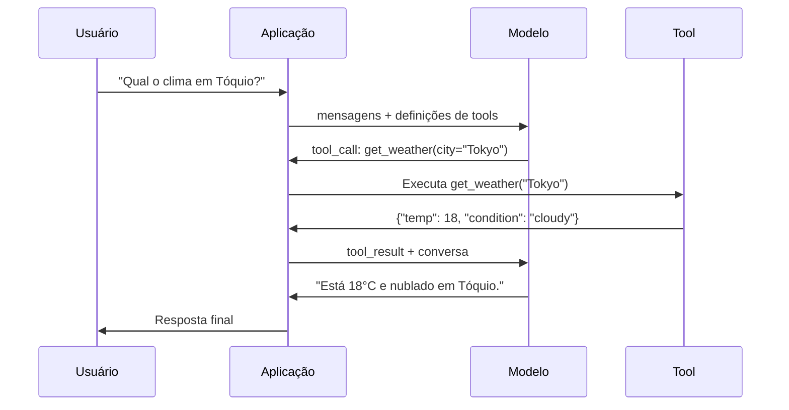

# Function Calling & Tool Use

> LLMs não conseguem fazer nada. Eles geram texto. Essa é toda a capacidade. Não conseguem checar clima, consultar banco de dados, enviar email, rodar código ou ler arquivo. Todo "AI agent" que você já viu é um LLM gerando JSON dizendo qual função chamar — e depois seu código realmente chamando. O modelo é o cérebro. Tools são as mãos. Function calling é o sistema nervoso conectando os dois.

**Tipo:** Construção
**Linguagens:** Python
**Pré-requisitos:** Fase 11 Aula 03 (Structured Outputs)
**Tempo:** ~75 minutos
**Relacionado:** Fase 11 · 14 (Model Context Protocol) — quando uma ferramenta é compartilhada entre hosts, evolua de function calling inline para um servidor MCP. Esta aula cobre o caso inline; MCP cobre o caso de protocolo.

## Objetivos de Aprendizado

- Implementar um loop de function calling: definir schemas de tools, parsear tool-call JSON do modelo, executar funções e retornar resultados
- Projetar schemas de ferramentas com descrições claras e parâmetros tipados que o modelo consegue invocar de forma confiável
- Construir um loop multi-turno de agente que encadeia múltiplas chamadas de função para responder queries complexas
- Lidar com casos extremos: chamadas paralelas, propagação de erros e prevenção de loops infinitos

## O Problema

Você constrói um chatbot. Um usuário pergunta: "Qual o clima em Tóquio agora?"

O modelo responde: "Não tenho acesso a dados meteorológicos em tempo real, mas baseado na estação, Tóquio deve estar por volta de 15 graus Celsius..."

Isso é uma alucinação disfarçada de aviso. O modelo não sabe o clima. Nunca saberá. O clima muda a cada hora. Os dados de treino do modelo têm meses de idade.

A resposta correta requer chamar a API OpenWeatherMap, obter a temperatura atual e retornar o número real. O modelo não pode chamar APIs. Seu código pode. A peça que falta: um protocolo estruturado que permite ao modelo dizer "Preciso chamar a API de clima com estes argumentos" e permite seu código executar e alimentar o resultado de volta.

Isso é function calling. O modelo produz JSON estruturado descrevendo qual função invocar com quais argumentos. Sua aplicação executa a função. O resultado volta para a conversa. O modelo usa o resultado para produzir sua resposta final.

Sem function calling, LLMs são enciclopédias. Com ele, tornam-se agentes.

## O Conceito

### O Loop de Function Calling

Toda interação de tool-use segue o mesmo loop de 5 passos.



Passo 1: o usuário envia uma mensagem. Passo 2: o modelo recebe a mensagem junto com as definições das ferramentas (JSON Schema descrevendo funções disponíveis). Passo 3: em vez de responder com texto, o modelo produz uma tool call — um objeto JSON estruturado com o nome da função e argumentos. Passo 4: seu código executa a função e captura o resultado. Passo 5: o resultado volta para o modelo, que agora tem dados reais para produzir sua resposta final.

O modelo nunca executa nada. Ele só decide o que chamar e com quais argumentos. Seu código é o executor.

### Definições de Tools: O Contrato JSON Schema

Cada ferramenta é definida por um JSON Schema que diz ao modelo o que a função faz, que argumentos ela aceita e que tipos esses argumentos devem ter.

```json
{
  "type": "function",
  "function": {
    "name": "get_weather",
    "description": "Obtém o clima atual para uma cidade. Retorna temperatura em Celsius e condições.",
    "parameters": {
      "type": "object",
      "properties": {
        "city": {
          "type": "string",
          "description": "Nome da cidade, ex. 'Tokyo' ou 'São Paulo'"
        },
        "units": {
          "type": "string",
          "enum": ["celsius", "fahrenheit"],
          "description": "Unidades de temperatura"
        }
      },
      "required": ["city"]
    }
  }
}
```

Os campos `description` são críticos. O modelo os lê para decidir quando e como usar a ferramenta. Uma descrição vaga como "obtém clima" produz pior seleção de ferramentas do que "Obtém o clima atual para uma cidade. Retorna temperatura em Celsius e condições." A descrição é um prompt para seleção de ferramentas.

### Comparação entre Provedores

Todo provedor importante suporta function calling, mas a superfície da API difere.

| Provedor | Parâmetro da API | Formato da Tool Call | Chamadas Paralelas | Chamada Forçada |
|----------|-----------------|---------------------|-------------------|-----------------|
| OpenAI (GPT-5, o4) | `tools` | `tool_calls[].function` | Sim (múltiplas por turno) | `tool_choice="required"` |
| Anthropic (Claude 4.6/4.7) | `tools` | `content[].type="tool_use"` | Sim (múltiplos blocos) | `tool_choice={"type":"any"}` |
| Google (Gemini 3) | `function_declarations` | `functionCall` | Sim | `function_calling_config` |
| Open-weight (Llama 4, Qwen3, DeepSeek-V3) | `tools` nativo no Llama 4; Hermes ou ChatML em outros | Misto | Dependente do modelo | Baseado em prompt ou `tool_choice` se suportado |

Em 2026, os três provedores fechados convergiram para formatos baseados em JSON Schema quase idênticos. Llama 4 vem com um campo `tools` nativo que corresponde ao formato da OpenAI. Fine-tunes open-weight ainda variam — o formato Hermes (NousResearch) é o mais comum para fine-tunes de terceiros. Para ferramentas compartilhadas entre hosts, prefira MCP (Fase 11 · 14) em vez de function calling inline — o servidor é o mesmo para todos.

### Tool Choice: Auto, Required, Specific

Você controla quando o modelo usa ferramentas.

**Auto** (padrão): o modelo decide se chama uma ferramenta ou responde diretamente. "Quanto é 2+2?" — responde diretamente. "Qual o clima?" — chama a ferramenta.

**Required**: o modelo deve chamar pelo menos uma ferramenta. Use quando você sabe que a intenção do usuário requer uma ferramenta. Impede o modelo de adivinhar em vez de consultar dados reais.

**Função específica**: force o modelo a chamar uma função particular. `tool_choice={"type":"function", "function": {"name": "get_weather"}}` garante que a ferramenta de clima seja chamada, independentemente da consulta. Use para roteamento — quando a lógica upstream já determinou qual ferramenta é necessária.

### Chamada Paralela de Funções

GPT-4o e Claude podem chamar múltiplas funções em um único turno. Um usuário pergunta: "Qual o clima em Tóquio e Nova York?" O modelo produz duas tool calls simultaneamente:

```json
[
  {"name": "get_weather", "arguments": {"city": "Tokyo"}},
  {"name": "get_weather", "arguments": {"city": "New York"}}
]
```

Seu código executa ambas (idealmente concorrentemente), retorna ambos os resultados, e o modelo sintetiza uma única resposta. Isso reduz viagens de ida e volta de 2 para 1. Para agentes com 5-10 chamadas de ferramenta por consulta, chamadas paralelas reduzem latência em 60-80%.

### Structured Outputs vs Function Calling

A Aula 03 cobriu structured outputs. Function calling usa o mesmo maquinário JSON Schema, mas para um propósito diferente.

**Structured outputs**: forçam o modelo a produzir dados em uma forma específica. A saída é o produto final. Exemplo: extrair informações de produto de texto como `{name, price, in_stock}`.

**Function calling**: o modelo declara uma intenção de executar uma ação. A saída é um passo intermediário. Exemplo: `get_weather(city="Tokyo")` — o modelo está solicitando uma ação, não produzindo a resposta final.

Use structured outputs quando quiser extração de dados. Use function calling quando quiser que o modelo interaja com sistemas externos.

### Segurança: As Regras Não-Negociáveis

Function calling é a capacidade mais perigosa que você pode dar a um LLM. O modelo escolhe o que executar. Se seu conjunto de ferramentas inclui consultas de banco de dados, o modelo constrói as consultas. Se inclui comandos de shell, o modelo os escreve.

**Regra 1: Nunca passe SQL gerado por modelo diretamente para um banco de dados.** O modelo pode e vai gerar DROP TABLE, injeções UNION ou consultas que retornam todas as linhas. Sempre parametrize. Sempre valide. Sempre use uma lista de operações permitidas.

**Regra 2: Lista de funções permitidas.** O modelo só pode chamar funções que você define explicitamente. Nunca construa uma ferramenta genérica "executar qualquer função por nome." Se você tem 50 funções internas, exponha apenas as 5 que o usuário precisa.

**Regra 3: Valide argumentos.** O modelo pode passar um nome de cidade como `"; DROP TABLE users; --"`. Valide cada argumento contra tipos, intervalos e formatos esperados antes da execução.

**Regra 4: Sanitize resultados de ferramentas.** Se uma ferramenta retorna dados sensíveis (chaves de API, PII, erros internos), filtre-os antes de enviar de volta ao modelo. O modelo incluirá resultados de ferramentas em sua resposta verbatim.

**Regra 5: Limite de taxa de chamadas de ferramentas.** Um modelo em loop pode chamar ferramentas centenas de vezes. Defina um máximo (10-20 chamadas por conversa é razoável). Quebre loops infinitos.

### Tratamento de Erros

Ferramentas falham. APIs expiram. Bancos de dados caem. Arquivos não existem. O modelo precisa saber quando uma ferramenta falha e por quê.

Retorne erros como resultados de ferramenta estruturados, não exceções:

```json
{
  "error": true,
  "message": "Cidade 'Toquio' não encontrada. Você quis dizer 'Tóquio'?",
  "code": "CITY_NOT_FOUND"
}
```

O modelo lê isso, ajusta seus argumentos e tenta novamente. Modelos são bons em autocorreção a partir de mensagens de erro estruturadas. Eles são ruins em se recuperar de respostas vazias ou erros genéricos de "algo deu errado."

### MCP: Model Context Protocol

MCP é o padrão aberto da Anthropic para interoperabilidade de ferramentas. Em vez de cada aplicação definir suas próprias ferramentas, MCP fornece um protocolo universal: ferramentas são servidas por servidores MCP, consumidas por clientes MCP (como Claude Code, Cursor ou sua aplicação).

Um servidor MCP pode expor ferramentas para qualquer cliente compatível. Um servidor MCP Postgres dá a qualquer agente compatível com MCP acesso ao banco de dados. Um servidor MCP GitHub dá a qualquer agente acesso ao repositório. As ferramentas são definidas uma vez, usadas em toda parte.

MCP é para function calling o que HTTP é para networking. Ele padroniza a camada de transporte para que as ferramentas se tornem portáteis.

## Construa

### Passo 1: Defina o Registro de Ferramentas

Construa um registro que armazena definições de ferramentas e suas implementações. Cada ferramenta tem uma definição JSON Schema (o que o modelo vê) e uma função Python (o que seu código executa).

```python
import json
import math
import time
import hashlib


TOOL_REGISTRY = {}


def register_tool(name, description, parameters, function):
    TOOL_REGISTRY[name] = {
        "definition": {
            "type": "function",
            "function": {
                "name": name,
                "description": description,
                "parameters": parameters,
            },
        },
        "function": function,
    }
```

### Passo 2: Implemente 5 Ferramentas

Construa uma calculadora, consulta de clima, simulador de busca web, leitor de arquivos e executor de código.

```python
def calculator(expression, precision=2):
    allowed = set("0123456789+-*/.() ")
    if not all(c in allowed for c in expression):
        return {"error": True, "message": f"Caracteres inválidos na expressão: {expression}"}
    try:
        result = eval(expression, {"__builtins__": {}}, {"math": math})
        return {"result": round(float(result), precision), "expression": expression}
    except Exception as e:
        return {"error": True, "message": str(e)}


WEATHER_DB = {
    "tokyo": {"temp_c": 18, "condition": "cloudy", "humidity": 72, "wind_kph": 14},
    "new york": {"temp_c": 22, "condition": "sunny", "humidity": 45, "wind_kph": 8},
    "london": {"temp_c": 12, "condition": "rainy", "humidity": 88, "wind_kph": 22},
    "san francisco": {"temp_c": 16, "condition": "foggy", "humidity": 80, "wind_kph": 18},
    "sydney": {"temp_c": 25, "condition": "sunny", "humidity": 55, "wind_kph": 10},
}


def get_weather(city, units="celsius"):
    key = city.lower().strip()
    if key not in WEATHER_DB:
        suggestions = [c for c in WEATHER_DB if c.startswith(key[:3])]
        return {
            "error": True,
            "message": f"Cidade '{city}' não encontrada.",
            "suggestions": suggestions,
            "code": "CITY_NOT_FOUND",
        }
    data = WEATHER_DB[key].copy()
    if units == "fahrenheit":
        data["temp_f"] = round(data["temp_c"] * 9 / 5 + 32, 1)
        del data["temp_c"]
    data["city"] = city
    return data


SEARCH_DB = {
    "python function calling": [
        {"title": "OpenAI Function Calling Guide", "url": "https://platform.openai.com/docs/guides/function-calling", "snippet": "Aprenda a conectar LLMs a ferramentas externas."},
        {"title": "Anthropic Tool Use", "url": "https://docs.anthropic.com/en/docs/tool-use", "snippet": "Claude pode interagir com ferramentas e APIs externas."},
    ],
    "MCP protocol": [
        {"title": "Model Context Protocol", "url": "https://modelcontextprotocol.io", "snippet": "Um padrão aberto para conectar modelos de IA a fontes de dados."},
    ],
    "weather API": [
        {"title": "OpenWeatherMap API", "url": "https://openweathermap.org/api", "snippet": "API de clima gratuita com dados atuais, previsão e históricos."},
    ],
}


def web_search(query, max_results=3):
    key = query.lower().strip()
    for db_key, results in SEARCH_DB.items():
        if db_key in key or key in db_key:
            return {"query": query, "results": results[:max_results], "total": len(results)}
    return {"query": query, "results": [], "total": 0}


FILE_SYSTEM = {
    "data/config.json": '{"model": "gpt-4o", "temperature": 0.7, "max_tokens": 4096}',
    "data/users.csv": "nome,email,cargo\nAlice,alice@example.com,admin\nBob,bob@example.com,usuario",
    "README.md": "# Meu Projeto\nUm agente de tool-use construído do zero.",
}


def read_file(path):
    if ".." in path or path.startswith("/"):
        return {"error": True, "message": "Path traversal não permitido.", "code": "FORBIDDEN"}
    if path not in FILE_SYSTEM:
        available = list(FILE_SYSTEM.keys())
        return {"error": True, "message": f"Arquivo '{path}' não encontrado.", "available_files": available, "code": "NOT_FOUND"}
    content = FILE_SYSTEM[path]
    return {"path": path, "content": content, "size_bytes": len(content), "lines": content.count("\n") + 1}


def run_code(code, language="python"):
    if language != "python":
        return {"error": True, "message": f"Linguagem '{language}' não suportada. Apenas 'python' está disponível."}
    forbidden = ["import os", "import sys", "import subprocess", "exec(", "eval(", "__import__", "open("]
    for pattern in forbidden:
        if pattern in code:
            return {"error": True, "message": f"Código contém padrão proibido: {pattern}"}
    try:
        local_vars = {}
        exec(code, {"__builtins__": __builtins__}, local_vars)
        return {"stdout": str(local_vars.get("result", "executado com sucesso")), "language": "python"}
    except Exception as e:
        return {"error": True, "message": str(e)}


def register_all_tools():
    register_tool(
        "calculator",
        "Executa expressões matemáticas com segurança. Soma, subtração, multiplicação, divisão.",
        {
            "type": "object",
            "properties": {
                "expression": {"type": "string", "description": "Expressão matemática, ex. '(10 + 5) * 3 / 2'"},
                "precision": {"type": "integer", "description": "Casas decimais para arredondar", "default": 2},
            },
            "required": ["expression"],
        },
        calculator
    )
    register_tool(
        "get_weather",
        "Obtém o clima atual para uma cidade. Retorna temperatura em Celsius e condições.",
        {
            "type": "object",
            "properties": {
                "city": {"type": "string", "description": "Nome da cidade, ex. 'Tokyo' ou 'São Paulo'"},
                "units": {"type": "string", "enum": ["celsius", "fahrenheit"], "description": "Unidades de temperatura"},
            },
            "required": ["city"],
        },
        get_weather
    )
    register_tool(
        "web_search",
        "Busca na web por informação. Retorna resultados com título, URL e snippet.",
        {
            "type": "object",
            "properties": {
                "query": {"type": "string", "description": "Termo de busca"},
                "max_results": {"type": "integer", "description": "Número máximo de resultados", "default": 3},
            },
            "required": ["query"],
        },
        web_search
    )
    register_tool(
        "read_file",
        "Lê o conteúdo de um arquivo do sistema de arquivos simulado.",
        {
            "type": "object",
            "properties": {
                "path": {"type": "string", "description": "Caminho do arquivo, ex. 'data/config.json'"},
            },
            "required": ["path"],
        },
        read_file
    )
    register_tool(
        "run_code",
        "Executa código Python em um ambiente seguro. Retorna a saída.",
        {
            "type": "object",
            "properties": {
                "code": {"type": "string", "description": "Código Python para executar"},
                "language": {"type": "string", "enum": ["python"], "description": "Linguagem do código"},
            },
            "required": ["code"],
        },
        run_code
    )
```

### Passo 3: Função de Decisão do Modelo

Simula a decisão do LLM sobre qual ferramenta chamar. Em produção, isso seria uma chamada real ao modelo com as definições de ferramentas como parâmetro `tools`.

```python
def simulate_llm_decision(query, tools):
    query_lower = query.lower()

    if any(word in query_lower for word in ["weather", "clima", "temperatura", "tempo"]):
        return [{"name": "get_weather", "arguments": {"city": query.split()[-1]}}]

    if any(word in query_lower for word in ["calcul", "quanto é", "quanto e", "math", "expressão", "expressao"]):
        import re
        expr_match = re.search(r'[\d\s+\-*/().]+', query)
        if expr_match:
            expr = expr_match.group().strip()
            if expr and len(expr) > 1:
                return [{"name": "calculator", "arguments": {"expression": expr}}]

    if any(word in query_lower for word in ["search", "buscar", "busca", "find", "procurar", "pesquisar"]):
        topic = query_lower.replace("search", "").replace("buscar", "").replace("find", "").replace("procurar", "").replace("for", "").replace("por", "").strip()
        if topic:
            return [{"name": "web_search", "arguments": {"query": topic}}]

    if any(word in query_lower for word in ["read", "ler", "arquivo", "file", "config", "readme"]):
        return [{"name": "read_file", "arguments": {"path": "data/config.json"}}]

    if any(word in query_lower for word in ["run", "executar", "roda", "code", "código", "codigo", "python"]):
        return [{"name": "run_code", "arguments": {"code": "result = sum(range(1, 101))"}}]

    return []
```

### Passo 4: Executor de Tool Calls

```python
def execute_tool_call(tool_call):
    name = tool_call["name"]
    args = tool_call.get("arguments", {})

    start = time.time()

    if name not in TOOL_REGISTRY:
        return {
            "tool": name,
            "result": {"error": True, "message": f"Ferramenta desconhecida: {name}"},
            "execution_time_ms": 0.0,
        }

    try:
        result = TOOL_REGISTRY[name]["function"](**args)
    except Exception as e:
        result = {"error": True, "message": str(e)}

    return {
        "tool": name,
        "result": result,
        "execution_time_ms": round((time.time() - start) * 1000, 2),
    }


def run_function_calling_loop(query, max_iterations=10):
    results = []
    iteration = 0

    while iteration < max_iterations:
        tool_calls = simulate_llm_decision(query, TOOL_REGISTRY)

        if not tool_calls:
            if iteration == 0:
                return {
                    "response": f"Com base na sua pergunta sobre '{query}', posso ajudar com...",
                    "tool_results": [],
                    "iterations": 1,
                }
            break

        for tool_call in tool_calls:
            result = execute_tool_call(tool_call)
            results.append(result)

        iteration += 1

    return {
        "response": f"Processei sua consulta: '{query}' usando {len(results)} ferramenta(s).",
        "tool_results": results,
        "iterations": iteration,
    }
```

### Passo 5: Validação de Argumentos

Sempre valide argumentos de ferramentas gerados pelo modelo contra o JSON Schema antes da execução.

```python
def validate_tool_arguments(tool_name, arguments):
    if tool_name not in TOOL_REGISTRY:
        return [f"Ferramenta desconhecida: {tool_name}"]

    schema = TOOL_REGISTRY[tool_name]["definition"]["function"]["parameters"]
    errors = []

    if not isinstance(arguments, dict):
        return [f"Argumentos devem ser um objeto, recebeu {type(arguments).__name__}"]

    for required_field in schema.get("required", []):
        if required_field not in arguments:
            errors.append(f"Argumento obrigatório ausente: {required_field}")

    properties = schema.get("properties", {})
    for arg_name, arg_value in arguments.items():
        if arg_name not in properties:
            errors.append(f"Argumento desconhecido: {arg_name}")
            continue

        prop_schema = properties[arg_name]
        expected_type = prop_schema.get("type")

        type_checks = {"string": str, "integer": int, "number": (int, float), "boolean": bool, "array": list, "object": dict}
        if expected_type in type_checks:
            if not isinstance(arg_value, type_checks[expected_type]):
                errors.append(f"Argumento '{arg_name}': esperado {expected_type}, recebeu {type(arg_value).__name__}")

        if "enum" in prop_schema and arg_value not in prop_schema["enum"]:
            errors.append(f"Argumento '{arg_name}': '{arg_value}' não está em {prop_schema['enum']}")

    return errors
```

### Passo 6: Execute a Demo

```python
def run_demo():
    register_all_tools()

    print("=" * 60)
    print("  Demonstração de Function Calling & Tool Use")
    print("=" * 60)

    print("\n--- Ferramentas Registradas ---")
    for name, tool in TOOL_REGISTRY.items():
        desc = tool["definition"]["function"]["description"][:60]
        params = list(tool["definition"]["function"]["parameters"].get("properties", {}).keys())
        print(f"  {name}: {desc}...")
        print(f"    params: {params}")

    print(f"\n--- Validação de Argumentos ---")
    validation_tests = [
        ("get_weather", {"city": "Tokyo"}, "Chamada válida"),
        ("get_weather", {}, "Argumento obrigatório ausente"),
        ("get_weather", {"city": "Tokyo", "units": "kelvin"}, "Valor enum inválido"),
        ("calculator", {"expression": 123}, "Tipo errado (int para string)"),
        ("unknown_tool", {"x": 1}, "Ferramenta desconhecida"),
    ]
    for tool_name, args, label in validation_tests:
        errors = validate_tool_arguments(tool_name, args)
        status = "VÁLIDO" if not errors else f"ERROS: {errors}"
        print(f"  {label}: {status}")

    print(f"\n--- Execução de Ferramentas ---")
    direct_tests = [
        {"name": "calculator", "arguments": {"expression": "(10 + 5) * 3 / 2"}},
        {"name": "get_weather", "arguments": {"city": "Tokyo"}},
        {"name": "get_weather", "arguments": {"city": "Mars"}},
        {"name": "web_search", "arguments": {"query": "python function calling"}},
        {"name": "read_file", "arguments": {"path": "data/config.json"}},
        {"name": "read_file", "arguments": {"path": "../etc/passwd"}},
        {"name": "run_code", "arguments": {"code": "result = sum(range(1, 101))"}},
        {"name": "run_code", "arguments": {"code": "import os; os.system('rm -rf /')"}},
    ]
    for call in direct_tests:
        result = execute_tool_call(call)
        print(f"\n  {call['name']}({json.dumps(call['arguments'])})")
        print(f"    -> {json.dumps(result['result'], indent=None)[:100]}")
        print(f"    tempo: {result['execution_time_ms']}ms")

    print(f"\n--- Loop Completo de Function Calling ---")
    test_queries = [
        "Qual o clima em Tokyo?",
        "Calcule (100 + 250) * 0.15",
        "Busque por MCP protocol",
        "Leia o arquivo de configuração",
        "Execute código Python",
        "Conte uma piada",
    ]
    for query in test_queries:
        print(f"\n  Usuário: {query}")
        result = run_function_calling_loop(query)
        if result["tool_results"]:
            for tr in result["tool_results"]:
                print(f"    Tool: {tr['tool']} ({tr['execution_time_ms']}ms)")
                print(f"    Resultado: {json.dumps(tr['result'], indent=None)[:90]}")
        else:
            print(f"    [Nenhuma ferramenta chamada -- resposta direta]")
        print(f"    Iterações: {result['iterations']}")

    print(f"\n--- Chamadas Paralelas de Ferramentas ---")
    multi_city_query = "Qual o clima em Tokyo e London?"
    print(f"  Usuário: {multi_city_query}")
    result = run_function_calling_loop(multi_city_query)
    print(f"  Tool calls feitas: {len(result['tool_results'])}")
    for tr in result["tool_results"]:
        city = tr["result"].get("city", "desconhecido")
        temp = tr["result"].get("temp_c", "N/A")
        print(f"    {city}: {temp}C, {tr['result'].get('condition', 'N/A')}")

    print(f"\n--- Verificações de Segurança ---")
    security_tests = [
        ("read_file", {"path": "../../etc/passwd"}),
        ("run_code", {"code": "import subprocess; subprocess.run(['ls'])"}),
        ("calculator", {"expression": "__import__('os').system('ls')"}),
    ]
    for tool_name, args in security_tests:
        result = execute_tool_call({"name": tool_name, "arguments": args})
        blocked = result["result"].get("error", False)
        print(f"  {tool_name}({list(args.values())[0][:40]}): {'BLOQUEADO' if blocked else 'PERMITIDO'}")
```

## Use

### OpenAI Function Calling

```python
# from openai import OpenAI
#
# client = OpenAI()
#
# tools = [{
#     "type": "function",
#     "function": {
#         "name": "get_weather",
#         "description": "Obtém o clima atual para uma cidade",
#         "parameters": {
#             "type": "object",
#             "properties": {
#                 "city": {"type": "string"},
#                 "units": {"type": "string", "enum": ["celsius", "fahrenheit"]}
#             },
#             "required": ["city"]
#         }
#     }
# }]
#
# response = client.chat.completions.create(
#     model="gpt-4o",
#     messages=[{"role": "user", "content": "Clima em Tokyo?"}],
#     tools=tools,
#     tool_choice="auto",
# )
#
# tool_call = response.choices[0].message.tool_calls[0]
# args = json.loads(tool_call.function.arguments)
# result = get_weather(**args)
#
# final = client.chat.completions.create(
#     model="gpt-4o",
#     messages=[
#         {"role": "user", "content": "Clima em Tokyo?"},
#         response.choices[0].message,
#         {"role": "tool", "tool_call_id": tool_call.id, "content": json.dumps(result)},
#     ],
# )
# print(final.choices[0].message.content)
```

OpenAI retorna tool calls como `response.choices[0].message.tool_calls`. Cada chamada tem um `id` que você deve incluir ao retornar o resultado. O modelo usa este ID para corresponder resultados a chamadas. GPT-4o pode retornar múltiplas tool calls em uma única resposta — itere e execute todas.

### Anthropic Tool Use

```python
# import anthropic
#
# client = anthropic.Anthropic()
#
# response = client.messages.create(
#     model="claude-sonnet-4-20250514",
#     max_tokens=1024,
#     tools=[{
#         "name": "get_weather",
#         "description": "Obtém o clima atual para uma cidade",
#         "input_schema": {
#             "type": "object",
#             "properties": {
#                 "city": {"type": "string"},
#                 "units": {"type": "string", "enum": ["celsius", "fahrenheit"]}
#             },
#             "required": ["city"]
#         }
#     }],
#     messages=[{"role": "user", "content": "Clima em Tokyo?"}],
# )
#
# tool_block = next(b for b in response.content if b.type == "tool_use")
# result = get_weather(**tool_block.input)
#
# final = client.messages.create(
#     model="claude-sonnet-4-20250514",
#     max_tokens=1024,
#     tools=[...],
#     messages=[
#         {"role": "user", "content": "Clima em Tokyo?"},
#         {"role": "assistant", "content": response.content},
#         {"role": "user", "content": [{"type": "tool_result", "tool_use_id": tool_block.id, "content": json.dumps(result)}]},
#     ],
# )
```

Anthropic retorna tool calls como blocos de conteúdo com `type: "tool_use"`. O resultado da ferramenta vai em uma mensagem do usuário com `type: "tool_result"`. Diferença chave: Anthropic usa `input_schema` para definições de parâmetros de ferramentas, enquanto OpenAI usa `parameters`.

### Integração MCP

```python
# Servidores MCP expõem ferramentas sobre um protocolo padronizado.
# Qualquer cliente compatível com MCP pode descobrir e chamar estas ferramentas.
#
# Exemplo: conectando a um servidor MCP Postgres
#
# from mcp import ClientSession, StdioServerParameters
# from mcp.client.stdio import stdio_client
#
# server_params = StdioServerParameters(
#     command="npx",
#     args=["-y", "@modelcontextprotocol/server-postgres", "postgresql://localhost/mydb"],
# )
#
# async with stdio_client(server_params) as (read, write):
#     async with ClientSession(read, write) as session:
#         await session.initialize()
#         tools = await session.list_tools()
#         result = await session.call_tool("query", {"sql": "SELECT count(*) FROM users"})
```

MCP desacopla a implementação da ferramenta do consumo da ferramenta. O servidor Postgres conhece SQL. O servidor GitHub conhece a API. Seu agente apenas descobre e chama ferramentas — ele não precisa de código específico de provedor para cada integração.

## Entregue

Esta aula produz `outputs/prompt-tool-designer.md` — um template de prompt reutilizável para projetar definições de ferramentas. Dê a ele uma descrição do que você quer que uma ferramenta faça, e ele produz a definição JSON Schema completa com descrições, tipos e restrições.

Também produz `outputs/skill-function-calling-patterns.md` — um framework de decisão para implementar function calling em produção, cobrindo design de ferramentas, tratamento de erros, segurança e padrões específicos de provedores.

## Exercícios

1. **Adicione uma 6ª ferramenta: consulta ao banco de dados.** Implemente uma ferramenta SQL simulada com uma tabela em memória. A ferramenta aceita um nome de tabela e condições de filtro (não SQL bruto). Valide que o nome da tabela está em uma lista permitida e que os operadores de filtro são restritos a `=`, `>`, `<`, `>=`, `<=`. Retorne linhas correspondentes como JSON.

2. **Implemente retry com feedback de erro.** Quando uma chamada de ferramenta falha (ex.: cidade não encontrada), alimente a mensagem de erro de volta para a função de decisão do modelo e deixe-a corrigir seus argumentos. Rastreie quantas tentativas cada chamada leva. Defina um máximo de 3 tentativas por chamada de ferramenta.

3. **Construa um agente multi-passo.** Algumas consultas exigem encadeamento de chamadas de ferramentas: "Leia o arquivo de configuração e me diga qual modelo está configurado, depois busque na web o preço desse modelo." Implemente um loop que executa até que o modelo decida que não precisa de mais ferramentas, passando resultados acumulados em cada passo de decisão. Limite a 10 iterações para prevenir loops infinitos.

4. **Meça a acurácia de seleção de ferramentas.** Crie 30 consultas de teste com nomes de ferramentas esperados. Execute sua função de decisão em todas as 30 e meça a porcentagem de vezes que seleciona a ferramenta correta. Identifique quais consultas causam mais confusão entre ferramentas.

5. **Implemente cache de chamadas de ferramentas.** Se a mesma ferramenta é chamada com argumentos idênticos em 60 segundos, retorne o resultado em cache em vez de re-executar. Use um dicionário indexado por `(tool_name, frozenset(args.items()))`. Meça as taxas de cache hit em uma conversa com 20 consultas.

## Termos-Chave

| Termo | O que o pessoal diz | O que realmente significa |
|-------|--------------------|---------------------------|
| Function calling | "Uso de tools" | O modelo produz JSON estruturado descrevendo uma função a invocar com argumentos específicos — seu código executa, não o modelo |
| Definição de ferramenta | "Schema de função" | Objeto JSON Schema descrevendo nome, propósito, parâmetros e tipos de uma ferramenta — o modelo lê isso para decidir quando e como usar |
| Tool choice | "Modo de chamada" | Controla se o modelo deve chamar uma ferramenta (required), pode chamar (auto) ou deve chamar uma específica (named) |
| Chamada paralela | "Multi-tool" | O modelo produz múltiplas tool calls em um único turno, reduzindo viagens de ida e volta |
| Resultado de ferramenta | "Saída da função" | O valor de retorno da execução de uma ferramenta, enviado de volta ao modelo como mensagem |
| Validação de argumentos | "Verificação de entrada" | Verificar se argumentos gerados pelo modelo correspondem aos tipos, intervalos e restrições esperados antes de executar |
| MCP | "Protocolo de tools" | Model Context Protocol — padrão aberto da Anthropic para expor ferramentas via servidores que qualquer cliente compatível pode descobrir e chamar |
| Agent loop | "Loop ReAct" | Ciclo iterativo de modelo-decide-ferramenta, código-executa-ferramenta, resultado-alimenta-de-volta até o modelo ter informação suficiente |
| Tool poisoning | "Prompt injection via tools" | Ataque onde resultados de ferramentas contêm instruções que manipulam o comportamento do modelo — sanitize todas as saídas |
| Rate limiting | "Orçamento de chamadas" | Definir um número máximo de chamadas de ferramenta por conversa para prevenir loops infinitos e custos de API descontrolados |

## Leitura Adicional

- [OpenAI Function Calling Guide](https://platform.openai.com/docs/guides/function-calling) — referência definitiva para tool use com GPT-4o, incluindo chamadas paralelas, chamada forçada e argumentos estruturados
- [Anthropic Tool Use Guide](https://docs.anthropic.com/en/docs/tool-use) — implementação de tool use do Claude com input_schema, respostas multi-tool e configuração tool_choice
- [Model Context Protocol Specification](https://modelcontextprotocol.io) — padrão aberto para interoperabilidade de ferramentas entre aplicações de IA, com arquitetura servidor/cliente
- [Schick et al., 2023 — "Toolformer: Language Models Can Teach Themselves to Use Tools"](https://arxiv.org/abs/2302.04761) — paper fundacional sobre treinar LLMs para decidir quando e como chamar ferramentas externas
- [Patil et al., 2023 — "Gorilla: Large Language Model Connected with Massive APIs"](https://arxiv.org/abs/2305.15334) — fine-tuning de LLMs para chamadas de API precisas em 1.645 APIs com redução de alucinação
- [Berkeley Function Calling Leaderboard](https://gorilla.cs.berkeley.edu/leaderboard.html) — benchmark em tempo real comparando acurácia de function calling entre GPT-4o, Claude, Gemini e modelos abertos
- [Yao et al., "ReAct: Synergizing Reasoning and Acting in Language Models" (ICLR 2023)](https://arxiv.org/abs/2210.03629) — o loop Thought-Action-Observation que é o loop externo de agente em torno de cada chamada de ferramenta
- [Anthropic — Building effective agents (Dec 2024)](https://www.anthropic.com/research/building-effective-agents) — cinco padrões combináveis (prompt chaining, routing, parallelization, orchestrator-workers, evaluator-optimizer) construídos a partir do primitivo único de tool-use
