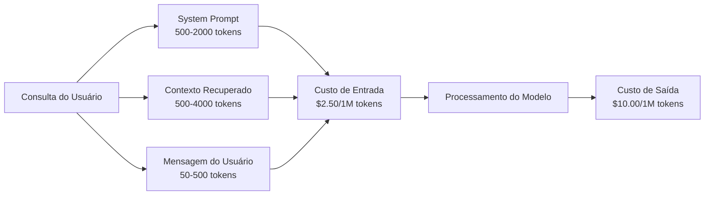
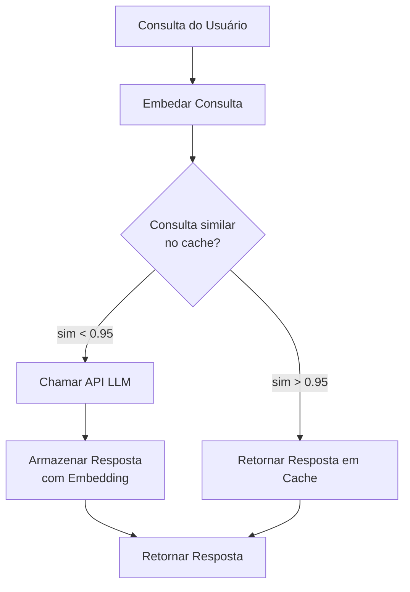
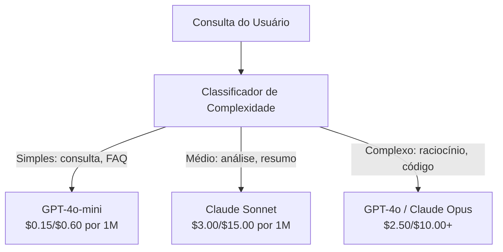

# Caching, Rate Limiting & Otimização de Custo

> A maioria das startups de IA não morre de modelos ruins. Morre de economia de unidade ruim. Uma única chamada GPT-4o custa frações de centavo. Dez mil usuários fazendo dez chamadas por dia custam $250 só em tokens de entrada — antes de cobrar um dólar. As empresas que sobrevivem tratam cada chamada de API como transação financeira, não chamada de função.

**Tipo:** Construção
**Linguagens:** Python
**Pré-requisitos:** Fase 11 Aula 09 (Function Calling)
**Tempo:** ~45 minutos
**Relacionado:** Fase 11 · 15 (Prompt Caching) — esta aula cobre cache em camada de aplicação (cache semântico, cache de hash exato, roteamento de modelo). A Aula 15 cobre cache de prompt em camada de provedor (cache_control Anthropic, automático OpenAI, CachedContent Gemini). Combine ambos para 50-95% de redução de custo.

## Objetivos de Aprendizado

- Implementar cache semântico que atende queries repetidas ou similares do cache em vez de fazer nova chamada de API
- Calcular custos por requisição entre provedores e implementar rate limiting consciente de token e alertas de orçamento
- Construir camada de otimização de custo com compressão de prompt, roteamento de modelo (caro vs barato) e cache de resposta
- Projetar estratégia de cache em camadas usando match exato, similaridade semântica e prefix cache para diferentes tipos de consulta

## O Problema

Você constrói um chatbot RAG. Funciona lindamente. Usuários amam.

Então a fatura chega.

GPT-5 custa $5 por milhão de tokens de entrada e $15 por milhão de saída. Claude Opus 4.7 custa $15 de entrada / $75 de saída. Gemini 3 Pro custa $1.25 entrada / $5 saída. GPT-5-mini é $0.25/$2. Os preços abaixo são ilustrativos; sempre verifique a página de preços atual do provedor.

Aqui está a matemática que mata startups:

- 10.000 usuários ativos diários
- 10 consultas por usuário por dia
- 1.000 tokens de entrada por consulta (system prompt + contexto + mensagem do usuário)
- 500 tokens de saída por resposta

**Custo diário de entrada:** 10.000 x 10 x 1.000 / 1.000.000 x $2.50 = **$250/dia**
**Custo diário de saída:** 10.000 x 10 x 500 / 1.000.000 x $10.00 = **$500/dia**
**Total mensal:** **$22.500/mês**

Isso é só o LLM. Adicione embeddings, hospedagem de banco vetorial, infraestrutura. Você está olhando $30.000/mês para um chatbot.

A parte brutal: 40-60% dessas consultas são quase-duplicadas. Usuários fazem as mesmas perguntas com palavras ligeiramente diferentes. Seu system prompt — idêntico em toda requisição — é cobrado toda vez. Documentos de contexto recuperados por RAG se repetem entre usuários que perguntam sobre o mesmo tópico.

Você está pagando preço cheio por computação redundante.

## O Conceito

### A Anatomia de Custo de uma Chamada LLM

Toda chamada de API tem cinco componentes de custo.



System prompts são o assassino silencioso. Um system prompt de 1.500 tokens enviado com toda requisição custa $3.75 por milhão de requisições só para esse prefixo. A 100K requisições por dia, isso é $375/dia — $11.250/mês — para texto que nunca muda.

### Cache de Provedor: Descontos Embutidos

Todos os três grandes provedores oferecem cache de prompt no lado do provedor em 2026, mas a mecânica difere. Veja a Fase 11 · 15 para o mergulho profundo.

| Provedor | Mecanismo | Desconto | Mínimo | Duração do Cache |
|----------|-----------|----------|--------|-----------------|
| Anthropic | Marcadores cache_control explícitos | 90% em hits (paga 25% extra na escrita) | 1.024 tokens (Sonnet/Opus), 2.048 (Haiku) | 5 min padrão; 1h estendido (2x prêmio de escrita) |
| OpenAI | Correspondência automática de prefixo | 50% em hits | 1.024 tokens | Melhor esforço até 1 hora |
| Google Gemini | API CachedContent explícita | ~75% redução (mais armazenamento) | 4.096 (Flash) / 32.768 (Pro) | TTL configurável pelo usuário |

**Abordagem da Anthropic** é explícita. Você marca seções do seu prompt com `cache_control: {"type": "ephemeral"}`. A primeira requisição paga um prêmio de 25% de escrita. Requisições subsequentes com o mesmo prefixo recebem 90% de desconto. Um system prompt de 2.000 tokens que custa $0.005 normalmente custa $0.000625 em cache hits. Em 100K requisições, isso economiza $437.50/dia.

**Abordagem da OpenAI** é automática. Qualquer prefixo de prompt que corresponde a uma requisição anterior recebe 50% de desconto. Sem marcadores necessários. O trade-off: menos desconto, menos controle, mas zero esforço de implementação.

### Cache Semântico: Sua Camada Customizada

Cache de provedor só funciona para prefixos idênticos. Cache semântico lida com o caso mais difícil: consultas diferentes com o mesmo significado.

"Qual é a política de devolução?" e "Como devolvo um item?" são strings diferentes mas intenção idêntica. Um cache semântico embeda ambas as consultas, computa similaridade cosseno e retorna a resposta em cache se a similaridade exceder um limiar (tipicamente 0.92-0.95).



Os custos de embedding são insignificantes. text-embedding-3-small da OpenAI custa $0.02 por milhão de tokens. Verificar o cache custa quase nada comparado a uma chamada LLM completa.

### Cache Exato: Hash e Correspondência

Para chamadas determinísticas (temperature=0, mesmo modelo, mesmo prompt), cache exato é mais simples e rápido. Faça hash do prompt completo, verifique o cache, retorne se encontrado.

Isso funciona perfeitamente para:
- System prompt + contexto fixo + consultas de usuário idênticas
- Function calling com definições de ferramentas idênticas
- Processamento em lote onde o mesmo documento é processado múltiplas vezes

### Rate Limiting: Protegendo Seu Orçamento

Rate limiting não é só sobre justiça. É sobre sobrevivência.

**Algoritmo token bucket:** cada usuário recebe um balde de N tokens que recarrega a taxa R por segundo. Uma requisição consome tokens do balde. Se o balde está vazio, a requisição é rejeitada. Isso permite rajadas (usar o balde inteiro de uma vez) enquanto impõe uma taxa média.

**Cotas por usuário:** defina limites diários/mensais de token por nível de usuário.

| Nível | Limite Diário de Tokens | Máx. Requisições/min | Acesso a Modelos |
|-------|------------------------|---------------------|------------------|
| Gratuito | 50.000 | 10 | Apenas GPT-4o-mini |
| Pro | 500.000 | 60 | GPT-4o, Claude Sonnet |
| Enterprise | 5.000.000 | 300 | Todos os modelos |

### Roteamento de Modelo: Modelo Certo para o Trabalho Certo

Nem toda consulta precisa de GPT-4o.

"Que horas a loja fecha?" não requer um modelo de $10/M de saída. GPT-4o-mini a $0.60/M de saída lida perfeitamente. Claude Haiku a $1.25/M de saída lida. Um classificador simples roteia consultas baratas para modelos baratos e consultas complexas para modelos caros.



Um roteador bem ajustado economiza 40-70% só em custos de modelo.

### Rastreamento de Custo: Saiba Para Onde o Dinheiro Vai

Você não pode otimizar o que não mede. Registre toda chamada de API com:

- Timestamp
- Nome do modelo
- Tokens de entrada
- Tokens de saída
- Latência (ms)
- Custo computado ($)
- ID do usuário
- Cache hit/miss
- Categoria da requisição

Estes dados revelam quais features são caras, quais usuários são consumidores pesados e onde o cache tem mais impacto.

### Processamento em Lote: Descontos por Volume

A Batch API da OpenAI processa requisições assincronamente com 50% de desconto. Você submete um lote de até 50.000 requisições e os resultados chegam em 24 horas.

Use lotes para:
- Processamento noturno de documentos
- Classificação em massa
- Execuções de avaliação
- Pipelines de enriquecimento de dados

Não para: requisições em tempo real voltadas ao usuário (latência importa).

### Alertas de Orçamento e Circuit Breaker

Um circuit breaker interrompe gastos quando você atinge um limite. Sem um, um bug ou abuso pode queimar seu orçamento mensal em horas.

Defina três limiares:
1. **Aviso** (70% do orçamento): envie um alerta
2. **Redução** (85% do orçamento): mude para modelos mais baratos apenas
3. **Parada** (95% do orçamento): rejeite novas requisições, retorne apenas respostas em cache

### A Pilha de Otimização

Aplique estas técnicas em ordem. Cada camada se acumula sobre as anteriores.

| Camada | Técnica | Economia Típica | Esforço de Implementação |
|--------|---------|----------------|--------------------------|
| 1 | Cache de prompt do provedor | 30-50% | Baixo (adicionar marcadores de cache) |
| 2 | Cache exato | 10-20% | Baixo (hash + dicionário) |
| 3 | Cache semântico | 15-30% | Médio (embeddings + similaridade) |
| 4 | Roteamento de modelo | 40-70% | Médio (classificador) |
| 5 | Rate limiting | Proteção de orçamento | Baixo (token bucket) |
| 6 | Compressão de prompt | 10-30% | Médio (reescrever prompts) |
| 7 | Batch API | 50% em elegíveis | Baixo (API de lote) |

Uma aplicação RAG aplicando camadas 1-5 tipicamente reduz custos de $22.500/mês para $4.000-6.000/mês. Essa é a diferença entre queimar caixa e construir um negócio.

### Economia Real: Antes e Depois

Aqui está uma decomposição real para um chatbot RAG servindo 10.000 DAU.

| Métrica | Antes da Otimização | Depois da Otimização | Economia |
|---------|--------------------|----------------------|----------|
| Custo mensal LLM | $22.500 | $5.200 | 77% |
| Custo médio por consulta | $0.0075 | $0.0017 | 77% |
| Taxa de cache hit | 0% | 52% | -- |
| Consultas roteadas para mini | 0% | 65% | -- |
| Latência P95 | 2.800ms | 900ms (cache hits: 50ms) | 68% |
| Custo mensal de embedding | $0 | $180 | (novo custo) |
| Custo mensal total | $22.500 | $5.380 | 76% |

O custo de embedding para cache semântico ($180/mês) se paga dentro da primeira hora de cache hits.

## Construa

### Passo 1: Calculadora de Custo

Construa uma calculadora de custo de token que conhece os preços atuais dos principais modelos.

```python
import hashlib
import time
import json
import math
from dataclasses import dataclass, field


MODEL_PRICING = {
    "gpt-4o": {"input": 2.50, "output": 10.00, "cached_input": 1.25},
    "gpt-4o-mini": {"input": 0.15, "output": 0.60, "cached_input": 0.075},
    "gpt-4.1": {"input": 2.00, "output": 8.00, "cached_input": 0.50},
    "gpt-4.1-mini": {"input": 0.40, "output": 1.60, "cached_input": 0.10},
    "gpt-4.1-nano": {"input": 0.10, "output": 0.40, "cached_input": 0.025},
    "o3": {"input": 2.00, "output": 8.00, "cached_input": 0.50},
    "o3-mini": {"input": 1.10, "output": 4.40, "cached_input": 0.55},
    "o4-mini": {"input": 1.10, "output": 4.40, "cached_input": 0.275},
    "claude-opus-4": {"input": 15.00, "output": 75.00, "cached_input": 1.50},
    "claude-sonnet-4": {"input": 3.00, "output": 15.00, "cached_input": 0.30},
    "claude-haiku-3.5": {"input": 0.80, "output": 4.00, "cached_input": 0.08},
    "gemini-2.5-pro": {"input": 1.25, "output": 10.00, "cached_input": 0.3125},
    "gemini-2.5-flash": {"input": 0.15, "output": 0.60, "cached_input": 0.0375},
}


def calculate_cost(model, input_tokens, output_tokens, cached_input_tokens=0):
    if model not in MODEL_PRICING:
        return {"error": f"Modelo desconhecido: {model}"}
    pricing = MODEL_PRICING[model]
    non_cached = input_tokens - cached_input_tokens
    input_cost = (non_cached / 1_000_000) * pricing["input"]
    cached_cost = (cached_input_tokens / 1_000_000) * pricing["cached_input"]
    output_cost = (output_tokens / 1_000_000) * pricing["output"]
    total = input_cost + cached_cost + output_cost
    return {
        "model": model,
        "input_tokens": input_tokens,
        "output_tokens": output_tokens,
        "cached_input_tokens": cached_input_tokens,
        "input_cost": round(input_cost, 6),
        "cached_input_cost": round(cached_cost, 6),
        "output_cost": round(output_cost, 6),
        "total_cost": round(total, 6),
    }
```

### Passo 2: Cache Exato

Faça hash do prompt completo e retorne respostas em cache para requisições idênticas.

```python
class ExactCache:
    def __init__(self, max_size=1000, ttl_seconds=3600):
        self.cache = {}
        self.max_size = max_size
        self.ttl = ttl_seconds
        self.hits = 0
        self.misses = 0

    def _hash(self, model, messages, temperature):
        key_data = json.dumps({"model": model, "messages": messages, "temperature": temperature}, sort_keys=True)
        return hashlib.sha256(key_data.encode()).hexdigest()

    def get(self, model, messages, temperature=0.0):
        if temperature > 0:
            self.misses += 1
            return None
        key = self._hash(model, messages, temperature)
        if key in self.cache:
            entry = self.cache[key]
            if time.time() - entry["timestamp"] < self.ttl:
                self.hits += 1
                entry["access_count"] += 1
                return entry["response"]
            del self.cache[key]
        self.misses += 1
        return None

    def put(self, model, messages, temperature, response):
        if temperature > 0:
            return
        if len(self.cache) >= self.max_size:
            oldest_key = min(self.cache, key=lambda k: self.cache[k]["timestamp"])
            del self.cache[oldest_key]
        key = self._hash(model, messages, temperature)
        self.cache[key] = {
            "response": response,
            "timestamp": time.time(),
            "access_count": 1,
        }

    def stats(self):
        total = self.hits + self.misses
        return {
            "hits": self.hits,
            "misses": self.misses,
            "hit_rate": round(self.hits / total, 4) if total > 0 else 0,
            "cache_size": len(self.cache),
        }
```

### Passo 3: Cache Semântico

Embarque consultas e retorne respostas em cache quando a similaridade exceder um limiar.

```python
def simple_embed(text):
    words = text.lower().split()
    vocab = {}
    for w in words:
        vocab[w] = vocab.get(w, 0) + 1
    norm = math.sqrt(sum(v * v for v in vocab.values()))
    if norm == 0:
        return {}
    return {k: v / norm for k, v in vocab.items()}


def cosine_similarity(a, b):
    if not a or not b:
        return 0.0
    all_keys = set(a) | set(b)
    dot = sum(a.get(k, 0) * b.get(k, 0) for k in all_keys)
    return dot


class SemanticCache:
    def __init__(self, similarity_threshold=0.85, max_size=500, ttl_seconds=3600):
        self.entries = {}
        self.similarity_threshold = similarity_threshold
        self.max_size = max_size
        self.ttl = ttl_seconds
        self.hits = 0
        self.misses = 0
        self._cache_order = []

    def get(self, query):
        query_emb = simple_embed(query)
        best_match = None
        best_sim = 0.0

        for key in list(self.entries.keys()):
            entry = self.entries[key]
            if time.time() - entry["timestamp"] > self.ttl:
                del self.entries[key]
                self._cache_order.remove(key)
                continue
            sim = cosine_similarity(query_emb, entry["embedding"])
            if sim > best_sim:
                best_sim = sim
                best_match = entry

        if best_match and best_sim >= self.similarity_threshold:
            self.hits += 1
            best_match["access_count"] += 1
            return {"response": best_match["response"], "similarity": round(best_sim, 4)}

        self.misses += 1
        return None

    def put(self, query, response):
        if len(self.entries) >= self.max_size:
            oldest = self._cache_order.pop(0)
            del self.entries[oldest]
        emb = simple_embed(query)
        key = hashlib.md5(query.encode()).hexdigest()
        self.entries[key] = {
            "query": query,
            "embedding": emb,
            "response": response,
            "timestamp": time.time(),
            "access_count": 1,
        }
        self._cache_order.append(key)

    def stats(self):
        total = self.hits + self.misses
        return {
            "hits": self.hits,
            "misses": self.misses,
            "hit_rate": round(self.hits / total, 4) if total > 0 else 0,
            "cache_size": len(self.entries),
        }
```

### Passo 4: Rastreador de Custo

```python
@dataclass
class CostLogEntry:
    model: str
    input_tokens: int
    output_tokens: int
    cached_input_tokens: int = 0
    cost: float = 0.0
    latency_ms: float = 0.0
    user_id: str = ""
    cache_status: str = "miss"
    timestamp: float = 0.0

    def __post_init__(self):
        if self.timestamp == 0.0:
            self.timestamp = time.time()


class CostTracker:
    def __init__(self, monthly_budget=1000.0):
        self.logs = []
        self.monthly_budget = monthly_budget
        self.alerts = []

    def log_call(self, model, input_tokens, output_tokens, cached_input_tokens=0, latency_ms=0, user_id="", cache_status="miss"):
        cost_info = calculate_cost(model, input_tokens, output_tokens, cached_input_tokens)
        cost = cost_info.get("total_cost", 0.0) if isinstance(cost_info, dict) else 0.0
        entry = CostLogEntry(
            model=model, input_tokens=input_tokens, output_tokens=output_tokens,
            cached_input_tokens=cached_input_tokens, cost=cost, latency_ms=latency_ms,
            user_id=user_id, cache_status=cache_status,
        )
        self.logs.append(entry)
        self._check_budget()

    def total_cost(self):
        return sum(log.cost for log in self.logs)

    def _check_budget(self):
        total = self.total_cost()
        pct = total / self.monthly_budget if self.monthly_budget > 0 else 0

        if pct >= 0.95 and not any(a["level"] == "stop" for a in self.alerts):
            self.alerts.append({"level": "stop", "message": f"Orçamento 95% consumido (${total:.2f}/${self.monthly_budget:.2f})"})
        elif pct >= 0.85 and not any(a["level"] == "throttle" for a in self.alerts):
            self.alerts.append({"level": "throttle", "message": f"Orçamento 85% consumido (${total:.2f}/${self.monthly_budget:.2f})"})
        elif pct >= 0.70 and not any(a["level"] == "warning" for a in self.alerts):
            self.alerts.append({"level": "warning", "message": f"Orçamento 70% consumido (${total:.2f}/${self.monthly_budget:.2f})"})

    def summary(self):
        total = self.total_cost()
        n_calls = len(self.logs)
        cache_hits = sum(1 for l in self.logs if l.cache_status == "hit")
        return {
            "total_requests": n_calls,
            "total_cost_usd": round(total, 4),
            "avg_cost_per_call": round(total / n_calls, 6) if n_calls else 0,
            "cache_hit_count": cache_hits,
            "cache_hit_rate_pct": round(cache_hits / n_calls * 100, 1) if n_calls else 0,
            "avg_latency_ms": round(sum(l.latency_ms for l in self.logs) / n_calls, 1) if n_calls else 0,
            "alerts": self.alerts,
        }

    def cost_by_model(self):
        model_costs = {}
        for log in self.logs:
            if log.model not in model_costs:
                model_costs[log.model] = {"calls": 0, "cost": 0.0, "input_tokens": 0, "output_tokens": 0}
            model_costs[log.model]["calls"] += 1
            model_costs[log.model]["cost"] += log.cost
            model_costs[log.model]["input_tokens"] += log.input_tokens
            model_costs[log.model]["output_tokens"] += log.output_tokens
        return model_costs
```

### Passo 5: Rate Limiter com Token Bucket

```python
class TokenBucketRateLimiter:
    def __init__(self):
        self.buckets = {}

    def check(self, user_id, tokens_needed, tier="free"):
        limits = {
            "free": {"capacity": 50000, "refill_rate": 50, "max_requests_per_min": 10},
            "pro": {"capacity": 500000, "refill_rate": 500, "max_requests_per_min": 60},
            "enterprise": {"capacity": 5000000, "refill_rate": 5000, "max_requests_per_min": 300},
        }
        tier_limits = limits.get(tier, limits["free"])

        if user_id not in self.buckets:
            self.buckets[user_id] = {
                "tokens": tier_limits["capacity"],
                "capacity": tier_limits["capacity"],
                "refill_rate": tier_limits["refill_rate"],
                "last_refill": time.time(),
                "minute_requests": [],
            }

        bucket = self.buckets[user_id]

        now = time.time()
        elapsed = now - bucket["last_refill"]
        bucket["tokens"] = min(bucket["capacity"], bucket["tokens"] + elapsed * bucket["refill_rate"])
        bucket["last_refill"] = now

        bucket["minute_requests"] = [t for t in bucket["minute_requests"] if t > now - 60]
        if len(bucket["minute_requests"]) >= tier_limits["max_requests_per_min"]:
            return {"allowed": False, "reason": "Limite de requisições por minuto excedido", "tokens_available": bucket["tokens"]}

        if bucket["tokens"] >= tokens_needed:
            return {"allowed": True, "tokens_available": bucket["tokens"]}

        return {"allowed": False, "reason": "Tokens insuficientes", "tokens_available": bucket["tokens"]}

    def consume(self, user_id, tokens, tier="free"):
        if user_id in self.buckets:
            self.buckets[user_id]["tokens"] = max(0, self.buckets[user_id]["tokens"] - tokens)
            self.buckets[user_id]["minute_requests"].append(time.time())

    def get_usage(self, user_id):
        if user_id not in self.buckets:
            return {"tokens": 0, "capacity": 0, "usage_pct": 0}
        bucket = self.buckets[user_id]
        usage_pct = (1 - bucket["tokens"] / bucket["capacity"]) * 100
        return {
            "tokens": round(bucket["tokens"], 0),
            "capacity": bucket["capacity"],
            "usage_pct": round(usage_pct, 1),
        }
```

### Passo 6: Roteador de Modelo

```python
SIMPLE_KEYWORDS = ["que horas", "endereço", "telefone", "preço", "olá", "obrigado", "horário", "aberto", "fechado"]
COMPLEX_KEYWORDS = ["analisar", "comparar", "explicar por quê", "escrever código", "debugar",
                    "implementar", "arquitetura", "trade-off", "pros e contras"]


def classify_complexity(query):
    q = query.lower()
    word_count = len(q.split())

    if word_count <= 5 or any(kw in q for kw in SIMPLE_KEYWORDS):
        return "simple"

    if any(kw in q for kw in COMPLEX_KEYWORDS):
        return "complex"

    if word_count > 15:
        return "complex"

    return "medium"


def route_model(query, user_tier="free"):
    complexity = classify_complexity(query)

    routing = {
        "free": {
            "simple": "gpt-4o-mini",
            "medium": "gpt-4o-mini",
            "complex": "gpt-4o-mini",
        },
        "pro": {
            "simple": "gpt-4o-mini",
            "medium": "claude-sonnet-4",
            "complex": "gpt-4o",
        },
        "enterprise": {
            "simple": "gpt-4o-mini",
            "medium": "claude-sonnet-4",
            "complex": "claude-opus-4",
        },
    }

    model = routing.get(user_tier, routing["free"]).get(complexity, "gpt-4o-mini")
    return {"model": model, "complexity": complexity}
```

### Passo 7: Pipeline Completa de Otimização

Combinando cache, roteamento e rate limiting em uma única camada:

```python
def simulate_llm_call(model, query):
    word_count = len(query.split())
    input_tokens = max(word_count * 4, 100)
    output_tokens = max(word_count * 8, 50)
    latency_ms = input_tokens * 0.5 + output_tokens * 0.8
    response = f"Resposta do {model} para: '{query[:30]}...'"
    return {
        "input_tokens": input_tokens,
        "output_tokens": output_tokens,
        "latency_ms": round(latency_ms, 1),
        "response": response,
        "model": model,
    }


def run_demo():
    print("=" * 60)
    print("  Demonstração de Otimização de Custo")
    print("=" * 60)

    print("\n--- Calculadora de Custo ---")
    cost_examples = [
        ("gpt-4o", 1500, 400, 0),
        ("gpt-4o", 1500, 400, 1000),
        ("gpt-4o-mini", 1500, 400, 0),
        ("claude-sonnet-4", 1500, 400, 0),
        ("claude-opus-4", 1500, 400, 0),
    ]
    for model, inp, out, cached in cost_examples:
        info = calculate_cost(model, inp, out, cached)
        print(f"  {model}: ${info['total_cost']:.6f} (entrada: ${info['input_cost']:.6f}, saída: ${info['output_cost']:.6f}, cacheado: ${info['cached_input_cost']:.6f})")

    print("\n--- Cache Exato ---")
    exact_cache = ExactCache(max_size=10, ttl_seconds=60)
    messages = [{"role": "user", "content": "Qual a política de reembolso?"}]
    r1 = exact_cache.get("gpt-4o", messages, 0.0)
    print(f"  Primeira consulta (esperado miss): {r1}")
    exact_cache.put("gpt-4o", messages, 0.0, "Reembolso em 30 dias.")
    r2 = exact_cache.get("gpt-4o", messages, 0.0)
    print(f"  Segunda consulta (esperado hit): {r2}")
    print(f"  Stats: {exact_cache.stats()}")

    print("\n--- Cache Semântico ---")
    sem_cache = SemanticCache(similarity_threshold=0.75, max_size=10)
    queries = [
        "Qual a política de reembolso?",
        "Como faço para devolver algo?",
        "Quais são os horários de funcionamento?",
        "Quando vocês abrem?",
    ]
    responses = [
        "Oferecemos reembolso total em 30 dias.",
        "Para devolver um item, acesse sua conta e solicite a devolução.",
        "Estamos abertos das 9h às 18h, segunda a sexta.",
        "Abrimos às 9h todos os dias úteis.",
    ]
    for q, r in zip(queries, responses):
        sem_cache.put(q, r)

    test_queries = [
        "Qual é a política de devolução?",
        "Como devolver um produto?",
        "Que horas vocês funcionam?",
    ]
    for query in test_queries:
        cached = sem_cache.get(query)
        if cached:
            print(f"  '{query[:40]}' -> HIT (similaridade: {cached['similarity']})")
        else:
            print(f"  '{query[:40]}' -> MISS")
    print(f"  Stats: {sem_cache.stats()}")

    print("\n--- Rate Limiting ---")
    rate_limiter = TokenBucketRateLimiter()
    for i in range(12):
        check = rate_limiter.check("user_1", 1000, "free")
        if check["allowed"]:
            rate_limiter.consume("user_1", 1000, "free")
        status = "OK" if check["allowed"] else f"BLOQUEADO ({check['reason']})"
        if i < 5 or not check["allowed"]:
            print(f"  Requisição {i+1}: {status}")
    print(f"  Uso: {rate_limiter.get_usage('user_1')}")

    print("\n--- Roteamento de Modelo ---")
    routing_queries = [
        "Que horas vocês fecham?",
        "Resuma este relatório de ganhos trimestrais",
        "Analise os trade-offs entre microsserviços e monólitos",
        "Olá",
        "Escreva código para uma árvore binária de busca com deleção",
    ]
    for q in routing_queries:
        route = route_model(q, "pro")
        print(f"  '{q[:50]}' -> {route['model']} ({route['complexity']})")

    print("\n--- Antes vs Depois da Otimização ---")
    queries = [
        "Qual é a política de reembolso?",
        "Como devolver algo?",
        "Quais são os horários?",
        "Quando vocês abrem?",
        "Explique a diferença entre TCP e UDP",
        "Compare TCP vs UDP",
        "Olá",
        "Qual é o número de telefone?",
        "Escreva uma função Python para ordenar uma lista",
        "Analise os prós e contras de arquitetura serverless",
    ]

    print("\n  [Antes: sem cache, modelo único (gpt-4o)]")
    tracker_before = CostTracker(monthly_budget=1000.0)
    for q in queries:
        result = simulate_llm_call("gpt-4o", q)
        tracker_before.log_call("gpt-4o", result["input_tokens"], result["output_tokens"], latency_ms=result["latency_ms"], cache_status="miss")
    before = tracker_before.summary()
    print(f"  Custo total: ${before['total_cost']:.6f}")
    print(f"  Custo médio/chamada: ${before['avg_cost_per_call']:.6f}")
    print(f"  Latência média: {before['avg_latency_ms']}ms")

    print("\n  [Depois: cache + roteamento + rate limiting]")
    exact_c = ExactCache()
    semantic_c = SemanticCache(similarity_threshold=0.75)
    tracker_after = CostTracker(monthly_budget=1000.0)

    for q in queries:
        messages = [{"role": "user", "content": q}]
        cached = exact_c.get("gpt-4o", messages, 0.0)
        if cached:
            tracker_after.log_call("gpt-4o-mini", 0, 0, latency_ms=5, cache_status="hit")
            continue
        sem_cached = semantic_c.get(q)
        if sem_cached:
            tracker_after.log_call("gpt-4o-mini", 0, 0, latency_ms=15, cache_status="hit")
            continue
        route = route_model(q)
        result = simulate_llm_call(route["model"], q)
        tracker_after.log_call(route["model"], result["input_tokens"], result["output_tokens"], latency_ms=result["latency_ms"], cache_status="miss")
        exact_c.put(route["model"], messages, 0.0, result["response"])
        semantic_c.put(q, result["response"])

    after = tracker_after.summary()
    print(f"  Custo total: ${after['total_cost']:.6f}")
    print(f"  Custo médio/chamada: ${after['avg_cost_per_call']:.6f}")
    print(f"  Latência média: {after['avg_latency_ms']}ms")
    print(f"  Taxa de cache hit: {after['cache_hit_rate_pct']:.0f}%")

    if before["total_cost"] > 0:
        savings_pct = (1 - after["total_cost"] / before["total_cost"]) * 100
        print(f"\n  ECONOMIA: {savings_pct:.1f}% de redução de custo")
```

## Use

### Anthropic Prompt Caching

```python
# import anthropic
#
# client = anthropic.Anthropic()
#
# response = client.messages.create(
#     model="claude-sonnet-4-20250514",
#     max_tokens=1024,
#     system=[
#         {
#             "type": "text",
#             "text": "Você é um assistente de suporte da Acme Corp...",
#             "cache_control": {"type": "ephemeral"},
#         }
#     ],
#     messages=[{"role": "user", "content": "Qual a política de reembolso?"}],
# )
#
# print(f"Tokens de entrada: {response.usage.input_tokens}")
# print(f"Tokens de criação de cache: {response.usage.cache_creation_input_tokens}")
# print(f"Tokens de leitura de cache: {response.usage.cache_read_input_tokens}")
```

A primeira chamada escreve no cache (prêmio de 25%). Toda chamada subsequente com o mesmo prefixo de system prompt lê do cache (90% de desconto). O cache dura 5 minutos e reinicia o timer em cada hit.

### OpenAI Automatic Caching

```python
# from openai import OpenAI
#
# client = OpenAI()
#
# response = client.chat.completions.create(
#     model="gpt-4o",
#     messages=[
#         {"role": "system", "content": "Você é um assistente de suporte..."},
#         {"role": "user", "content": "Qual a política de reembolso?"},
#     ],
# )
#
# print(f"Tokens de prompt: {response.usage.prompt_tokens}")
# print(f"Tokens em cache: {response.usage.prompt_tokens_details.cached_tokens}")
# print(f"Tokens de completion: {response.usage.completion_tokens}")
```

OpenAI faz cache automaticamente. Qualquer prefixo de prompt de 1.024+ tokens que corresponde a uma requisição recente recebe 50% de desconto. Sem mudanças de código necessárias — apenas verifique `prompt_tokens_details.cached_tokens` na resposta para confirmar que está funcionando.

### OpenAI Batch API

```python
# import json
# from openai import OpenAI
#
# client = OpenAI()
#
# requests = []
# for i, consulta in enumerate(queries):
#     requests.append({
#         "custom_id": f"request-{i}",
#         "method": "POST",
#         "url": "/v1/chat/completions",
#         "body": {
#             "model": "gpt-4o-mini",
#             "messages": [{"role": "user", "content": consulta}],
#         },
#     })
#
# with open("batch_input.jsonl", "w") as f:
#     for r in requests:
#         f.write(json.dumps(r) + "\n")
#
# batch_file = client.files.create(file=open("batch_input.jsonl", "rb"), purpose="batch")
# batch = client.batches.create(input_file_id=batch_file.id, endpoint="/v1/chat/completions", completion_window="24h")
# print(f"ID do lote: {batch.id}, Status: {batch.status}")
```

Batch API dá 50% de desconto fixo em todos os tokens. Resultados chegam em 24 horas. Perfeito para cargas de trabalho não-real-time: avaliações, rotulagem de dados, sumarização em massa.

### Cache Semântico em Produção com Redis

```python
# import redis
# import numpy as np
# from openai import OpenAI
#
# r = redis.Redis()
# client = OpenAI()
#
# def get_embedding(text):
#     response = client.embeddings.create(model="text-embedding-3-small", input=text)
#     return response.data[0].embedding
#
# def semantic_cache_lookup(query, threshold=0.95):
#     query_emb = np.array(get_embedding(query))
#     keys = r.keys("cache:emb:*")
#     best_sim, best_key = 0, None
#     for key in keys:
#         stored_emb = np.frombuffer(r.get(key), dtype=np.float32)
#         sim = np.dot(query_emb, stored_emb) / (np.linalg.norm(query_emb) * np.linalg.norm(stored_emb))
#         if sim > best_sim:
#             best_sim, best_key = sim, key
#     if best_sim >= threshold and best_key:
#         response_key = best_key.decode().replace("cache:emb:", "cache:resp:")
#         return r.get(response_key).decode()
#     return None
```

Em produção, substitua a varredura linear por um índice vetorial (Redis Vector Search, Pinecone ou pgvector). Varredura linear funciona para <1.000 entradas. Além disso, use ANN (approximate nearest neighbor) para busca O(log n).

## Entregue

Esta aula produz `outputs/prompt-cost-optimizer.md` — um prompt reutilizável que analisa sua aplicação LLM e recomenda otimizações de custo específicas com economia projetada.

Também produz `outputs/skill-cost-patterns.md` — um framework de decisão para escolher a estratégia de cache certa, configuração de rate limiting e regras de roteamento de modelo para seu caso de uso.

## Exercícios

1. **Implemente evicção LRU para o cache semântico.** Substitua a evicção do mais antigo pelo menos recentemente usado. Rastreie o último tempo de acesso para cada entrada e evite a entrada com o tempo de acesso mais antigo quando o cache estiver cheio. Compare as taxas de hit entre as duas estratégias em 100 consultas.

2. **Construa uma ferramenta de projeção de custo.** Dado um log de chamadas de API (os logs do CostTracker), projete o custo mensal baseado na média dos últimos 7 dias. Considere padrões de dia de semana/fim de semana. Dispare um alerta se o custo mensal projetado exceder o orçamento em mais de 20%.

3. **Implemente cache semântico em camadas.** Use dois limiares de similaridade: 0.98 para hits de alta confiança (retorne imediatamente) e 0.90 para hits de confiança média (retorne com um aviso: "Baseado em uma pergunta similar anterior..."). Rastreie de qual camada cada hit veio e meça diferenças de satisfação do usuário.

4. **Construa um classificador de roteamento de modelo.** Substitua o classificador baseado em palavras-chave por um baseado em embedding. Embarque 50 consultas rotuladas (simples/médio/complexo), depois classifique novas consultas encontrando o exemplo rotulado mais próximo. Meça a acurácia de classificação contra um conjunto de teste de 20 consultas.

5. **Implemente um circuit breaker com níveis de degradação.** Em 70% do orçamento, registre um aviso. Em 85%, troque automaticamente todo roteamento para o modelo mais barato (gpt-4o-mini). Em 95%, sirva apenas respostas em cache e rejeite novas requisições. Teste simulando 1.000 requisições contra um orçamento de $1.00 e verifique que cada limiar dispara corretamente.

## Termos-Chave

| Termo | O que o pessoal diz | O que realmente significa |
|-------|--------------------|---------------------------|
| Prompt caching | "Cache o system prompt" | Cache em nível de provedor onde prefixos de prompt repetidos recebem desconto (90% Anthropic, 50% OpenAI) — sem mudanças de código para OpenAI, marcadores explícitos para Anthropic |
| Cache semântico | "Cache inteligente" | Embedar a consulta, computar similaridade com consultas passadas e retornar a resposta em cache se a similaridade exceder um limiar — captura paráfrases que correspondência exata perde |
| Cache exato | "Cache por hash" | Hash do prompt completo (modelo + mensagens + temperatura) e retorno da resposta em cache para entradas idênticas — só funciona para chamadas determinísticas com temperature=0 |
| Token bucket | "Rate limiter" | Algoritmo onde cada usuário tem um balde de N tokens que recarrega a taxa R por segundo — permite rajadas até N enquanto impõe uma taxa média de R |
| Roteamento de modelo | "Roteamento econômico" | Usar um classificador para enviar consultas simples a modelos baratos (GPT-4o-mini, Haiku) e consultas complexas a modelos caros (GPT-4o, Opus) — economiza 40-70% em custos de modelo |
| Rastreamento de custo | "Metering" | Registrar toda chamada de API com modelo, tokens, latência, custo e ID do usuário para saber exatamente onde o dinheiro vai e quais funcionalidades são caras |
| Circuit breaker | "Interruptor de emergência" | Degradar automaticamente o serviço (modelos mais baratos, apenas cache) ou parar requisições completamente quando o gasto se aproxima do limite do orçamento |
| Batch API | "Desconto por volume" | Processamento assíncrono da OpenAI com 50% de desconto — submeta até 50.000 requisições, resultados em 24 horas |
| Compressão de prompt | "Dieta de tokens" | Reescrever system prompts e contexto para usar menos tokens enquanto preserva significado — prompts mais curtos custam menos e frequentemente têm melhor desempenho |
| Taxa de cache hit | "Eficiência do cache" | A porcentagem de requisições servidas do cache em vez de chamar o LLM — 40-60% é típico para chatbots de produção, economiza proporcionalmente em custo |

## Leitura Adicional

- [Anthropic Prompt Caching Guide](https://docs.anthropic.com/en/docs/build-with-claude/prompt-caching) — docs oficiais para marcadores cache_control explícitos da Anthropic, preços e comportamento de tempo de vida do cache
- [OpenAI Prompt Caching](https://platform.openai.com/docs/guides/prompt-caching) — cache automático da OpenAI, como verificar cache hits via campos de uso e comprimentos mínimos de prefixo
- [OpenAI Batch API](https://platform.openai.com/docs/guides/batch) — 50% de desconto para processamento assíncrono, formato JSONL, janela de 24 horas e limites de 50K requisições
- [GPTCache](https://github.com/zilliztech/GPTCache) — biblioteca open-source de cache semântico suportando múltiplos backends de embedding, armazenamentos vetoriais e políticas de evicção
- [Martian Model Router](https://docs.withmartian.com) — roteamento de modelo de produção que seleciona automaticamente o modelo mais barato capaz de lidar com cada consulta
- [Not Diamond](https://www.notdiamond.ai) — roteador de modelo baseado em ML que aprende com seus padrões de tráfego para otimizar trade-offs custo/qualidade entre provedores
- [Helicone](https://www.helicone.ai) — plataforma de observabilidade LLM com rastreamento de custo, cache, rate limiting e alertas de orçamento como camada de proxy
- [Dean & Barroso, "The Tail at Scale" (CACM 2013)](https://research.google/pubs/the-tail-at-scale/) — latência, throughput, percentis TTFT/TPOT e requisições hedgadas; o modelo de custo por trás de "escolha o modelo mais barato que ainda atenda ao P95"
- [Kwon et al., "Efficient Memory Management for Large Language Model Serving with PagedAttention" (SOSP 2023)](https://arxiv.org/abs/2309.06180) — paper vLLM; por que KV-cache paginado + continuous batching superam servidores ingênuos em 24x na taxa de transferência
- [Dao et al., "FlashAttention-2: Faster Attention with Better Parallelism and Work Partitioning" (ICLR 2024)](https://arxiv.org/abs/2307.08691) — redução de custo em nível de kernel ortogonal ao prompt caching; leia junto com speculative decoding e GQA para o quadro completo da curva de custo
