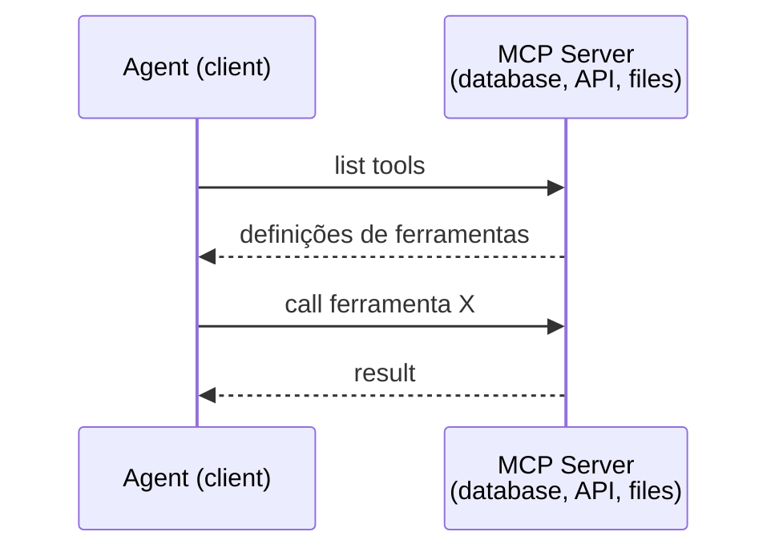
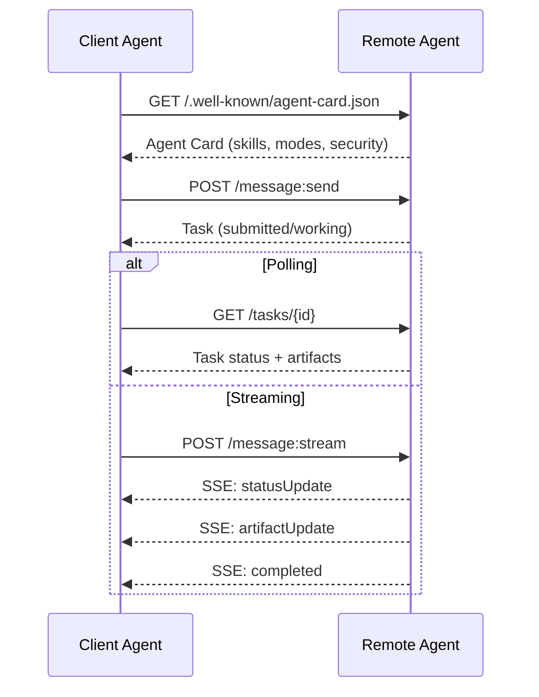
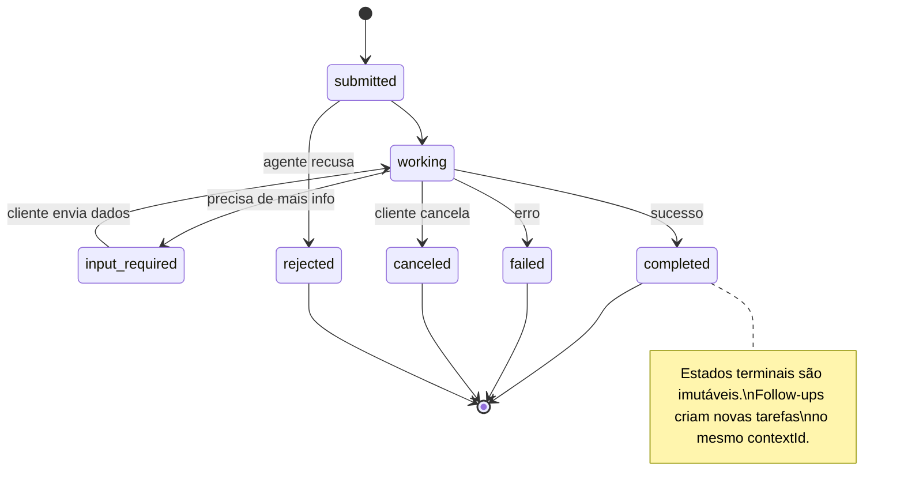
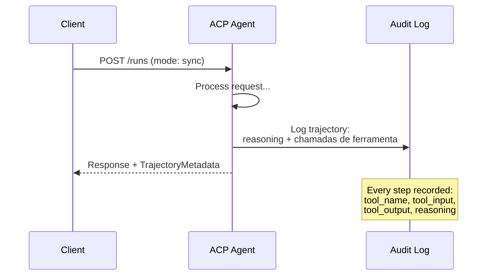
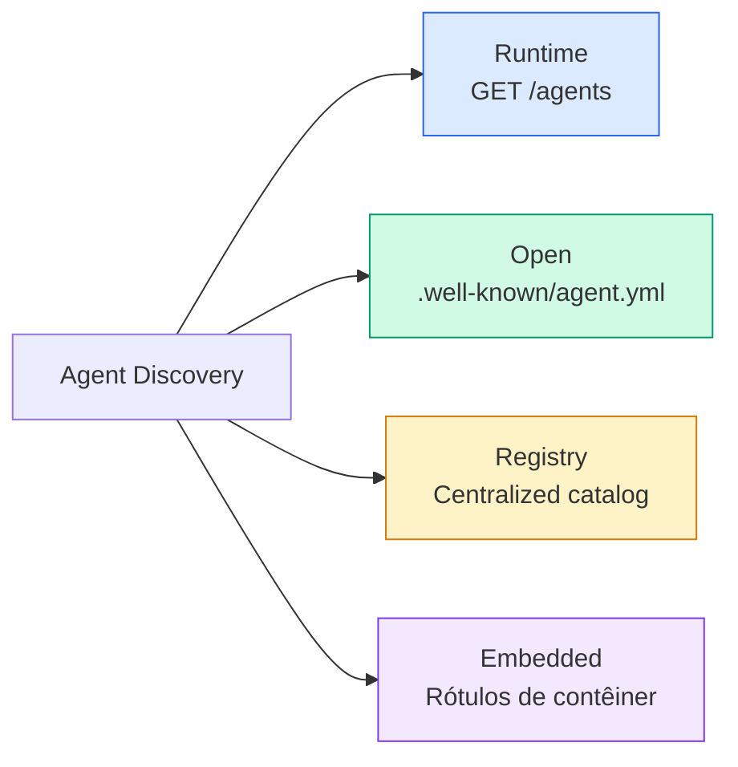
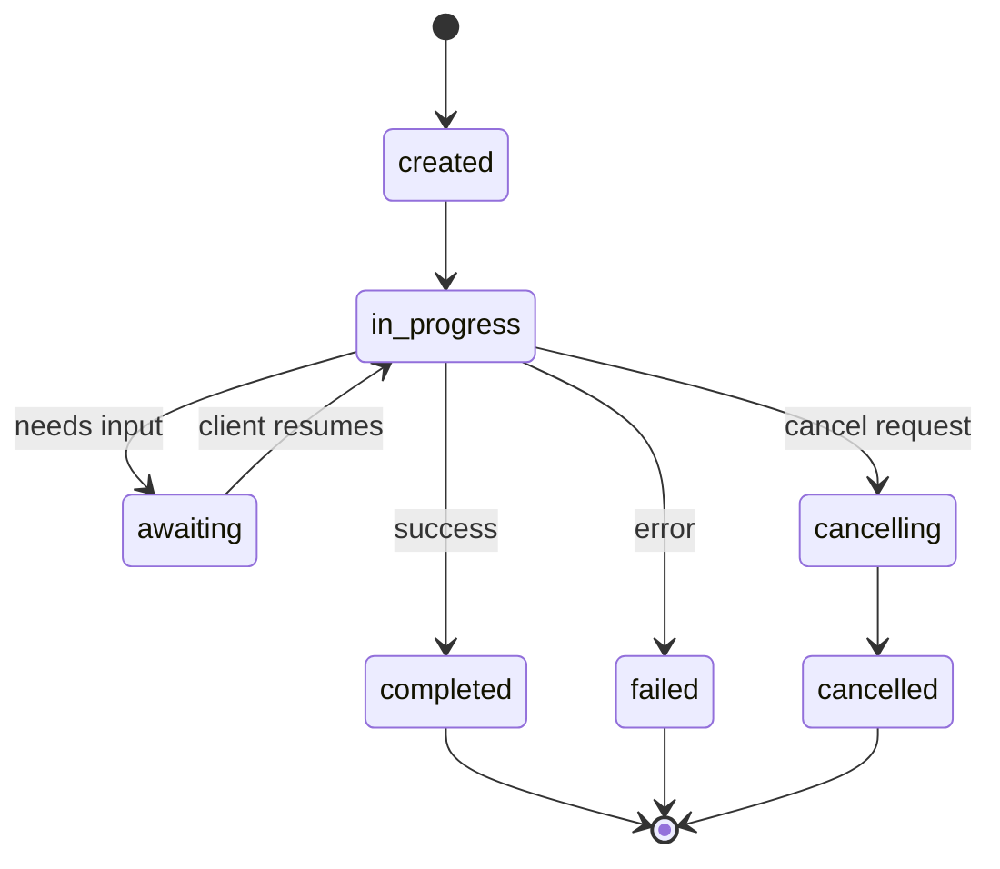
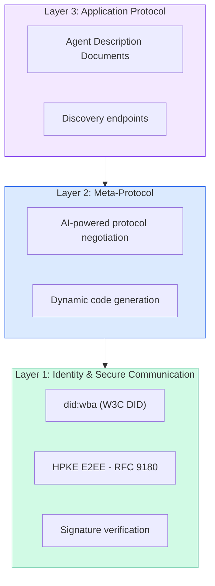
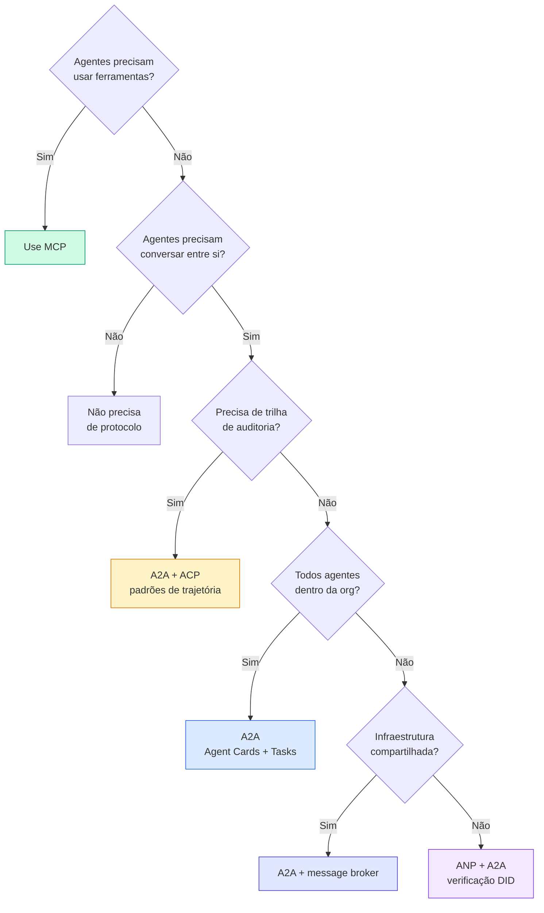

# Protocolos de Comunicação

> Agents que não falam a mesma língua não são um time. São estranhos gritando pro vazio.

**Tipo:** Construir
**Linguagens:** TypeScript
**Pré-requisitos:** Fase 14 (Agent Engineering), Lição 16.01 (Por que Multi-Agent)
**Tempo:** ~120 minutos

## Objetivos de Aprendizado

- Implementar descoberta e invocação de ferramentas via MCP pra que agentes possam usar ferramentas expostas por servidores externos
- Construir um Agent Card e endpoint de tarefa A2A que permita a um agente delegar trabalho pra outro via HTTP
- Comparar MCP (acesso a tools), A2A (agent-a-agent), ACP (auditoria corporativa) e ANP (confiança descentralizada) e explicar qual protocolo resolve qual problema
- Conectar múltiplos protocolos num sistema único onde agentes descobrem ferramentas via MCP e delegam tarefas via A2A

## O Problema

Você dividiu seu sistema em múltiplos agents. Um pesquisador, um programador, um reviewer. Cada um é ótimo no seu trabalho individual. Mas agora você precisa que eles realmente conversem.

Sua primeira tentativa é óbvia: passar strings por aí. O pesquisador retorna um blob de texto, o programador parseia como pode. Funciona até o programador interpretar mal um resumo de pesquisa, ou dois agentes entrem em deadlock esperando um pelo outro, ou você precise que agentes construídos por times diferentes colaborem. De repente "só passar strings" desmorona.

Esse é o problema de protocolo de comunicação. Sem um contrato compartilhado pra como agentes trocam informações, sistemas multi-agent são frágeis, impossíveis de auditar e impossíveis de escalar além de um punhado de agentes que você mesmo escreveu.

O ecossistema de IA respondeu com quatro protocolos, cada um resolvendo uma fatia diferente do problema:

- **MCP** pra acesso a tools
- **A2A** pra colaboração agent-a-agent
- **ACP** pra auditabilidade corporativa
- **ANP** pra identidade e confiança descentralizadas

Esta lição vai fundo. Você vai ler formatos de transmissão reais de cada especificação, construir implementações funcionais e conectar os quatro num sistema unificado.

## O Conceito

### O Panorama de Protocolos

Pense nesses quatro protocolos como camadas, cada uma abordando uma pergunta diferente:

```mermaid
block-beta
  columns 1
  block:ANP["ANP — Como agentes confiam em estranhos?\nIdentidade descentralizada (DID), E2EE, meta-protocolo"]
  end
  block:A2A["A2A — Como agentes colaboram em objetivos?\nAgent Cards, ciclo de vida de tarefas, streaming, negociação"]
  end
  block:ACP["ACP — Como agentes conversam em sistemas auditáveis?\nRuns, metadados de trajetória, continuidade de sessão"]
  end
  block:MCP["MCP — Como um agente usa uma tool?\nDescoberta de tools, execução, compartilhamento de contexto"]
  end

  style ANP fill:#f3e8ff,stroke:#7c3aed
  style A2A fill:#dbeafe,stroke:#2563eb
  style ACP fill:#fef3c7,stroke:#d97706
  style MCP fill:#d1fae5,stroke:#059669
```

Não são concorrentes. Resolvem problemas diferentes em níveis diferentes.

### MCP (Recap)

MCP foi coberto em profundidade na Fase 13. Recap rápido: MCP padroniza como um LLM se conecta a ferramentas e fontes de dados externas. É um protocolo **cliente-servidor** onde o agente (cliente) descobre e chama ferramentas expostas por um servidor.



MCP é comunicação **agent-para-tool**. Não ajuda agentes a conversarem entre si.

### A2A (Agent2Agent Protocol)

**Criado por:** Google (agora sob Linux Foundation como `lf.a2a.v1`)
**Versão da especificação:** 1.0.0
**Problema:** Como agentes autônomos colaboram, negociam e delegam tarefas entre si?

A2A é o protocolo pra **colaboração peer-to-peer entre agents**. Onde o MCP conecta um agente a tools, o A2A conecta um agente a outros agents. Cada agente publica um **Agent Card** numa URL conhecida, e outros agentes descobrem, negociam e delegam tarefas pra ele.

#### Como o A2A Funciona



#### O Agent Card Real

Isso é o que um Agent Card A2A realmente parece no mundo real. Servido em `GET /.well-known/agent-card.json`:

```json
{
  "name": "Research Agent",
  "description": "Searches documentation and summarizes findings",
  "version": "1.0.0",
  "supportedInterfaces": [
    {
      "url": "https://research-agent.example.com/a2a/v1",
      "protocolBinding": "JSONRPC",
      "protocolVersion": "1.0"
    },
    {
      "url": "https://research-agent.example.com/a2a/rest",
      "protocolBinding": "HTTP+JSON",
      "protocolVersion": "1.0"
    }
  ],
  "provider": {
    "organization": "Your Company",
    "url": "https://example.com"
  },
  "capabilities": {
    "streaming": true,
    "pushNotifications": false
  },
  "defaultInputModes": ["text/plain", "application/json"],
  "defaultOutputModes": ["text/plain", "application/json"],
  "skills": [
    {
      "id": "web-research",
      "name": "Web Research",
      "description": "Searches the web and synthesizes findings",
      "tags": ["research", "search", "summarization"],
      "examples": ["Research the latest changes in React 19"]
    },
    {
      "id": "doc-analysis",
      "name": "Documentation Analysis",
      "description": "Reads and analyzes technical documentation",
      "tags": ["docs", "analysis"],
      "inputModes": ["text/plain", "application/pdf"],
      "outputModes": ["application/json"]
    }
  ],
  "securitySchemes": {
    "bearer": {
      "httpAuthSecurityScheme": {
        "scheme": "Bearer",
        "bearerFormat": "JWT"
      }
    }
  },
  "security": [{ "bearer": [] }]
}
```

Pontos importantes pra notar:
- **Skills** são o que um agente pode fazer. Cada uma tem uma ID, tags e tipos MIME de entrada/saída suportados. É assim que um agente cliente decide se esse agente remoto consegue lidar com seu pedido.
- **supportedInterfaces** lista múltiplos bindings de protocolo. Um único agente pode falar JSON-RPC, REST e gRPC simultaneamente.
- **Security** está embutida no card. O cliente sabe que autenticação precisa antes de fazer um único pedido.

#### Ciclo de Vida de Tarefas

Tarefas são a unidade central de trabalho no A2A. Elas passam por estados definidos:



Todos os 8 estados (a especificação também define `UNSPECIFIED` como sentinela, omitido aqui):

| Estado | Terminal? | Significado |
|--------|-----------|-------------|
| `TASK_STATE_SUBMITTED` | Não | Reconhecido, ainda não processando |
| `TASK_STATE_WORKING` | Não | Ativamente sendo processado |
| `TASK_STATE_INPUT_REQUIRED` | Não | Agent precisa de mais info do cliente |
| `TASK_STATE_AUTH_REQUIRED` | Não | Autenticação necessária |
| `TASK_STATE_COMPLETED` | Sim | Finalizado com sucesso |
| `TASK_STATE_FAILED` | Sim | Finalizado com erro |
| `TASK_STATE_CANCELED` | Sim | Cancelado antes da conclusão |
| `TASK_STATE_REJECTED` | Sim | Agent recusou a tarefa |

Uma vez que uma tarefa atinge um estado terminal, ela é imutável. Sem mais mensagens. Follow-ups criam uma nova tarefa dentro do mesmo `contextId`.

#### Formato de Transmissão

A2A usa JSON-RPC 2.0. Isso é o que uma troca real de mensagens parece:

**Cliente envia uma tarefa:**
```json
{
  "jsonrpc": "2.0",
  "id": 1,
  "method": "SendMessage",
  "params": {
    "message": {
      "messageId": "msg-001",
      "role": "ROLE_USER",
      "parts": [{ "text": "Research React 19 compiler features" }]
    },
    "configuration": {
      "acceptedOutputModes": ["text/plain", "application/json"],
      "historyLength": 10
    }
  }
}
```

**Agent responde com uma tarefa:**
```json
{
  "jsonrpc": "2.0",
  "id": 1,
  "result": {
    "task": {
      "id": "task-abc-123",
      "contextId": "ctx-xyz-789",
      "status": {
        "state": "TASK_STATE_COMPLETED",
        "timestamp": "2026-03-27T10:30:00Z"
      },
      "artifacts": [
        {
          "artifactId": "art-001",
          "name": "research-results",
          "parts": [{
            "data": {
              "findings": [
                "React 19 compiler auto-memoizes components",
                "No more manual useMemo/useCallback needed",
                "Compiler runs at build time, not runtime"
              ]
            },
            "mediaType": "application/json"
          }]
        }
      ]
    }
  }
}
```

**Streaming via SSE:**
```text
POST /message:stream HTTP/1.1
Content-Type: application/json
A2A-Version: 1.0

data: {"task":{"id":"task-123","status":{"state":"TASK_STATE_WORKING"}}}

data: {"statusUpdate":{"taskId":"task-123","status":{"state":"TASK_STATE_WORKING","message":{"role":"ROLE_AGENT","parts":[{"text":"Searching documentation..."}]}}}}

data: {"artifactUpdate":{"taskId":"task-123","artifact":{"artifactId":"art-1","parts":[{"text":"partial findings..."}]},"append":true,"lastChunk":false}}

data: {"statusUpdate":{"taskId":"task-123","status":{"state":"TASK_STATE_COMPLETED"}}}
```

### ACP (Agent Communication Protocol)

**Criado por:** IBM / BeeAI
**Versão da especificação:** 0.2.0 (OpenAPI 3.1.1)
**Status:** Mergeando no A2A sob a Linux Foundation
**Problema:** Como agentes comunicam com total auditabilidade, continuidade de sessão e rastreamento de trajetória?

ACP é o **protocolo corporativo**. Ao contrário do que muitos resumos dizem, o ACP **não** usa JSON-LD. É uma API REST/JSON simples definida via OpenAPI. O que o torna especial é o **TrajectoryMetadata**: cada resposta de agente pode carregar um log detalhado dos passos de raciocínio e chamadas de ferramentas que a produziram.



#### Descoberta de Agents no ACP

ACP define quatro métodos de descoberta:



O **AgentManifest** é mais simples que o Agent Card do A2A:

```json
{
  "name": "summarizer",
  "description": "Summarizes documents with source citations",
  "input_content_types": ["text/plain", "application/pdf"],
  "output_content_types": ["text/plain", "application/json"],
  "metadata": {
    "tags": ["summarization", "RAG"],
    "framework": "BeeAI",
    "capabilities": [
      {
        "name": "Document Summarization",
        "description": "Condenses long documents into key points"
      }
    ],
    "recommended_models": ["llama3.3:70b-instruct-fp16"],
    "license": "Apache-2.0",
    "programming_language": "Python"
  }
}
```

#### Ciclo de Vida de Runs

ACP usa "Runs" em vez de "Tasks." Um Run é uma execução de agente com três modos:

| Modo | Comportamento |
|------|---------------|
| `sync` | Bloqueante. Resposta contém o resultado completo. |
| `async` | Retorna 202 imediatamente. Faz polling em `GET /runs/{id}` pra status. |
| `stream` | Stream SSE. Eventos disparam enquanto o agente trabalha. |



#### TrajectoryMetadata (A Trilha de Auditoria)

Esse é o diferencial do ACP. Cada parte da mensagem pode incluir metadados mostrando exatamente o que o agente fez:

```json
{
  "role": "agent/researcher",
  "parts": [
    {
      "content_type": "text/plain",
      "content": "The weather in San Francisco is 72F and sunny.",
      "metadata": {
        "kind": "trajectory",
        "message": "I need to check the weather for this location",
        "tool_name": "weather_api",
        "tool_input": { "location": "San Francisco, CA" },
        "tool_output": { "temperature": 72, "condition": "sunny" }
      }
    }
  ]
}
```

Pra indústrias reguladas isso é ouro. Cada resposta vem com uma cadeia comprovável de raciocínio: quais ferramentas foram chamadas, quais entradas foram usadas, quais saídas foram recebidas. Sem caixa-preta.

ACP também suporta **CitationMetadata** pra atribuição de fonte:

```json
{
  "kind": "citation",
  "start_index": 0,
  "end_index": 47,
  "url": "https://weather.gov/sf",
  "title": "NWS San Francisco Forecast"
}
```

### ANP (Agent Network Protocol)

**Criado por:** Comunidade open-source (fundado por GaoWei Chang)
**Repo:** [github.com/agent-network-protocol/AgentNetworkProtocol](https://github.com/agent-network-protocol/AgentNetworkProtocol)
**Problema:** Como agentes de diferentes organizações confiam uns nos outros sem uma autoridade central?

ANP é o **protocolo de identidade descentralizada**. Constrói confiança usando W3C Decentralized Identifiers (DIDs) e criptografia de ponta a ponta. Ao contrário do A2A onde você descobre agentes por endpoints conhecidos, o ANP permite que agentes provem sua identidade criptograficamente.

ANP tem três camadas:



#### DID Documents (Estrutura Real)

ANP usa um método DID customizado chamado `did:wba` (Web-Based Agent). O DID `did:wba:example.com:user:alice` resolve pra `https://example.com/user/alice/did.json`:

```json
{
  "@context": [
    "https://www.w3.org/ns/did/v1",
    "https://w3id.org/security/suites/jws-2020/v1",
    "https://w3id.org/security/suites/secp256k1-2019/v1"
  ],
  "id": "did:wba:example.com:user:alice",
  "verificationMethod": [
    {
      "id": "did:wba:example.com:user:alice#key-1",
      "type": "EcdsaSecp256k1VerificationKey2019",
      "controller": "did:wba:example.com:user:alice",
      "publicKeyJwk": {
        "crv": "secp256k1",
        "x": "NtngWpJUr-rlNNbs0u-Aa8e16OwSJu6UiFf0Rdo1oJ4",
        "y": "qN1jKupJlFsPFc1UkWinqljv4YE0mq_Ickwnjgasvmo",
        "kty": "EC"
      }
    },
    {
      "id": "did:wba:example.com:user:alice#key-x25519-1",
      "type": "X25519KeyAgreementKey2019",
      "controller": "did:wba:example.com:user:alice",
      "publicKeyMultibase": "z9hFgmPVfmBZwRvFEyniQDBkz9LmV7gDEqytWyGZLmDXE"
    }
  ],
  "authentication": [
    "did:wba:example.com:user:alice#key-1"
  ],
  "keyAgreement": [
    "did:wba:example.com:user:alice#key-x25519-1"
  ],
  "humanAuthorization": [
    "did:wba:example.com:user:alice#key-1"
  ],
  "service": [
    {
      "id": "did:wba:example.com:user:alice#agent-description",
      "type": "AgentDescription",
      "serviceEndpoint": "https://example.com/agents/alice/ad.json"
    }
  ]
}
```

Pontos importantes pra notar:
- **Separação de chaves** é forçada. Chaves de assinatura (secp256k1) são separadas de chaves de criptografia (X25519).
- **`humanAuthorization`** é único do ANP. Essas chaves exigem aprovação humana explícita (biometria, senha, HSM) antes de uso. Operações de alto risco como transferências de fundos passam por esse caminho.
- As chaves **`keyAgreement`** são usadas pra criptografia de ponta a ponta HPKE (RFC 9180).
- A seção **service** vincula ao documento de Descrição do Agent.

#### Meta-Protocol e Agent Description

A inovação mais ousada do ANP é o **meta-protocolo**: dois agentes que nunca se viram antes podem negociar como vão se comunicar usando linguagem natural alimentada por IA.

```
Agent A: "I can speak JSON-RPC or REST. I prefer JSON-RPC."
Agent B: "I can speak JSON-RPC and gRPC. JSON-RPC works for me."
Agreed: JSON-RPC.

Agent A: "I send data as JSON with fields: type, payload, timestamp."
Agent B: "Acknowledged. I return JSON with: status, data, error."
Protocol confirmed.
```

Isso não é um fluxo predeterminado. É uma conversa onde agentes usam modelos de linguagem pra chegar a um acordo. O ANP fornece um mecanismo de fallback: se a negociação de IA falhar, os agentes recorrem a um formato estruturado mínimo.

A especificação também inclui **Agent Description Documents** que estendem o DID:

```json
{
  "description": "I am a research agent that searches documentation.",
  "capabilities": ["web_search", "doc_analysis"],
  "input_formats": ["text/plain"],
  "output_formats": ["text/plain", "application/json"],
  "protocols": ["json-rpc", "rest", "grpc"],
  "payment_required": false,
  "rate_limit": 10,
  "endpoint": "https://research-agent.example.com"
}
```

## Construa

Vamos construir implementações de cada protocolo e conectá-los. Código em TypeScript.

### Passo 1: Tipos Compartilhados

```typescript
// Tipos compartilhados entre protocolos
type AgentMessage = {
  id: string;
  role: "user" | "agent";
  content: string;
  metadata?: Record<string, unknown>;
};

type TaskStatus =
  | "submitted"
  | "working"
  | "input_required"
  | "completed"
  | "failed"
  | "canceled"
  | "rejected";

type Task = {
  id: string;
  contextId: string;
  status: { state: TaskStatus; timestamp: number };
  artifacts: Artifact[];
};

type Artifact = {
  id: string;
  name: string;
  parts: ArtifactPart[];
  append?: boolean;
  lastChunk?: boolean;
};

type ArtifactPart =
  | { kind: "text"; text: string; mediaType?: string }
  | { kind: "data"; data: unknown; mediaType: string };

type TrajectoryEntry = {
  reasoning: string;
  toolName?: string;
  toolInput?: unknown;
  toolOutput?: unknown;
  timestamp: number;
};
```

### Passo 2: Registro de Agentes

```typescript
type AgentInfo = {
  name: string;
  description: string;
  version: string;
  url: string;
  capabilities: { streaming: boolean; pushNotifications: boolean };
  defaultInputModes: string[];
  defaultOutputModes: string[];
  skills: Skill[];
};

type Skill = {
  id: string;
  name: string;
  description: string;
  tags: string[];
  inputModes?: string[];
  outputModes?: string[];
};

class AgentRegistry {
  private agents: Map<string, AgentInfo> = new Map();

  register(info: AgentInfo): void {
    this.agents.set(info.name, info);
  }

  discoverByName(name: string): AgentInfo | undefined {
    return this.agents.get(name);
  }

  discoverBySkillTag(tag: string): AgentInfo[] {
    return Array.from(this.agents.values()).filter((a) =>
      a.skills.some((s) => s.tags.includes(tag))
    );
  }

  getAll(): AgentInfo[] {
    return Array.from(this.agents.values());
  }

  generateAgentCard(name: string): object | null {
    const agent = this.agents.get(name);
    if (!agent) return null;
    return {
      name: agent.name,
      description: agent.description,
      version: agent.version,
      supportedInterfaces: [
        {
          url: agent.url,
          protocolBinding: "JSONRPC",
          protocolVersion: "1.0",
        },
        {
          url: agent.url.replace("/a2a/v1", "/a2a/rest"),
          protocolBinding: "HTTP+JSON",
          protocolVersion: "1.0",
        },
      ],
      capabilities: agent.capabilities,
      defaultInputModes: agent.defaultInputModes,
      defaultOutputModes: agent.defaultOutputModes,
      skills: agent.skills,
      securitySchemes: {
        bearer: {
          httpAuthSecurityScheme: { scheme: "Bearer", bearerFormat: "JWT" },
        },
      },
      security: [{ bearer: [] }],
    };
  }
}
```

### Passo 3: Gerenciador de Tarefas (A2A)

```typescript
type TaskHandler = (
  task: Task,
  message: AgentMessage
) => AsyncGenerator<TaskUpdate, void, unknown>;

type TaskUpdate =
  | { kind: "statusUpdate"; taskId: string; status: Task["status"] }
  | {
      kind: "artifactUpdate";
      taskId: string;
      artifact: Artifact;
      append: boolean;
      lastChunk: boolean;
    };

class TaskManager {
  private tasks: Map<string, Task> = new Map();
  private handlers: Map<string, TaskHandler> = new Map();
  private contextCounter = 0;

  registerHandler(agentName: string, handler: TaskHandler): void {
    this.handlers.set(agentName, handler);
  }

  async createTask(
    agentName: string,
    message: AgentMessage
  ): Promise<Task> {
    const handler = this.handlers.get(agentName);
    if (!handler) {
      throw new Error(`No handler registered for agent: ${agentName}`);
    }

    const taskId = crypto.randomUUID();
    this.contextCounter++;
    const contextId = `ctx-${this.contextCounter}`;

    const task: Task = {
      id: taskId,
      contextId,
      status: { state: "submitted", timestamp: Date.now() },
      artifacts: [],
    };

    this.tasks.set(taskId, task);

    const generator = handler(task, message);
    const updates: TaskUpdate[] = [];

    for await (const update of generator) {
      updates.push(update);
      if (update.kind === "statusUpdate") {
        task.status = update.status;
      } else if (update.kind === "artifactUpdate") {
        if (update.append) {
          const existing = task.artifacts.find(
            (a) => a.id === update.artifact.id
          );
          if (existing) {
            existing.parts.push(...update.artifact.parts);
            existing.lastChunk = update.lastChunk;
          } else {
            task.artifacts.push(update.artifact);
          }
        } else {
          task.artifacts.push(update.artifact);
        }
      }

      if (
        update.kind === "statusUpdate" &&
        ["completed", "failed", "canceled", "rejected"].includes(
          update.status.state
        )
      ) {
        break;
      }
    }

    return task;
  }

  getTask(taskId: string): Task | undefined {
    return this.tasks.get(taskId);
  }
}
```

### Passo 4: Runner Auditável (ACP)

```typescript
type AuditEntry = {
  runId: string;
  agentName: string;
  status: string;
  output: ArtifactPart[];
  trajectory: TrajectoryEntry[];
  startedAt: number;
  completedAt?: number;
};

class AuditableRunner {
  private auditLog: AuditEntry[] = [];
  private agents: Map<string, () => Promise<AuditEntry>> = new Map();

  registerAgent(
    name: string,
    runner: () => Promise<AuditEntry>
  ): void {
    this.agents.set(name, runner);
  }

  async run(agentName: string): Promise<AuditEntry> {
    const runner = this.agents.get(agentName);
    if (!runner) throw new Error(`No runner for: ${agentName}`);

    const entry = await runner();
    entry.runId = crypto.randomUUID();
    this.auditLog.push(entry);
    return entry;
  }

  getFullAuditLog(): AuditEntry[] {
    return [...this.auditLog];
  }
}
```

### Passo 5: Registro de Identidade (ANP)

```typescript
type DIDDocument = {
  "@context": string[];
  id: string;
  verificationMethod: Array<{
    id: string;
    type: string;
    controller: string;
    publicKeyJwk?: Record<string, string>;
    publicKeyMultibase?: string;
  }>;
  authentication: string[];
  keyAgreement: string[];
  service: Array<{
    id: string;
    type: string;
    serviceEndpoint: string;
  }>;
};

type Identity = {
  did: string;
  document: DIDDocument;
  privateKey: string;
};

function createIdentity(domain: string, name: string): Identity {
  const did = `did:wba:${domain}:user:${name}`;
  return {
    did,
    document: {
      "@context": [
        "https://www.w3.org/ns/did/v1",
        "https://w3id.org/security/suites/jws-2020/v1",
      ],
      id: did,
      verificationMethod: [
        {
          id: `${did}#key-1`,
          type: "EcdsaSecp256k1VerificationKey2019",
          controller: did,
          publicKeyJwk: {
            crv: "secp256k1",
            x: "NtngWpJUr-rlNNbs0u-Aa8e16OwSJu6UiFf0Rdo1oJ4",
            y: "qN1jKupJlFsPFc1UkWinqljv4YE0mq_Ickwnjgasvmo",
            kty: "EC",
          },
        },
      ],
      authentication: [`${did}#key-1`],
      keyAgreement: [],
      service: [
        {
          id: `${did}#agent-description`,
          type: "AgentDescription",
          serviceEndpoint: `https://${domain}/agents/${name}/ad.json`,
        },
      ],
    },
    privateKey: "simulated-private-key",
  };
}

function signPayload(identity: Identity, payload: string): string {
  return `sig:${identity.did}:${Buffer.from(payload).toString("base64")}`;
}

class IdentityRegistry {
  private documents: Map<string, DIDDocument> = new Map();

  publish(doc: DIDDocument): void {
    this.documents.set(doc.id, doc);
  }

  resolve(did: string): DIDDocument | undefined {
    return this.documents.get(did);
  }

  verify(did: string, signature: string, payload: string): boolean {
    const doc = this.documents.get(did);
    if (!doc) return false;
    const expectedSig = `sig:${did}:${Buffer.from(payload).toString("base64")}`;
    return signature === expectedSig;
  }
}

function textMessage(
  role: "user" | "agent",
  text: string,
  metadata?: Record<string, unknown>
): AgentMessage {
  return { id: crypto.randomUUID(), role, content: text, metadata };
}
```

### Passo 6: Gateway Unificado

```typescript
class ProtocolGateway {
  constructor(
    private registry: AgentRegistry,
    private taskManager: TaskManager,
    private auditRunner: AuditableRunner,
    private identityRegistry: IdentityRegistry
  ) {}

  async delegateTask(
    fromDid: string,
    signature: string,
    toAgent: string,
    message: AgentMessage,
    contextId?: string
  ): Promise<
    { task: Task; audit: AuditEntry } | { error: string }
  > {
    if (!this.identityRegistry.verify(fromDid, signature, message.id)) {
      return { error: "Signature verification failed" };
    }

    const agent = this.registry.discoverByName(toAgent);
    if (!agent) {
      return { error: `Agent not found: ${toAgent}` };
    }

    const matchingSkill = agent.skills[0];
    if (matchingSkill) {
      const messageMode = "text/plain";
      if (
        matchingSkill.inputModes &&
        !matchingSkill.inputModes.includes(messageMode)
      ) {
        return {
          error: `Agent cannot handle input mode: ${messageMode}`,
        };
      }
    }

    let task: Task;
    try {
      task = await this.taskManager.createTask(toAgent, message);
    } catch (e: unknown) {
      const err = e instanceof Error ? e.message : String(e);
      return { error: `Task creation failed: ${err}` };
    }

    const audit = await this.auditRunner.run(toAgent);

    return { task, audit };
  }

  discoverAndDelegate(
    fromDid: string,
    signature: string,
    skillTag: string,
    message: AgentMessage
  ): Promise<
    { task: Task; audit: AuditEntry } | { error: string }
  > {
    const candidates = this.registry.discoverBySkillTag(skillTag);
    if (candidates.length === 0) {
      return Promise.resolve({
        error: `No agents found with skill tag: ${skillTag}`,
      });
    }
    return this.delegateTask(
      fromDid,
      signature,
      candidates[0].name,
      message
    );
  }
}
```

### Passo 7: Conecte Tudo

```typescript
async function protocolDemo() {
  const registry = new AgentRegistry();
  registry.register({
    name: "researcher",
    description: "Searches and summarizes findings",
    version: "1.0.0",
    url: "https://researcher.local/a2a/v1",
    capabilities: { streaming: true, pushNotifications: false },
    defaultInputModes: ["text/plain"],
    defaultOutputModes: ["text/plain", "application/json"],
    skills: [
      {
        id: "web-research",
        name: "Web Research",
        description: "Searches the web",
        tags: ["research", "search", "summarization"],
        inputModes: ["text/plain"],
        outputModes: ["application/json"],
      },
    ],
  });
  registry.register({
    name: "coder",
    description: "Writes code from specs",
    version: "1.0.0",
    url: "https://coder.local/a2a/v1",
    capabilities: { streaming: false, pushNotifications: false },
    defaultInputModes: ["text/plain", "application/json"],
    defaultOutputModes: ["text/plain"],
    skills: [
      {
        id: "code-gen",
        name: "Code Generation",
        description: "Generates code",
        tags: ["coding", "generation"],
        inputModes: ["text/plain", "application/json"],
        outputModes: ["text/plain"],
      },
    ],
  });

  const taskManager = new TaskManager();
  const auditRunner = new AuditableRunner();

  const researchTrajectory: TrajectoryEntry[] = [];

  taskManager.registerHandler(
    "researcher",
    async function* (task, message) {
      yield {
        kind: "statusUpdate",
        taskId: task.id,
        status: { state: "working", timestamp: Date.now() },
      };

      researchTrajectory.push({
        reasoning: "Searching for React 19 documentation",
        toolName: "web_search",
        toolInput: { query: "React 19 compiler features" },
        toolOutput: {
          results: ["react.dev/blog/react-19", "github.com/react/react"],
        },
        timestamp: Date.now(),
      });

      researchTrajectory.push({
        reasoning: "Extracting key findings from search results",
        toolName: "doc_analysis",
        toolInput: { url: "react.dev/blog/react-19" },
        toolOutput: {
          summary:
            "React 19 compiler auto-memoizes, no manual useMemo needed",
        },
        timestamp: Date.now(),
      });

      yield {
        kind: "artifactUpdate",
        taskId: task.id,
        artifact: {
          id: crypto.randomUUID(),
          name: "research-results",
          parts: [
            {
              kind: "data",
              data: {
                findings: [
                  "React 19 compiler auto-memoizes components",
                  "No more manual useMemo/useCallback needed",
                  "Compiler runs at build time, not runtime",
                ],
                sources: ["react.dev/blog/react-19"],
              },
              mediaType: "application/json",
            },
          ],
        },
        append: false,
        lastChunk: true,
      };

      yield {
        kind: "statusUpdate",
        taskId: task.id,
        status: { state: "completed", timestamp: Date.now() },
      };
    }
  );

  auditRunner.registerAgent("researcher", async () => ({
    output: [
      textMessage("agent", "React 19 compiler auto-memoizes components"),
    ],
    trajectory: researchTrajectory,
  }));

  const identityRegistry = new IdentityRegistry();

  const coderIdentity = createIdentity("coder.local", "coder");
  const researcherIdentity = createIdentity("researcher.local", "researcher");

  identityRegistry.publish(coderIdentity.document);
  identityRegistry.publish(researcherIdentity.document);

  const gateway = new ProtocolGateway(
    registry,
    taskManager,
    auditRunner,
    identityRegistry
  );

  console.log("=== Protocol Demo ===\n");

  console.log("1. Agent Discovery (A2A)");
  const researchAgents = registry.discoverBySkillTag("research");
  console.log(
    `   Found ${researchAgents.length} agent(s):`,
    researchAgents.map((a) => a.name)
  );

  console.log("\n2. Identity Verification (ANP)");
  const message = textMessage("user", "Research React 19 compiler features");
  const signature = signPayload(coderIdentity, message.id);
  const verified = identityRegistry.verify(
    coderIdentity.did,
    signature,
    message.id
  );
  console.log(`   Coder DID: ${coderIdentity.did}`);
  console.log(`   Signature verified: ${verified}`);

  console.log("\n3. Task Delegation (A2A + ACP + ANP)");
  const result = await gateway.delegateTask(
    coderIdentity.did,
    signature,
    "researcher",
    message,
    "session-001"
  );

  if ("error" in result) {
    console.log(`   Error: ${result.error}`);
    return;
  }

  console.log(`   Task ID: ${result.task.id}`);
  console.log(`   Task state: ${result.task.status.state}`);
  console.log(`   Artifacts: ${result.task.artifacts.length}`);

  console.log("\n4. Audit Trail (ACP)");
  console.log(`   Run ID: ${result.audit.runId}`);
  console.log(`   Status: ${result.audit.status}`);
  console.log(`   Trajectory steps: ${result.audit.trajectory.length}`);
  for (const step of result.audit.trajectory) {
    console.log(`     - ${step.reasoning}`);
    if (step.toolName) {
      console.log(`       Tool: ${step.toolName}`);
    }
  }

  console.log("\n5. Full Audit Log");
  const fullLog = auditRunner.getFullAuditLog();
  console.log(`   Total runs: ${fullLog.length}`);
  for (const entry of fullLog) {
    const duration = entry.completedAt
      ? `${entry.completedAt - entry.startedAt}ms`
      : "in-progress";
    console.log(`   ${entry.agentName}: ${entry.status} (${duration})`);
  }
}

protocolDemo().catch((err) => {
  console.error("Protocol demo failed:", err);
  process.exitCode = 1;
});
```

## O Que Dá Errado

Protocolos resolvem o caminho feliz. Aqui está o que quebra em produção:

**Desvio de schema.** Agente A publica um Agent Card anunciando saída `application/json`. Mas o schema JSON muda entre versões. Agente B parseia o formato antigo e recebe lixo. Correção: versione seus skills e schemas de saída. A especificação A2A suporta `version` em Agent Cards por essa razão.

**Violações de máquina de estados.** Um handler de agente gera um evento `completed`, depois tenta gerar mais artefatos. A tarefa é imutável. Seu código silenciosamente descarta as atualizações ou lança um erro. Correção: verifique estado terminal antes de gerar. O `TaskManager` acima impõe isso com o `break` após estados terminais.

**Falhas de resolução de confiança.** Agente A tenta verificar o DID do Agente B, mas o domínio do Agente B está fora. O documento DID não pode ser buscado. Você falha aberto (aceita agentes não verificados) ou falha fechado (rejeita tudo)? ANP recomenda falha fechada com o princípio do menor privilégio.

**Inchaço de trajetória.** O log de trajetória ACP é poderoso mas caro. Um agente complexo que faz 200 chamadas de ferramenta por execução produz entradas de auditoria massivas. Correção: registre trajetória em níveis de verbosidade configuráveis. Registre nomes de ferramentas e IO para conformidade, pule passos de raciocínio para cargas de trabalho não reguladas.

**Thundering herd de descoberta.** 50 agentes todos consultam `GET /agents` simultaneamente na inicialização. Correção: armazene Agent Cards em cache com TTL, distribua intervalos de descoberta ou use registro baseado em push em vez de polling.

## Use

### Implementações Reais

**A2A** é o mais maduro. A [especificação oficial do Google](https://github.com/google/A2A) é open-source sob a Linux Foundation. SDKs para Python e TypeScript. Se seus agentes precisam de descoberta dinâmica e colaboração, comece aqui.

**ACP** está mergeando no A2A. O projeto [BeeAI da IBM](https://github.com/i-am-bee/acp) criou ACP como uma alternativa REST-first, mas o conceito de metadados de trajetória está sendo absorvido pelo ecossistema A2A. Use padrões ACP (log de trajetória, ciclo de vida de runs) mesmo se usar A2A como transporte.

**ANP** é o mais experimental. O [repo da comunidade](https://github.com/agent-network-protocol/AgentNetworkProtocol) tem um SDK Python (AgentConnect). O conceito de negociação de meta-protocolo é genuinamente novo. Vale a pena acompanhar para implantações de agentes cross-organizacionais.

**MCP** já foi coberto na Fase 13. Se você quer que agentes usem ferramentas, MCP é o padrão.

### Escolhendo o Protocolo Certo



## Entregue

Esta lição produz:
- `code/main.ts` -- implementação completa de todos os quatro padrões de protocolo
- `outputs/prompt-protocol-selector.md` -- um prompt que ajuda você a escolher protocolos para seu sistema

## Exercícios

1. **Delegação de tarefas multi-hop.** Estenda o `TaskManager` para que um handler de agente possa delegar subtarefas a outros agentes. O pesquisador recebe uma tarefa, delega subtarefas "search" e "summarize" a dois agentes especialistas, espera ambos completarem, depois mescla os resultados em seus próprios artefatos.

2. **Trilha de auditoria em streaming.** Modifique o `AuditableRunner` para suportar modo streaming. Em vez de esperar o resultado completo, gere atualizações `AuditEntry` em tempo real conforme entradas de trajetória são adicionadas. Use um gerador assíncrono que produz snapshots de auditoria.

3. **Rotação de DID.** Adicione rotação de chaves ao `IdentityRegistry`. Um agente deve poder publicar um novo documento DID com chaves atualizadas enquanto mantém uma referência `previousDid`. Verificadores devem aceitar assinaturas tanto da chave atual quanto da anterior durante um período de carência.

4. **Negociação de protocolo.** Implemente o conceito de meta-protocolo do ANP. Dois agentes trocam mensagens `protocolNegotiation` com formatos candidatos (ex.: "Eu falo JSON-RPC" vs "Eu prefiro REST"). Após no máximo 3 rodadas, eles concordam com um formato ou dão timeout. O formato acordado determina qual `TaskManager` ou `AuditableRunner` eles usam.

5. **Descoberta com rate limit.** Adicione um wrapper `RateLimitedRegistry` que armazena em cache consultas de Agent Card com TTL configurável e limita consultas de descoberta por agente por segundo. Simule um thundering herd de 100 agentes descobrindo uns aos outros na inicialização e meça a diferença.

## Termos-Chave

| Termo | O que o pessoal diz | O que realmente significa |
|-------|--------------------|---------------------------|
| MCP | "O protocolo para ferramentas de IA" | Protocolo cliente-servidor para agentes descobrirem e usarem ferramentas. Agente-para-ferramenta, não agente-para-agente. |
| A2A | "Protocolo de agente do Google" | Protocolo peer-to-peer para colaboração de agentes sob a Linux Foundation. Descoberta via Agent Cards, ciclo de vida de tarefas de 9 estados, streaming via SSE. Suporta JSON-RPC, REST e gRPC. |
| ACP | "Mensageria corporativa de agentes" | API REST da IBM/BeeAI para execuções de agente com TrajectoryMetadata: cada resposta carrega a cadeia completa de raciocínio e chamadas de ferramenta. Mergeando no A2A. |
| ANP | "Identidade descentralizada de agente" | Protocolo comunitário usando `did:wba` (DID) para identidade criptográfica, HPKE para E2EE e negociação de meta-protocolo alimentada por IA para agentes que nunca se viram. |
| Agent Card | "Cartão de visita do agente" | Documento JSON em `/.well-known/agent-card.json` descrevendo skills, tipos MIME suportados, esquemas de segurança e bindings de protocolo. |
| DID | "ID descentralizado" | Padrão W3C para identidades criptograficamente verificáveis hospedadas no próprio domínio do agente. ANP usa método `did:wba`. |
| TrajectoryMetadata | "Recibo de auditoria" | Mecanismo do ACP para anexar passos de raciocínio, chamadas de ferramenta e suas entradas/saídas a cada resposta de agente. |
| Meta-protocolo | "Agentes negociando como falar" | Abordagem do ANP onde agentes usam linguagem natural para concordar dinamicamente sobre formatos de dados, depois geram código para lidar com eles. |
| Task | "Unidade de trabalho" | Objeto com estado do A2A que rastreia trabalho da submissão à conclusão. Imutável uma vez terminal. |

## Leitura Adicional

- [Google A2A specification](https://github.com/google/A2A) — especificação oficial e SDKs (v1.0.0, Linux Foundation)
- [IBM/BeeAI ACP specification](https://github.com/i-am-bee/acp) — especificação OpenAPI 3.1 para execuções de agente e metadados de trajetória
- [Agent Network Protocol](https://github.com/agent-network-protocol/AgentNetworkProtocol) — identidade baseada em DID, E2EE, negociação de meta-protocolo
- [Model Context Protocol docs](https://modelcontextprotocol.io/) — especificação MCP da Anthropic (coberta na Fase 13)
- [W3C Decentralized Identifiers](https://www.w3.org/TR/did-core/) — padrão de identidade que fundamenta o ANP
- [RFC 9180 (HPKE)](https://www.rfc-editor.org/rfc/rfc9180) — esquema de criptografia que o ANP usa para E2EE
- [FIPA Agent Communication Language](http://www.fipa.org/specs/fipa00061/SC00061G.html) — precursor acadêmico dos protocolos modernos de agentes
