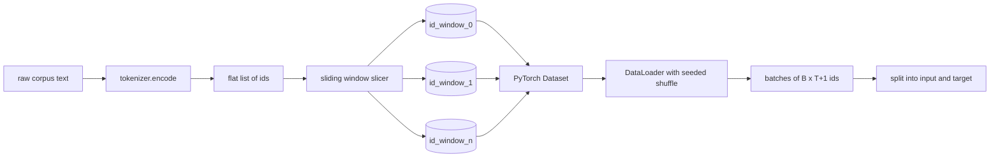
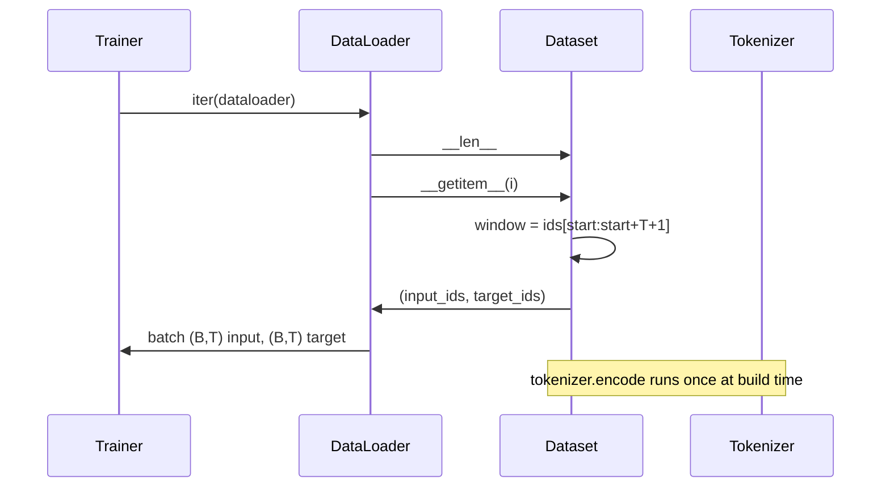

# Dataset Tokenizado com Janela Deslizante

> Uma execução de pré-treinamento é uma função de ids de token para gradientes. Esta lição constrói a esteira que alimenta os ids.

**Tipo:** Construção
**Linguagens:** Python
**Pré-requisitos:** Lições da Fase 04, lições de transformer da Fase 07, Lição 30 desta fase
**Tempo:** ~90 minutos

## Objetivos de Aprendizado
- Converter um corpus bruto em um stream de ids de token chamando o tokenizador uma vez.
- Fatiar o stream de ids em janelas de comprimento fixo com um stride de sobreposição configurável.
- Construir um Dataset do PyTorch que retorne tensores de entrada e target para previsão de próximo token.
- Envolver o dataset em um DataLoader com shuffle determinístico com semente por época.
- Racionar sobre o trade-off entre stride, redundância e tamanho efetivo do dataset.

## O enquadramento

Uma execução de pré-treinamento lê um batch de ids de token por vez e atualiza o modelo. O formato de cada batch é fixado pelo contrato de treinamento. Para um modelo de linguagem causal, o batch contém ids de entrada `(B, T)` e ids de target `(B, T)` onde o target é a entrada deslocada uma posição à esquerda. O trabalho do pipeline de dados é produzir esse contrato sob demanda, de forma determinística e reproduzível, a partir de um corpus que pode ser vários gigabytes de texto bruto.

Esta lição constrói o pipeline. O tokenizador da lição anterior transforma texto em uma lista longa e plana de ids. Uma janela deslizante fatia essa lista em exemplos de treinamento. Um Dataset customizado expõe os exemplos como tensores. Um DataLoader faz batches e embaralha com semente conhecida.

## O contrato de formato

Um LM consome ids com formato `(B, T)` onde `B` é o tamanho do batch e `T` é o comprimento de contexto. O target na posição `t` é a entrada na posição `t+1`. Isso significa que cada exemplo de treinamento cobre `T+1` ids brutos. O stride da janela controla quanta sobreposição existe entre exemplos consecutivos.

O fatiador nunca sobrepõe com o limite do corpus. Se a última janela não tiver ids suficientes para preencher `T+1` posições, o fatiador descarta ela. Preencher o final com `<|pad|>` também é uma escolha válida, mas complica a máscara de loss. Nesta lição, descartamos.

## Por que uma janela deslizante

Um corpus de pré-treinamento é um stream longo de ids. Se o modelo só visse janelas não sobrepostas, cada exemplo de treinamento o ensinaria os mesmos limites de `T`. Ajustar o stride move esses limites para que o modelo veja tarefas de prever-próximo-token mais diversas.

Um stride de `T` produz janelas não sobrepostas. Um stride de `T // 2` produz cinquenta por cento de sobreposição e dobra o dataset efetivo. Um stride de `1` produz sobreposição máxima e aumenta o dataset em um fator de `T`. O custo é mais computação por época. O benefício é mais diversidade de limites. A maioria das execuções de pré-treinamento usa um stride igual ao comprimento de contexto porque o corpus já é muito maior do que o modelo consegue terminar em uma época, então o argumento de diversidade de limites é mais fraco.

## A classe Dataset

Um Dataset do PyTorch tem dois métodos obrigatórios. `__len__` retorna o número de exemplos. `__getitem__` retorna um exemplo como um par de tensores. Nosso Dataset armazena o stream de ids codificados e o stride. Indexar nele calcula o início da janela on-the-fly, então o custo de memória é uma cópia do stream de ids, independentemente de quantos exemplos o stride produz.

O deslocamento por um acontece dentro de `__getitem__`. O Dataset retorna `(input, target)` onde `input = window[:-1]` e `target = window[1:]`. Ambos são long tensors do PyTorch. O loop de treinamento os trata como ground truth.

## Shuffle determinístico

Um DataLoader com `shuffle=True` lê de um gerador aleatório do PyTorch. Ao passar um `torch.Generator` explícito com semente por época, obtemos o mesmo shuffle toda vez que a execução é reiniciada. Essa propriedade importa quando você quer comparar duas execuções que diferem em um único hiperparâmetro. Sem semente, duas execuções veem os dados em ordens diferentes e as curvas de loss divergem por razões não relacionadas à mudança.

O contrato de semente nesta lição é simples. `epoch_seed = base_seed + epoch_index`. A semente base é passada na construção. O índice de época é incrementado pelo treinador no topo de cada época. Uma re-execução com a mesma semente base sempre vê a mesma ordem em cada época.

## Batch sampler

O sampler padrão no PyTorch escolhe índices uniformemente ao random com substituição desabilitada. É isso que queremos para pré-treinamento. Para fine-tuning em um pequeno dataset, o contrato é o mesmo. O DataLoader monta um batch chamando `__getitem__` `B` vezes e empilhando os resultados. Como todo exemplo tem o mesmo comprimento por construção, nenhuma lógica de padding é necessária.

A lição mantém `num_workers=0` por simplicidade. Em uma execução de produção, os workers paralelizam as chamadas de `__getitem__`. Com nosso pipeline isso é basicamente um no-op porque o trabalho é apenas um fatiamento de um tensor em memória, mas a mesma API de Dataset suporta workers de forma limpa.

## Contando exemplos

Para um stream de ids de comprimento `N`, um comprimento de contexto `T` e um stride `S`, o número de exemplos é `max(0, 1 + (N - (T + 1)) // S)`. A lição expõe esse cálculo como um método estático no Dataset para que o treinador possa computar o total de passos por época sem iterar.

## O que esta lição não faz

Ela não faz streaming do disco. O corpus é codificado inteiramente na memória e mantido como um único tensor. Para um corpus de alguns milhões de ids, isso fica bem abaixo de cem megabytes e é o formato certo para a lição. Streaming de disco é uma preocupação separada que se conecta substituindo o armazenamento, mas mantendo o contrato do Dataset.

Ela não lida com múltiplos documentos. O corpus é tratado como um stream contínuo de ids. O limite do próximo documento é codificado inserindo ids `` quando o corpus é construído a partir de múltiplos documentos. O modelo aprende a prever ao redor do limite.

## Como ler o código

`main.py` define duas classes e um helper. `SlidingWindowDataset` é o Dataset do PyTorch. `make_dataloader` retorna um DataLoader configurado com um gerador com semente. `_encode_corpus_to_ids` é a chamada one-shot do tokenizador. A demo no final constrói um pequeno tokenizador in-process, codifica um corpus embutido, constrói o dataset e o dataloader, imprime um batch e verifica o contrato de formato. Os testes em `code/tests/test_dataset.py` fixam a fórmula de contagem de janelas, a propriedade de deslocamento por um, o shuffle determinístico e o trade-off de stride.

Rode a demo. Depois mude o comprimento de contexto de 16 para 32 e veja como o número de exemplos por época cai. Esse número é seu orçamento de passos por época.
