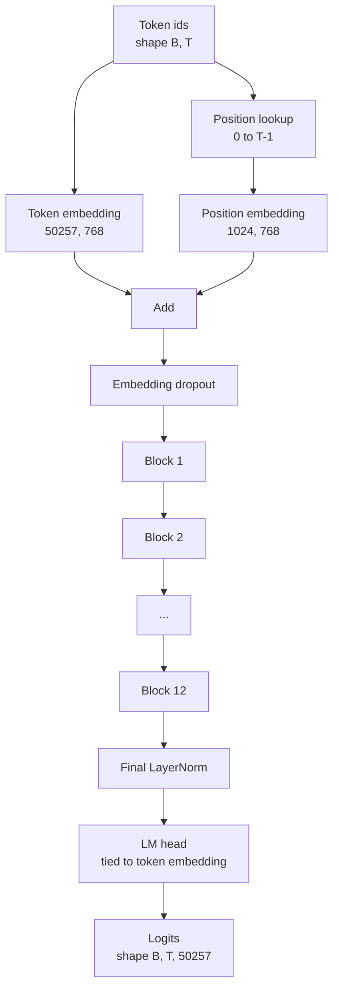
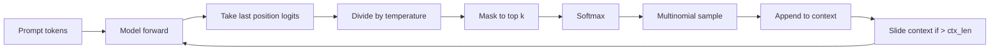

# Montagem do Modelo GPT

> Doze blocos empilhados, um embedding de token, um embedding de posição aprendido, uma LayerNorm final e uma cabeça de modelo de linguagem vinculada. Esse é o modelo GPT completo de 124 milhões de parâmetros. Esta lição monta essas peças em uma classe funcional, conta os parâmetros para confirmar que o modelo corresponde à referência de 124M, e gera texto com amostragem multinomial, temperatura e top-k.

**Tipo:** Construção
**Idiomas:** Python
**Pré-requisitos:** Lições 30 a 34 da Fase 19
**Tempo:** ~90 minutos

## Objetivos de Aprendizado

- Montar o bloco transformer da lição 34 em um modelo GPT completo: embedding de token, embedding de posição, N blocos, LayerNorm final, cabeça do modelo de linguagem.
- Reproduzir a configuração de 124 milhões de parâmetros: vocab 50257, contexto 1024, embedding 768, doze cabeças, doze camadas.
- Vincular os pesos da cabeça do modelo de linguagem ao embedding de token e explicar por que isso economiza ~38 milhões de parâmetros nessa escala.
- Gerar texto a partir de um prompt com amostragem multinomial, escalonamento de temperatura e truncamento top-k, mantendo o comprimento de contexto com janela deslizante.
- Medir a contagem de parâmetros e o custo do forward pass contra a referência de 124M.

## O Problema

Um bloco transformer não faz nada sozinho. Você precisa transformar ids de token em vetores, misturar informação posicional, rodá-los pela pilha e projetar de volta para logits do vocabulário. Esqueça qualquer um desses quatro passos e o modelo ou não faz forward, ou deriva na informação posicional, ou não consegue falar.

O formato do modelo também importa. O GPT-2 small de referência tem 124 milhões de parâmetros com exatamente a configuração acima. Os números não são mágicos. Vocab 50257 vezes embedding 768 é a tabela de token. Posição 1024 vezes 768 é a tabela de posição. Doze blocos com aproximadamente 7 milhões de parâmetros cada são 84 milhões. A cabeça final reutiliza a tabela de token por weight tying. Some as partes e você chega a 124 milhões. Construir um modelo cuja contagem de parâmetros não corresponde à referência é um sinal de que você conectou algo errado.

## O Conceito



Ids de token se tornam vetores de token. Ids de posição se tornam vetores de posição. Os dois são somados e enviados pela pilha. A LayerNorm final é a peça fora dos blocos que sobrevive em toda variante moderna. A cabeça de LM reutiliza a matriz de embedding de token, que é o que weight tying significa.

### Weight tying

O embedding de token tem formato `(vocab, d_model)`. A cabeça do modelo de linguagem precisa projetar de `d_model` de volta para `vocab`. Essas são transpostas uma da outra. Vincular as duas significa literalmente o mesmo tensor de parâmetros, usado duas vezes. Com vocab 50257 e d_model 768, a matriz tem 38 milhões de parâmetros. Desvinculada, você paga duas vezes. Vinculada, você paga uma vez e ainda recebe um sinal de gradiente ligeiramente mais limpo porque o embedding e a cabeça são atualizados juntos.

### Embedding de posição é aprendido, não senoidal

O GPT-2 usa um embedding de posição aprendido. A tabela de posição é um tensor de parâmetros com formato `(1024, 768)`. O modelo consulta a posição 0 até T-1 em cada forward e adiciona a consulta ao embedding de token. Esta é a mais simples das esquemas de posição (RoPE, ALiBi, T5 relative bias são as alternativas) e é o que a referência de 124M usa.

### Geração: temperatura, top-k, multinomial

A geração é autoregressiva. Em cada passo, o modelo retorna logits sobre o vocabulário completo em cada posição. Você pega apenas a última posição, divide pela temperatura, opcionalmente mascara todos os logits exceto os top k para infinito negativo, faz softmax para obter probabilidades e amostra um token da distribuição resultante.



Três botões, três comportamentos diferentes. Temperatura perto de zero colapsa para greedy. Temperatura um corresponde à distribuição natural do modelo. Top-k um é greedy. Top-k quarenta filtra a cauda longa. As combinações importam; a próxima lição sobre treinamento usa geração como sinal de avaliação qualitativo.

## Construa

`code/main.py` implementa:

- `class GPTConfig` dataclass com os padrões de 124M: `vocab_size=50257`, `context_length=1024`, `d_model=768`, `num_heads=12`, `num_layers=12`, `mlp_expansion=4`, `dropout=0.1`, `use_bias=True`, `weight_tying=True`.
- `class GPTModel` com embedding de token, embedding de posição, embedding dropout, doze `TransformerBlock`s, LayerNorm final e um `lm_head` que se vincula ao embedding de token quando a flag está ativada.
- Um helper `count_parameters` que retorna a contagem de parâmetros únicos (para que weight tying seja respeitado na contagem).
- Uma função `generate` que faz temperatura, top-k, multinomial e contexto de janela deslizante.
- Uma demo que constrói o modelo, imprime a contagem de parâmetros ao lado da referência de 124M e gera uma sequência curta a partir de um prompt fixo para mostrar o pipeline de ponta a ponta.

Execute:

```bash
python3 code/main.py
```

Saída: contagem de parâmetros ao lado da referência de 124M, ids de token gerados a partir de um prompt aleatório e confirmação de que a cabeça de LM e o embedding de token compartilham armazenamento quando o tying está ativado.

Para manter a demo rápida, o script também roda uma configuração minúscula (`d_model=64`, `num_layers=2`) de ponta a ponta e imprime a sequência de tokens gerados inline. A configuração de 124M é construída, mas apenas sua contagem de parâmetros e um forward pass são exercitados.

## Stack

- `torch` para a matemática de tensores, autograd e infraestrutura de módulos.
- `code/main.py` reimplementa o mesmo padrão de bloco da lição 34 localmente.

## Padrões de produção no mundo real

Três padrões fazem a diferença entre um modelo que roda e um modelo que é lançado.

**Inicialize as projeções residuais pequenas.** A projeção de saída da attention e a segunda linear da MLP alimentam diretamente uma soma residual. Inicializar essas com o mesmo desvio padrão que toda outra linear dá um fluxo residual que cresce com a profundidade e empurra a LayerNorm final para um regime quente. Escale o std por `1 / sqrt(2 * num_layers)` para essas duas projeções; o fluxo residual fica em uma faixa saudável por doze camadas.

**Cache o tensor de ids de posição, não recalcule.** `torch.arange(T)` aloca memória nova a cada forward. Aloque uma vez em `__init__` para o contexto máximo, fatie as primeiras T entradas por chamada e pule a ida e volta do alocador.

**Vincule pesos no nível de parâmetro, não apenas por cópia.** Definir `lm_head.weight = token_embedding.weight` compartilha o tensor; copiar não. O otimizador precisa atualizar um parâmetro e o grafo de autograd precisa de uma acumulação. Se você copiar, a cabeça deriva do embedding e o weight tying não lhe dá nada.

## Use

- A classe de modelo nesta lição tem o mesmo formato da que a próxima lição treina.
- Substituir o embedding de posição aprendido por RoPE te dá a família LLaMA sem tocar no bloco ou na cabeça.
- Substituir GELU por SiLU e LayerNorm por RMSNorm te dá as mudanças restantes da família LLaMA.
- A função de geração funciona com qualquer fonte de logits, não apenas este modelo. Você pode puxar logits de um arquivo GPT-2 pré-treinado na lição 37 e reutilizar o mesmo loop de geração.

## Exercícios

1. Desvincule a cabeça de LM do embedding de token e recont os parâmetros. Verifique que o delta é 50257 vezes 768 = 38 milhões.
2. Substitua o embedding de posição aprendido por uma tabela senoidal computada na construção. Confirme que o modelo ainda faz forward e que a contagem de parâmetros cai em 786.432.
3. Adicione uma flag `greedy=True` à geração que pula a amostragem e escolhe argmax. Confirme que a sequência é determinística entre execuções.
4. Adicione um botão `repetition_penalty` que divide o logit de qualquer token no prompt ou no histórico gerado por uma constante antes do softmax. Mostre em um prompt fixo que valores acima de um reduzem a contagem de repetições na saída.
5. Adicione amostragem `top_p` (nucleus) ao lado de `top_k`. Verificação de duas linhas de que a soma das probabilidades dos tokens mantidos excede `top_p`.

## Termos-Chave

| Termo | O que as pessoas dizem | O que realmente significa |
|-------|----------------------|--------------------------|
| Weight tying | "Embeddings vinculados" | A cabeça de LM e o embedding de token compartilham o mesmo tensor de parâmetros; economiza vocab vezes d_model parâmetros e corresponde à referência GPT-2 |
| Embedding de posição | "Posições aprendidas" | Uma tabela separada com formato (comprimento de contexto, d_model) somada aos vetores de token; aprendida de ponta a ponta |
| Contexto de janela deslizante | "Limite de contexto" | Quando o prompt mais tokens gerados excedem o comprimento de contexto, descarte os tokens mais antigos para que a janela ativa caiba |
| Amostragem top-k | "Truncamento K" | Mantenha os K logits com os maiores valores, mascara o resto para infinito negativo, softmax sobre o restante |
| Temperatura | "Temperatura de amostragem" | Divida os logits por T antes do softmax; T menor que 1 aumenta a confiança, T igual a 1 mantém a distribuição natural, T maior que 1 achatamento |

## Leitura Complementar

- Fase 19 lição 34 para o bloco que este modelo empilha.
- Fase 19 lição 36 para o loop de treinamento que direciona este modelo com loss de cross-entropy.
- Fase 19 lição 37 para carregar pesos pré-treinados GPT-2 nesta arquitetura exata.
- Fase 7 lição 07 (modelagem de linguagem causal GPT) para a matemática de previsão de próximo token.
- Fase 10 lição 04 (pré-treinamento mini GPT) para o procedimento original de treinamento na mesma arquitetura.
