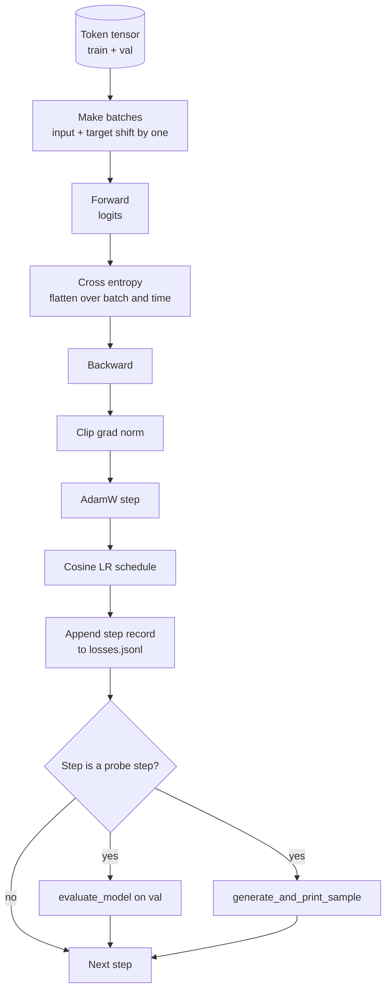

# Loop de Treinamento e Avaliação

> Um loop que não mede é um loop que mente. Esta lição constrói o loop de treinamento que direciona o modelo GPT: AdamW com divisão de weight decay, um schedule de taxa de aprendizado com warmup linear e decaimento cosseno, um helper `calc_loss_batch`, uma passagem `evaluate_model` em dados reservados, uma sonda qualitativa `generate_and_print_sample` a cada K passos, e um log JSONL de losses que você pode plotar depois. O mesmo esqueleto treina todo decoder LLM que você construir.

**Tipo:** Construção
**Idiomas:** Python
**Pré-requisitos:** Lições 30 a 35 da Fase 19
**Tempo:** ~90 minutos

## Objetivos de Aprendizado

- Construir um loop de treinamento que computa loss de cross-entropy com o alinhamento correto de entrada e target para previsão de próximo token.
- Configurar AdamW com weight decay aplicado a tensores de peso e não a tensores de LayerNorm ou bias.
- Implementar um schedule de taxa de aprendizado com warmup linear e decaimento cosseno, e interpretar a LR resultante ao longo do tempo.
- Avaliar em um split reservado com `evaluate_model` para que a loss de avaliação seja comparável entre execuções.
- Gerar uma amostra qualitativa a cada K passos com `generate_and_print_sample` para pegar divergência antes que a curva de loss mostre.
- Persistir a loss por passo em JSONL para que você possa recarregar, plotar e disponibilizar o log de treinamento como entregável.

## O Problema

Um script de treinamento que imprime a loss mas não faz mais nada falha de três formas. Ele não consegue te dizer se a loss está diminuindo pelo motivo certo (o modelo pode estar overfitting no conjunto de treinamento e nunca aprender). Não consegue te dizer se uma divergência está começando (a loss pode explodir por um passo e se recuperar, ou um passo e cair). Não consegue te dizer o que o modelo aprendeu (loss é um escalar; uma amostra gerada é um parágrafo). As três falhas ficam escondidas a menos que o loop meça.

O loop nesta lição mede de três formas. Loss no batch de treinamento a cada passo. Loss em um batch reservado a cada K passos. Uma continuação gerada a partir de um prompt fixo a cada K passos. O log de treinamento vai para JSONL para que o artefato seja o testemunho do loop.

## O Conceito



As duas peças não óbvias são o alinhamento de loss e a divisão de decay do AdamW.

### Alinhamento de loss

O modelo prevê o próximo token em cada posição. Se o batch de entrada é tokens `[t0, t1, t2, t3]`, o batch de target deve ser `[t1, t2, t3, t4]`. Cross-entropy é computada no formato flat `(batch * seq, vocab)` contra o target flat `(batch * seq,)`. Esqueça o deslocamento e você treina o modelo para prever ele mesmo, o que converge para zero loss sem aprender nada útil.

### Divisão de decay do AdamW

Weight decay regulariza tensores de peso, mas não escalas de normalização ou biases. Colocar decay na escala da LayerNorm lentamente empurra a escala para zero e quebra a normalização. Colocar decay em um bias é matematicamente inofensivo mas desperdiça ciclos. A divisão padrão é: tensores com formato de matriz (pesos lineares, tabelas de embedding) recebem decay, qualquer coisa que pareça uma escala ou deslocamento não recebe.

### Schedule com warmup e cosseno

Warmup eleva a taxa de aprendizado de zero para o alvo ao longo de algumas centenas de passos para que o estado do otimizador tenha tempo de se popular. Decaimento cosseno reduz a taxa de aprendizado de volta para zero ao longo dos passos restantes para que a fase final faça fine-tuning dos pesos com um passo pequeno. A combinação é o schedule mais comum no treinamento de LLMs de pesos abertos porque elimina a maioria dos momentos frágeis nos primeiros mil e nos últimos mil passos.

### Avaliação reservada

`evaluate_model` roda um número fixo de batches do split de validação, acumula loss, divide pela contagem de batches e retorna. Sem gradiente. Sem dropout. O número é reproduzível entre execuções dado a mesma semente e o mesmo split. Reportar a loss reservada ao lado da loss de treinamento é como você identifica overfitting.

### Amostragem qualitativa como sinal inicial

Um modelo cuja loss de treinamento cai lindamente mas cujas amostras geradas são todas o mesmo token está quebrado. Um modelo cuja curva de loss parece plana mas cujas amostras geradas se refinam em palavras coerentes está aprendendo. A sonda qualitativa roda mais rápido que ler a curva completa e pega modos que o escalar perde.

## Construa

`code/main.py` implementa:

- `make_batches(token_ids, batch_size, context_length)` que fatia um long tensor de token em pares de entrada e target.
- `calc_loss_batch(model, inputs, targets)` que faz forward, achata e retorna a loss escalar de cross-entropy.
- `evaluate_model(model, val_loader, max_batches)` que itera um número fixo de batches de validação sem gradiente e retorna a loss média.
- `generate_and_print_sample(model, prompt, max_new_tokens)` que roda a função de geração da lição 35 em um prompt fixo e imprime o resultado.
- `build_param_groups(model, weight_decay)` que produz a lista de parâmetros AdamW de dois grupos.
- `cosine_with_warmup(step, warmup_steps, total_steps, max_lr, min_lr)` que retorna a LR em um passo dado.
- `train(...)` que roda o loop, persiste `outputs/losses.jsonl` e imprime a loss de avaliação e uma amostra a cada `eval_every` passos.
- Uma demo que treina um modelo minúsculo em dados sintéticos por um pequeno número de passos, escreve um log JSONL e imprime a loss de avaliação e uma amostra nos pontos de sonda. A demo roda em menos de um minuto na CPU.

Execute:

```bash
python3 code/main.py
```

Saída: linha de loss por passo, loss de avaliação a cada passo de sonda, uma amostra gerada a cada passo de sonda, e um `outputs/losses.jsonl` final que você pode carregar com `json.loads` por linha.

## Stack

- `torch` para autograd, otimizador e módulos.
- `main.py` reimplementa o `GPTModel` da lição 35 e módulos de suporte localmente.

## Padrões de produção no mundo real

Três padrões transformam o loop de livro didático em algo que você pode deixar rodando a noite.

**Clipagem de norma de gradiente é inegociável.** Um batch ruim (dados anômalos, uma explosão de LR, um caso numérico de borda) produz um gradiente enorme que apaga horas de treinamento. `torch.nn.utils.clip_grad_norm_(params, max_norm=1.0)` após `backward` e antes de `step` mantém o otimizador em uma faixa segura. O valor de clipagem é um parâmetro livre; um é o padrão que sobrevive na maioria dos setups.

**Log JSONL retomável, não estado pickle.** Registros de loss por passo como linhas `{"step": int, "train_loss": float, "lr": float}` em JSONL são duráveis: qualquer crash deixa um artefato legível, você pode grep, pode plotar com trinta linhas de Python e pode retomar treinamento lendo o último passo. Estado pickle te prende ao layout exato do módulo que produziu o arquivo, o que é frágil entre refatorações.

**Batches de avaliação extraídos de uma fatia fixa.** Os tokens de validação são fatiados em batches no início do script, não on-the-fly. A reproduzibilidade depende dos batches de avaliação serem idênticos de execução em execução; caso contrário, comparar loss de avaliação entre duas execuções mede o shuffle dos batches tanto quanto o modelo.

## Use

- O loop nesta lição é o mesmo esqueleto que treina um modelo de 124M em dados reais. Substitua o tensor de token sintético por um loader estilo `datasets` e o loop roda sem alteração.
- O log JSONL é o entregável que transforma uma execução de treinamento em evidência. A próxima lição usa um para comparar um checkpoint recém-treinado com um pré-treinado.
- A sonda de amostra qualitativa é o catch-all que a loss escalar não consegue substituir.

## Exercícios

1. Adicione testes unitários `weight_decay_groups()` que confirmam que parâmetros de escala e bias ficam no grupo sem decay e pesos de linear e embedding ficam no grupo de decay.
2. Substitua tokens aleatórios sintéticos por bytes de um pequeno arquivo de texto para que a demo treine em algo legível. Verifique que a amostra gerada usa caracteres presentes no arquivo.
3. Adicione um piso `min_lr` de 10 por cento de `max_lr` ao schedule cosseno e refaça o plot.
4. Salve um checkpoint a cada `eval_every` passos além do log JSONL. Adicione uma flag `resume_from` que recarrega o estado do modelo e do otimizador.
5. Registre throughput por passo (tokens por segundo) ao lado da loss e confirme que ele fica em uma faixa estável.

## Termos-Chave

| Termo | O que as pessoas dizem | O que realmente significa |
|-------|----------------------|--------------------------|
| Alinhamento de loss | "Deslocar por um" | Tokens de entrada nas posições 0..T-1, tokens de target nas posições 1..T; cross-entropy é computada em formatos achatados |
| Divisão de decay | "Dois grupos" | AdamW recebe tensores com formato de matriz com weight decay e tensores de escala ou bias sem |
| Warmup | "Rampa" | A taxa de aprendizado sobe de zero para o alvo ao longo de um número fixo de passos para que o estado do otimizador possa se popular |
| Batches de avaliação | "Batches reservados" | Uma fatia fixa do tensor de tokens de validação, fatiada uma vez no início do script, usada de forma idêntica a cada sonda |
| Sonda qualitativa | "Impressão de amostra" | Uma geração curta a partir de um prompt fixo impressa a cada K passos para pegar modos de falha que a loss sozinha esconde |

## Leitura Complementar

- Fase 19 lição 35 para o modelo que o loop direciona.
- Fase 19 lição 37 para carregar pesos pré-treinados no mesmo modelo.
- Fase 10 lição 04 (pré-treinamento mini GPT) para o procedimento com dados reais.
- Fase 10 lição 10 (avaliação) para a superfície de avaliação além da loss de cross-entropy.
