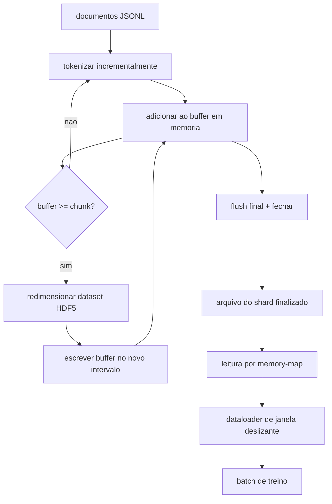

# Aula 43: Corpus Tokenizado HDF5

> O corpus baixado precisa pousar em um layout que o trainer consiga streamar em velocidade de linha. JSONL em disco nao sobrevive 16 workers de dataloader. HDF5 com um dataset inteiro redimensionavel e em blocos sobrevive. Esta aula constrói tokenizacao em streaming em um dataset HDF5 redimensionavel, com escrita em shards em multiplos arquivos, leitura por memory-mapping no treinamento, e um dataloader de janela deslizante que produz sequencias de comprimento fixo com o packing correto.

**Tipo:** Build
**Linguagens:** Python
**Prerequisitos:** Aulas 30-37 da Fase 19
**Tempo:** ~90 minutos

## Objetivos de Aprendizado

- Faz streaming de documentos em um dataset HDF5 inteiro redimensionavel com chunking deterministico.
- Compartilhar a escrita em multiplos arquivos HDF5 para que falha seja limitada e paralelismo seja possivel.
- Ler tokens de volta pelo layout em blocos do HDF5 respaldado por page-cache para que o dataloader copie para buffers de batch apenas no momento do batch.
- Implementar um dataloader de janela deslizante que emite sequencias de treino de comprimento fixo com regras de packing explicitas.

## O Problema

Uma execucao moderna de treino de modelo de linguagem le tokens a centenas de milhares de amostras por segundo em dezenas de workers. JSONL em disco morre na primeira falha de page-cache frio: o parser de JSON e lento, os limites dos documentos nao sao acessiveis, e buscar "amostra 4.217.884" requer escanear o arquivo. Mesmo Parquet, que comprime bem, nao se encaixa bem porque o trainer nao quer colunas; ele quer um stream plano de tokens com acesso aleatorio O(1).

HDF5 encaixa porque oferece um dataset em blocos, redimensionavel, apenas de inteiros cujos blocos sao amigaveis a page-cache no momento da leitura. O trainer pede um slice de `tokens[3.200.000 : 3.200.8192]` e o HDF5 copia o hyperslab solicitado da page-cache para um array NumPy recem-alocado. O custo e um handle de arquivo aberto e uma pegada de page-cache por tamanho de bloco por worker, o que e despreivel comparado ao custo de decodificar JSONL.

O problema de construcao e tornar o lado da escrita honesto. Datasets redimensionaveis sao faceis de usar errado: escrever um documento por vez e o arquivo HDF5 fica fragmentado ao ponto de inutilizavel. Escrever todos os documentos em um resize e a perda do processo perde o shard inteiro. A disciplina certa e buffer-depois-estender, com um tamanho de buffer que casa com o tamanho do bloco, e uma escrita em shards que divide a carga de trabalho entre arquivos para que um crash perda no maximo um shard.

## O Conceito



### HDF5 redimensionavel feito certo

O dataset de tokens e criado com `maxshape=(None,)` e um `chunks=(chunk_size,)` fixo. A escrita procede armazenando tokens em um array NumPy de comprimento `chunk_size`. Quando o buffer enche, o dataset e redimensionado exatamente por `chunk_size` e o buffer e escrito no novo intervalo. No final do shard o buffer residual e escrito em um intervalo parcial final. Toda escrita e contigua e alinhada ao bloco exceto a ultima, que o leitor e informado para truncar no `token_count` gravado nos atributos HDF5 do shard.

### Escrita em shards

Um unico arquivo HDF5 e um unico ponto de falha. O pipeline escreve shards em paralelo: cada shard de entrada da aula 42 da Fase 19 produz um shard de saida HDF5. Um indice `shards.json` registra, por shard, o caminho do arquivo, a contagem de tokens, a contagem de documentos, e um sha256 sobre os tokens. O trainer le `shards.json` para computar offsets globais e validar o corpus.

### Leitura por memory-map

No treinamento cada worker abre sua parte dos arquivos HDF5 em modo `swmr=True` e pede `tokens[start:stop]`. O layout em blocos do HDF5 torna isso uma leitura respaldada por page-cache uma vez que o bloco esteja quente. O worker nunca materializa o arquivo inteiro: o slice e copiado no buffer de batch do dataloader, que o dataloader entao copia em um tensor de treino de memoria fixa no momento do batch. O caminho quente tem uma syscall por transicao de bloco; todo o resto e acesso a RAM.

### Dataloader de janela deslizante

O dataloader e o unico estagio que conhece o comprimento da sequencia de treino. Ele escolhe um indice de inicio aleatorio no stream global de tokens, le `window_size + 1` tokens, e retorna `(input, target) = (tokens[:-1], tokens[1:])`. Limites de documento nao sao forcados: uma janela pode atravessar dois documentos, com um `boundary_token_id` explicito entre eles para que o modelo aprenda a usar o separador. Essa e a regra padrao de packing; tambem e a regra que um iniciante esquece, acabando com um corpus de 8 por cento tokens de limite de treino e 92 por cento texto natural.

## Construa

`code/main.py` implementa:

- `Tokenizer` - um tokenizador deterministico de nivel byte suficiente para o demo. A interface e `encode(text) -> list[int]` e `vocab_size`.
- `HDF5ShardWriter` - abre um dataset inteiro redimensionavel, armazena tokens em buffer ate o tamanho do bloco, redimensiona e escreve em passos de tamanho fixo, registra `token_count` e `sha256` como atributos HDF5 no fechamento.
- `ShardedTokenizationPipeline` - itera documentos de entrada, roteia para um writer, e emite um indice `shards.json`.
- `MmapTokenStore` - abre arquivos de shard para leituras por memory-map, computa offsets globais, expoe uma unica API `get_slice(start, stop)`.
- `SlidingWindowDataloader` - escolhe janelas aleatorias do stream global e rende arrays NumPy `(input_ids, target_ids)`.

Um demo no final do arquivo constroi um corpus minusculo em memoria, tokeniza em dois shards, abre por memory map, roda o dataloader por 10 batches, e imprime a forma por batch e um checksum.

Execute:

```bash
python3 code/main.py
```

O script sai zero e imprime checksums por batch.

## Padroes de Producao

Quatro padroes escalam esta aula para uma execucao de treino real.

**Tamanho do bloco igual a leitura tipica.** O trainer le `window_size + 1` tokens por amostra. Coloque o bloco do HDF5 em um multiplo de `window_size` e as leituras ficam alinhadas a page-cache. Blocos desalinhados cortam o throughput pela metade porque cada amostra toca dois blocos.

**Contagem de tokens nos atributos, nao no dataset.** O slice final do dataset pode estar parcialmente cheio porque o tamanho do bloco nao divide o limite do documento. Armazene a `token_count` real como um atributo HDF5 no dataset e tenha o leitor truncar nesse valor. Sem isso o leitor entra em tokens preenchidos por zero e o modelo aprende a predizer zero.

**sha256 em shards com verificacao paralela.** Cada shard tem seu proprio sha256 sobre os bytes de token. O trainer pode verificar todos os shards em paralelo antes do treinamento comecar. Um sha256 errado falha a execucao cedo, nao na epoca tres depois de dezesseis horas.

**`swmr=True` em ambos os lados, com `libver="latest"` no writer.** O modo Single-Writer-Multiple-Reader requer que o writer abra com `libver="latest"`, crie todos os datasets de antemao, e entao defina `file.swmr_mode = True`. Depois disso o writer deve chamar `dataset.flush()` apos cada resize para que workers leitores (abertos com `swmr=True`) vejam dados consistentes. Pular `libver="latest"` ou habilitar SWMR apos mudancas estruturais e uma fonte comum de falhas "arquivo travado".

## Use

Padroes de producao:

- **Um HDF5 por shard de origem.** O downloader (aula 42) emite um shard por URL; a tokenizacao (esta aula) emite um HDF5 por shard de origem. O mapeamento 1:1 torna resume e recuperacao de falha parcial trivial.
- **Id do token de fronteira.** O token de fronteira faz parte do vocabulario do tokenizador e e o unico token que o dataloader injeta. A loss de treino mascara o token de fronteira se o modelo deva ignora-lo; caso contrario ele aprende a usa-lo como separador de sequencia.
- **`shards.json` como fonte de verdade.** Adicionar um novo shard significa escrever o HDF5, computar seu sha256, e adicionar uma entrada. O trainer le o arquivo uma vez ao iniciar e nunca toca na listagem do diretorio.

## Entregue

`outputs/skill-hdf5-tokenized-corpus.md` descreveria, em um projeto real, qual tokenizador alimenta o pipeline, qual tamanho de bloco combina com a janela do trainer, onde `shards.json` vive no versionamento, e como os workers do dataloader sao distribuidos entre arquivos. Esta aula entrega o motor.

## Exercicios

1. Adicionar um flag `--compression gzip` no writer HDF5 e medir o custo no throughput no corpus de demo. Defenda o padrao escolhido.
2. Adicionar uma seed deterministica ao dataloader de janela deslizante e verificar que duas execucoes com a mesma seed produzem batches identicos.
3. Adicionar um modo `--validate` que le todos os shards, recalcula o sha256 sobre seus tokens, e compara com `shards.json`. CI deve rodar isso antes do treinamento comecar.
4. Comparar o throughput do dataloader em tamanhos de bloco iguais a, metade de, e dois vezes o tamanho da janela. Reportar o efeito da page-cache.
5. Adicionar um flag `--max-document-tokens` que trunca documentos muito longos no momento da escrita. Defenda o trade-off versus decidir no momento da leitura.

## Termos Chave

| Termo | O que as pessoas dizem | O que realmente significa |
|-------|------------------------|---------------------------|
| Dataset redimensionavel | "Apenas acrescimo" | Um dataset HDF5 com `maxshape=(None,)` que cresce via chamadas `resize` em passos do tamanho do bloco |
| Layout em blocos | "Como HDF5 armazena" | Paginas de tamanho fixo em disco que o kernel pode mapear em memoria e o dataloader pode ler de forma contigua |
| Modo `swmr` | "Leitura durante escrita" | Modo Single-Writer-Multiple-Reader que permite que workers do dataloader compartilhem o arquivo com seguranca |
| Indice de shards | "shards.json" | O indice duravel de todos os shards de tokens com offsets e hashes de conteudo |
| Janela deslizante | "Amostra de treino" | Um slice de comprimento fixo do stream global de tokens que o trainer combina com seu target deslocado por um |

## Leitura Adicional

- [Documentacao de chunking do HDF5](https://docs.hdfgroup.org/hdf5/v1_14/) - o layout de dataset em blocos e redimensionavel que esta aula usa
- [Guia do usuario h5py](https://docs.h5py.org/en/stable/) - bindings Python para HDF5
- [Memory mapping do NumPy](https://numpy.org/doc/stable/reference/generated/numpy.memmap.html) - a primitiva de leitura que o HDF5 expoe via h5py
- Fase 19 · 42 - o downloader cujo output esta aula tokeniza
- Fase 19 · 44 - o agendamento coseno que consome este dataloader
- Fase 19 · 45 - o loop AMP que envolve o passo de treino
