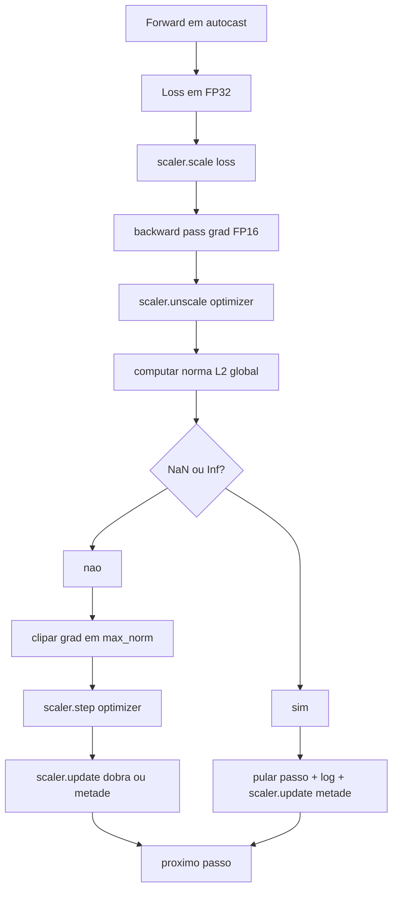

# Aula 45: Gradient Clipping e Mixed Precision

> O optimiser e o agendamento da aula anterior assumem que gradientes sao razoaveis. Geralmente nao sao. Um unico batch ruim pode disparar a norma do gradiente em tres ordens de grandeza. Treinamento em precisao mista amplifica isso introduzindo overflow de FP16 no lado da loss. Esta aula constrói os dois cintos de seguranca que treinamento de producao nao pode funcionar sem: gradient clipping para uma norma L2 global configurada, e um loop de precisao mista com autocast e GradScaler que detecta NaN e Inf, pula o passo com seguranca, e loga o fator de escala para investigacao.

**Tipo:** Build
**Linguagens:** Python
**Prerequisitos:** Aulas 30-37 da Fase 19
**Tempo:** ~90 minutos

## Objetivos de Aprendizado

- Computar a norma L2 global sobre todos os gradientes de parametro e clipar in-place quando exceder um limiar configurado.
- Envolver um passo de treino em autocast mais GradScaler para que forward e backward passes em FP16 sobrevivam a overflow.
- Detectar NaN e Inf na loss ou gradiente, pular o passo do optimiser, e logar o pulo.
- Reportar o fator de escala do GradScaler a cada passo para que uma longa sequencia de pulos seja visivel imediatamente.

## O Problema

Uma execucao de treinamento que rodou limpo ontem produz uma curva de loss que vai vertical no passo 8.217. O culpado e um unico batch cuja norma de gradiente e 4.200, vinte vezes o pico anterior. Sem clipping o optimiser aplica um passo que reseta tudo que o modelo tinha aprendido na hora anterior. Com um clip L2 global em norma 1.0, o mesmo batch contribui uma atualizacao de norma unitaria; a loss continua em sua linha de tendencia; a execucao sobrevive.

Treinamento em precisao mista empurra o throughput em 2-3x computando o forward pass e a maioria do backward pass em FP16. O custo e que FP16 tem uma faixa de expoente estreita. Um gradiente tipico que faz overflow em FP16 avalia como Inf, que se propaga pelas camadas seguintes como NaN, que seta todos os pesos para NaN no proximo passo do optimiser. O GradScaler do PyTorch resolve isso multiplicando a loss por um fator de escala grande antes do backward pass e dividindo os gradientes pelo mesmo fator antes do passo do optimiser. Se qualquer gradiente for Inf ou NaN no momento do unscale, o scaler pula o passo e divide o fator de escala por dois; se os N passos anteriores foram limpos, o scaler dobra o fator. Ao longo do treinamento o fator encontra o maior valor que a faixa de FP16 permite.

O problema de construcao e conectar os dois corretamente. Clip antes do unscale e o limiar esta sobre gradientes escalados; clip apos o unscale e a ordem de operacoes no GradScaler importa. A ordem certa e: `scaler.scale(loss).backward()`, depois `scaler.unscale_(optimizer)`, depois `clip_grad_norm_`, depois `scaler.step(optimizer)`, depois `scaler.update()`. Qualquer outra ordem produz um loop silenciosamente quebrado.

## O Conceito



### Norma L2 global

A norma L2 global e a norma euclidiana do vetor de gradiente concatenado, nao a norma por parametro. O PyTorch implementa isso como `torch.nn.utils.clip_grad_norm_(parameters, max_norm)`. A funcao retorna a norma pre-clip para que a aula possa logar tanto o valor natural quanto o valor clipado, o que e necessario para o diagnostico de "estamos clipando a cada passo".

### autocast e GradScaler

`torch.amp.autocast(device_type)` e o gerenciador de contexto que seletivamente roda operacoes elegiveis (a maioria das operacoes de classe matmul) em FP16. `torch.amp.GradScaler(device_type)` e o auxiliar que escala a loss antes do backward e de-escala os gradientes antes do passo do optimiser. Os dois sao projetados juntos; usar um sem o outro e um erro de configuracao que o teste deve pegar.

A aula usa autocast em CPU porque e o que roda em CI; o mesmo padrao se transfere literalmente para CUDA mudando `device_type="cpu"` para `device_type="cuda"`. O GradScaler em CPU e um stub (CPU autocast ja opera em BF16 por padrao e nao precisa de loss scaling), mas a aula inclui os pontos de chamada para que a conexao seja identica ao loop de GPU.

### Deteccao de NaN e Inf

A deteccao acontece em dois lugares. Primeiro, a propria loss e checada com `torch.isfinite` antes do backward; uma loss Inf ou NaN nao produz gradientes uteis e e pulada sem entrar no optimiser. Segundo, apos `scaler.unscale_(optimizer)` a aula escaneia os gradientes de-escalados com `has_non_finite_grad(...)` e trata qualquer Inf ou NaN como um pulo. As duas checagens juntas cobrem tanto os modos de falha do forward pass quanto do backward pass.

### Diagnosticos do fator de escala

O fator de escala e o estado interno do GradScaler. A cada passo a aula le `scaler.get_scale()` e loga ao lado da taxa de aprendizado e norma do gradiente. Uma execucao saudavel mostra o fator de escala subindo em potencias de dois ate saturar proximo de `2^17` ou `2^18`. Uma execucao problematica mostra o fator oscilando entre valores altos e baixos, que e o sinal de que os gradientes do modelo estao as vezes no range e as vezes nao. O diagnostico e invisivel sem log.

## Construa

`code/main.py` implementa:

- `clip_global_l2_norm` - um wrapper em torno de `torch.nn.utils.clip_grad_norm_` que retorna tanto a norma pre-clip quanto post-clip.
- `has_non_finite_grad` - um auxiliar que escaneia gradientes para NaN e Inf.
- `AmpTrainState` - envolve um modelo, um optimiser `AdamW`, um GradScaler, e um dispositivo de autocast. Expoe um `step(inputs, targets)` que roda o pipeline completo de clipping, escala, e pulo em NaN.
- `StepLog` e `SkipLog` - registros estruturados por passo.
- Um demo que treina um modelo `nn.Linear` pequeno por 20 passos, injeta um Inf no gradiente no passo 5 para exercitar o caminho de pulo, e imprime o log resultante.

Execute:

```bash
python3 code/main.py
```

O script sai zero e imprime um log por passo com cada linha rotulada `STEP` ou `SKIP`; pelo menos uma linha e um `SKIP`.

## Padroes de Producao

Quatro padroes elevam o loop a um passo de treino de producao.

**Contador de pulo como alerta, nao como linha de log.** Alguns poucos passos pulados por execucao de treino sao saudaveis. Centenas de pulos por epoca sao um alerta duro: o modelo esta em um regime que FP16 nao aguenta e o loop esta falhando silenciosamente. A aula rastreia uma taxa de pulo rolante de 1.000 passos e em producao, faria page para uma taxa acima de 5 por cento.

**Limiar de clip vive na config.** `max_norm = 1.0` e o padrao moderno para treino de modelos de linguagem. Varra-o primeiro em um modelo pequeno; limites maiores deixam o modelo se recuperar de batches genuinamente dificeis; limites menores limitam o pior caso ao custo de uma curva de loss mais ruidosa. O limiar pertence a mesma config YAML ou JSON do agendamento da aula 44.

**Log de norma vai para um CSV com o agendamento.** As colunas do CSV sao `step, lr, grad_l2_pre_clip, grad_l2_post_clip, loss, skipped, skip_reason, scaler_scale`. Um reviewer que abre o arquivo ve o agendamento, a historia do gradiente, o fator de escala, e o resultado do pulo (com sua razao) em uma unica linha. Dividir as colunas entre arquivos e uma receita para analises desalinhadas.

**`scaler.update()` roda a cada passo, mesmo no pulo.** Em um passo limpo o scaler le seu contador de no-inf, incrementa, e possivelmente dobra o fator. Em um passo pulado o scaler divide o fator por dois e reseta o contador. Esquecer o `update()` no caminho de pulo e o bug que produz "o fator de escala nunca mudou."

## Use

Padroes de producao:

- **Dispositivo do autocast combina com o dispositivo do optimiser.** `torch.amp.autocast(device_type="cuda")` para treino em GPU; `torch.amp.autocast(device_type="cpu")` para CPU. Misturar dispositivos produz um erro de tipo silencioso que aparece como uma curva de loss que parece normal mas um modelo que nao esta aprendendo.
- **Checagem de loss antes do backward.** `torch.isfinite(loss).all()` e uma reducao de tensor; o custo e despreivel e a economia em uma loss NaN e um passo inteiro de treinamento. Sempre rode.
- **`set_to_none=True` em `zero_grad`.** Seta gradientes para `None` em vez de zero, o que deixa o optimiser pular computacao para grupos de parametros nao afetados. A configuracao e uma melhoria gratuita de throughput e uma leve reducao de superficie de bug.

## Entregue

`outputs/skill-clip-amp.md` descreveria, em um projeto real, qual limiar de clip e dispositivo de autocast o passo de treino usa, onde o CSV por passo vive no versionamento, e qual e o limiar de alerta de taxa de pulo em producao. Esta aula entrega o motor.

## Exercicios

1. Substituir a injecao sintetica de Inf por um pico real de loss (multiplicar o target de um batch por 1e8) e verificar que o caminho de pulo e acionado.
2. Adicionar um modo `--bf16` que troca o autocast para BF16 em vez de FP16. BF16 tem uma faixa de expoente mais larga que FP16 e raramente precisa de loss scaling; verificar que a taxa de pulo cai para zero no mesmo demo.
3. Adicionar um teste unitario que o wrapper de gradient clip retorne as normas pre-clip e post-clip corretamente quando nenhum clipping ocorre.
4. Adicionar um calculo de taxa de pulo por janela deslizante e um flag CLI que falhe a execucao se a taxa exceder um limiar configurado por 100 passos consecutivos.
5. Conectar o loop para escrever o CSV canonico (`step, lr, grad_l2_pre_clip, grad_l2_post_clip, loss, skipped, skip_reason, scaler_scale`) e confirmar que o arquivo sobrevive a um Ctrl-C com flush apos cada linha.

## Termos Chave

| Termo | O que as pessoas dizem | O que realmente significa |
|-------|------------------------|---------------------------|
| Norma L2 global | "Alvo do clip" | Norma euclidiana do vetor de gradiente concatenado em todos os parametros treinaveis |
| autocast | "Precisao mista" | Execucao seletiva em FP16 (ou BF16) de operacoes elegiveis dentro de um bloco `with` |
| GradScaler | "Escalador de loss" | Auxiliar que multiplica a loss antes do backward e de-escala gradientes antes do passo do optimiser |
| Pulo | "Passo ruim" | Um passo do optimiser recusado porque o gradiente ou loss nao era finito; o scaler divide o fator por dois |
| Fator de escala | "Estado do scaler" | O multiplicador atual do GradScaler; dobra apos trechos limpos e divide por dois a cada pulo |

## Leitura Adicional

- [Micikevicius et al., Mixed Precision Training (arXiv 1710.03740)](https://arxiv.org/abs/1710.03740) - a proposta original de loss scaling
- [Pascanu, Mikolov, Bengio, On the difficulty of training recurrent neural networks (arXiv 1211.5063)](https://arxiv.org/abs/1211.5063) - o paper de referencia de gradient clipping
- [torch.amp.GradScaler do PyTorch](https://docs.pytorch.org/docs/stable/amp.html) - a API do scaler que esta aula envolve
- [torch.nn.utils.clip_grad_norm_ do PyTorch](https://docs.pytorch.org/docs/stable/generated/torch.nn.utils.clip_grad_norm_.html) - a primitiva de clipping que esta aula usa
- Fase 19 · 42 - o downloader cujo corpus alimenta o loop
- Fase 19 · 43 - o dataloader que o loop consome
- Fase 19 · 44 - o agendamento que este loop compoe
