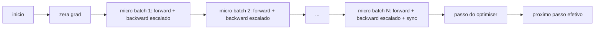
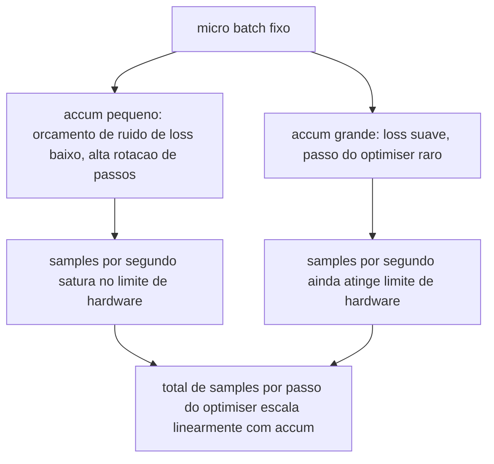

# Aula 46: Acumulacao de Gradiente

> Treine com um batch efetivo que voce nao pode pagar, um micro-batch por vez. Escale a segure o passo do optimiser, e deixe os gradientes se acumularem.

**Tipo:** Build
**Linguagens:** Python
**Prerequisitos:** Aulas 42 a 45 da Fase 19
**Tempo:** ~90 minutos

## Objetivos de Aprendizado

- Derivar a identidade de batch efetivo: `effective_batch = micro_batch * accum_steps`.
- Implementar o escalonamento de loss por micro-batch para que o gradiente acumulado corresponda a um unico backward de batch completo.
- Pular a sincronizacao do optimiser ate o ultimo micro-batch (sync-no-ultimo-passo).
- Ler uma curva de throughput versus batch efetivo e explicar o retorno decrescente.

## O Problema

Voce quer treinar com um batch efetivo de 512 porque a curva de loss e mais suave e o passo do optimiser faz mais sentido nessa escala. O acelerador na mesa segura 32 exemplos antes de ficar sem memoria. Dobrar o batch nao e opcao. Reduzir o modelo pela metade nao e opcao. O truque que o campo alcancou em 2017 e nunca parou de usar e rodar 16 backward passes, deixar os gradientes se acumularem dentro dos buffers de parametro, e so dar o passo do optimiser quando a contagem alcancar o alvo.

O risco e que a loss nao e mais o mesmo numero que era no batch maior. A cross entropy de 16 mini-batches somados naive e 16 vezes a loss de um batch completo. Sem escalonamento, a direcao do gradiente e correta mas a magnitude e errada, e o passo do optimiser e 16 vezes grande demais. A solucao e uma divisao. A solucao tambem e facil de esquecer.

## O Conceito



O contrato e curto:

- A loss de cada micro-batch e dividida por `accum_steps` antes do `backward()`. PyTorch soma gradientes em `param.grad` por padrao; a divisao empurra a soma acumulada de volta para a escala certa.
- O passo do optimiser dispara uma vez por batch efetivo, apos o backward do ultimo micro-batch. Dar o passo no meio da acumulacao distorce cada parametro que o resto da execucao depende.
- O estado do optimiser (buffers de momento, momentos de Adam) avanca uma vez por passo efetivo, nao uma vez por micro-batch. As medias moveis exponenciais caso contrario veriam a frequencia errada e queimariam o agendamento.
- Em um unico dispositivo isso e burocracia. Em um cluster multi-rank o mesmo padrao envolve os micro-batches nao-finais em um contexto `no_sync` que pula o all-reduce de gradiente; o ultimo micro-batch reduz o gradiente acumulado completo em uma passagem em vez de pagar o custo de rede N vezes.

### A prova de equivalencia em codigo

```python
loss = criterion(model(x_full), y_full)
loss.backward()
opt.step()
```

e equivalente a

```python
for x, y in chunks(x_full, y_full, n):
    scaled = criterion(model(x), y) / n
    scaled.backward()
opt.step()
```

ate a ordem de soma de ponto flutuante. O buffer de gradiente acumulado no final do loop e o mesmo tensor que um unico backward de batch completo produziria. O codigo da aula afirma isso com uma diferenca max-abs sob 1e-4 em `equivalence_check`.

### Onde o custo vai

Cada micro-batch custa um forward e um backward. Com acumulacao voce troca memoria por tempo. A curva de throughput em `outputs/accum-curve.json` mostra o que acontece quando o batch efetivo cresce com micro-batch fixo:



Nao ha almoço gratis. Dobrar `accum_steps` dobra o tempo de parede por passo do optimiser. O que muda e a variancia da estimativa do gradiente: no mesmo orcamento de parede voce fez menos passos do optimiser mas cada um foi media sobre mais amostras. A literatura trata batch grande e batch pequeno como problemas de otimizacao diferentes; a aula aqui e mecanica, nao estatistica.

## Construa

`code/main.py` e o artefato executavel. Ele faz tres coisas.

### Passo 1: verificacao de equivalencia

`equivalence_check()` constroi duas copias da mesma rede com a mesma seed. Uma ve um batch de 16 amostras em um forward pass. A outra ve quatro chunks de 4 amostras com a loss dividida por quatro. A funcao compara os buffers de gradiente antes do passo do optimiser e os parametros depois. A afirmacao e `max_abs_diff < 1e-4`.

### Passo 2: padrao sync-no-ultimo-passo

`train_one_optimizer_step` caminha micro-batches. Para cada micro-batch exceto o ultimo ele entra em `no_sync_context(model)`. Em um processo unico o contexto e um no-op; em DDP e aqui que o all-reduce de gradiente e pulado. A burocracia e a mesma independente disso. Um `sync_counter` registra quantas vezes saimos do escopo no_sync; para N micro-batches a contagem e uma por passo efetivo, nao N.

### Passo 3: a curva de throughput

`sweep_effective_batches` roda o mesmo modelo com micro-batch fixo e uma lista de passos de acumulacao. Para cada configuracao ele loga:

- `samples_per_sec`: total de amostras vistas dividido pelo tempo de parede
- `median_step_ms`: percentil 50 por passo efetivo
- `sync_calls`: pontos coletores exercidos
- `avg_loss`: media entre os passos do optimiser da varredura

O output cai em `outputs/accum-curve.json` e e reutilizavel de um notebook.

Execute:

```bash
python3 code/main.py
```

O script imprime a diferenca de equivalencia, depois a tabela de varredura, depois o caminho do JSON. Codigo de saida zero.

## Use

Em treinamento de producao, acumulacao de gradiente vive atras de um botao. O padrao do PyTorch e `accumulation_steps = effective_batch // (micro_batch * world_size)`. Frameworks que voce nao pode usar aqui envolvem o mesmo loop, mas os passos sao os mesmos: escalar a loss, pular sync em micros nao-finais, acumular, dar um passo.

Tres padroes no mundo real:

- O tamanho do micro-batch e escolhido para saturar a memoria do dispositivo. Qualquer coisa menor desperdicia ciclos do acelerador. Qualquer coisa maior trava.
- O batch efetivo e escolhido a partir de um agendamento de taxa de aprendizado. Batches efetivos grandes precisam de taxas de aprendizado escaladas e warmup; essa e a regra de escalonamento linear falada desde 2017.
- A contagem de acumulacao e a ponte entre os dois e o unico botao que voce pode sintonizar em tempo de execucao sem reescrever o dataloader.

## Entregue

`outputs/skill-gradient-accumulation.md` captura a receita para que um colega possa jogar em um novo repo: escalar loss por `accum_steps`, pular sync do optimiser em micros nao-finais, dar o passo do optimiser uma vez por batch efetivo, logar throughput versus batch efetivo como JSON para que o trade-off seja visivel.

## Exercicios

1. Reexecutar a varredura com `--num-steps 100` e plotar samples por segundo versus batch efetivo. Onde a curva achata?
2. Adicionar uma variante de escalonamento errado (sem divisao) e mostrar a diferenca de parametro no passo 1 versus a referencia.
3. Trocar SGD por AdamW e confirmar que o estado do optimiser avanca uma vez por passo efetivo, nao uma vez por micro-batch.
4. Introduzir um wrapper `DistributedDataParallel` real e rotear o `no_sync_context` para seu metodo. Confirmar que sync_calls cai em N-1 por batch efetivo.
5. Modificar a verificacao de equivalencia para comparar duas divisoes de micro diferentes (2 por 8 vs 4 por 4) e explicar qualquer tolerancia que voce precise relaxar.

## Termos Chave

| Termo | O que as pessoas dizem | O que realmente significa |
|-------|------------------------|---------------------------|
| Micro batch | O batch que voce forwarda | O slice que cabe na memoria em um unico forward pass |
| Accum steps | Backward passes por passo | Numero de backwards somados antes de um passo do optimiser |
| Batch efetivo | O batch | Micro batch vezes accum_steps vezes tamanho do mundo de paralelismo de dados |
| Escalonamento de loss | Dividir por N | Divisao por micro-batch para que gradientes somados correspondam ao batch completo |
| Sync no ultimo | Pular o resto | Rodar o coletivo de gradiente apenas no ultimo backward na janela |

## Leitura Adicional

- Docs do PyTorch sobre `DistributedDataParallel.no_sync` para a versao em producao do truque sync-no-ultimo-passo.
- Goyal et al., 2017, sobre escalonamento linear para treinamento em batch grande, a razao canonica para se importar com batch efetivo.
- Issue tracker do PyTorch sobre interacoes de acumulacao de gradiente com de-escalacao de precisao mista.
- Aulas 42 a 45 da Fase 19 cobrem o modelo, dataloader, optimiser, e esqueleto de trainer que esta aula assume.
- Aula 47 da Fase 19 cobre checkpoint e resume para que uma longa execucao de acumulacao sobreviva a um limite de relogio.
