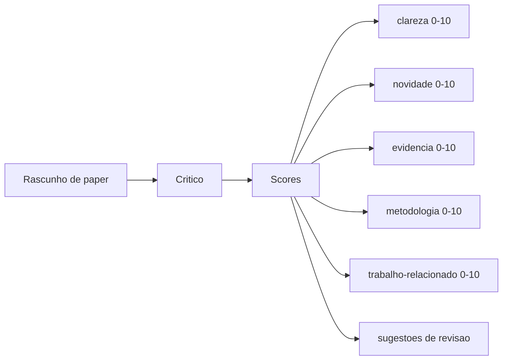
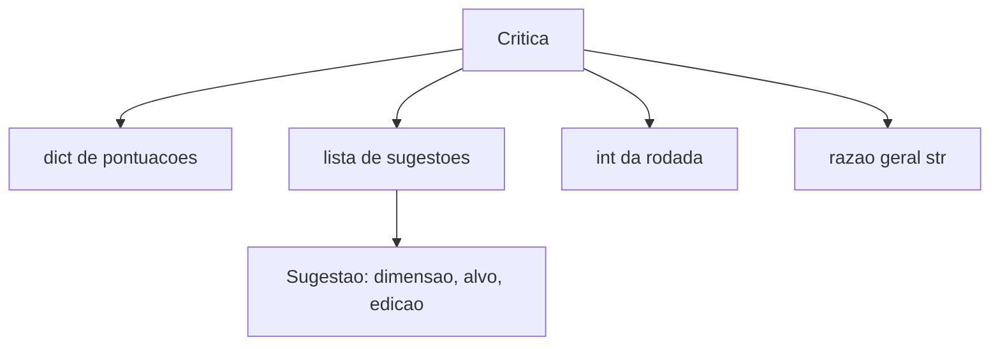
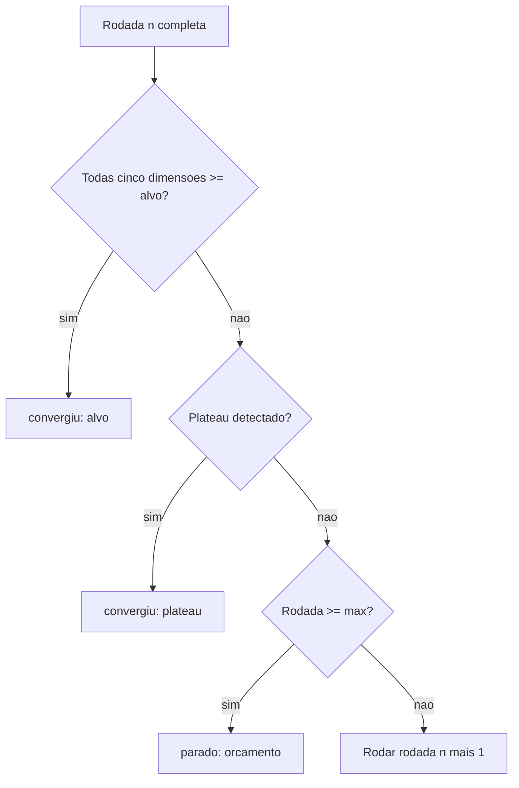
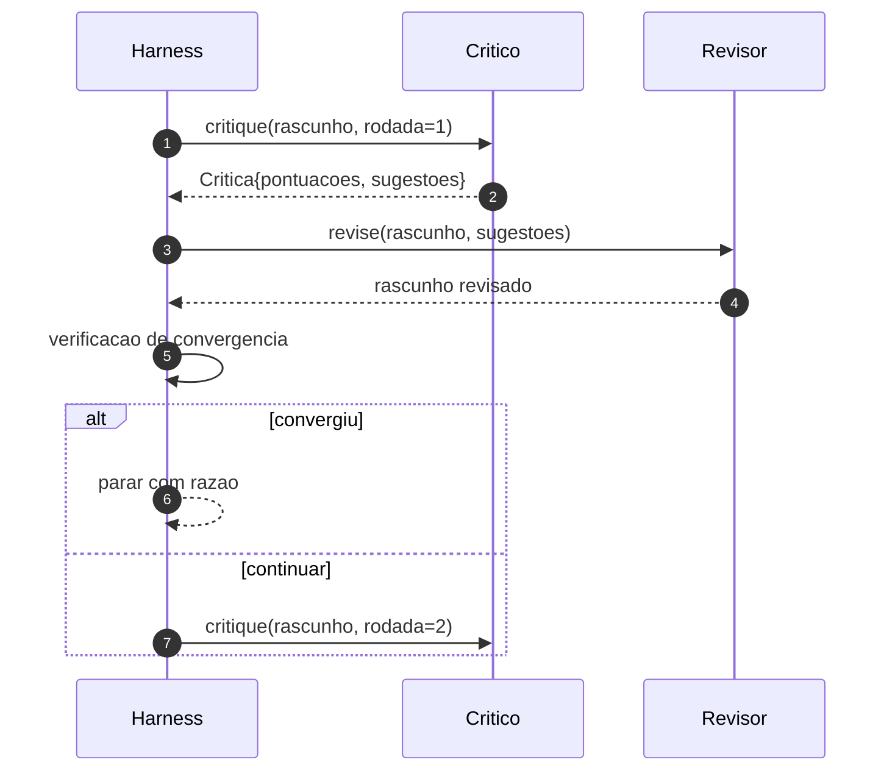

# Aula 55: Loop de Critica

> Um critico que retorna "parece bom" na primeira vez esta quebrado. Um critico que sempre retorna "precisa de trabalho" tambem. O critico interessante e aquele que converg, e voce precisa engenheirar a convergencia.

**Tipo:** Build
**Linguagens:** Python
**Prerequisitos:** Aulas 50-53 da Fase 19
**Tempo:** ~90 minutos

## Objetivos de Aprendizado
- Pontuar um rascunho de paper em cinco dimensoes fixas: clareza, novidade, evidencia, metodologia, trabalho-relacionado.
- Aplicar a critica de cada rodada como um diff de revisao estruturado em vez de uma reescrita de forma livre.
- Detectar convergencia comparando pontuacoes entre rodadas; parar em plateau, alvo atingido, ou orcamento esgotado.
- Limitar rodadas com um orcamento de max-iteracao para que um critico nao-convergente nao rode pra sempre.
- Emitir um trace por rodada para que o dashboard ou o proximo estagio renderize a trajetoria de pontuacao.

## Por que cinco dimensoes fixas

Um critico de forma livre e um modelo que retorna um paragrafo de sugestoes. A revisao da proxima rodada trata o paragrafo como contexto ambiental. Se a reescrita ataca a critica e nao verificavel porque a critica nunca teve estrutura.

Cinco dimensoes dao ao harness um contrato.



A pontuacao e um vetor. O harness monitora cada dimensao entre rodadas. Uma revisao que aumenta clareza mas derruba evidencia e uma regressao em evidencia, e a verificacao de convergencia ve isso. Um critico apenas de modelo nao pode oferecer essa garantia.

## A forma da Critica



Cada sugestao carrega a dimensao que ela melhora, a secao que ela alva, e uma instrucao de `edit` que o revisor pode aplicar. O revisor tambem e chamavel. A aula entrega um revisor deterministico que interpreta a instrucao de edicao como uma operacao de append-a-secao. Um revisor guiado por modelo interpretaria o mesmo campo como prompt. O contrato nao muda.

## Regras de convergencia, em ordem

O loop de critica termina quando qualquer uma de tres condicoes dispara.



O alvo e o caso mais restritivo: cada uma das cinco dimensoes (clareza, novidade, evidencia, metodologia, related_work) deve atingir `>= target_score` (padrao `8.0`) antes que o loop retorne sucesso. Uma media alta com uma dimensao fraca nao basta. A deteccao de plateau compara a media da rodada atual com a media da rodada anterior. Se a melhoria estiver abaixo de `plateau_epsilon` (padrao `0.1`) por duas rodadas consecutivas, o loop sai com `plateau`. O orcamento e um limite duro em rodadas (padrao `5`) e sai com `budget`.

A ordem importa. Alvo vence plateau que vence orcamento. Se a rodada tres atinge o alvo na mesma iteracao que tambem acionaria um plateau, o resultado e `target`, nao `plateau`.

## Por que a deteccao de plateau roda sobre duas rodadas

Um plateau de uma rodada e ruido. Um critico real retorna uma pontuacao levemente diferente a cada iteracao mesmo em um rascunho fixo, porque a pontuacao deterministica ainda depende de quais sugestoes foram aplicadas e em que ordem. Exigir duas rodadas consecutivas de plateau filtra esse ruido. Se o harness reportar um plateau, o rascunho realmente parou de melhorar.

## O critico deterministico nesta aula

A aula nao chama um modelo. O critico entregue e um chamavel que pontua um rascunho baseado em tres sinais: comprimento medio do corpo de secao (clareza), contagem de figuras e contagem de citacoes (evidencia), e um campo `originality_tag` nos metadados do paper (novidade). O revisor sabe como empurrar cada pontuacao para cima.

```text
clareza      cresce quando o comprimento medio do corpo de secao aumenta
novidade     cresce quando originality_tag e setado para "high"
evidencia    cresce quando figure_refs de uma secao nao esta vazio
metodologia  cresce quando uma secao intitulada "Method" existe com corpo
trabalho-relacionado cresce quando uma secao intitulada "Related Work" existe com corpo
```

O revisor interpreta cada sugestao como um append direcionado. Apos a rodada um, o harness pode observar a pontuacao subindo. Os testes usam essa propriedade para afirmar que o loop reduz a lacuna.

## O contrato completo do loop



O harness owns o contador de rodadas, o trace, e a verificacao de convergencia. O critico owns a pontuacao. O revisor owns o diff. Nenhum dos tres toca o estado do outro.

## A saida Trace

Cada rodada emite um evento de trace com o numero da rodada, o vetor de pontuacao, a contagem de sugestoes, e o veredicto de convergencia. O trace completo e retornado ao lado do rascunho final. Um dashboard downstream pode renderizar o grafico de pontuacao-por-rodada. A proxima aula, o agendador de iteracao, le o trace para decidir se a分支 vale manter.

## Orcamentos que protegem contra criticos ruins

Um critico que produz sugestoes que nunca melhoram a pontuacao vai travar o loop no teto de max-iteracao. O trace torna isso visivel: cinco rodadas, pontuacoes estaveis, veredicto `budget`. O usuario le isso como um bug do critico, nao do rascunho. A alternativa, mostrar apenas o rascunho final, esconde o diagnostico. Design com trace primeiro o mostra.

## Como ler o codigo

`code/main.py` define `Critique`, `Sugestao`, protocolo `Critic`, protocolo `Reviser`, `CriticLoop`, e uma fabrica `make_deterministic_critic_pair` que retorna o critico deterministico e um revisor correspondente. Uma forma minima de `Paper` e incluida para que a aula fique autocontida.

`code/tests/test_critic_loop.py` cobre: melhoria monotona apos a rodada um, convergencia por alvo em um rascunho sintonizado, deteccao de plateau apos duas rodadas estaveis, esgotamento de orcamento quando nenhuma sugestao melhora, aplicacao de sugestoes pelo revisor, e forma do trace.

## Indo adiante

Duas extensoes que uma implementacao real vai querer. Primeiro, pesos de dimensao: um paper para workshop pesa novidade mais que metodologia; um journal pesa o inverso. A verificacao de convergencia vira uma media ponderada. Segundo, criticos pareados: um critico pontua, um segundo critico julga as sugestoes antes do revisor ve-las. Ambos adicionam valor, ambos compoem na mesma forma `Critique`.

A aposta e o vetor de pontuacao. Uma vez que a critica e estruturada, toda outra melhoria, regra de convergencia, dashboard, critico pareado, cai sem mudar o loop.
