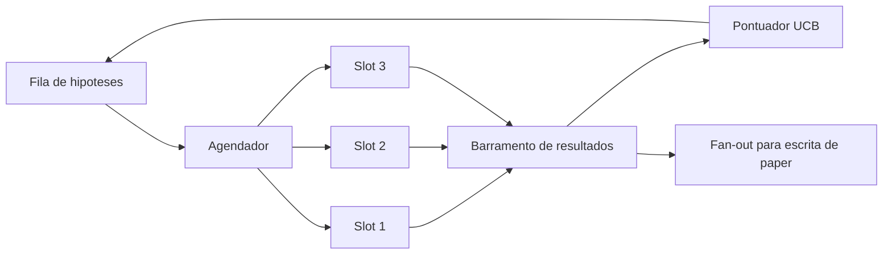
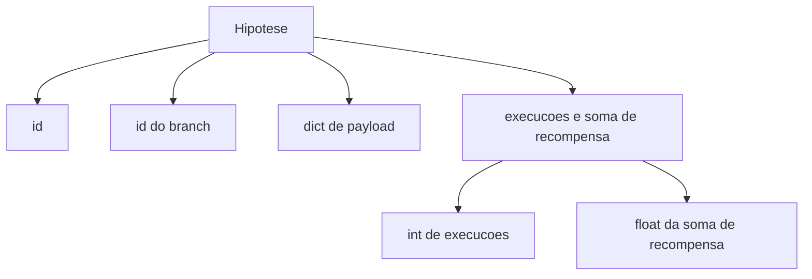
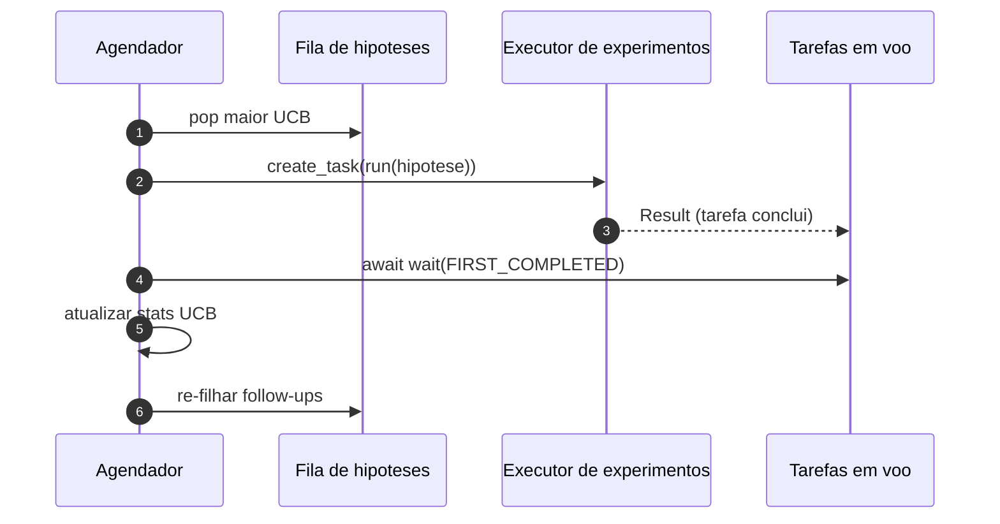

# Aula 56: Agendador de Iteracao

> Um loop de pesquisa sem um agendador e uma fila com ilusoes. O agendador e onde o loop decide o que parar de explorar, e essa decisao e o jogo inteiro.

**Tipo:** Build
**Linguagens:** Python
**Prerequisitos:** Aulas 50-53 da Fase 19
**Tempo:** ~90 minutos

## Objetivos de Aprendizado
- Modelar um workflow de pesquisa como uma fila de hipoteses alimentando slots paralelos de experimentos cujos resultados voltam.
- Rodar multiplos experimentos concorrentemente com asyncio para que o agendador mantenha todos os slots ocupados.
- Pontuar cada分支 de hipotese com UCB para que o agendador possa podar branches de baixo rendimento sem abandonar a exploracao.
- Despejar resultados terminados para um estagio de escrita de paper e um estagio de re-filamento para que um branch de alto rendimento gere hipoteses de follow-up.
- Mostrar um trace por iteracao com pontuacoes de branch, ocupacao de slot, e decisoes de poda.

## Por que um agendador, nao uma worklist

Uma worklist flat roda trabalhos na ordem de submissao. Isso serve quando cada trabalho e independente. Pesquisa nao e independente: uma descoberta do experimento tres muda a prioridade dos experimentos quatro e cinco. Um agendador que le o resultado fan-in e reordena a fila faz mais trabalho util por unidade de computacao.

A escolha de design interessante e a regra de pontuacao. Um pontuador ganancioso sempre escolhe o lider atual e nunca explora. Um pontuador uniforme nunca explora. UCB (upper confidence bound) e o caminho do meio: explorar o lider enquanto reserva capacidade para branches que foram menos testados.

## A forma do sistema



A fila guarda hipoteses. O agendador escolhe a hipotese com maior UCB quando um slot libera. Cada slot roda um experimento de forma assincrona. Experimentos terminados despejam seu resultado no barramento. O barramento atualiza estatisticas UCB no branch de origem e faz fan-out para o estagio de escrita de paper quando o rendimento de um branch cruza um limiar.

## A forma da Hipotese



`branch` e a chave para as estatisticas UCB. Multiplas hipoteses podem compartilhar um branch (o branch e a direcao de pesquisa; a hipotese e um teste dentro dela). `runs` e a contagem de experimentos completos para aquele branch, `reward_sum` e a recompensa acumulada. UCB le ambos.

## Pontuacao UCB

A formula UCB usada nesta aula e a classica UCB1.

```text
ucb(branch) = media_recompensa(branch) + c * sqrt( ln(total_execucoes) / runs(branch) )
```

`total_execucoes` e a contagem de todos os experimentos completados em todos os branches. `c` e o peso de exploracao; a aula padrao e `sqrt(2)`. Um branch com zero execucoes recebe `+inf` para que branches nao-testados sejam sempre agendados primeiro. Um branch com alta media de recompensa mantem pontuacao alta ate outros branches alcancarem; um branch que roda muitas vezes sem muita recompensa e eclipsado por alternativas menos-executadas.

O gate de poda e separado do seletor. Poda remove um branch do agendamento futuro quando sua media de recompensa cai abaixo de um piso absoluto (padrao `0.2`) apos pelo menos `prune_after_runs` testes (padrao `3`). Isso mantem a fila limitada.

## Slots paralelos com asyncio

O agendador dirige experimentos com `asyncio.create_task`. Cada tarefa roda o executor de experimento (um chamavel `async def`) que retorna um `Result`. O loop principal espera no conjunto de tarefas em voo com `asyncio.wait(..., return_when=asyncio.FIRST_COMPLETED)` e dispara a atualizacao de pontuacao em cada conclusao.



Tres slots rodam concorrentemente. O loop principal nunca bloqueia em um experimento unico. O agendador continua iniciando novas tarefas assim que um slot libera, ate que a fila esteja vazia e nenhuma tarefa esteja em voo.

## Fan-out: gatilhos de paper

Quando a media de recompensa de um branch cruza `paper_threshold` (padrao `0.7`) e aquele branch ainda nao produziu um paper, o agendador despeja um evento `paper.trigger` em uma lista de saida. Downstream o escritor de paper da aula 54 pegaria isso. Nesta aula o gatilho e capturado como uma lista para que os testes possam afirmar.

## Fan-out: hipoteses de follow-up

Quando um resultado de alto rendimento pousa, o agendador pode chamar o `expander` fornecido pelo usuario para produzir uma ou mais hipoteses de follow-up no mesmo branch. O expander e uma funcao pura de `Result` para `list[Hipotese]`. A aula entrega um expander deterministico que produz dois follow-ups para qualquer resultado cuja recompensa exceda o limiar de paper.

## Orcamentos

Dois orcamentos protegem o agendador de loops descontrolados.

```text
max_experiments    : contagem total de experimentos rodados em todos os branches
max_seconds        : limite de tempo de parede (tempo asyncio)
```

Quando qualquer um dispara, o agendador para de agendar novas tarefas, espera as em voo, e retorna o trace final. O trace inclui um `stop_reason`.

## O Trace e o relatorio final

Cada decisao de agendamento (selecionar, despachar, resultado, podar, fan-out) emite um evento. O relatorio final resume estatisticas por branch, total de execucoes, total de tempo de parede, e os gatilhos de paper disparados. A proxima aula, o demo de ponta a ponta, le esse relatorio para dirigir o escritor de paper.

## Como ler o codigo

`code/main.py` define `Hipotese`, `Result`, `BranchStats`, `IterationScheduler`, e uma fabrica `make_deterministic_runner` que retorna um executor de experimento asyncio com recompensas previsiveis. O executor dorme por um `delay_ms` fixo (padrao `5ms`) para que a concorrencia seja observavel.

`code/tests/test_scheduler.py` cobre: UCB escolhe branches nao-testados primeiro, ocupacao de slots paralelos, gatilhos de paper quando limiar e cruzado, poda de branch apos testes de baixo rendimento, hipoteses de follow-up por fan-out, e saida por orcamento (tanto contagem de experimento quanto tempo de parede).

## Indo adiante

Tres extensoes que uma implementacao real vai querer. Primeiro, estatisticas UCB persistentes entre sessoes: as estatisticas atuais vivem em memoria; um agendador real faria checkpoint para que um restart preserve o orcamento de exploracao ja gasto. Segundo, pontuacao multi-objetivo: em vez de uma recompensa escalar, cada resultado emite um vetor e UCB vira um seletor estilo Pareto. Terceiro, bandits contextuais: o seletor condiciona em caracteristicas da hipotese (comprimento, complexidade) para que hipoteses similares compartilhem exploracao.

O agendador e o lugar onde pesquisa se torna mais que uma worklist. Uma vez que UCB esta conectado e os slots rodam em paralelo, toda outra melhoria compoe por cima.
