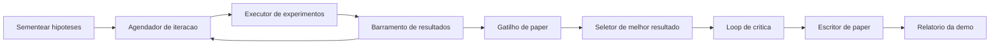
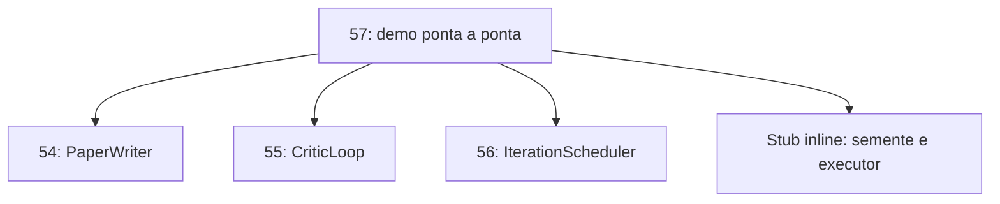
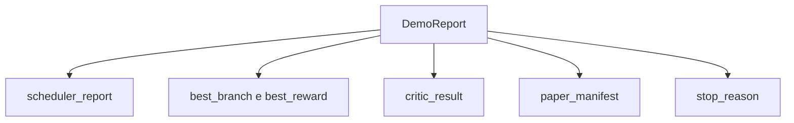

# Aula 57: Demo de Pesquisa Ponta a Ponta

> Um demo e o lugar onde todo contrato que voce escreveu antes precisa compor. Se qualquer um deles vazar, o demo e a aula que pega.

**Tipo:** Build
**Linguagens:** Python
**Prerequisitos:** Aulas 50-53 da Fase 19
**Tempo:** ~90 minutos

## Objetivos de Aprendizado
- Conectar o loop de auto-pesquisa ponta a ponta: semente de hipotese, executor de experimentos, agendador, loop de critica, escritor de paper.
- Compor as primitivas das quatro aulas anteriores da Track D via imports Python puros, nao um framework.
- Rodar o loop ate um termino auto-gerado e emitir um relatorio unico de demo que lista o output de cada estagio.
- Manter o demo deterministico para que a suíte de testes possa afirmar a forma final.
- Mostrar um modo de falha claro quando qualquer contrato de estagio quebra, para que o proxo estagio nao rode com uma entrada quebrada.

## O que compoe aqui



Cinco estagios. A sementacao e uma lista de tres hipoteses. O agendador roda seis experimentos entre elas com tres slots paralelos. O barramento reporta um ou mais gatilhos de paper. O seletor escolhe o unico melhor resultado. O loop de critica itera sobre um rascunho construido a partir desse resultado. O escritor de paper emite o LaTeX, BibTeX, e manifesto finais.

## Por que import, nao copiar

Cada aula anterior entrega um `main.py` com dataclasses e funcoes publicas. O demo importa eles ajustando `sys.path` para o diretorio pai de cada aula. Isso nao e conexao de framework; e o mesmo import que os arquivos de teste nas aulas anteriores ja usam.



O stub inline substitui as aulas 50 a 53: um pequeno gerador de hipoteses semente e uma funcao de recompensa sincrona. O usuario pode trocar o stub inline pelas primitivas reais dessas aulas ajustando dois imports.

## Garantias de determinismo

O demo e deterministico por construcao. O executor de experimentos usa numpy com seed. O revisor do loop de critica caminha dimensoes fixas em ordem fixa. O gerador de prosa do escritor de paper e o mock da aula 54. O seletor UCB do agendador desempata pela ordem de iteracao, nao por escolha aleatoria.

Dada a mesma semente, o demo emite o mesmo relatorio. O teste afirma essa propriedade rodando o demo duas vezes e comparando o manifesto.

## A forma do relatorio da demo



Cada campo vem literalmente do estagio upstream. O demo nao transforma nenhum output; ele os compoe. Esse e o teste que o demo e.

## Tratamento de modos de falha

Cada estagio ou sucesso ou levanta um erro tipado.

```text
Agendador ........ retorna SchedulerReport com stop_reason
                   em {queue_empty, max_experiments, deadline}
Selecao de melhor resultado . levanta NoTriggerError se nenhum gatilho de paper disparou
Loop de critica ...... retorna LoopResult com status converged ou stopped
Escritor de paper ..... levanta PaperValidationError em quebra de contrato
```

Uma falha em qualquer estagio faz curto-circuito no demo com uma excecao tipada. Os testes fixam esse contrato: `test_no_triggers_raises_typed_error` e `test_best_picker_raises_when_no_triggers` afirmam que o seletor levanta `NoTriggerError` / `BestResultError` quando nenhum branch disparou um gatilho, e o escritor nunca e invocado.

## O seletor de melhor resultado

O agendador emite gatilhos de paper por branch. O seletor escolhe o branch com a maior media de recompensa em todos os gatilhos. Empates sao desempatados por ordem alfabetica de branch id para que o demo seja deterministico. O seletor e uma funcao pura pequena; o teste o fixa em um relatorio de agendador fixo.

## Conectando o loop de critica

O loop de critica na aula 55 opera em um `MiniPaper`. O demo constroi um `MiniPaper` a partir do branch escolhido populando o resumo com o branch id, sementando duas secoes (Introducao e Resultados), e setando `originality_tag` a partir da media de recompensa do branch (high se `>= 0.8`, medium se `>= 0.6`, low caso contrario).

O revisor entao itera o rascunho ate convergencia. O output vai para o escritor de paper.

## Conectando o escritor de paper

O escritor de paper na aula 54 opera na forma completa `Paper` com figuras e bibliografia. O demo atualiza o `MiniPaper` convergido via `mini_to_full_paper`, que anexa uma figura para o branch selecionado e uma bibliografia sintetica pequena construida da uniao de chaves de citacao que o critico sugeriu. Cada citacao que o demo adiciona tambem e adicionada a lista de bibliografia, para que a validacao passe.

## Como ler o codigo

`code/main.py` define `BestResultError`, `NoTriggerError`, `DemoReport`, `pick_best_branch`, `build_mini_paper`, `mini_to_full_paper`, e `run_demo`. Os imports no topo ajustam `sys.path` uma vez e puxam `PaperWriter`, `CriticLoop`, e `IterationScheduler` de suas aulas.

`code/tests/test_e2e.py` cobre: demo roda ponta a ponta e emite um relatorio com os cinco campos populados, determinismo entre duas execucoes, `NoTriggerError` quando nenhum branch cruza o limiar, `PaperValidationError` quando o contrato do escritor quebra, o manifesto do paper contem a figura do branch escolhido, e o stop_reason do agendador e um dos valores esperados.

## Indo adiante

Tres extensoes que valem a pena uma vez que o demo esteja verde. Primeiro, estado persistente: o resultado de cada estagio escreve em um pequeno armazenamento JSON para que um restart possa retomar sem reexecutar os estagios baratos. Segundo, um dashboard: os eventos de trace do agendador e do loop de critica renderizam como uma unica linha do tempo. Terceiro, chamadas de modelo reais: trocar o gerador de prosa mock e o critico deterministico por guiados por modelo; a conexao nao muda.

O trabalho do demo e provar que composicao e a arquitetura. Cinco aulas, quatro imports, um relatorio. Da proxima vez que voce adicionar um estagio, a conexao cresce por exatamente uma linha.
